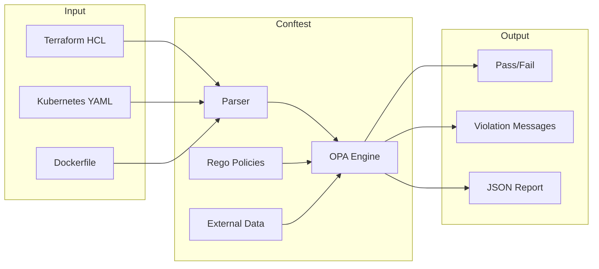

*[IaC]: Infrastructure as Code
*[K8s]: Kubernetes
*[OPA]: Open Policy Agent
*[PR]: Pull Request
*[RBAC]: Role-Based Access Control

# Policy as Code: OPA Guardrails With Fast Feedback

## Introduction

A developer opens a pull request for a Terraform change. Sixteen hours later, a security review rejects it: the S3 bucket lacks encryption. The developer fixes it, waits another day for re-review. This cycle—write, wait, reject, fix, wait—drains velocity and breeds resentment toward security processes.

Shift-left advocates say to check policies earlier. But "earlier" often means CI, which still means waiting for pipelines after pushing code. Real shift-left means _before the commit_—policy checks that run in seconds during `git add`, catching violations while the context is fresh and the fix is trivial.

This article covers building infrastructure guardrails with OPA (Open Policy Agent) and Conftest. The focus is on speed: pre-commit hooks that run in under two seconds, CI checks that parallelize across hundreds of policies, and feedback loops that make compliance a developer experience issue rather than a security bottleneck.

<Callout type="warning">
Policy adoption paradox: comprehensive policies with slow feedback get disabled. Minimal policies with fast feedback get expanded. Start with five critical policies—encryption enabled, no public access, resource limits, no privileged containers, no `:latest` tags—that run fast. Get adoption first, then add coverage.
</Callout>

The target architecture runs Conftest against Terraform plans and Kubernetes manifests at three stages: pre-commit for immediate feedback, CI for enforcement, and deployment pipelines for final validation. Each stage uses the same policies but different optimization strategies.

## Understanding OPA and Rego

### OPA Architecture

OPA is a general-purpose policy engine that decouples policy decisions from policy enforcement. You feed it structured data (JSON), it evaluates policies written in Rego, and it returns decisions. The engine itself is stateless—policies and data define behavior.

Three deployment modes serve different use cases:

- **Library mode**: Embed OPA directly in applications for authorization decisions. Go applications can import OPA as a package; other languages use WASM or REST APIs.
- **Daemon mode**: Run OPA as a sidecar or standalone service. Kubernetes admission controllers use this pattern—the API server sends admission requests to OPA, which returns allow/deny decisions.
- **CLI mode**: Evaluate policies from the command line. This is where Conftest enters: it wraps OPA's CLI with ergonomic defaults for infrastructure files.

Conftest handles the plumbing that makes OPA practical for IaC. It parses Terraform, Kubernetes YAML, Dockerfiles, and other formats into JSON that OPA can evaluate. It provides sensible output formatting, exit codes for CI, and project conventions for organizing policies.

```bash
# Basic Conftest usage
conftest test deployment.yaml --policy ./policies

# Test Terraform plan
terraform plan -out=tfplan
terraform show -json tfplan > tfplan.json
conftest test tfplan.json --policy ./policies/terraform
```


Figure: Conftest evaluation flow.

### Rego Fundamentals

Rego is a declarative language designed for querying nested data structures. If you've used SQL, the mental model is similar: you describe _what_ you want, not _how_ to compute it. Unlike SQL, Rego operates on hierarchical JSON rather than relational tables.

**Rules generate values.** A rule with no conditions always produces its value. A rule with conditions only produces its value when all conditions succeed:

```rego
# Unconditional: always true
default allow := false

# Conditional: true only when conditions match
allow if {
    input.user.role == "admin"
    input.action == "read"
}
```

**Rules with the same name combine.** Multiple rules with the same head form a logical OR—any rule matching makes the head true:

```rego
# Either condition makes allow true
allow if { input.user.role == "admin" }
allow if { input.resource.public == true }
```

**Iteration is implicit.** Referencing an array index with a variable iterates over all elements:

```rego
# Finds ANY container without limits
deny contains msg if {
    container := input.spec.containers[_]  # Iterate all containers
    not container.resources.limits
    msg := sprintf("Container '%s' missing resource limits", [container.name])
}
```

**Sets collect unique values.** Using `contains` with a rule head builds a set of all values where conditions match:

```rego
# Collects all violations into a set
deny contains msg if {
    # ... conditions ...
    msg := "violation message"
}
```

**External data enriches decisions.** The `data` object provides context beyond the immediate input—allowed registries, team mappings, environment configurations:

```rego
# data.allowed_registries loaded from JSON file
deny contains msg if {
    image := input.spec.containers[_].image
    registry := split(image, "/")[0]
    not registry in data.allowed_registries
    msg := sprintf("Image '%s' from unauthorized registry", [image])
}
```

With these fundamentals in place—rules, iteration, sets, and data—you have the building blocks for any infrastructure policy. The patterns below show how these primitives combine for common validation scenarios.

### Common Rego Patterns

| Pattern | Use Case | Example |
|---------|----------|---------|
| Required field | Ensure configuration exists | `not input.spec.selector` |
| Allowed values | Whitelist valid options | `input.type in {"ClusterIP", "NodePort"}` |
| Regex matching | Pattern validation | `regex.match("^[a-z][a-z0-9-]*$", name)` |
| Numeric constraints | Range validation | `input.replicas > 0; input.replicas <= 10` |
| Cross-resource | Reference related objects | `data.namespaces[input.metadata.namespace]` |
| Conditional | Environment-specific rules | `is_production; ... production-only rule ...` |

The patterns most useful for infrastructure policies combine iteration with existence checks:

```rego
# Required labels pattern
required_labels := {"app", "team", "environment"}

deny contains msg if {
    missing := required_labels - {label | input.metadata.labels[label]}
    count(missing) > 0
    msg := sprintf("Missing required labels: %v", [missing])
}
```
Code: Required labels pattern using set difference.

The same structure applies to allowed values—define the valid set, check membership, and generate a message with the violation and valid options:

```rego
# Allowed values pattern
allowed_types := {"ClusterIP", "NodePort"}

deny contains msg if {
    input.kind == "Service"
    not input.spec.type in allowed_types
    msg := sprintf("Service type '%s' not allowed. Use: %v", [input.spec.type, allowed_types])
}
```
Code: Allowed values pattern using set membership.

<Callout type="info">
Rego's learning curve is real but bounded. Most infrastructure policies use a small subset of the language: iteration, existence checks, set operations, and string formatting. Master these patterns and you'll handle 90% of use cases.
</Callout>

## Policy Design Principles

### Writing Effective Policies

Four principles separate policies that get adopted from policies that get bypassed:

**Single responsibility.** Each rule should check one thing. A 50-line rule that validates images, resources, _and_ labels produces confusing violations and resists modification. Split concerns into separate rules: `deny_unauthorized_image`, `deny_missing_resources`, `deny_missing_labels`. When a violation fires, developers know exactly what to fix.

**Actionable messages.** "Policy violation" tells the developer nothing. "Container missing resource limits" is better. "Container 'nginx' missing resource limits. Add `spec.containers[].resources.limits.cpu` and `memory`" is what they actually need. Include the resource name, the violation, and the fix path.

**Minimal false positives.** Precision matters more than recall. A policy that blocks valid configurations trains developers to request exceptions—or bypass the system entirely. Start permissive and tighten over time. Test against real configurations before enforcing. Provide escape hatches for legitimate edge cases.

**Fast evaluation.** Policies should evaluate in milliseconds, not seconds. Avoid external HTTP calls within policies—pre-load data into bundles. Avoid complex regex on large inputs. Avoid deep recursion. The goal is sub-second feedback that doesn't interrupt flow.

Structure violation messages consistently:

```text
[Resource Type] [Resource Name]: [Violation].
Fix: [Specific remediation]
```
Code: Violation message template.

Examples:

- `Deployment 'api-server': Missing required label 'team'. Fix: Add metadata.labels.team with your team name.`
- `Pod 'worker': Container 'app' uses image from unauthorized registry 'docker.io'. Fix: Use images from 'gcr.io/company-project' or 'artifactory.company.com'.`

### Policy Organization

Organize policies by technology, then resource type, then concern. This structure makes policies discoverable and enables selective evaluation—run only Terraform policies on Terraform files.

```text
policies/
├── kubernetes/
│   ├── pods/
│   │   ├── privileged.rego
│   │   ├── resources.rego
│   │   └── images.rego
│   ├── deployments/
│   │   ├── replicas.rego
│   │   └── labels.rego
│   ├── services/
│   │   └── types.rego
│   └── common/
│       ├── labels.rego
│       └── helpers.rego
├── terraform/
│   ├── aws/
│   │   ├── s3.rego
│   │   ├── iam.rego
│   │   └── security_groups.rego
│   └── common/
│       └── tags.rego
├── docker/
│   ├── base_images.rego
│   └── best_practices.rego
├── data/
│   ├── allowed_registries.json
│   ├── required_labels.json
│   └── team_mappings.json
└── lib/
    ├── helpers.rego
    └── constants.rego
```
Code: Policy directory structure.

Rego packages map to this directory structure. Use namespacing to group related policies and enable selective evaluation:

```rego
# Kubernetes pod security policies
package kubernetes.pods.security

deny contains msg if {
    # Pod security checks
}

# Kubernetes pod image policies
package kubernetes.pods.images

deny contains msg if {
    # Image validation checks
}

# Terraform AWS S3 policies
package terraform.aws.s3

deny contains msg if {
    # S3 bucket checks
}

# Shared helper library
package lib.helpers

is_kubernetes_resource if {
    input.apiVersion
    input.kind
}

has_label(obj, label) if {
    obj.metadata.labels[label]
}
```
Code: Policy namespacing by package.

Conftest uses the `--namespace` flag to selectively evaluate policies. This is how namespace organization pays off—you can run subsets of policies based on context:

```bash
# Run only Kubernetes policies on YAML files
conftest test deployment.yaml --namespace kubernetes

# Run only pod-specific policies
conftest test deployment.yaml --namespace kubernetes.pods

# Run all sub-namespaces (security, images, resources)
conftest test deployment.yaml --namespace kubernetes.pods --all-namespaces

# Run only Terraform AWS policies
conftest test tfplan.json --namespace terraform.aws

# Run all policies (default behavior)
conftest test deployment.yaml
```
Code: Selective policy evaluation with namespaces.

This enables layered enforcement: pre-commit runs fast, critical policies; CI runs comprehensive checks; deployment gates run everything. Same policies, different namespace filters.

<Callout type="success">
Put shared helper functions in `lib/helpers.rego` and import them with `import data.lib.helpers`. This avoids duplicating normalization logic across policies and makes updates propagate automatically.
</Callout>

## Testing Policies

### Unit Testing Rego

OPA includes a built-in test framework. Test files use `_test` suffix in the package name and define rules prefixed with `test_`. Each test rule should evaluate to `true` when the test passes.

The `with` keyword is the key to Rego testing—it lets you override `input` and `data` for a specific evaluation:

```rego
package kubernetes.pods.resources_test

import future.keywords.if
import data.kubernetes.pods.resources

# Test that valid config passes (no violations)
test_pod_with_limits if {
    count(resources.deny) == 0 with input as {
        "kind": "Pod",
        "metadata": {"name": "good-pod"},
        "spec": {
            "containers": [{
                "name": "app",
                "image": "nginx:1.21",
                "resources": {
                    "limits": {"cpu": "100m", "memory": "128Mi"},
                    "requests": {"cpu": "50m", "memory": "64Mi"}
                }
            }]
        }
    }
}

# Test that invalid config fails (has violations)
test_pod_without_limits if {
    violations := resources.deny with input as {
        "kind": "Pod",
        "metadata": {"name": "bad-pod"},
        "spec": {
            "containers": [{
                "name": "app",
                "image": "nginx:1.21"
            }]
        }
    }
    count(violations) > 0
    violation := violations[_]
    contains(violation, "missing resource limits")
}

# Test edge case: multiple containers, one without limits
test_multiple_containers_partial if {
    violations := resources.deny with input as {
        "kind": "Pod",
        "spec": {
            "containers": [
                {"name": "good", "resources": {"limits": {"cpu": "100m"}}},
                {"name": "bad"}
            ]
        }
    }
    count(violations) == 1
    contains(violations[_], "bad")
}

# Test with external data override
test_allowed_registry if {
    count(resources.deny) == 0 with input as {
        "kind": "Pod",
        "spec": {
            "containers": [{
                "name": "app",
                "image": "gcr.io/company/app:v1.0.0"
            }]
        }
    } with data.allowed_registries as ["gcr.io/company"]
}
```
Code: Rego unit tests with input and data overrides.

### Running Policy Tests

OPA's test runner provides verbose output, coverage reporting, and filtering:

```bash
# Run all tests in policies directory
opa test policies/ --verbose

# Output:
# data.kubernetes.pods.resources_test.test_pod_with_limits: PASS (1.234ms)
# data.kubernetes.pods.resources_test.test_pod_without_limits: PASS (0.567ms)
# PASS: 15/15

# Run tests with coverage reporting
opa test policies/ --coverage --format=json > coverage.json

# Enforce minimum coverage threshold
opa test policies/ --coverage --threshold 80

# Run specific test file
opa test policies/kubernetes/pods/resources_test.rego --verbose

# Run tests matching pattern
opa test policies/ --verbose --run "test_.*registry.*"

# Benchmark test performance
opa test policies/ --bench
```
Code: OPA test runner commands.

For integration testing against real YAML/JSON fixtures, Conftest provides `verify` mode:

```bash
# Test that valid configs pass
conftest verify --policy policies/ test/fixtures/valid_pod.yaml

# Test that invalid configs fail (expect exit code 1)
conftest verify --policy policies/ test/fixtures/invalid_pod.yaml || echo "Expected failure"

# Run all Rego unit tests via Conftest
conftest verify --policy policies/
```
Code: Conftest verification commands.

<Callout type="warning">
Test both positive cases (valid configs pass) and negative cases (invalid configs fail). A policy that blocks everything is as broken as one that allows everything.
</Callout>

## CI/CD Integration

### Pre-commit Hooks

Pre-commit is where shift-left becomes real. Conftest integrates with the pre-commit framework to run policies against staged files before they're committed. The key is speed—pre-commit hooks that take more than a few seconds get disabled.

```yaml
# .pre-commit-config.yaml
repos:
  - repo: https://github.com/open-policy-agent/conftest
    rev: v0.45.0
    hooks:
      - id: conftest
        name: Conftest Kubernetes
        entry: conftest test
        args:
          - --policy=policies/kubernetes
          - --all-namespaces
        files: '\.ya?ml$'
        exclude: 'policies/.*'

      - id: conftest
        name: Conftest Terraform
        entry: conftest test
        args:
          - --policy=policies/terraform
          - --parser=hcl2
        files: '\.tf$'

      - id: conftest
        name: Conftest Dockerfile
        entry: conftest test
        args:
          - --policy=policies/docker
          - --parser=dockerfile
        files: 'Dockerfile'
```
Code: Pre-commit configuration for Conftest.

Pre-commit only runs against staged files by default, which keeps evaluation fast. Separate hooks for different file types ensure Kubernetes policies don't run on Terraform files and vice versa.

The [pre-commit framework](https://pre-commit.com/) shown above is language-agnostic and works across ecosystems, but each stack has its canonical approach:

| Ecosystem | Pre-commit Tool | Installation |
|-----------|-----------------|---------------|
| Python | pre-commit | `pip install pre-commit && pre-commit install` |
| Node.js | Husky + lint-staged | `npx husky init` (works for any project with package.json) |
| Ruby/Rails | Overcommit | `gem install overcommit && overcommit --install` |
| PHP/Laravel | GrumPHP | `composer require --dev phpro/grumphp` |
| .NET/C# | Husky.Net | `dotnet tool install husky` |
| Go | pre-commit or lefthook | `go install github.com/evilmartians/lefthook` |

Table: Pre-commit tools by ecosystem.

Husky is Node.js-based but runs any shell command, making it viable for polyglot repositories with a `package.json`. For pure infrastructure repos without Node, the Python pre-commit framework or Lefthook (Go-based, no runtime dependencies) are better choices.

### GitHub Actions Integration

CI provides the enforcement layer—policies that developers can't bypass. The workflow runs policy tests first (catching broken policies), then evaluates Kubernetes and Terraform configurations in parallel.

```yaml
# .github/workflows/policy-check.yml
name: Policy Check

on:
  pull_request:
    paths:
      - '**/*.yaml'
      - '**/*.yml'
      - '**/*.tf'
      - 'Dockerfile*'
      - 'policies/**'

jobs:
  policy-test:
    name: Test Policies
    runs-on: ubuntu-latest
    steps:
      - uses: actions/checkout@v4
      - name: Setup OPA
        uses: open-policy-agent/setup-opa@v2
        with:
          version: latest
      - name: Run policy tests
        run: opa test policies/ --verbose --coverage --threshold 80

  kubernetes-policies:
    name: Kubernetes Policy Check
    runs-on: ubuntu-latest
    steps:
      - uses: actions/checkout@v4
      - name: Setup Conftest
        uses: instrumenta/conftest-action@master
      - name: Find Kubernetes files
        id: k8s-files
        run: |
          FILES=$(find . -name '*.yaml' -o -name '*.yml' | grep -v policies/ | xargs)
          echo "files=$FILES" >> $GITHUB_OUTPUT
      - name: Run Conftest
        run: |
          conftest test ${{ steps.k8s-files.outputs.files }} \
            --policy policies/kubernetes \
            --all-namespaces \
            --output github

  terraform-policies:
    name: Terraform Policy Check
    runs-on: ubuntu-latest
    steps:
      - uses: actions/checkout@v4
      - name: Setup Conftest
        uses: instrumenta/conftest-action@master
      - name: Setup Terraform
        uses: hashicorp/setup-terraform@v3
      - name: Terraform init and plan
        run: |
          terraform init
          terraform plan -out=tfplan
          terraform show -json tfplan > tfplan.json
      - name: Run Conftest on plan
        run: |
          conftest test tfplan.json \
            --policy policies/terraform \
            --output github
```
Code: GitHub Actions workflow for policy checks.

The `--output github` flag formats violations as GitHub annotations, surfacing them directly in the PR diff where developers see them.

**Branch protection is required for enforcement.** Without it, developers can merge directly to main, bypassing CI entirely. In GitHub, navigate to Settings → Branches → Add rule, then enable "Require status checks to pass before merging" and select your policy jobs. This is a manual step that's easy to forget when setting up new repositories.

Other platforms have equivalent mechanisms:

| Platform | Protection Mechanism | Configuration Location |
|----------|---------------------|------------------------|
| GitHub | Branch protection rules | Settings → Branches → Add rule |
| GitLab | Protected branches + merge request approvals | Settings → Repository → Protected branches |
| Bitbucket | Branch permissions + merge checks | Repository settings → Branch permissions |
| Azure DevOps | Branch policies | Repos → Branches → Branch policies |
| AWS CodePipeline | Approval actions + CodeBuild gates | Pipeline definition (no native branch protection) |

Table: Branch protection across CI platforms.

AWS CodePipeline lacks native branch protection—you'll need to combine it with a Git provider's branch rules or add manual approval stages. Azure DevOps and GitLab offer the most granular controls, including path-based policies and approval requirements.

### Performance Optimization

Policy checks that exceed 30 seconds get skipped "just this once"—and then every time after. Four optimizations keep evaluation fast:

**Namespace filtering.** Only evaluate relevant policies. Kubernetes policies for YAML files, Terraform policies for plan JSON:

```bash
conftest test k8s/*.yaml --namespace kubernetes
conftest test tfplan.json --namespace terraform.aws
```
Code: Namespace filtering for faster evaluation.

**Parallel execution.** Evaluate multiple files simultaneously:

```bash
find . -name '*.yaml' -print0 | xargs -0 -P4 -n10 conftest test --policy policies/
```
Code: Parallel file evaluation with xargs.

**Policy bundling.** Pre-compile policies into optimized bundles:

```bash
# Build optimized bundle
opa build -b policies/ -o bundle.tar.gz

# Use bundle in evaluation
conftest test --policy bundle.tar.gz input.yaml
```
Code: Pre-compiled policy bundles.

**CI caching.** Cache policy bundles between runs:

```yaml
- uses: actions/cache@v3
  with:
    path: ~/.cache/conftest
    key: conftest-policies-${{ hashFiles('policies/**') }}
```
Code: GitHub Actions cache configuration.

| Optimization | Speedup | Example (50 policies, 100 files) | Complexity |
|-------------|---------|----------------------------------|------------|
| Namespace filtering | 2-4x | 8s → 2s | Low |
| Parallel execution | 2-4x | 8s → 2s | Low |
| Policy bundling | 1.5-2x | 8s → 5s | Medium |
| Selective file patterns | 2-5x | 8s → 2s | Low |
| Combined | 5-15x | 8s → 0.6s | Medium |

Table: Performance optimization impact.

### Debugging Policy Failures

When policies produce unexpected results, OPA's tracing and printing capabilities help identify the problem.

**Print debugging.** Add `print()` statements to see intermediate values:

```rego
deny contains msg if {
    container := containers[_]
    print("Checking container:", container.name, "image:", container.image)
    endswith(container.image, ":latest")
    msg := sprintf("Container '%s' uses :latest", [container.name])
}
```
Code: Debug output with print statements.

**Trace evaluation.** OPA's `--explain` flag shows the evaluation path:

```bash
# Show full evaluation trace
opa eval --data policies/ --input input.json "data.kubernetes.security.deny" --explain full

# Show only failed evaluations
opa eval --data policies/ --input input.json "data.kubernetes.security.deny" --explain fails
```
Code: OPA evaluation tracing.

**Parse input.** Verify Conftest parses your file correctly:

```bash
# See what Conftest sees
conftest parse deployment.yaml --output json | jq .

# Test against parsed output directly
conftest parse deployment.yaml --output json > parsed.json
opa eval --data policies/ --input parsed.json "data.kubernetes.security.deny"
```
Code: Inspecting parsed input.

<Callout type="success">
The 30-second rule: if policy checks take longer than 30 seconds, developers will find ways to skip them. Invest in performance optimization to keep policies in the fast feedback loop.
</Callout>

## Terraform-Specific Policies

### Terraform Plan Evaluation

Terraform plan JSON contains the full resolved state of what Terraform _will_ create—variables interpolated, modules expanded, data sources resolved. This is where security policies have complete visibility.

The plan JSON structure nests resource changes under `input.resource_changes`. Each change includes `before` (current state), `after` (planned state), and `actions` (create, update, delete, no-op). Helper functions make policies more readable:

```rego
package terraform.aws

import future.keywords.if
import future.keywords.in
import future.keywords.contains

# Helper: get all resources being created or modified
resources[resource] {
    resource := input.resource_changes[_]
    resource.change.actions[_] != "no-op"
}

# Helper: filter resources by type
resources_by_type(type) := [r | r := resources[_]; r.type == type]
```
Code: Terraform plan helper functions.

With helpers in place, policies become concise. S3 bucket security:

```rego
deny contains msg if {
    bucket := resources_by_type("aws_s3_bucket")[_]
    bucket.change.after.acl == "public-read"
    msg := sprintf("S3 bucket '%s' cannot be public-read", [bucket.name])
}

deny contains msg if {
    bucket := resources_by_type("aws_s3_bucket")[_]
    not bucket.change.after.server_side_encryption_configuration
    msg := sprintf("S3 bucket '%s' must have encryption enabled", [bucket.name])
}
```
Code: S3 bucket policies.

Security group rules that block open SSH/RDP:

```rego
deny contains msg if {
    sg := resources_by_type("aws_security_group")[_]
    rule := sg.change.after.ingress[_]
    rule.cidr_blocks[_] == "0.0.0.0/0"
    rule.from_port <= 22
    rule.to_port >= 22
    msg := sprintf("Security group '%s' allows SSH from 0.0.0.0/0", [sg.name])
}

deny contains msg if {
    sg := resources_by_type("aws_security_group")[_]
    rule := sg.change.after.ingress[_]
    rule.cidr_blocks[_] == "0.0.0.0/0"
    rule.from_port <= 3389
    rule.to_port >= 3389
    msg := sprintf("Security group '%s' allows RDP from 0.0.0.0/0", [sg.name])
}
```
Code: Security group policies blocking open access.

IAM policies that prevent wildcard admin access:

```rego
deny contains msg if {
    policy := resources_by_type("aws_iam_policy")[_]
    statement := json.unmarshal(policy.change.after.policy).Statement[_]
    statement.Effect == "Allow"
    statement.Action[_] == "*"
    statement.Resource == "*"
    msg := sprintf("IAM policy '%s' grants admin access (Action:* Resource:*)", [policy.name])
}
```
Code: IAM policy preventing wildcard permissions.

Tagging requirements that apply across resource types:

```rego
required_tags := {"Environment", "Team", "CostCenter"}

deny contains msg if {
    resource := resources[_]
    resource.change.after.tags != null
    provided := {tag | resource.change.after.tags[tag]}
    missing := required_tags - provided
    count(missing) > 0
    msg := sprintf("Resource '%s' (%s) missing required tags: %v",
                   [resource.name, resource.type, missing])
}
```
Code: Required tagging policy.

### HCL vs Plan JSON

Two approaches exist for evaluating Terraform configurations, each with tradeoffs. HCL (HashiCorp Configuration Language) is Terraform's native syntax—the `.tf` files developers write. Plan JSON is the output of `terraform show -json`, containing the fully resolved execution plan with all variables interpolated and modules expanded.

| Aspect | HCL Parsing | Plan JSON |
|--------|-------------|-----------|
| Speed | Fast (< 1 second) | Slow (requires `terraform plan`) |
| Credentials | None required | Cloud credentials needed |
| Variable resolution | No | Yes |
| Module expansion | No | Yes |
| Data source values | No | Yes |

Table: HCL vs Plan JSON comparison.

HCL parsing is best for syntax checks and naming conventions where speed matters. Plan JSON is best for security policies and compliance checks that need the complete resolved configuration.

HCL parsing (`conftest test *.tf --parser hcl2`) catches static violations without cloud access. Plan JSON evaluation sees the complete resolved configuration. Use both at different stages:

| Stage | Check | Time |
|-------|-------|------|
| Developer machine | HCL static analysis | < 5 seconds |
| PR opened | HCL + basic plan | < 2 minutes |
| PR approved | Full plan analysis | < 5 minutes |

Table: Layered evaluation stages.

<Callout type="info">
Use HCL parsing for fast feedback (pre-commit, early CI) and plan JSON for comprehensive checks (late CI, pre-deploy). The two approaches complement each other.
</Callout>

## Kubernetes-Specific Policies

### Pod Security Policies

Kubernetes manifests present a challenge: the same pod spec appears in Pods, Deployments, DaemonSets, StatefulSets, Jobs, and CronJobs—each at a different path in the YAML structure. Effective policies need helper functions to normalize access.

Conftest evaluates these policies during CI/CD, but you can also enforce them at runtime using [OPA Gatekeeper](https://open-policy-agent.github.io/gatekeeper/website/)—a Kubernetes admission controller that rejects non-compliant resources at apply time. The Rego logic is identical; Gatekeeper just runs it as a webhook instead of a CI check.

```rego
package kubernetes.security

import future.keywords.if
import future.keywords.in
import future.keywords.contains

# Normalize pod spec access across resource types
is_pod_or_controller if { input.kind == "Pod" }
is_pod_or_controller if { input.kind in {"Deployment", "DaemonSet", "StatefulSet", "ReplicaSet", "Job", "CronJob"} }

pod_spec := input.spec if { input.kind == "Pod" }
pod_spec := input.spec.template.spec if { input.kind in {"Deployment", "DaemonSet", "StatefulSet", "ReplicaSet", "Job"} }
pod_spec := input.spec.jobTemplate.spec.template.spec if { input.kind == "CronJob" }

# Include init containers in checks
containers := pod_spec.containers
containers := array.concat(pod_spec.containers, pod_spec.initContainers) if { pod_spec.initContainers }
```
Code: Helper functions for Kubernetes resource normalization.

With normalization in place, security policies become straightforward:

```rego
# Block privileged containers
deny contains msg if {
    is_pod_or_controller
    container := containers[_]
    container.securityContext.privileged == true
    msg := sprintf("Container '%s' must not run privileged", [container.name])
}

# Block root user
deny contains msg if {
    is_pod_or_controller
    container := containers[_]
    container.securityContext.runAsUser == 0
    msg := sprintf("Container '%s' must not run as root (UID 0)", [container.name])
}

# Require read-only root filesystem
deny contains msg if {
    is_pod_or_controller
    container := containers[_]
    not container.securityContext.readOnlyRootFilesystem == true
    msg := sprintf("Container '%s' should use read-only root filesystem", [container.name])
}

# Block privilege escalation
deny contains msg if {
    is_pod_or_controller
    container := containers[_]
    container.securityContext.allowPrivilegeEscalation == true
    msg := sprintf("Container '%s' must not allow privilege escalation", [container.name])
}
```
Code: Container security context policies.

Capability and host namespace restrictions prevent container escape vectors:

```rego
dangerous_capabilities := {"NET_ADMIN", "SYS_ADMIN", "ALL"}

deny contains msg if {
    is_pod_or_controller
    container := containers[_]
    cap := container.securityContext.capabilities.add[_]
    cap in dangerous_capabilities
    msg := sprintf("Container '%s' adds dangerous capability: %s", [container.name, cap])
}

deny contains msg if {
    is_pod_or_controller
    pod_spec.hostNetwork == true
    msg := "Pod must not use host network"
}

deny contains msg if {
    is_pod_or_controller
    pod_spec.hostPID == true
    msg := "Pod must not use host PID namespace"
}
```
Code: Capability and host namespace restrictions.

### Resource and Image Policies

Resource limits prevent noisy neighbor problems; image policies prevent supply chain attacks. The severity differs by environment—production requires limits, development can warn:

```rego
package kubernetes.resources

import future.keywords.if
import future.keywords.contains

# Environment detection helper
is_production if { input.metadata.labels.environment == "production" }
is_production if { input.metadata.labels.env == "prod" }
is_production if { startswith(input.metadata.namespace, "prod") }

# Production requires resource limits
deny contains msg if {
    is_production
    container := containers[_]
    not container.resources.limits.cpu
    msg := sprintf("Container '%s' missing CPU limit (required in production)", [container.name])
}

deny contains msg if {
    is_production
    container := containers[_]
    not container.resources.limits.memory
    msg := sprintf("Container '%s' missing memory limit (required in production)", [container.name])
}

# Non-production gets warnings
warn contains msg if {
    not is_production
    container := containers[_]
    not container.resources.requests
    msg := sprintf("Container '%s' should have resource requests", [container.name])
}
```
Code: Environment-specific resource policies.

Image policies enforce versioning and registry restrictions:

```rego
package kubernetes.images

import future.keywords.if
import future.keywords.contains

# Block :latest tag
deny contains msg if {
    container := containers[_]
    endswith(container.image, ":latest")
    msg := sprintf("Container '%s' uses 'latest' tag. Use specific version", [container.name])
}

# Require explicit tag
deny contains msg if {
    container := containers[_]
    not contains(container.image, ":")
    msg := sprintf("Container '%s' has no tag. Always specify image tag", [container.name])
}

# Restrict to allowed registries
allowed_registries := data.allowed_registries

deny contains msg if {
    count(allowed_registries) > 0
    container := containers[_]
    image := container.image
    not any_registry_allowed(image)
    msg := sprintf("Image '%s' not from allowed registry. Allowed: %v", [image, allowed_registries])
}

any_registry_allowed(image) if {
    registry := allowed_registries[_]
    startswith(image, registry)
}
```
Code: Image tag and registry policies.

### Severity Levels

Conftest supports three severity levels: `deny` (blocks deployment), `warn` (allows with warning), and `violation` (informational). Map severity to policy type and environment:

| Policy Type | Production | Non-Production |
|-------------|------------|----------------|
| Security (privileged, root) | deny | deny |
| Resource limits | deny | warn |
| Image tags | deny | warn |
| Naming conventions | warn | info |

Table: Severity mapping by environment.

A single policy file can define both `deny` and `warn` rules. Conftest evaluates all rules and reports violations by severity—`deny` violations cause a non-zero exit code, `warn` violations are reported but don't block:

```rego
package kubernetes.images

import future.keywords.if
import future.keywords.contains

# Hard block: :latest is never acceptable
deny contains msg if {
    container := containers[_]
    endswith(container.image, ":latest")
    msg := sprintf("Container '%s' uses :latest tag—blocked", [container.name])
}

# Soft warning: prefer digests over tags for supply chain security
warn contains msg if {
    container := containers[_]
    not contains(container.image, "@sha256:")
    msg := sprintf("Container '%s' uses tag instead of digest—consider pinning", [container.name])
}
```
Code: Combining deny and warn in a single policy file.

<Callout type="warning">
Use `warn` for best practices and `deny` for security requirements. Too many `deny` rules create friction; too few create risk. Start with warnings, promote to denials based on adoption.
</Callout>

## Handling Exceptions

Policies without escape hatches get bypassed entirely. Legitimate exceptions exist—CNI plugins need privileged access, node exporters need host network, legacy applications need time to migrate. Effective exception handling isn't about eliminating workarounds—it's about governing them with justification, expiration, and audit trails.

### Exception Mechanisms

Three patterns handle exceptions at different granularities. Choose based on your governance model: annotation-based for developer self-service, expiring exceptions for temporary workarounds, and data-driven for centralized management.

**Annotation-based exceptions** let developers request exceptions inline with the resource. The policy checks for an exception annotation before denying:

```rego
package kubernetes.security

import future.keywords.if
import future.keywords.contains

deny contains msg if {
    container := containers[_]
    container.securityContext.privileged == true
    not has_exception("privileged")
    msg := sprintf("Container '%s' runs privileged without exception", [container.name])
}

has_exception(policy_name) if {
    annotation := sprintf("policy.company.com/exception-%s", [policy_name])
    input.metadata.annotations[annotation]
}
```
Code: Annotation-based exception checking.

**Expiring exceptions** prevent permanent workarounds. The policy parses an expiration date and blocks if the exception has lapsed:

```rego
deny contains msg if {
    container := containers[_]
    container.securityContext.privileged == true
    exception_expired("privileged")
    msg := sprintf("Container '%s' privileged exception has expired", [container.name])
}

exception_expired(policy_name) if {
    annotation := sprintf("policy.company.com/exception-%s-expires", [policy_name])
    expiry := input.metadata.annotations[annotation]
    time.parse_rfc3339_ns(expiry) < time.now_ns()
}
```
Code: Time-limited exception with expiration.

**Data-driven exceptions** centralize exception management. Instead of annotations scattered across manifests, a JSON file defines which resources are excepted:

```json
{
  "privileged": [
    {"namespace": "kube-system", "name": "cni-*"},
    {"namespace": "monitoring", "name": "node-exporter"}
  ]
}
```
Code: Centralized exception data file.

```rego
is_excepted(policy_name) if {
    exception := data.exceptions[policy_name][_]
    exception.namespace == input.metadata.namespace
    glob.match(exception.name, [], input.metadata.name)
}

deny contains msg if {
    container := containers[_]
    container.securityContext.privileged == true
    not is_excepted("privileged")
    msg := sprintf("Container '%s' runs privileged", [container.name])
}
```
Code: Data-driven exception lookup with glob matching.

### Exception Governance

Exceptions without governance accumulate indefinitely. A structured process keeps exceptions visible and time-bounded:

1. Developer adds exception annotation with reason
2. PR triggers policy check—warns about exception usage
3. Security team reviews exception request
4. If approved, merge with exception and expiration date
5. Exception logged in audit system

The annotation format captures required metadata:

```yaml
metadata:
  annotations:
    policy.company.com/exception-privileged: "true"
    policy.company.com/exception-reason: "CNI plugin requires network namespace access"
    policy.company.com/exception-expires: "2024-06-01"
    policy.company.com/exception-owner: "team-networking"
```
Code: Exception annotation format.

Different exception types warrant different governance levels:

| Exception Type | Max Duration | Review Frequency | Approval Required |
|---------------|--------------|------------------|-------------------|
| Privileged container | 30 days | Weekly | Security team |
| Host network | 30 days | Weekly | Security team |
| Missing limits | 90 days | Monthly | Team lead |
| Non-standard image | 90 days | Monthly | Team lead |
| Deprecated API | 180 days | Quarterly | Platform team |

Table: Exception governance by type.

Track exception metrics to identify patterns: total active exceptions, exceptions by policy type, exceptions by team, expired exceptions still in use, average exception age. Alert on anomalies—exceptions granted without expiration, exceptions older than 90 days, namespaces with excessive exceptions.

<Callout type="info">
Exceptions are a feature, not a bug. Legitimate use cases exist for most security rules. The goal is governance: require justification, set expiration, track usage, and review regularly.
</Callout>

## Conclusion

Effective infrastructure guardrails require more than comprehensive policies—they require fast feedback, clear messages, appropriate severity levels, and pragmatic exception handling. Policies that run in pre-commit catch violations before they become PRs. Policies with actionable messages get fixed instead of ignored. Policies with exception mechanisms accommodate legitimate edge cases.

The goal is policies that developers trust: fast enough to not slow them down, accurate enough to not cry wolf, and flexible enough to handle real-world complexity. The measure of success isn't how many violations you block—it's how few violations reach production combined with how little friction developers experience. Both matter.

<Callout type="success">
Start with five critical policies that run in under two seconds. Get adoption. Add coverage. The fastest path to comprehensive guardrails runs through developer trust.
</Callout>
