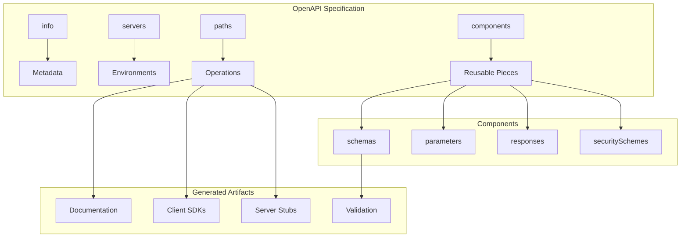
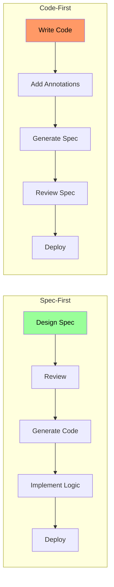
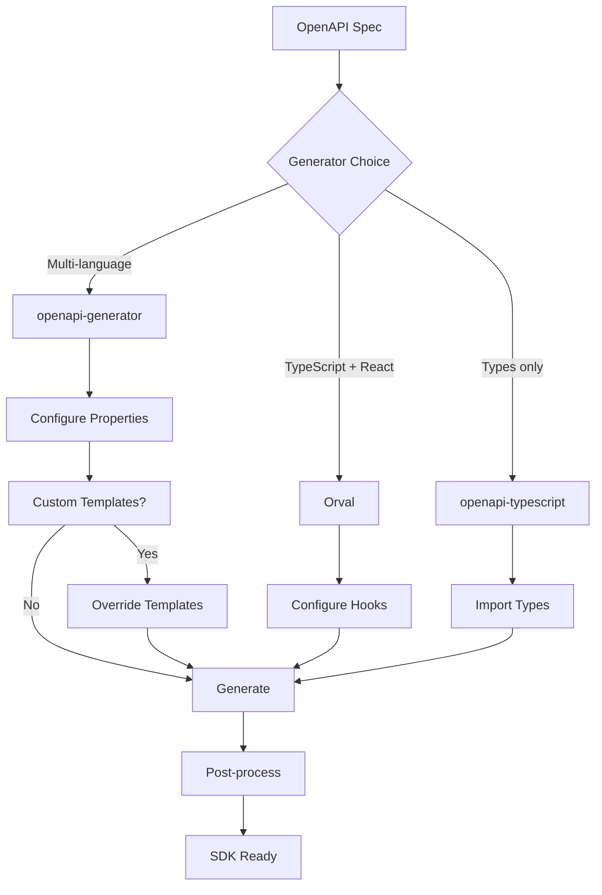
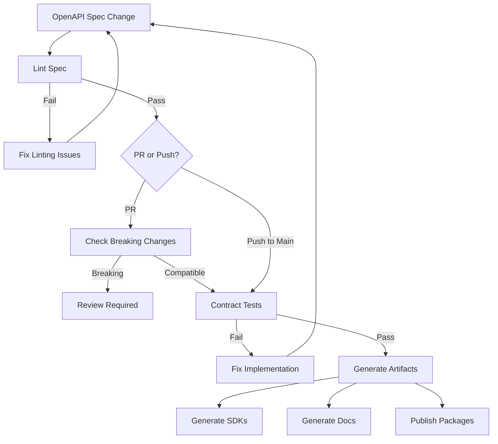

*[API]: Application Programming Interface
*[SDK]: Software Development Kit
*[REST]: Representational State Transfer
*[JSON]: JavaScript Object Notation
*[YAML]: YAML Ain't Markup Language
*[HTTP]: Hypertext Transfer Protocol
*[CI]: Continuous Integration
*[CD]: Continuous Deployment
*[DRY]: Don't Repeat Yourself
*[OAS]: OpenAPI Specification

# OpenAPI in Practice: Docs, Clients, and Validation

## Introduction

Frame the OpenAPI value proposition: a single specification file that generates accurate documentation, type-safe client SDKs, and request validation middleware. The promise is compelling—write once, generate everywhere. The reality is more nuanced. Specs drift from implementations. Generated code is often awkward. Validation catches schema errors but misses business logic. This section establishes that OpenAPI delivers value when treated as the source of truth, not when retrofitted onto existing APIs. The difference between "spec-first" and "code-first" isn't just workflow—it's whether your spec describes reality or aspiration.

_Include a scenario: a team maintains a REST API with hand-written documentation in Confluence, manually coded client SDKs in three languages, and validation logic duplicated across services. Documentation is perpetually out of date. SDK bugs emerge when the API changes. Validation differs between the gateway and backend. They adopt OpenAPI: spec becomes the source of truth, documentation generates automatically, SDKs regenerate on spec change, validation middleware uses the same spec. Time spent on API maintenance drops 60%. More importantly, the three artifacts—docs, clients, validation—are guaranteed consistent. The lesson: OpenAPI's value isn't any single artifact, it's the consistency across all of them._

<Callout type="warning">
The biggest OpenAPI mistake: generating a spec from existing code and calling it "documentation." That's archaeology, not specification. The spec should drive the code, not describe it after the fact.
</Callout>

## OpenAPI Fundamentals

### Specification Structure

```yaml title="openapi-structure.yaml"
# OpenAPI 3.1 specification structure

openapi: "3.1.0"

info:
  title: "Order Management API"
  description: "API for managing customer orders"
  version: "1.0.0"
  contact:
    name: "API Support"
    email: "api-support@company.com"
  license:
    name: "MIT"
    url: "https://opensource.org/licenses/MIT"

servers:
  - url: "https://api.company.com/v1"
    description: "Production"
  - url: "https://api.staging.company.com/v1"
    description: "Staging"
  - url: "http://localhost:3000/v1"
    description: "Local development"

tags:
  - name: "orders"
    description: "Order operations"
  - name: "customers"
    description: "Customer operations"

paths:
  /orders:
    get:
      summary: "List orders"
      operationId: "listOrders"
      tags: ["orders"]
      parameters:
        - $ref: "#/components/parameters/PageParam"
        - $ref: "#/components/parameters/LimitParam"
      responses:
        "200":
          description: "Successful response"
          content:
            application/json:
              schema:
                $ref: "#/components/schemas/OrderList"
        "400":
          $ref: "#/components/responses/BadRequest"
        "401":
          $ref: "#/components/responses/Unauthorized"

    post:
      summary: "Create order"
      operationId: "createOrder"
      tags: ["orders"]
      requestBody:
        required: true
        content:
          application/json:
            schema:
              $ref: "#/components/schemas/CreateOrderRequest"
      responses:
        "201":
          description: "Order created"
          content:
            application/json:
              schema:
                $ref: "#/components/schemas/Order"
        "400":
          $ref: "#/components/responses/BadRequest"

components:
  schemas:
    Order:
      type: object
      required: [id, customerId, items, status, createdAt]
      properties:
        id:
          type: string
          format: uuid
          example: "550e8400-e29b-41d4-a716-446655440000"
        customerId:
          type: string
          format: uuid
        items:
          type: array
          items:
            $ref: "#/components/schemas/OrderItem"
        status:
          type: string
          enum: [pending, confirmed, shipped, delivered, cancelled]
        createdAt:
          type: string
          format: date-time

  parameters:
    PageParam:
      name: page
      in: query
      schema:
        type: integer
        minimum: 1
        default: 1
    LimitParam:
      name: limit
      in: query
      schema:
        type: integer
        minimum: 1
        maximum: 100
        default: 20

  responses:
    BadRequest:
      description: "Bad request"
      content:
        application/json:
          schema:
            $ref: "#/components/schemas/Error"
    Unauthorized:
      description: "Unauthorized"
      content:
        application/json:
          schema:
            $ref: "#/components/schemas/Error"

  securitySchemes:
    BearerAuth:
      type: http
      scheme: bearer
      bearerFormat: JWT

security:
  - BearerAuth: []
```
Code: OpenAPI specification structure.


Figure: OpenAPI structure and outputs.

### Schema Design Best Practices

```yaml title="schema-best-practices.yaml"
# Schema design patterns

components:
  schemas:
    # === Pattern 1: Separate Create/Update/Response schemas ===

    # What clients send to create
    CreateOrderRequest:
      type: object
      required: [customerId, items]
      properties:
        customerId:
          type: string
          format: uuid
        items:
          type: array
          minItems: 1
          items:
            $ref: "#/components/schemas/OrderItemRequest"
        notes:
          type: string
          maxLength: 500
      # No id, status, timestamps - server sets these

    # What clients send to update
    UpdateOrderRequest:
      type: object
      properties:
        status:
          type: string
          enum: [confirmed, cancelled]
        notes:
          type: string
          maxLength: 500
      # Only fields that can be updated

    # What server returns
    Order:
      type: object
      required: [id, customerId, items, status, createdAt]
      properties:
        id:
          type: string
          format: uuid
          readOnly: true
        customerId:
          type: string
          format: uuid
        items:
          type: array
          items:
            $ref: "#/components/schemas/OrderItem"
        status:
          type: string
          enum: [pending, confirmed, shipped, delivered, cancelled]
        notes:
          type: string
        createdAt:
          type: string
          format: date-time
          readOnly: true
        updatedAt:
          type: string
          format: date-time
          readOnly: true

    # === Pattern 2: Composition with allOf ===

    BaseEntity:
      type: object
      properties:
        id:
          type: string
          format: uuid
        createdAt:
          type: string
          format: date-time
        updatedAt:
          type: string
          format: date-time

    Customer:
      allOf:
        - $ref: "#/components/schemas/BaseEntity"
        - type: object
          required: [email, name]
          properties:
            email:
              type: string
              format: email
            name:
              type: string
              minLength: 1
              maxLength: 100

    # === Pattern 3: Polymorphism with oneOf ===

    PaymentMethod:
      oneOf:
        - $ref: "#/components/schemas/CreditCard"
        - $ref: "#/components/schemas/BankTransfer"
        - $ref: "#/components/schemas/PayPal"
      discriminator:
        propertyName: type
        mapping:
          credit_card: "#/components/schemas/CreditCard"
          bank_transfer: "#/components/schemas/BankTransfer"
          paypal: "#/components/schemas/PayPal"

    CreditCard:
      type: object
      required: [type, last4, expiryMonth, expiryYear]
      properties:
        type:
          type: string
          enum: [credit_card]
        last4:
          type: string
          pattern: "^[0-9]{4}$"
        expiryMonth:
          type: integer
          minimum: 1
          maximum: 12
        expiryYear:
          type: integer
          minimum: 2024

    # === Pattern 4: Pagination wrapper ===

    PaginatedResponse:
      type: object
      required: [data, pagination]
      properties:
        data:
          type: array
          items: {}  # Override in specific responses
        pagination:
          $ref: "#/components/schemas/Pagination"

    Pagination:
      type: object
      required: [page, limit, total, totalPages]
      properties:
        page:
          type: integer
        limit:
          type: integer
        total:
          type: integer
        totalPages:
          type: integer
        hasNext:
          type: boolean
        hasPrev:
          type: boolean
```
Code: Schema design patterns.

| Pattern | Use Case | Benefit |
|---------|----------|---------|
| Separate CRUD schemas | Create/Update/Read differ | Accurate validation per operation |
| allOf composition | Shared base properties | DRY, consistent entities |
| oneOf polymorphism | Multiple valid types | Type-safe variants |
| Pagination wrapper | List endpoints | Consistent pagination |

Table: Schema design patterns.

<Callout type="info">
Use separate schemas for request and response bodies. What clients send (CreateOrderRequest) differs from what they receive (Order). Trying to use one schema for both leads to awkward `readOnly` and `writeOnly` annotations everywhere.
</Callout>

## Spec-First vs Code-First

### Workflow Comparison

```yaml title="workflow-comparison.yaml"
# Spec-first vs code-first approaches

spec_first:
  description: "Write OpenAPI spec, generate code"

  workflow:
    1: "Design API in OpenAPI spec"
    2: "Review spec with stakeholders"
    3: "Generate server stubs"
    4: "Implement business logic in stubs"
    5: "Generate client SDKs"
    6: "Generate documentation"

  advantages:
    - "API design happens before coding"
    - "Stakeholders review before implementation"
    - "Spec is always accurate (it's the source)"
    - "Multiple language support from day one"
    - "Documentation always current"

  challenges:
    - "Requires upfront design investment"
    - "Generated code may not match preferences"
    - "Changes require spec update first"

  best_for:
    - "Public APIs"
    - "Multi-team/multi-consumer APIs"
    - "APIs with strict contracts"

code_first:
  description: "Write code, generate OpenAPI spec"

  workflow:
    1: "Implement API in code"
    2: "Add annotations/decorators for OpenAPI"
    3: "Generate spec from code"
    4: "Generate documentation from spec"
    5: "Manually maintain client SDKs (or generate)"

  advantages:
    - "Natural for developers"
    - "Code is always accurate"
    - "Rapid iteration"
    - "IDE support for implementation"

  challenges:
    - "Spec quality depends on annotations"
    - "Easy to skip documentation"
    - "API design happens during coding"
    - "Breaking changes easier to introduce"

  best_for:
    - "Internal APIs"
    - "Rapid prototyping"
    - "Single-consumer APIs"

---
# Hybrid approach
hybrid:
  description: "Spec-first for contracts, code-first for implementation details"

  workflow:
    1: "Design core API contract in spec"
    2: "Generate server stubs"
    3: "Implement with code-first annotations for details"
    4: "Merge generated spec with code-first additions"
    5: "Validate spec matches implementation"

  tools:
    - "Spectral for spec linting"
    - "openapi-diff for change detection"
    - "Prism for mock servers"
```
Code: Workflow comparison.


Figure: Spec-first vs code-first flow.

### Keeping Specs in Sync

```yaml title="spec-sync.yaml"
# Strategies for spec-implementation sync

sync_strategies:
  spec_as_source:
    approach: "Spec changes trigger code regeneration"
    workflow:
      - "Edit OpenAPI spec"
      - "CI regenerates server stubs"
      - "Developer updates implementation"
      - "Tests validate behavior matches spec"
    tools:
      - "openapi-generator"
      - "swagger-codegen"

  code_as_source:
    approach: "Code changes trigger spec regeneration"
    workflow:
      - "Edit code with annotations"
      - "CI regenerates spec"
      - "Diff check for breaking changes"
      - "Spec committed alongside code"
    tools:
      - "tsoa (TypeScript)"
      - "springdoc (Java)"
      - "FastAPI (Python)"

  contract_testing:
    approach: "Validate implementation matches spec"
    workflow:
      - "Write spec and code independently"
      - "Contract tests verify alignment"
      - "CI fails on mismatch"
    tools:
      - "Dredd"
      - "Schemathesis"
      - "Prism"

---
# CI validation example
ci_validation:
  github_actions:
    name: "API Contract Validation"

    jobs:
      validate_spec:
        steps:
          - name: "Lint OpenAPI spec"
            run: "npx @stoplight/spectral-cli lint openapi.yaml"

          - name: "Check for breaking changes"
            run: |
              npx openapi-diff main-branch/openapi.yaml openapi.yaml

      contract_test:
        steps:
          - name: "Start API server"
            run: "npm start &"

          - name: "Run contract tests"
            run: |
              npx dredd openapi.yaml http://localhost:3000

          - name: "Run schema validation"
            run: |
              npx schemathesis run openapi.yaml --base-url http://localhost:3000
```
Code: Spec synchronization strategies.

<Callout type="warning">
The spec and implementation will drift if you don't actively prevent it. Use CI validation—lint the spec, check for breaking changes, and run contract tests on every PR.
</Callout>

## Documentation Generation

### Tooling Options

```yaml title="documentation-tools.yaml"
# Documentation generation tools

tools:
  redoc:
    type: "Static documentation generator"
    output: "Single HTML file or React component"
    features:
      - "Three-panel layout"
      - "Code samples"
      - "Search"
      - "Nested schemas"
    installation: "npm install redoc-cli"
    generation: "npx redoc-cli build openapi.yaml -o docs.html"
    hosting: "Static file, CDN, GitHub Pages"

  swagger_ui:
    type: "Interactive documentation"
    output: "Web application"
    features:
      - "Try it out (live requests)"
      - "Authentication support"
      - "Multiple specs"
    installation: "npm install swagger-ui-dist"
    hosting: "Static files or Docker"

  stoplight_elements:
    type: "React component library"
    output: "Embeddable components"
    features:
      - "Modern UI"
      - "Try it out"
      - "Customizable"
    installation: "npm install @stoplight/elements"
    integration: "Import into React/Vue app"

  readme:
    type: "Documentation platform"
    output: "Hosted documentation"
    features:
      - "API reference + guides"
      - "Metrics and analytics"
      - "Developer portal"
    integration: "Sync spec via CI"

---
# Redoc configuration
redoc_config:
  # redoc.yaml
  options:
    theme:
      colors:
        primary:
          main: "#1a73e8"
      typography:
        fontSize: "16px"
        fontFamily: "Inter, sans-serif"
    hideDownloadButton: false
    hideHostname: false
    expandResponses: "200,201"
    requiredPropsFirst: true
    sortPropsAlphabetically: false
    pathInMiddlePanel: true
    jsonSampleExpandLevel: 2
```
Code: Documentation tool options.

### Enhancing Documentation Quality

```yaml title="documentation-enhancement.yaml"
# Enhancing OpenAPI for better documentation

paths:
  /orders/{orderId}:
    get:
      summary: "Get order by ID"
      description: |
        Retrieves a single order by its unique identifier.

        ## Authorization
        Requires `orders:read` scope.

        ## Rate Limiting
        This endpoint is limited to 100 requests per minute.

        ## Response Caching
        Responses are cached for 60 seconds. Use `Cache-Control: no-cache`
        header to bypass cache.
      operationId: "getOrder"
      tags: ["orders"]

      parameters:
        - name: orderId
          in: path
          required: true
          description: "Unique order identifier (UUID format)"
          schema:
            type: string
            format: uuid
          example: "550e8400-e29b-41d4-a716-446655440000"

      responses:
        "200":
          description: "Order found"
          content:
            application/json:
              schema:
                $ref: "#/components/schemas/Order"
              examples:
                pending_order:
                  summary: "Pending order"
                  description: "An order awaiting confirmation"
                  value:
                    id: "550e8400-e29b-41d4-a716-446655440000"
                    customerId: "customer-123"
                    status: "pending"
                    items:
                      - productId: "prod-001"
                        quantity: 2
                        price: 29.99
                    createdAt: "2024-01-15T10:30:00Z"

                shipped_order:
                  summary: "Shipped order"
                  description: "An order that has been shipped"
                  value:
                    id: "660e8400-e29b-41d4-a716-446655440001"
                    customerId: "customer-123"
                    status: "shipped"
                    trackingNumber: "1Z999AA10123456784"
                    items:
                      - productId: "prod-002"
                        quantity: 1
                        price: 99.99
                    createdAt: "2024-01-10T09:00:00Z"
                    shippedAt: "2024-01-12T14:00:00Z"

        "404":
          description: "Order not found"
          content:
            application/json:
              schema:
                $ref: "#/components/schemas/Error"
              example:
                code: "ORDER_NOT_FOUND"
                message: "Order with ID 550e8400-e29b-41d4-a716-446655440000 not found"

---
# Schema with rich descriptions
components:
  schemas:
    Order:
      type: object
      description: |
        Represents a customer order in the system.

        Orders progress through the following statuses:
        1. `pending` - Order created, awaiting payment
        2. `confirmed` - Payment received, preparing for shipment
        3. `shipped` - Order dispatched, tracking available
        4. `delivered` - Order received by customer
        5. `cancelled` - Order cancelled (can only happen from pending/confirmed)
      properties:
        id:
          type: string
          format: uuid
          description: "Unique identifier assigned by the system"
          example: "550e8400-e29b-41d4-a716-446655440000"
        status:
          type: string
          enum: [pending, confirmed, shipped, delivered, cancelled]
          description: "Current order status. See schema description for status flow."
          example: "pending"
```
Code: Documentation enhancement.

| Enhancement | Location | Impact |
|-------------|----------|--------|
| Rich descriptions | Operation, schema | Context and usage guidance |
| Multiple examples | Response body | Real-world scenarios |
| Enum descriptions | Schema properties | Clear allowed values |
| Error examples | Error responses | Debugging guidance |
| Markdown formatting | Description fields | Readable documentation |

Table: Documentation enhancements.

<Callout type="success">
Good API documentation isn't just schema reference—it includes examples, error scenarios, and usage guidance. Invest in description fields and multiple examples. They cost nothing to add but dramatically improve developer experience.
</Callout>

## SDK Generation

### Generator Selection

```yaml title="sdk-generators.yaml"
# SDK generator comparison

generators:
  openapi_generator:
    description: "Most comprehensive, supports 50+ languages"
    languages: ["TypeScript", "Python", "Java", "Go", "Ruby", "C#", "PHP", "..."]
    installation: "npm install @openapitools/openapi-generator-cli"

    typescript_example:
      command: |
        npx openapi-generator-cli generate \
          -i openapi.yaml \
          -g typescript-axios \
          -o ./sdk/typescript \
          --additional-properties=supportsES6=true,npmName=@company/api-client

    customization:
      - "Templates (Mustache)"
      - "Additional properties"
      - "Type mappings"
      - "Import mappings"

  autorest:
    description: "Microsoft's generator, Azure-focused"
    languages: ["TypeScript", "Python", "Java", "C#", "Go"]
    strengths: ["Azure integration", "TypeScript quality"]

  orval:
    description: "TypeScript-focused, modern output"
    languages: ["TypeScript"]
    strengths:
      - "React Query integration"
      - "Zod validation schemas"
      - "MSW mock handlers"
    installation: "npm install orval"

  openapi_typescript:
    description: "TypeScript types only (no runtime)"
    output: "Type definitions"
    strengths: ["Lightweight", "No runtime dependencies"]

---
# Generator configuration
openapi_generator_config:
  # openapitools.json
  "$schema": "node_modules/@openapitools/openapi-generator-cli/config.schema.json"
  spaces: 2
  generator-cli:
    version: "7.0.0"
    generators:
      typescript-client:
        generatorName: "typescript-axios"
        inputSpec: "./openapi.yaml"
        output: "./sdk/typescript"
        additionalProperties:
          npmName: "@company/api-client"
          npmVersion: "1.0.0"
          supportsES6: true
          withSeparateModelsAndApi: true
          modelPackage: "models"
          apiPackage: "api"

      python-client:
        generatorName: "python"
        inputSpec: "./openapi.yaml"
        output: "./sdk/python"
        additionalProperties:
          packageName: "company_api_client"
          projectName: "company-api-client"
          packageVersion: "1.0.0"
```
Code: SDK generator options.

### Customizing Generated Code

```yaml title="sdk-customization.yaml"
# SDK customization strategies

customization_approaches:
  additional_properties:
    description: "Generator-specific options"
    examples:
      typescript_axios:
        - "supportsES6: true"
        - "withSeparateModelsAndApi: true"
        - "useSingleRequestParameter: true"
      python:
        - "generateSourceCodeOnly: true"
        - "library: urllib3"

  template_overrides:
    description: "Custom Mustache templates"
    workflow:
      1: "Export default templates"
      2: "Modify templates as needed"
      3: "Specify template directory in generation"
    command: |
      # Export templates
      npx openapi-generator-cli author template \
        -g typescript-axios \
        -o ./templates/typescript

      # Generate with custom templates
      npx openapi-generator-cli generate \
        -i openapi.yaml \
        -g typescript-axios \
        -t ./templates/typescript \
        -o ./sdk/typescript

  post_processing:
    description: "Transform generated code"
    examples:
      - "Run prettier/eslint after generation"
      - "Add custom wrapper code"
      - "Remove unwanted files"
    script: |
      #!/bin/bash
      # generate-sdk.sh

      # Generate
      npx openapi-generator-cli generate -c openapitools.json

      # Format
      npx prettier --write ./sdk/typescript/**/*.ts

      # Add custom exports
      cat >> ./sdk/typescript/index.ts << 'EOF'
      export { ApiClient } from './custom/client';
      export * from './custom/hooks';
      EOF

      # Remove unwanted files
      rm -f ./sdk/typescript/.openapi-generator-ignore

---
# Orval configuration (TypeScript-focused)
orval_config:
  # orval.config.ts
  output:
    client: "react-query"  # or axios, angular, fetch
    target: "./src/api/generated.ts"
    schemas: "./src/api/models"
    mode: "tags-split"  # Split by tags
    mock: true  # Generate MSW mocks

  input:
    target: "./openapi.yaml"

  hooks:
    afterAllFilesWrite: "prettier --write"
```
Code: SDK customization.


Figure: SDK generation workflow.

<Callout type="info">
Don't fight the generator—embrace post-processing. Generate the code, then format it, add wrappers, and integrate it into your project structure. Trying to make the generator output perfect code is harder than transforming its output.
</Callout>

## Request Validation

### Server-Side Validation

```typescript title="express-validation.ts"
// Express.js with OpenAPI validation

import express from 'express';
import * as OpenApiValidator from 'express-openapi-validator';
import { join } from 'path';

const app = express();

app.use(express.json());

// === OpenAPI Validator Middleware ===
app.use(
  OpenApiValidator.middleware({
    apiSpec: join(__dirname, '../openapi.yaml'),
    validateRequests: true,
    validateResponses: true, // Also validate outgoing responses
    validateSecurity: {
      handlers: {
        BearerAuth: (req, scopes) => {
          // Validate JWT and check scopes
          const token = req.headers.authorization?.split(' ')[1];
          if (!token) return false;

          // Verify token and scopes
          const decoded = verifyToken(token);
          return scopes.every(scope => decoded.scopes.includes(scope));
        },
      },
    },
  })
);

// === Routes (validation happens automatically) ===
app.post('/orders', async (req, res) => {
  // req.body is already validated against CreateOrderRequest schema
  // If invalid, 400 error returned before reaching this handler

  const order = await createOrder(req.body);
  res.status(201).json(order);
});

app.get('/orders/:orderId', async (req, res) => {
  // req.params.orderId validated as UUID format
  const order = await getOrder(req.params.orderId);

  if (!order) {
    res.status(404).json({
      code: 'ORDER_NOT_FOUND',
      message: `Order ${req.params.orderId} not found`,
    });
    return;
  }

  res.json(order);
  // Response also validated if validateResponses: true
});

// === Error handling ===
app.use((err: any, req: express.Request, res: express.Response, next: express.NextFunction) => {
  if (err.status === 400) {
    // Validation error
    res.status(400).json({
      code: 'VALIDATION_ERROR',
      message: 'Request validation failed',
      errors: err.errors,
    });
    return;
  }

  if (err.status === 401) {
    res.status(401).json({
      code: 'UNAUTHORIZED',
      message: 'Authentication required',
    });
    return;
  }

  // Other errors
  console.error(err);
  res.status(500).json({
    code: 'INTERNAL_ERROR',
    message: 'Internal server error',
  });
});
```
Code: Express OpenAPI validation.

### Validation Error Formatting

```yaml title="validation-errors.yaml"
# Validation error handling

error_formats:
  raw_validator_output:
    description: "Default express-openapi-validator output"
    example:
      status: 400
      errors:
        - path: "/body/items/0/quantity"
          message: "must be >= 1"
          errorCode: "minimum.openapi.validation"
        - path: "/body/customerId"
          message: "must match format \"uuid\""
          errorCode: "format.openapi.validation"

  formatted_output:
    description: "User-friendly error response"
    example:
      code: "VALIDATION_ERROR"
      message: "Request validation failed"
      errors:
        - field: "items[0].quantity"
          message: "Quantity must be at least 1"
        - field: "customerId"
          message: "Customer ID must be a valid UUID"

---
# Error transformer
error_transformer: |
  function formatValidationErrors(errors) {
    return errors.map(error => {
      // Convert JSON Pointer to dot notation
      const field = error.path
        .replace('/body/', '')
        .replace(/\//g, '.')
        .replace(/\.(\d+)\./g, '[$1].');

      // Human-readable messages
      const messages = {
        'minimum.openapi.validation': `${fieldName(field)} must be at least ${error.params?.limit}`,
        'maximum.openapi.validation': `${fieldName(field)} must be at most ${error.params?.limit}`,
        'format.openapi.validation': `${fieldName(field)} must be a valid ${error.params?.format}`,
        'required.openapi.validation': `${fieldName(field)} is required`,
        'enum.openapi.validation': `${fieldName(field)} must be one of: ${error.params?.allowedValues?.join(', ')}`,
      };

      return {
        field,
        message: messages[error.errorCode] || error.message,
      };
    });
  }

---
# Python FastAPI validation (automatic from Pydantic)
fastapi_validation:
  example_error:
    detail:
      - loc: ["body", "items", 0, "quantity"]
        msg: "ensure this value is greater than or equal to 1"
        type: "value_error.number.not_ge"
      - loc: ["body", "customer_id"]
        msg: "value is not a valid uuid"
        type: "value_error.uuid"
```
Code: Validation error handling.

| Validation Type | What It Catches | What It Misses |
|-----------------|-----------------|----------------|
| Schema validation | Type, format, required fields | Business logic |
| Format validation | UUID, email, date formats | Valid but nonexistent IDs |
| Range validation | min/max, minLength/maxLength | Domain-specific ranges |
| Enum validation | Allowed values | Contextual validity |

Table: Validation coverage.

<Callout type="warning">
OpenAPI validation catches schema errors, not business logic errors. A valid UUID that references a nonexistent customer passes validation. Layer business validation on top of schema validation.
</Callout>

## CI/CD Integration

### Automated Workflows

```yaml title="ci-cd-openapi.yaml"
# .github/workflows/api.yml

name: API Workflow

on:
  push:
    paths:
      - 'openapi.yaml'
      - 'src/**'
  pull_request:
    paths:
      - 'openapi.yaml'
      - 'src/**'

jobs:
  lint-spec:
    name: Lint OpenAPI Spec
    runs-on: ubuntu-latest
    steps:
      - uses: actions/checkout@v4

      - name: Lint with Spectral
        uses: stoplightio/spectral-action@latest
        with:
          file_glob: 'openapi.yaml'

  breaking-changes:
    name: Check Breaking Changes
    runs-on: ubuntu-latest
    if: github.event_name == 'pull_request'
    steps:
      - uses: actions/checkout@v4
        with:
          fetch-depth: 0

      - name: Get base branch spec
        run: |
          git show origin/${{ github.base_ref }}:openapi.yaml > base-spec.yaml

      - name: Check for breaking changes
        run: |
          npx openapi-diff base-spec.yaml openapi.yaml --fail-on-incompatible

  generate-sdk:
    name: Generate SDKs
    runs-on: ubuntu-latest
    needs: [lint-spec]
    steps:
      - uses: actions/checkout@v4

      - name: Generate TypeScript SDK
        run: |
          npx @openapitools/openapi-generator-cli generate \
            -i openapi.yaml \
            -g typescript-axios \
            -o ./sdk/typescript

      - name: Generate Python SDK
        run: |
          npx @openapitools/openapi-generator-cli generate \
            -i openapi.yaml \
            -g python \
            -o ./sdk/python

      - name: Upload SDKs
        uses: actions/upload-artifact@v3
        with:
          name: generated-sdks
          path: ./sdk/

  contract-test:
    name: Contract Testing
    runs-on: ubuntu-latest
    needs: [lint-spec]
    steps:
      - uses: actions/checkout@v4

      - name: Start API server
        run: |
          npm ci
          npm start &
          sleep 10

      - name: Run Dredd
        run: |
          npx dredd openapi.yaml http://localhost:3000 \
            --hookfiles=./test/dredd-hooks.js

  generate-docs:
    name: Generate Documentation
    runs-on: ubuntu-latest
    needs: [lint-spec]
    if: github.ref == 'refs/heads/main'
    steps:
      - uses: actions/checkout@v4

      - name: Generate Redoc
        run: |
          npx redoc-cli build openapi.yaml \
            -o ./docs/api-reference.html \
            --options.theme.colors.primary.main="#1a73e8"

      - name: Deploy to GitHub Pages
        uses: peaceiris/actions-gh-pages@v3
        with:
          github_token: ${{ secrets.GITHUB_TOKEN }}
          publish_dir: ./docs
```
Code: CI/CD workflow.

### Spectral Linting Rules

```yaml title="spectral-config.yaml"
# .spectral.yaml

extends: ["spectral:oas"]

rules:
  # === Naming conventions ===
  operation-operationId-valid-in-url:
    severity: error
    message: "operationId must be URL-safe"
    given: "$.paths.*[get,post,put,patch,delete].operationId"
    then:
      function: pattern
      functionOptions:
        match: "^[a-zA-Z][a-zA-Z0-9]*$"

  path-keys-kebab-case:
    severity: warn
    message: "Path segments should be kebab-case"
    given: "$.paths"
    then:
      function: pattern
      functionOptions:
        match: "^(/[a-z][a-z0-9-]*({[a-zA-Z]+})?)+$"

  # === Documentation requirements ===
  operation-description:
    severity: warn
    message: "Operation should have a description"
    given: "$.paths.*[get,post,put,patch,delete]"
    then:
      field: description
      function: truthy

  schema-properties-descriptions:
    severity: hint
    message: "Schema properties should have descriptions"
    given: "$.components.schemas.*.properties.*"
    then:
      field: description
      function: truthy

  # === Security ===
  operation-security-defined:
    severity: error
    message: "Operation must define security requirements"
    given: "$.paths.*[get,post,put,patch,delete]"
    then:
      - field: security
        function: truthy
      - field: security
        function: length
        functionOptions:
          min: 1

  # === Response requirements ===
  operation-success-response:
    severity: error
    message: "Operation must have a success response (2xx)"
    given: "$.paths.*[get,post,put,patch,delete].responses"
    then:
      function: schema
      functionOptions:
        schema:
          anyOf:
            - required: ["200"]
            - required: ["201"]
            - required: ["202"]
            - required: ["204"]

  operation-error-response:
    severity: warn
    message: "Operation should have error responses (4xx)"
    given: "$.paths.*[get,post,put,patch,delete].responses"
    then:
      function: schema
      functionOptions:
        schema:
          anyOf:
            - required: ["400"]
            - required: ["401"]
            - required: ["403"]
            - required: ["404"]
            - required: ["422"]
```
Code: Spectral linting rules.


Figure: CI/CD pipeline flow.

<Callout type="success">
Catch breaking changes before they merge. Use `openapi-diff` in PR checks to flag incompatible changes—removed endpoints, required field additions, type changes. This prevents surprise breakages for API consumers.
</Callout>

## Conclusion

Summarize the OpenAPI journey: the specification delivers value when it's the source of truth, not an afterthought. Spec-first design ensures API contracts are intentional. Generated documentation stays accurate automatically. Generated SDKs provide type-safe clients in multiple languages. Validation middleware enforces schema compliance. CI/CD integration catches breaking changes before they ship. The key is treating OpenAPI as infrastructure, not documentation—a living artifact that drives code generation, validation, and documentation throughout the API lifecycle.

<Callout type="info">
The return on OpenAPI investment compounds over time. Initial setup cost is high, but every consumer, every documentation page, and every validation check builds on that single source of truth. The cost of keeping three separate artifacts in sync manually far exceeds the cost of maintaining one spec.
</Callout>

---

## Cover Prompt

### Prompt 1: The Single Source

Create an image of a glowing central document (OpenAPI spec) with multiple streams flowing outward to different artifacts—documentation pages, code files in various languages, validation shields. All artifacts share the same glow, showing they come from the same source. Style: source of truth, artifact generation, unified origin, 16:9 aspect ratio.

### Prompt 2: The API Blueprint

Design an image of an architect's drafting table with an API blueprint (spec). From the blueprint, holographic projections show: a documentation website, SDK packages in different colored boxes (languages), and a validation checkpoint. Tools and rulers surround the blueprint. Style: architectural blueprint, API design, precision planning, 16:9 aspect ratio.

### Prompt 3: The Contract Stamp

Illustrate a formal contract being stamped with an official seal. Multiple copies of the contract (SDKs, docs, validators) are created from the stamped original. A quality inspector verifies each copy matches the original. Broken copies (drift) are rejected. Style: contract enforcement, official documentation, quality assurance, 16:9 aspect ratio.

### Prompt 4: The Translation Bureau

Create an image of a translation bureau where a single document (spec) is being translated into multiple languages simultaneously. Translators (generators) work at desks, producing TypeScript, Python, Java outputs. A central quality checker ensures all translations match the original meaning. Style: translation accuracy, multi-language output, consistency verification, 16:9 aspect ratio.

### Prompt 5: The API Factory

Design an image of a modern factory assembly line where raw specifications enter one end. Different stations produce: documentation (book press), SDKs (code printers), validation rules (shield forge). All products have the same serial number showing common origin. Quality control inspects each output. Style: automated generation, factory efficiency, quality control, 16:9 aspect ratio.
