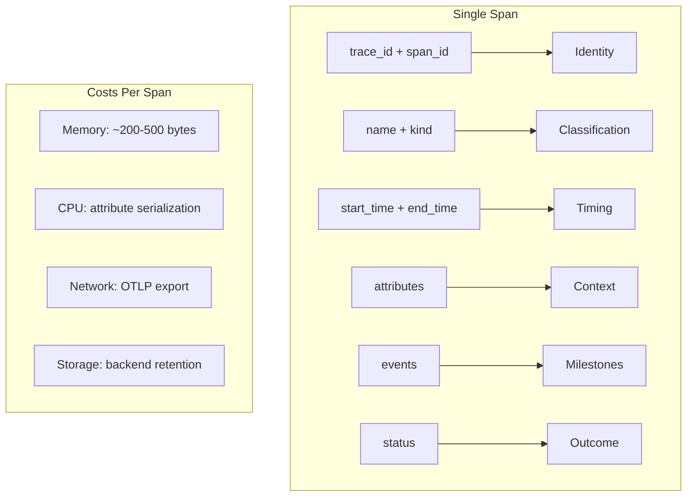
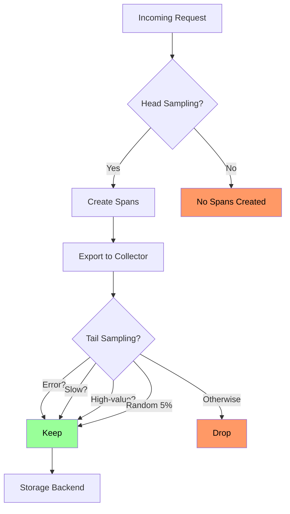
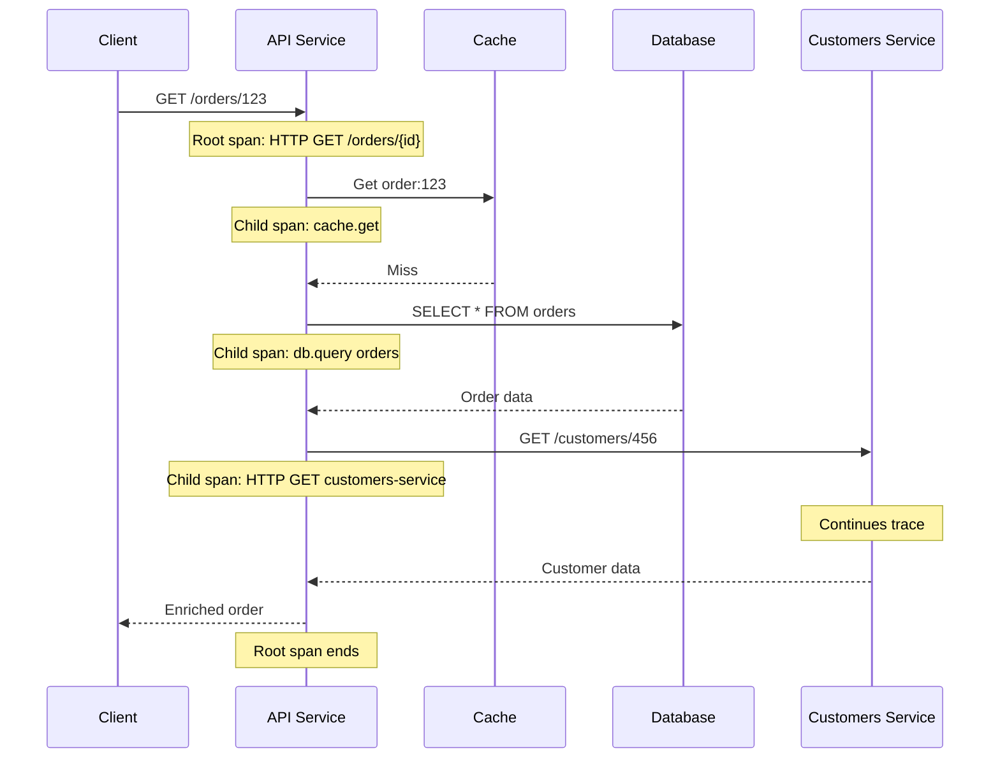

*[OTel]: OpenTelemetry
*[SDK]: Software Development Kit
*[API]: Application Programming Interface
*[CPU]: Central Processing Unit
*[HTTP]: Hypertext Transfer Protocol
*[gRPC]: gRPC Remote Procedure Calls
*[DB]: Database
*[SLA]: Service Level Agreement
*[P99]: 99th Percentile
*[OTLP]: OpenTelemetry Protocol

# Tracing Span Design: How Many Is Too Many

## Introduction

Frame the span granularity dilemma: more spans provide more visibility, but each span has costs—CPU overhead for creation, memory for attributes, network for export, storage in your backend, and cognitive load when reading traces. A request that creates 500 spans might have excellent granularity, but the trace waterfall becomes unreadable, storage costs explode, and the instrumentation itself becomes a performance concern. This section establishes that span design is an engineering tradeoff, not a quest for maximum visibility. The goal is enough spans to debug problems, not so many that you create new ones.

_Include a scenario: a team instruments a new service with spans for every function call, database query, cache lookup, and external request. A typical request generates 200+ spans. The trace backend shows a waterfall of solid color—no white space, no visible hierarchy. Debugging means scrolling through hundreds of spans looking for the slow one. Storage costs triple in a month. They refactor: instrument service boundaries, significant operations, and error paths. Span count drops to 15-20 per request. Traces become readable. The critical path is obvious. Storage costs drop 90%. Debugging time drops from minutes to seconds. The lesson: granularity without readability is noise, not observability._

<Callout type="warning">
The span count that's "right" depends on your debugging needs. A payment service might need fine-grained spans to audit every step. A high-throughput cache might need minimal spans to avoid overhead. There's no universal number—but there are universal principles.
</Callout>

## Span Fundamentals

### Anatomy of a Span

```yaml title="span-anatomy.yaml"
# OpenTelemetry span structure

span:
  # === Identity ===
  trace_id: "4bf92f3577b34da6a3ce929d0e0e4736"  # 16 bytes, shared across trace
  span_id: "00f067aa0ba902b7"                    # 8 bytes, unique to span
  parent_span_id: "a3ce929d0e0e4736"             # Links to parent (null for root)

  # === Naming ===
  name: "HTTP GET /api/orders/{orderId}"        # Operation name
  kind: "SERVER"                                 # CLIENT, SERVER, PRODUCER, CONSUMER, INTERNAL

  # === Timing ===
  start_time: "2024-01-15T10:30:00.000000Z"     # Nanosecond precision
  end_time: "2024-01-15T10:30:00.150000Z"       # Duration = end - start

  # === Status ===
  status:
    code: "OK"                                   # UNSET, OK, ERROR
    message: ""                                  # Optional description for ERROR

  # === Attributes (key-value metadata) ===
  attributes:
    # Semantic conventions
    http.method: "GET"
    http.url: "https://api.example.com/orders/123"
    http.status_code: 200
    http.response_content_length: 1024

    # Custom attributes
    order.id: "ord-123"
    customer.tier: "premium"
    cache.hit: false

  # === Events (timestamped logs within span) ===
  events:
    - name: "cache.miss"
      timestamp: "2024-01-15T10:30:00.010000Z"
      attributes:
        cache.key: "order:123"
    - name: "db.query.start"
      timestamp: "2024-01-15T10:30:00.015000Z"

  # === Links (references to related spans) ===
  links:
    - trace_id: "different-trace-id"
      span_id: "related-span-id"
      attributes:
        link.reason: "triggered_by"

---
# Span kinds and their meaning
span_kinds:
  SERVER:
    description: "Server-side handling of RPC or HTTP request"
    example: "HTTP handler receiving request"
    parent: "Usually CLIENT span from caller"

  CLIENT:
    description: "Client-side of RPC or HTTP request"
    example: "HTTP client making outbound request"
    child: "Usually SERVER span in called service"

  PRODUCER:
    description: "Creating a message for async processing"
    example: "Publishing to message queue"

  CONSUMER:
    description: "Receiving a message for async processing"
    example: "Processing message from queue"

  INTERNAL:
    description: "Internal operation, no remote call"
    example: "Business logic, computation"
```
Code: Span anatomy and kinds.


Figure: Span structure and costs.

### Span Hierarchy and Context

```typescript title="span-hierarchy.ts"
// OpenTelemetry span hierarchy example

import { trace, context, SpanKind, SpanStatusCode } from '@opentelemetry/api';

const tracer = trace.getTracer('order-service');

// === Root span: HTTP request handler ===
async function handleGetOrder(req: Request, res: Response) {
  // Root span - no parent in this service
  return tracer.startActiveSpan(
    'HTTP GET /orders/:id',
    { kind: SpanKind.SERVER },
    async (rootSpan) => {
      try {
        rootSpan.setAttribute('http.method', 'GET');
        rootSpan.setAttribute('order.id', req.params.id);

        // Child span: cache lookup
        const cachedOrder = await checkCache(req.params.id);

        if (cachedOrder) {
          rootSpan.setAttribute('cache.hit', true);
          return res.json(cachedOrder);
        }

        rootSpan.setAttribute('cache.hit', false);

        // Child span: database query
        const order = await fetchOrderFromDb(req.params.id);

        // Child span: enrichment
        const enrichedOrder = await enrichOrder(order);

        rootSpan.setStatus({ code: SpanStatusCode.OK });
        return res.json(enrichedOrder);

      } catch (error) {
        rootSpan.setStatus({
          code: SpanStatusCode.ERROR,
          message: error.message,
        });
        rootSpan.recordException(error);
        throw error;
      } finally {
        rootSpan.end();
      }
    }
  );
}

// === Child span: cache lookup ===
async function checkCache(orderId: string): Promise<Order | null> {
  return tracer.startActiveSpan(
    'cache.get',
    { kind: SpanKind.INTERNAL },
    async (span) => {
      try {
        span.setAttribute('cache.key', `order:${orderId}`);

        const result = await redis.get(`order:${orderId}`);
        span.setAttribute('cache.hit', result !== null);

        return result ? JSON.parse(result) : null;
      } finally {
        span.end();
      }
    }
  );
}

// === Child span: database query ===
async function fetchOrderFromDb(orderId: string): Promise<Order> {
  return tracer.startActiveSpan(
    'db.query',
    { kind: SpanKind.CLIENT },
    async (span) => {
      try {
        span.setAttribute('db.system', 'postgresql');
        span.setAttribute('db.operation', 'SELECT');
        span.setAttribute('db.sql.table', 'orders');

        const start = performance.now();
        const result = await db.query('SELECT * FROM orders WHERE id = $1', [orderId]);

        span.setAttribute('db.rows_affected', result.rowCount);
        span.setAttribute('db.duration_ms', performance.now() - start);

        return result.rows[0];
      } finally {
        span.end();
      }
    }
  );
}
```
Code: Span hierarchy in code.

```mermaid
gantt
    title Trace Waterfall (15 spans - readable)
    dateFormat X
    axisFormat %L ms

    section Request
    HTTP GET /orders/123           :a1, 0, 150

    section Cache
    cache.get                      :a2, 5, 15

    section Database
    db.query orders                :a3, 20, 80

    section Enrichment
    enrichOrder                    :a4, 85, 140
    http.get /customers/456        :a5, 90, 120
    http.get /products/789         :a6, 90, 110
```


Figure: Readable trace waterfall.

<Callout type="info">
Span hierarchy creates the waterfall visualization. Parent-child relationships show which operations are nested within others. The trace's critical path becomes visible when you can see which child spans are sequential vs parallel.
</Callout>

## Granularity Guidelines

### What to Instrument

```yaml title="instrumentation-guidelines.yaml"
# Span granularity decision framework

instrument_always:
  description: "Create spans for these operations"
  operations:
    - name: "Service boundaries"
      examples:
        - "Incoming HTTP/gRPC requests"
        - "Outgoing HTTP/gRPC calls"
        - "Message queue publish/consume"
      rationale: "Distributed trace continuity"

    - name: "Database operations"
      examples:
        - "SQL queries"
        - "NoSQL operations"
        - "Cache reads/writes"
      rationale: "I/O is where latency lives"

    - name: "External service calls"
      examples:
        - "Third-party APIs"
        - "Cloud service SDKs"
        - "Payment processors"
      rationale: "External dependencies cause incidents"

    - name: "Significant business operations"
      examples:
        - "Order processing"
        - "Payment validation"
        - "User authentication"
      rationale: "Business-relevant debugging"

instrument_conditionally:
  description: "Create spans based on context"
  operations:
    - name: "Loops with external calls"
      guideline: "Wrap the loop, not each iteration"
      example: "Batch processing 100 items"

    - name: "Retry logic"
      guideline: "Span per attempt, link to original"
      example: "HTTP retry with backoff"

    - name: "Parallel operations"
      guideline: "Span for fan-out, child per branch"
      example: "Concurrent API calls"

avoid_instrumenting:
  description: "Use events or attributes instead"
  operations:
    - name: "Pure computation"
      reason: "CPU-bound code rarely needs spans"
      alternative: "Add timing as attribute"

    - name: "Simple data transformations"
      reason: "Adds noise, not insight"
      alternative: "Log or event if needed"

    - name: "Every function call"
      reason: "Creates unreadable waterfalls"
      alternative: "Instrument boundaries only"

    - name: "Tight loops"
      reason: "Overhead exceeds insight"
      alternative: "Wrap loop, add iteration count"
```
Code: Instrumentation guidelines.

| Category | Span? | Alternative | Rationale |
|----------|-------|-------------|-----------|
| HTTP request handler | Yes | - | Service boundary |
| Database query | Yes | - | I/O latency |
| JSON parsing | No | Event/attribute | Pure computation |
| Each loop iteration | No | Wrap loop | Overhead |
| External API call | Yes | - | Dependency visibility |
| Field validation | No | Attribute | Too granular |
| Error handling | Event | Record exception | Within parent span |

Table: Span decision matrix.

### Span vs Event vs Attribute

```typescript title="span-event-attribute.ts"
// When to use span vs event vs attribute

import { trace, SpanStatusCode } from '@opentelemetry/api';

const tracer = trace.getTracer('order-service');

async function processOrder(order: Order) {
  return tracer.startActiveSpan('processOrder', async (span) => {
    // === ATTRIBUTE: Simple metadata ===
    // Use for: static values, counts, identifiers
    span.setAttribute('order.id', order.id);
    span.setAttribute('order.item_count', order.items.length);
    span.setAttribute('order.total_amount', order.totalAmount);

    // === EVENT: Milestone within span ===
    // Use for: state transitions, checkpoints
    span.addEvent('validation.started');

    const validationResult = validateOrder(order);

    span.addEvent('validation.completed', {
      'validation.passed': validationResult.valid,
      'validation.duration_ms': validationResult.durationMs,
    });

    if (!validationResult.valid) {
      // === ATTRIBUTE for outcome ===
      span.setAttribute('validation.error', validationResult.error);
      span.setStatus({ code: SpanStatusCode.ERROR, message: 'Validation failed' });
      span.end();
      return;
    }

    // === CHILD SPAN: Significant I/O operation ===
    // Use for: database calls, external APIs, meaningful boundaries
    await tracer.startActiveSpan('db.insertOrder', async (dbSpan) => {
      dbSpan.setAttribute('db.system', 'postgresql');
      dbSpan.setAttribute('db.operation', 'INSERT');

      await db.insert(order);

      dbSpan.end();
    });

    // === EVENT: Another milestone ===
    span.addEvent('order.persisted');

    // === CHILD SPAN: External service call ===
    await tracer.startActiveSpan('payment.charge', { kind: SpanKind.CLIENT }, async (paymentSpan) => {
      paymentSpan.setAttribute('payment.amount', order.totalAmount);
      paymentSpan.setAttribute('payment.currency', 'USD');

      const result = await paymentService.charge(order);

      paymentSpan.setAttribute('payment.transaction_id', result.transactionId);
      paymentSpan.end();
    });

    span.addEvent('payment.completed');
    span.setStatus({ code: SpanStatusCode.OK });
    span.end();
  });
}

// === WRONG: Span for pure computation ===
function validateOrderWrong(order: Order) {
  return tracer.startActiveSpan('validateOrder', (span) => {
    // This creates unnecessary span overhead for CPU-bound work
    const result = {
      valid: order.items.length > 0 && order.totalAmount > 0,
      durationMs: 0.1,
    };
    span.end();
    return result;
  });
}

// === RIGHT: Just compute, parent span has context ===
function validateOrder(order: Order): ValidationResult {
  const start = performance.now();
  const valid = order.items.length > 0 && order.totalAmount > 0;
  return {
    valid,
    error: valid ? undefined : 'Invalid order',
    durationMs: performance.now() - start,
  };
}
```
Code: Choosing span vs event vs attribute.

<Callout type="success">
Rule of thumb: if it involves I/O (network, disk, database), make it a span. If it's a milestone within an operation, make it an event. If it's metadata about the operation, make it an attribute. Spans are expensive; events and attributes are cheap.
</Callout>

## Performance Overhead

### Measuring Span Costs

```typescript title="span-overhead.ts"
// Measuring span creation overhead

import { trace } from '@opentelemetry/api';

const tracer = trace.getTracer('benchmark');

// === Benchmark: span creation overhead ===
async function benchmarkSpanOverhead() {
  const iterations = 100000;

  // Baseline: no instrumentation
  const baselineStart = performance.now();
  for (let i = 0; i < iterations; i++) {
    await doWork();
  }
  const baselineDuration = performance.now() - baselineStart;

  // With spans: one span per operation
  const spanStart = performance.now();
  for (let i = 0; i < iterations; i++) {
    await tracer.startActiveSpan('doWork', async (span) => {
      await doWork();
      span.end();
    });
  }
  const spanDuration = performance.now() - spanStart;

  // With spans + attributes
  const attrStart = performance.now();
  for (let i = 0; i < iterations; i++) {
    await tracer.startActiveSpan('doWork', async (span) => {
      span.setAttribute('iteration', i);
      span.setAttribute('timestamp', Date.now());
      span.setAttribute('operation.type', 'benchmark');
      await doWork();
      span.end();
    });
  }
  const attrDuration = performance.now() - attrStart;

  console.log({
    baseline: baselineDuration,
    withSpans: spanDuration,
    spanOverhead: ((spanDuration - baselineDuration) / baselineDuration * 100).toFixed(2) + '%',
    withAttributes: attrDuration,
    attrOverhead: ((attrDuration - baselineDuration) / baselineDuration * 100).toFixed(2) + '%',
    perSpanCost: ((spanDuration - baselineDuration) / iterations).toFixed(3) + 'ms',
  });
}

// Typical results (varies by SDK, exporter, sampling):
// {
//   baseline: 1000,
//   withSpans: 1150,
//   spanOverhead: '15.00%',
//   withAttributes: 1250,
//   attrOverhead: '25.00%',
//   perSpanCost: '0.0015ms'  // ~1.5 microseconds per span
// }
```
Code: Span overhead benchmarking.

```yaml title="overhead-factors.yaml"
# Span overhead components

overhead_components:
  span_creation:
    cost: "~1-5 microseconds"
    factors:
      - "Allocate span object"
      - "Generate span ID"
      - "Copy parent context"
      - "Record start timestamp"

  attribute_setting:
    cost: "~0.1-1 microsecond per attribute"
    factors:
      - "Type conversion"
      - "String allocation"
      - "Map insertion"
    note: "Attribute count matters more than size"

  span_ending:
    cost: "~1-2 microseconds"
    factors:
      - "Record end timestamp"
      - "Calculate duration"
      - "Enqueue for export"

  export_batching:
    cost: "Amortized across batch"
    factors:
      - "Serialization (OTLP protobuf)"
      - "Network I/O"
      - "Backend ingestion"
    batch_size: "Typically 512-2048 spans"

  memory:
    per_span: "200-500 bytes (in-flight)"
    factors:
      - "Span struct: ~100 bytes"
      - "Attributes: variable"
      - "Events: ~50 bytes each"
      - "String interning helps"

---
# Real-world overhead scenarios
scenarios:
  low_throughput_service:
    requests_per_second: 100
    spans_per_request: 20
    spans_per_second: 2000
    overhead: "Negligible (<1% CPU)"

  high_throughput_service:
    requests_per_second: 10000
    spans_per_request: 20
    spans_per_second: 200000
    overhead: "Significant (5-15% CPU)"
    mitigation: "Sampling required"

  over_instrumented_service:
    requests_per_second: 1000
    spans_per_request: 200
    spans_per_second: 200000
    overhead: "High (10-20% CPU)"
    mitigation: "Reduce span count + sampling"
```
Code: Overhead factors.

| Throughput | Spans/Request | Spans/Second | CPU Overhead | Mitigation |
|------------|---------------|--------------|--------------|------------|
| 100 RPS | 20 | 2,000 | <1% | None needed |
| 1,000 RPS | 20 | 20,000 | 1-3% | Monitor |
| 10,000 RPS | 20 | 200,000 | 5-15% | Sample |
| 1,000 RPS | 200 | 200,000 | 10-20% | Reduce spans |

Table: Overhead by throughput.

### Sampling Strategies

```typescript title="sampling-strategies.ts"
// OpenTelemetry sampling configurations

import {
  AlwaysOnSampler,
  AlwaysOffSampler,
  TraceIdRatioBasedSampler,
  ParentBasedSampler,
} from '@opentelemetry/sdk-trace-base';

// === Strategy 1: Ratio-based sampling ===
// Sample 10% of traces
const ratioSampler = new TraceIdRatioBasedSampler(0.1);

// === Strategy 2: Parent-based sampling ===
// Respect parent's sampling decision, use ratio for root spans
const parentBasedSampler = new ParentBasedSampler({
  root: new TraceIdRatioBasedSampler(0.1),
  remoteParentSampled: new AlwaysOnSampler(),
  remoteParentNotSampled: new AlwaysOffSampler(),
  localParentSampled: new AlwaysOnSampler(),
  localParentNotSampled: new AlwaysOffSampler(),
});

// === Strategy 3: Custom sampler ===
// Sample based on request attributes
class CustomSampler implements Sampler {
  shouldSample(
    context: Context,
    traceId: string,
    spanName: string,
    spanKind: SpanKind,
    attributes: Attributes,
  ): SamplingResult {
    // Always sample errors
    if (attributes['error'] === true) {
      return { decision: SamplingDecision.RECORD_AND_SAMPLED };
    }

    // Always sample high-value operations
    if (attributes['customer.tier'] === 'enterprise') {
      return { decision: SamplingDecision.RECORD_AND_SAMPLED };
    }

    // Always sample slow requests (from previous span)
    if (attributes['http.duration_ms'] > 1000) {
      return { decision: SamplingDecision.RECORD_AND_SAMPLED };
    }

    // Sample 5% of everything else
    const hash = hashTraceId(traceId);
    if (hash < 0.05) {
      return { decision: SamplingDecision.RECORD_AND_SAMPLED };
    }

    return { decision: SamplingDecision.NOT_RECORD };
  }
}

// === Strategy 4: Tail-based sampling (in collector) ===
// Sample after seeing complete trace
const collectorConfig = `
processors:
  tail_sampling:
    decision_wait: 10s
    num_traces: 100000
    policies:
      - name: errors
        type: status_code
        status_code: { status_codes: [ERROR] }
      - name: slow-traces
        type: latency
        latency: { threshold_ms: 1000 }
      - name: high-value
        type: string_attribute
        string_attribute: { key: customer.tier, values: [enterprise, premium] }
      - name: baseline
        type: probabilistic
        probabilistic: { sampling_percentage: 5 }
`;
```
Code: Sampling strategies.


Figure: Sampling decision flow.

<Callout type="warning">
Head sampling (at span creation) reduces instrumentation overhead but might drop interesting traces. Tail sampling (in collector) sees complete traces but requires buffering. Use head sampling for high-throughput services, tail sampling for comprehensive error capture.
</Callout>

## Trace Readability

### Waterfall Anti-Patterns

```yaml title="waterfall-antipatterns.yaml"
# Trace waterfall anti-patterns

antipatterns:
  wall_of_spans:
    description: "So many spans that the waterfall is solid color"
    symptoms:
      - "Cannot see gaps between spans"
      - "Scrolling required to see full trace"
      - "Critical path not obvious"
    cause: "Over-instrumentation"
    fix: "Reduce span count, use events for milestones"

  flat_hierarchy:
    description: "All spans at same level, no nesting"
    symptoms:
      - "Cannot see which operations are nested"
      - "Parent-child relationships unclear"
      - "Parallel vs sequential not visible"
    cause: "Not using context propagation"
    fix: "Use startActiveSpan, propagate context"

  missing_gaps:
    description: "Spans account for all time, no uninstrumented gaps"
    symptoms:
      - "Cannot identify where time is spent"
      - "Overhead appears as work"
    cause: "Instrumenting too much"
    fix: "Only instrument boundaries and I/O"

  cryptic_names:
    description: "Span names don't explain what's happening"
    symptoms:
      - "Names like 'span1', 'operation', 'handler'"
      - "Cannot understand trace without reading code"
    cause: "Auto-instrumentation without customization"
    fix: "Use semantic naming conventions"

  attribute_explosion:
    description: "Hundreds of attributes per span"
    symptoms:
      - "Slow trace loading"
      - "Important attributes buried"
      - "Storage costs high"
    cause: "Dumping all context as attributes"
    fix: "Select relevant attributes, use semantic conventions"

---
# Good trace characteristics
good_traces:
  readable_depth:
    target: "3-5 levels deep maximum"
    rationale: "Deeper nesting hard to visualize"

  span_count:
    target: "10-30 spans per request"
    rationale: "Enough detail without overload"

  clear_naming:
    pattern: "<operation> <resource>"
    examples:
      - "HTTP GET /api/orders"
      - "db.query orders"
      - "cache.get user:123"
      - "payment.charge"

  visible_gaps:
    description: "White space shows uninstrumented time"
    benefit: "Instantly see where time is spent"

  obvious_critical_path:
    description: "Longest path is visually clear"
    benefit: "Know what to optimize"
```
Code: Waterfall anti-patterns.

### Naming Conventions

```yaml title="span-naming.yaml"
# Span naming conventions (OpenTelemetry semantic conventions)

naming_patterns:
  http_server:
    pattern: "HTTP {method} {route}"
    examples:
      - "HTTP GET /api/users/{userId}"
      - "HTTP POST /api/orders"
    attributes:
      - "http.method"
      - "http.route"
      - "http.status_code"

  http_client:
    pattern: "HTTP {method}"
    examples:
      - "HTTP GET"
      - "HTTP POST"
    attributes:
      - "http.method"
      - "http.url"
      - "http.status_code"
      - "peer.service"

  database:
    pattern: "db.{operation} {table}"
    examples:
      - "db.query orders"
      - "db.insert users"
      - "db.update inventory"
    attributes:
      - "db.system"
      - "db.operation"
      - "db.sql.table"
      - "db.statement"  # Optional, be careful with PII

  cache:
    pattern: "cache.{operation}"
    examples:
      - "cache.get"
      - "cache.set"
      - "cache.delete"
    attributes:
      - "cache.hit"
      - "cache.key"

  messaging:
    pattern: "{destination} {operation}"
    examples:
      - "orders publish"
      - "notifications process"
    attributes:
      - "messaging.system"
      - "messaging.destination"
      - "messaging.operation"

  internal:
    pattern: "{service}.{operation}"
    examples:
      - "order.validate"
      - "payment.process"
      - "inventory.reserve"
    attributes:
      - "code.function"
      - "code.namespace"

---
# Bad naming examples
bad_names:
  - "span"
  - "operation"
  - "handler"
  - "process"
  - "doSomething"
  - "func1"
  - "GET"  # Missing resource
  - "SELECT * FROM orders WHERE id = ?"  # Too detailed
```
Code: Span naming conventions.

| Context | Good Name | Bad Name | Why |
|---------|-----------|----------|-----|
| HTTP handler | `HTTP GET /api/orders/{id}` | `handler` | Includes method and route |
| Database | `db.query orders` | `SELECT * FROM...` | Readable, no sensitive data |
| Cache | `cache.get user:123` | `redis` | Operation and key visible |
| Business logic | `order.validate` | `validateOrder` | Consistent pattern |
| External API | `HTTP POST payments-api` | `API call` | Service identified |

Table: Naming examples.

<Callout type="info">
Span names should answer "what operation on what resource?" at a glance. A developer should understand the trace without reading code. Use the OpenTelemetry semantic conventions as a starting point.
</Callout>

## Attribute Design

### Selecting Attributes

```yaml title="attribute-selection.yaml"
# Attribute selection guidelines

essential_attributes:
  description: "Always include these"
  categories:
    identity:
      - "trace.id (automatic)"
      - "span.id (automatic)"
      - "service.name"
      - "service.version"

    request:
      - "http.method"
      - "http.route"
      - "http.status_code"
      - "http.user_agent (consider privacy)"

    user:
      - "user.id (consider privacy)"
      - "user.role"
      - "tenant.id"

    business:
      - "order.id"
      - "customer.tier"
      - "feature.flag"

contextual_attributes:
  description: "Include when relevant"
  categories:
    performance:
      - "db.rows_affected"
      - "cache.hit"
      - "retry.count"
      - "queue.depth"

    debugging:
      - "error.type"
      - "error.message"
      - "exception.stacktrace"

    business:
      - "payment.amount"
      - "inventory.quantity"
      - "order.item_count"

avoid_attributes:
  description: "Don't include these"
  categories:
    pii:
      - "user.email"
      - "user.name"
      - "credit_card.number"
      - "ip.address (full)"

    high_cardinality:
      - "request.id (use trace_id instead)"
      - "timestamp (use span timing)"
      - "session.id (unless needed)"

    large_values:
      - "request.body"
      - "response.body"
      - "sql.full_query"

    redundant:
      - "duration (calculated from span)"
      - "parent_span_id (in span already)"

---
# Cardinality considerations
cardinality:
  low:
    description: "<100 unique values"
    examples: ["http.method", "http.status_code", "customer.tier"]
    impact: "Efficient indexing, fast queries"

  medium:
    description: "100-10,000 unique values"
    examples: ["http.route", "user.id", "tenant.id"]
    impact: "Acceptable for most backends"

  high:
    description: ">10,000 unique values"
    examples: ["request.id", "session.id", "timestamp"]
    impact: "Index bloat, slow queries"
    recommendation: "Avoid unless essential"
```
Code: Attribute selection guidelines.

### Attribute Value Patterns

```typescript title="attribute-patterns.ts"
// Attribute value patterns

import { trace } from '@opentelemetry/api';

const tracer = trace.getTracer('order-service');

// === Pattern 1: Normalize high-cardinality values ===
function setHttpRouteAttribute(span: Span, path: string) {
  // Bad: /api/users/123 (high cardinality)
  // Good: /api/users/{userId} (low cardinality)

  const normalizedRoute = path
    .replace(/\/users\/[a-f0-9-]+/g, '/users/{userId}')
    .replace(/\/orders\/[a-f0-9-]+/g, '/orders/{orderId}')
    .replace(/\/\d+/g, '/{id}');

  span.setAttribute('http.route', normalizedRoute);
  // Store actual ID in separate attribute if needed
  span.setAttribute('resource.id', extractId(path));
}

// === Pattern 2: Bucket continuous values ===
function setLatencyBucket(span: Span, durationMs: number) {
  // Bad: 147.23 (infinite cardinality)
  // Good: "100-200ms" (finite buckets)

  const buckets = [0, 10, 50, 100, 200, 500, 1000, 5000, Infinity];
  const bucket = buckets.find((b, i) => durationMs < buckets[i + 1]);

  span.setAttribute('latency.bucket', `${bucket}-${buckets[buckets.indexOf(bucket) + 1]}ms`);
  span.setAttribute('latency.ms', durationMs); // Keep precise value too
}

// === Pattern 3: Redact sensitive data ===
function setUserAttribute(span: Span, user: User) {
  // Bad: user.email = "john@example.com" (PII)
  // Good: user.id = "usr_123" (pseudonymous)

  span.setAttribute('user.id', user.id);
  span.setAttribute('user.tier', user.tier);
  // Don't include: email, name, phone, address
}

// === Pattern 4: Structured error attributes ===
function setErrorAttributes(span: Span, error: Error) {
  span.setAttribute('error.type', error.constructor.name);
  span.setAttribute('error.message', error.message.slice(0, 500)); // Truncate

  // Don't include full stack trace as attribute (use recordException)
  span.recordException(error);
  span.setStatus({ code: SpanStatusCode.ERROR, message: error.message });
}

// === Pattern 5: Boolean and enum attributes ===
function setOutcomeAttributes(span: Span, result: Result) {
  // Use boolean for true/false
  span.setAttribute('cache.hit', result.fromCache);
  span.setAttribute('retry.needed', result.retried);

  // Use string enum for categories
  span.setAttribute('result.status', result.status); // 'success', 'failure', 'partial'
  span.setAttribute('result.source', result.source); // 'cache', 'database', 'api'
}
```
Code: Attribute value patterns.

<Callout type="warning">
High-cardinality attributes kill trace backend performance. Every unique attribute value becomes an index entry. Use parameterized routes (`/users/{id}` not `/users/123`), bucket continuous values, and avoid timestamps or UUIDs as attribute values.
</Callout>

## Practical Patterns

### Request Lifecycle Instrumentation

```typescript title="request-lifecycle.ts"
// Complete request lifecycle instrumentation

import { trace, context, SpanKind, SpanStatusCode, propagation } from '@opentelemetry/api';
import express from 'express';

const tracer = trace.getTracer('api-service', '1.0.0');

// === Middleware: Extract context, start root span ===
function tracingMiddleware(req: express.Request, res: express.Response, next: express.NextFunction) {
  // Extract trace context from incoming headers
  const extractedContext = propagation.extract(context.active(), req.headers);

  // Start root span for this service
  const span = tracer.startSpan(
    `HTTP ${req.method} ${normalizeRoute(req.path)}`,
    {
      kind: SpanKind.SERVER,
      attributes: {
        'http.method': req.method,
        'http.route': normalizeRoute(req.path),
        'http.url': req.url,
        'http.user_agent': req.headers['user-agent'],
        'service.name': 'api-service',
      },
    },
    extractedContext
  );

  // Store span in request for later access
  req.span = span;

  // Capture response status
  res.on('finish', () => {
    span.setAttribute('http.status_code', res.statusCode);

    if (res.statusCode >= 400) {
      span.setStatus({
        code: SpanStatusCode.ERROR,
        message: `HTTP ${res.statusCode}`,
      });
    } else {
      span.setStatus({ code: SpanStatusCode.OK });
    }

    span.end();
  });

  // Continue with span context active
  context.with(trace.setSpan(context.active(), span), () => {
    next();
  });
}

// === Route handler: business logic spans ===
async function getOrderHandler(req: express.Request, res: express.Response) {
  const orderId = req.params.orderId;
  req.span?.setAttribute('order.id', orderId);

  try {
    // Child span: cache lookup
    const cached = await tracer.startActiveSpan('cache.get', async (cacheSpan) => {
      cacheSpan.setAttribute('cache.key', `order:${orderId}`);

      const result = await cache.get(`order:${orderId}`);
      cacheSpan.setAttribute('cache.hit', result !== null);
      cacheSpan.end();

      return result;
    });

    if (cached) {
      req.span?.setAttribute('response.source', 'cache');
      return res.json(cached);
    }

    // Child span: database query
    const order = await tracer.startActiveSpan('db.query orders', async (dbSpan) => {
      dbSpan.setAttribute('db.system', 'postgresql');
      dbSpan.setAttribute('db.operation', 'SELECT');

      const result = await db.query('SELECT * FROM orders WHERE id = $1', [orderId]);
      dbSpan.setAttribute('db.rows_affected', result.rowCount);
      dbSpan.end();

      return result.rows[0];
    });

    if (!order) {
      req.span?.setStatus({ code: SpanStatusCode.ERROR, message: 'Order not found' });
      return res.status(404).json({ error: 'Order not found' });
    }

    // Child span: enrichment (parallel external calls)
    const enrichedOrder = await tracer.startActiveSpan('enrich.order', async (enrichSpan) => {
      const [customer, products] = await Promise.all([
        fetchCustomer(order.customerId),
        fetchProducts(order.productIds),
      ]);

      enrichSpan.setAttribute('enrichment.customer_found', customer !== null);
      enrichSpan.setAttribute('enrichment.product_count', products.length);
      enrichSpan.end();

      return { ...order, customer, products };
    });

    // Cache the result
    await cache.set(`order:${orderId}`, enrichedOrder, { ttl: 300 });

    req.span?.setAttribute('response.source', 'database');
    res.json(enrichedOrder);

  } catch (error) {
    req.span?.recordException(error);
    req.span?.setStatus({ code: SpanStatusCode.ERROR, message: error.message });
    res.status(500).json({ error: 'Internal server error' });
  }
}

// === Helper: external service call with context propagation ===
async function fetchCustomer(customerId: string): Promise<Customer> {
  return tracer.startActiveSpan(
    'HTTP GET customers-service',
    { kind: SpanKind.CLIENT },
    async (span) => {
      span.setAttribute('peer.service', 'customers-service');
      span.setAttribute('customer.id', customerId);

      // Inject context into outgoing headers
      const headers: Record<string, string> = {};
      propagation.inject(context.active(), headers);

      try {
        const response = await fetch(`http://customers-service/customers/${customerId}`, {
          headers,
        });

        span.setAttribute('http.status_code', response.status);

        if (!response.ok) {
          span.setStatus({ code: SpanStatusCode.ERROR });
          return null;
        }

        return response.json();
      } finally {
        span.end();
      }
    }
  );
}
```
Code: Request lifecycle instrumentation.


Figure: Request instrumentation sequence.

### Batch Processing Instrumentation

```typescript title="batch-processing.ts"
// Batch processing instrumentation patterns

import { trace, SpanKind, SpanStatusCode } from '@opentelemetry/api';

const tracer = trace.getTracer('batch-processor');

// === Pattern: Wrap batch, not individual items ===
async function processBatch(items: Item[]): Promise<BatchResult> {
  return tracer.startActiveSpan(
    'batch.process',
    { kind: SpanKind.CONSUMER },
    async (batchSpan) => {
      batchSpan.setAttribute('batch.size', items.length);
      batchSpan.setAttribute('batch.id', generateBatchId());

      const results = {
        successful: 0,
        failed: 0,
        errors: [] as string[],
      };

      // Process items without individual spans
      for (const item of items) {
        try {
          await processItem(item);
          results.successful++;
        } catch (error) {
          results.failed++;
          results.errors.push(error.message);

          // Record as event, not span
          batchSpan.addEvent('item.failed', {
            'item.id': item.id,
            'error.message': error.message,
          });
        }
      }

      // Add summary attributes
      batchSpan.setAttribute('batch.successful', results.successful);
      batchSpan.setAttribute('batch.failed', results.failed);
      batchSpan.setAttribute('batch.success_rate', results.successful / items.length);

      if (results.failed > 0) {
        batchSpan.setStatus({
          code: SpanStatusCode.ERROR,
          message: `${results.failed} items failed`,
        });
      } else {
        batchSpan.setStatus({ code: SpanStatusCode.OK });
      }

      batchSpan.end();
      return results;
    }
  );
}

// === Pattern: Span for significant sub-batches ===
async function processLargeBatch(items: Item[]): Promise<BatchResult> {
  const chunkSize = 100;
  const chunks = chunkArray(items, chunkSize);

  return tracer.startActiveSpan('batch.process', async (batchSpan) => {
    batchSpan.setAttribute('batch.total_items', items.length);
    batchSpan.setAttribute('batch.chunk_count', chunks.length);
    batchSpan.setAttribute('batch.chunk_size', chunkSize);

    let totalSuccessful = 0;
    let totalFailed = 0;

    for (let i = 0; i < chunks.length; i++) {
      // Span per chunk (not per item)
      await tracer.startActiveSpan(`batch.chunk`, async (chunkSpan) => {
        chunkSpan.setAttribute('chunk.index', i);
        chunkSpan.setAttribute('chunk.size', chunks[i].length);

        const results = await processChunk(chunks[i]);

        chunkSpan.setAttribute('chunk.successful', results.successful);
        chunkSpan.setAttribute('chunk.failed', results.failed);
        chunkSpan.end();

        totalSuccessful += results.successful;
        totalFailed += results.failed;
      });

      // Progress event
      batchSpan.addEvent('batch.progress', {
        'progress.chunks_completed': i + 1,
        'progress.items_processed': (i + 1) * chunkSize,
        'progress.percentage': ((i + 1) / chunks.length * 100).toFixed(1),
      });
    }

    batchSpan.setAttribute('batch.successful', totalSuccessful);
    batchSpan.setAttribute('batch.failed', totalFailed);
    batchSpan.end();

    return { successful: totalSuccessful, failed: totalFailed };
  });
}

// === Anti-pattern: Span per item ===
async function processBatchWrong(items: Item[]): Promise<void> {
  for (const item of items) {
    // DON'T DO THIS - creates thousands of spans
    await tracer.startActiveSpan('process.item', async (span) => {
      span.setAttribute('item.id', item.id);
      await processItem(item);
      span.end();
    });
  }
}
```
Code: Batch processing patterns.

<Callout type="success">
For batch processing: one span for the batch, events for individual failures, attributes for summary statistics. If you need finer granularity, use spans for chunks (10-100 items), not individual items. A 10,000-item batch should create 1-100 spans, not 10,000.
</Callout>

## Conclusion

Summarize span design as an engineering tradeoff: visibility vs overhead, granularity vs readability, detail vs cost. The goal isn't maximum spans—it's enough spans to debug problems efficiently. Instrument service boundaries, I/O operations, and significant business logic. Use events for milestones within spans. Use attributes for metadata. Sample aggressively in high-throughput services. Follow naming conventions for readable waterfalls. The best traces tell a story: what happened, where time was spent, what failed. The worst traces are walls of noise that hide the signal.

<Callout type="info">
Start with minimal instrumentation (auto-instrumentation + key business operations), then add spans only when you can't debug a specific problem. You can always add granularity; removing it requires code changes. Let debugging needs drive instrumentation, not the quest for "complete" visibility.
</Callout>

---

## Cover Prompt

### Prompt 1: The Signal Tower

Create an image of a tower with multiple signal lights. At the base, many dim lights (too many spans) create noise. At the top, a few bright beacons (well-designed spans) provide clear signals. An operator easily sees the bright signals but struggles with the noise below. Style: signal clarity, noise reduction, focused visibility, 16:9 aspect ratio.

### Prompt 2: The Readable Map

Design an image of two city maps side by side. One map has every building, tree, and sidewalk marked (over-instrumented)—completely unreadable. The other shows major roads, landmarks, and districts (appropriate granularity)—clear navigation. A navigator easily uses the simple map but is overwhelmed by the detailed one. Style: map clarity, information hierarchy, usable detail, 16:9 aspect ratio.

### Prompt 3: The Waterfall Balance

Illustrate a balance scale where one side has a massive pile of tiny spans (many small coins) weighing down the scale. The other side has fewer, larger spans (gold bars) perfectly balanced. A developer looks frustrated at the overflowing side but satisfied with the balanced side. Style: balance metaphor, quantity vs quality, overhead visualization, 16:9 aspect ratio.

### Prompt 4: The Telescope Focus

Create an image of an astronomer adjusting a telescope. When zoomed in too far (too granular), the view is blurry static. When zoomed out appropriately (right granularity), stars and constellations are clearly visible. The astronomer adjusts the focus dial labeled "Span Granularity." Style: focus adjustment, clarity at the right level, observability metaphor, 16:9 aspect ratio.

### Prompt 5: The Story Thread

Design an image of a storyteller holding threads that represent traces. Some threads are tangled masses of tiny knots (over-instrumented traces). Other threads have clear beads at intervals (well-designed spans) telling a readable story. Listeners understand the clear threads but are confused by the tangled ones. Style: narrative clarity, story structure, trace as narrative, 16:9 aspect ratio.
