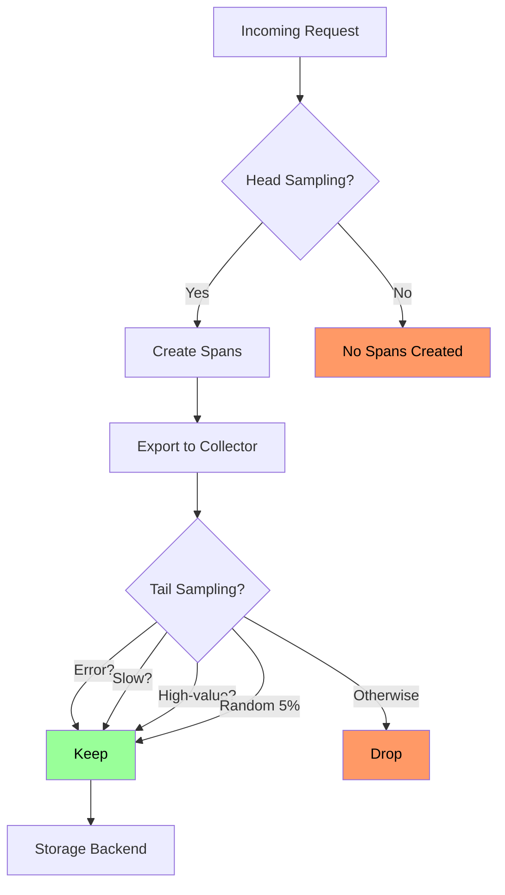
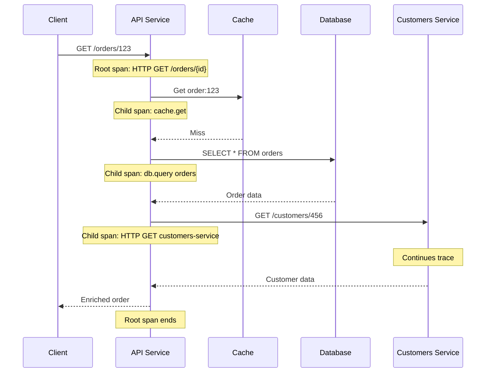
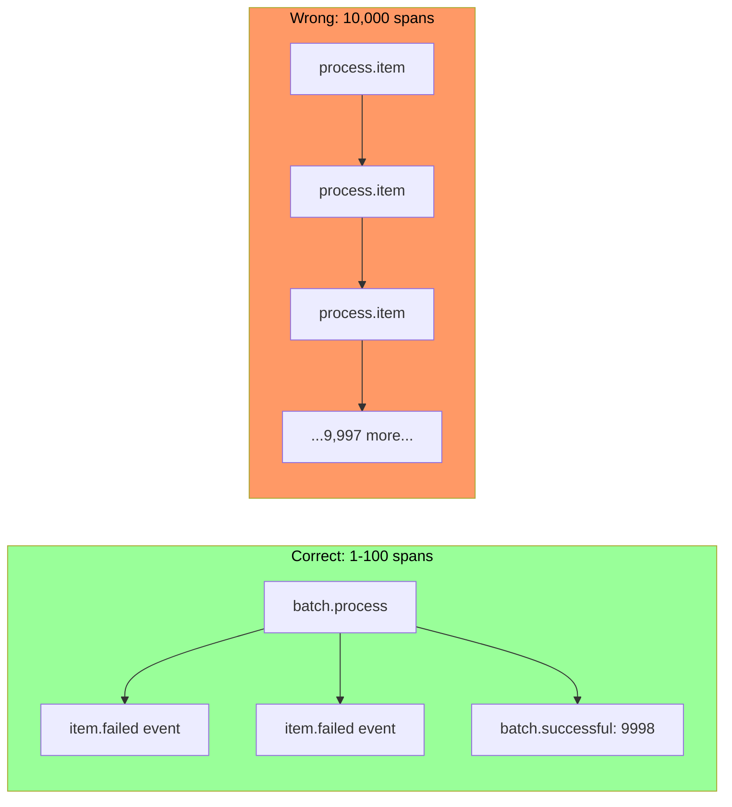

*[OTel]: OpenTelemetry
*[SDK]: Software Development Kit
*[gRPC]: gRPC Remote Procedure Calls
*[DB]: Database
*[SLA]: Service Level Agreement
*[P99]: 99th Percentile
*[OTLP]: OpenTelemetry Protocol

More spans provide more visibility. That's the intuition, anyway. But each span has costs: CPU overhead for creation, memory for attributes, network bandwidth for export, storage in your backend, and cognitive load when you're actually trying to read the trace. A request that creates 500 spans might have excellent granularity, but the trace waterfall becomes a solid block of color—no white space, no visible hierarchy. Debugging means scrolling through hundreds of spans looking for the slow one. Storage costs explode. The instrumentation itself becomes a performance concern.

Span design requires judgment, not just enthusiasm for visibility. The goal is _enough_ spans to debug problems, not so many that you create new ones.

I learned this the hard way. A team I worked with instrumented a new service with spans for every function call, database query, cache lookup, and external request. Thorough, right? A typical request generated 200+ spans. The trace backend showed a waterfall of solid color—no gaps, no obvious structure. Finding the slow operation meant scrolling through hundreds of spans, mentally filtering out the noise. Storage costs tripled in a month.

They refactored. Instrumented service boundaries, significant I/O operations, and error paths. Span count dropped to 15-20 per request. Traces became readable. The critical path was obvious at a glance. Storage costs dropped 90%. Debugging time went from minutes to seconds.

The lesson: granularity without readability is noise, not observability.

<Callout type="warning">
The span count that's "right" depends on your debugging needs. A payment service might need fine-grained spans to audit every step. A high-throughput cache might need minimal spans to avoid overhead. There's no universal number—but there are universal principles.
</Callout>

## Span Fundamentals

Before diving into granularity decisions, it helps to understand what you're actually creating when you start a span. Every span carries overhead, and that overhead scales with how much data you attach to it.

### Anatomy of a Span

A span has six core components:

__Identity__ ties the span to its trace. The `trace_id` (16 bytes) is shared across every span in the trace—it's what lets your backend stitch together spans from different services. The `span_id` (8 bytes) uniquely identifies this span. The `parent_span_id` links to the parent span, creating the hierarchy that becomes your waterfall visualization.

__Naming__ tells you what operation this span represents. The name should describe the operation (`HTTP GET /api/orders/{orderId}`), and the kind indicates the span's role in the request flow: `SERVER` for handling incoming requests, `CLIENT` for outgoing calls, `PRODUCER` and `CONSUMER` for async messaging, `INTERNAL` for operations that don't cross network boundaries.

__Timing__ captures when the span started and ended, with nanosecond precision. Duration is simply end minus start—this is what your trace backend uses to identify slow operations.

__Status__ records the outcome: `UNSET` (no status set), `OK` (operation succeeded), or `ERROR` (operation failed). For errors, you can include a message describing what went wrong.

__Attributes__ are key-value pairs that add context. Some follow OpenTelemetry semantic conventions (`http.method`, `db.system`), others are custom to your domain (`order.id`, `customer.tier`). Attributes are where most of your per-span overhead comes from—each attribute requires memory allocation and serialization.

__Events__ are timestamped logs within the span's lifetime. Use them for milestones: `cache.miss`, `retry.attempt`, `validation.failed`. Events are lighter than child spans but still have overhead.

__Links__ connect spans across traces—useful when one request triggers another asynchronously. For example, when processing a message from a queue, you can link back to the span that originally enqueued it:

```typescript title="span-links.ts"
import { trace, SpanKind, context } from '@opentelemetry/api';

const tracer = trace.getTracer('message-processor');

async function processMessage(message: Message) {
  // Extract the trace context from the message that was enqueued earlier
  const producerContext = propagation.extract(context.active(), message.headers);
  const producerSpanContext = trace.getSpanContext(producerContext);

  return tracer.startActiveSpan(
    'message.process',
    {
      kind: SpanKind.CONSUMER,
      links: producerSpanContext ? [{ context: producerSpanContext }] : [],
    },
    async (span) => {
      span.setAttribute('message.id', message.id);
      await handleMessage(message);
      span.end();
    }
  );
}
```
Code: Linking a consumer span to its producer.

Each of these components has a cost. Memory for the span object itself runs 200-500 bytes depending on attribute count. CPU cycles go to attribute serialization. Network bandwidth carries the span to your collector. Storage in your backend keeps it queryable. These costs are small individually, but they multiply by span count.

### Span Hierarchy and Context

Spans form a tree. The root span represents the entry point—usually an incoming HTTP request. Child spans nest inside the root, representing operations that happen during request processing. This hierarchy is what creates the waterfall visualization in your trace UI.

The key mechanism is _context propagation_. When you call `startActiveSpan`, OpenTelemetry automatically makes that span the "current" span. Any child spans you create inherit the parent from this context. When you make an outgoing HTTP call, the trace context gets injected into headers so the downstream service can continue the trace.

Here's what this looks like in practice—a request handler that checks cache, queries the database if needed, and enriches the result:

```typescript title="span-hierarchy.ts"
// OpenTelemetry span hierarchy example
import { trace, SpanKind, SpanStatusCode } from '@opentelemetry/api';

const tracer = trace.getTracer('order-service');

async function handleGetOrder(req: Request, res: Response) {
  return tracer.startActiveSpan(
    'HTTP GET /orders/:id',
    { kind: SpanKind.SERVER },
    async (rootSpan) => {
      try {
        rootSpan.setAttribute('order.id', req.params.id);

        // Child span created automatically under rootSpan
        const cachedOrder = await checkCache(req.params.id);
        if (cachedOrder) {
          rootSpan.setAttribute('cache.hit', true);
          return res.json(cachedOrder);
        }

        rootSpan.setAttribute('cache.hit', false);
        const order = await fetchOrderFromDb(req.params.id);

        rootSpan.setStatus({ code: SpanStatusCode.OK });
        return res.json(order);
      } catch (error) {
        rootSpan.setStatus({ code: SpanStatusCode.ERROR, message: error.message });
        rootSpan.recordException(error);
        throw error;
      } finally {
        rootSpan.end();
      }
    }
  );
}

async function checkCache(orderId: string): Promise<Order | null> {
  return tracer.startActiveSpan('cache.get', { kind: SpanKind.INTERNAL }, async (span) => {
    try {
      span.setAttribute('cache.key', `order:${orderId}`);
      const result = await redis.get(`order:${orderId}`);
      span.setAttribute('cache.hit', result !== null);
      return result ? JSON.parse(result) : null;
    } finally {
      span.end();
    }
  });
}

async function fetchOrderFromDb(orderId: string): Promise<Order> {
  return tracer.startActiveSpan('db.query', { kind: SpanKind.CLIENT }, async (span) => {
    try {
      span.setAttribute('db.system', 'postgresql');
      span.setAttribute('db.operation', 'SELECT');
      const result = await db.query('SELECT * FROM orders WHERE id = $1', [orderId]);
      span.setAttribute('db.rows_affected', result.rowCount);
      return result.rows[0];
    } finally {
      span.end();
    }
  });
}
```
Code: Span hierarchy with parent-child relationships.

This produces a readable waterfall—you can see at a glance that the request spent time in cache lookup, then database, then enrichment. The gaps between spans show where time went to uninstrumented code (JSON parsing, business logic).

```mermaid
gantt
    title Trace Waterfall (readable)
    dateFormat X
    axisFormat %L ms

    section Request
    HTTP GET /orders/123           :a1, 0, 150

    section Cache
    cache.get                      :a2, 5, 15

    section Database
    db.query orders                :a3, 20, 80

    section Enrichment
    enrichOrder                    :a4, 85, 140
    http.get /customers/456        :a5, 90, 120
    http.get /products/789         :a6, 90, 110
```


Figure: Readable trace waterfall with clear hierarchy.

<Callout type="info">
Span hierarchy creates the waterfall visualization. Parent-child relationships show which operations are nested within others. The trace's critical path becomes visible when you can see which child spans are sequential vs parallel.
</Callout>

## Granularity Guidelines

### What to Instrument

The question "should this operation have a span?" comes up constantly. Here's how I think about it.

__Always instrument service boundaries.__ Incoming HTTP/gRPC requests, outgoing HTTP/gRPC calls, message queue publish/consume—these are the spans that stitch your distributed trace together. Without them, your trace stops at service boundaries and you lose visibility into cross-service latency.

__Always instrument I/O operations.__ Database queries, cache reads/writes, file system operations. I/O is where latency lives. A trace that doesn't show database time is a trace that can't explain why a request was slow.

__Always instrument external dependencies.__ Third-party APIs, payment processors, cloud service SDKs. External services are the leading cause of incidents. When Stripe is slow or an S3 call times out, you want that visible in your traces.

__Instrument significant business operations.__ Order processing, payment validation, user authentication—operations that matter to your business and that you might need to debug. The keyword is "significant." Not every function, just the ones you'd want to see in a trace when something goes wrong.

Some operations need judgment:

- __Loops with external calls__: Wrap the loop, not each iteration. A batch that processes 100 items should create one span for the batch, not 100 spans.
- __Retry logic__: One span per attempt can be useful for debugging retry storms, but link them together so you can see the full retry sequence.
- __Parallel operations__: A span for the fan-out operation, with child spans for each parallel branch.

__Avoid instrumenting pure computation.__ JSON parsing, field validation, data transformation—these are CPU-bound operations that rarely need their own spans. If you need timing, add it as an attribute on the parent span.

__Avoid instrumenting every function call.__ This is the trap that creates unreadable traces. Instrument boundaries and I/O, not internal implementation details.

| Operation | Span? | Alternative | Why |
|-----------|-------|-------------|-----|
| HTTP request handler | Yes | - | Service boundary |
| Database query | Yes | - | I/O latency |
| JSON parsing | No | Attribute | Pure computation |
| Each loop iteration | No | Wrap loop | Overhead |
| External API call | Yes | - | Dependency visibility |
| Field validation | No | Attribute | Too granular |
| Error handling | No | Event | Within parent span |

Table: Span decision matrix.

### Span vs Event vs Attribute

Once you've decided something deserves visibility in a trace, you have three options: span, event, or attribute. Each has different costs and use cases.

__Spans__ represent operations with duration. They have start and end times, can have child spans, and appear as bars in your waterfall. Use them for I/O operations and significant boundaries. Cost: highest (memory allocation, context propagation, serialization).

__Events__ are timestamped points within a span's lifetime. They don't have duration—they mark moments. Use them for milestones: "validation started," "cache miss," "retry attempted." Cost: moderate (stored with parent span, but no separate context).

__Attributes__ are key-value metadata attached to a span. They describe the operation: IDs, counts, flags, outcomes. Use them for context that helps you understand the span. Cost: lowest (just map entries).

Here's the pattern in practice:

```typescript title="span-event-attribute.ts"
// Span vs event vs attribute in practice
import { trace, SpanKind, SpanStatusCode } from '@opentelemetry/api';

const tracer = trace.getTracer('order-service');

async function processOrder(order: Order) {
  return tracer.startActiveSpan('processOrder', async (span) => {
    // ATTRIBUTES: metadata about the operation
    span.setAttribute('order.id', order.id);
    span.setAttribute('order.item_count', order.items.length);

    // EVENT: milestone within the span
    span.addEvent('validation.started');
    const validationResult = validateOrder(order);
    span.addEvent('validation.completed', {
      'validation.passed': validationResult.valid,
    });

    if (!validationResult.valid) {
      span.setAttribute('validation.error', validationResult.error);
      span.setStatus({ code: SpanStatusCode.ERROR });
      span.end();
      return;
    }

    // CHILD SPAN: I/O operation deserves its own span
    await tracer.startActiveSpan('db.insertOrder', async (dbSpan) => {
      dbSpan.setAttribute('db.system', 'postgresql');
      await db.insert(order);
      dbSpan.end();
    });

    span.addEvent('order.persisted');

    // CHILD SPAN: external service call
    await tracer.startActiveSpan('payment.charge', { kind: SpanKind.CLIENT }, async (paymentSpan) => {
      paymentSpan.setAttribute('payment.amount', order.totalAmount);
      const result = await paymentService.charge(order);
      paymentSpan.setAttribute('payment.transaction_id', result.transactionId);
      paymentSpan.end();
    });

    span.setStatus({ code: SpanStatusCode.OK });
    span.end();
  });
}

// validateOrder() is pure computation - no span needed
function validateOrder(order: Order): ValidationResult {
  const valid = order.items.length > 0 && order.totalAmount > 0;
  return { valid, error: valid ? undefined : 'Invalid order' };
}
```
Code: Using spans for I/O, events for milestones, attributes for metadata.

Notice that `validateOrder()` doesn't get a span—it's pure computation. The validation timing is captured as an event attribute if you need it. The database insert and payment call _do_ get spans because they're I/O operations where latency matters.

<Callout type="success">
Rule of thumb: if it involves I/O (network, disk, database), make it a span. If it's a milestone within an operation, make it an event. If it's metadata about the operation, make it an attribute. Spans are expensive; events and attributes are cheap.
</Callout>

## Performance Overhead

### Measuring Span Costs

Span overhead is real but often misunderstood. People either ignore it entirely ("tracing is free") or overestimate it ("we can't afford instrumentation"). The actual cost depends on span count, attribute count, and throughput.

Here's what you're paying for with each span:

__Span creation__ costs 1-5 microseconds. You're allocating a span object, generating an 8-byte span ID, copying the parent context, and recording a start timestamp.

__Attribute setting__ costs 0.1-1 microsecond per attribute. Type conversion, string allocation, map insertion. Attribute _count_ matters more than attribute _size_—ten small attributes cost more than one large one.

__Span ending__ costs 1-2 microseconds. Recording the end timestamp, calculating duration, enqueueing for export.

__Export__ is amortized across batches (typically 512-2048 spans). Serialization to OTLP protobuf, network I/O to your collector, ingestion at your backend.

__Memory__ runs 200-500 bytes per in-flight span, depending on attribute count.

In aggregate, a single span with a few attributes costs roughly 5-10 microseconds of CPU time. That sounds negligible, but it multiplies:

| Throughput | Spans/Request | Spans/Second | CPU Overhead | Action |
|------------|---------------|--------------|--------------|--------|
| 100 RPS | 20 | 2,000 | &lt;1% | None needed |
| 1,000 RPS | 20 | 20,000 | 1-3% | Monitor |
| 10,000 RPS | 20 | 200,000 | 5-15% | Sample |
| 1,000 RPS | 200 | 200,000 | 10-20% | Reduce spans |

Table: Overhead scales with span volume, not request volume.

The last row is the trap. Over-instrumented services (200 spans per request) hit the same overhead as high-throughput services (10,000 RPS) at a fraction of the traffic. The fix isn't sampling—it's reducing span count.

### Sampling Strategies

When overhead becomes a concern, sampling lets you capture representative traces without instrumenting everything. There are two fundamental approaches: head sampling (decide at span creation) and tail sampling (decide after seeing the complete trace).

__Head sampling__ decides whether to create spans before the request starts. The upside is zero overhead for dropped traces—if you're not sampling this request, you don't create any spans. The downside is you might drop interesting traces (errors, slow requests) because you couldn't know they'd be interesting when sampling occurred.

The most common head sampler is ratio-based: sample 10% of traces by hashing the trace ID. Parent-based sampling builds on this—if an upstream service already sampled a trace, continue sampling; if they dropped it, you drop it too. This keeps distributed traces coherent.

```typescript title="head-sampling.ts"
// Head sampling configurations
import { TraceIdRatioBasedSampler, ParentBasedSampler } from '@opentelemetry/sdk-trace-base';

// Sample 10% of traces by trace ID hash
const ratioSampler = new TraceIdRatioBasedSampler(0.1);

// Respect parent's decision, use 10% ratio for root spans
const parentBasedSampler = new ParentBasedSampler({
  root: new TraceIdRatioBasedSampler(0.1),
});
```
Code: Head sampling with ratio and parent-based samplers.

__Tail sampling__ decides after seeing the complete trace. This happens in your collector, not your application. The collector buffers traces for a few seconds, then applies policies: keep all errors, keep slow traces, keep traces from enterprise customers, drop the rest. The upside is you never miss interesting traces. The downside is you still pay the overhead of creating all those spans—you're just dropping them before storage.

```yaml title="otel-collector-tail-sampling.yaml"
# OpenTelemetry Collector tail sampling configuration
processors:
  tail_sampling:
    decision_wait: 10s
    num_traces: 100000
    policies:
      - name: errors
        type: status_code
        status_code: { status_codes: [ERROR] }
      - name: slow-traces
        type: latency
        latency: { threshold_ms: 1000 }
      - name: high-value
        type: string_attribute
        string_attribute: { key: customer.tier, values: [enterprise] }
      - name: baseline
        type: probabilistic
        probabilistic: { sampling_percentage: 5 }
```
Code: Tail sampling in the OpenTelemetry Collector.

The typical pattern: use head sampling for high-throughput services where overhead matters, use tail sampling when you can afford the overhead but want comprehensive error capture. The following diagram shows how these two approaches interact in a typical pipeline:


Figure: Head sampling reduces overhead; tail sampling preserves interesting traces.

<Callout type="warning">
Head sampling reduces instrumentation overhead but might drop interesting traces. Tail sampling sees complete traces but requires buffering and doesn't reduce application overhead. Use head sampling for high-throughput services, tail sampling for comprehensive error capture.
</Callout>

## Trace Readability

### Waterfall Anti-Patterns

A trace is only useful if you can read it. I've seen traces that technically contain all the information needed to debug a problem, but the information is buried in noise. Here are the anti-patterns to avoid.

__Wall of spans.__ The waterfall is solid color—no gaps, no white space. You can't see the structure because there's a span for everything. Every function call, every loop iteration, every trivial operation. The cause is over-instrumentation. The fix is reducing span count and using events for milestones instead of child spans.

__Flat hierarchy.__ All spans at the same level, no nesting. You can't tell which operations are contained within others, or whether operations ran sequentially or in parallel. The cause is usually not using `startActiveSpan` (which automatically sets parent context) or not propagating context to background tasks. The fix is ensuring child spans inherit from their parents.

__Missing gaps.__ Spans account for 100% of request time—no uninstrumented periods visible. This sounds good but actually hides information. The gaps in a trace show where time went to uninstrumented code (JSON parsing, business logic, framework overhead). If there are no gaps, you can't distinguish "the database was slow" from "the instrumentation overhead was high."

__Cryptic names.__ Span names like "span," "operation," "handler," or "process" that don't explain what's happening. Auto-instrumentation often produces these—you get a span for every HTTP call, but the name is just "GET" without any indication of what resource. The fix is customizing span names to follow the pattern "operation resource" (`HTTP GET /api/orders`, `db.query orders`).

__Attribute explosion.__ Hundreds of attributes per span because someone dumped all available context. The trace viewer loads slowly, important attributes are buried in noise, and storage costs balloon. The fix is selecting relevant attributes deliberately, not including everything available.

A good trace has 10-30 spans per request, 3-5 levels of nesting, clear names that explain each operation, and visible gaps that show where uninstrumented time went. You should be able to identify the critical path (the longest sequence of spans) at a glance.

Compare this over-instrumented trace to the readable one shown earlier:

```mermaid
gantt
    title Trace Waterfall (over-instrumented)
    dateFormat X
    axisFormat %L ms

    section Request
    HTTP GET /orders/123           :a1, 0, 150

    section Validation
    validate.request               :a2, 2, 5
    parse.json                     :a3, 5, 8
    validate.orderId               :a4, 8, 10

    section Cache
    cache.get                      :a5, 10, 12
    serialize.key                  :a6, 10, 11
    redis.get                      :a7, 11, 12
    deserialize.result             :a8, 12, 13

    section Database
    db.getConnection               :a9, 15, 18
    db.query orders                :a10, 18, 75
    db.releaseConnection           :a11, 75, 77
    map.toEntity                   :a12, 77, 79

    section Response
    serialize.json                 :a13, 140, 145
    set.headers                    :a14, 145, 147
    send.response                  :a15, 147, 150
```


Figure: Over-instrumented trace—wall of spans obscures the critical path.

The over-instrumented trace has 15 spans where 4 would suffice. You can't see at a glance that the database query (`db.query orders`) took 57ms and dominated the request. The signal is buried in noise.

### Naming Conventions

Span names should answer "what operation on what resource?" without requiring you to read the code. The OpenTelemetry semantic conventions provide a good starting point.

For __HTTP servers__, use `HTTP {method} {route}`: `HTTP GET /api/orders/{orderId}`. The route should be parameterized (with `{orderId}`, not the actual ID) to keep cardinality low.

For __HTTP clients__, use `HTTP {method}` with the target service in an attribute: `HTTP GET` with `peer.service: payments-api`.

For __databases__, use `db.{operation} {table}`: `db.query orders`, `db.insert users`. Don't include the full SQL query in the name—that goes in an attribute if needed.

For __caches__, use `cache.{operation}`: `cache.get`, `cache.set`. Include the key pattern in an attribute.

For __internal operations__, use `{domain}.{operation}`: `order.validate`, `payment.process`, `inventory.reserve`.

| Context | Good Name | Bad Name | Problem with Bad Name |
|---------|-----------|----------|----------------------|
| HTTP handler | `HTTP GET /api/orders/{id}` | `handler` | No indication of method or resource |
| Database | `db.query orders` | `SELECT * FROM...` | SQL syntax noise, potential sensitive data |
| Cache | `cache.get` | `redis` | Technology not operation—what did you do? |
| Business logic | `order.validate` | `validateOrder` | Function name leaks implementation detail |
| External API | `HTTP POST` | `API call` | No method, no way to distinguish calls |

Table: Span naming patterns.

<Callout type="info">
Span names should answer "what operation on what resource?" at a glance. A developer should understand the trace without reading code. Use the OpenTelemetry semantic conventions as a starting point.
</Callout>

## Attribute Design

### Selecting Attributes

Attributes carry the metadata that makes traces useful. Choose them carefully—every attribute consumes storage, affects query performance, and either helps or clutters your debugging experience.

**Essential attributes** belong on every relevant span. Identity attributes (`service.name`, `service.version`) let you filter traces by service and compare behavior across deployments—trace and span IDs are added automatically. Request attributes (`http.method`, `http.route`, `http.status_code`) describe the operation. User attributes (`user.id`, `user.role`, `tenant.id`) enable filtering by customer segment. Business attributes (`order.id`, `customer.tier`, `feature.flag`) connect technical traces to domain concepts.

**Contextual attributes** add value in specific situations. Performance attributes (`db.rows_affected`, `cache.hit`, `retry.count`, `queue.depth`) help explain why an operation was slow. Debugging attributes (`error.type`, `error.message`, `exception.stacktrace`) accelerate root cause analysis. Business attributes like `payment.amount` or `order.item_count` provide context when investigating specific transactions.

**Avoid certain attribute categories entirely.** PII (email addresses, names, credit card numbers, full IP addresses) creates compliance risk and rarely helps debugging—use pseudonymous identifiers instead. High-cardinality values (request IDs, timestamps, session IDs) bloat indexes without adding queryable value—use the trace ID for correlation, not a separate request ID. Large values (full request bodies, complete SQL queries) waste storage and obscure other attributes—log these elsewhere if needed. Redundant data (duration, parent span ID) duplicates information already in the span structure.

**Cardinality determines query performance.** Low-cardinality attributes (under 100 unique values) like `http.method` or `http.status_code` index efficiently and query quickly. Medium-cardinality attributes (100–10,000 values) like `http.route` or `tenant.id` work acceptably for most backends. High-cardinality attributes (over 10,000 values) like timestamps or UUIDs cause index bloat and slow queries—avoid them unless essential.

### Attribute Value Patterns

How you format attribute values matters as much as which attributes you choose. These patterns keep cardinality low while preserving useful information:

```typescript title="attribute-patterns.ts"
import { trace, SpanStatusCode, Span } from '@opentelemetry/api';

// Pattern 1: Normalize high-cardinality values
function setHttpRouteAttribute(span: Span, path: string) {
  // Bad: /api/users/123 (high cardinality)
  // Good: /api/users/{userId} (low cardinality)
  const normalizedRoute = path
    .replace(/\/users\/[a-f0-9-]+/g, '/users/{userId}')
    .replace(/\/orders\/[a-f0-9-]+/g, '/orders/{orderId}')
    .replace(/\/\d+/g, '/{id}');

  span.setAttribute('http.route', normalizedRoute);
  span.setAttribute('resource.id', extractId(path)); // Keep actual ID separately
}

// Pattern 2: Bucket continuous values
function setLatencyBucket(span: Span, durationMs: number) {
  // Bad: 147.23 (infinite cardinality)
  // Good: "100-200ms" (finite buckets)
  const buckets = [0, 10, 50, 100, 200, 500, 1000, 5000, Infinity];
  const bucket = buckets.find((b, i) => durationMs < buckets[i + 1]);
  span.setAttribute('latency.bucket', `${bucket}-${buckets[buckets.indexOf(bucket) + 1]}ms`);
}

// Pattern 3: Redact sensitive data
function setUserAttribute(span: Span, user: User) {
  span.setAttribute('user.id', user.id);    // Pseudonymous identifier
  span.setAttribute('user.tier', user.tier);
  // Don't include: email, name, phone, address
}

// Pattern 4: Structured error handling
function setErrorAttributes(span: Span, error: Error) {
  span.setAttribute('error.type', error.constructor.name);
  span.setAttribute('error.message', error.message.slice(0, 500)); // Truncate
  span.recordException(error); // Full stack trace goes here, not as attribute
  span.setStatus({ code: SpanStatusCode.ERROR, message: error.message });
}

// Pattern 5: Boolean and enum attributes
function setOutcomeAttributes(span: Span, result: Result) {
  span.setAttribute('cache.hit', result.fromCache);          // Boolean
  span.setAttribute('result.status', result.status);         // Enum: 'success', 'failure'
  span.setAttribute('result.source', result.source);         // Enum: 'cache', 'database'
}
```
Code: Attribute value patterns.

<Callout type="warning">
High-cardinality attributes kill trace backend performance. Every unique attribute value becomes an index entry. Use parameterized routes (`/users/{id}` not `/users/123`), bucket continuous values, and avoid timestamps or UUIDs as attribute values.
</Callout>

## Practical Patterns

### Request Lifecycle Instrumentation

A well-instrumented request follows a predictable pattern: extract incoming trace context, create a root span for your service, add child spans for I/O operations, propagate context on outgoing calls, and record the outcome.

**Middleware creates the root span.** The tracing middleware extracts any incoming trace context (so your service continues an existing trace rather than starting a new one), creates the root span with `SpanKind.SERVER`, and ensures the span ends when the response finishes—regardless of success or failure.

```typescript title="tracing-middleware.ts"
import { trace, context, SpanKind, SpanStatusCode, propagation } from '@opentelemetry/api';
import express from 'express';

const tracer = trace.getTracer('api-service', '1.0.0');

function tracingMiddleware(req: express.Request, res: express.Response, next: express.NextFunction) {
  const extractedContext = propagation.extract(context.active(), req.headers);

  const span = tracer.startSpan(
    `HTTP ${req.method} ${normalizeRoute(req.path)}`,
    {
      kind: SpanKind.SERVER,
      attributes: {
        'http.method': req.method,
        'http.route': normalizeRoute(req.path),
        'service.name': 'api-service',
      },
    },
    extractedContext
  );

  req.span = span;

  res.on('finish', () => {
    span.setAttribute('http.status_code', res.statusCode);
    span.setStatus(res.statusCode >= 400
      ? { code: SpanStatusCode.ERROR, message: `HTTP ${res.statusCode}` }
      : { code: SpanStatusCode.OK });
    span.end();
  });

  context.with(trace.setSpan(context.active(), span), () => next());
}
```
Code: Tracing middleware creates the root span.

**Route handlers add child spans for I/O.** With the middleware handling span lifecycle, route handlers focus on business logic. Create child spans only for I/O operations—cache lookups, database queries, external calls—not for in-memory computation.

```typescript title="route-handler.ts"
async function getOrderHandler(req: express.Request, res: express.Response) {
  const orderId = req.params.orderId;
  req.span?.setAttribute('order.id', orderId);

  try {
    // Child span: cache lookup
    const cached = await tracer.startActiveSpan('cache.get', async (span) => {
      const result = await cache.get(`order:${orderId}`);
      span.setAttribute('cache.hit', result !== null);
      span.end();
      return result;
    });

    if (cached) return res.json(cached);

    // Child span: database query
    const order = await tracer.startActiveSpan('db.query orders', async (span) => {
      span.setAttribute('db.system', 'postgresql');
      const result = await db.query('SELECT * FROM orders WHERE id = $1', [orderId]);
      span.setAttribute('db.rows_affected', result.rowCount);
      span.end();
      return result.rows[0];
    });

    if (!order) {
      req.span?.setStatus({ code: SpanStatusCode.ERROR, message: 'Not found' });
      return res.status(404).json({ error: 'Order not found' });
    }

    res.json(order);
  } catch (error) {
    req.span?.recordException(error);
    req.span?.setStatus({ code: SpanStatusCode.ERROR, message: error.message });
    res.status(500).json({ error: 'Internal server error' });
  }
}
```
Code: Route handler with child spans for I/O operations.

**External calls propagate context.** When calling other services, inject the current trace context into outgoing headers. This connects spans across service boundaries into a single distributed trace.

```typescript title="external-call.ts"
async function fetchCustomer(customerId: string): Promise<Customer> {
  return tracer.startActiveSpan('HTTP GET customers-service', { kind: SpanKind.CLIENT }, async (span) => {
    span.setAttribute('peer.service', 'customers-service');

    const headers: Record<string, string> = {};
    propagation.inject(context.active(), headers);

    try {
      const response = await fetch(`http://customers-service/customers/${customerId}`, { headers });
      span.setAttribute('http.status_code', response.status);
      return response.ok ? response.json() : null;
    } finally {
      span.end();
    }
  });
}
```
Code: Context propagation on external calls.

The sequence diagram shows how these pieces fit together. The root span encompasses the entire request, child spans capture individual I/O operations, and context propagation links the trace across service boundaries.


Figure: Request instrumentation sequence.

### Batch Processing Instrumentation

Batch processing is where span proliferation gets dangerous. Creating a span per item in a 10,000-item batch generates 10,000 spans—overwhelming your collector, bloating storage, and producing unreadable waterfalls.

**The correct pattern: one span for the batch.** Wrap the entire batch in a single span. Record individual failures as events rather than child spans. Use attributes to capture summary statistics.

```typescript title="batch-single-span.ts"
import { trace, SpanKind, SpanStatusCode } from '@opentelemetry/api';

const tracer = trace.getTracer('batch-processor');

async function processBatch(items: Item[]): Promise<BatchResult> {
  return tracer.startActiveSpan('batch.process', { kind: SpanKind.CONSUMER }, async (span) => {
    span.setAttribute('batch.size', items.length);

    const results = { successful: 0, failed: 0 };

    for (const item of items) {
      try {
        await processItem(item);
        results.successful++;
      } catch (error) {
        results.failed++;
        // Record failure as event, not child span
        span.addEvent('item.failed', { 'item.id': item.id, 'error.message': error.message });
      }
    }

    span.setAttribute('batch.successful', results.successful);
    span.setAttribute('batch.failed', results.failed);
    span.setStatus(results.failed > 0
      ? { code: SpanStatusCode.ERROR, message: `${results.failed} items failed` }
      : { code: SpanStatusCode.OK });
    span.end();

    return results;
  });
}
```
Code: Single span for a batch with events for failures.

**For very large batches: spans per chunk.** If you need more granularity than a single batch span provides, create spans for chunks of 10–100 items—never for individual items. This gives you visibility into which portion of the batch had problems without creating thousands of spans.

```typescript title="batch-chunked.ts"
async function processLargeBatch(items: Item[]): Promise<BatchResult> {
  const chunks = chunkArray(items, 100);

  return tracer.startActiveSpan('batch.process', async (batchSpan) => {
    batchSpan.setAttribute('batch.total_items', items.length);
    batchSpan.setAttribute('batch.chunk_count', chunks.length);

    let totalSuccessful = 0, totalFailed = 0;

    for (let i = 0; i < chunks.length; i++) {
      await tracer.startActiveSpan('batch.chunk', async (chunkSpan) => {
        chunkSpan.setAttribute('chunk.index', i);
        const results = await processChunk(chunks[i]);
        chunkSpan.setAttribute('chunk.successful', results.successful);
        chunkSpan.end();

        totalSuccessful += results.successful;
        totalFailed += results.failed;
      });
    }

    batchSpan.setAttribute('batch.successful', totalSuccessful);
    batchSpan.setAttribute('batch.failed', totalFailed);
    batchSpan.end();
    return { successful: totalSuccessful, failed: totalFailed };
  });
}
```
Code: Chunked spans for large batches.

**The anti-pattern: span per item.** This looks intuitive but scales terribly. A 10,000-item batch creates 10,000 spans, each with overhead for creation, context propagation, and export.

```typescript title="batch-wrong.ts"
// WRONG: Creates thousands of spans
async function processBatchWrong(items: Item[]): Promise<void> {
  for (const item of items) {
    await tracer.startActiveSpan('process.item', async (span) => {
      await processItem(item);
      span.end();
    });
  }
}
```
Code: Anti-pattern—span per item.

The difference in trace output is stark:


Figure: Batch instrumentation approaches—events vs spans.

<Callout type="success">
For batch processing: one span for the batch, events for individual failures, attributes for summary statistics. If you need finer granularity, use spans for chunks (10-100 items), not individual items. A 10,000-item batch should create 1-100 spans, not 10,000.
</Callout>

## Conclusion

Span design is an engineering tradeoff: visibility versus overhead, granularity versus readability, detail versus cost. The goal isn't maximum spans—it's enough spans to debug problems efficiently.

Instrument service boundaries, I/O operations, and significant business logic. Use events for milestones within spans. Use attributes for metadata that helps filtering and debugging. Sample aggressively in high-throughput services—you don't need every trace, just enough to catch problems. Follow naming conventions so waterfalls tell a story at a glance.

The best traces answer three questions: what happened, where time was spent, and what failed. The worst traces are walls of noise that hide the signal you need.

Start by auditing your current traces: pick a typical request, count the spans, and ask whether you could identify the slow operation in under 10 seconds. If not, you've found your first refactoring target.

<Callout type="info">
Start with minimal instrumentation—auto-instrumentation plus key business operations—then add spans only when you can't debug a specific problem. You can always add granularity; removing it requires code changes. Let debugging needs drive instrumentation, not the quest for "complete" visibility.
</Callout>
