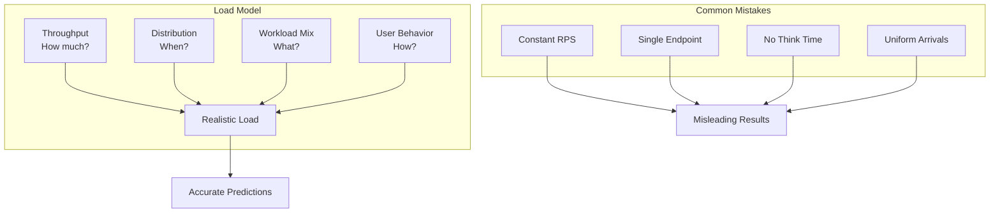
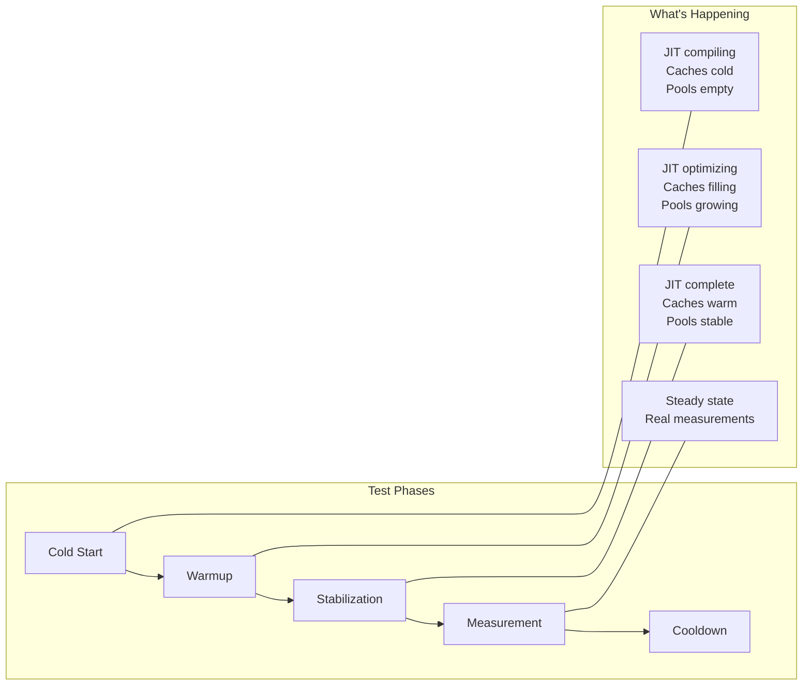
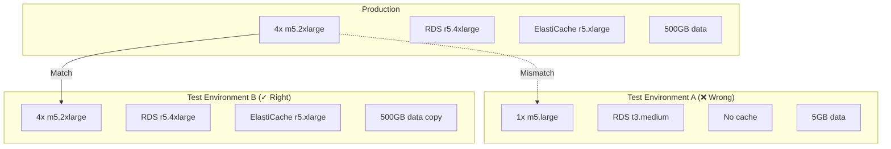

*[RPS]: Requests Per Second
*[TPS]: Transactions Per Second
*[P50]: 50th Percentile (Median)
*[P95]: 95th Percentile
*[P99]: 99th Percentile
*[JIT]: Just-In-Time Compilation
*[JVM]: Java Virtual Machine
*[SUT]: System Under Test
*[CI]: Continuous Integration
*[SLA]: Service Level Agreement
*[CPU]: Central Processing Unit
*[GC]: Garbage Collection

# Performance Tests That Do Not Lie

## Introduction

Frame the credibility problem in performance testing: most benchmarks produce numbers that look precise but mean nothing. A test that hammers an endpoint with 10,000 RPS for 60 seconds tells you how the system behaves under that specific, artificial load—but not how it handles production traffic patterns. This section establishes that accurate performance testing requires realistic load models, proper warmup, environment parity, and statistical rigor. The goal isn't impressive numbers; it's trustworthy data that predicts production behavior. A "fast" benchmark that doesn't reflect reality is worse than no benchmark—it creates false confidence.

_Include a scenario: a team benchmarks their new API gateway, achieving 50,000 RPS with 2ms P99 latency. They deploy to production. Within hours, latency spikes to 200ms under 5,000 RPS. The benchmark used uniform request distribution, but production has bursty traffic. The benchmark hit one endpoint repeatedly; production hits hundreds of endpoints with different costs. The benchmark ran on dedicated hardware; production shares resources. The benchmark measured cold cache; production has warm caches that change behavior. They rebuild their performance suite with realistic load models, traffic patterns, and environment parity. Now benchmarks predict production within 15%. The lesson: a benchmark is a model of reality—if the model is wrong, the predictions are worthless._

<Callout type="warning">
The most common performance testing mistake: measuring throughput without realistic load patterns. Synthetic load (constant RPS, uniform distribution) produces numbers that have no relationship to production performance.
</Callout>

## Load Model Fundamentals

### Anatomy of a Load Model

```yaml title="load-model-anatomy.yaml"
# Load model components

load_model:
  # === Traffic Volume ===
  throughput:
    description: "How many requests per second"
    types:
      constant: "Fixed RPS for duration"
      ramping: "Gradually increase/decrease"
      stepped: "Discrete increases over time"
      variable: "Follows a pattern (time-of-day)"

  # === Traffic Shape ===
  distribution:
    description: "How requests arrive"
    types:
      uniform: "Even spacing between requests"
      poisson: "Random arrivals (realistic)"
      bursty: "Clustered arrivals"

  # === Request Mix ===
  workload_mix:
    description: "What operations are performed"
    components:
      - endpoint_distribution: "Which APIs are called"
      - operation_ratios: "Read vs write ratio"
      - payload_sizes: "Request/response sizes"
      - user_scenarios: "Multi-step workflows"

  # === User Behavior ===
  think_time:
    description: "Delay between user actions"
    importance: "Simulates real user pacing"
    typical_values:
      web_browsing: "1-5 seconds"
      api_automation: "0-100 milliseconds"

  # === Concurrency ===
  virtual_users:
    description: "Simulated concurrent users"
    relationship: "RPS = users × (requests/user/second)"
    considerations:
      - "Connection pooling"
      - "Session state"
      - "Resource contention"

---
# Example: e-commerce load model
ecommerce_example:
  peak_rps: 5000

  endpoint_distribution:
    "GET /products": 40%
    "GET /products/{id}": 25%
    "GET /cart": 15%
    "POST /cart/items": 10%
    "POST /orders": 5%
    "GET /orders/{id}": 5%

  read_write_ratio: "85:15"

  user_scenarios:
    browse_only: 60%      # View products, no purchase
    add_to_cart: 25%      # Browse + add items
    complete_purchase: 15% # Full checkout flow

  think_time:
    min: 500ms
    max: 3000ms
    distribution: "log-normal"
```
Code: Load model components.


Figure: Load model components and mistakes.

### Traffic Patterns

```typescript title="traffic-patterns.ts"
// k6 load test with realistic traffic patterns

import http from 'k6/http';
import { check, sleep } from 'k6';
import { randomIntBetween } from 'https://jslib.k6.io/k6-utils/1.2.0/index.js';

// === Pattern 1: Realistic ramping ===
export const options = {
  scenarios: {
    // Gradual ramp-up simulating morning traffic increase
    morning_ramp: {
      executor: 'ramping-vus',
      startVUs: 0,
      stages: [
        { duration: '5m', target: 100 },   // Ramp up
        { duration: '10m', target: 100 },  // Steady state
        { duration: '5m', target: 200 },   // Peak approaching
        { duration: '20m', target: 200 },  // Peak period
        { duration: '5m', target: 100 },   // Post-peak
        { duration: '5m', target: 0 },     // Ramp down
      ],
    },
  },
  thresholds: {
    http_req_duration: ['p(95)<500', 'p(99)<1000'],
    http_req_failed: ['rate<0.01'],
  },
};

// === Pattern 2: Endpoint distribution ===
const endpoints = [
  { path: '/api/products', weight: 40, method: 'GET' },
  { path: '/api/products/123', weight: 25, method: 'GET' },
  { path: '/api/cart', weight: 15, method: 'GET' },
  { path: '/api/cart/items', weight: 10, method: 'POST', body: { productId: '123', quantity: 1 } },
  { path: '/api/orders', weight: 5, method: 'POST', body: { cartId: 'cart-123' } },
  { path: '/api/orders/456', weight: 5, method: 'GET' },
];

function selectEndpoint() {
  const random = Math.random() * 100;
  let cumulative = 0;

  for (const endpoint of endpoints) {
    cumulative += endpoint.weight;
    if (random <= cumulative) {
      return endpoint;
    }
  }
  return endpoints[0];
}

// === Pattern 3: Realistic think time ===
function thinkTime() {
  // Log-normal distribution: most users are quick, some are slow
  const mean = 2000; // 2 seconds average
  const stddev = 1000;

  // Box-Muller transform for normal distribution
  const u1 = Math.random();
  const u2 = Math.random();
  const normal = Math.sqrt(-2 * Math.log(u1)) * Math.cos(2 * Math.PI * u2);

  // Convert to log-normal (always positive)
  const logNormal = Math.exp(Math.log(mean) + (stddev / mean) * normal);

  // Clamp to reasonable range
  return Math.min(Math.max(logNormal, 100), 10000) / 1000;
}

// === Main test function ===
export default function () {
  const endpoint = selectEndpoint();
  const url = `${__ENV.BASE_URL}${endpoint.path}`;

  let response;
  if (endpoint.method === 'GET') {
    response = http.get(url);
  } else {
    response = http.post(url, JSON.stringify(endpoint.body), {
      headers: { 'Content-Type': 'application/json' },
    });
  }

  check(response, {
    'status is 2xx': (r) => r.status >= 200 && r.status < 300,
    'response time < 500ms': (r) => r.timings.duration < 500,
  });

  // Realistic think time between requests
  sleep(thinkTime());
}
```
Code: Realistic traffic patterns in k6.

| Pattern | Description | When to Use |
|---------|-------------|-------------|
| Constant | Fixed RPS | Baseline capacity testing |
| Ramping | Gradual increase | Find breaking point |
| Stepped | Discrete jumps | Identify thresholds |
| Spike | Sudden burst | Test auto-scaling |
| Soak | Long duration | Memory leaks, degradation |

Table: Load patterns.

<Callout type="info">
Production traffic is never uniform. Real users browse, pause, click, wait, and leave. Model this with think time distributions and realistic endpoint mixes derived from production analytics.
</Callout>

## Warmup and Steady State

### Why Warmup Matters

```yaml title="warmup-importance.yaml"
# Why warmup is critical

warmup_effects:
  jit_compilation:
    description: "Code compiled during execution"
    affected_systems: ["JVM (Java, Kotlin, Scala)", "V8 (Node.js)", ".NET"]
    cold_penalty: "10-100x slower than warmed up"
    warmup_duration: "Thousands of invocations per code path"

  connection_pools:
    description: "Database/HTTP connections established"
    cold_state: "Zero connections, must establish"
    warm_state: "Pool filled, reuse existing"
    warmup_duration: "Until pool reaches steady size"

  caches:
    description: "Data loaded into memory"
    layers:
      - "CPU cache (L1/L2/L3)"
      - "Application cache (Redis, Memcached)"
      - "Database buffer pool"
      - "OS page cache"
    cold_penalty: "Orders of magnitude slower"

  auto_scaling:
    description: "Instances/pods scaling up"
    cold_state: "Minimum instances"
    warm_state: "Scaled to handle load"
    warmup_duration: "Minutes for cloud auto-scaling"

  garbage_collection:
    description: "GC behavior stabilizes"
    cold_state: "Frequent minor GCs, heap sizing"
    warm_state: "Predictable GC patterns"
    jvm_note: "Use -XX:+AlwaysPreTouch for faster warmup"

---
# Warmup anti-patterns
anti_patterns:
  no_warmup:
    problem: "Include cold start in measurements"
    result: "Artificially high latency numbers"

  insufficient_warmup:
    problem: "JIT not fully optimized"
    result: "Numbers improve during test"

  measuring_warmup:
    problem: "Count warmup requests in stats"
    result: "Skewed averages and percentiles"

  different_warmup_load:
    problem: "Warmup pattern differs from test"
    result: "Wrong code paths optimized"
```
Code: Warmup importance.

### Warmup Implementation

```typescript title="warmup-implementation.ts"
// k6 warmup implementation

import http from 'k6/http';
import { check } from 'k6';

export const options = {
  scenarios: {
    // === Warmup phase (results discarded) ===
    warmup: {
      executor: 'constant-vus',
      vus: 50,
      duration: '3m',
      tags: { phase: 'warmup' },
      exec: 'warmupFunction',
    },

    // === Measurement phase (results counted) ===
    measurement: {
      executor: 'constant-vus',
      vus: 100,
      duration: '10m',
      startTime: '3m30s', // Start after warmup + 30s buffer
      tags: { phase: 'measurement' },
      exec: 'measurementFunction',
    },
  },

  thresholds: {
    // Only apply thresholds to measurement phase
    'http_req_duration{phase:measurement}': ['p(95)<200', 'p(99)<500'],
    'http_req_failed{phase:measurement}': ['rate<0.001'],
  },
};

// Warmup: hit all code paths
export function warmupFunction() {
  // Hit every endpoint to warm JIT and caches
  const endpoints = [
    '/api/products',
    '/api/products/1',
    '/api/cart',
    '/api/orders',
  ];

  for (const endpoint of endpoints) {
    http.get(`${__ENV.BASE_URL}${endpoint}`);
  }
}

// Measurement: realistic load pattern
export function measurementFunction() {
  // Same as production load model
  const response = http.get(`${__ENV.BASE_URL}/api/products`);

  check(response, {
    'status is 200': (r) => r.status === 200,
  });
}
```
Code: k6 warmup phases.

```yaml title="java-warmup.yaml"
# JVM warmup specifics

jvm_warmup:
  # JIT compilation thresholds
  compilation_thresholds:
    client_compiler: 1500    # -XX:CompileThreshold (client)
    server_compiler: 10000   # -XX:CompileThreshold (server)
    tiered_c1: 200           # Tier 1 (C1 with profiling)
    tiered_c2: 5000          # Tier 2 (full C2 optimization)

  # Warmup JVM flags
  recommended_flags:
    - "-XX:+AlwaysPreTouch"           # Pre-allocate heap
    - "-XX:+UseStringDeduplication"   # Reduce memory after warmup
    - "-XX:CompileThreshold=1000"     # Faster warmup (less optimal code)
    - "-XX:+PrintCompilation"         # Monitor JIT (debugging only)

  # Warmup detection
  steady_state_indicators:
    - "No new compilations (JIT done)"
    - "GC frequency stabilized"
    - "Response times stable (< 5% variance)"
    - "CPU usage stable"

  # Warmup duration guidelines
  duration_guidelines:
    simple_service: "30-60 seconds"
    complex_service: "2-5 minutes"
    with_caches: "Until cache hit rate stabilizes"
    rule_of_thumb: "Until P99 latency stops improving"
```
Code: JVM warmup.


Figure: Test phases.

<Callout type="warning">
Never include warmup data in your results. Tag phases separately and apply thresholds only to the measurement phase. Warmup latencies can be 10-100x higher than steady-state and will completely skew your statistics.
</Callout>

## Statistical Rigor

### Beyond Averages

```yaml title="statistics-fundamentals.yaml"
# Why averages lie

average_problems:
  hides_distribution:
    example: "Average 100ms might mean all requests at 100ms, or 90% at 50ms and 10% at 550ms"
    impact: "10% of users have terrible experience"

  sensitive_to_outliers:
    example: "One 10-second timeout skews average of 1000 requests"
    impact: "Single bad request changes the narrative"

  ignores_tail:
    example: "P99 could be 10x the average"
    impact: "1% of users (possibly your most important) suffer"

---
# Metrics that matter
meaningful_metrics:
  percentiles:
    p50: "Median - typical experience"
    p90: "90th percentile - most users"
    p95: "95th percentile - common SLA target"
    p99: "99th percentile - tail latency"
    p999: "99.9th percentile - worst common case"

  distribution:
    histogram: "Full latency distribution"
    heatmap: "Latency over time"

  error_rates:
    error_percentage: "Failed requests / total"
    error_types: "Breakdown by error code"

  throughput:
    actual_rps: "Achieved vs target"
    saturation_point: "Where latency degrades"

---
# Statistical significance
significance:
  sample_size:
    minimum: "1000+ requests for stable percentiles"
    p99_stable: "10,000+ requests"
    p999_stable: "100,000+ requests"

  variance:
    coefficient_of_variation: "stddev / mean"
    acceptable: "< 10% for stable systems"
    concerning: "> 20% indicates instability"

  confidence_intervals:
    purpose: "Range where true value likely lies"
    typical: "95% confidence interval"
    reporting: "P99 = 150ms ± 10ms (95% CI)"
```
Code: Statistics fundamentals.

### Analyzing Results

```python title="result-analysis.py"
# Performance test result analysis

import numpy as np
from scipy import stats
import pandas as pd

def analyze_latencies(latencies_ms: list[float]) -> dict:
    """Comprehensive latency analysis."""

    arr = np.array(latencies_ms)

    return {
        # Central tendency
        'mean': np.mean(arr),
        'median': np.median(arr),
        'mode': stats.mode(arr, keepdims=True).mode[0],

        # Percentiles
        'p50': np.percentile(arr, 50),
        'p90': np.percentile(arr, 90),
        'p95': np.percentile(arr, 95),
        'p99': np.percentile(arr, 99),
        'p999': np.percentile(arr, 99.9),

        # Spread
        'stddev': np.std(arr),
        'variance': np.var(arr),
        'iqr': np.percentile(arr, 75) - np.percentile(arr, 25),
        'range': np.max(arr) - np.min(arr),

        # Shape
        'skewness': stats.skew(arr),  # > 0 means right tail
        'kurtosis': stats.kurtosis(arr),  # > 0 means heavy tails

        # Coefficient of variation (relative spread)
        'cv': np.std(arr) / np.mean(arr),

        # Sample size
        'n': len(arr),
    }


def compare_runs(baseline: list[float], candidate: list[float]) -> dict:
    """Statistical comparison of two test runs."""

    baseline_arr = np.array(baseline)
    candidate_arr = np.array(candidate)

    # Mann-Whitney U test (non-parametric, doesn't assume normal distribution)
    statistic, p_value = stats.mannwhitneyu(
        baseline_arr,
        candidate_arr,
        alternative='two-sided'
    )

    # Effect size (how much difference)
    baseline_median = np.median(baseline_arr)
    candidate_median = np.median(candidate_arr)

    percent_change = ((candidate_median - baseline_median) / baseline_median) * 100

    # Confidence interval for difference
    # Bootstrap method
    n_bootstrap = 10000
    diffs = []
    for _ in range(n_bootstrap):
        b_sample = np.random.choice(baseline_arr, size=len(baseline_arr), replace=True)
        c_sample = np.random.choice(candidate_arr, size=len(candidate_arr), replace=True)
        diffs.append(np.median(c_sample) - np.median(b_sample))

    ci_lower = np.percentile(diffs, 2.5)
    ci_upper = np.percentile(diffs, 97.5)

    return {
        'baseline_median': baseline_median,
        'candidate_median': candidate_median,
        'percent_change': percent_change,
        'p_value': p_value,
        'significant': p_value < 0.05,
        'ci_95_lower': ci_lower,
        'ci_95_upper': ci_upper,
        'interpretation': interpret_result(percent_change, p_value),
    }


def interpret_result(percent_change: float, p_value: float) -> str:
    """Human-readable interpretation."""

    if p_value >= 0.05:
        return "No statistically significant difference detected"

    direction = "faster" if percent_change < 0 else "slower"
    magnitude = abs(percent_change)

    if magnitude < 5:
        significance = "marginally"
    elif magnitude < 15:
        significance = "moderately"
    else:
        significance = "significantly"

    return f"Candidate is {significance} {direction} ({magnitude:.1f}%)"


# Example usage
baseline_results = [100, 105, 98, 102, ...]  # ms
candidate_results = [95, 92, 98, 91, ...]    # ms

analysis = analyze_latencies(candidate_results)
comparison = compare_runs(baseline_results, candidate_results)

print(f"P99 Latency: {analysis['p99']:.1f}ms")
print(f"Comparison: {comparison['interpretation']}")
print(f"P-value: {comparison['p_value']:.4f}")
```
Code: Result analysis.

| Metric | What It Tells You | Watch For |
|--------|-------------------|-----------|
| P50 (Median) | Typical user experience | Gap between mean and median |
| P95 | Most users' worst case | SLA compliance |
| P99 | Tail latency | 1 in 100 requests |
| Std Dev | Consistency | High variance = instability |
| CV | Relative spread | > 0.2 indicates problems |
| Throughput | Capacity | Saturation point |

Table: Key metrics.

<Callout type="success">
Report percentiles, not averages. Include confidence intervals. Show the distribution, not just summary statistics. A histogram of latencies tells a story that P99 alone cannot.
</Callout>

## Environment Parity

### Production vs Test Environment

```yaml title="environment-parity.yaml"
# Environment parity checklist

critical_factors:
  compute:
    must_match:
      - "CPU type and generation"
      - "Core count"
      - "Memory size"
      - "Instance type (if cloud)"
    often_different:
      - "Dedicated vs shared tenancy"
      - "CPU throttling policies"
      - "Noisy neighbor effects"

  data:
    must_match:
      - "Database size (approximate)"
      - "Index statistics"
      - "Cache hit rates"
    often_different:
      - "Full production data vs sample"
      - "Data distribution"
      - "Hot vs cold data ratio"

  network:
    must_match:
      - "Network topology"
      - "Load balancer configuration"
      - "Connection limits"
    often_different:
      - "Latency between services"
      - "Bandwidth constraints"
      - "DNS resolution time"

  dependencies:
    must_match:
      - "Service versions"
      - "Database versions"
      - "Cache configuration"
    often_different:
      - "Third-party API behavior"
      - "Rate limits"
      - "Mock vs real services"

---
# Environment differences impact
impact_examples:
  smaller_database:
    difference: "Test DB is 1% of production size"
    impact: "All queries hit index, no table scans"
    result: "10x faster in test than production"

  cold_cache:
    difference: "Test cache is empty at start"
    impact: "Initial requests hit database"
    result: "Warmup period not representative"

  different_instance_type:
    difference: "Test uses m5.large, prod uses m5.xlarge"
    impact: "Half the CPU and memory"
    result: "Earlier saturation, different bottlenecks"

  mocked_dependencies:
    difference: "External APIs mocked with instant response"
    impact: "No network latency, no rate limiting"
    result: "Throughput appears 2-3x higher"
```
Code: Environment parity factors.

### Achieving Parity

```yaml title="achieving-parity.yaml"
# Strategies for environment parity

strategies:
  infrastructure_as_code:
    approach: "Same Terraform/Pulumi for test and prod"
    benefits:
      - "Identical configurations"
      - "Version controlled"
      - "Reproducible"
    limitations:
      - "Cost (full prod replica expensive)"
      - "Data still differs"

  production_traffic_replay:
    approach: "Capture and replay production requests"
    tools:
      - "GoReplay (gor)"
      - "Toxiproxy"
      - "Custom capture"
    benefits:
      - "Real traffic patterns"
      - "Real request distribution"
    limitations:
      - "Privacy concerns"
      - "Data dependencies"

  shadow_traffic:
    approach: "Mirror production traffic to test environment"
    implementation: "Load balancer duplicates requests"
    benefits:
      - "Real traffic in real-time"
      - "No impact on production"
    limitations:
      - "Write operations problematic"
      - "Cost of duplicate processing"

  scaled_down_production:
    approach: "Smaller but proportional environment"
    example: "1/10th the instances, 1/10th the load"
    benefits:
      - "Cost effective"
      - "Same architecture"
    limitations:
      - "Non-linear scaling effects"
      - "Some bottlenecks don't scale"

---
# Database parity
database_parity:
  data_volume:
    minimum: "Same order of magnitude"
    ideal: "Production snapshot"

  data_distribution:
    requirement: "Similar cardinality and distribution"
    approach: "Use production data with PII removed"

  index_statistics:
    requirement: "Run ANALYZE after data load"
    impact: "Query planner makes same decisions"

  cache_warmth:
    requirement: "Pre-warm buffer pool"
    approach: "Run representative queries before test"
```
Code: Parity strategies.


Figure: Environment parity comparison.

<Callout type="warning">
The biggest source of benchmark inaccuracy is environment mismatch. A test that runs 10x faster than production tells you nothing about production. Budget for production-equivalent test infrastructure.
</Callout>

## Common Pitfalls

### Benchmark Anti-Patterns

```yaml title="benchmark-antipatterns.yaml"
# Performance testing anti-patterns

anti_patterns:
  coordinated_omission:
    description: "Load generator waits for response before sending next request"
    problem: "Slow responses reduce actual load"
    example: |
      Target: 1000 RPS
      Reality: If P99 is 100ms, you're generating ~10 RPS during slow periods
    fix: "Use open-loop load generation (send regardless of responses)"
    tools: "wrk2, k6 with arrival-rate executor"

  measuring_the_client:
    description: "Load generator becomes the bottleneck"
    symptoms:
      - "CPU maxed on load generator"
      - "Network saturated on client"
      - "Latency includes client processing"
    fix: "Distributed load generation, monitor client resources"

  ignoring_gc_pauses:
    description: "GC pauses cause latency spikes not in test"
    problem: "Short tests don't trigger full GC"
    fix: "Run long enough to see GC patterns (30+ minutes)"

  single_run_results:
    description: "One test run treated as truth"
    problem: "Variance between runs can be 10-20%"
    fix: "Multiple runs, statistical analysis"

  wrong_percentile_calculation:
    description: "Calculating percentiles incorrectly"
    common_mistakes:
      - "Averaging percentiles across time windows"
      - "Using too few samples"
      - "Not accounting for coordinated omission"
    fix: "Keep all raw data, calculate once at end"

---
# Coordinated omission example
coordinated_omission_example:
  scenario: "Target 100 RPS, 10 second test"

  closed_loop_wrong:
    description: "Wait for response before next request"
    normal_case:
      actual_requests: 1000
      actual_rps: 100
    slow_server_case:
      p99_latency: 500ms
      actual_requests: 200  # Only 200 requests completed!
      measured_p99: 500ms   # Looks fine
      real_user_p99: 5000ms # Users actually waited this long

  open_loop_correct:
    description: "Send requests on schedule regardless"
    normal_case:
      actual_requests: 1000
      actual_rps: 100
    slow_server_case:
      actual_requests: 1000  # All 1000 sent
      measured_p99: 5000ms   # Shows true latency
      queue_depth: "Visible in metrics"
```
Code: Benchmark anti-patterns.

### Coordinated Omission Explained

```typescript title="coordinated-omission.ts"
// Demonstrating coordinated omission

// === WRONG: Closed-loop (coordinated omission) ===
async function closedLoopTest(durationMs: number, targetRps: number) {
  const intervalMs = 1000 / targetRps;
  const start = Date.now();
  const latencies: number[] = [];

  while (Date.now() - start < durationMs) {
    const requestStart = Date.now();
    await makeRequest(); // BLOCKS until response
    const latency = Date.now() - requestStart;
    latencies.push(latency);

    // Problem: If request took 500ms at target 100 RPS (10ms interval),
    // we're now 490ms behind schedule. Next request starts late.
    // Slow responses REDUCE the load, hiding the problem.
  }

  return latencies;
}

// === RIGHT: Open-loop (no coordinated omission) ===
async function openLoopTest(durationMs: number, targetRps: number) {
  const intervalMs = 1000 / targetRps;
  const start = Date.now();
  const latencies: number[] = [];
  const pending: Promise<void>[] = [];

  let nextSendTime = start;

  while (Date.now() - start < durationMs) {
    const scheduledTime = nextSendTime;

    // Fire request without waiting for response
    const requestPromise = (async () => {
      // Wait until scheduled time (if we're ahead)
      const now = Date.now();
      if (now < scheduledTime) {
        await sleep(scheduledTime - now);
      }

      const requestStart = Date.now();
      await makeRequest();
      const latency = Date.now() - requestStart;

      // Record latency INCLUDING queue time
      const totalLatency = Date.now() - scheduledTime;
      latencies.push(totalLatency);
    })();

    pending.push(requestPromise);
    nextSendTime += intervalMs;

    // Don't block - immediately schedule next
  }

  await Promise.all(pending);
  return latencies;
}

// === k6 open-loop equivalent ===
export const k6Options = {
  scenarios: {
    open_loop: {
      executor: 'constant-arrival-rate',  // Key: arrival rate, not VUs
      rate: 100,                           // 100 iterations per timeUnit
      timeUnit: '1s',                      // = 100 RPS
      duration: '5m',
      preAllocatedVUs: 200,                // Enough VUs to handle queuing
      maxVUs: 500,
    },
  },
};
```
Code: Coordinated omission demonstration.

| Issue | Symptom | Fix |
|-------|---------|-----|
| Coordinated omission | Load drops under stress | Open-loop generation |
| Client bottleneck | Client CPU at 100% | Distributed load gen |
| Single run variance | Results differ 20% between runs | Multiple runs + statistics |
| Short test duration | No GC, caches cold | Longer tests (30+ min) |
| Wrong percentiles | P99 from averaged windows | Calculate from raw data |

Table: Common pitfalls.

<Callout type="danger">
Coordinated omission is the most common and dangerous benchmark mistake. If your load generator waits for responses before sending the next request, slow responses reduce load, making the system appear healthier than it is. Use open-loop (arrival-rate) load generation.
</Callout>

## CI Integration

### Automated Performance Testing

```yaml title="ci-performance-testing.yaml"
# .github/workflows/performance.yml

name: Performance Tests

on:
  pull_request:
    branches: [main]
  schedule:
    - cron: '0 2 * * *'  # Nightly full suite

jobs:
  quick-benchmark:
    name: Quick Performance Check
    runs-on: ubuntu-latest
    if: github.event_name == 'pull_request'

    steps:
      - uses: actions/checkout@v4

      - name: Start application
        run: |
          docker-compose up -d
          ./scripts/wait-for-healthy.sh

      - name: Run quick benchmark
        run: |
          k6 run --duration 2m --vus 50 \
            -e BASE_URL=http://localhost:8080 \
            tests/performance/quick.js

      - name: Compare with baseline
        run: |
          python scripts/compare-results.py \
            --baseline baselines/main.json \
            --current results/current.json \
            --threshold 10  # Fail if >10% regression

  full-benchmark:
    name: Full Performance Suite
    runs-on: [self-hosted, performance]  # Dedicated hardware
    if: github.event_name == 'schedule'

    steps:
      - uses: actions/checkout@v4

      - name: Deploy to performance environment
        run: |
          kubectl apply -f k8s/performance/
          ./scripts/wait-for-ready.sh

      - name: Warm up
        run: |
          k6 run --duration 5m \
            -e BASE_URL=${{ secrets.PERF_ENV_URL }} \
            tests/performance/warmup.js

      - name: Run full suite
        run: |
          k6 run --duration 30m \
            -e BASE_URL=${{ secrets.PERF_ENV_URL }} \
            --out influxdb=${{ secrets.INFLUXDB_URL }} \
            tests/performance/full-suite.js

      - name: Generate report
        run: |
          python scripts/generate-report.py \
            --influxdb ${{ secrets.INFLUXDB_URL }} \
            --output reports/$(date +%Y-%m-%d).html

      - name: Update baseline (if main branch)
        if: github.ref == 'refs/heads/main'
        run: |
          python scripts/update-baseline.py \
            --source results/current.json \
            --target baselines/main.json

      - name: Upload report
        uses: actions/upload-artifact@v3
        with:
          name: performance-report
          path: reports/
```
Code: CI performance testing.

### Regression Detection

```python title="regression-detection.py"
#!/usr/bin/env python3
"""Performance regression detection."""

import json
import sys
from dataclasses import dataclass
from typing import Optional

@dataclass
class PerformanceResult:
    p50: float
    p95: float
    p99: float
    throughput: float
    error_rate: float


def load_results(path: str) -> PerformanceResult:
    with open(path) as f:
        data = json.load(f)
    return PerformanceResult(**data)


def compare_results(
    baseline: PerformanceResult,
    current: PerformanceResult,
    threshold_percent: float = 10.0,
) -> tuple[bool, list[str]]:
    """Compare current results against baseline."""

    regressions = []

    # Check latency regressions (higher is worse)
    for metric in ['p50', 'p95', 'p99']:
        baseline_val = getattr(baseline, metric)
        current_val = getattr(current, metric)
        change = ((current_val - baseline_val) / baseline_val) * 100

        if change > threshold_percent:
            regressions.append(
                f"{metric}: {baseline_val:.1f}ms → {current_val:.1f}ms "
                f"(+{change:.1f}% regression)"
            )

    # Check throughput regression (lower is worse)
    throughput_change = (
        (current.throughput - baseline.throughput) / baseline.throughput
    ) * 100

    if throughput_change < -threshold_percent:
        regressions.append(
            f"throughput: {baseline.throughput:.0f} → {current.throughput:.0f} RPS "
            f"({throughput_change:.1f}% regression)"
        )

    # Check error rate increase
    if current.error_rate > baseline.error_rate + 0.001:  # 0.1% absolute
        regressions.append(
            f"error_rate: {baseline.error_rate:.2%} → {current.error_rate:.2%}"
        )

    passed = len(regressions) == 0
    return passed, regressions


def main():
    baseline = load_results(sys.argv[1])
    current = load_results(sys.argv[2])
    threshold = float(sys.argv[3]) if len(sys.argv) > 3 else 10.0

    passed, issues = compare_results(baseline, current, threshold)

    if passed:
        print("✓ No performance regressions detected")
        print(f"  P99: {current.p99:.1f}ms (baseline: {baseline.p99:.1f}ms)")
        print(f"  Throughput: {current.throughput:.0f} RPS")
        sys.exit(0)
    else:
        print("✗ Performance regressions detected:")
        for issue in issues:
            print(f"  - {issue}")
        sys.exit(1)


if __name__ == '__main__':
    main()
```
Code: Regression detection script.

<Callout type="info">
Run quick benchmarks (2-5 minutes) on every PR to catch obvious regressions. Run full benchmarks (30+ minutes) nightly on dedicated hardware for accurate baselines. Compare against baselines with statistical significance, not just raw numbers.
</Callout>

## Conclusion

Summarize the requirements for trustworthy performance testing: realistic load models that match production traffic patterns, proper warmup to reach steady state, environment parity to match production conditions, statistical rigor to interpret results correctly, and awareness of common pitfalls like coordinated omission. A benchmark is a model of production behavior—invest in the model's accuracy. The cost of a misleading benchmark (false confidence, production incidents) far exceeds the cost of building a proper performance testing infrastructure. When in doubt, make tests more realistic, run them longer, and question any result that seems too good.

<Callout type="success">
The question isn't "how fast is my system?" but "how will my system behave under production conditions?" Build tests that answer the second question, even if the numbers are less impressive than synthetic benchmarks.
</Callout>

---

## Cover Prompt

### Prompt 1: The Truth Scales

Create an image of a scale of justice where one side holds a glowing "accurate" test result (realistic load model, proper warmup, statistical rigor) and the other holds a flashy but hollow "impressive" result (synthetic benchmarks). The accurate side is heavier, more valuable. A developer chooses the accurate side. Style: truth vs appearance, measurement integrity, honest data, 16:9 aspect ratio.

### Prompt 2: The Load Model Blueprint

Design an image of an architect studying blueprints that show traffic patterns—peaks, valleys, bursts, quiet periods. The blueprints overlay a city with roads showing traffic flow. Some roads are jammed (hot paths), others empty (cold paths). The architect designs tests that match this reality. Style: traffic modeling, realistic patterns, architectural planning, 16:9 aspect ratio.

### Prompt 3: The Warmup Gauge

Illustrate a complex machine with temperature gauges showing different systems warming up: JIT compiler, caches, connection pools. Some gauges are in the red (cold), transitioning to green (warm). A technician waits patiently, not starting measurements until all gauges are green. Style: warmup visualization, system readiness, patience in testing, 16:9 aspect ratio.

### Prompt 4: The Statistical Lens

Create an image of a scientist looking through a lens that transforms a single number (average) into a full distribution (histogram, percentiles). Without the lens, data appears simple but misleading. Through the lens, the true story emerges—outliers, tail latency, variance. Style: statistical insight, seeing the full picture, data interpretation, 16:9 aspect ratio.

### Prompt 5: The Mirror Environment

Design an image of two server rooms facing each other like mirrors—production on one side, test environment on the other. The mirror is slightly distorted where environments differ (smaller database, mocked services). A engineer adjusts the test environment to make the reflection perfect. Style: environment parity, mirror matching, configuration alignment, 16:9 aspect ratio.
