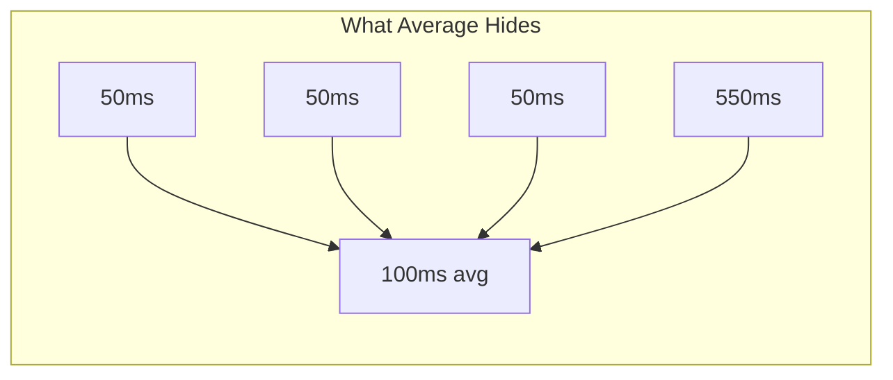

*[RPS]: Requests Per Second
*[P50]: 50th Percentile (Median)
*[P95]: 95th Percentile
*[P99]: 99th Percentile

The post-mortem was awkward. A team had spent three weeks building a performance test suite for their new API gateway. The benchmark showed 50,000 RPS with 2ms P99 latency. Leadership signed off on the deployment. Production fell over at 5,000 RPS.

The engineers weren't incompetent—they were victims of performance testing's hidden traps. Their benchmark measured _something_, just not anything useful for predicting production behavior. The load generator backed off when the system struggled (coordinated omission). The dashboards showed averages that hid catastrophic tail latency. The test environment bore no resemblance to production.

This pattern repeats constantly. Teams run benchmarks, get impressive numbers, deploy with confidence, and watch production burn. The numbers were accurate; they just didn't answer the right question.

Two mistakes cause most of the damage: _coordinated omission_ and _misusing averages_. Understanding these will save you from benchmarks that create false confidence before production incidents.

## The Coordinated Omission Trap

Coordinated omission is the most insidious benchmark mistake, and most load testing tools exhibit it by default. The name sounds academic, but the problem is concrete: your load generator lies to you about how bad things really are.

Here's how it works. Say you're targeting 100 RPS with a typical closed-loop test—one request at a time per virtual user. Under normal conditions, requests complete in 10ms, so you hit your target. Then the server starts struggling. P99 latency spikes to 500ms.

In a closed-loop test, that slow request _blocks the next one_. Instead of sending 100 requests that second, you send maybe 20. The benchmark reports "P99 is 500ms at 20 RPS." But real users would experience something far worse—they'd be waiting in a queue of 100 requests, not 20. The actual user experience might be 5,000ms or worse.

The benchmark backs off precisely when the system struggles, making it look healthier than it is.

```typescript title="coordinated-omission-concept.ts"
// Conceptual demonstration of coordinated omission (pseudocode)

// WRONG: Closed-loop testing
async function closedLoopTest(targetRps: number) {
  while (running) {
    const start = Date.now();
    await makeRequest(); // BLOCKS until response
    latencies.push(Date.now() - start);
    // Problem: If request took 500ms at target 100 RPS,
    // we're now 490ms behind schedule.
  }
}

// RIGHT: Open-loop testing
async function openLoopTest(targetRps: number) {
  const interval = 1000 / targetRps;
  let nextSendTime = Date.now();

  while (running) {
    const scheduled = nextSendTime;
    // Fire without waiting
    makeRequest().then(() => {
      latencies.push(Date.now() - scheduled);
    });
    nextSendTime += interval;
    // Don't block - schedule next immediately
  }
}
```

Code: Closed-loop vs open-loop load generation showing the coordinated omission problem.

The fix is open-loop load generation: send requests on schedule regardless of whether previous requests completed. In k6, use the `constant-arrival-rate` executor instead of `constant-vus`. Tools like wrk2 were designed specifically to avoid this problem. If your load generator doesn't support open-loop testing, your results under stress are fiction.

<Callout type="danger">
If your load generator waits for responses before sending the next request, slow responses reduce load, making the system appear healthier than it is. This is the single most common cause of benchmarks that look great and predict nothing.
</Callout>

## Averages Lie, Percentiles Tell Truth

Most performance dashboards default to showing average latency. Averages are almost always the wrong metric.

An average latency of 100ms might mean all requests completed in roughly 100ms. Or it might mean 90% finished in 50ms while 10% took 550ms. Same average, completely different user experience. In the second scenario, one in ten users has a terrible time, but your dashboard shows green.

Averages collapse under outliers in both directions. A single 10-second timeout in a thousand requests shifts the average dramatically, even though 99.9% of users were fine. Conversely, if that timeout represents a real failure mode hitting 1% of production users, the average hides it.

_Percentiles_ tell a more honest story:

| Metric | What It Shows | Why It Matters |
|--------|---------------|----------------|
| Average | Arithmetic mean | Hides bimodal distributions and outliers |
| P50 | Half of requests faster | Typical user experience |
| P95 | 95% of requests faster | Most users' worst case |
| P99 | 99% of requests faster | Where SLA problems hide |

Table: Average vs percentile metrics and their meaning.

Distribution shape matters too. Latency is never normally distributed—it's right-skewed with a long tail. A histogram reveals patterns summary statistics hide: bimodal distributions indicate cache hits vs misses, long tails indicate slow queries or external dependencies.



Figure: Four requests averaging 100ms, but one user waited 11x longer.

The practical fix: configure your monitoring to show P95 and P99 by default, not average. Set alerts on percentiles. When comparing runs, use statistical tests designed for non-normal distributions (Mann-Whitney U works well). Report confidence intervals, not point estimates.

<Callout type="success">
Report percentiles, not averages. Show distributions, not just summary statistics. A histogram tells stories that P99 alone cannot.
</Callout>

## The Rest of the Iceberg

Coordinated omission and average-worship are the most common problems, but they're not the only ones. A few other factors regularly invalidate benchmarks:

**Test duration matters.** A 2-minute benchmark misses garbage collection patterns that take 10-30 minutes to stabilize. It won't catch memory leaks, connection pool exhaustion, or cache eviction issues. For anything beyond quick smoke tests, run at least 30 minutes.

**Environment parity is non-negotiable.** A test database with 10,000 rows behaves differently than production with 10 million. Queries that use indexes in test might trigger full table scans in production. Mocked external APIs with instant responses hide the latency that dominates real-world performance.

**Single runs prove nothing.** Run-to-run variance of 10-20% is normal, even on identical systems. Background processes, CPU frequency scaling, and network conditions all contribute. Run at least 3 iterations and report the spread.

Each of these deserves deeper treatment than space allows here. The point is that performance testing has many failure modes, and getting impressive numbers is easy—getting _meaningful_ numbers requires understanding all the ways benchmarks can mislead.

## Building Benchmarks That Predict Production

The path forward is methodical: use open-loop load generation, report percentiles, run tests long enough to see steady-state behavior, match your test environment to production, and run multiple iterations. Integrate quick checks into CI pipelines to catch regressions before they merge. Run comprehensive nightly suites on production-equivalent infrastructure.

The question isn't "how fast is my system?" but "how will it behave under production conditions?" Build tests that answer the second question, even when the numbers are less impressive.

A benchmark that produces smaller numbers but actually predicts production is infinitely more valuable than one that produces impressive numbers and predicts nothing.

If you want to go deeper—load model design, warmup procedures, statistical rigor, CI integration—I've written a comprehensive guide covering everything you need to build a complete performance testing practice.

---

**CTA Title:** The Complete Guide to Performance Testing That Works

**CTA Body:** This article covers the two most critical performance testing mistakes, but there's much more to building a reliable benchmark suite. The full guide dives deep into load model design, warmup procedures, statistical analysis techniques, environment parity strategies, and CI integration patterns—complete with working code examples for k6, GitHub Actions, and Python analysis scripts. Download the complete guide to build performance tests you can actually trust.
