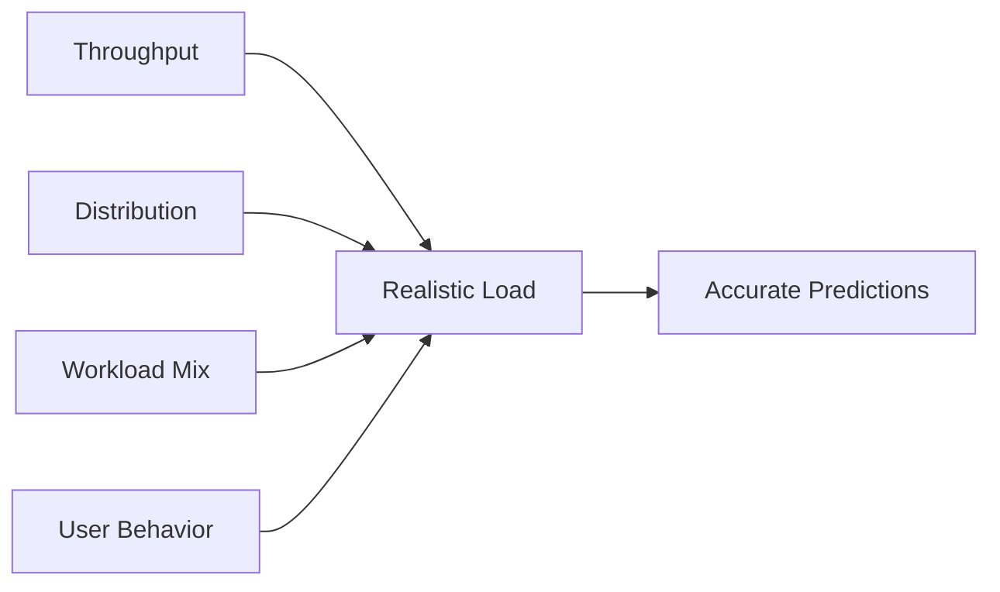
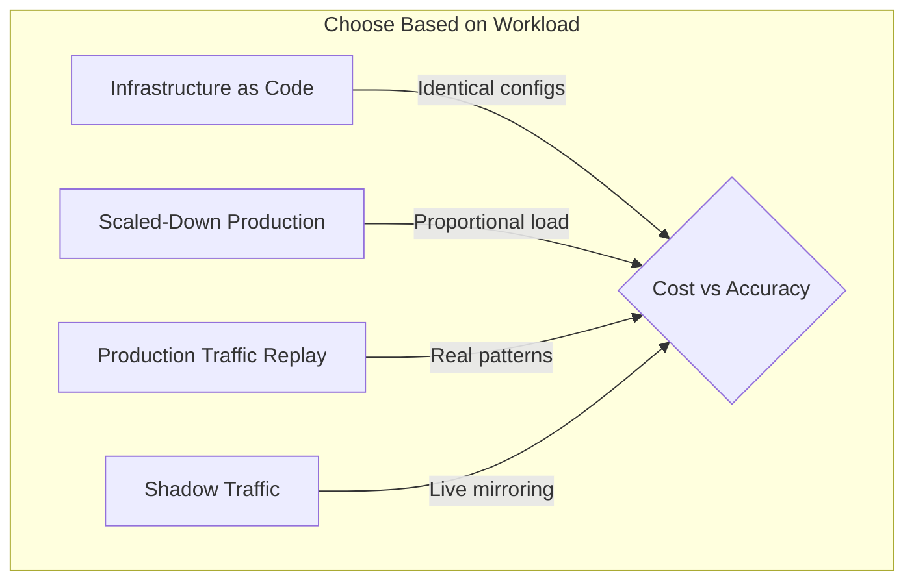

*[RPS]: Requests Per Second
*[TPS]: Transactions Per Second
*[P50]: 50th Percentile (Median)
*[P95]: 95th Percentile
*[P99]: 99th Percentile
*[JIT]: Just-In-Time Compilation
*[JVM]: Java Virtual Machine
*[SUT]: System Under Test
*[SLA]: Service Level Agreement
*[GC]: Garbage Collection

Most performance benchmarks produce numbers that look precise but mean nothing. A test that hammers an endpoint with 10,000 RPS for 60 seconds tells you how the system behaves under that specific, artificial load—but not how it handles production traffic patterns. The numbers are accurate; they're just not useful.

I've watched teams benchmark a new API gateway, achieving 50,000 RPS with 2ms P99 latency. Impressive numbers. They deployed to production. Within hours, latency spiked to 200ms under just 5,000 RPS—a tenth of the benchmark load. What went wrong?

The benchmark used uniform request distribution; production has bursty traffic. The benchmark hit one endpoint repeatedly; production hits hundreds of endpoints with different computational costs. The benchmark ran on dedicated hardware; production shares resources with noisy neighbors. The benchmark ran with cold caches that gradually warmed; production has fully warm caches with different memory pressure and GC patterns.

The team rebuilt their performance suite. They captured production traffic patterns and replayed them. They matched environment specifications. They ran long enough to see GC behavior stabilize. Now their benchmarks predict production within 15%.

The lesson: a benchmark is a model of reality. If the model is wrong, the predictions are worthless. A "fast" benchmark that doesn't reflect reality is worse than no benchmark—it creates false confidence that leads to production incidents.

Getting useful numbers requires realistic load models that match production traffic, proper warmup to reach steady state, environment parity with production infrastructure, and statistical rigor to interpret results correctly. This article covers each of those requirements.

<Callout type="warning">
The most common performance testing mistake: measuring throughput without realistic load patterns. Synthetic load (constant RPS, uniform distribution) produces numbers that have no relationship to production performance.
</Callout>

## Load Model Fundamentals

A load model defines _what_ you're testing. It's the specification that turns "test our API" into something concrete and reproducible. Without a well-defined load model, you're just throwing requests at a server and hoping the numbers mean something.

Before diving into load model design, a quick note on tooling. I use k6 for load testing, integrated into CI/CD pipelines. k6 scripts are JavaScript/TypeScript, which makes them easy to version control and review alongside application code. For alternatives, Locust (Python) and Gatling (Scala) are solid choices with their own ecosystems. Artillery is another JavaScript option with good AWS integration.

The bigger question is where to run these tests. Quick regression checks (2-5 minutes, moderate load) can run on CI runners against ephemeral environments. But serious performance testing—the kind that finds saturation points and validates capacity—needs dedicated infrastructure. The load generators need enough resources to not become the bottleneck, and the system under test needs to match production specifications. Cloud providers offer dedicated performance testing services (AWS has Distributed Load Testing, Azure has Load Testing), or you can provision your own infrastructure with consistent instance types. The key is reproducibility: if your test environment varies between runs, your results will too.

### Anatomy of a Load Model

A complete load model has four components: throughput (how much load), distribution (when requests arrive), workload mix (what operations), and user behavior (how users interact).

__Throughput__ is the simplest dimension—how many requests per second. But even this has nuance. Constant RPS is useful for baseline capacity testing but unrealistic. Ramping load helps find breaking points. Stepped increases identify specific thresholds. Variable patterns that follow time-of-day curves match production reality.

__Distribution__ determines how requests arrive within each second. Uniform distribution spaces requests evenly—one request every 10ms at 100 RPS. Real traffic doesn't work that way. Production traffic follows Poisson distributions with random arrivals, or bursty patterns where requests cluster together. A system that handles 1,000 evenly-spaced RPS might fall over when those same 1,000 requests arrive in bursts of 50.

__Workload mix__ specifies what operations you're testing. Most APIs have a power-law distribution: a few endpoints handle most traffic. E-commerce sites see 80% of requests on product browsing, 15% on cart operations, and 5% on checkout. If your benchmark hits the checkout endpoint at 100% weight, you're testing a scenario that never happens.

__User behavior__ is often overlooked but critical. Real users have think time—they read content, fill out forms, compare options. A benchmark that fires requests as fast as possible tests maximum theoretical throughput, not realistic capacity. Think time also affects connection pooling, session state, and resource contention.



Figure: The four components of a complete load model.

### Traffic Patterns

Here's how these concepts translate to code. The k6 options object defines the load shape—in this case, a ramping pattern that simulates a typical day's traffic curve with warmup, steady state, peak, and cooldown phases. The thresholds define pass/fail criteria that can gate CI pipelines.

```typescript title="k6-load-shape.ts"
// k6 load test configuration
import http from 'k6/http';
import { check, sleep } from 'k6';

export const options = {
  scenarios: {
    morning_ramp: {
      executor: 'ramping-vus',
      startVUs: 0,
      stages: [
        { duration: '5m', target: 100 },   // Ramp up
        { duration: '10m', target: 100 },  // Steady state
        { duration: '5m', target: 200 },   // Peak approaching
        { duration: '20m', target: 200 },  // Peak period
        { duration: '5m', target: 100 },   // Post-peak
        { duration: '5m', target: 0 },     // Ramp down
      ],
    },
  },
  thresholds: {
    http_req_duration: ['p(95)<500', 'p(99)<1000'],
    http_req_failed: ['rate<0.01'],
  },
};
```

Code: k6 options defining load shape and pass/fail thresholds.

The workload mix comes from production analytics. This endpoint distribution reflects a typical e-commerce pattern—heavy on browsing, light on checkout. The weights should match your actual traffic ratios.

```typescript title="k6-endpoint-weights.ts"
// Weighted endpoint distribution matching production analytics
const endpoints = [
  { path: '/api/products', weight: 40, method: 'GET' },
  { path: '/api/products/123', weight: 25, method: 'GET' },
  { path: '/api/cart', weight: 15, method: 'GET' },
  { path: '/api/cart/items', weight: 10, method: 'POST', body: { productId: '123', quantity: 1 } },
  { path: '/api/orders', weight: 5, method: 'POST', body: { cartId: 'cart-123' } },
  { path: '/api/orders/456', weight: 5, method: 'GET' },
];
```

Code: Endpoint weights derived from production traffic analysis.

The test harness ties everything together. In a CI workflow, k6 runs this script with a `BASE_URL` environment variable pointing at the test environment, and the exit code reflects whether thresholds passed. The `selectEndpoint` function does weighted random selection, and `thinkTime` generates log-normal delays—most virtual users act quickly, but some pause longer, matching real user behavior.

```typescript title="k6-test-harness.ts"
function selectEndpoint() {
  const random = Math.random() * 100;
  let cumulative = 0;

  for (const endpoint of endpoints) {
    cumulative += endpoint.weight;
    if (random <= cumulative) {
      return endpoint;
    }
  }
  return endpoints[0];
}

function thinkTime() {
  // Log-normal: most users quick, some slow
  const mean = 2000;
  const stddev = 1000;
  const u1 = Math.random();
  const u2 = Math.random();
  const normal = Math.sqrt(-2 * Math.log(u1)) * Math.cos(2 * Math.PI * u2);
  const logNormal = Math.exp(Math.log(mean) + (stddev / mean) * normal);
  return Math.min(Math.max(logNormal, 100), 10000) / 1000;
}

export default function () {
  const endpoint = selectEndpoint();
  const url = `${__ENV.BASE_URL}${endpoint.path}`;

  let response;
  if (endpoint.method === 'GET') {
    response = http.get(url);
  } else {
    response = http.post(url, JSON.stringify(endpoint.body), {
      headers: { 'Content-Type': 'application/json' },
    });
  }

  check(response, {
    'status is 2xx': (r) => r.status >= 200 && r.status < 300,
    'response time < 500ms': (r) => r.timings.duration < 500,
  });

  sleep(thinkTime());
}
```

Code: Test harness with weighted endpoint selection and realistic think time.

Different load patterns serve different purposes. Choose based on what you're trying to learn.

| Pattern | Description | When to Use |
|---------|-------------|-------------|
| Constant | Fixed RPS for duration | Baseline capacity measurement |
| Ramping | Gradual increase/decrease | Find breaking points and saturation |
| Stepped | Discrete jumps | Identify specific capacity thresholds |
| Spike | Sudden burst | Test auto-scaling response time |
| Soak | Long duration at steady load | Memory leaks, connection exhaustion, degradation |

Table: Load patterns and their use cases.

<Callout type="info">
Production traffic is never uniform. Real users browse, pause, click, wait, and leave. Model this with think time distributions and realistic endpoint mixes derived from production analytics. If you don't have production data yet, start with industry benchmarks for your application type and refine once you have real traffic.
</Callout>

## Warmup and Steady State

A cold system behaves nothing like a warm one. If you measure performance during the first few minutes of a test, you're measuring startup behavior—not steady-state capacity. The numbers will be wrong, sometimes by orders of magnitude.

### Why Warmup Matters

Several systems need time to reach optimal performance:

__JIT compilation__ is the biggest factor for JVM, V8, and .NET runtimes. Code starts interpreted and gets compiled to native code as hot paths are identified. The JVM's tiered compilation means code goes through multiple optimization passes. A cold JVM can be 10-100x slower than a warmed one on the same workload. Node.js has the same dynamic—V8 needs to see code paths executed thousands of times before full optimization kicks in.

__Connection pools__ start empty. The first requests establish connections to databases, caches, and downstream services. Connection establishment adds latency and may require TLS handshakes. Once pools are filled, requests reuse existing connections with sub-millisecond overhead.

__Caches__ at every layer start cold. CPU caches, OS page cache, database buffer pools, Redis/Memcached—all need to be populated with working set data. A query that takes 100ms against cold buffers might take 2ms when the data pages are already in memory.

__Auto-scaling__ adds another dimension in cloud environments. If your test starts with minimum instance counts, you're measuring scale-up latency, not steady-state performance. The first few minutes include pods starting, health checks passing, and load balancers adding backends.

__Garbage collection__ patterns stabilize over time. Young generation collections are frequent during warmup as short-lived objects accumulate. After warmup, GC patterns become more predictable, and major collections become less frequent.

### Warmup Implementation

The key is separating warmup from measurement. k6 makes this explicit with tagged scenarios.

```typescript title="k6-warmup-phases.ts"
// k6 warmup implementation with phase separation
import http from 'k6/http';
import { check } from 'k6';

export const options = {
  scenarios: {
    warmup: {
      executor: 'constant-vus',
      vus: 50,
      duration: '3m',
      tags: { phase: 'warmup' },
      exec: 'warmupFunction',
    },
    measurement: {
      executor: 'constant-vus',
      vus: 100,
      duration: '10m',
      startTime: '3m30s', // Start after warmup + buffer
      tags: { phase: 'measurement' },
      exec: 'measurementFunction',
    },
  },
  thresholds: {
    // Only apply thresholds to measurement phase
    'http_req_duration{phase:measurement}': ['p(95)<200', 'p(99)<500'],
    'http_req_failed{phase:measurement}': ['rate<0.001'],
  },
};

export function warmupFunction() {
  // Hit every endpoint to warm JIT and caches
  const endpoints = ['/api/products', '/api/products/1', '/api/cart', '/api/orders'];
  for (const endpoint of endpoints) {
    http.get(`${__ENV.BASE_URL}${endpoint}`);
  }
}

export function measurementFunction() {
  const response = http.get(`${__ENV.BASE_URL}/api/products`);
  check(response, { 'status is 200': (r) => r.status === 200 });
}
```

Code: k6 test with explicit warmup and measurement phases.

The warmup function deliberately hits all code paths—not just the hot ones. This ensures the JIT compiles everything before measurement starts. The measurement function uses the same load pattern you'd use in production testing.

For JVM services, you can accelerate warmup with specific flags. The `-XX:+AlwaysPreTouch` flag pre-faults heap memory at startup, avoiding page faults during the test. Lower compilation thresholds trigger JIT earlier at the cost of less optimal code.

How long should warmup run? The honest answer is "until metrics stabilize." Watch P99 latency over time—when it stops improving and variance drops below 5%, you've reached steady state. For simple services, 30-60 seconds often suffices. Complex services with many code paths and large caches may need 2-5 minutes. When in doubt, run longer and look at the metrics.

<Callout type="warning">
Never include warmup data in your results. Tag phases separately and apply thresholds only to the measurement phase. Warmup latencies can be 10-100x higher than steady-state and will completely skew your statistics.
</Callout>

## Statistical Rigor

Most performance reports show averages. Averages lie.

### Beyond Averages

An average latency of 100ms might mean all requests completed in roughly 100ms. Or it might mean 90% finished in 50ms while 10% took 550ms. The average is the same; the user experience is completely different. In the second scenario, one in ten users has a terrible experience, but your dashboard shows everything is fine.

Averages also collapse under outliers. A single 10-second timeout in a thousand requests shifts the average dramatically, even though 99.9% of users had a good experience. Conversely, if that timeout represents a real failure mode that will hit 1% of users in production, the average masks it.

__Percentiles__ tell a more honest story. P50 (median) shows the typical experience. P95 shows what most users experience at worst. P99 captures tail latency—the experience of that 1 in 100 users who might be your most important customers (large accounts tend to make complex requests). P99.9 shows the worst common case, useful for services with strict SLAs.

__Distribution shape__ matters too. Latency distributions are rarely normal—they're typically right-skewed with a long tail. Skewness greater than zero indicates that tail; high kurtosis means the tail is heavy. A histogram reveals patterns that summary statistics hide. Bimodal distributions indicate two distinct code paths (cache hits vs misses, fast queries vs slow queries). Long-tail distributions are typical—most requests are fast, but outliers can be orders of magnitude slower like from slow database queries.

__Sample size__ determines reliability. You need at least 1,000 requests for stable P95 numbers, 10,000 for stable P99, and 100,000 for meaningful P99.9. If you're reporting P99.9 from a 5-minute test at 100 RPS, you have 30,000 samples—barely enough to be meaningful. Short tests produce unstable tail metrics.

__Variance__ indicates system stability. The coefficient of variation (standard deviation divided by mean) shows relative spread. Below 0.1 suggests a stable system; above 0.2 indicates concerning variability. High variance means unpredictable user experience even when averages look fine.

### Analyzing Results

When comparing test runs—baseline vs candidate, before vs after—you need statistical significance, not just "the number went down." The difference might be noise.

The Mann-Whitney U test works well for latency comparisons because it doesn't assume normal distribution (which latencies never follow). A p-value below 0.05 suggests the difference is real, not random variation. But statistical significance isn't practical significance—a 2% improvement that's statistically significant might not matter operationally.

Bootstrap confidence intervals give you a range for the true difference. "P99 improved by 15ms, 95% CI [10ms, 20ms]" is more useful than "P99 improved by 15ms." The confidence interval tells you how much uncertainty exists in your measurement.

The following function performs rigorous statistical comparison—use it when you need to understand whether a performance difference is real or noise. Later, in the CI Integration section, we'll see a simpler threshold-based script that's more practical for automated pipeline gating.

```python title="compare-performance-runs.py"
# Statistical comparison of performance test runs (for detailed analysis)
import numpy as np
from scipy import stats

def compare_runs(baseline: list[float], candidate: list[float]) -> dict:
    """Compare two test runs with statistical rigor."""
    baseline_arr = np.array(baseline)
    candidate_arr = np.array(candidate)

    # Mann-Whitney U test (non-parametric)
    _, p_value = stats.mannwhitneyu(baseline_arr, candidate_arr, alternative='two-sided')

    baseline_median = np.median(baseline_arr)
    candidate_median = np.median(candidate_arr)
    percent_change = ((candidate_median - baseline_median) / baseline_median) * 100

    # Bootstrap confidence interval
    n_bootstrap = 10000
    diffs = []
    for _ in range(n_bootstrap):
        b_sample = np.random.choice(baseline_arr, size=len(baseline_arr), replace=True)
        c_sample = np.random.choice(candidate_arr, size=len(candidate_arr), replace=True)
        diffs.append(np.median(c_sample) - np.median(b_sample))

    return {
        'baseline_p99': np.percentile(baseline_arr, 99),
        'candidate_p99': np.percentile(candidate_arr, 99),
        'percent_change': percent_change,
        'p_value': p_value,
        'significant': p_value < 0.05,
        'ci_95': (np.percentile(diffs, 2.5), np.percentile(diffs, 97.5)),
    }
```

Code: Statistical comparison with Mann-Whitney U test and bootstrap confidence intervals.

To use this comparison in CI, you need latency data from both runs. k6 can output raw results to InfluxDB, JSON, or cloud services. The typical workflow: cache the baseline results as a CI artifact (or store in a dedicated metrics database), run the candidate test, then execute this comparison script against both datasets. For pull request checks, compare against the `main` branch baseline. For nightly runs, compare against the previous night's results to detect gradual degradation.

The comparison works on raw latency arrays—not pre-computed percentiles. Pre-computing percentiles loses information needed for statistical tests. Export raw timings from k6 using `--out json=results.json`, then extract the `http_req_duration` values. With InfluxDB, query the raw points rather than aggregated summaries.

Here's what to watch for in your metrics:

| Metric | What It Tells You | Watch For |
|--------|-------------------|-----------|
| P50 (Median) | Typical user experience | Large gap between mean and median indicates skew |
| P95 | Most users' worst case | Common SLA compliance target |
| P99 | Tail latency | 1 in 100 requests; often where problems hide |
| Std Dev | Consistency | High variance suggests system instability |
| CV | Relative spread | Above 0.2 indicates concerning variability |
| Throughput | Achieved capacity | Compare against target; watch for saturation |

Table: Key performance metrics and interpretation.

<Callout type="success">
Report percentiles, not averages. Include confidence intervals. Show the distribution, not just summary statistics. A histogram of latencies tells a story that P99 alone cannot.
</Callout>

## Environment Parity

A benchmark is only as good as its environment. If your test runs on different hardware, with different data volumes, or with mocked dependencies, the results describe that artificial setup—not production. Environment mismatch is the silent killer of benchmark accuracy.

### Production vs Test Environment

The gap between test and production environments creates systematic errors that no amount of statistical rigor can fix. A test database with 10,000 rows behaves differently than production with 10 million—queries that use indexes in test might trigger full table scans in production. A test environment with instant mock responses for external APIs hides the latency and rate limiting that dominates real-world performance.

Four categories of factors determine whether your test environment will produce representative results:

__Compute resources__ directly affect capacity and saturation points. CPU type matters—an Intel Xeon and an AMD EPYC at the same core count have different single-thread performance, different cache hierarchies, and different memory bandwidth. Instance types in cloud environments bundle CPU, memory, and network in specific ratios. A memory-bound workload on an undersized test instance will saturate at a completely different point than production.

__Data characteristics__ change query behavior. Database query planners make decisions based on table statistics—row counts, value distributions, index selectivity. A test database with uniform data distribution might use different execution plans than production with skewed data. Cache hit rates depend on working set size relative to cache capacity. If your test data fits entirely in the buffer pool but production doesn't, you're measuring a different system.

__Network topology__ affects latency distributions. Production might have services spread across availability zones with 1-2ms inter-zone latency. A test environment with everything in one zone or on localhost eliminates that latency entirely. Load balancer configuration, connection limits, and DNS resolution all contribute to real-world behavior that tests often skip.

__Dependencies__ are frequently mocked or simplified. External API calls get stubbed with instant responses. Rate limits don't exist in test. Third-party services behave predictably instead of having their own performance characteristics. Every mocked dependency is a place where your benchmark diverges from reality.

| Factor | Test Environment Difference | Impact on Results |
|--------|----------------------------|-------------------|
| Database size | 1% of production | 10x faster queries (all in index/cache) |
| Instance type | Half the CPU/memory | Earlier saturation, different bottlenecks |
| Mocked APIs | Instant responses | 2-3x higher apparent throughput |
| Cold caches | Empty at test start | Warmup not representative |
| Network | Same-zone or localhost | Missing 1-5ms latency per hop |

Table: Common environment differences and their impact.

### Achieving Parity

Perfect parity is expensive—a full production replica for testing might double your infrastructure costs. The goal is sufficient parity: matching the factors that actually affect your specific workload's performance characteristics.

__Infrastructure as Code__ is the foundation. If production and test environments are defined in the same Terraform or Pulumi configurations with only scale parameters differing, you eliminate configuration drift. The test environment uses the same AMIs, the same security groups, the same load balancer settings. This doesn't solve data differences, but it ensures the infrastructure behaves identically.

__Scaled-down production__ works when bottlenecks scale linearly. If you run 1/10th the instances with 1/10th the load, you might see the same behavior—assuming the bottleneck isn't something that doesn't scale (like a single database writer or a shared lock). This approach is cost-effective but requires validation that your specific workload scales proportionally.

__Production traffic replay__ gives you realistic request patterns without the risk of affecting real users. Tools like GoReplay capture production traffic and replay it against test environments. You get the actual endpoint distribution, the actual request timing, the actual payload sizes. The challenges are privacy (requests may contain PII that needs scrubbing) and data dependencies (requests might reference entities that don't exist in the test database).

If you don't have traffic capture set up, you can derive endpoint distributions from existing data sources: APM tools like Datadog or New Relic report endpoint hit rates, load balancer access logs contain request paths and timing, and OpenTelemetry traces show request patterns across services. Even approximate distributions from these sources are better than synthetic 50/50 splits.

__Shadow traffic__ takes replay further by mirroring production requests in real-time. A load balancer or service mesh duplicates each request to both production and the test environment. You see exactly how the test environment handles real traffic. The limitation is write operations—you can't replay a purchase or account creation without side effects. Shadow traffic works best for read-heavy workloads.



Figure: Environment parity strategies ordered by increasing realism and cost.

### Database Parity

Databases deserve special attention because they're often the primary bottleneck—and the hardest to replicate accurately.

__Data volume__ should be the same order of magnitude as production. A 100GB test database won't reveal the problems you'll hit with 10TB in production. Query planners make different decisions, indexes have different depths, and data that fits in memory in test requires disk I/O in production.

__Data distribution__ matters as much as volume. If production has 80% of orders from 5% of customers, your test data should have similar skew. Uniform test data produces uniform query plans that don't match production behavior.

__Index statistics__ must be current. After loading test data, run `ANALYZE` (PostgreSQL) or equivalent to update statistics. Without this, the query planner works from stale information and may choose suboptimal plans.

__Buffer pool warmth__ affects every query. A cold database hits disk; a warm one serves from memory. Pre-warm the buffer pool by running representative queries before starting measurement. Some databases have explicit warmup features (`pg_prewarm` in PostgreSQL).

The ideal approach: use a production database snapshot with PII removed or anonymized. This gives you real data volumes, real distributions, and real relationships between tables. The snapshot can be automated as part of a nightly pipeline—restore production backup, run anonymization scripts, make available to test environments.

<Callout type="warning">
The biggest source of benchmark inaccuracy is environment mismatch. A test that runs 10x faster than production tells you nothing about production. Budget for production-equivalent test infrastructure—the cost of misleading results is higher than the cost of proper testing environments.
</Callout>

## Common Pitfalls

Performance testing looks straightforward—generate load, measure response times, report results. But subtle mistakes can produce results that are not just wrong, but dangerously misleading. These anti-patterns are common because they're easy to fall into and their effects aren't obvious.

### Coordinated Omission

Coordinated omission is the most insidious benchmark mistake, and most load testing tools exhibit it by default. The problem: when your load generator waits for a response before sending the next request, slow responses reduce the actual load. The system looks healthier than it is because the benchmark backs off precisely when the system struggles.

Here's what happens. You target 100 RPS with a closed-loop test (one request at a time per virtual user). Under normal conditions, requests complete in 10ms, so you achieve your target. Then the server starts struggling—P99 latency spikes to 500ms. In a closed-loop test, that slow request blocks the next one. Instead of 100 requests in that second, you send maybe 20. The benchmark reports "P99 is 500ms at 20 RPS"—but real users would experience 5000ms latency because they'd be waiting in a queue of 100 requests, not 20.

The fix is open-loop load generation: send requests on schedule regardless of whether previous requests have completed. k6 supports this with the `constant-arrival-rate` executor. wrk2[^wrk2] was designed specifically to avoid coordinated omission. If your load generator doesn't support open-loop testing, you're measuring an artificial scenario where load decreases under stress.

[^wrk2]: wrk2 is a modern HTTP benchmarking tool that maintains constant throughput regardless of server response time. Unlike its predecessor wrk, wrk2 uses a rate-based approach that avoids coordinated omission by decoupling request scheduling from response handling.

```typescript title="coordinated-omission-concept.ts"
// Conceptual demonstration of coordinated omission (pseudocode)
// This illustrates the problem - actual load testing should use k6 or wrk2

// WRONG: Closed-loop (coordinated omission)
async function closedLoopTest(durationMs: number, targetRps: number) {
  const intervalMs = 1000 / targetRps;
  const start = Date.now();
  const latencies: number[] = [];

  while (Date.now() - start < durationMs) {
    const requestStart = Date.now();
    await makeRequest(); // BLOCKS until response
    const latency = Date.now() - requestStart;
    latencies.push(latency);
    // Problem: If request took 500ms at target 100 RPS (10ms interval),
    // we're now 490ms behind schedule. Slow responses REDUCE the load.
  }
  return latencies;
}

// RIGHT: Open-loop (no coordinated omission)
async function openLoopTest(durationMs: number, targetRps: number) {
  const intervalMs = 1000 / targetRps;
  const start = Date.now();
  const latencies: number[] = [];
  const pending: Promise<void>[] = [];
  let nextSendTime = start;

  while (Date.now() - start < durationMs) {
    const scheduledTime = nextSendTime;
    // Fire request without waiting for response
    const requestPromise = (async () => {
      const requestStart = Date.now();
      await makeRequest();
      // Record latency INCLUDING queue time from scheduled send
      const totalLatency = Date.now() - scheduledTime;
      latencies.push(totalLatency);
    })();
    pending.push(requestPromise);
    nextSendTime += intervalMs;
    // Don't block - immediately schedule next
  }
  await Promise.all(pending);
  return latencies;
}
```

Code: Closed-loop vs open-loop load generation demonstrating coordinated omission.

In k6, use `constant-arrival-rate` instead of `constant-vus` to avoid this problem. Pre-allocate enough VUs to handle request queuing when the server slows down.

### Measuring the Client Instead of the Server

If your load generator runs out of CPU, memory, or network bandwidth, you're measuring the client's limits—not the server's. This happens more often than you'd expect, especially with high-throughput tests or when using interpreted languages for load generation.

Watch for these symptoms: load generator CPU pegged at 100%, network interface saturated on the client side, or latency numbers that include client-side processing time. The fix is distributed load generation—multiple machines sending requests—and monitoring client resources alongside server metrics. If the client is the bottleneck, your results are meaningless.

### Short Test Duration

A 2-minute benchmark misses critical behaviors that only emerge over time. Garbage collection in JVM and .NET applications follows patterns that take 10-30 minutes to stabilize. Memory leaks won't show up. Connection pool exhaustion won't trigger. Cache eviction patterns won't be representative.

For quick PR checks, short tests are fine—you're looking for obvious regressions, not absolute performance. But for capacity planning and baseline establishment, run tests for at least 30 minutes. Watch metrics over time. If P99 is still drifting at the end of your test, the test wasn't long enough.

### Single Run Results

Running one test and treating the results as truth ignores the inherent variability in performance measurement. Run-to-run variance of 10-20% is normal, even on identical systems with identical load. Background processes, CPU frequency scaling, network conditions, and pure chance all contribute.

Run multiple iterations—at least 3, preferably 5—and report the spread. If your results vary by 25% between runs, that variance is part of the answer. A system with high variance is harder to capacity plan for than one with consistent performance, even if the average is the same.

### Wrong Percentile Calculation

Percentiles are easy to get wrong. The most common mistake: averaging percentiles across time windows. If you calculate P99 for each minute and then average those P99s, you get a meaningless number. Percentiles don't average—you need to keep all raw data points and calculate percentiles once at the end.

Similarly, calculating P99.9 from 1,000 samples gives you exactly one data point at that percentile—statistically meaningless. You need at least 10,000 samples for stable P99, and 100,000 for meaningful P99.9.

| Issue | Symptom | Fix |
|-------|---------|-----|
| Coordinated omission | Load drops under stress | Open-loop generation (arrival-rate executor) |
| Client bottleneck | Client CPU at 100% | Distributed load generation |
| Single run variance | Results differ 20% between runs | Multiple runs with statistical analysis |
| Short test duration | No GC patterns, cold caches | Longer tests (30+ minutes) |
| Wrong percentiles | P99 from averaged windows | Calculate once from all raw data |

Table: Common pitfalls and their fixes.

<Callout type="danger">
Coordinated omission is the most common and dangerous benchmark mistake. If your load generator waits for responses before sending the next request, slow responses reduce load, making the system appear healthier than it is. Use open-loop (arrival-rate) load generation.
</Callout>

## CI Integration

Performance testing is most valuable when it's automated. Manual benchmarks get run occasionally, produce results that sit in spreadsheets, and don't catch regressions until production. Integrated into CI, performance tests become a continuous safety net.

### Quick PR Checks

Run quick benchmarks (2-5 minutes) on every pull request to catch obvious regressions before they merge. These tests don't need to be comprehensive—they're looking for "did this change break something obvious?" Run them on standard CI runners against ephemeral environments. The goal is fast feedback, not absolute accuracy.

```yaml title="github-actions-pr-benchmark.yaml"
# .github/workflows/performance.yml - Quick PR checks with k6
name: Performance Tests

on:
  pull_request:
    branches: [main]

jobs:
  quick-benchmark:
    name: Quick Performance Check
    runs-on: ubuntu-latest

    steps:
      - uses: actions/checkout@v4

      - name: Start application
        run: |
          docker-compose up -d
          ./scripts/wait-for-healthy.sh

      - name: Run quick benchmark
        run: |
          k6 run --duration 2m --vus 50 \
            -e BASE_URL=http://localhost:8080 \
            tests/performance/quick.js

      - name: Compare with baseline
        run: |
          python scripts/compare-results.py \
            --baseline baselines/main.json \
            --current results/current.json \
            --threshold 10  # Fail if >10% regression
```

Code: GitHub Actions workflow for quick PR performance checks using k6.

### Nightly Full Suite

Run full benchmarks (30+ minutes) nightly on dedicated hardware for accurate baselines. These tests need production-equivalent infrastructure, proper warmup, and enough duration to capture GC behavior and cache patterns. Schedule them during off-hours when dedicated runners are available.

```yaml title="github-actions-nightly-benchmark.yaml"
# .github/workflows/performance.yml - Nightly full suite with k6
name: Performance Tests (Nightly)

on:
  schedule:
    - cron: '0 2 * * *'  # 2 AM daily

jobs:
  full-benchmark:
    name: Full Performance Suite
    runs-on: [self-hosted, performance]  # Dedicated hardware

    steps:
      - uses: actions/checkout@v4

      - name: Deploy to performance environment
        run: |
          kubectl apply -f k8s/performance/
          ./scripts/wait-for-ready.sh

      - name: Warm up
        run: |
          k6 run --duration 5m \
            -e BASE_URL=${{ secrets.PERF_ENV_URL }} \
            tests/performance/warmup.js

      - name: Run full suite
        run: |
          k6 run --duration 30m \
            -e BASE_URL=${{ secrets.PERF_ENV_URL }} \
            --out influxdb=${{ secrets.INFLUXDB_URL }} \
            tests/performance/full-suite.js

      - name: Generate report
        run: |
          python scripts/generate-report.py \
            --influxdb ${{ secrets.INFLUXDB_URL }} \
            --output reports/$(date +%Y-%m-%d).html

      - name: Update baseline
        run: |
          python scripts/update-baseline.py \
            --source results/current.json \
            --target baselines/main.json

      - name: Upload report
        uses: actions/upload-artifact@v4
        with:
          name: performance-report
          path: reports/
```

Code: GitHub Actions workflow for nightly full performance suite using k6.

### Regression Detection

Comparing results against baselines requires more than "is this number bigger?" You need statistical comparison that accounts for the inherent variance in performance measurements. The script below loads JSON results from k6 runs, compares percentiles and throughput against baseline values, and exits with a non-zero code if regressions exceed the threshold—making it suitable for CI pipeline gating.

Store baseline results as versioned artifacts in your repository or a metrics database. When a PR merges to main, update the baseline. When comparing, use the appropriate baseline for the branch—PR checks compare against main's baseline, nightly runs compare against the previous night.

```python title="regression-detection.py"
#!/usr/bin/env python3
"""Performance regression detection."""

import json
import sys
from dataclasses import dataclass
from typing import Optional

@dataclass
class PerformanceResult:
    p50: float
    p95: float
    p99: float
    throughput: float
    error_rate: float


def load_results(path: str) -> PerformanceResult:
    with open(path) as f:
        data = json.load(f)
    return PerformanceResult(**data)


def compare_results(
    baseline: PerformanceResult,
    current: PerformanceResult,
    threshold_percent: float = 10.0,
) -> tuple[bool, list[str]]:
    """Compare current results against baseline."""

    regressions = []

    # Check latency regressions (higher is worse)
    for metric in ['p50', 'p95', 'p99']:
        baseline_val = getattr(baseline, metric)
        current_val = getattr(current, metric)
        change = ((current_val - baseline_val) / baseline_val) * 100

        if change > threshold_percent:
            regressions.append(
                f"{metric}: {baseline_val:.1f}ms → {current_val:.1f}ms "
                f"(+{change:.1f}% regression)"
            )

    # Check throughput regression (lower is worse)
    throughput_change = (
        (current.throughput - baseline.throughput) / baseline.throughput
    ) * 100

    if throughput_change < -threshold_percent:
        regressions.append(
            f"throughput: {baseline.throughput:.0f} → {current.throughput:.0f} RPS "
            f"({throughput_change:.1f}% regression)"
        )

    # Check error rate increase
    if current.error_rate > baseline.error_rate + 0.001:  # 0.1% absolute
        regressions.append(
            f"error_rate: {baseline.error_rate:.2%} → {current.error_rate:.2%}"
        )

    passed = len(regressions) == 0
    return passed, regressions


def main():
    baseline = load_results(sys.argv[1])
    current = load_results(sys.argv[2])
    threshold = float(sys.argv[3]) if len(sys.argv) > 3 else 10.0

    passed, issues = compare_results(baseline, current, threshold)

    if passed:
        print("✓ No performance regressions detected")
        print(f"  P99: {current.p99:.1f}ms (baseline: {baseline.p99:.1f}ms)")
        print(f"  Throughput: {current.throughput:.0f} RPS")
        sys.exit(0)
    else:
        print("✗ Performance regressions detected:")
        for issue in issues:
            print(f"  - {issue}")
        sys.exit(1)


if __name__ == '__main__':
    main()
```

Code: Python script for detecting performance regressions in CI pipelines.

Invoke this script from your CI workflow after k6 completes. The JSON files should contain the metrics k6 outputs—either from `--out json` or extracted from InfluxDB. A 10% threshold is reasonable for PR checks; nightly runs might use a tighter 5% threshold since they have more stable baselines.

<Callout type="info">
Compare against baselines with statistical significance, not just raw numbers. A 5% difference might be noise; a 15% difference with low variance is a real regression. Track historical trends to distinguish gradual degradation from sudden changes.
</Callout>

## Conclusion

Trustworthy performance testing requires getting several things right simultaneously. The load model must match production—traffic patterns, endpoint distribution, think time, and arrival distribution all matter. Warmup must complete before measurement begins, or you're measuring startup behavior instead of steady-state capacity. The test environment must match production specifications closely enough that bottlenecks appear in the same places. Statistical analysis must account for the non-normal distributions that latency data always exhibits.

The mistakes that undermine benchmarks follow predictable patterns. Open-loop load generation prevents the coordinated omission trap. Tests long enough to observe garbage collection cycles and cache behavior produce stable results. Multiple runs with statistical comparison separate signal from noise. Production-equivalent environments ensure bottlenecks appear where they'll actually occur.

Build your performance testing infrastructure incrementally. Start with quick PR checks that catch obvious regressions—2 minutes, moderate load, comparison against baseline with statistical significance. Add nightly full-suite runs on dedicated hardware that match production specs. Store historical data to detect gradual degradation. Invest in production traffic capture and replay for maximum realism.

What does "production-equivalent infrastructure" cost? For a typical web service, expect to spend $500-2,000/month on a dedicated performance testing environment—matching your production instance types, database size, and cache configuration. This sounds expensive until you compare it to the cost of a performance-related outage: lost revenue, engineering time debugging in production, and customer trust. A single incident that a proper benchmark would have caught easily justifies a year of testing infrastructure.

The cost of a misleading benchmark—false confidence followed by production incidents—far exceeds the cost of building proper infrastructure. A "fast" benchmark that doesn't reflect reality is worse than no benchmark at all.

<Callout type="success">
The question isn't "how fast is my system?" but "how will my system behave under production conditions?" Build tests that answer the second question, even if the numbers are less impressive than synthetic benchmarks.
</Callout>
