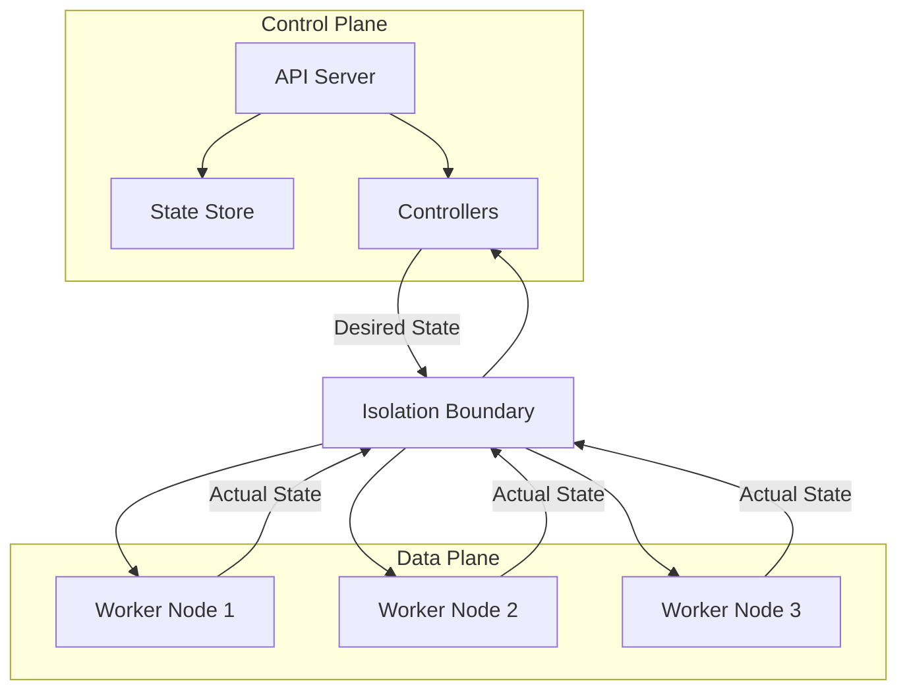

*[CRD]: Custom Resource Definition
*[HPA]: Horizontal Pod Autoscaler
*[RBAC]: Role-Based Access Control
*[VPC]: Virtual Private Cloud

A platform team I worked with hit a wall at fifty teams. Their internal Kubernetes platform had grown organically—API server, controllers, etcd, worker nodes all running together because it was simpler that way. Then Monday mornings started hurting. Everyone deploying at once slowed the API server enough that running workloads couldn't get their service endpoints updated. A bug in a custom controller caused repeated panics that prevented all controllers from reconciling—deployments wouldn't scale, services wouldn't update, affecting _all_ tenants. Control plane upgrades required scheduling maintenance windows across every team.

The fix wasn't more hardware. It was architectural: dedicated control plane cluster, separate data plane clusters per environment, GitOps for configuration sync. The pattern that made this possible comes from networking, where routers have long separated the control plane (where routing decisions happen) from the data plane (where packets actually flow). Platform engineering borrowed this separation because it solves the same fundamental problem—scaling decision-making independently from execution.

## The Separation That Scales

Understanding what distinguishes control from data helps explain why separating them works.

In platform terms, the _control plane_ is where configuration lives, policies get enforced, and orchestration decisions happen. It stores desired state, accepts and validates requests, makes scheduling decisions, and reconciles what you asked for against what actually exists. In Kubernetes, this means the API server, etcd, and controller manager. In a service mesh, it's the control plane component like Istio's istiod.

The _data plane_ is where actual work happens. It executes workloads, routes traffic, stores and retrieves data, and processes user requests. Kubernetes worker nodes (with their kubelets that keep containers running), Envoy sidecar proxies handling request routing, load balancers distributing traffic, and your application instances all live here. The data plane is inherently stateless from the platform's perspective—any component can be replaced because the control plane holds the source of truth about what should be running.

The characteristics differ in ways that matter for architecture:

| Aspect | Control Plane | Data Plane |
|--------|---------------|------------|
| Change frequency | Slow (configuration changes) | Constant (traffic, deployments) |
| Failure impact | Changes blocked; running workloads unaffected | Workloads fail, users impacted |
| Scaling trigger | Managed resource count, API request rate | Traffic volume, workload count |
| State | Stateful (source of truth) | Ephemeral (rebuildable from control plane) |

Table: Control plane vs data plane characteristics.

The failure impact row is the critical insight: when the control plane goes down, running workloads continue serving traffic. When the data plane fails, users notice immediately. This asymmetry is the foundation of the pattern. The control plane pushes desired state to the data plane; the data plane reports actual state back. They communicate but don't depend on each other moment-to-moment.

Figure: Control plane pushes desired state to data plane; data plane reports actual state back.

## Multi-Tenancy Patterns

Control plane and data plane separation exists to serve multi-tenancy. Without multiple teams sharing the platform, you don't need the complexity—a single team can tolerate tighter coupling. But once you're building for multiple tenants, the separation enables isolation patterns that would be impossible otherwise.

The fundamental question: how much isolation do tenants need, and what are you willing to pay for it?

__Namespace per tenant__ is the simplest approach. All tenants share a single cluster. Isolation comes from Kubernetes namespaces, RBAC, resource quotas, and network policies. The control plane is shared—same API server, same controllers, same etcd. This pattern is resource-efficient and operationally simple, but the isolation is logical, not physical. A noisy neighbor—a tenant whose workloads consume excessive CPU, memory, or I/O—can exhaust shared resources despite quotas, affecting other tenants on the same nodes.

__Cluster per tenant__ is the opposite extreme. Each tenant gets a dedicated Kubernetes cluster with its own control plane and data plane. Isolation is complete—there's no shared infrastructure beyond the underlying cloud account. This provides strong isolation and per-tenant customization, but the cost is substantial: every tenant pays for control plane resources.

__Virtual clusters__ split the difference. Tools like vCluster create lightweight Kubernetes control planes that run as workloads inside a host cluster. Each tenant gets their own API server, but pods actually run on the shared host cluster's nodes. Isolation is better than namespace-per-tenant because each virtual cluster has its own control plane state. The tradeoff: host cluster upgrades affect all virtual clusters simultaneously, and some advanced Kubernetes features don't translate cleanly across the virtualization boundary.

__Node pool per tenant__ is a middle ground for compute isolation specifically. Tenants share the control plane but get dedicated nodes via taints and tolerations.

| Pattern | Isolation | Cost | Operations Complexity |
|---------|-----------|------|----------------------|
| Namespace per tenant | Logical | Low | Low |
| Cluster per tenant | Physical | High | High |
| Virtual cluster | Strong logical | Medium | Medium |
| Node pool per tenant | Compute | Medium | Medium |

Table: Tenancy pattern comparison.

To put concrete numbers on "cost" using AWS EKS pricing: a dedicated Kubernetes control plane costs roughly $70–150/month before any worker nodes. Namespace-per-tenant adds near-zero marginal cost per tenant. Virtual clusters consume roughly 1 CPU core and 1GB memory each on the host cluster. For 100 tenants, that's the difference between $100/month (shared) and $10,000/month (dedicated clusters) in control plane costs alone.

Regardless of which pattern you choose, multiple isolation mechanisms layer together: network policies default-deny cross-namespace traffic, resource quotas limit what each tenant can consume, RBAC rules scope permissions to specific namespaces, and for stronger isolation, separate VPCs[^vpc] provide network-level boundaries that don't depend on Kubernetes enforcement.

[^vpc]: VPC (Virtual Private Cloud) is cloud provider terminology for an isolated virtual network—AWS VPCs, Azure VNets, Google Cloud VPCs all provide the same fundamental isolation primitive.

## When Things Go Wrong

Separating control plane from data plane creates natural failure boundaries, but you need to design explicitly for how failures propagate—or don't—across those boundaries. The goal is _blast radius containment_: ensuring that failures in one part of the system don't cascade into others.

__Control plane failures__ prevent changes but don't stop running workloads. If the API server goes down, you can't deploy new code or modify configurations, but existing pods keep serving traffic. The kubelet continues running containers using cached pod specs. Services keep routing. This is the fundamental benefit of separation—the data plane operates autonomously once configured.

__Data plane failures__ affect workloads in that failure domain. A node crash evicts all pods on that node. A zone outage takes down everything in that zone. Unlike control plane failures, these directly impact user traffic.

__Tenant failures__ shouldn't affect other tenants. Resource quotas prevent a runaway tenant from exhausting cluster resources—if one tenant's deployment enters a crash loop creating thousands of pods, quotas cap the damage. Network policies prevent a compromised tenant workload from attacking others. Rate limiting at the API level prevents one tenant's automation from overwhelming the control plane.

The containment hierarchy: namespaces provide logical isolation (cheapest, weakest). Node pools provide compute isolation—tenant workloads run on separate nodes. Separate clusters provide complete isolation—no shared infrastructure at all.

| Failure | Impact | Mitigation | Recovery Time |
|---------|--------|------------|---------------|
| API server down | No new changes | Redundant replicas | Seconds |
| etcd corruption | State loss | Backups, snapshots | Minutes–hours |
| Node failure | Pod eviction | Rescheduling | Minutes |
| Zone outage | Partial capacity loss | Multi-AZ deployment | Automatic |

Table: Failure scenarios and recovery characteristics.

Design for graceful degradation. Platform services that need configuration from the control plane should cache aggressively—when the control plane is unreachable, serve stale data rather than failing entirely. The kubelet already does this (it's why containers keep running during API server outages). Service meshes cache endpoint information in their sidecars. Custom platform services should implement their own caching layer.

<Callout type="success">
Assume the control plane will be unavailable sometimes. Build data plane components to operate autonomously using cached state. A control plane outage should block deployments, not crash production.
</Callout>

## Conclusion

Not every platform needs this separation. A single team running their own Kubernetes cluster? Keep it simple—the overhead of separate planes isn't worth it. But once you're serving multiple teams with different requirements, the investment pays off as adoption grows. Multi-tenancy becomes manageable because you've designed isolation boundaries from the start. Scaling becomes predictable when you understand what drives load in each plane—the control plane scales with managed resources and API requests, the data plane scales with traffic and workload count. Failures stay contained because blast radius is built into the architecture.

The key insight: separation is about abstractions, not just deployment topology. You can deploy everything together initially, but APIs, resource boundaries, and tenancy models need to support eventual separation. A namespace-per-tenant model with clear RBAC boundaries can evolve into virtual clusters or dedicated clusters. A monolithic control plane can split into federated regional control planes. But an architecture that treats control and data as one undifferentiated blob? That requires a rewrite.

---

__CTA Title:__ Get the Complete Guide

__CTA Body:__ This article covers the core patterns, but there's more to implementing control plane and data plane separation effectively. The complete guide includes upgrade strategies for both planes, observability patterns for troubleshooting across plane boundaries, developer interface options (custom Kubernetes controllers vs. Backstage), detailed tenant onboarding automation with Terraform examples, and cost modeling for different tenancy patterns at scale.
