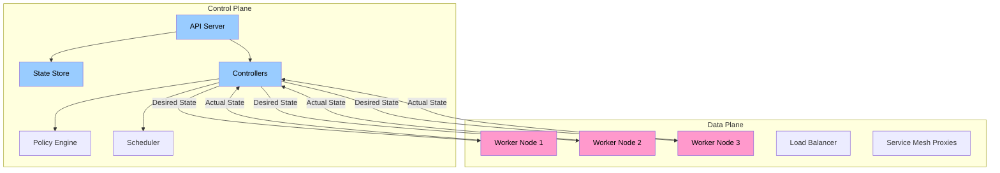
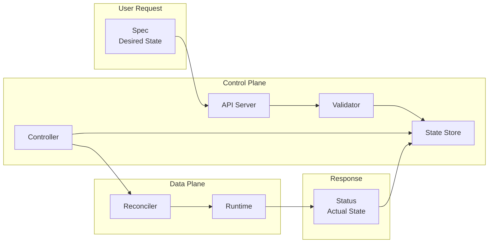
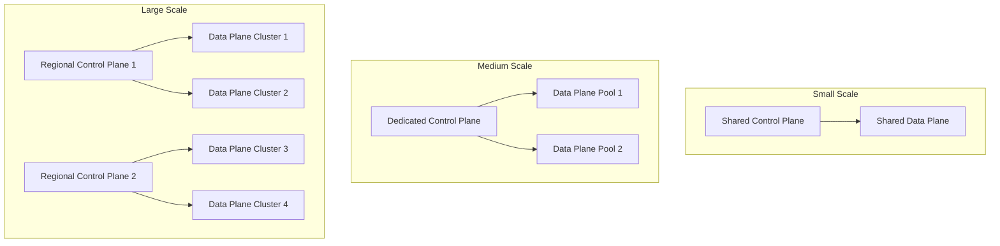

*[API]: Application Programming Interface
*[IDP]: Internal Developer Platform
*[K8s]: Kubernetes
*[CRD]: Custom Resource Definition
*[RBAC]: Role-Based Access Control
*[SLA]: Service Level Agreement
*[RPS]: Requests Per Second
*[CI]: Continuous Integration
*[CD]: Continuous Deployment
*[DNS]: Domain Name System
*[TLS]: Transport Layer Security

# Platform Architecture: Control Plane vs Data Plane

## Introduction

Frame the fundamental architectural pattern borrowed from networking and now essential to platform engineering: separating the control plane (where decisions are made, configurations stored, policies enforced) from the data plane (where actual work happens, traffic flows, applications run). This separation isn't organizational preference—it's an architectural requirement for platforms that serve multiple teams, scale independently, and evolve without breaking consumers. The control plane changes slowly but must never fail. The data plane changes constantly and must handle variable load. This section establishes that treating them as one system creates coupling that prevents both from scaling.

_Include a scenario: a platform team builds an internal Kubernetes platform. Initially, the API server, controller manager, and etcd run alongside worker nodes. As adoption grows to 50 teams and 500 services, problems emerge. A control plane upgrade requires scheduling maintenance windows across all teams. A surge in deployment activity slows the API server, affecting running workloads. A bug in a custom controller crashes, taking down the reconciliation loop for all tenants. They refactor: dedicated control plane cluster, separate data plane clusters per environment/team, GitOps for configuration sync. Control plane upgrades happen independently. Data plane issues are isolated. Each plane scales according to its needs. The lesson: separation isn't premature optimization—it's the foundation for multi-tenant platform operations._

<Callout type="warning">
The most common platform architecture mistake: building for single-tenant simplicity, then retrofitting multi-tenancy. Control plane and data plane separation should be designed from the start, even if initially deployed together.
</Callout>

## Architectural Concepts

### Control Plane vs Data Plane Defined

```yaml title="plane-definitions.yaml"
# Control plane vs data plane characteristics

control_plane:
  definition: "Where configuration, policy, and orchestration decisions happen"

  responsibilities:
    - "Store desired state (configurations, policies)"
    - "Accept and validate user requests"
    - "Make scheduling and placement decisions"
    - "Enforce policies and quotas"
    - "Reconcile desired vs actual state"
    - "Provide APIs for platform consumers"

  characteristics:
    change_frequency: "Relatively slow (config changes)"
    availability: "Critical - must never be unavailable"
    consistency: "Strong consistency required"
    scaling: "Scales with number of resources managed"
    state: "Stateful (source of truth)"

  examples:
    - "Kubernetes API server + etcd + controllers"
    - "Service mesh control plane (Istio pilot)"
    - "Database management plane"
    - "Platform portal and APIs"

data_plane:
  definition: "Where actual work happens and traffic flows"

  responsibilities:
    - "Execute workloads (containers, functions)"
    - "Route traffic (proxies, load balancers)"
    - "Store and retrieve data"
    - "Process user requests"
    - "Report metrics and logs"

  characteristics:
    change_frequency: "Constant (traffic, deployments)"
    availability: "Critical - user-facing"
    consistency: "Eventually consistent often acceptable"
    scaling: "Scales with traffic and workload volume"
    state: "Ephemeral (can be rebuilt from control plane)"

  examples:
    - "Kubernetes worker nodes"
    - "Envoy sidecar proxies"
    - "Database replicas"
    - "Application instances"

---
# Key differences
comparison:
  failure_impact:
    control_plane: "Can't make changes, but existing workloads continue"
    data_plane: "Workloads fail, users impacted"

  upgrade_strategy:
    control_plane: "Careful, rolling, often requires coordination"
    data_plane: "Aggressive, canary, can be replaced"

  scaling_trigger:
    control_plane: "Number of managed resources, API request rate"
    data_plane: "Traffic volume, workload count"
```
Code: Control plane vs data plane definitions.


Figure: Control plane and data plane separation.

### Platform Layers

```yaml title="platform-layers.yaml"
# Platform architecture layers

layers:
  layer_1_infrastructure:
    name: "Infrastructure Layer"
    plane: "Data Plane (mostly)"
    components:
      - "Compute (VMs, bare metal)"
      - "Storage (block, object, file)"
      - "Network (VPCs, load balancers)"
    providers:
      - "Cloud providers (AWS, GCP, Azure)"
      - "On-premise infrastructure"
      - "Hybrid configurations"

  layer_2_orchestration:
    name: "Orchestration Layer"
    plane: "Control Plane + Data Plane"
    control_components:
      - "Kubernetes control plane"
      - "Cluster management APIs"
      - "Multi-cluster federation"
    data_components:
      - "Container runtime"
      - "Kubelet"
      - "kube-proxy"

  layer_3_platform_services:
    name: "Platform Services Layer"
    plane: "Control Plane (primarily)"
    components:
      - "Service mesh control plane"
      - "Secrets management"
      - "Certificate management"
      - "Observability backends"
      - "CI/CD orchestration"

  layer_4_developer_interface:
    name: "Developer Interface Layer"
    plane: "Control Plane"
    components:
      - "Platform portal"
      - "Self-service APIs"
      - "GitOps repositories"
      - "Documentation and catalogs"

  layer_5_applications:
    name: "Application Layer"
    plane: "Data Plane"
    components:
      - "Application workloads"
      - "Databases and caches"
      - "Message queues"
      - "User-facing services"

---
# Separation boundaries
boundaries:
  infrastructure_orchestration:
    interface: "Cloud APIs, Terraform"
    coupling: "Loose - infrastructure can be replaced"

  orchestration_platform:
    interface: "Kubernetes API, CRDs"
    coupling: "Medium - platform depends on K8s"

  platform_developer:
    interface: "Platform APIs, GitOps"
    coupling: "Loose - developers don't see internals"

  developer_application:
    interface: "Application frameworks"
    coupling: "Varies by platform abstraction level"
```
Code: Platform layers.

| Layer | Primary Plane | Changes | Scaling Factor |
|-------|---------------|---------|----------------|
| Infrastructure | Data | Slow | Capacity needs |
| Orchestration | Both | Medium | Cluster count |
| Platform Services | Control | Slow | Teams/tenants |
| Developer Interface | Control | Fast | Feature velocity |
| Applications | Data | Constant | Traffic/users |

Table: Platform layer characteristics.

<Callout type="info">
Each layer has different change velocities and scaling needs. A well-designed platform allows each layer to evolve independently. Tight coupling between layers creates upgrade dependencies that slow everyone down.
</Callout>

## API Design for Platforms

### Platform API Principles

```yaml title="platform-api-design.yaml"
# Platform API design principles

principles:
  declarative_over_imperative:
    description: "Accept desired state, not commands"
    example:
      imperative: "POST /deploy { image: 'app:v2' }"
      declarative: "PUT /services/my-app { spec: { image: 'app:v2' } }"
    benefits:
      - "Idempotent operations"
      - "State can be reconciled"
      - "GitOps friendly"
      - "Audit trail from state history"

  resource_oriented:
    description: "Everything is a resource with standard operations"
    operations:
      - "Create (POST)"
      - "Read (GET)"
      - "Update (PUT/PATCH)"
      - "Delete (DELETE)"
      - "List (GET collection)"
      - "Watch (WebSocket/SSE)"
    example: |
      /api/v1/namespaces/{ns}/services/{name}
      /api/v1/namespaces/{ns}/deployments/{name}
      /api/v1/namespaces/{ns}/secrets/{name}

  versioned:
    description: "APIs evolve without breaking consumers"
    strategies:
      - "URL versioning: /api/v1/, /api/v2/"
      - "Header versioning: Accept: application/vnd.platform.v2+json"
    lifecycle:
      - "alpha → beta → stable → deprecated → removed"

  self_describing:
    description: "APIs document themselves"
    mechanisms:
      - "OpenAPI specifications"
      - "Discovery endpoints"
      - "Resource schemas"
      - "Status subresources"

---
# API structure example
api_structure:
  base_url: "https://platform.internal/api"

  resources:
    teams:
      path: "/v1/teams/{team}"
      operations: ["create", "get", "list", "update", "delete"]
      subresources:
        - "members"
        - "quotas"
        - "environments"

    environments:
      path: "/v1/teams/{team}/environments/{env}"
      operations: ["create", "get", "list", "update", "delete"]
      subresources:
        - "services"
        - "secrets"
        - "deployments"

    services:
      path: "/v1/teams/{team}/environments/{env}/services/{service}"
      operations: ["create", "get", "list", "update", "delete"]
      subresources:
        - "revisions"
        - "traffic"
        - "metrics"
```
Code: Platform API principles.

### Resource Schemas

```typescript title="resource-schemas.ts"
// Platform resource schema design

// === Base resource structure ===
interface Resource<TSpec, TStatus> {
  apiVersion: string;
  kind: string;
  metadata: ResourceMetadata;
  spec: TSpec;
  status?: TStatus;
}

interface ResourceMetadata {
  name: string;
  namespace?: string;
  uid: string;
  resourceVersion: string;
  creationTimestamp: string;
  labels?: Record<string, string>;
  annotations?: Record<string, string>;
  ownerReferences?: OwnerReference[];
}

// === Service resource example ===
interface ServiceSpec {
  // What the user wants
  image: string;
  replicas: number;
  resources: {
    cpu: string;
    memory: string;
  };
  ports: Array<{
    name: string;
    port: number;
    protocol: 'HTTP' | 'GRPC' | 'TCP';
  }>;
  env?: Array<{
    name: string;
    value?: string;
    valueFrom?: {
      secretKeyRef?: { name: string; key: string };
      configMapKeyRef?: { name: string; key: string };
    };
  }>;
  scaling?: {
    minReplicas: number;
    maxReplicas: number;
    targetCPUUtilization: number;
  };
}

interface ServiceStatus {
  // What the system reports
  phase: 'Pending' | 'Running' | 'Failed' | 'Unknown';
  conditions: Condition[];
  availableReplicas: number;
  readyReplicas: number;
  currentRevision: string;
  endpoints: string[];
  lastUpdated: string;
}

interface Condition {
  type: string;
  status: 'True' | 'False' | 'Unknown';
  reason: string;
  message: string;
  lastTransitionTime: string;
}

// === Example resource instance ===
const exampleService: Resource<ServiceSpec, ServiceStatus> = {
  apiVersion: 'platform.company.io/v1',
  kind: 'Service',
  metadata: {
    name: 'order-service',
    namespace: 'team-commerce',
    uid: 'abc-123',
    resourceVersion: '12345',
    creationTimestamp: '2024-01-15T10:00:00Z',
    labels: {
      'app': 'order-service',
      'team': 'commerce',
      'tier': 'backend',
    },
  },
  spec: {
    image: 'registry.internal/commerce/order-service:v2.1.0',
    replicas: 3,
    resources: {
      cpu: '500m',
      memory: '512Mi',
    },
    ports: [
      { name: 'http', port: 8080, protocol: 'HTTP' },
      { name: 'grpc', port: 9090, protocol: 'GRPC' },
    ],
    scaling: {
      minReplicas: 2,
      maxReplicas: 10,
      targetCPUUtilization: 70,
    },
  },
  status: {
    phase: 'Running',
    conditions: [
      {
        type: 'Available',
        status: 'True',
        reason: 'MinimumReplicasAvailable',
        message: '3 of 3 replicas are available',
        lastTransitionTime: '2024-01-15T10:05:00Z',
      },
    ],
    availableReplicas: 3,
    readyReplicas: 3,
    currentRevision: 'order-service-abc123',
    endpoints: ['order-service.team-commerce.svc.cluster.local'],
    lastUpdated: '2024-01-15T12:00:00Z',
  },
};
```
Code: Resource schema design.


Figure: Spec and status flow.

<Callout type="success">
Separate spec (what users want) from status (what exists). Users write spec; the system writes status. This separation enables declarative operations, reconciliation loops, and clear responsibility boundaries.
</Callout>

## Multi-Tenancy Models

### Tenancy Patterns

```yaml title="tenancy-patterns.yaml"
# Multi-tenancy patterns for platforms

patterns:
  namespace_per_tenant:
    description: "Tenants share cluster, isolated by namespace"
    isolation: "Logical (K8s namespace, RBAC)"

    control_plane:
      sharing: "Shared API server and controllers"
      isolation: "RBAC, admission control"

    data_plane:
      sharing: "Shared nodes (typically)"
      isolation: "Resource quotas, network policies"

    advantages:
      - "Resource efficient"
      - "Simple operations"
      - "Quick tenant onboarding"
    disadvantages:
      - "Noisy neighbor risk"
      - "Limited customization per tenant"
      - "Blast radius includes all tenants"

    best_for:
      - "Internal teams"
      - "Trusted tenants"
      - "Cost-sensitive deployments"

  cluster_per_tenant:
    description: "Each tenant gets dedicated cluster"
    isolation: "Physical (separate clusters)"

    control_plane:
      sharing: "None - dedicated per tenant"
      management: "Fleet management layer"

    data_plane:
      sharing: "None - dedicated nodes"
      isolation: "Complete"

    advantages:
      - "Strong isolation"
      - "Per-tenant customization"
      - "Independent upgrades"
    disadvantages:
      - "Resource overhead"
      - "Complex operations"
      - "Higher cost"

    best_for:
      - "Enterprise customers"
      - "Compliance requirements"
      - "Large tenants with specific needs"

  virtual_cluster_per_tenant:
    description: "Virtual clusters share infrastructure"
    isolation: "Strong logical (vCluster, Loft)"

    control_plane:
      sharing: "Host cluster control plane"
      virtual: "Virtual API server per tenant"

    data_plane:
      sharing: "Shared nodes"
      isolation: "Synced resources, quotas"

    advantages:
      - "Strong isolation"
      - "Efficient resource use"
      - "Tenant gets 'real' cluster experience"
    disadvantages:
      - "Additional complexity"
      - "Sync latency"
      - "Debugging across layers"

    best_for:
      - "Platform-as-a-Service offerings"
      - "CI/CD ephemeral environments"
      - "Balancing isolation and efficiency"

---
# Isolation mechanisms
isolation_mechanisms:
  network:
    - "Network policies"
    - "Service mesh mTLS"
    - "Separate VPCs/subnets"

  compute:
    - "Node pools per tenant"
    - "Taints and tolerations"
    - "Resource quotas"

  storage:
    - "Storage classes per tenant"
    - "Encryption keys per tenant"
    - "Separate storage backends"

  identity:
    - "RBAC per namespace"
    - "Service accounts per tenant"
    - "External identity integration"
```
Code: Tenancy patterns.

| Pattern | Isolation | Cost | Operations Complexity |
|---------|-----------|------|----------------------|
| Namespace per tenant | Logical | Low | Low |
| Node pool per tenant | Compute | Medium | Medium |
| Cluster per tenant | Physical | High | High |
| Virtual cluster | Strong logical | Medium | Medium |

Table: Tenancy pattern comparison.

### Tenant Onboarding

```yaml title="tenant-onboarding.yaml"
# Tenant onboarding workflow

onboarding_workflow:
  step_1_request:
    trigger: "Self-service form or API call"
    inputs:
      - "Team name and identifier"
      - "Owner information"
      - "Initial quota requirements"
      - "Environment types needed"
    validation:
      - "Team doesn't already exist"
      - "Owner is valid identity"
      - "Quotas within platform limits"

  step_2_provisioning:
    control_plane_resources:
      - name: "Team namespace"
        type: "Kubernetes Namespace"
        config:
          labels:
            team: "{{ team_id }}"
            tier: "{{ tier }}"

      - name: "Resource quota"
        type: "ResourceQuota"
        config:
          hard:
            requests.cpu: "{{ cpu_quota }}"
            requests.memory: "{{ memory_quota }}"
            persistentvolumeclaims: "{{ pvc_quota }}"

      - name: "Network policy"
        type: "NetworkPolicy"
        config:
          # Default deny, allow specific

      - name: "RBAC bindings"
        type: "RoleBinding"
        config:
          subjects: "{{ team_members }}"
          role: "team-developer"

    data_plane_resources:
      - name: "Node pool (if dedicated)"
        type: "NodePool"
        config:
          taints:
            - key: "team"
              value: "{{ team_id }}"
              effect: "NoSchedule"

  step_3_integration:
    git_repositories:
      - "Create team GitOps repo"
      - "Configure ArgoCD application"

    observability:
      - "Create Grafana folder"
      - "Provision default dashboards"
      - "Configure alert routing"

    secrets:
      - "Create Vault namespace"
      - "Configure auth method"
      - "Grant initial policies"

---
# Terraform module for tenant provisioning
terraform_module: |
  module "tenant" {
    source = "./modules/platform-tenant"

    team_id     = "team-commerce"
    team_name   = "Commerce Team"
    tier        = "standard"  # standard, premium, enterprise

    owners      = ["user:alice@company.com"]
    members     = ["group:commerce-developers@company.com"]

    quotas = {
      cpu_requests    = "100"
      memory_requests = "200Gi"
      pvcs           = 50
    }

    environments = ["dev", "staging", "prod"]

    features = {
      dedicated_nodes  = false
      custom_domains   = true
      gpu_access       = false
    }
  }
```
Code: Tenant onboarding.

<Callout type="info">
Automate tenant onboarding completely. A new team should go from request to fully provisioned environment in minutes, not days. Self-service with guardrails scales; manual provisioning doesn't.
</Callout>

## Scaling Considerations

### Control Plane Scaling

```yaml title="control-plane-scaling.yaml"
# Control plane scaling patterns

scaling_dimensions:
  api_request_rate:
    description: "Requests to platform API per second"
    scaling_approach:
      - "Horizontal: multiple API server replicas"
      - "Caching: read-through cache for GET requests"
      - "Rate limiting: per-tenant quotas"
    bottlenecks:
      - "State store (etcd) write throughput"
      - "Webhook validation latency"
      - "Authentication overhead"

  managed_resource_count:
    description: "Total resources under management"
    scaling_approach:
      - "Sharding: partition resources across controllers"
      - "Informer optimization: filtered watches"
      - "State store: etcd cluster size"
    limits:
      kubernetes: "~5,000 nodes, ~150,000 pods per cluster"
      etcd: "~8GB database size recommended"

  tenant_count:
    description: "Number of independent tenants"
    scaling_approach:
      - "Namespace per tenant: scales to hundreds"
      - "Virtual clusters: scales to thousands"
      - "Cluster per tenant: scales with fleet management"
    overhead_per_tenant:
      - "RBAC rules"
      - "Quota tracking"
      - "Audit logging"

---
# Scaling architecture
scaling_architecture:
  small:
    tenants: "< 10"
    resources: "< 1,000"
    architecture: "Single cluster, shared control plane"

  medium:
    tenants: "10-100"
    resources: "1,000-10,000"
    architecture: |
      - Dedicated control plane nodes
      - Multiple controller replicas
      - Sharded informers

  large:
    tenants: "100-1,000"
    resources: "10,000-100,000"
    architecture: |
      - Regional control planes
      - Federated configuration
      - Per-tenant virtual clusters

  enterprise:
    tenants: "> 1,000"
    resources: "> 100,000"
    architecture: |
      - Multi-cluster fleet
      - Hierarchical management
      - Dedicated clusters for large tenants
```
Code: Control plane scaling.

### Data Plane Scaling

```yaml title="data-plane-scaling.yaml"
# Data plane scaling patterns

scaling_patterns:
  horizontal_pod_autoscaling:
    description: "Scale pods based on metrics"
    triggers:
      - "CPU utilization"
      - "Memory utilization"
      - "Custom metrics (queue depth, RPS)"
    configuration: |
      apiVersion: autoscaling/v2
      kind: HorizontalPodAutoscaler
      spec:
        minReplicas: 2
        maxReplicas: 100
        metrics:
          - type: Resource
            resource:
              name: cpu
              target:
                type: Utilization
                averageUtilization: 70

  cluster_autoscaling:
    description: "Scale nodes based on pending pods"
    configuration:
      min_nodes: 3
      max_nodes: 100
      scale_down_delay: "10m"
      scale_down_utilization_threshold: 0.5
    considerations:
      - "Node pool segmentation"
      - "Spot/preemptible instances"
      - "Zone balancing"

  multi_cluster:
    description: "Scale by adding clusters"
    patterns:
      - "Regional clusters for latency"
      - "Tier-based clusters (prod vs non-prod)"
      - "Tenant-based clusters"
    management:
      - "Fleet management (GKE Fleet, Rancher)"
      - "GitOps per cluster"
      - "Federated observability"

---
# Capacity planning
capacity_planning:
  compute:
    formula: |
      Required nodes =
        (Total pod CPU requests / Node allocatable CPU) * safety_margin
    safety_margin: 1.3  # 30% headroom

  network:
    considerations:
      - "Pod-to-pod bandwidth"
      - "Ingress capacity"
      - "Service mesh overhead"
    sizing: |
      Envoy sidecar: ~50MB memory, ~10% CPU overhead

  storage:
    considerations:
      - "IOPS requirements"
      - "Throughput requirements"
      - "Capacity growth rate"
```
Code: Data plane scaling.


Figure: Scaling progression.

<Callout type="warning">
Control plane and data plane scale differently. Control plane scales with managed resources and API requests. Data plane scales with traffic and workload count. Design for independent scaling from the start.
</Callout>

## Failure Isolation

### Blast Radius Containment

```yaml title="blast-radius.yaml"
# Blast radius containment strategies

failure_domains:
  control_plane_failure:
    impact: "Cannot make changes, but workloads continue"
    containment:
      - "Redundant API servers"
      - "etcd cluster across availability zones"
      - "Cached credentials in data plane"
      - "Graceful degradation in controllers"
    recovery:
      - "Automatic failover"
      - "State restore from backup"

  data_plane_failure:
    impact: "Workloads in affected area fail"
    containment:
      - "Multiple availability zones"
      - "Pod anti-affinity"
      - "Circuit breakers"
      - "Graceful degradation"
    recovery:
      - "Automatic pod rescheduling"
      - "Traffic failover"

  tenant_failure:
    impact: "One tenant's issue shouldn't affect others"
    containment:
      - "Resource quotas prevent resource exhaustion"
      - "Network policies prevent lateral movement"
      - "Rate limiting prevents API abuse"
      - "Noisy neighbor detection and throttling"
    isolation:
      namespace: "Logical isolation"
      node_pool: "Compute isolation"
      cluster: "Complete isolation"

---
# Failure isolation architecture
isolation_architecture:
  zones:
    description: "Spread across availability zones"
    implementation:
      - "Control plane: 3 AZs"
      - "Data plane: minimum 2 AZs"
      - "Storage: replicated across AZs"

  clusters:
    description: "Separate clusters for failure domains"
    patterns:
      - "Prod vs non-prod clusters"
      - "Regional clusters"
      - "Per-tenant clusters for enterprise"

  namespaces:
    description: "Logical isolation within cluster"
    mechanisms:
      - "RBAC boundaries"
      - "Network policies"
      - "Resource quotas"
      - "Pod security standards"
```
Code: Blast radius containment.

### Graceful Degradation

```typescript title="graceful-degradation.ts"
// Platform API graceful degradation

import { Request, Response, NextFunction } from 'express';

// === Circuit breaker for control plane dependencies ===
class ControlPlaneCircuitBreaker {
  private failures = 0;
  private lastFailure: number = 0;
  private state: 'closed' | 'open' | 'half-open' = 'closed';

  private readonly threshold = 5;
  private readonly timeout = 30000; // 30 seconds

  async call<T>(fn: () => Promise<T>, fallback: () => T): Promise<T> {
    if (this.state === 'open') {
      if (Date.now() - this.lastFailure > this.timeout) {
        this.state = 'half-open';
      } else {
        // Circuit open, use fallback
        return fallback();
      }
    }

    try {
      const result = await fn();
      this.onSuccess();
      return result;
    } catch (error) {
      this.onFailure();
      return fallback();
    }
  }

  private onSuccess() {
    this.failures = 0;
    this.state = 'closed';
  }

  private onFailure() {
    this.failures++;
    this.lastFailure = Date.now();
    if (this.failures >= this.threshold) {
      this.state = 'open';
    }
  }
}

// === Cached reads for control plane outage ===
class CachedResourceStore {
  private cache: Map<string, { data: unknown; timestamp: number }> = new Map();
  private readonly ttl = 300000; // 5 minutes

  async get(key: string, fetcher: () => Promise<unknown>): Promise<unknown> {
    const cached = this.cache.get(key);

    try {
      const fresh = await fetcher();
      this.cache.set(key, { data: fresh, timestamp: Date.now() });
      return fresh;
    } catch (error) {
      // Control plane unavailable, serve stale
      if (cached && Date.now() - cached.timestamp < this.ttl * 2) {
        console.warn(`Serving stale data for ${key} due to control plane unavailability`);
        return cached.data;
      }
      throw error;
    }
  }
}

// === Rate limiting per tenant ===
class TenantRateLimiter {
  private requests: Map<string, number[]> = new Map();
  private readonly limits: Record<string, number> = {
    standard: 100,  // requests per minute
    premium: 500,
    enterprise: 2000,
  };

  isAllowed(tenantId: string, tier: string): boolean {
    const now = Date.now();
    const windowStart = now - 60000; // 1 minute window

    const tenantRequests = this.requests.get(tenantId) || [];
    const recentRequests = tenantRequests.filter(t => t > windowStart);

    const limit = this.limits[tier] || this.limits.standard;

    if (recentRequests.length >= limit) {
      return false;
    }

    recentRequests.push(now);
    this.requests.set(tenantId, recentRequests);
    return true;
  }
}

// === Middleware combining all patterns ===
function resilienceMiddleware(
  circuitBreaker: ControlPlaneCircuitBreaker,
  cache: CachedResourceStore,
  rateLimiter: TenantRateLimiter
) {
  return async (req: Request, res: Response, next: NextFunction) => {
    const tenantId = req.headers['x-tenant-id'] as string;
    const tier = req.headers['x-tenant-tier'] as string || 'standard';

    // Rate limiting
    if (!rateLimiter.isAllowed(tenantId, tier)) {
      return res.status(429).json({
        error: 'Rate limit exceeded',
        retryAfter: 60,
      });
    }

    // Circuit breaker with cache fallback
    try {
      req.controlPlane = {
        circuitBreaker,
        cache,
      };
      next();
    } catch (error) {
      res.status(503).json({
        error: 'Service temporarily unavailable',
        degraded: true,
      });
    }
  };
}
```
Code: Graceful degradation patterns.

| Failure | Impact | Mitigation | Recovery Time |
|---------|--------|------------|---------------|
| API server down | No new changes | Redundant replicas | Seconds |
| etcd corruption | State loss | Backups, snapshots | Minutes-hours |
| Controller crash | No reconciliation | Restart, leader election | Seconds |
| Node failure | Pod eviction | Rescheduling | Minutes |
| Zone outage | Partial capacity loss | Multi-AZ deployment | Automatic |

Table: Failure scenarios.

<Callout type="success">
Design for control plane unavailability. Data plane should continue operating with cached configuration. Control plane failures shouldn't crash running workloads—only prevent changes.
</Callout>

## Conclusion

Summarize control plane and data plane separation as the architectural foundation for scalable, multi-tenant platforms. The control plane handles configuration, policy, and orchestration—it must be highly available but handles relatively low request rates. The data plane handles traffic and workloads—it must scale with demand and tolerate failures gracefully. Separating these concerns enables independent scaling, isolated failures, and evolution without breaking consumers. The investment in clean separation pays off as the platform grows: control plane upgrades don't require data plane downtime, tenant issues don't cascade, and each plane can be optimized for its specific workload characteristics.

<Callout type="info">
Start with separation in mind, even if you deploy together initially. The abstractions (APIs, resource boundaries, tenancy models) are harder to add later than the physical separation. Design for multi-tenancy from day one.
</Callout>

---

## Cover Prompt

### Prompt 1: The Two Towers

Create an image of two distinct towers connected by bridges. The left tower (Control Tower) has antennae, screens, and control panels—it makes decisions. The right tower (Data Tower) has pipes, containers, and flowing traffic—it does work. Bridges carry configurations down and status up. Style: architectural separation, clear responsibilities, connected but distinct, 16:9 aspect ratio.

### Prompt 2: The Orchestra Conductor

Design an image of an orchestra performance. The conductor (control plane) stands elevated with a score, directing the music. The musicians (data plane) play their instruments, producing the actual sound. The conductor doesn't make music directly but ensures coordination. The audience only hears the musicians. Style: coordination metaphor, separation of concerns, orchestration vs execution, 16:9 aspect ratio.

### Prompt 3: The Air Traffic Control

Illustrate an airport control tower overlooking runways with planes. The tower (control plane) has radar, schedules, and controllers making decisions. The runways and planes (data plane) handle actual traffic. Tower can be upgraded without closing runways. Plane delays don't crash the tower. Style: aviation control, independent operation, safe separation, 16:9 aspect ratio.

### Prompt 4: The Nervous System

Create an image showing the human nervous system: brain (control plane) connected to muscles and organs (data plane) via nerves. The brain makes decisions; the body executes. If the brain is busy, the body still maintains heartbeat and breathing. Different scaling—brain doesn't grow when muscles do. Style: biological architecture, autonomous function, hierarchical control, 16:9 aspect ratio.

### Prompt 5: The Platform Layers

Design an image showing a platform as literal architectural layers, like a parking structure or stadium. Each level is labeled: Infrastructure, Orchestration, Platform Services, Developer Interface. Elevators (APIs) connect levels. Some levels can be rebuilt without affecting others. Style: layered architecture, platform structure, clear boundaries, 16:9 aspect ratio.
