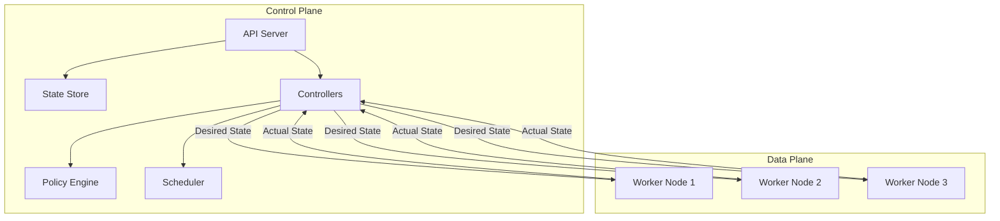
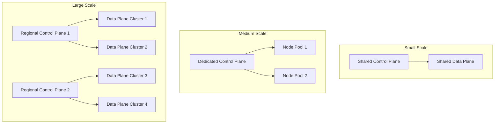

*[CRD]: Custom Resource Definition
*[CRDs]: Custom Resource Definitions
*[HPA]: Horizontal Pod Autoscaler
*[IDP]: Internal Developer Platform
*[IOPS]: Input/Output Operations Per Second
*[K8s]: Kubernetes
*[PVC]: Persistent Volume Claim
*[RBAC]: Role-Based Access Control
*[RPS]: Requests Per Second
*[SLA]: Service Level Agreement
*[TLS]: Transport Layer Security

The pattern comes from networking: routers have a control plane (where routing decisions happen) and a data plane (where packets actually flow). Platform engineering borrowed this separation for good reason. It solves the same fundamental problem of scaling decision-making independently from execution.

In platform terms, the _control plane_ is where configuration lives, policies get enforced, and orchestration decisions happen. The _data plane_ is where actual work runs—containers executing, traffic flowing, databases serving queries. The control plane changes slowly and handles relatively low request volume. The data plane changes constantly and must handle variable load gracefully.

Treating these as one system creates coupling that prevents both from scaling. The coupling might not matter initially, but it becomes painful as adoption grows—and by then, separation is expensive to retrofit.

I've seen this play out repeatedly. A platform team builds an internal Kubernetes platform. Initially, everything runs together—API server, controllers, etcd, worker nodes—because it's simpler. Then adoption grows. Fifty teams. Five hundred services.

Problems emerge. A control plane upgrade requires scheduling maintenance windows across all teams. A surge in deployment activity (everyone deploying on Monday morning) slows the API server, and suddenly running workloads can't get their service endpoints updated. A bug in a custom controller crashes, taking down the reconciliation loop for all tenants.

The team refactors: dedicated control plane cluster, separate data plane clusters per environment, GitOps for configuration sync. Now control plane upgrades happen independently. Data plane issues are isolated. Each plane scales according to its specific needs.

The lesson isn't that separation is always necessary from day one—it's that separation should be _designed for_ from day one. The abstractions matter more than the deployment topology. You can deploy together initially, but the APIs, resource boundaries, and tenancy models need to support eventual separation. This matters most for multi-tenancy: once you're supporting multiple teams, the separation enables isolation patterns that would be impossible with tightly coupled planes.

<Callout type="warning">
The most common platform architecture mistake: building for single-tenant simplicity, then retrofitting multi-tenancy. Design separation into your abstractions from the start, even if you deploy everything together initially.
</Callout>

## Architectural Concepts

### Control Plane vs Data Plane Defined

The control plane is where configuration, policy, and orchestration decisions happen. It stores desired state, accepts and validates requests, makes scheduling decisions, enforces policies and quotas, and reconciles what you asked for against what actually exists. In Kubernetes terms, this is the API server, etcd, and the controller manager. In a service mesh, it's the control plane component (Istio's istiod, Linkerd's control plane). For databases, it's the management layer that handles replication topology and failover decisions.

The data plane is where actual work happens. It executes workloads, routes traffic, stores and retrieves data, and processes user requests. Kubernetes worker nodes, Envoy sidecar proxies, database replicas, and your application instances all live in the data plane.

The characteristics differ in ways that matter for architecture:

| Aspect | Control Plane | Data Plane |
|--------|---------------|------------|
| Change frequency | Slow (configuration changes) | Constant (traffic, deployments) |
| Failure impact | Changes blocked; running workloads unaffected | Workloads fail, users impacted |
| Consistency needs | Strong consistency required | Eventually consistent often acceptable |
| Scaling trigger | Managed resource count, API request rate | Traffic volume, workload count |
| State | Stateful (source of truth) | Ephemeral (rebuildable from control plane) |
| Upgrade strategy | Careful, rolling, coordinated | Aggressive, canary, replaceable |

Table: Control plane vs data plane characteristics.

The failure impact row is the critical insight. When the control plane goes down—during an upgrade, due to an etcd issue, whatever—running workloads continue. You can't deploy new versions or scale, but users aren't immediately impacted. When the data plane fails, users notice immediately.



Figure: Control plane pushes desired state to data plane; data plane reports actual state back.

### Platform Layers

Platforms aren't monolithic—they're layered, and each layer has different characteristics. Understanding which layers are control plane vs data plane helps you make better architectural decisions.

The __infrastructure layer__ is mostly data plane: compute, storage, and network resources that workloads consume. Cloud providers or on-premise hardware live here. Changes are slow (provisioning new capacity) and the scaling factor is raw capacity needs.

The __orchestration layer__ spans both planes. Kubernetes is the obvious example: the API server and controllers are control plane, while kubelets and container runtimes are data plane. This layer changes at medium velocity—cluster upgrades, new node pools—and scales with cluster count.

The __platform services layer__ is primarily control plane: service mesh control planes, secrets management, certificate management, observability backends, CI/CD orchestration. These services manage configuration and policy for the layers below. Changes are slow (new platform capabilities) and scaling tracks team and tenant count.

The __developer interface layer__ is pure control plane: the platform portal, self-service APIs, GitOps repositories, documentation and service catalogs. This is where developers interact with the platform. Changes are fast (feature velocity) and scaling depends on developer experience improvements.

The __application layer__ is pure data plane: the actual workloads, databases, caches, message queues, and user-facing services that your platform exists to run. Changes are constant (deployments) and scaling tracks traffic and users.

| Layer | Primary Plane | Change Velocity | Scaling Factor |
|-------|---------------|-----------------|----------------|
| Infrastructure | Data | Slow | Capacity needs |
| Orchestration | Both | Medium | Cluster count |
| Platform Services | Control | Slow | Teams/tenants |
| Developer Interface | Control | Fast | Feature velocity |
| Applications | Data | Constant | Traffic/users |

Table: Platform layer characteristics.

The boundaries between layers matter. Infrastructure-to-orchestration uses cloud APIs and Terraform—loose coupling means infrastructure can be replaced. Orchestration-to-platform uses Kubernetes APIs and CRDs—medium coupling since most platforms depend on Kubernetes primitives. Platform-to-developer uses platform APIs and GitOps—loose coupling keeps developers insulated from internals.

<Callout type="info">
Each layer has different change velocities and scaling needs. A well-designed platform allows each layer to evolve independently. Tight coupling between layers creates upgrade dependencies that slow everyone down.
</Callout>

## Multi-Tenancy Models

Control plane and data plane separation exists to serve multi-tenancy. Without multiple teams sharing the platform, you don't need the complexity—a single team can tolerate tighter coupling. But once you're building for multiple tenants, the separation enables isolation patterns that would be impossible otherwise.

The fundamental question: how much isolation do tenants need, and what are you willing to pay for it? The answer shapes everything from cost structure to operational complexity.

### Tenancy Patterns

Four patterns cover most platforms, each trading isolation strength against cost and operational complexity.

__Namespace per tenant__ is the simplest approach. All tenants share a single cluster. Isolation comes from Kubernetes namespaces, RBAC, resource quotas, and network policies. The control plane is shared—same API server, same controllers, same etcd. The data plane is typically shared too, with pods from different tenants running on the same nodes.

This pattern is resource-efficient and operationally simple. Tenant onboarding is fast—create a namespace, apply quotas and policies, bind RBAC. But the isolation is logical, not physical. A noisy neighbor can exhaust shared resources despite quotas (the quota system has edge cases). A control plane issue affects everyone. A security vulnerability in one tenant's workload potentially exposes others.

Namespace-per-tenant works well for internal teams who trust each other, cost-sensitive deployments where efficiency matters more than isolation, and platforms with relatively homogeneous workloads.

__Cluster per tenant__ is the opposite extreme. Each tenant gets a dedicated Kubernetes cluster with its own control plane and data plane. Isolation is complete—there's no shared infrastructure beyond the underlying cloud account.

This pattern provides strong isolation and per-tenant customization. Tenants can have different Kubernetes versions, different addons, different node types. Upgrades happen independently. One tenant's issues can't cascade to others. But the cost is substantial—every tenant pays for control plane resources (three etcd nodes, API server replicas, controller managers). Operations complexity increases with fleet management, consistent configuration across clusters, and federated observability.

Cluster-per-tenant works well for enterprise customers with compliance requirements, large tenants who justify dedicated resources, and situations where customization or isolation requirements preclude sharing.

__Virtual clusters__ split the difference. Tools like vCluster or Loft create lightweight Kubernetes control planes that run as workloads inside a host cluster. Each tenant gets their own API server, but pods actually run on the shared host cluster's nodes. From the tenant's perspective, they have a real cluster. From the platform's perspective, they're sharing infrastructure.

The tenant experience is strong—they can install their own CRDs, run cluster-scoped resources, use any Kubernetes tooling. Isolation is better than namespace-per-tenant because each virtual cluster has its own control plane state. But you're adding a layer of complexity: pods created in the virtual cluster sync down to the host cluster for actual scheduling, services and endpoints sync to enable networking, and debugging spans multiple contexts. There's inherent latency in this synchronization, and some resources (like PersistentVolumes) require careful mapping between layers.

Virtual clusters work well for platform-as-a-service offerings, ephemeral CI/CD environments where teams need cluster-admin for testing, and situations balancing isolation needs against infrastructure costs.

__Node pool per tenant__ is a middle ground for compute isolation specifically. Tenants share the control plane but get dedicated nodes via taints and tolerations. This prevents noisy-neighbor problems at the compute layer while keeping operational simplicity.

| Pattern | Isolation | Cost | Operations Complexity |
|---------|-----------|------|----------------------|
| Namespace per tenant | Logical | Low | Low |
| Cluster per tenant | Physical | High | High |
| Virtual cluster | Strong logical | Medium | Medium |
| Node pool per tenant | Compute | Medium | Medium |

Table: Tenancy pattern comparison.

To put concrete numbers on "cost": a dedicated Kubernetes control plane (managed or self-hosted) costs roughly $70–150/month for the control plane alone, before any worker nodes. Namespace-per-tenant adds near-zero marginal cost per tenant. Virtual clusters add modest overhead—each vCluster consumes roughly 1 CPU core and 1GB memory on the host cluster. Dedicated clusters multiply the base control plane cost by tenant count. For 100 tenants, that's the difference between ~$100/month (shared) and ~$10,000/month (dedicated clusters) in control plane costs alone.

### Isolation Mechanisms

Regardless of which pattern you choose, multiple mechanisms layer together to enforce isolation.

__Network isolation__ prevents tenants from communicating unless explicitly allowed. Network policies default-deny cross-namespace traffic. Service mesh mTLS ensures traffic is encrypted and authenticated. For stronger isolation, separate VPCs[^vpc] or subnets provide network-level boundaries that don't depend on Kubernetes enforcement.

[^vpc]: A Virtual Private Cloud (VPC) is an isolated section within a public cloud where you define your own virtual network. You control the IP address ranges, subnets, route tables, and network gateways—effectively a private data center's network topology with cloud scalability. Placing tenant workloads in separate VPCs provides network isolation at the cloud provider level, independent of Kubernetes. This matters because VPC isolation is enforced by the cloud provider's network fabric, not by software running in the cluster. A misconfigured NetworkPolicy can't accidentally expose cross-tenant traffic when tenants are in separate VPCs. The tradeoff is complexity: cross-VPC communication requires VPC peering or transit gateways, adding latency and configuration overhead.

__Compute isolation__ prevents resource contention. Resource quotas limit how much CPU, memory, and storage a tenant can consume. For stronger isolation, dedicated node pools with taints ensure tenant workloads only run on designated nodes. At the extreme, dedicated clusters eliminate any compute sharing.

__Storage isolation__ protects data. Per-tenant storage classes can enforce encryption and access controls. Per-tenant encryption keys mean one tenant's compromise doesn't expose another's data. For the strongest isolation, completely separate storage backends.

__Identity isolation__ controls who can do what. RBAC rules scope permissions to specific namespaces. Service accounts are namespace-scoped by default. Integration with external identity providers (OIDC, LDAP) enables per-tenant authentication policies.

### Tenant Onboarding

The onboarding workflow determines how quickly new teams can start using the platform. Manual processes—filing tickets, waiting for approvals, handoffs between teams—create bottlenecks that limit platform adoption. Automated self-service enables growth.

A typical onboarding flow: team submits a request (self-service form, API call, or pull request to a GitOps repo) specifying team name, owners, initial quota requirements, and environment types. The platform validates the request—team name is unique, owners are valid identities, quotas are within platform limits—and provisions resources.

For namespace-per-tenant, provisioning creates the namespace with appropriate labels, applies ResourceQuota for CPU, memory, and PVC limits, creates a default-deny NetworkPolicy with explicit allowances and binds RBAC roles to team members. The entire process can complete in seconds.

```hcl title="tenant-provisioning.tf"
# Terraform module for automated tenant provisioning
module "tenant" {
  source = "./modules/platform-tenant"

  team_id   = "team-commerce"
  team_name = "Commerce Team"
  tier      = "standard"  # Controls quotas and features

  owners  = ["user:alice@company.com"]
  members = ["group:commerce-developers@company.com"]

  quotas = {
    cpu_requests    = "100"
    memory_requests = "200Gi"
    pvcs            = 50
  }

  environments = ["dev", "staging", "prod"]

  features = {
    dedicated_nodes = false
    custom_domains  = true
    gpu_access      = false
  }
}
```

Code: Terraform module encapsulating tenant provisioning logic.

Beyond core Kubernetes resources, onboarding typically includes GitOps setup (create team repository, configure ArgoCD application), observability integration (Grafana folder with default dashboards, alert routing to team channels), and secrets management (Vault namespace with appropriate policies). The goal: a new team goes from request to fully provisioned environment in minutes, not days.

<Callout type="info">
Automate tenant onboarding completely. Self-service with guardrails scales; manual provisioning doesn't. Every manual step in onboarding is a bottleneck that limits platform adoption.
</Callout>

## Scaling Considerations

Control plane and data plane have fundamentally different scaling characteristics. Understanding these differences is critical—architectures that treat them as a single scaling unit hit walls that are expensive to redesign around.

### Control Plane Scaling

The control plane scales with _managed resources_, not with traffic. Adding more API server replicas won't help if your bottleneck is etcd write throughput or controller reconciliation time. The dimensions that matter: API request rate (how often clients query or modify resources), managed resource count (total objects under management), and tenant count (how many independent consumers).

API request rate scaling follows a familiar pattern. Horizontal scaling with multiple API server replicas handles read load well since reads are eventually consistent. Write scaling is harder—etcd is the serialization point, and its write throughput is limited. Caching helps for read-heavy patterns, but invalidation complexity grows. Rate limiting per tenant prevents any single consumer from overwhelming the system.

Managed resource count is the less obvious bottleneck. Kubernetes controllers use informers—local caches of cluster state that watch for changes. As resource count grows, informer memory consumption increases, list operations at startup take longer, and reconciliation throughput becomes the constraint. Kubernetes documents approximately 5,000 nodes and 150,000 pods as practical limits per cluster, but these limits shrink as you add custom resources and controllers.

Tenant count introduces overhead beyond the resources tenants create. Each tenant needs RBAC rules, quota tracking, audit logging. This overhead is per-tenant regardless of tenant size, which means many small tenants create more control plane load than a few large ones with the same total resources.

The architectural response depends on scale:

| Scale | Tenants | Resources | Architecture |
|-------|---------|-----------|--------------|
| Small | < 10 | < 1,000 | Shared control plane |
| Medium | 10–100 | 1,000–10,000 | Dedicated control plane nodes, multiple controller replicas, sharded informers |
| Large | 100–1,000 | 10,000–100,000 | Regional control planes, federated configuration, per-tenant virtual clusters |
| Enterprise | > 1,000 | > 100,000 | Multi-cluster fleet, hierarchical management, dedicated clusters for large tenants |

Table: Control plane scaling progression.

### Data Plane Scaling

The data plane scales with _traffic and workload count_. This is the familiar scaling problem: more requests need more compute, more users need more capacity. The patterns are well-established, but the interaction with control plane separation requires attention.

Horizontal Pod Autoscaling (HPA) handles workload-level scaling. Pods scale based on CPU utilization, memory, or custom metrics like queue depth and requests per second. The key architectural decision is where the scaling logic lives. HPA runs in the control plane but affects the data plane. If the control plane is unavailable, the current replica count persists—pods keep running—but scaling decisions stop. You can't react to load changes or modify scaling parameters until the control plane recovers.

Cluster autoscaling handles node-level scaling. When pods can't be scheduled due to insufficient resources, the cluster autoscaler adds nodes. When nodes are underutilized, it removes them—but only if the pods running there can be rescheduled elsewhere. This scaling is slower—node provisioning takes minutes, not seconds—so capacity planning matters. Configure scale-down delays to prevent thrashing, and set utilization thresholds that balance cost against headroom.

Multi-cluster scaling is the escape hatch when single-cluster limits bite. Regional clusters reduce latency by placing workloads near users. Tier-based clusters (production vs. non-production) provide isolation with different SLAs. Tenant-based clusters give large customers dedicated infrastructure. The tradeoff: fleet management complexity. Each cluster needs configuration, monitoring, upgrades. GitOps helps—one configuration repo[^gitops-repos] per cluster—but the operational surface area multiplies.

[^gitops-repos]: The standard architecture uses a hybrid model. A _cluster repo_ (one per cluster or environment) contains cluster-wide configurations (monitoring, logging, service mesh, ingress), bootstrap resources (Argo CD Application or Flux Kustomization objects that point to application repos), and security policies (RBAC, NetworkPolicies, OPA/Gatekeeper rules). Separately, _application repos_ contain deployment manifests—image tags, replica counts, environment variables. This separation lets developers update their applications without access to cluster configuration.

Capacity planning ties these together. Compute capacity follows the formula: required nodes equals total pod CPU requests divided by node allocatable CPU, multiplied by a safety margin (typically 1.3 for 30% headroom). Network capacity considers pod-to-pod bandwidth, ingress capacity, and service mesh overhead (Envoy sidecars add roughly 50MB memory and 10% CPU). Storage capacity requires understanding IOPS requirements, throughput, and growth rate.

At medium scale, the data plane stays in a single cluster but segments into multiple _node pools_—groups of nodes with different instance types, taints, or availability zone placement. One pool might run general workloads while another handles memory-intensive jobs. At large scale, you move to separate clusters entirely, each with its own data plane.



Figure: Scaling progression from shared infrastructure to regional fleets.

<Callout type="warning">
Control plane and data plane scale differently. Control plane scales with managed resources and API requests. Data plane scales with traffic and workload count. Design for independent scaling from the start.
</Callout>

## Failure Isolation

Scaling decisions affect failure domains—a single large cluster has different failure characteristics than multiple smaller ones. Separating the control plane from data plane creates natural failure boundaries, but you need to design explicitly for how failures propagate (or don't) across those boundaries. The goal: _blast radius containment_—ensuring that failures in one part of the system don't cascade into others.

### Blast Radius Containment

Different failure types have different blast radii. Understanding each helps you design appropriate containment.

__Control plane failures__ prevent changes but don't stop running workloads. If the API server goes down, you can't deploy new code or modify configurations, but existing pods keep serving traffic. The kubelet continues running containers using cached pod specs. Services keep routing. This is the fundamental benefit of separation—the data plane operates autonomously once configured.

Containment strategies for control plane: run redundant API server replicas behind a load balancer. Spread etcd across three availability zones with automatic leader election. Cache credentials and configurations in the data plane so nodes don't need constant control plane contact. Design controllers for graceful degradation—if they can't reach the API server, they should retry with backoff rather than crash.

__Data plane failures__ affect the workloads in that failure domain. A node crash evicts all pods on that node. A zone outage takes down everything in that zone. Unlike control plane failures, these directly impact user traffic.

Containment strategies for data plane: spread replicas across availability zones using pod anti-affinity rules. Run at least two replicas of critical services. Implement circuit breakers in service-to-service communication so one failing service doesn't cascade into others. Configure pod disruption budgets to prevent maintenance operations from taking down too many replicas simultaneously.

__Tenant failures__ shouldn't affect other tenants. This is where the multi-tenancy isolation mechanisms from earlier become critical for failure containment—not just security.

Resource quotas prevent a runaway tenant from exhausting cluster resources. If one tenant's deployment enters a crash loop creating thousands of pods, quotas cap the damage. Network policies prevent a compromised tenant workload from attacking others. Rate limiting at the API level prevents one tenant's automation from overwhelming the control plane.

The containment hierarchy: namespaces provide logical isolation within a cluster (cheapest, weakest). Node pools provide compute isolation—tenant workloads run on separate nodes, so a noisy neighbor can't steal CPU from others. Separate clusters provide complete isolation—no shared infrastructure at all.

### Failure Domain Architecture

The physical architecture determines your failure domains. Spread control plane components across three availability zones—this survives any single zone outage while maintaining quorum. Spread data plane across at least two zones for redundancy.

For multi-cluster architectures, align clusters with failure boundaries. Separate production from non-production clusters—a bad deployment to dev shouldn't be able to affect prod even through control plane resource exhaustion. Regional clusters contain blast radius geographically. Per-tenant clusters for enterprise customers provide the ultimate isolation.

Within a cluster, namespaces define the logical failure boundary for tenant issues. RBAC prevents cross-tenant access. Network policies prevent cross-tenant traffic. Resource quotas prevent cross-tenant resource exhaustion. Pod security standards prevent privilege escalation.

### Graceful Degradation

Designing for graceful degradation means explicitly handling the case where dependencies are unavailable. For platform services, the most important dependency is the control plane itself.

A circuit breaker pattern prevents cascading failures when the control plane is slow or unavailable. Track failure counts for control plane calls. When failures exceed a threshold, "open" the circuit—stop making calls and return cached or default responses instead. Periodically allow a test request through to detect recovery.

Cached reads provide continuity during control plane outages. Platform services that need configuration or state from the control plane should cache aggressively. When the control plane is unreachable, serve stale data (with appropriate warnings) rather than failing entirely. Set cache TTLs long enough to survive typical outages. Implementation varies by component: the kubelet already caches pod specs locally (it's why containers keep running during API server outages), service meshes cache endpoint information in their sidecars, and custom platform services should implement their own caching layer—either in-process or via a shared cache like Redis.

Per-tenant rate limiting protects the control plane from abuse and ensures fair access. Different tenant tiers might get different limits—enterprise customers get higher quotas than standard tiers. When a tenant exceeds their limit, return 429 responses rather than letting them degrade the platform for everyone.

| Failure | Impact | Mitigation | Recovery Time |
|---------|--------|------------|---------------|
| API server down | No new changes | Redundant replicas | Seconds |
| etcd corruption | State loss | Backups, snapshots | Minutes–hours |
| Controller crash | No reconciliation | Restart, leader election | Seconds |
| Node failure | Pod eviction | Rescheduling | Minutes |
| Zone outage | Partial capacity loss | Multi-AZ deployment | Automatic |

Table: Failure scenarios and recovery characteristics.

<Callout type="success">
Assume the control plane will be unavailable sometimes. Build data plane components to operate autonomously using cached state. A control plane outage should block deployments, not crash production.
</Callout>

### Observability Across Planes

Separation affects how you monitor and troubleshoot. Control plane and data plane have different observability needs, and problems often span both.

Control plane observability focuses on API server latency, etcd health, controller reconciliation times, and queue depths. These metrics tell you whether configuration changes are being processed. Key signals: API server request latency (p99 should stay under 1 second), etcd leader elections (frequent elections indicate instability), and controller work queue depth (growing queues mean reconciliation is falling behind).

Data plane observability focuses on workload health, traffic patterns, resource utilization, and user-facing latency. These metrics tell you whether applications are serving users. Key signals: pod restart counts, HTTP error rates, node resource pressure, and service response times.

The troubleshooting challenge: symptoms often appear in one plane while the root cause lives in the other. A deployment stuck in "Pending" is a data plane symptom (pod not running) with a potential control plane cause (scheduler can't find nodes) or data plane cause (no nodes have capacity). Effective troubleshooting requires visibility into both planes simultaneously.

For multi-cluster architectures, federated observability becomes essential. Each cluster runs its own monitoring stack (Prometheus, for example), but you need a global view to understand cross-cluster patterns. Tools like Thanos, Cortex, or Grafana Mimir aggregate metrics across clusters. Log aggregation (Loki, Elasticsearch) provides a unified search across all data planes.

## Upgrade Strategies

Separation enables independent upgrade paths—one of its key benefits—but you need explicit strategies for each plane.

### Control Plane Upgrades

Control plane upgrades are the riskier operation. You're updating the system that manages everything else. The good news: with proper separation, control plane upgrades don't require data plane downtime. Running workloads continue; you just can't make changes during the upgrade window.

For Kubernetes control plane upgrades, the standard approach is rolling replacement. Upgrade one control plane node at a time, verifying health before proceeding. etcd requires particular care—never upgrade more than one etcd member simultaneously, and ensure quorum is maintained throughout. API server replicas can be upgraded in parallel if you have sufficient redundancy.

The critical constraint: control plane and data plane version skew. Kubernetes supports kubelets (data plane) running one minor version behind the API server (control plane). This means you upgrade control plane first, then data plane. Attempting the reverse—upgrading kubelets before the API server—risks incompatibility.

For custom controllers and platform services, apply the same discipline. Version your controller APIs (v1, v2beta1). Maintain backward compatibility for at least one version. Test upgrades in non-production environments that mirror production topology.

### Data Plane Upgrades

Data plane upgrades affect running workloads, so they require coordination with tenants—or automation that handles the coordination for you.

Node upgrades typically use a drain-and-replace pattern. Cordon the node (prevent new pods from scheduling), drain existing pods (evict them to other nodes), upgrade or replace the node, then uncordon. Pod disruption budgets ensure you don't evict too many replicas simultaneously. The cluster autoscaler can help by provisioning new nodes before draining old ones.

For large fleets, blue-green node pool upgrades reduce risk. Create a new node pool with the updated configuration, gradually shift workloads to it (by adjusting taints or using pod topology spread constraints), then decommission the old pool. This approach is slower but provides easy rollback—just shift traffic back to the old pool.

Service mesh and sidecar upgrades are a special case. The data plane proxies (Envoy sidecars) need to match the control plane version. Most meshes support gradual sidecar upgrades: update the control plane, then restart pods incrementally to pick up new sidecar versions. Istio's revision-based upgrades and Linkerd's upgrade process both follow this pattern.

## Developer Interfaces to the Control Plane

With separation in place—dedicated control plane, isolated data planes, multi-tenancy boundaries, scaling strategies, and failure isolation—you need to decide how developers actually interact with it. The control plane is useless if teams can't self-serve. This is the _developer interface layer_ from earlier: the boundary where platform internals become self-service capabilities.

Two approaches dominate: building custom Kubernetes controllers that extend the API with higher-level abstractions, and adopting an Internal Developer Platform like Backstage that provides a portal and catalog layer on top of your infrastructure.

### Custom Kubernetes Controllers

Custom controllers extend the Kubernetes API with your own resource types. You define CRDs that represent your platform's abstractions—a "Service" that creates the underlying Deployment, Service, Ingress, and HPA automatically, or an "Environment" that provisions a complete namespace with quotas, network policies, and RBAC bindings.

The pattern follows Kubernetes conventions: users write a `spec` declaring what they want, a controller watches for changes and reconciles the cluster to match, and the controller updates `status` to report what actually exists. This declarative model is GitOps-native—teams commit desired state to a repository, and the system converges to match.

```yaml title="platform-service-crd.yaml"
# Custom Resource Definition for a platform-managed service
apiVersion: apiextensions.k8s.io/v1
kind: CustomResourceDefinition
metadata:
  name: services.platform.company.io
spec:
  group: platform.company.io
  versions:
    - name: v1
      served: true
      storage: true
      schema:
        openAPIV3Schema:
          type: object
          properties:
            spec:
              type: object
              properties:
                image:
                  type: string
                replicas:
                  type: integer
                resources:
                  type: object
                  properties:
                    cpu: { type: string }
                    memory: { type: string }
            status:
              type: object
              properties:
                phase: { type: string }
                availableReplicas: { type: integer }
  scope: Namespaced
  names:
    plural: services
    singular: service
    kind: Service
```

Code: CRD defining a higher-level Service abstraction that controllers reconcile to underlying Kubernetes resources.

The controller does the heavy lifting. When a developer creates a `Service` resource, the controller creates the Deployment, configures the HPA, sets up the Ingress with TLS, and wires everything together. Platform policies get enforced automatically—resource limits, security contexts, network policies. Developers get a simple interface; the platform handles complexity.

This approach works well when your platform is deeply Kubernetes-native and you want tight integration with the cluster API. The tooling ecosystem (Kubebuilder, Operator SDK) is mature. Teams already know `kubectl`. GitOps tools like ArgoCD work without modification.

The downside: you're building software. Controllers need testing, versioning, upgrade paths. Schema changes require migration strategies. You're committing to ongoing development and maintenance.

### Internal Developer Platforms (Backstage)

Backstage takes a different approach. Instead of extending the Kubernetes API, it provides a portal layer that sits in front of your infrastructure. Developers interact with a web UI and catalog rather than directly with cluster APIs.

The software catalog is the core abstraction. Every service, resource, and component gets an entry with metadata, ownership, documentation links, and relationships. Templates enable self-service—a developer fills out a form, and Backstage scaffolds a new service repository, creates the CI/CD pipeline, provisions infrastructure, and registers everything in the catalog.

```yaml title="backstage-catalog-component.yaml"
# Backstage catalog entity for a service
apiVersion: backstage.io/v1alpha1
kind: Component
metadata:
  name: order-service
  description: Handles order processing and fulfillment
  annotations:
    github.com/project-slug: company/order-service
    backstage.io/techdocs-ref: dir:.
  tags:
    - java
    - spring-boot
spec:
  type: service
  lifecycle: production
  owner: team-commerce
  system: e-commerce-platform
  dependsOn:
    - resource:default/orders-database
    - component:default/inventory-service
  providesApis:
    - order-api
```

Code: Backstage catalog entity defining service metadata, ownership, and relationships.

Backstage doesn't replace your infrastructure—it provides a unified view of it. The catalog aggregates information from multiple sources: Kubernetes clusters, cloud providers, CI/CD systems, monitoring tools. Plugins integrate with your existing tooling rather than replacing it.

This approach works well when you have heterogeneous infrastructure (not just Kubernetes), want to emphasize service ownership and discoverability, or need a portal that non-infrastructure teams can navigate. The plugin ecosystem covers common integrations. You're adopting a product rather than building one.

The downside: Backstage is a separate system to operate. The catalog can drift from reality if synchronization isn't maintained. Deep infrastructure automation still requires custom plugins or external systems.

### Choosing an Approach

The choice isn't binary—many platforms use both. Custom controllers handle the infrastructure automation layer (what happens when you create a resource), while Backstage provides the developer experience layer (how teams discover, understand, and manage their services).

| Factor | Custom Controllers | Backstage |
|--------|-------------------|-----------|
| Primary interface | kubectl, GitOps | Web UI, catalog |
| Infrastructure depth | Deep (creates/manages resources) | Shallow (aggregates/displays) |
| Self-service model | Declarative resources | Templates, forms |
| Maintenance burden | Build and maintain controllers | Operate Backstage, maintain plugins |
| Best for | K8s-native automation | Discovery, ownership, portal |

Table: Comparing developer interface approaches.

Whatever you choose, the goal is the same: give developers a self-service interface to the control plane that hides infrastructure complexity while enforcing platform policies. The separation work you've done—dedicated control plane, tenancy boundaries, scaling strategies—enables this interface to exist without exposing dangerous internals.

<Callout type="info">
The developer interface is the contract between platform team and product teams. Whether it's CRDs or Backstage entities, the abstractions you expose define what developers can do without involving you. Design them carefully—they're harder to change than implementation details.
</Callout>

## Conclusion

Control plane and data plane separation is the architectural foundation for scalable, multi-tenant platforms. The control plane (configuration, policy, orchestration) optimizes for consistency. The data plane (workloads, traffic, compute) optimizes for throughput. Separating them enables independent scaling, isolated failures, and evolution without breaking contracts.

The investment pays off as adoption grows. Multi-tenancy becomes manageable with designed-in isolation boundaries. Scaling becomes predictable when you understand what drives load in each plane. Failures stay contained because blast radius is part of the architecture.

The abstractions matter more than initial deployment topology. You can deploy together at first, but APIs, resource boundaries, and tenancy models need to support eventual separation. Retrofitting these later is expensive—in engineering time, migration complexity, and operational risk.
