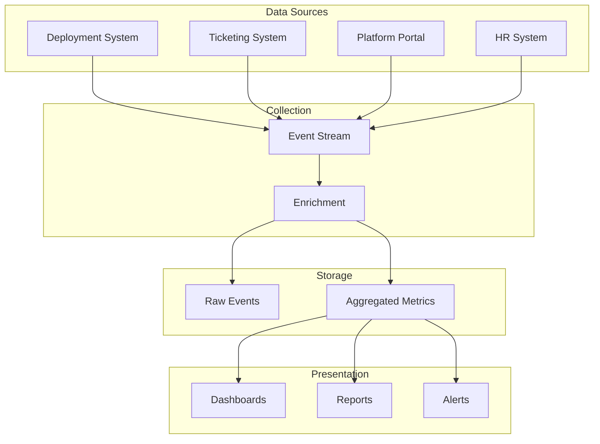
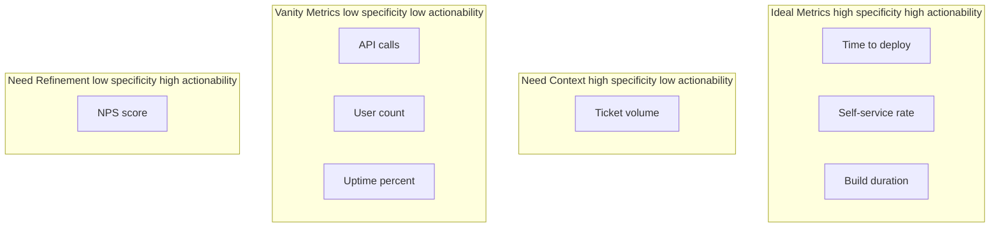

*[DORA]: DevOps Research and Assessment
*[MTTR]: Mean Time to Recovery
*[CSAT]: Customer Satisfaction Score
*[NPS]: Net Promoter Score
*[SLA]: Service Level Agreement
*[SLO]: Service Level Objective
*[API]: Application Programming Interface
*[CI]: Continuous Integration
*[CD]: Continuous Deployment
*[PR]: Pull Request
*[TOIL]: Time-consuming, manual, automatable, lacking lasting value

# Measuring Platform Success: Metrics That Matter

## Introduction

Frame the measurement challenge in platform engineering: how do you prove an internal platform creates value? Unlike product teams that measure revenue or user growth, platform teams serve internal customers and enable outcomes rather than producing them directly. This creates a measurement gap—platform work is easy to fund when it's novel and hard to justify when it's mature. This section establishes that meaningful platform metrics focus on developer friction reduction: how long do common tasks take, how often do developers need help, and how much cognitive load does the platform impose. Vanity metrics (adoption counts, API calls) look impressive in slide decks but don't demonstrate value. The goal is metrics that answer: "Is the platform making developers more productive?"

_Include a scenario: a platform team builds an internal developer portal with self-service infrastructure provisioning. Leadership asks for success metrics. The team reports: 500 developers onboarded, 10,000 API calls per month, 99.9% uptime. Leadership responds: "That's nice, but did we save money? Are developers faster?" The team can't answer. They pivot to friction-focused metrics: time to first deployment (dropped from 2 weeks to 2 hours), infrastructure tickets per developer (dropped 80%), developer NPS (rose from -20 to +45). Now they can articulate value: "Developers are 10x faster to get started and need 80% less support." The lesson: measure what the platform enables, not what the platform does._

<Callout type="warning">
The most common platform metrics mistake: measuring platform activity (requests served, uptime) instead of developer outcomes (time saved, friction reduced). A platform can be highly available and completely useless.
</Callout>

## Core Platform Metrics

### Lead Time Metrics

```yaml title="lead-time-metrics.yaml"
# Lead time metrics for platform teams

lead_time_categories:
  time_to_first_deployment:
    definition: "From new developer start date to first production deployment"
    measurement:
      start: "HR system: employee start date"
      end: "Deployment system: first prod deploy timestamp"
    target:
      poor: "> 2 weeks"
      acceptable: "1-5 days"
      excellent: "< 1 day"
    what_it_measures: "Onboarding friction, documentation quality, tooling complexity"

  time_to_new_service:
    definition: "From service creation request to running in production"
    measurement:
      start: "Platform portal: service creation timestamp"
      end: "Monitoring: first successful health check in prod"
    target:
      poor: "> 1 week"
      acceptable: "1-24 hours"
      excellent: "< 1 hour"
    what_it_measures: "Self-service effectiveness, provisioning automation"

  time_to_new_environment:
    definition: "From environment request to fully functional environment"
    measurement:
      start: "Request timestamp (ticket, API, portal)"
      end: "Environment passes smoke tests"
    target:
      poor: "> 3 days"
      acceptable: "1-4 hours"
      excellent: "< 15 minutes"
    what_it_measures: "Infrastructure automation maturity"

  deployment_lead_time:
    definition: "From code commit to running in production"
    measurement:
      start: "Git: commit timestamp"
      end: "Deployment: running in prod timestamp"
    target:
      poor: "> 1 day"
      acceptable: "1-4 hours"
      excellent: "< 15 minutes"
    what_it_measures: "CI/CD pipeline efficiency, approval bottlenecks"

---
# DORA metrics (industry standard)
dora_metrics:
  deployment_frequency:
    elite: "Multiple deploys per day"
    high: "Weekly to monthly"
    medium: "Monthly to every 6 months"
    low: "> 6 months"

  lead_time_for_changes:
    elite: "< 1 hour"
    high: "1 day to 1 week"
    medium: "1 week to 1 month"
    low: "> 1 month"

  time_to_restore_service:
    elite: "< 1 hour"
    high: "< 1 day"
    medium: "1 day to 1 week"
    low: "> 1 week"

  change_failure_rate:
    elite: "< 5%"
    high: "5-10%"
    medium: "10-15%"
    low: "> 15%"
```
Code: Lead time metrics.

```mermaid
gantt
    title Time to First Deployment (Before vs After Platform)
    dateFormat X
    axisFormat %d days

    section Before Platform
    Account setup           :a1, 0, 2d
    Request infrastructure  :a2, after a1, 3d
    Wait for provisioning   :a3, after a2, 5d
    Configure access        :a4, after a3, 2d
    First deployment        :milestone, after a4, 0d

    section After Platform
    Self-service onboarding :b1, 0, 4h
    Auto-provisioned env    :b2, after b1, 1h
    First deployment        :milestone, after b2, 0d
```


Figure: Lead time improvement visualization.

### Developer Friction Metrics

```yaml title="friction-metrics.yaml"
# Developer friction metrics

friction_indicators:
  ticket_volume:
    definition: "Support tickets per developer per month"
    measurement:
      source: "Ticketing system (Jira, ServiceNow)"
      filter: "Platform-related tickets only"
      normalization: "Per active developer"
    target:
      poor: "> 2 tickets/dev/month"
      acceptable: "0.5-2 tickets/dev/month"
      excellent: "< 0.5 tickets/dev/month"
    segmentation:
      - "By ticket type (how-to, bug, access, feature)"
      - "By team/department"
      - "By platform component"

  time_to_resolution:
    definition: "Time from ticket creation to resolution"
    measurement:
      source: "Ticketing system"
      calculation: "Median resolution time"
    target:
      poor: "> 3 days"
      acceptable: "4-24 hours"
      excellent: "< 4 hours"

  self_service_rate:
    definition: "Tasks completed via self-service vs requiring support"
    measurement:
      self_service: "Portal/API completions"
      supported: "Tickets for same task types"
      calculation: "self_service / (self_service + supported)"
    target:
      poor: "< 50%"
      acceptable: "70-90%"
      excellent: "> 90%"

  documentation_effectiveness:
    definition: "Can developers find answers without asking"
    measurement:
      search_success: "Doc searches that don't result in tickets"
      page_feedback: "Helpful/not helpful ratings"
      time_on_page: "Indicates reading vs bouncing"
    proxy_metrics:
      - "Support ticket mentions 'couldn't find docs'"
      - "Repeated questions on same topic"

---
# Cognitive load indicators
cognitive_load:
  config_file_count:
    description: "Files developers must understand to deploy"
    measurement: "Count per service"
    target: "< 5 files"

  tools_to_learn:
    description: "Distinct tools in the deployment path"
    measurement: "Count unique tools"
    target: "< 5 tools"

  context_switches:
    description: "Different UIs/systems for one workflow"
    measurement: "Systems touched per common task"
    target: "< 3 systems per task"

  decision_points:
    description: "Choices developers must make"
    measurement: "Decisions required for common tasks"
    target: "Sensible defaults, minimal required decisions"
```
Code: Friction metrics.

| Metric | What It Indicates | Data Source |
|--------|-------------------|-------------|
| Tickets/developer/month | Support burden | Ticketing system |
| Self-service rate | Automation effectiveness | Portal analytics |
| Time to first deploy | Onboarding friction | HR + Deployment logs |
| Failed deployments | Platform reliability | CI/CD system |
| Rollback frequency | Change confidence | Deployment system |

Table: Core friction metrics.

<Callout type="info">
Ticket volume is a lagging indicator—it tells you friction exists but not why. Combine with ticket categorization to identify which platform areas cause the most pain. "Access request" tickets indicate poor provisioning; "how do I" tickets indicate poor documentation.
</Callout>

## Measurement Implementation

### Data Collection Architecture

```yaml title="data-collection.yaml"
# Platform metrics data collection

data_sources:
  deployment_systems:
    sources:
      - "ArgoCD (GitOps deployments)"
      - "Spinnaker (CD pipelines)"
      - "GitHub Actions (CI/CD)"
    events:
      - "deployment.started"
      - "deployment.completed"
      - "deployment.failed"
      - "rollback.triggered"
    attributes:
      - "service_name"
      - "team"
      - "environment"
      - "duration"
      - "commit_sha"

  ticketing_systems:
    sources:
      - "Jira"
      - "ServiceNow"
      - "Linear"
    events:
      - "ticket.created"
      - "ticket.resolved"
      - "ticket.escalated"
    attributes:
      - "category"
      - "requester_team"
      - "assignee_team"
      - "resolution_time"
      - "first_response_time"

  platform_portal:
    sources:
      - "Internal developer portal"
      - "Self-service APIs"
    events:
      - "service.created"
      - "environment.provisioned"
      - "secret.rotated"
      - "workflow.completed"
    attributes:
      - "user"
      - "team"
      - "duration"
      - "success/failure"

  hr_systems:
    sources:
      - "Workday"
      - "BambooHR"
    events:
      - "employee.started"
      - "employee.team_changed"
    attributes:
      - "start_date"
      - "team"
      - "role"

---
# Collection pipeline
collection_pipeline:
  ingestion:
    pattern: "Event-driven"
    transport: "Kafka/Kinesis"
    format: "CloudEvents"

  processing:
    tool: "Apache Flink / Spark Streaming"
    operations:
      - "Normalize event schemas"
      - "Enrich with team/service metadata"
      - "Calculate derived metrics"
      - "Aggregate by time windows"

  storage:
    raw_events: "Data lake (S3/GCS)"
    aggregated: "Time-series DB (InfluxDB/TimescaleDB)"
    reporting: "Data warehouse (Snowflake/BigQuery)"

  visualization:
    dashboards: "Grafana"
    reports: "Looker / Metabase"
    alerts: "PagerDuty integration"
```
Code: Data collection architecture.

### Metric Calculation Examples

```python title="metric-calculations.py"
# Platform metric calculations

from datetime import datetime, timedelta
from dataclasses import dataclass
from typing import Optional
import pandas as pd

@dataclass
class DeploymentEvent:
    service: str
    team: str
    environment: str
    commit_sha: str
    commit_timestamp: datetime
    deploy_started: datetime
    deploy_completed: Optional[datetime]
    status: str  # success, failed, rolled_back


def calculate_lead_time(events: list[DeploymentEvent]) -> dict:
    """Calculate deployment lead time metrics."""

    successful = [e for e in events if e.status == 'success' and e.deploy_completed]

    lead_times = [
        (e.deploy_completed - e.commit_timestamp).total_seconds() / 3600  # hours
        for e in successful
    ]

    return {
        'median_hours': pd.Series(lead_times).median(),
        'p90_hours': pd.Series(lead_times).quantile(0.90),
        'count': len(successful),
    }


def calculate_deployment_frequency(events: list[DeploymentEvent], days: int = 30) -> dict:
    """Calculate deployment frequency metrics."""

    cutoff = datetime.now() - timedelta(days=days)
    recent = [e for e in events if e.deploy_started > cutoff]

    # Group by team
    by_team = {}
    for event in recent:
        if event.team not in by_team:
            by_team[event.team] = []
        by_team[event.team].append(event)

    return {
        'total_deployments': len(recent),
        'per_day': len(recent) / days,
        'by_team': {team: len(deploys) for team, deploys in by_team.items()},
    }


def calculate_change_failure_rate(events: list[DeploymentEvent]) -> dict:
    """Calculate change failure rate."""

    total = len(events)
    failed = len([e for e in events if e.status in ('failed', 'rolled_back')])

    return {
        'failure_rate': failed / total if total > 0 else 0,
        'total_deployments': total,
        'failures': failed,
    }


# === Ticket-based metrics ===

@dataclass
class SupportTicket:
    id: str
    requester_team: str
    category: str
    created: datetime
    resolved: Optional[datetime]
    first_response: Optional[datetime]


def calculate_ticket_metrics(
    tickets: list[SupportTicket],
    active_developers: int,
    days: int = 30
) -> dict:
    """Calculate support ticket metrics."""

    cutoff = datetime.now() - timedelta(days=days)
    recent = [t for t in tickets if t.created > cutoff]

    # Tickets per developer
    tickets_per_dev = len(recent) / active_developers if active_developers > 0 else 0

    # Resolution time
    resolved = [t for t in recent if t.resolved]
    resolution_times = [
        (t.resolved - t.created).total_seconds() / 3600  # hours
        for t in resolved
    ]

    # By category
    by_category = {}
    for ticket in recent:
        if ticket.category not in by_category:
            by_category[ticket.category] = 0
        by_category[ticket.category] += 1

    return {
        'tickets_per_developer_per_month': tickets_per_dev,
        'median_resolution_hours': pd.Series(resolution_times).median() if resolution_times else None,
        'by_category': by_category,
        'total_tickets': len(recent),
    }


# === Time to first deployment ===

@dataclass
class DeveloperOnboarding:
    employee_id: str
    start_date: datetime
    first_commit: Optional[datetime]
    first_prod_deploy: Optional[datetime]


def calculate_onboarding_metrics(onboardings: list[DeveloperOnboarding]) -> dict:
    """Calculate time to first deployment."""

    completed = [o for o in onboardings if o.first_prod_deploy]

    times_to_deploy = [
        (o.first_prod_deploy - o.start_date).days
        for o in completed
    ]

    return {
        'median_days': pd.Series(times_to_deploy).median() if times_to_deploy else None,
        'p90_days': pd.Series(times_to_deploy).quantile(0.90) if times_to_deploy else None,
        'completed_onboardings': len(completed),
        'pending_onboardings': len([o for o in onboardings if not o.first_prod_deploy]),
    }
```
Code: Metric calculations.


Figure: Metrics data flow.

<Callout type="success">
Automate metric collection from the start. Manual metrics (surveys, spreadsheets) are valuable for qualitative insights but unsustainable for ongoing measurement. Build instrumentation into platform components.
</Callout>

## Developer Experience Surveys

### Survey Design

```yaml title="survey-design.yaml"
# Developer experience survey design

survey_types:
  onboarding_survey:
    timing: "30 days after start date"
    purpose: "Measure onboarding friction"
    questions:
      - question: "How long did it take you to make your first production deployment?"
        type: "single_select"
        options: ["< 1 day", "1-3 days", "1 week", "2 weeks", "> 2 weeks", "Haven't yet"]

      - question: "What was the most confusing part of getting started?"
        type: "free_text"

      - question: "Rate the quality of onboarding documentation"
        type: "scale_1_5"

      - question: "How many times did you need to ask for help?"
        type: "single_select"
        options: ["0", "1-2", "3-5", "6-10", "> 10"]

  periodic_pulse:
    timing: "Quarterly"
    purpose: "Track satisfaction trends"
    questions:
      - question: "How easy is it to deploy code to production?"
        type: "scale_1_5"
        benchmark: "Track over time"

      - question: "How easy is it to debug production issues?"
        type: "scale_1_5"

      - question: "The platform team helps me be more productive"
        type: "scale_1_5"

      - question: "What's the biggest obstacle to your productivity?"
        type: "free_text"

      - question: "NPS: How likely are you to recommend the platform to a colleague?"
        type: "scale_0_10"

  feature_feedback:
    timing: "After using new feature"
    purpose: "Validate feature value"
    questions:
      - question: "Did this feature solve your problem?"
        type: "yes_no"

      - question: "How much time does this save you per week?"
        type: "single_select"
        options: ["No time", "< 1 hour", "1-4 hours", "> 4 hours"]

      - question: "What would make this feature more useful?"
        type: "free_text"

---
# NPS calculation
nps_calculation:
  promoters: "Score 9-10"
  passives: "Score 7-8"
  detractors: "Score 0-6"
  formula: "(% Promoters - % Detractors)"
  interpretation:
    excellent: "> 50"
    good: "20-50"
    needs_work: "0-20"
    critical: "< 0"
```
Code: Survey design.

### Qualitative Analysis

```yaml title="qualitative-analysis.yaml"
# Analyzing qualitative feedback

analysis_approaches:
  theme_extraction:
    description: "Identify recurring themes in free-text responses"
    process:
      1: "Collect all free-text responses"
      2: "Tag responses with categories"
      3: "Count category frequency"
      4: "Identify actionable themes"
    example_categories:
      - "Documentation gaps"
      - "Slow performance"
      - "Access/permissions issues"
      - "Missing features"
      - "Confusing UX"

  sentiment_tracking:
    description: "Track sentiment over time"
    measurement:
      - "Positive mentions vs negative"
      - "Urgency indicators"
      - "Comparison to previous periods"

  pain_point_prioritization:
    description: "Rank issues by impact and frequency"
    matrix:
      high_frequency_high_impact: "Fix immediately"
      high_frequency_low_impact: "Quick wins"
      low_frequency_high_impact: "Plan for roadmap"
      low_frequency_low_impact: "Monitor"

---
# Feedback aggregation
feedback_sources:
  surveys:
    frequency: "Quarterly"
    sample: "All developers"

  support_tickets:
    frequency: "Continuous"
    analysis: "Weekly review of themes"

  slack_channels:
    frequency: "Continuous"
    analysis: "Monitor for sentiment, questions"

  office_hours:
    frequency: "Weekly"
    analysis: "Track topics raised"

  retrospectives:
    frequency: "Per team, quarterly"
    analysis: "Platform-related feedback extraction"
```
Code: Qualitative analysis.

| Survey Type | Frequency | Length | Response Goal |
|-------------|-----------|--------|---------------|
| Onboarding | Once (30 days) | 5 min | > 80% |
| Quarterly pulse | Quarterly | 3 min | > 60% |
| Feature feedback | After use | 2 min | > 40% |
| Annual deep-dive | Yearly | 15 min | > 50% |

Table: Survey cadence.

<Callout type="warning">
Survey fatigue is real. Keep surveys short, respect developer time, and—critically—act on feedback visibly. If developers don't see changes from feedback, they stop providing it.
</Callout>

## Avoiding Vanity Metrics

### Vanity vs Actionable Metrics

```yaml title="vanity-vs-actionable.yaml"
# Vanity metrics vs actionable metrics

vanity_metrics:
  definition: "Metrics that look good but don't drive decisions"

  examples:
    platform_adoption:
      vanity: "500 developers use the platform"
      problem: "Doesn't indicate if they're productive"
      actionable: "Time to first deployment for new developers"

    api_calls:
      vanity: "10 million API calls per month"
      problem: "Could be inefficient polling, errors, or actual use"
      actionable: "Successful self-service completions per month"

    uptime:
      vanity: "99.99% uptime"
      problem: "Available but unusable is still a failure"
      actionable: "Successful deployment rate, P99 latency"

    deployment_count:
      vanity: "1000 deployments this month"
      problem: "Could include failures, rollbacks, test environments"
      actionable: "Production deployment success rate"

    documentation_pages:
      vanity: "500 documentation pages"
      problem: "Quantity doesn't indicate quality or findability"
      actionable: "Search success rate, ticket deflection"

---
# Metric quality checklist
quality_checklist:
  actionable:
    question: "Does this metric tell us what to do?"
    bad: "We have 1000 users"
    good: "50% of users struggle with authentication (improve auth flow)"

  comparable:
    question: "Can we compare it over time or across groups?"
    bad: "Satisfaction is good"
    good: "NPS improved from 20 to 35 this quarter"

  specific:
    question: "Is it specific enough to diagnose issues?"
    bad: "Deployments are slow"
    good: "Build step takes 8 minutes (optimize build)"

  timely:
    question: "Can we measure it frequently enough to act?"
    bad: "Annual developer survey"
    good: "Weekly deployment metrics, quarterly surveys"

  honest:
    question: "Is it hard to game?"
    bad: "Number of tickets closed (incentivizes closing, not solving)"
    good: "Ticket reopen rate (measures actual resolution)"
```
Code: Vanity vs actionable metrics.

### Metric Pitfalls

```yaml title="metric-pitfalls.yaml"
# Common metric pitfalls

pitfalls:
  goodhart_law:
    principle: "When a measure becomes a target, it ceases to be a good measure"
    platform_examples:
      - target: "Reduce ticket count"
        gaming: "Make tickets harder to file"
        real_metric: "Developer productivity (time to deploy, etc.)"

      - target: "Increase deployment frequency"
        gaming: "Split deployments into many small ones"
        real_metric: "Lead time for changes"

      - target: "Improve NPS"
        gaming: "Only survey happy teams"
        real_metric: "Randomly sampled, consistent survey"

  survivorship_bias:
    principle: "Only measuring successful cases"
    platform_examples:
      - bias: "Measuring deployment time for successful deploys"
        missing: "Failed deployments might indicate UX problems"
        fix: "Include all deployments, segment by outcome"

      - bias: "Survey only active platform users"
        missing: "Teams that left the platform"
        fix: "Exit surveys, track team churn"

  attribution_errors:
    principle: "Crediting platform for unrelated improvements"
    platform_examples:
      - claim: "Lead time improved 50% after platform launch"
        confound: "Team also grew, hired seniors, changed process"
        fix: "Compare similar teams, control for variables"

  sampling_bias:
    principle: "Measuring unrepresentative subset"
    platform_examples:
      - bias: "Feedback from teams in office hours"
        problem: "Self-selected engaged users"
        fix: "Random sampling, broad surveys"

---
# Baseline establishment
baselines:
  importance: "Can't show improvement without knowing starting point"

  approach:
    1: "Measure before changes (even if imperfect)"
    2: "Document measurement methodology"
    3: "Accept baseline may be incomplete"
    4: "Track consistently over time"

  common_mistake: "Launch platform, then ask 'how much did we improve?'"

  minimum_baseline_metrics:
    - "Time to first deployment (new hires)"
    - "Ticket volume per developer"
    - "Deployment frequency"
    - "Change failure rate"
```
Code: Metric pitfalls.


Figure: Metric quality quadrant.

<Callout type="danger">
Beware Goodhart's Law: if you target ticket reduction, support becomes harder to access. If you target deployment count, deployments get artificially split. Measure outcomes (developer productivity), not activities (ticket counts).
</Callout>

## Dashboards and Reporting

### Dashboard Design

```yaml title="dashboard-design.yaml"
# Platform metrics dashboard design

dashboard_hierarchy:
  executive_summary:
    audience: "Leadership, stakeholders"
    update_frequency: "Monthly"
    metrics:
      - "Developer NPS trend"
      - "Time to first deployment (onboarding)"
      - "Ticket volume trend"
      - "Platform adoption rate"
    format: "4-6 key metrics with trends"

  platform_team_dashboard:
    audience: "Platform engineers"
    update_frequency: "Real-time"
    metrics:
      - "Deployment success rate (by team, service)"
      - "Self-service completion rate"
      - "Error rates by component"
      - "Latency percentiles"
      - "Active incidents"
    format: "Detailed, filterable, alerting"

  team_specific_views:
    audience: "Product teams"
    update_frequency: "Real-time"
    metrics:
      - "Their deployment frequency"
      - "Their lead time"
      - "Their ticket count"
      - "Their resource usage"
    format: "Team-scoped, comparative"

---
# Dashboard layout example
executive_dashboard:
  row_1_headline_metrics:
    - widget: "Single stat"
      metric: "Developer NPS"
      comparison: "vs last quarter"

    - widget: "Single stat"
      metric: "Avg time to first deploy"
      comparison: "vs last quarter"

    - widget: "Single stat"
      metric: "Tickets per dev per month"
      comparison: "vs last quarter"

  row_2_trends:
    - widget: "Time series"
      metric: "Deployment frequency"
      period: "12 months"

    - widget: "Time series"
      metric: "Change failure rate"
      period: "12 months"

  row_3_breakdown:
    - widget: "Bar chart"
      metric: "Lead time by team"

    - widget: "Pie chart"
      metric: "Ticket categories"
```
Code: Dashboard design.

### Reporting Cadence

```yaml title="reporting-cadence.yaml"
# Platform metrics reporting cadence

reporting_schedule:
  weekly:
    audience: "Platform team"
    content:
      - "Deployment statistics"
      - "Incident summary"
      - "Ticket trends"
      - "Upcoming work impact"
    format: "Automated Slack/email digest"

  monthly:
    audience: "Engineering leadership"
    content:
      - "DORA metrics trends"
      - "Developer satisfaction trends"
      - "Major accomplishments"
      - "Risks and blockers"
    format: "Short document or slides"

  quarterly:
    audience: "Executive stakeholders"
    content:
      - "Platform ROI analysis"
      - "Developer productivity trends"
      - "Roadmap progress"
      - "Investment requests"
    format: "Business review presentation"

  annual:
    audience: "Broad organization"
    content:
      - "Year in review"
      - "Major milestones"
      - "Impact stories"
      - "Next year vision"
    format: "All-hands presentation, written report"

---
# Automated reporting
automation:
  weekly_digest:
    tool: "Custom script or Grafana reporter"
    delivery: "Slack channel"
    template: |
      ## Platform Weekly Digest

      **Deployments**: {{ deployment_count }} ({{ success_rate }}% success)
      **Lead Time**: {{ median_lead_time }} median
      **Tickets**: {{ ticket_count }} new, {{ resolved_count }} resolved
      **NPS**: {{ current_nps }} ({{ nps_trend }})

      ### Notable Events
      {{ incidents_summary }}

  monthly_report:
    tool: "Automated notebook (Jupyter, Observable)"
    delivery: "Email, Confluence page"
    sections:
      - "Executive summary"
      - "Key metrics with commentary"
      - "Trend analysis"
      - "Action items"
```
Code: Reporting cadence.

| Report | Audience | Frequency | Key Question Answered |
|--------|----------|-----------|----------------------|
| Weekly digest | Platform team | Weekly | "What happened this week?" |
| Monthly review | Eng leadership | Monthly | "Are we improving?" |
| Quarterly business review | Executives | Quarterly | "Is platform investment paying off?" |
| Annual report | Organization | Yearly | "What value did platform deliver?" |

Table: Reporting matrix.

<Callout type="success">
Automate reporting wherever possible. Manual reports are time-consuming and inconsistent. Use tools like Grafana, Metabase, or custom scripts to generate reports automatically. Reserve manual effort for narrative and interpretation.
</Callout>

## Conclusion

Summarize the measurement imperative for platform teams: without metrics focused on developer friction, platforms can't prove value, prioritize work, or demonstrate improvement. The right metrics answer "Are developers more productive?"—lead time, ticket deflection, self-service rates, satisfaction scores. Vanity metrics (adoption counts, API calls, uptime) look good but don't drive decisions. Invest in automated data collection, establish baselines before changes, and report at appropriate cadences for different audiences. The ultimate goal is a clear narrative: "Before the platform, X took Y time. After, it takes Z time. We saved N developer-hours." That story, backed by data, justifies continued investment and guides roadmap decisions.

<Callout type="info">
Metrics are a means to an end. The goal isn't impressive dashboards—it's understanding whether the platform reduces friction and enabling decisions about where to invest next. If metrics don't change behavior, they're not worth collecting.
</Callout>

---

## Cover Prompt

### Prompt 1: The Friction Meter

Create an image of a gauge or meter showing "Developer Friction" with zones from green (smooth) to red (painful). A needle points toward the green zone after platform improvements. Before/after indicators show the needle moving from red to green. Style: measurement visualization, friction reduction, improvement tracking, 16:9 aspect ratio.

### Prompt 2: The Dashboard Observatory

Design an image of a control room where engineers observe multiple screens showing developer productivity metrics—deployment graphs, satisfaction scores, lead time charts. The screens glow with positive trends (upward lines in green). A central display shows "Developer Happiness: Healthy." Style: mission control, data-driven decisions, platform monitoring, 16:9 aspect ratio.

### Prompt 3: The Time Compression

Illustrate a before/after comparison: on the left, a developer surrounded by clocks showing weeks passing for a simple task. On the right, the same task with clocks showing hours. A stopwatch in the center measures the difference. The platform logo bridges the two scenarios. Style: time savings visualization, efficiency gain, before/after contrast, 16:9 aspect ratio.

### Prompt 4: The Feedback Loop

Create an image of a circular feedback loop: developers provide input (surveys, tickets), the platform team analyzes metrics on screens, implements changes, and developers experience improvements. The loop is labeled with metric names: NPS, Lead Time, Ticket Volume. Style: continuous improvement, feedback cycle, iterative enhancement, 16:9 aspect ratio.

### Prompt 5: The Value Ladder

Design an image of developers climbing a ladder labeled with platform benefits: "Self-service" at the bottom, "Faster Deploys" in the middle, "Innovation Time" at the top. Each rung has a metric attached. Some developers are higher on the ladder (mature platform users), others just starting. Style: progression metaphor, value demonstration, platform maturity, 16:9 aspect ratio.
