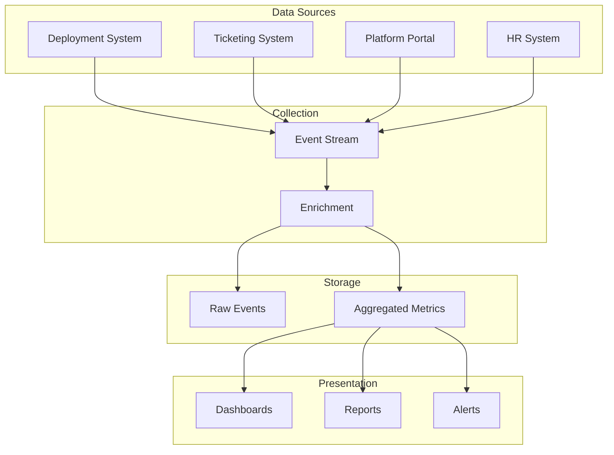

*[CSAT]: Customer Satisfaction Score
*[DORA]: DevOps Research and Assessment
*[MTTR]: Mean Time to Recovery
*[NPS]: Net Promoter Score
*[SLA]: Service Level Agreement
*[SLO]: Service Level Objective
*[TOIL]: Time-consuming, manual, automatable, lacking lasting value

How do you prove an internal platform creates value? Product teams measure revenue or user growth. Platform teams serve internal customers and enable outcomes rather than producing them directly. This creates a measurement gap—platform work is easy to fund when it's novel and hard to justify when it's mature.

I've watched this play out. A platform team builds an internal developer portal with self-service infrastructure provisioning. Six months in, leadership asks for success metrics. The team reports: 500 developers onboarded, 10,000 API calls per month, 99.9% uptime. Leadership responds: "That's nice, but did we save money? Are developers faster?" The team can't answer because they measured what the platform _does_, not what it _enables_.

The pivot is simple but fundamental: friction-focused metrics. Time to first deployment dropped from 2 weeks to 2 hours. Infrastructure tickets per developer dropped 80%. Developer NPS rose from -20 to +45. Now the narrative is clear: "Developers are 10x faster to get started and need 80% less support." That story justifies continued investment.

Meaningful platform metrics answer one question: is the platform making developers more productive? How long do common tasks take? How often do developers need help? How much cognitive load does the platform impose? Vanity metrics—adoption counts, API calls, uptime percentages—look impressive in slide decks but don't demonstrate value.

<Callout type="warning">
The most common platform metrics mistake: measuring platform activity (requests served, uptime) instead of developer outcomes (time saved, friction reduced). A platform can be highly available and completely useless.
</Callout>

Let's look at the metrics that actually demonstrate platform value.

## Core Platform Metrics

### Lead Time Metrics

Lead time metrics measure how long things take. They're the clearest indicators of platform friction because they directly answer "how fast can developers move?"

__Time to first deployment__ is the single most revealing onboarding metric. Measure from a developer's start date (HR system) to their first production deployment (deployment system). This captures everything: account provisioning, access requests, documentation quality, tooling complexity. If it takes two weeks, something is broken. If it's under a day, your platform is doing its job.

__Time to new service__ measures self-service effectiveness. From service creation request (portal or ticket) to first successful health check in production—how much of this is automated versus waiting on humans? Anything over a week suggests manual provisioning steps. Under an hour means your automation is mature.

__Deployment lead time__ tracks CI/CD efficiency: from code commit to running in production. This exposes approval bottlenecks, slow builds, and deployment friction. Elite teams hit under 15 minutes; struggling teams measure in days.

__Time to new environment__ measures infrastructure automation maturity. From environment request to a fully functional environment passing smoke tests—this is pure platform capability. If developers wait days for a staging environment, your Terraform modules or Crossplane claims need work.

| Metric | Poor | Acceptable | Excellent |
|--------|------|------------|-----------|
| Time to first deployment | > 2 weeks | 1-5 days | < 1 day |
| Time to new service | > 1 week | 1-24 hours | < 1 hour |
| Time to new environment | > 3 days | 1-4 hours | < 15 minutes |
| Deployment lead time | > 1 day | 1-4 hours | < 15 minutes |

Table: Lead time targets by maturity level.

These metrics align with DORA's[^dora] research-backed framework.

[^dora]: DORA (DevOps Research and Assessment) is a research program that identified four key metrics predicting software delivery performance: deployment frequency, lead time for changes, change failure rate, and time to restore service. Their annual State of DevOps reports provide industry benchmarks. Elite performers deploy multiple times per day with lead times under an hour. If you're measuring in weeks, you're not just slow—you're losing competitive ground.

```mermaid
gantt
    title Time to First Deployment (Before vs After Platform)
    dateFormat X
    axisFormat %d days

    section Before Platform
    Account setup           :a1, 0, 2d
    Request infrastructure  :a2, after a1, 3d
    Wait for provisioning   :a3, after a2, 5d
    Configure access        :a4, after a3, 2d
    First deployment        :milestone, after a4, 0d

    section After Platform
    Self-service onboarding :b1, 0, 4h
    Auto-provisioned env    :b2, after b1, 1h
    First deployment        :milestone, after b2, 0d
```



Figure: Lead time improvement visualization—12 days reduced to 5 hours.

### Developer Friction Metrics

Lead time tells you _how long_. Friction metrics tell you _how hard_. They measure the cognitive and operational burden the platform imposes.

__Ticket volume per developer__ is the baseline friction indicator. More than 2 tickets per developer per month means developers are stuck regularly. Under 0.5 means the platform is largely self-service. But raw numbers don't tell the whole story—segment by ticket type. "How do I" tickets indicate documentation gaps. "Access request" tickets indicate poor provisioning automation. "It's broken" tickets indicate reliability problems.

__Self-service rate__ measures what percentage of common tasks developers complete without human intervention. Track portal/API completions against tickets for the same task types. If developers can provision an environment through the portal but 40% still file tickets, something's wrong with the self-service experience.

__Cognitive load__ is harder to quantify but equally important. Count the config files developers must understand to deploy a service, the distinct tools in the deployment path, the context switches between systems for a single workflow. A platform that requires understanding 15 config files across 8 tools isn't self-service—it's a maze. For example: Kubernetes manifests, Helm values, Terraform variables, CI workflow configs, secrets references, Dockerfile, and monitoring configs—each requiring different syntax and mental models. If deploying a simple service touches more than 5 files, look for ways to consolidate or abstract.

| Metric | What It Indicates | Data Source |
|--------|-------------------|-------------|
| Tickets/developer/month | Support burden | Ticketing system |
| Self-service rate | Automation effectiveness | Portal analytics |
| Time to first deploy | Onboarding friction | HR + Deployment logs |
| Failed deployments | Platform reliability | CI/CD system |
| Rollback frequency | Change confidence | Deployment system |

Table: Core friction metrics and their sources.

<Callout type="info">
Ticket volume is a lagging indicator—it tells you friction exists but not why. Combine with ticket categorization to identify which platform areas cause the most pain. "Access request" tickets indicate poor provisioning; "how do I" tickets indicate poor documentation.
</Callout>

## Measurement Implementation

### Data Collection Architecture

Platform metrics come from multiple systems that don't naturally talk to each other. You need data from deployment systems (ArgoCD, GitHub Actions), ticketing systems (Jira, ServiceNow), your platform portal, and HR systems for onboarding metrics. The challenge is getting these into a unified view.

The collection pattern that works: event-driven ingestion into a stream (Kafka or Kinesis), enrichment with team and service metadata, aggregation into time-series storage, and visualization through dashboards. Raw events go to a data lake for historical analysis; aggregated metrics go to a time-series database for dashboards.



Figure: Metrics data flow from source systems to dashboards.

For deployment events, capture the service name, team, environment, duration, and commit SHA. For tickets, capture category, requester team, resolution time, and first response time. For portal events, capture user, team, duration, and success/failure. The key is consistent metadata across sources so you can correlate—linking a developer's first deployment to their HR start date, for example.

### Metric Calculation Examples

The calculations themselves are straightforward once you have the data. These functions typically run as scheduled jobs (AWS Lambda, Kubernetes CronJobs) that query your data warehouse nightly and write results to a time-series database. Grafana or similar dashboards then query the aggregated results.

```python title="metric-calculations.py"
# Platform metric calculations
# Query deployment events from BigQuery/Snowflake, write results to InfluxDB/TimescaleDB

from datetime import datetime, timedelta
from dataclasses import dataclass
from typing import Optional
import pandas as pd

@dataclass
class DeploymentEvent:
    service: str
    team: str
    environment: str
    commit_sha: str
    commit_timestamp: datetime
    deploy_started: datetime
    deploy_completed: Optional[datetime]
    status: str  # success, failed, rolled_back


def calculate_lead_time(events: list[DeploymentEvent]) -> dict:
    """Calculate deployment lead time metrics."""
    successful = [e for e in events if e.status == 'success' and e.deploy_completed]
    lead_times = [
        (e.deploy_completed - e.commit_timestamp).total_seconds() / 3600
        for e in successful
    ]
    return {
        'median_hours': pd.Series(lead_times).median(),
        'p90_hours': pd.Series(lead_times).quantile(0.90),
        'count': len(successful),
    }


def calculate_change_failure_rate(events: list[DeploymentEvent]) -> dict:
    """Calculate change failure rate."""
    total = len(events)
    failed = len([e for e in events if e.status in ('failed', 'rolled_back')])
    return {
        'failure_rate': failed / total if total > 0 else 0,
        'total_deployments': total,
        'failures': failed,
    }
```

Code: Core metric calculations for lead time and failure rate—run nightly via scheduled job against your data warehouse.

For onboarding metrics, you need to join HR data with deployment data. This calculation is trickier because HR systems and deployment systems rarely share identifiers—you'll need a mapping table or identity service to correlate employee IDs with Git/deployment usernames:

```python title="onboarding-metrics.py"
@dataclass
class DeveloperOnboarding:
    employee_id: str
    start_date: datetime
    first_commit: Optional[datetime]
    first_prod_deploy: Optional[datetime]


def calculate_onboarding_metrics(onboardings: list[DeveloperOnboarding]) -> dict:
    """Calculate time to first deployment."""
    completed = [o for o in onboardings if o.first_prod_deploy]
    times_to_deploy = [
        (o.first_prod_deploy - o.start_date).days
        for o in completed
    ]
    return {
        'median_days': pd.Series(times_to_deploy).median() if times_to_deploy else None,
        'p90_days': pd.Series(times_to_deploy).quantile(0.90) if times_to_deploy else None,
        'completed_onboardings': len(completed),
        'pending_onboardings': len([o for o in onboardings if not o.first_prod_deploy]),
    }
```

Code: Onboarding metrics joining HR and deployment data—typically run weekly since onboarding cohorts change slowly.

Report median and P90 rather than averages. Averages hide outliers—a median of 2 hours with a P90 of 8 hours tells you most deployments are fast but some get stuck. That's actionable information that an average would obscure.

<Callout type="success">
Automate metric collection from the start. Manual metrics (surveys, spreadsheets) are valuable for qualitative insights but unsustainable for ongoing measurement. Build instrumentation into platform components.
</Callout>

## Developer Experience Surveys

Automated metrics tell you _what_ is happening. Surveys tell you _why_—and capture friction that doesn't show up in logs.

### Survey Design

Three survey types cover the developer lifecycle:

__Onboarding surveys__ go out 30 days after a developer's start date. Ask how long it took to make their first production deployment (validates your automated metric), what was most confusing, how they'd rate the documentation, and how many times they needed help. Free-text responses here are gold—new developers see problems that veterans have normalized.

__Quarterly pulse surveys__ track satisfaction trends. Keep them short: how easy is it to deploy to production? How easy is it to debug production issues? Does the platform make you more productive? What's your biggest obstacle? End with an NPS question: "How likely are you to recommend this platform to a colleague?" Track these over time—the trend matters more than any single score.

__Feature feedback__ triggers after someone uses a new capability. Did it solve your problem? How much time does it save per week? What would make it more useful? This validates whether your investments are paying off.

__Annual deep-dives__ are longer surveys (15 minutes) that explore broader themes: overall platform satisfaction, feature priorities, pain points that don't fit in pulse surveys. Run these yearly to inform roadmap planning.

| Survey Type | Frequency | Length | Response Goal |
|-------------|-----------|--------|---------------|
| Onboarding | Once (30 days) | 5 min | > 80% |
| Quarterly pulse | Quarterly | 3 min | > 60% |
| Feature feedback | After use | 2 min | > 40% |
| Annual deep-dive | Yearly | 15 min | > 50% |

Table: Survey cadence and response targets.

NPS (Net Promoter Score) deserves special attention. Scores 9-10 are promoters, 7-8 are passives, 0-6 are detractors. NPS = % Promoters - % Detractors. Above 50 is excellent for an internal platform; below 0 means you have serious problems. But the number alone doesn't help—follow up with detractors to understand why.

Implementing NPS collection is straightforward. Most survey tools (Google Forms, Typeform, SurveyMonkey, Qualtrics) support the standard 0-10 scale question. For automation, trigger surveys via your HR system (onboarding) or platform events (feature usage). The calculation itself is simple—export responses to a spreadsheet or write a quick script:

```python title="nps-calculation.py"
# NPS calculation from survey responses
def calculate_nps(scores: list[int]) -> dict:
    """Calculate NPS from 0-10 survey responses."""
    if not scores:
        return {'nps': 0, 'promoters_pct': 0, 'detractors_pct': 0, 'responses': 0}

    promoters = len([s for s in scores if s >= 9])
    detractors = len([s for s in scores if s <= 6])
    total = len(scores)

    return {
        'nps': round(((promoters - detractors) / total) * 100),
        'promoters_pct': round((promoters / total) * 100),
        'detractors_pct': round((detractors / total) * 100),
        'responses': total,
    }
```

Code: NPS calculation—run after each survey closes to update your dashboard.

### Qualitative Analysis

Free-text responses require manual analysis, but they're worth the effort. Tag responses by theme: documentation gaps, slow performance, access issues, missing features, confusing UX. Count frequency. The themes that appear repeatedly are your roadmap priorities.

Combine survey feedback with other qualitative sources: support ticket themes, Slack channel sentiment[^slack], office hours topics, team retrospective callouts. None of these alone tells the full story, but patterns across sources are signal.

[^slack]: Slack sentiment can be measured several ways: third-party analytics apps like Flowtrace that integrate directly with Slack; custom bots that send messages to sentiment APIs (Google Cloud Natural Language, AWS Comprehend); data exports analyzed with Python NLP libraries; or simply tracking reaction emoji patterns (👍 vs ❓) to gauge resolution versus confusion.

Prioritize by impact and frequency. High-frequency, high-impact issues get fixed immediately. High-frequency, low-impact issues are quick wins. Low-frequency, high-impact issues go on the roadmap. Low-frequency, low-impact issues get monitored but not prioritized.

<Callout type="warning">
Survey fatigue is real. Keep surveys short, respect developer time, and—critically—act on feedback visibly. If developers don't see changes from feedback, they stop providing it.
</Callout>

## Avoiding Vanity Metrics

Some metrics exist primarily to impress stakeholders. They show activity without indicating impact—and they're dangerously easy to optimize for while missing actual value.

### Vanity vs Actionable Metrics

Here's how common platform metrics break down:

| Vanity Metric | Why It's Misleading | Actionable Alternative |
|---------------|---------------------|------------------------|
| "500 developers use the platform" | Doesn't indicate if they're productive | Time to first deployment for new developers |
| "10 million API calls/month" | Could be inefficient polling or errors | Successful self-service completions |
| "99.99% uptime" | Available but unusable is still failure | Successful deployment rate, P99 latency |
| "1000 deployments this month" | Includes failures, rollbacks, test envs | Production deployment success rate |
| "500 documentation pages" | Quantity ≠ quality or findability | Search success rate, ticket deflection |

Table: Vanity metrics and their actionable alternatives.

The test for a good metric: does it tell you what to do? "We have 1000 users" tells you nothing. "50% of users struggle with authentication" tells you to improve the auth flow. "Satisfaction is good" is useless. "NPS improved from 20 to 35 this quarter" shows progress and lets you dig into why.

### Metric Pitfalls

__Goodhart's Law__ is the biggest trap: when a measure becomes a target, it ceases to be a good measure. Target ticket reduction and support becomes harder to access. Target deployment frequency and deployments get artificially split. Target NPS and only happy teams get surveyed. The antidote is measuring outcomes (developer productivity) rather than activities (ticket counts).

__Survivorship bias__ means only measuring successful cases. If you track deployment time only for successful deploys, you miss that failed deployments might indicate UX problems. If you survey only active platform users, you miss teams that left. Include failures in your metrics; run exit surveys when teams churn.

__Attribution errors__ credit the platform for unrelated improvements. "Lead time improved 50% after platform launch"—but the team also grew, hired senior engineers, and changed their process. Control for variables by comparing similar teams or tracking metrics that isolate platform impact.

__Sampling bias__ measures unrepresentative subsets. Feedback from teams in office hours comes from self-selected engaged users. Random sampling and broad surveys give you the full picture.

### Establishing Baselines

You can't show improvement without knowing your starting point. The most common mistake: launch a platform, then ask "how much did we improve?" Measure before changes, even if the measurement is imperfect. Document your methodology. Accept that baselines may be incomplete. Track consistently over time.

At minimum, establish baselines for: time to first deployment (new hires), ticket volume per developer, deployment frequency, and change failure rate. These four metrics tell you whether developers are getting productive faster and staying productive with less support.

<Callout type="danger">
Metrics without baselines are stories without beginnings. If you can't say "before the platform, X took Y time," you can't prove the platform helped. Start measuring before you ship.
</Callout>

## Dashboards and Reporting

Different audiences need different views of the same data. Executives want trends and ROI. Platform engineers want real-time operational metrics. Product teams want their own performance relative to others.

### Dashboard Design

__Executive dashboards__ show 4-6 headline metrics with trends: developer NPS, time to first deployment, ticket volume per developer, deployment success rate. Update monthly. The goal is answering "Is the platform investment paying off?" without requiring deep dives.

__Platform team dashboards__ are operational: deployment success rates by team and service, self-service completion rates, error rates by component, latency percentiles, active incidents. Update in real-time. These drive daily decisions about what to fix and where to invest.

__Team-specific views__ let product teams see their own metrics: their deployment frequency, their lead time, their ticket count, their resource usage. Comparisons to org averages help teams self-identify whether they're outliers needing help.

For executive dashboards in Grafana, structure with headline stats at the top (single-stat panels showing current value vs. last quarter), trend lines in the middle (12-month time series for deployment frequency and change failure rate), and breakdowns at the bottom (bar charts for lead time by team, pie charts for ticket categories).

### Alerting Thresholds

Dashboards show state; alerts drive action. Configure alerts for metrics that require immediate attention:

- __Deployment success rate__ below 80% for 4+ hours—something is systematically broken
- __Build queue time__ exceeding 30 minutes—capacity or configuration problems
- __Self-service completion rate__ dropping below baseline by 20%—recent changes broke something
- __P0 tickets__ opened—immediate platform team attention needed

Resist the urge to alert on everything. Alert fatigue leads to ignored alerts. Reserve alerts for conditions that require action within hours, not trends that require analysis over weeks.

### Reporting Cadence

Not everything belongs on a real-time dashboard. Structured reports at regular intervals provide narrative and context that dashboards can't.

| Report | Audience | Frequency | Key Question |
|--------|----------|-----------|-------------|
| Weekly digest | Platform team | Weekly | "What happened this week?" |
| Monthly review | Eng leadership | Monthly | "Are we improving?" |
| Quarterly business review | Executives | Quarterly | "Is platform investment paying off?" |
| Annual report | Organization | Yearly | "What value did platform deliver?" |

Table: Reporting cadence by audience.

__Weekly digests__ go to the platform team via Slack or email. Automate these with Grafana's reporting plugin or a custom script. Include deployment count and success rate, median lead time, tickets opened and resolved, and any notable incidents. Keep it scannable—if it takes more than 30 seconds to read, it won't get read.

__Monthly reviews__ go to engineering leadership. DORA metrics trends, developer satisfaction trends, major accomplishments, risks and blockers. This is where you add narrative: why did lead time spike in week 3? What's blocking the self-service rate improvement?

__Quarterly business reviews__ go to executive stakeholders. Platform ROI analysis, developer productivity trends, roadmap progress, investment requests. Translate technical metrics into business impact: "Onboarding time reduction saved 200 developer-hours this quarter."

__Annual reports__ go to the broader organization. Year in review, major milestones, impact stories, next year's vision. This is your chance to build organizational awareness and support for platform investment.

<Callout type="success">
Automate reporting wherever possible. Manual reports are time-consuming and inconsistent. Use Grafana's reporting plugin, scheduled Jupyter notebooks[^jupyter], or custom scripts. Reserve manual effort for narrative and interpretation—the "why" behind the numbers.
</Callout>

[^jupyter]: Automating reports with Jupyter notebooks requires three components: parameterization, headless execution, and scheduling. Use Papermill to inject values (like report dates) at runtime—tag cells with "parameters" in JupyterLab's Property Inspector, then run `papermill input.ipynb output_report.ipynb -p report_date '2024-02-01'`. For simpler cases without parameters, `jupyter nbconvert --to html --execute my_report.ipynb` generates HTML output directly. Schedule either command with cron, Airflow, or your CI system.

## Conclusion

Without metrics focused on developer friction, platforms can't prove value, prioritize work, or demonstrate improvement. The right metrics answer one question: are developers more productive? Lead time, ticket deflection, self-service rates, and satisfaction scores provide that answer. Adoption counts and API calls do not.

If you're starting from scratch, don't try to build everything at once. Start with four baseline metrics you can measure today, even imperfectly: time to first deployment (ask new hires), tickets per developer (query your ticketing system), deployment frequency (check your CI logs), and a simple quarterly NPS survey. Instrument as you go, automate what you can, and add sophistication over time. A spreadsheet tracking the right metrics beats a sophisticated dashboard tracking the wrong ones.

The ultimate goal is a clear narrative: "Before the platform, onboarding took two weeks. After, it takes two hours. We saved 200 developer-hours this quarter." That story, backed by data, justifies continued investment and guides roadmap decisions.

<Callout type="info">
Metrics are a means to an end. The goal isn't impressive dashboards—it's understanding whether the platform reduces friction and enabling decisions about where to invest next. If metrics don't change behavior, they're not worth collecting.
</Callout>
