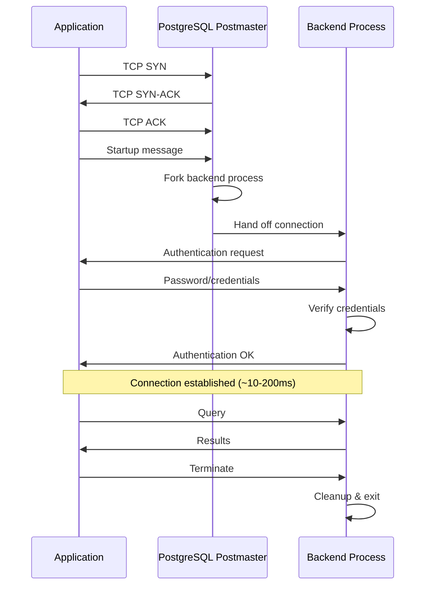
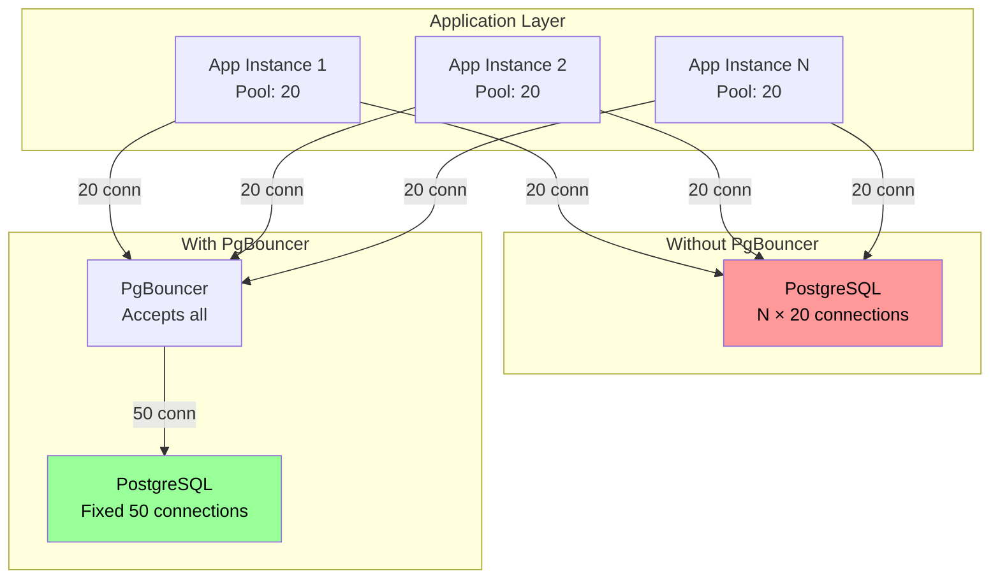
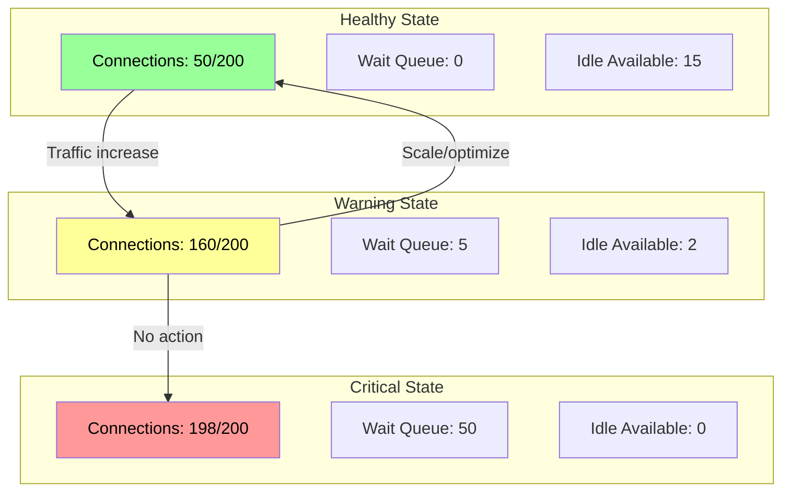

*[SQL]: Structured Query Language
*[TCP]: Transmission Control Protocol
*[TLS]: Transport Layer Security
*[CPU]: Central Processing Unit
*[RAM]: Random Access Memory
*[IOPS]: Input/Output Operations Per Second
*[OOM]: Out of Memory
*[PgBouncer]: PostgreSQL Connection Pooler
*[RDS]: Relational Database Service
*[K8s]: Kubernetes
*[HPA]: Horizontal Pod Autoscaler

# PostgreSQL Connections: Pooling and Saturation

## Introduction

Frame the PostgreSQL connection problem: each connection consumes memory (roughly 5-10MB per connection), requires a dedicated backend process, and introduces context-switching overhead. A database configured for 200 max connections isn't "safe at 199"—it's already under strain well before that limit. This section establishes that connection management isn't about avoiding hard limits; it's about understanding the soft degradation that happens as connections accumulate. Connection exhaustion doesn't announce itself with a clean error—it manifests as slow queries, timeouts, and cascading failures across your application tier.

_Include a scenario: a team runs PostgreSQL with max_connections=200, feeling safe with typical usage around 50. A traffic spike hits, application instances scale from 5 to 20, each with a pool of 20 connections. Suddenly 400 connections are requested against a 200 limit. The database starts rejecting connections. The application's connection pool doesn't handle rejection gracefully—threads block waiting for connections. Health checks fail, triggering more scaling. More instances, more connection requests, harder failure. They add PgBouncer, properly size pools, and implement connection backpressure. Next traffic spike: database connections stay at 200, application queues requests appropriately, latency increases but nothing fails. The lesson: connection limits aren't about capacity—they're about graceful degradation._

<Callout type="warning">
The most common PostgreSQL scaling mistake: configuring max_connections high "just in case." Each connection costs memory and CPU. A database with 1000 max_connections will perform worse than one with 200—even at the same actual connection count—because of reservation overhead.
</Callout>

## Connection Fundamentals

### How PostgreSQL Handles Connections

```yaml title="connection-architecture.yaml"
# PostgreSQL connection architecture

connection_lifecycle:
  establishment:
    steps:
      1: "Client initiates TCP connection"
      2: "PostgreSQL postmaster accepts connection"
      3: "Postmaster forks new backend process"
      4: "Backend performs authentication"
      5: "TLS handshake (if configured)"
      6: "Backend ready for queries"
    overhead:
      tcp_handshake: "~1ms (local), 10-100ms (remote)"
      fork: "~1-5ms"
      authentication: "~1-10ms (depends on method)"
      tls: "~5-50ms"
      total: "10-200ms for new connection"

  per_connection_resources:
    memory:
      work_mem: "4MB default (per operation, not connection)"
      maintenance_work_mem: "64MB default"
      backend_process: "~5-10MB base"
      shared_buffers_mapping: "Variable"
    cpu:
      process_overhead: "Context switching"
      scheduling: "OS scheduler contention"

  termination:
    graceful: "Client sends termination message"
    timeout: "idle_session_timeout, statement_timeout"
    forced: "pg_terminate_backend(), server shutdown"

---
# max_connections impact
max_connections_effects:
  low_setting:
    value: "50-100"
    use_case: "Small deployments, with pooler"
    memory: "~500MB-1GB for connections"

  medium_setting:
    value: "100-300"
    use_case: "Medium deployments"
    memory: "~1-3GB for connections"

  high_setting:
    value: "500-1000"
    use_case: "Large deployments (usually wrong)"
    memory: "~5-10GB for connections"
    problems:
      - "Memory pressure"
      - "Lock contention"
      - "Scheduler overhead"

  recommendation: |
    Use connection pooler (PgBouncer) and keep max_connections low.
    Rule of thumb: max_connections = (CPU cores * 2) + effective_spindle_count
    For SSD: max_connections = CPU cores * 4 (still conservative)
```
Code: PostgreSQL connection architecture.


Figure: Connection establishment sequence.

### Connection Costs

```sql title="connection-monitoring.sql"
-- Monitor connection usage and costs

-- Current connection count by state
SELECT
    state,
    count(*) as connections,
    round(100.0 * count(*) / sum(count(*)) over(), 1) as percentage
FROM pg_stat_activity
WHERE backend_type = 'client backend'
GROUP BY state
ORDER BY connections DESC;

-- Connection count by application/user
SELECT
    usename,
    application_name,
    client_addr,
    count(*) as connections,
    count(*) FILTER (WHERE state = 'active') as active,
    count(*) FILTER (WHERE state = 'idle') as idle,
    count(*) FILTER (WHERE state = 'idle in transaction') as idle_in_txn
FROM pg_stat_activity
WHERE backend_type = 'client backend'
GROUP BY usename, application_name, client_addr
ORDER BY connections DESC;

-- Long-running connections (potential leaks)
SELECT
    pid,
    usename,
    application_name,
    client_addr,
    backend_start,
    now() - backend_start as connection_age,
    state,
    query
FROM pg_stat_activity
WHERE backend_type = 'client backend'
    AND backend_start < now() - interval '1 hour'
ORDER BY backend_start;

-- Connections waiting for locks
SELECT
    blocked.pid as blocked_pid,
    blocked.usename as blocked_user,
    blocking.pid as blocking_pid,
    blocking.usename as blocking_user,
    blocked.query as blocked_query,
    blocking.query as blocking_query
FROM pg_stat_activity blocked
JOIN pg_locks blocked_locks ON blocked.pid = blocked_locks.pid
JOIN pg_locks blocking_locks ON blocked_locks.locktype = blocking_locks.locktype
    AND blocked_locks.relation = blocking_locks.relation
    AND blocked_locks.pid != blocking_locks.pid
JOIN pg_stat_activity blocking ON blocking_locks.pid = blocking.pid
WHERE NOT blocked_locks.granted;

-- Memory usage estimate (rough)
SELECT
    count(*) as total_connections,
    count(*) * 10 as estimated_memory_mb,  -- ~10MB per connection
    current_setting('max_connections')::int as max_connections,
    round(100.0 * count(*) / current_setting('max_connections')::int, 1) as utilization_pct
FROM pg_stat_activity
WHERE backend_type = 'client backend';
```
Code: Connection monitoring queries.

| Connection State | Description | Concern Level |
|------------------|-------------|---------------|
| active | Executing query | Normal if short |
| idle | Waiting for query | Normal (pooled) |
| idle in transaction | Transaction open, no query | High (blocks vacuum) |
| idle in transaction (aborted) | Failed transaction, not rolled back | Critical |
| fastpath function call | Executing function | Normal |

Table: Connection states.

<Callout type="info">
"Idle in transaction" connections are particularly dangerous. They hold locks, prevent vacuum from cleaning up dead tuples, and consume connection slots. Set `idle_in_transaction_session_timeout` to kill them automatically.
</Callout>

## Connection Pooling

### Pooling Architectures

```yaml title="pooling-architectures.yaml"
# Connection pooling approaches

pooling_approaches:
  application_side:
    description: "Pool within the application process"
    examples:
      - "HikariCP (Java)"
      - "node-postgres pool"
      - "SQLAlchemy pool (Python)"
      - "database/sql pool (Go)"
    advantages:
      - "No additional infrastructure"
      - "Per-application configuration"
      - "Prepared statement support"
    disadvantages:
      - "Each app instance has own pool"
      - "Total connections = instances × pool_size"
      - "Scaling apps scales connections"
    best_for:
      - "Single application"
      - "Small deployments"
      - "Prepared statement heavy workloads"

  external_pooler:
    description: "Dedicated pooling service between app and database"
    examples:
      - "PgBouncer"
      - "Pgpool-II"
      - "AWS RDS Proxy"
    advantages:
      - "Connection count independent of app instances"
      - "Connection multiplexing"
      - "App can scale freely"
    disadvantages:
      - "Additional infrastructure"
      - "Potential single point of failure"
      - "Latency overhead (minimal)"
    best_for:
      - "Multi-application environments"
      - "Auto-scaling applications"
      - "Connection-constrained databases"

  pooling_modes:
    session:
      description: "Client gets dedicated server connection for session lifetime"
      multiplexing: "None"
      prepared_statements: "Yes"
      use_case: "Long-running sessions, prepared statements"

    transaction:
      description: "Client gets connection for transaction, returned after"
      multiplexing: "High"
      prepared_statements: "Limited (server-side)"
      use_case: "Most web applications"

    statement:
      description: "Connection returned after each statement"
      multiplexing: "Maximum"
      prepared_statements: "No"
      use_case: "Simple queries, maximum efficiency"
      restrictions: "No multi-statement transactions"
```
Code: Pooling architectures.

### PgBouncer Configuration

```ini title="pgbouncer.ini"
; PgBouncer configuration

[databases]
; database = connection string
myapp = host=postgres.internal port=5432 dbname=myapp

; Wildcard allows connecting to any database
* = host=postgres.internal port=5432

[pgbouncer]
; === Connection limits ===
; Max client connections pgbouncer will accept
max_client_conn = 1000

; Max connections to PostgreSQL per pool (user+database combo)
default_pool_size = 20

; Min connections to keep open per pool
min_pool_size = 5

; Connections to add when pool is exhausted (burst handling)
reserve_pool_size = 5

; How long a client can wait for a connection (seconds)
reserve_pool_timeout = 3

; === Pooling mode ===
; session = one server connection per client session
; transaction = connection returned after each transaction
; statement = connection returned after each statement
pool_mode = transaction

; === Timeouts ===
; Close server connection if unused for this long
server_idle_timeout = 600

; Close client connection if idle this long
client_idle_timeout = 0

; Cancel query if server doesn't respond
query_timeout = 0

; Cancel query if taking longer than this
query_wait_timeout = 120

; === Server connection handling ===
; Close connection after this many queries (prevents memory leaks)
server_lifetime = 3600

; Check server health before giving to client
server_check_delay = 30
server_check_query = SELECT 1

; === Authentication ===
auth_type = md5
auth_file = /etc/pgbouncer/userlist.txt

; === Logging ===
log_connections = 1
log_disconnections = 1
log_pooler_errors = 1

; === Admin ===
listen_addr = 0.0.0.0
listen_port = 6432
admin_users = pgbouncer_admin
stats_users = pgbouncer_stats
```
Code: PgBouncer configuration.

```yaml title="pgbouncer-sizing.yaml"
# PgBouncer pool sizing guidelines

sizing_formula:
  default_pool_size:
    formula: "PostgreSQL max_connections / number_of_pools"
    example:
      max_connections: 100
      pools: 5  # 5 different user+database combos
      result: 20  # connections per pool

  max_client_conn:
    formula: "Expected peak concurrent app connections"
    considerations:
      - "App instances × connections per instance"
      - "Headroom for spikes"
      - "Connection queue tolerance"

  reserve_pool:
    purpose: "Handle traffic bursts"
    sizing: "10-25% of default_pool_size"
    timeout: "How long to wait before using reserve"

---
# Sizing scenarios
scenarios:
  small_web_app:
    description: "5 app instances, simple workload"
    config:
      max_client_conn: 200
      default_pool_size: 15
      reserve_pool_size: 5
      pool_mode: transaction
    postgresql:
      max_connections: 100

  medium_service:
    description: "20 app instances, moderate workload"
    config:
      max_client_conn: 500
      default_pool_size: 25
      reserve_pool_size: 10
      pool_mode: transaction
    postgresql:
      max_connections: 200

  high_scale:
    description: "100+ app instances, heavy workload"
    config:
      max_client_conn: 2000
      default_pool_size: 50
      reserve_pool_size: 25
      pool_mode: transaction
    postgresql:
      max_connections: 400
    notes: "Consider read replicas, sharding"
```
Code: PgBouncer sizing.


Figure: PgBouncer connection multiplexing.

<Callout type="success">
Transaction pooling mode is the sweet spot for most applications. It provides high connection multiplexing while supporting transactions. Only use session mode if you need prepared statements with server-side state, or statement mode for stateless read-heavy workloads.
</Callout>

## Pool Sizing

### Sizing Calculations

```yaml title="pool-sizing-math.yaml"
# Connection pool sizing calculations

little_law:
  description: "Fundamental queuing theory for pool sizing"
  formula: "L = λ × W"
  where:
    L: "Average number of connections in use"
    λ: "Request arrival rate (requests/second)"
    W: "Average time per request (seconds)"
  example:
    arrival_rate: 100  # requests per second
    avg_query_time: 0.05  # 50ms
    connections_needed: 5  # 100 × 0.05
    with_headroom: 10  # 2× for variance

pool_sizing_factors:
  query_duration:
    description: "How long queries take"
    impact: "Longer queries = more connections needed"
    measurement: "P99 query time, not average"

  request_rate:
    description: "Queries per second"
    impact: "Higher rate = more connections needed"
    measurement: "Peak rate, not average"

  variance:
    description: "Variation in query times"
    impact: "High variance = need more headroom"
    measurement: "Coefficient of variation (stddev/mean)"

  burst_factor:
    description: "Traffic spikes above baseline"
    impact: "Need reserve capacity"
    typical: "2-3x baseline for spikes"

---
# Practical sizing
practical_sizing:
  application_pool:
    formula: |
      pool_size = ceil(peak_qps × p99_query_time × burst_factor)
    example:
      peak_qps: 50  # per instance
      p99_query_time: 0.1  # 100ms
      burst_factor: 2
      result: 10  # connections per instance

  pgbouncer_pool:
    formula: |
      default_pool_size = min(
        postgresql_max_connections / pool_count,
        sum(application_pool_sizes)
      )
    rationale: "Don't exceed PostgreSQL capacity"

  postgresql_max_connections:
    formula: |
      max_connections = (CPU_cores × 2) + (effective_io_concurrency)
    conservative: "50-100 for most workloads"
    rationale: "Connection overhead outweighs parallelism benefit"

---
# Anti-patterns
anti_patterns:
  too_large_app_pool:
    mistake: "Setting pool_size = 100 per instance"
    problem: "10 instances = 1000 connections"
    fix: "Size based on actual need, not 'just in case'"

  no_max_lifetime:
    mistake: "Connections never recycled"
    problem: "Memory leaks, stale connections"
    fix: "max_lifetime = 30 minutes"

  no_idle_timeout:
    mistake: "Idle connections kept forever"
    problem: "Resource waste, connection leaks"
    fix: "idle_timeout = 10 minutes"
```
Code: Pool sizing calculations.

### Application Pool Configuration

```typescript title="nodejs-pool-config.ts"
// Node.js pg-pool configuration

import { Pool, PoolConfig } from 'pg';

// === Recommended configuration ===
const poolConfig: PoolConfig = {
  // Connection details
  host: process.env.DB_HOST,
  port: parseInt(process.env.DB_PORT || '5432'),
  database: process.env.DB_NAME,
  user: process.env.DB_USER,
  password: process.env.DB_PASSWORD,

  // === Pool sizing ===
  // Maximum connections in pool
  // Rule: peak_qps × p99_latency × burst_factor
  max: 20,

  // Minimum connections to maintain
  // Keeps pool warm, reduces cold-start latency
  min: 5,

  // === Timeouts ===
  // How long to wait for available connection
  connectionTimeoutMillis: 10000, // 10 seconds

  // How long idle connection stays in pool
  idleTimeoutMillis: 30000, // 30 seconds

  // === Connection lifecycle ===
  // Close and recreate connections after this long
  // Prevents memory leaks, stale connections
  maxLifetimeSeconds: 1800, // 30 minutes (if supported)

  // === Statement timeout (per query) ===
  statement_timeout: 30000, // 30 seconds

  // === SSL ===
  ssl: process.env.NODE_ENV === 'production' ? {
    rejectUnauthorized: true,
    ca: process.env.DB_CA_CERT,
  } : false,
};

const pool = new Pool(poolConfig);

// === Connection event handling ===
pool.on('connect', (client) => {
  console.log('New client connected to pool');
  // Set session-level parameters
  client.query('SET statement_timeout = 30000');
});

pool.on('error', (err, client) => {
  console.error('Unexpected error on idle client', err);
});

pool.on('acquire', (client) => {
  // Track connection acquisition for metrics
  metrics.increment('db.pool.acquire');
});

pool.on('release', (client) => {
  metrics.increment('db.pool.release');
});

// === Health check ===
async function healthCheck(): Promise<boolean> {
  try {
    const client = await pool.connect();
    await client.query('SELECT 1');
    client.release();
    return true;
  } catch (error) {
    console.error('Database health check failed:', error);
    return false;
  }
}

// === Metrics collection ===
function collectPoolMetrics() {
  return {
    totalConnections: pool.totalCount,
    idleConnections: pool.idleCount,
    waitingRequests: pool.waitingCount,
    utilization: pool.totalCount > 0
      ? (pool.totalCount - pool.idleCount) / pool.totalCount
      : 0,
  };
}

// Export for application use
export { pool, healthCheck, collectPoolMetrics };
```
Code: Node.js pool configuration.

```java title="hikari-pool-config.java"
// HikariCP configuration (Java)

import com.zaxxer.hikari.HikariConfig;
import com.zaxxer.hikari.HikariDataSource;

public class DatabaseConfig {

    public static HikariDataSource createDataSource() {
        HikariConfig config = new HikariConfig();

        // === Connection details ===
        config.setJdbcUrl("jdbc:postgresql://localhost:5432/mydb");
        config.setUsername(System.getenv("DB_USER"));
        config.setPassword(System.getenv("DB_PASSWORD"));

        // === Pool sizing ===
        // Maximum connections in pool
        // Formula: ((core_count * 2) + effective_spindle_count)
        // For typical app server: 10-20
        config.setMaximumPoolSize(20);

        // Minimum idle connections
        // Set equal to max for predictable performance
        config.setMinimumIdle(10);

        // === Timeouts ===
        // How long to wait for connection from pool
        config.setConnectionTimeout(10000); // 10 seconds

        // How long connection can be idle before removal
        config.setIdleTimeout(600000); // 10 minutes

        // Maximum connection lifetime
        // Prevents stale connections, memory leaks
        config.setMaxLifetime(1800000); // 30 minutes

        // === Validation ===
        // Validate connection before giving to application
        config.setConnectionTestQuery("SELECT 1");

        // How often to validate idle connections
        config.setKeepaliveTime(300000); // 5 minutes

        // === PostgreSQL specific ===
        config.addDataSourceProperty("cachePrepStmts", "true");
        config.addDataSourceProperty("prepStmtCacheSize", "250");
        config.addDataSourceProperty("prepStmtCacheSqlLimit", "2048");

        // Statement timeout (milliseconds)
        config.addDataSourceProperty("options", "-c statement_timeout=30000");

        // === Metrics ===
        config.setMetricRegistry(metricRegistry);
        config.setPoolName("PostgreSQL-Pool");

        // === Leak detection ===
        // Log warning if connection not returned within threshold
        config.setLeakDetectionThreshold(60000); // 1 minute

        return new HikariDataSource(config);
    }
}
```
Code: HikariCP configuration.

| Setting | Recommended Value | Rationale |
|---------|-------------------|-----------|
| max_pool_size | 10-30 per instance | Based on Little's Law calculation |
| min_pool_size | 50% of max | Keep pool warm, reduce latency |
| connection_timeout | 10s | Fail fast if pool exhausted |
| idle_timeout | 10-30 min | Reclaim unused connections |
| max_lifetime | 30 min | Prevent stale connections |
| leak_detection | 1-5 min | Catch unreturned connections |

Table: Pool configuration guidelines.

<Callout type="warning">
Never set pool max_size to PostgreSQL max_connections. Leave headroom for admin connections, monitoring, migrations, and other applications. A good rule: application pools should use at most 80% of max_connections.
</Callout>

## Saturation Signals

### Metrics to Monitor

```yaml title="saturation-metrics.yaml"
# Connection saturation monitoring

key_metrics:
  connection_utilization:
    query: |
      SELECT
        count(*) as current,
        current_setting('max_connections')::int as max,
        round(100.0 * count(*) / current_setting('max_connections')::int, 1) as pct
      FROM pg_stat_activity
      WHERE backend_type = 'client backend';
    thresholds:
      warning: "> 70%"
      critical: "> 85%"
    action: "Add pooler or reduce pool sizes"

  pool_wait_time:
    description: "Time waiting for available connection"
    source: "Application pool metrics"
    thresholds:
      warning: "> 100ms P99"
      critical: "> 1s P99"
    action: "Increase pool size or optimize queries"

  connection_queue_depth:
    description: "Requests waiting for connections"
    source: "Application/PgBouncer metrics"
    thresholds:
      warning: "> 10"
      critical: "> 50"
    action: "Pool undersized or query bottleneck"

  idle_in_transaction:
    query: |
      SELECT count(*) FROM pg_stat_activity
      WHERE state = 'idle in transaction'
      AND (now() - state_change) > interval '1 minute';
    thresholds:
      warning: "> 5"
      critical: "> 20"
    action: "Find and fix leaking transactions"

  connection_errors:
    types:
      - "too many connections"
      - "connection refused"
      - "connection timeout"
    source: "Application logs, PostgreSQL logs"
    thresholds:
      warning: "> 0"
      critical: "Sustained errors"
    action: "Immediate investigation"

---
# PgBouncer metrics
pgbouncer_metrics:
  cl_active:
    description: "Client connections actively linked to server"

  cl_waiting:
    description: "Client connections waiting for server"
    threshold: "> 0 sustained indicates saturation"

  sv_active:
    description: "Server connections actively executing"

  sv_idle:
    description: "Server connections idle and available"
    threshold: "0 indicates pool exhaustion"

  sv_used:
    description: "Server connections idle but recently used"

  maxwait:
    description: "Longest current wait time (seconds)"
    threshold: "> 1s indicates problems"

  avg_query:
    description: "Average query time (microseconds)"
    use: "Detect query slowdowns"
```
Code: Saturation metrics.

### Monitoring Dashboard

```sql title="monitoring-queries.sql"
-- Comprehensive connection monitoring queries

-- === Real-time connection overview ===
SELECT
    'Total Connections' as metric,
    count(*)::text as value
FROM pg_stat_activity
WHERE backend_type = 'client backend'

UNION ALL

SELECT
    'Max Connections',
    current_setting('max_connections')

UNION ALL

SELECT
    'Utilization %',
    round(100.0 * (SELECT count(*) FROM pg_stat_activity WHERE backend_type = 'client backend')
          / current_setting('max_connections')::int, 1)::text

UNION ALL

SELECT
    'Active Queries',
    count(*)::text
FROM pg_stat_activity
WHERE state = 'active' AND backend_type = 'client backend'

UNION ALL

SELECT
    'Idle in Transaction',
    count(*)::text
FROM pg_stat_activity
WHERE state = 'idle in transaction';


-- === Connection age distribution ===
SELECT
    CASE
        WHEN age < interval '1 minute' THEN '< 1 min'
        WHEN age < interval '10 minutes' THEN '1-10 min'
        WHEN age < interval '1 hour' THEN '10-60 min'
        WHEN age < interval '1 day' THEN '1-24 hours'
        ELSE '> 1 day'
    END as age_bucket,
    count(*) as connections
FROM (
    SELECT now() - backend_start as age
    FROM pg_stat_activity
    WHERE backend_type = 'client backend'
) ages
GROUP BY age_bucket
ORDER BY min(age);


-- === Waiting connections (lock waits) ===
SELECT
    count(*) as waiting_connections,
    max(now() - wait_event_start) as longest_wait
FROM pg_stat_activity
WHERE wait_event IS NOT NULL
    AND backend_type = 'client backend';


-- === Connection creation rate (needs pg_stat_statements) ===
SELECT
    date_trunc('minute', backend_start) as minute,
    count(*) as new_connections
FROM pg_stat_activity
WHERE backend_start > now() - interval '1 hour'
GROUP BY minute
ORDER BY minute DESC;


-- === Query blocking analysis ===
WITH blocked AS (
    SELECT
        blocked.pid as blocked_pid,
        blocked.query as blocked_query,
        blocking.pid as blocking_pid,
        blocking.query as blocking_query,
        now() - blocked.state_change as blocked_duration
    FROM pg_stat_activity blocked
    JOIN pg_locks blocked_locks ON blocked.pid = blocked_locks.pid
    JOIN pg_locks blocking_locks
        ON blocked_locks.locktype = blocking_locks.locktype
        AND blocked_locks.database IS NOT DISTINCT FROM blocking_locks.database
        AND blocked_locks.relation IS NOT DISTINCT FROM blocking_locks.relation
        AND blocked_locks.pid != blocking_locks.pid
    JOIN pg_stat_activity blocking ON blocking_locks.pid = blocking.pid
    WHERE NOT blocked_locks.granted
)
SELECT * FROM blocked
WHERE blocked_duration > interval '10 seconds'
ORDER BY blocked_duration DESC;
```
Code: Monitoring queries.


Figure: Connection saturation progression.

<Callout type="danger">
Don't wait for "too many connections" errors. Monitor utilization at 70% and investigate at 85%. By the time you hit hard limits, you're already in a cascading failure scenario.
</Callout>

## Failure Patterns

### Connection Exhaustion Cascade

```yaml title="failure-cascade.yaml"
# Connection exhaustion failure pattern

cascade_sequence:
  stage_1_saturation:
    trigger: "Traffic spike or slow queries"
    symptoms:
      - "Pool utilization increasing"
      - "Connection wait times increasing"
      - "Query latencies increasing"
    duration: "Minutes to hours"

  stage_2_queueing:
    trigger: "Pool fully utilized"
    symptoms:
      - "Requests queuing for connections"
      - "Request latencies spiking"
      - "Timeout errors beginning"
    duration: "Seconds to minutes"

  stage_3_timeouts:
    trigger: "Queue exceeds timeout threshold"
    symptoms:
      - "Connection timeout errors"
      - "Transaction aborts"
      - "User-visible errors"
    duration: "Immediate"

  stage_4_cascade:
    trigger: "Application retries compound problem"
    symptoms:
      - "Retry storms"
      - "More connection requests"
      - "Health checks failing"
      - "Orchestrator killing/restarting pods"
    duration: "Minutes"

  stage_5_collapse:
    trigger: "System overwhelmed"
    symptoms:
      - "Complete service unavailability"
      - "Database refusing all connections"
      - "Manual intervention required"

---
# Prevention strategies
prevention:
  connection_limits:
    action: "Set max connections at all layers"
    implementation:
      - "Application pool max"
      - "PgBouncer max_client_conn"
      - "PostgreSQL max_connections"
    principle: "Fail fast at application, not database"

  circuit_breakers:
    action: "Stop requests before they queue"
    implementation:
      - "Detect connection saturation"
      - "Return fast error instead of waiting"
      - "Allow system to recover"

  backpressure:
    action: "Slow down request acceptance"
    implementation:
      - "Rate limiting at ingress"
      - "Request queuing with bounded size"
      - "Shed load during saturation"

  graceful_degradation:
    action: "Reduce work under stress"
    implementation:
      - "Disable non-critical features"
      - "Serve cached responses"
      - "Return partial results"
```
Code: Connection exhaustion cascade.

### Recovery Strategies

```typescript title="recovery-strategies.ts"
// Connection exhaustion recovery strategies

// === Strategy 1: Circuit breaker ===
class DatabaseCircuitBreaker {
  private failures = 0;
  private lastFailure = 0;
  private state: 'closed' | 'open' | 'half-open' = 'closed';

  private readonly threshold = 5;
  private readonly timeout = 30000; // 30 seconds

  async query<T>(pool: Pool, sql: string, params?: unknown[]): Promise<T> {
    if (this.state === 'open') {
      if (Date.now() - this.lastFailure > this.timeout) {
        this.state = 'half-open';
      } else {
        throw new Error('Circuit breaker open - database unavailable');
      }
    }

    try {
      const client = await pool.connect();
      try {
        const result = await client.query(sql, params);
        this.onSuccess();
        return result.rows as T;
      } finally {
        client.release();
      }
    } catch (error) {
      if (this.isConnectionError(error)) {
        this.onFailure();
      }
      throw error;
    }
  }

  private isConnectionError(error: unknown): boolean {
    const message = (error as Error).message || '';
    return message.includes('connection') ||
           message.includes('timeout') ||
           message.includes('too many clients');
  }

  private onSuccess() {
    this.failures = 0;
    this.state = 'closed';
  }

  private onFailure() {
    this.failures++;
    this.lastFailure = Date.now();
    if (this.failures >= this.threshold) {
      this.state = 'open';
      console.error('Circuit breaker opened - database circuit broken');
    }
  }
}

// === Strategy 2: Connection timeout with retry budget ===
class RetryBudget {
  private requests = 0;
  private retries = 0;
  private windowStart = Date.now();
  private readonly windowMs = 60000; // 1 minute
  private readonly maxRetryRatio = 0.2; // Max 20% of requests can be retries

  canRetry(): boolean {
    this.resetWindowIfNeeded();
    return (this.retries / Math.max(this.requests, 1)) < this.maxRetryRatio;
  }

  recordRequest() {
    this.resetWindowIfNeeded();
    this.requests++;
  }

  recordRetry() {
    this.resetWindowIfNeeded();
    this.retries++;
  }

  private resetWindowIfNeeded() {
    if (Date.now() - this.windowStart > this.windowMs) {
      this.requests = 0;
      this.retries = 0;
      this.windowStart = Date.now();
    }
  }
}

// === Strategy 3: Adaptive pool sizing ===
class AdaptivePool {
  private pool: Pool;
  private currentMax: number;
  private readonly minSize: number;
  private readonly maxSize: number;

  constructor(config: PoolConfig & { minSize: number; maxSize: number }) {
    this.minSize = config.minSize;
    this.maxSize = config.maxSize;
    this.currentMax = config.minSize;
    this.pool = new Pool({ ...config, max: this.currentMax });

    // Monitor and adjust
    setInterval(() => this.adjust(), 10000);
  }

  private adjust() {
    const utilization = (this.pool.totalCount - this.pool.idleCount) / this.currentMax;
    const waiting = this.pool.waitingCount;

    if (utilization > 0.8 || waiting > 0) {
      // Scale up
      this.scaleUp();
    } else if (utilization < 0.3 && this.currentMax > this.minSize) {
      // Scale down
      this.scaleDown();
    }
  }

  private async scaleUp() {
    if (this.currentMax >= this.maxSize) return;

    const newMax = Math.min(this.currentMax + 5, this.maxSize);
    console.log(`Scaling pool up: ${this.currentMax} -> ${newMax}`);

    // Create new pool with larger size
    const newPool = new Pool({ ...this.pool.options, max: newMax });
    const oldPool = this.pool;
    this.pool = newPool;
    this.currentMax = newMax;

    // Gracefully drain old pool
    await oldPool.end();
  }

  private async scaleDown() {
    const newMax = Math.max(this.currentMax - 5, this.minSize);
    console.log(`Scaling pool down: ${this.currentMax} -> ${newMax}`);
    // Implementation similar to scaleUp
  }
}
```
Code: Recovery strategies.

| Scenario | Detection | Response | Recovery |
|----------|-----------|----------|----------|
| Slow queries | Wait time > threshold | Add query timeout | Optimize queries |
| Connection leak | Idle-in-txn > limit | Kill sessions | Fix application code |
| Traffic spike | Utilization > 80% | Shed load | Scale or add pooler |
| Database overload | Connection errors | Circuit break | Scale database |

Table: Failure scenarios and responses.

<Callout type="success">
Build connection exhaustion resilience before you need it. Circuit breakers, retry budgets, and adaptive sizing are much easier to implement and test before a production incident than during one.
</Callout>

## Conclusion

Summarize PostgreSQL connection management as a critical but often neglected aspect of application architecture. The key insights: connections are expensive (memory, CPU, context switching), so minimize max_connections and use pooling; measure saturation before it becomes exhaustion; and design for graceful degradation. Connection poolers like PgBouncer decouple application scaling from database connection limits. Proper sizing uses Little's Law and accounts for variance. Monitoring should alert on utilization, not just errors. The goal isn't to handle unlimited connections—it's to handle connection constraints gracefully, so saturation causes slowdowns, not failures.

<Callout type="info">
Connection management is about building slack into the system. A database running at 90% connection capacity has no room for variance, spikes, or slow queries. Target 50-70% utilization to leave room for reality to differ from expectations.
</Callout>

---

## Cover Prompt

### Prompt 1: The Pool Overflow

Create an image of a swimming pool connected to pipes from multiple buildings (application instances). The pool has a water level gauge showing capacity. Some pipes are throttled by valves (connection pooler). Without valves, water overflows; with valves, level stays controlled. Style: resource management visualization, flow control, capacity limits, 16:9 aspect ratio.

### Prompt 2: The Queue at the Gate

Design an image of a stadium entrance with limited gates (database connections). A large crowd (requests) queues outside. Some gates have express lanes (pooled connections) that recycle quickly. A crowd monitor (metrics) watches queue length. When queues get long, signs redirect to other venues (circuit breaker). Style: queuing metaphor, throughput limits, crowd management, 16:9 aspect ratio.

### Prompt 3: The Power Grid

Illustrate an electrical grid with a central power station (PostgreSQL) connected to neighborhoods (applications). The station has limited output capacity. Without transformers (poolers), neighborhoods draw too much and cause blackouts. With transformers, power is distributed efficiently. Meters show utilization levels. Style: resource distribution, capacity planning, grid management, 16:9 aspect ratio.

### Prompt 4: The Multiplexer

Create an image of a traffic intersection where many cars (connections from apps) need to cross, but only a few lanes (database connections) exist. A traffic controller (PgBouncer) efficiently schedules which cars cross when, maximizing throughput without gridlock. Style: traffic management, multiplexing efficiency, flow optimization, 16:9 aspect ratio.

### Prompt 5: The Saturation Warning

Design an image of a pressure vessel (database) with multiple gauges: connections, memory, CPU. Warning lights transition from green to yellow to red as pressure increases. An operator watches dashboards, adjusting valves (pool settings) to relieve pressure before critical. Style: system monitoring, pressure management, early warning, 16:9 aspect ratio.
