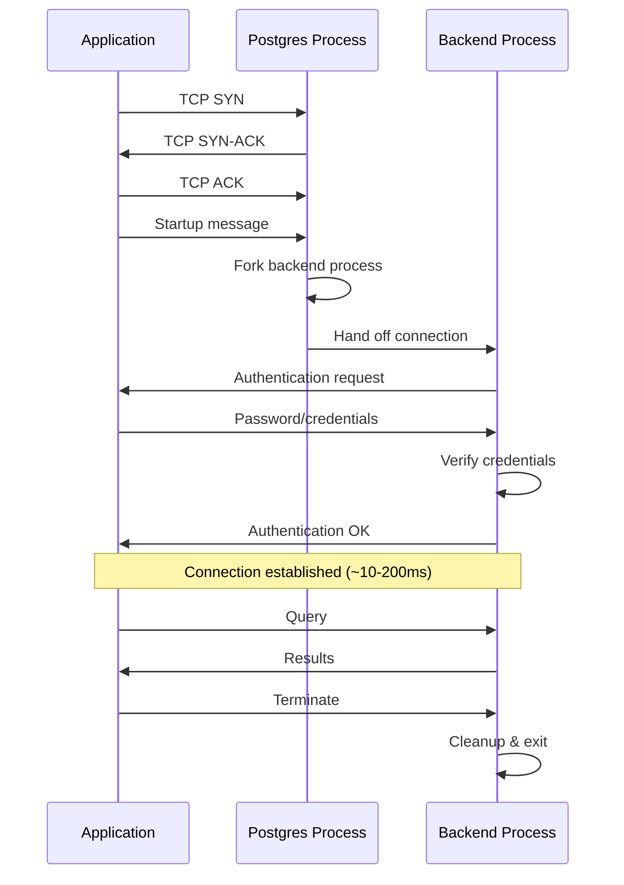
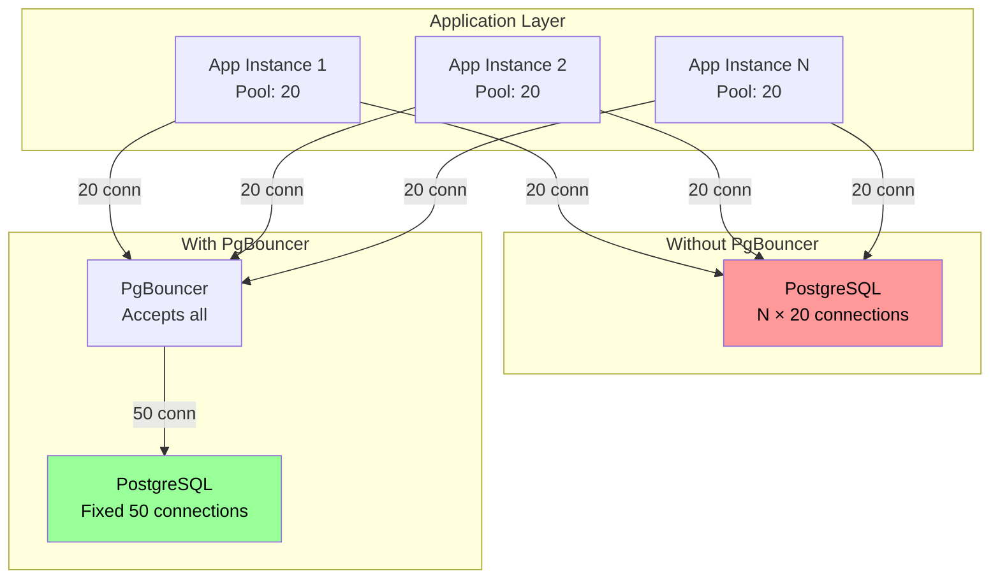
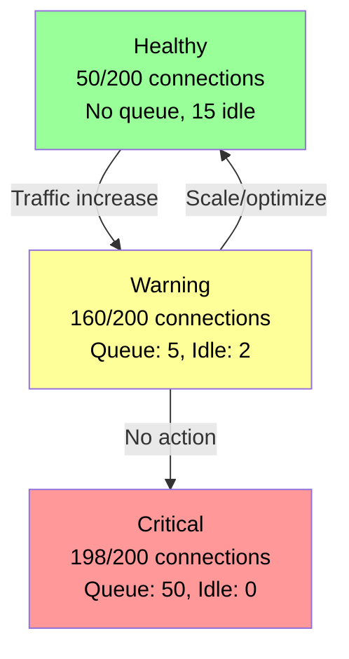

*[HPA]: Horizontal Pod Autoscaler
*[IOPS]: Input/Output Operations Per Second
*[K8s]: Kubernetes
*[OOM]: Out of Memory
*[PgBouncer]: PostgreSQL Connection Pooler
*[RDS]: Relational Database Service
*[SQL]: Structured Query Language
*[TCP]: Transmission Control Protocol
*[TLS]: Transport Layer Security

Every PostgreSQL connection costs memory—roughly 5-10MB per connection—and requires a dedicated backend process. A database configured for 200 max connections isn't "safe at 199." It's already under strain well before hitting that limit. Connection management isn't about avoiding hard limits; it's about understanding the soft degradation that happens as connections accumulate. Connection exhaustion doesn't announce itself with a clean error. It manifests as slow queries, timeouts, and cascading failures across your application tier.

I've seen this pattern repeatedly: a team runs PostgreSQL with `max_connections=200`, comfortable at typical usage of 50. Traffic spikes, instances autoscale from 5 to 20, each with a pool of 20. Four hundred connections hit a 200 limit. Rejections cascade—threads block, health checks fail, more scaling triggers more connection requests.

After adding PgBouncer, properly sizing pools, and implementing connection backpressure, the next traffic spike looks different. Database connections stay at 200. The application queues requests appropriately. Latency increases, but nothing fails. The lesson: connection limits aren't about capacity—they're about graceful degradation.

<Callout type="warning">
The most common PostgreSQL scaling mistake: configuring max_connections high "just in case." Each connection costs memory and CPU. A database with 1000 max_connections will perform worse than one with 200—even at the same actual connection count—because of reservation overhead.
</Callout>

## Connection Fundamentals

### How PostgreSQL Handles Connections

PostgreSQL uses a process-per-connection model. When a client connects, the main __postgres process__ (the server daemon) forks a new __backend process__ dedicated to that client. Each backend handles all queries for its __connection__ (the TCP session between client and backend) until termination. In `pg_stat_activity`, these appear as rows with `backend_type = 'client backend'`. The fork-based model provides strong isolation—a crash in one backend doesn't affect others—but it comes with overhead.

Establishing a new connection involves multiple steps: TCP handshake (1ms locally, 10-100ms over network), process fork (1-5ms), authentication (1-10ms depending on method), and TLS handshake if configured (5-50ms). Total: 10-200ms for a new connection. For web applications making dozens of queries per request, creating a fresh connection each time is prohibitively expensive.

Each backend process consumes resources independent of whether it's actively running queries. The base memory footprint is roughly 5-10MB per connection, plus `work_mem` allocation when executing operations (4MB default, but can be much higher for complex queries). CPU overhead comes from OS scheduler contention—more backend processes means more context switching as the kernel cycles between them, even when most are idle.



Figure: Connection establishment sequence.

The `max_connections` setting determines how many backend processes can exist simultaneously. The conventional wisdom is to set it high "for safety," but this backfires. A database configured for 1000 connections reserves memory for 1000 potential backends even when only 50 are connected. The rule of thumb for bare metal: `max_connections = (CPU cores × 2) + effective_spindle_count`[^spindle]. For SSDs, `CPU cores × 4` works, but staying conservative (50-100) with a connection pooler is usually better.

[^spindle]: Effective spindle count represents the hardware's capacity for concurrent I/O requests. A traditional HDD has one spindle and can usually only handle one I/O request at a time. For modern SSD-based storage, this metric is often considered 0 or ignored in the original formula. Because SSDs handle many parallel I/O requests, some modern benchmarks suggest using I/O queue depth as a more relevant replacement.

| max_connections | Use Case | Memory Overhead | Notes |
|-----------------|----------|-----------------|-------|
| 50-100 | Small deployments with pooler | ~500MB-1GB | Recommended baseline |
| 100-300 | Medium deployments | ~1-3GB | Watch for contention |
| 500-1000 | Large deployments | ~5-10GB | Usually wrong; use pooler instead |

Table: max_connections settings and their implications.

### Connection Costs

Understanding where your connections come from—and what state they're in—is critical for diagnosing saturation. The `pg_stat_activity` view shows all current connections with their state, user, application, and current query.

```sql title="connection-monitoring.sql"
-- Current connection count by state
SELECT
    state,
    count(*) as connections,
    round(100.0 * count(*) / sum(count(*)) over(), 1) as percentage
FROM pg_stat_activity
WHERE backend_type = 'client backend'
GROUP BY state
ORDER BY connections DESC;

-- Connection count by application/user
SELECT
    usename,
    application_name,
    client_addr,
    count(*) as connections,
    count(*) FILTER (WHERE state = 'active') as active,
    count(*) FILTER (WHERE state = 'idle') as idle,
    count(*) FILTER (WHERE state = 'idle in transaction') as idle_in_txn
FROM pg_stat_activity
WHERE backend_type = 'client backend'
GROUP BY usename, application_name, client_addr
ORDER BY connections DESC;

-- Memory usage estimate (rough)
SELECT
    count(*) as total_connections,
    count(*) * 10 as estimated_memory_mb,
    current_setting('max_connections')::int as max_connections,
    round(100.0 * count(*) / current_setting('max_connections')::int, 1) as utilization_pct
FROM pg_stat_activity
WHERE backend_type = 'client backend';
```

Code: Connection monitoring queries for PostgreSQL.

Connection state tells you what each backend is doing. Most connections in a healthy pooled application should be `idle`—waiting for the next query. `Active` connections are executing queries; a high percentage of active connections indicates either long-running queries or genuine load.

| Connection State | Description | Concern Level |
|------------------|-------------|---------------|
| active | Executing query | Normal if short |
| idle | Waiting for query | Normal (pooled) |
| idle in transaction | Transaction open, no query | High (blocks vacuum) |
| idle in transaction (aborted) | Failed transaction, not rolled back | Critical |

Table: Connection states and their implications.

"Idle in transaction" connections deserve special attention: they hold locks, prevent vacuum from cleaning up dead tuples, and consume connection slots. Set `idle_in_transaction_session_timeout` to kill them automatically.

## Connection Pooling

### Pooling Architectures

Connection pooling comes in two flavors: application-side pools and external poolers. Both solve the same problem—avoiding the overhead of creating new connections—but they scale differently.

__Application-side pools__ live within your application process. HikariCP (Java), node-postgres pool, SQLAlchemy (Python), and Go's `database/sql` all provide built-in pooling. The advantage is simplicity: no additional infrastructure, per-application configuration, and full support for prepared statements. The disadvantage is that scaling your application scales your connection count. Five application instances with pools of 20 connections each means 100 database connections. Twenty instances means 400. This couples your horizontal scaling to your database connection limits.

__External poolers__ sit between applications and the database as dedicated services. PgBouncer, Pgpool-II, and AWS RDS Proxy all work this way. The key benefit is connection multiplexing—many application connections can share fewer database connections. Your application can scale to 100 instances while the database sees a fixed 50 connections. The tradeoff is additional infrastructure and a potential single point of failure (mitigated by running multiple pooler instances).

__Managed database services__ often provide built-in pooling. AWS RDS Proxy, Azure Database for PostgreSQL Flexible Server (with PgBouncer), and Google Cloud SQL don't offer native pooling but work well with Cloud SQL Auth Proxy for connection management. If you're on a managed platform, check whether pooling is available before deploying your own PgBouncer—the managed option is usually simpler to operate.

| Approach | Examples | Best For | Connection Scaling |
|----------|----------|----------|--------------------|
| Application-side | HikariCP, pg-pool, SQLAlchemy | Single app, prepared statements | instances × pool_size |
| External pooler | PgBouncer, RDS Proxy | Multi-app, auto-scaling | Fixed, independent of apps |

Table: Pooling approaches compared.

External poolers support different __pooling modes__ that determine when connections are returned to the pool:

- __Session mode__: Client gets a dedicated server connection for its entire session. No multiplexing benefit, but full prepared statement support. Use for long-running sessions or heavy prepared statement workloads.
- __Transaction mode__: Connection returned after each transaction completes. High multiplexing, works for most web applications. Prepared statements work only with server-side preparation.
- __Statement mode__: Connection returned after each statement. Maximum multiplexing but no multi-statement transactions. Use only for simple, stateless read workloads.



Figure: PgBouncer connection multiplexing—application scaling decoupled from database connections.

### PgBouncer Configuration

PgBouncer configuration lives in `pgbouncer.ini`. The critical settings control connection limits, pooling behavior, and timeouts.

```ini title="pgbouncer.ini"
[databases]
myapp = host=postgres.internal port=5432 dbname=myapp

[pgbouncer]
; Connection limits
max_client_conn = 1000        ; Max client connections PgBouncer accepts
default_pool_size = 20        ; Server connections per pool (user+db combo)
min_pool_size = 5             ; Keep this many connections warm
reserve_pool_size = 5         ; Extra connections for burst handling
reserve_pool_timeout = 3      ; Seconds to wait before using reserve pool

; Pooling mode
pool_mode = transaction       ; session | transaction | statement

; Timeouts
server_idle_timeout = 600     ; Close idle server connections after 10 min
query_wait_timeout = 120      ; Max seconds client waits for connection
server_lifetime = 3600        ; Recycle connections after 1 hour

; Health checks
server_check_delay = 30
server_check_query = SELECT 1

; Admin interface
listen_addr = 0.0.0.0
listen_port = 6432
admin_users = pgbouncer_admin
```

Code: PgBouncer configuration for a typical web application.

__Pool sizing__ follows a simple formula: `default_pool_size = PostgreSQL max_connections / number_of_pools`. If PostgreSQL allows 100 connections and you have 5 user+database combinations (pools), each pool gets 20 connections. The `reserve_pool` handles burst traffic—set it to 10-25% of `default_pool_size`.

__max_client_conn__ determines how many application connections PgBouncer accepts. This can be much higher than PostgreSQL's `max_connections` because PgBouncer queues requests when all server connections are busy. Set this based on peak concurrent application connections with headroom for spikes.

| Scenario | max_client_conn | default_pool_size | PostgreSQL max_connections |
|----------|-----------------|-------------------|----------------------------|
| Small web app (5 instances) | 200 | 15 | 100 |
| Medium service (20 instances) | 500 | 25 | 200 |
| High scale (100+ instances) | 2000 | 50 | 400 |

Table: PgBouncer sizing by deployment scale.

## Pool Sizing

### Sizing Calculations

Pool sizing isn't guesswork—it's queuing theory. Little's Law provides the foundation: $L = \lambda \times W$, where $L$ is the average number of connections in use, $\lambda$ is the request arrival rate (queries per second), and $W$ is the average time per query.

If your application handles 100 queries per second with an average query time of 50ms, you need $100 \times 0.05 = 5$ connections on average. But Little's Law uses averages, and averages deceive. Query times vary. Traffic spikes. A pool sized for average load will saturate during peaks.

This is why the practical formula substitutes P99 query time for average: you want enough connections to handle 99% of queries without queueing, not just the typical case. Then double for variance and add burst capacity.

The practical formula for application pool sizing:

```
pool_size = ceil(peak_qps × p99_query_time × burst_factor)
```

For an application instance handling 50 queries per second at peak, with P99 query time of 100ms and a 2× burst factor: `ceil(50 × 0.1 × 2) = 10` connections per instance.

| Factor | What to Measure | Impact |
|--------|-----------------|--------|
| Query duration | P99 latency, not average | Longer queries need more connections |
| Request rate | Peak QPS, not average | Higher rate needs more connections |
| Variance | Standard deviation / mean | High variance needs more headroom |
| Burst factor | Peak / baseline ratio | Typically 2-3× for web traffic |

Table: Pool sizing factors.

__Common anti-patterns__ undermine even correct calculations:

- __Oversized pools__: Setting `pool_size = 100` "just in case" means 10 instances create 1000 connections. Size based on actual need.
- __No max lifetime__: Connections held forever accumulate memory leaks and stale state. Recycle every 30 minutes.
- __No idle timeout__: Idle connections waste resources and hide leaks. Timeout after 10 minutes of inactivity.

### Application Pool Configuration

Application-side pools need careful configuration. The pool library handles connection reuse, but you control the parameters that determine behavior under load.

```typescript title="nodejs-pool-config.ts"
import { Pool, PoolConfig } from 'pg'

const poolConfig: PoolConfig = {
  host: process.env.DB_HOST,
  port: parseInt(process.env.DB_PORT || '5432'),
  database: process.env.DB_NAME,
  user: process.env.DB_USER,
  password: process.env.DB_PASSWORD,

  // Pool sizing: peak_qps × p99_latency × burst_factor
  max: 20,
  min: 5,  // Keep pool warm

  // Timeouts
  connectionTimeoutMillis: 10000,  // Fail fast if pool exhausted
  idleTimeoutMillis: 30000,        // Reclaim idle connections
  // Note: pg-pool lacks maxLifetime; implement connection recycling
  // manually if needed (track connection age, close after 30min)

  // SSL for production
  ssl: process.env.NODE_ENV === 'production' ? {
    rejectUnauthorized: true,
    ca: process.env.DB_CA_CERT,
  } : false,
}

const pool = new Pool(poolConfig)

// Set statement timeout on new connections
pool.on('connect', (client) => {
  client.query('SET statement_timeout = 30000')
})

// Expose metrics for monitoring
function collectPoolMetrics() {
  return {
    total: pool.totalCount,
    idle: pool.idleCount,
    waiting: pool.waitingCount,
    utilization: pool.totalCount > 0
      ? (pool.totalCount - pool.idleCount) / pool.totalCount
      : 0,
  }
}

export { pool, collectPoolMetrics }
```

Code: Node.js pg-pool configuration with monitoring.

For Java applications, HikariCP is the standard choice. It's fast, well-maintained, and provides excellent metrics out of the box.

```java title="HikariPoolConfig.java"
import com.zaxxer.hikari.HikariConfig;
import com.zaxxer.hikari.HikariDataSource;

public class DatabaseConfig {
    public static HikariDataSource createDataSource() {
        HikariConfig config = new HikariConfig();

        config.setJdbcUrl("jdbc:postgresql://localhost:5432/mydb");
        config.setUsername(System.getenv("DB_USER"));
        config.setPassword(System.getenv("DB_PASSWORD"));

        // Pool sizing
        config.setMaximumPoolSize(20);
        config.setMinimumIdle(10);

        // Timeouts
        config.setConnectionTimeout(10000);   // 10s to acquire connection
        config.setIdleTimeout(600000);        // 10min idle before removal
        config.setMaxLifetime(1800000);       // 30min max connection age

        // Validation
        config.setConnectionTestQuery("SELECT 1");
        config.setKeepaliveTime(300000);      // 5min keepalive

        // Leak detection
        config.setLeakDetectionThreshold(60000);  // Warn if held > 1min

        // Statement timeout
        config.addDataSourceProperty("options", "-c statement_timeout=30000");

        return new HikariDataSource(config);
    }
}
```

Code: HikariCP configuration for PostgreSQL.

Regardless of language or pool library, the same principles apply. These settings represent battle-tested defaults that work for most applications:

| Setting | Recommended Value | Rationale |
|---------|-------------------|-----------|
| max_pool_size | 10-30 per instance | Based on Little's Law calculation |
| min_pool_size | 50% of max | Keep pool warm, reduce latency |
| connection_timeout | 10s | Fail fast if pool exhausted |
| idle_timeout | 10-30 min | Reclaim unused connections |
| max_lifetime | 30 min | Prevent stale connections |
| leak_detection | 1-5 min | Catch unreturned connections |

Table: Pool configuration guidelines.

<Callout type="warning">
Never set pool max_size to PostgreSQL max_connections. Leave headroom for admin connections, monitoring, migrations, and other applications. A good rule: application pools should use at most 80% of max_connections.
</Callout>

With pools configured, the next question is: how do you know if they're working? Proper sizing is only half the battle—you need visibility into whether your pools have headroom or are approaching saturation.

## Saturation Signals

### Metrics to Monitor

Connection saturation doesn't announce itself with a single metric. It's a constellation of signals that, together, tell you whether your system has headroom or is approaching collapse. The goal is catching saturation early—before "too many connections" errors appear in logs.

__Connection utilization__ is the primary signal. Query `pg_stat_activity` to compare current connections against `max_connections`. Alert at 70% utilization, investigate at 85%. By 95%, you're one slow query away from exhaustion.

```sql title="connection-utilization.sql"
SELECT
  count(*) AS current_connections,
  current_setting('max_connections')::int AS max_connections,
  round(100.0 * count(*) / current_setting('max_connections')::int, 1) AS utilization_pct
FROM pg_stat_activity
WHERE backend_type = 'client backend';
```

Code: Connection utilization query.

__Pool wait time__ measures how long requests wait for an available connection from the application pool. This metric comes from your pool library (HikariCP, pg-pool), not PostgreSQL. P99 wait time above 100ms indicates the pool is undersized; above 1 second means requests are timing out.

__Queue depth__ counts requests waiting for connections. In PgBouncer, check `cl_waiting`. In application pools, check `waitingCount` or equivalent. Any sustained queue indicates saturation—the pool can't keep up with demand.

__Idle in transaction__ connections are the silent killers. They hold connections hostage without doing work. Query for sessions stuck in this state for more than a minute—these are usually application bugs (missing commits, unclosed transactions in error paths).

```sql title="idle-in-transaction.sql"
SELECT pid, usename, application_name, state, query,
  now() - state_change AS idle_duration
FROM pg_stat_activity
WHERE state = 'idle in transaction'
  AND (now() - state_change) > interval '1 minute'
ORDER BY idle_duration DESC;
```

Code: Find idle-in-transaction sessions.

Each metric has different thresholds for when to pay attention versus when to wake someone up at 3am. These thresholds are starting points—adjust based on your application's tolerance for latency and your database's capacity:

| Metric | Warning Threshold | Critical Threshold | Response |
|--------|-------------------|--------------------|-----------|
| Connection utilization | > 70% | > 85% | Add pooler or reduce pool sizes |
| Pool wait time (P99) | > 100ms | > 1s | Increase pool size or optimize queries |
| Queue depth | > 10 | > 50 | Pool undersized or query bottleneck |
| Idle in transaction | > 5 connections | > 20 connections | Find and fix leaking transactions |
| Connection errors | Any occurrence | Sustained errors | Immediate investigation |

Table: Saturation metric thresholds.

For PgBouncer deployments, the `SHOW POOLS` command exposes additional metrics. Watch `cl_waiting` (clients waiting for server connections), `sv_idle` (available server connections—zero means exhaustion), and `maxwait` (longest current wait time in seconds).

### Monitoring Dashboard

During incidents, I need quick answers: Are connections the bottleneck? Are they being recycled? Is something blocking?

The __connection snapshot query__ (see Reference Queries) gives a real-time breakdown of connection states and utilization—run this first during any database performance investigation.

__Connection age distribution__ reveals recycling problems. If you see connections older than your `max_lifetime` setting (or hours/days old when you expect minutes), you have a leak or misconfiguration.

__Lock blocking analysis__ identifies chains where one query holds locks that others are waiting for. When connections pile up, contention is often the culprit.

The progression from healthy to critical follows a predictable pattern:



Figure: Connection saturation progression.

## Failure Patterns

### Connection Exhaustion Cascade

Connection exhaustion rarely happens in isolation. It cascades. Understanding the stages helps you recognize where you are in the failure progression and what interventions are still possible.

__Stage 1: Saturation__ begins with a traffic spike or slow queries. Pool utilization climbs. Connection wait times increase. Query latencies creep up. This stage can last minutes to hours, giving you time to respond if you're watching the right metrics.

__Stage 2: Queueing__ starts when the pool is fully utilized. Requests begin queuing for connections. Request latencies spike. Timeout errors appear sporadically. This stage lasts seconds to minutes—your window for intervention is shrinking.

__Stage 3: Timeouts__ hit when the queue exceeds timeout thresholds. Connection timeout errors multiply. Transactions abort mid-flight. Users see errors. The system is now visibly failing.

__Stage 4: Cascade__ is where things get worse before they get better. Applications retry failed requests, compounding the problem. Retry storms create more connection demand. Health checks fail. Kubernetes kills and restarts pods, which then all try to establish connections simultaneously. The problem feeds itself.

__Stage 5: Collapse__ means complete unavailability. The database refuses all new connections. Recovery requires manual intervention:

1. __Stop the bleeding__: Scale application instances to zero or block traffic at the load balancer. This stops new connection attempts.
2. __Clear stuck connections__: On PostgreSQL, run `SELECT pg_terminate_backend(pid) FROM pg_stat_activity WHERE state = 'idle in transaction' AND state_change < now() - interval '5 minutes';` to kill stuck sessions.
3. __Restart applications gradually__: Bring up one instance, verify it connects and serves traffic, then add more. Don't start all instances simultaneously—they'll all try to fill their pools at once.
4. __Monitor during recovery__: Watch `pg_stat_activity` connection count as you add instances. Stop scaling if you approach 80% utilization.

Prevention requires defense at multiple layers:

- __Connection limits__: Set maximums at application pools, PgBouncer, and PostgreSQL. The principle is "fail fast at the application, not the database."
- __Circuit breakers__: Detect saturation and return fast errors instead of queueing. Let the system recover.
- __Backpressure__: Rate limit at the ingress. Use bounded queues. Shed load during saturation.
- __Graceful degradation__: Disable non-critical features under stress. Serve cached responses. Return partial results.

### Recovery Strategies

When saturation hits, you need patterns that prevent cascade failures. These aren't theoretical—they're the difference between a slow day and a multi-hour outage.

__Circuit breakers__ stop the bleeding. When connection errors exceed a threshold, the circuit "opens" and immediately rejects requests instead of queuing them. This gives the database breathing room to recover. After a timeout, the circuit enters a "half-open" state, allowing a few requests through to test whether the database has recovered.

Circuit breakers for database connections live in your application code, wrapping the connection pool. They're not implemented in PgBouncer (which has no circuit breaker concept) or at the ingress controller (which operates at HTTP level, not database protocol). The application is the right place because it understands the difference between a transient connection timeout and a sustained outage.

The essential logic: track consecutive failures, "open" the circuit after a threshold, reject requests immediately while open, then periodically test with a single request to see if the database has recovered.

```typescript title="circuit-breaker-usage.ts"
// Circuit breaker wraps the pool, not individual queries
const breaker = new DatabaseCircuitBreaker({ threshold: 5, timeout: 30000 })
const pool = new Pool(poolConfig)

// All database access goes through the breaker
async function getUser(id: string) {
  return breaker.query(pool, 'SELECT * FROM users WHERE id = $1', [id])
}
```

Code: Circuit breaker usage pattern - [Full implementation](https://gist.github.com/webstackdev/b74864012c98b410435dc0aabf1f5a75).

__Retry budgets__ prevent retry storms. Instead of retrying every failed request, track the ratio of retries to total requests. When retries exceed 20% of traffic, stop retrying—you're making things worse. Wire the retry budget into your circuit breaker:

```typescript title="retry-with-budget.ts"
const budget = new RetryBudget({ windowMs: 60000, maxRetryRatio: 0.2 })

async function queryWithRetry<T>(sql: string, params?: unknown[]): Promise<T> {
  budget.recordRequest()
  try {
    return await breaker.query<T>(pool, sql, params)
  } catch (error) {
    if (budget.canRetry() && isRetryable(error)) {
      budget.recordRetry()
      return breaker.query<T>(pool, sql, params)  // Single retry attempt
    }
    throw error
  }
}
```

Code: Integrating retry budget with circuit breaker.

Each failure scenario has a different detection method and response. The key is matching the response to the root cause:

| Scenario | Detection | Response | Recovery |
|----------|-----------|----------|----------|
| Slow queries | Wait time > threshold | Add query timeout | Optimize queries |
| Connection leak | Idle-in-txn > limit | Kill sessions | Fix application code |
| Traffic spike | Utilization > 80% | Shed load | Scale or add pooler |
| Database overload | Connection errors | Circuit break | Scale database |

Table: Failure scenarios and responses.

## Conclusion

PostgreSQL connection management is a critical but often neglected aspect of application architecture. Most teams don't think about it until 3am when the database stops accepting connections.

The key insights from this article:

__Connections are expensive.__ Each connection costs 5-10MB of memory, consumes CPU through context switching, and competes for shared resources. The counterintuitive truth: fewer connections often means better performance. Keep `max_connections` low and use pooling.

__Pooling decouples application scaling from database limits.__ PgBouncer (or similar external poolers) lets you scale application instances without proportionally increasing database connections. Transaction pooling mode handles most workloads well.

__Size pools with math, not intuition.__ Little's Law ($L = \lambda \times W$) gives you a starting point. Account for variance with a burst factor. Anti-patterns like oversized pools ("just in case") create more problems than they solve.

__Monitor saturation, not just errors.__ By the time you see "too many connections" errors, you're already in a cascade. Set alerts on the utilization thresholds discussed earlier. Watch for idle-in-transaction sessions—they're connection leaks waiting to bite you.

__Design for graceful degradation.__ Circuit breakers, retry budgets, and backpressure turn connection exhaustion from a hard failure into a soft degradation. Build these patterns before you need them.

The goal isn't to handle unlimited connections—it's to handle connection constraints gracefully, so saturation causes slowdowns, not outages.

<Callout type="info">
Connection management is about building slack into the system. A database running at 90% connection capacity has no room for variance, spikes, or slow queries. Target 50-70% utilization to leave room for reality to differ from expectations.
</Callout>

## Reference Queries

These SQL queries are useful for monitoring and debugging PostgreSQL connection issues. Run them against your database during incidents or as part of regular health checks.

### Connection Snapshot

Real-time breakdown of connection states and utilization:

```sql title="connection-snapshot.sql"
SELECT
  count(*) AS total_connections,
  count(*) FILTER (WHERE state = 'active') AS active,
  count(*) FILTER (WHERE state = 'idle') AS idle,
  count(*) FILTER (WHERE state = 'idle in transaction') AS idle_in_txn,
  current_setting('max_connections')::int AS max_conn,
  round(100.0 * count(*) / current_setting('max_connections')::int, 1) AS utilization_pct
FROM pg_stat_activity
WHERE backend_type = 'client backend';
```

Code: Connection snapshot query.

### Connection Age Distribution

Identifies connections that aren't being recycled:

```sql title="connection-age-distribution.sql"
SELECT
  CASE
    WHEN age < interval '1 minute' THEN '< 1 min'
    WHEN age < interval '10 minutes' THEN '1-10 min'
    WHEN age < interval '1 hour' THEN '10-60 min'
    WHEN age < interval '1 day' THEN '1-24 hours'
    ELSE '> 1 day'
  END AS age_bucket,
  count(*) AS connections
FROM (
  SELECT now() - backend_start AS age
  FROM pg_stat_activity
  WHERE backend_type = 'client backend'
) ages
GROUP BY 1
ORDER BY min(age);
```

Code: Connection age distribution query.

### Lock Blocking Analysis

Finds queries blocking other queries:

```sql title="blocking-analysis.sql"
WITH blocked AS (
  SELECT
    blocked.pid AS blocked_pid,
    blocked.query AS blocked_query,
    blocking.pid AS blocking_pid,
    blocking.query AS blocking_query,
    now() - blocked.state_change AS blocked_duration
  FROM pg_stat_activity blocked
  JOIN pg_locks blocked_locks ON blocked.pid = blocked_locks.pid
  JOIN pg_locks blocking_locks
    ON blocked_locks.locktype = blocking_locks.locktype
    AND blocked_locks.database IS NOT DISTINCT FROM blocking_locks.database
    AND blocked_locks.relation IS NOT DISTINCT FROM blocking_locks.relation
    AND blocked_locks.pid != blocking_locks.pid
  JOIN pg_stat_activity blocking ON blocking_locks.pid = blocking.pid
  WHERE NOT blocked_locks.granted
)
SELECT * FROM blocked
WHERE blocked_duration > interval '10 seconds'
ORDER BY blocked_duration DESC;
```

Code: Lock blocking analysis query.

### Kill Stuck Sessions

Emergency cleanup of idle-in-transaction sessions (use with caution):

```sql title="kill-stuck-sessions.sql"
SELECT pg_terminate_backend(pid)
FROM pg_stat_activity
WHERE state = 'idle in transaction'
  AND state_change < now() - interval '5 minutes';
```

Code: Kill idle-in-transaction sessions older than 5 minutes.
