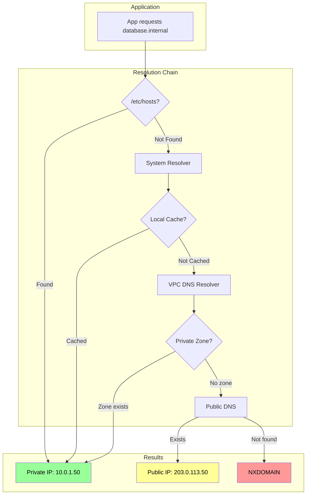
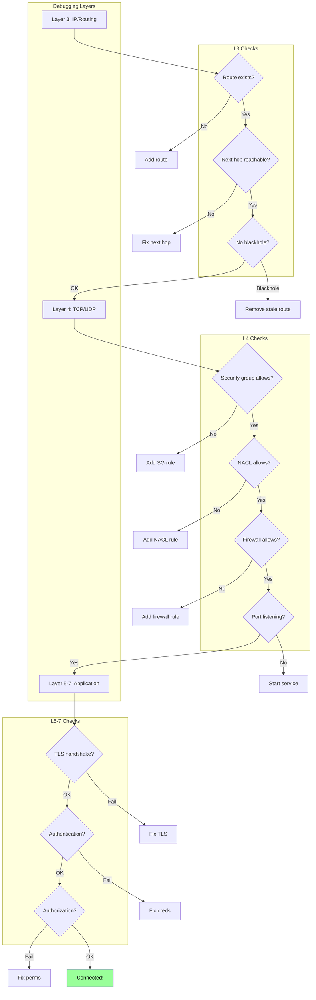
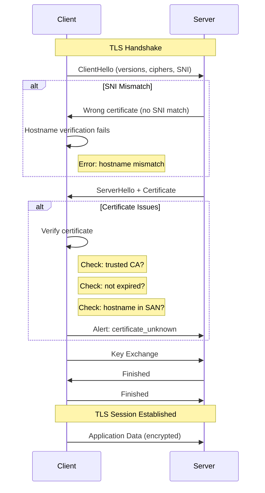
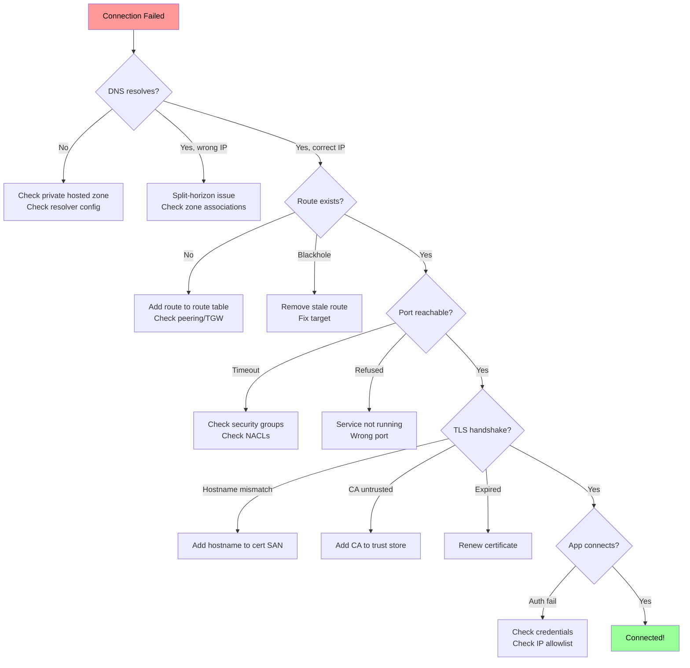

*[DNS]: Domain Name System
*[TLS]: Transport Layer Security
*[VPC]: Virtual Private Cloud
*[VPN]: Virtual Private Network
*[MTU]: Maximum Transmission Unit
*[NAT]: Network Address Translation
*[CIDR]: Classless Inter-Domain Routing
*[BGP]: Border Gateway Protocol
*[SNI]: Server Name Indication
*[CA]: Certificate Authority
*[ICMP]: Internet Control Message Protocol
*[TCP]: Transmission Control Protocol
*[UDP]: User Datagram Protocol
*[TTL]: Time To Live
*[ARP]: Address Resolution Protocol

# Private Networking: DNS, Routing, and TLS Failures

## Introduction

Frame the private networking challenge: organizations move workloads to private networks for security—no public IPs, no internet exposure, traffic stays within cloud provider boundaries. But private networking introduces failure modes that don't exist with public connectivity. DNS resolution that worked over the internet fails with private endpoints. Routing that seemed automatic now requires explicit configuration. TLS certificates that validated fine publicly get rejected privately. This section establishes that private networking isn't "the same thing, but internal"—it's a fundamentally different debugging domain where familiar tools give unfamiliar results and "connection refused" could mean ten different things.

_Include a scenario: a team migrates their database from a publicly-accessible managed service to a private endpoint. Application immediately fails with "connection refused." They verify the endpoint URL is correct. DNS resolves... but to a different IP than expected. The IP is in the private subnet range but their VPC can't route to it. They add a route, now they can reach the IP but get "connection reset." TLS handshake fails because the certificate's SAN doesn't include the private DNS name. They add the DNS name to the certificate, now handshake succeeds but authentication fails—the database sees connections from an unexpected IP. Each layer had its own failure, each masked by generic errors. They build a debugging playbook: DNS → routing → connectivity → TLS → application. Next migration takes 30 minutes instead of 3 days._

<Callout type="warning">
Private networking failures cascade and hide. A DNS failure looks like a routing failure. A routing failure looks like a firewall block. A TLS failure looks like a connection reset. Debug systematically from layer 3 up, not from error messages down.
</Callout>

## Private DNS

### DNS Resolution Architecture

```yaml title="private-dns-architecture.yaml"
# Private DNS resolution patterns

dns_resolution_order:
  standard_linux:
    1: "/etc/hosts file"
    2: "Local DNS cache (if enabled)"
    3: "Resolver from /etc/resolv.conf"
    4: "Recursive resolution through nameserver"

  cloud_vms:
    aws:
      resolver: "VPC DNS resolver (VPC CIDR + 2)"
      example: "10.0.0.2 for VPC 10.0.0.0/16"
      behavior:
        - "Resolves Route 53 private hosted zones"
        - "Falls back to public DNS for external"
        - "Can be customized via DHCP option sets"
    gcp:
      resolver: "169.254.169.254 (metadata server)"
      behavior:
        - "Resolves Cloud DNS private zones"
        - "Automatic forwarding to public DNS"
    azure:
      resolver: "168.63.129.16 (Azure DNS)"
      behavior:
        - "Resolves Azure Private DNS zones"
        - "Handles Private Link DNS integration"

  kubernetes:
    resolver: "CoreDNS / kube-dns"
    search_domains:
      - "<namespace>.svc.cluster.local"
      - "svc.cluster.local"
      - "cluster.local"
    behavior:
      - "Pod DNS resolves cluster services first"
      - "Then forwards to node DNS"
      - "ndots setting affects resolution order"

---
# Private DNS failure modes
failure_modes:
  wrong_resolver:
    symptom: "DNS resolves to public IP instead of private"
    cause: "Using public DNS (8.8.8.8) instead of VPC DNS"
    fix: "Use VPC-provided resolver"

  missing_private_zone:
    symptom: "DNS NXDOMAIN for private endpoint"
    cause: "Private hosted zone not associated with VPC"
    fix: "Associate zone with VPC"

  split_horizon_confusion:
    symptom: "Same name resolves differently from different locations"
    cause: "Split-horizon DNS (public vs private zones)"
    debug: "Compare dig from inside vs outside VPC"

  stale_cache:
    symptom: "Old IP returned after endpoint change"
    cause: "DNS caching with high TTL"
    fix: "Flush cache, reduce TTL before changes"

  search_domain_issues:
    symptom: "Short names don't resolve"
    cause: "Missing or wrong search domain in resolv.conf"
    debug: "Try FQDN vs short name"
```
Code: Private DNS architecture.

```bash title="dns-debugging.sh"
#!/bin/bash
# Private DNS debugging toolkit

# === Basic resolution tests ===
echo "=== DNS Resolution Debugging ==="

TARGET="${1:-database.internal}"

# Check /etc/resolv.conf
echo -e "\n--- Resolver Configuration ---"
cat /etc/resolv.conf

# Test resolution with different tools
echo -e "\n--- Resolution Tests ---"

# getent uses system resolver (respects nsswitch.conf)
echo "getent hosts $TARGET:"
getent hosts "$TARGET"

# dig uses DNS directly (bypasses /etc/hosts)
echo -e "\ndig $TARGET:"
dig +short "$TARGET"

# dig with specific resolver (VPC DNS)
echo -e "\ndig @169.254.169.253 $TARGET (AWS VPC resolver):"
dig +short "@169.254.169.253" "$TARGET" 2>/dev/null || echo "Not AWS or resolver unavailable"

# Compare with public DNS
echo -e "\ndig @8.8.8.8 $TARGET (public DNS):"
dig +short "@8.8.8.8" "$TARGET" 2>/dev/null || echo "Public DNS resolution failed"

# === Detailed resolution trace ===
echo -e "\n--- Resolution Details ---"
dig "$TARGET" +noall +answer +comments

# Check for split-horizon
echo -e "\n--- Split Horizon Check ---"
PRIVATE_IP=$(dig +short "@169.254.169.253" "$TARGET" 2>/dev/null)
PUBLIC_IP=$(dig +short "@8.8.8.8" "$TARGET" 2>/dev/null)
echo "Private resolver: $PRIVATE_IP"
echo "Public resolver: $PUBLIC_IP"
if [ "$PRIVATE_IP" != "$PUBLIC_IP" ]; then
    echo "WARNING: Split-horizon DNS detected!"
fi

# === Kubernetes-specific ===
if [ -f /var/run/secrets/kubernetes.io/serviceaccount/namespace ]; then
    echo -e "\n--- Kubernetes DNS Debug ---"
    NAMESPACE=$(cat /var/run/secrets/kubernetes.io/serviceaccount/namespace)
    echo "Current namespace: $NAMESPACE"
    echo "Search domains:"
    grep search /etc/resolv.conf

    # Test service resolution
    echo -e "\nTesting service name variations:"
    for suffix in "" ".${NAMESPACE}" ".${NAMESPACE}.svc" ".${NAMESPACE}.svc.cluster.local"; do
        RESOLVED=$(getent hosts "${TARGET}${suffix}" 2>/dev/null | awk '{print $1}')
        echo "  ${TARGET}${suffix} -> ${RESOLVED:-NXDOMAIN}"
    done
fi

# === DNS query trace ===
echo -e "\n--- Query Trace ---"
dig "$TARGET" +trace +nodnssec 2>/dev/null | tail -20
```
Code: DNS debugging script.


Figure: DNS resolution flow.

<Callout type="info">
When debugging DNS, always use `dig` with an explicit resolver to bypass caching and nsswitch.conf. Compare `dig @<vpc-resolver>` with `dig @8.8.8.8` to detect split-horizon issues.
</Callout>

### Private DNS Configuration

```yaml title="aws-private-dns.yaml"
# AWS Private DNS configuration

# Route 53 Private Hosted Zone
private_hosted_zone:
  name: "internal.example.com"
  vpc_associations:
    - vpc_id: "vpc-12345"
      region: "us-east-1"
    - vpc_id: "vpc-67890"
      region: "us-west-2"
  records:
    - name: "database.internal.example.com"
      type: "A"
      value: "10.0.1.50"
      ttl: 300
    - name: "api.internal.example.com"
      type: "CNAME"
      value: "internal-lb-12345.us-east-1.elb.amazonaws.com"
      ttl: 60

---
# VPC Endpoint DNS (Private Link)
vpc_endpoint:
  service: "com.amazonaws.us-east-1.s3"
  endpoint_type: "Interface"
  private_dns_enabled: true
  dns_behavior: |
    When private_dns_enabled=true:
    - Route 53 Resolver creates private hosted zone
    - s3.us-east-1.amazonaws.com resolves to endpoint IPs
    - Only works within associated VPCs

  gotchas:
    - "Private DNS requires enableDnsHostnames=true on VPC"
    - "Private DNS requires enableDnsSupport=true on VPC"
    - "Can conflict with existing private hosted zones"
    - "Cross-VPC resolution requires additional config"

---
# Route 53 Resolver (hybrid DNS)
resolver_endpoints:
  inbound:
    purpose: "On-prem DNS servers forward to AWS"
    ips: ["10.0.1.100", "10.0.2.100"]
    use_case: "On-prem systems resolve AWS private DNS"

  outbound:
    purpose: "AWS DNS forwards to on-prem"
    ips: ["10.0.1.101", "10.0.2.101"]
    rules:
      - domain: "corp.example.com"
        target: "192.168.1.10"  # On-prem DNS
      - domain: "legacy.internal"
        target: "192.168.1.10"
    use_case: "AWS workloads resolve on-prem DNS"

---
# Common configuration mistakes
mistakes:
  missing_vpc_association:
    symptom: "Private zone exists but NXDOMAIN in VPC"
    fix: "Associate hosted zone with VPC"

  conflicting_zones:
    symptom: "Wrong records returned"
    cause: "Multiple zones for same domain"
    fix: "Consolidate or namespace zones"

  wrong_resolver:
    symptom: "Private records not found"
    cause: "Custom DHCP options pointing to wrong DNS"
    fix: "Use VPC default or add forwarding"
```
Code: AWS private DNS configuration.

| DNS Pattern | Use Case | Configuration |
|-------------|----------|---------------|
| Private hosted zone | Internal service discovery | Route 53 zone + VPC association |
| VPC endpoint private DNS | AWS service private access | Enable on endpoint creation |
| Resolver inbound | On-prem → AWS resolution | Inbound endpoint + security group |
| Resolver outbound | AWS → on-prem resolution | Outbound endpoint + forwarding rules |
| Split-horizon | Same name, different audiences | Separate public/private zones |

Table: Private DNS patterns.

## Routing and Connectivity

### VPC Routing Fundamentals

```yaml title="vpc-routing.yaml"
# VPC routing fundamentals

route_table_anatomy:
  local_route:
    destination: "10.0.0.0/16"  # VPC CIDR
    target: "local"
    description: "Implicit, cannot be removed"
    behavior: "Traffic within VPC routed automatically"

  internet_gateway:
    destination: "0.0.0.0/0"
    target: "igw-12345"
    description: "Route to internet"
    requires: "Public IP or NAT"

  nat_gateway:
    destination: "0.0.0.0/0"
    target: "nat-12345"
    description: "Outbound internet from private subnets"
    note: "NAT gateway must be in public subnet"

  vpc_peering:
    destination: "172.16.0.0/16"  # Peer VPC CIDR
    target: "pcx-12345"
    description: "Route to peered VPC"
    requires: "Routes on both sides, no CIDR overlap"

  transit_gateway:
    destination: "10.0.0.0/8"  # Multiple VPCs
    target: "tgw-12345"
    description: "Hub for multi-VPC routing"

  vpc_endpoint:
    destination: "pl-12345"  # Prefix list (e.g., S3)
    target: "vpce-12345"
    description: "Route to VPC endpoint"

---
# Route selection
route_selection:
  principle: "Most specific route wins"
  example:
    routes:
      - "0.0.0.0/0 → igw-xxx (internet)"
      - "10.0.0.0/16 → local (VPC)"
      - "10.1.0.0/16 → pcx-xxx (peer VPC)"
      - "10.1.5.0/24 → tgw-xxx (specific subnet via TGW)"
    traffic_to: "10.1.5.100"
    selected: "10.1.5.0/24 → tgw-xxx (most specific)"

---
# Routing failure modes
routing_failures:
  no_route:
    symptom: "Timeout (no ICMP unreachable from cloud)"
    cause: "No route to destination"
    debug: "Check route table for subnet"

  asymmetric_routing:
    symptom: "Connection reset, packets dropped"
    cause: "Return path different from forward path"
    example: "Request via NAT, response direct (fails)"
    fix: "Ensure symmetric routing"

  blackhole_route:
    symptom: "Packets silently dropped"
    cause: "Route target deleted/unavailable"
    example: "Peering connection deleted, route remains"
    fix: "Remove stale routes"

  overlapping_cidrs:
    symptom: "Traffic goes to wrong destination"
    cause: "Multiple routes match, wrong one selected"
    fix: "Avoid CIDR overlaps across connected networks"
```
Code: VPC routing fundamentals.

### Connectivity Debugging

```bash title="connectivity-debugging.sh"
#!/bin/bash
# Network connectivity debugging toolkit

TARGET_HOST="${1:-10.0.1.50}"
TARGET_PORT="${2:-5432}"

echo "=== Connectivity Debug: $TARGET_HOST:$TARGET_PORT ==="

# === Layer 3: IP connectivity ===
echo -e "\n--- Layer 3: IP Connectivity ---"

# Ping (ICMP) - may be blocked
echo "Ping test (may be blocked by security groups):"
ping -c 3 -W 2 "$TARGET_HOST" 2>&1 | head -5

# Traceroute
echo -e "\nTraceroute:"
traceroute -n -w 2 -m 15 "$TARGET_HOST" 2>&1 | head -20

# === Layer 4: TCP connectivity ===
echo -e "\n--- Layer 4: TCP Connectivity ---"

# TCP connection test with timeout
echo "TCP connection test to port $TARGET_PORT:"
timeout 5 bash -c "echo >/dev/tcp/$TARGET_HOST/$TARGET_PORT" 2>&1 && \
    echo "SUCCESS: Port $TARGET_PORT is reachable" || \
    echo "FAILED: Port $TARGET_PORT is not reachable"

# Netcat test with timing
echo -e "\nNetcat connection test:"
nc -zv -w 5 "$TARGET_HOST" "$TARGET_PORT" 2>&1

# === MTU issues ===
echo -e "\n--- MTU Discovery ---"
# Find MTU (common issue with VPN/tunnels)
for size in 1500 1400 1300 1200; do
    if ping -c 1 -M do -s $((size - 28)) "$TARGET_HOST" >/dev/null 2>&1; then
        echo "MTU to $TARGET_HOST: at least $size bytes"
        break
    fi
done

# === Local routing ===
echo -e "\n--- Local Routing ---"
echo "Route to $TARGET_HOST:"
ip route get "$TARGET_HOST" 2>/dev/null || route -n get "$TARGET_HOST" 2>/dev/null

# === Security group / firewall check ===
echo -e "\n--- Port Scan (common ports) ---"
for port in 22 443 5432 6379 3306; do
    result=$(timeout 2 bash -c "echo >/dev/tcp/$TARGET_HOST/$port" 2>&1 && echo "open" || echo "closed")
    printf "Port %5d: %s\n" "$port" "$result"
done

# === DNS + connectivity combined ===
echo -e "\n--- Full Path Test ---"
if [[ "$TARGET_HOST" =~ ^[0-9]+\.[0-9]+\.[0-9]+\.[0-9]+$ ]]; then
    echo "Target is IP address, skipping DNS"
else
    RESOLVED_IP=$(getent hosts "$TARGET_HOST" | awk '{print $1}')
    echo "DNS resolved $TARGET_HOST to $RESOLVED_IP"
    echo "Testing connectivity to resolved IP:"
    nc -zv -w 5 "$RESOLVED_IP" "$TARGET_PORT" 2>&1
fi

# === Cloud metadata (AWS) ===
echo -e "\n--- Instance Network Info (AWS) ---"
if curl -s --connect-timeout 1 http://169.254.169.254/latest/meta-data/ >/dev/null 2>&1; then
    echo "VPC ID: $(curl -s http://169.254.169.254/latest/meta-data/network/interfaces/macs/$(curl -s http://169.254.169.254/latest/meta-data/mac)/vpc-id)"
    echo "Subnet ID: $(curl -s http://169.254.169.254/latest/meta-data/network/interfaces/macs/$(curl -s http://169.254.169.254/latest/meta-data/mac)/subnet-id)"
    echo "Private IP: $(curl -s http://169.254.169.254/latest/meta-data/local-ipv4)"
    echo "Security Groups: $(curl -s http://169.254.169.254/latest/meta-data/security-groups)"
fi
```
Code: Connectivity debugging script.


Figure: Layer-by-layer debugging flow.

<Callout type="danger">
Cloud networks often don't return ICMP unreachable for routing failures—packets just disappear. A timeout doesn't mean "firewall blocked"; it might mean "no route exists." Always verify routing before assuming security group issues.
</Callout>

### Security Groups and NACLs

```yaml title="security-layers.yaml"
# Security group vs NACL comparison

security_groups:
  scope: "Instance (ENI) level"
  stateful: true
  default_behavior: "Deny all inbound, allow all outbound"
  rules:
    - "Allow rules only (no explicit deny)"
    - "Return traffic automatically allowed"
    - "Evaluated as a set (any match allows)"
  common_mistakes:
    self_reference: |
      Allowing traffic from "self" security group
      Requires instances to share the security group
    port_confusion: |
      Opening ephemeral ports for responses
      (Not needed - stateful handles this)

network_acls:
  scope: "Subnet level"
  stateful: false
  default_behavior: "Allow all (default NACL)"
  rules:
    - "Allow and deny rules"
    - "Return traffic must be explicitly allowed"
    - "Evaluated in order (lowest number first)"
  common_mistakes:
    ephemeral_ports: |
      Forgetting to allow ephemeral ports for responses
      Must allow 1024-65535 for return traffic
    rule_order: |
      Putting deny rules after allow rules
      Higher number = lower priority

---
# Debugging checklist
debugging_checklist:
  outbound_connection:
    source_checks:
      - "Security group allows outbound to destination:port"
      - "NACL allows outbound to destination:port"
      - "NACL allows inbound from destination:ephemeral_ports"
      - "Route exists to destination"
    destination_checks:
      - "Security group allows inbound from source:port"
      - "NACL allows inbound from source:port"
      - "NACL allows outbound to source:ephemeral_ports"
      - "Service listening on port"

  common_issues:
    asymmetric_nacl: |
      Outbound allowed, inbound ephemeral blocked
      Symptom: Connection timeout
      Fix: Allow inbound 1024-65535

    wrong_source_reference: |
      Security group allows IP, but source has different IP
      Common with NAT, load balancers
      Fix: Allow from NAT IP or security group ID

    cross_vpc_security_groups: |
      Can't reference security groups across VPCs
      (except with VPC peering in same region)
      Fix: Use CIDR blocks instead
```
Code: Security groups and NACLs.

| Check | Security Group | NACL |
|-------|---------------|------|
| Scope | ENI/Instance | Subnet |
| State | Stateful | Stateless |
| Rules | Allow only | Allow + Deny |
| Return traffic | Automatic | Must allow ephemeral ports |
| Evaluation | All rules (any match) | Ordered (first match) |
| Cross-VPC reference | Limited | CIDR only |

Table: Security group vs NACL comparison.

## TLS Debugging

### TLS Handshake Failures

```yaml title="tls-failure-modes.yaml"
# TLS handshake failure modes

handshake_stages:
  1_client_hello:
    sends: "Supported TLS versions, cipher suites, SNI"
    failure: "Connection reset (server doesn't speak TLS)"

  2_server_hello:
    sends: "Selected version, cipher, certificate"
    failures:
      - "No shared cipher suite"
      - "Protocol version mismatch"

  3_certificate_verification:
    client_checks:
      - "Certificate chain validity"
      - "Certificate not expired"
      - "Hostname matches SAN/CN"
      - "Trusted CA"
    failures:
      - "certificate has expired"
      - "unable to verify certificate"
      - "hostname mismatch"

  4_key_exchange:
    failure: "Cipher negotiation failure"

  5_finished:
    failure: "MAC verification failed"

---
# Private networking TLS issues
private_tls_issues:
  hostname_mismatch:
    scenario: |
      Certificate issued for public name: api.example.com
      Private endpoint uses: api.internal.example.com
      Client connects to private name, cert doesn't match
    symptoms:
      - "ssl.CertificateError: hostname doesn't match"
      - "certificate verify failed"
    solutions:
      - "Add private name to certificate SAN"
      - "Use public name even for private connection"
      - "Configure client to use different verify hostname"

  private_ca:
    scenario: |
      Internal CA issues certificates for private services
      Clients don't trust internal CA
    symptoms:
      - "unable to get local issuer certificate"
      - "self signed certificate in certificate chain"
    solutions:
      - "Add CA cert to client trust store"
      - "Use CA bundle environment variable"
      - "Configure application-specific CA path"

  sni_issues:
    scenario: |
      Multiple services behind one load balancer IP
      Wrong certificate returned based on SNI
    symptoms:
      - "wrong certificate returned"
      - "hostname mismatch for first cert in chain"
    solutions:
      - "Verify SNI is being sent"
      - "Check load balancer certificate configuration"

  expired_certificates:
    scenario: |
      Internal certs not monitored as closely as public
      Cert expires, service breaks
    symptoms:
      - "certificate has expired"
    prevention:
      - "Certificate monitoring"
      - "Short-lived certificates with auto-rotation"
```
Code: TLS failure modes.

### TLS Debugging Commands

```bash title="tls-debugging.sh"
#!/bin/bash
# TLS debugging toolkit

TARGET="${1:-api.internal.example.com}"
PORT="${2:-443}"

echo "=== TLS Debug: $TARGET:$PORT ==="

# === Certificate chain inspection ===
echo -e "\n--- Certificate Chain ---"
echo | openssl s_client -connect "$TARGET:$PORT" -servername "$TARGET" 2>/dev/null | \
    openssl x509 -noout -text | grep -A1 "Subject:\|Issuer:\|Not Before:\|Not After:\|DNS:"

# === Full certificate details ===
echo -e "\n--- Certificate SANs ---"
echo | openssl s_client -connect "$TARGET:$PORT" -servername "$TARGET" 2>/dev/null | \
    openssl x509 -noout -ext subjectAltName

# === Certificate dates ===
echo -e "\n--- Certificate Validity ---"
echo | openssl s_client -connect "$TARGET:$PORT" -servername "$TARGET" 2>/dev/null | \
    openssl x509 -noout -dates

# === Check certificate expiry ===
echo -e "\n--- Days Until Expiry ---"
EXPIRY=$(echo | openssl s_client -connect "$TARGET:$PORT" -servername "$TARGET" 2>/dev/null | \
    openssl x509 -noout -enddate | cut -d= -f2)
EXPIRY_EPOCH=$(date -d "$EXPIRY" +%s 2>/dev/null || date -j -f "%b %d %T %Y %Z" "$EXPIRY" +%s 2>/dev/null)
NOW_EPOCH=$(date +%s)
DAYS_LEFT=$(( (EXPIRY_EPOCH - NOW_EPOCH) / 86400 ))
echo "Expires: $EXPIRY ($DAYS_LEFT days remaining)"

# === Verify certificate chain ===
echo -e "\n--- Chain Verification ---"
echo | openssl s_client -connect "$TARGET:$PORT" -servername "$TARGET" -verify_return_error 2>&1 | \
    grep -E "verify|Verify|depth|error"

# === TLS version and cipher ===
echo -e "\n--- TLS Version & Cipher ---"
echo | openssl s_client -connect "$TARGET:$PORT" -servername "$TARGET" 2>/dev/null | \
    grep -E "Protocol|Cipher"

# === Test specific TLS versions ===
echo -e "\n--- TLS Version Support ---"
for version in tls1 tls1_1 tls1_2 tls1_3; do
    result=$(echo | openssl s_client -connect "$TARGET:$PORT" -servername "$TARGET" -"$version" 2>&1)
    if echo "$result" | grep -q "Cipher is"; then
        echo "$version: Supported"
    else
        echo "$version: Not supported or unavailable"
    fi
done

# === SNI test ===
echo -e "\n--- SNI Test ---"
echo "With SNI ($TARGET):"
echo | openssl s_client -connect "$TARGET:$PORT" -servername "$TARGET" 2>/dev/null | \
    openssl x509 -noout -subject | head -1

echo "Without SNI:"
echo | openssl s_client -connect "$TARGET:$PORT" 2>/dev/null | \
    openssl x509 -noout -subject | head -1

# === Test with custom CA ===
if [ -n "$3" ]; then
    CA_FILE="$3"
    echo -e "\n--- Custom CA Verification ---"
    echo | openssl s_client -connect "$TARGET:$PORT" -servername "$TARGET" -CAfile "$CA_FILE" 2>&1 | \
        grep -E "verify|Verify"
fi

# === curl verbose test ===
echo -e "\n--- curl TLS Debug ---"
curl -v --connect-timeout 5 "https://$TARGET:$PORT/" 2>&1 | grep -E "SSL|TLS|certificate|subject|issuer|expire"
```
Code: TLS debugging script.


Figure: TLS handshake with failure points.

<Callout type="success">
When debugging TLS issues, always use `openssl s_client` with `-servername` to send SNI. Without SNI, multi-tenant services may return the wrong certificate, making your debugging results inaccurate.
</Callout>

### Certificate Management

```yaml title="certificate-management.yaml"
# Private certificate management

certificate_sources:
  public_ca:
    providers: ["Let's Encrypt", "DigiCert", "AWS ACM"]
    trust: "Trusted by all clients automatically"
    limitation: "Domain must be publicly verifiable (DNS/HTTP)"
    use_case: "Internet-facing services"

  private_ca:
    examples: ["AWS Private CA", "HashiCorp Vault", "CFSSL", "step-ca"]
    trust: "Must distribute CA cert to clients"
    advantage: "No public domain verification needed"
    use_case: "Internal services, private endpoints"

  self_signed:
    trust: "Each cert must be explicitly trusted"
    advantage: "No infrastructure needed"
    disadvantage: "Doesn't scale, hard to rotate"
    use_case: "Development only"

---
# CA trust configuration
trust_configuration:
  linux_system:
    location: "/etc/ssl/certs/ or /etc/pki/ca-trust/"
    update_command: "update-ca-certificates or update-ca-trust"

  application_specific:
    nodejs:
      env: "NODE_EXTRA_CA_CERTS=/path/to/ca.crt"
    python:
      env: "REQUESTS_CA_BUNDLE=/path/to/ca.crt"
      code: "requests.get(url, verify='/path/to/ca.crt')"
    java:
      command: "keytool -import -trustcacerts -file ca.crt -keystore truststore.jks"
      property: "-Djavax.net.ssl.trustStore=/path/to/truststore.jks"
    go:
      env: "SSL_CERT_FILE=/path/to/ca-bundle.crt"

  kubernetes:
    configmap: |
      apiVersion: v1
      kind: ConfigMap
      metadata:
        name: ca-certificates
      data:
        ca.crt: |
          -----BEGIN CERTIFICATE-----
          ...
          -----END CERTIFICATE-----
    pod_mount: |
      volumeMounts:
        - name: ca-certs
          mountPath: /etc/ssl/certs/custom-ca.crt
          subPath: ca.crt
      volumes:
        - name: ca-certs
          configMap:
            name: ca-certificates

---
# Certificate rotation
rotation_strategies:
  short_lived:
    duration: "24 hours to 7 days"
    rotation: "Automatic (e.g., cert-manager, Vault)"
    advantage: "Compromise window limited"

  long_lived:
    duration: "1-2 years"
    rotation: "Manual or scheduled"
    risk: "Expiry sneaks up, long compromise window"

  monitoring:
    alerts:
      - "30 days before expiry: Warning"
      - "7 days before expiry: Critical"
      - "Expired: Page"
    tools:
      - "cert-manager (Kubernetes)"
      - "AWS Config rules"
      - "Custom scripts + monitoring"
```
Code: Certificate management.

| Issue | Error Message | Solution |
|-------|---------------|----------|
| Hostname mismatch | "hostname doesn't match" | Add hostname to SAN, or use existing SAN name |
| Untrusted CA | "unable to verify certificate" | Add CA to trust store |
| Expired | "certificate has expired" | Renew certificate |
| Wrong cert (SNI) | Certificate for wrong domain | Fix SNI or LB config |
| Self-signed | "self signed certificate" | Add cert to trust store or use CA |

Table: Common TLS errors and solutions.

## Debugging Playbook

### Systematic Approach

```yaml title="debugging-playbook.yaml"
# Private networking debugging playbook

step_1_dns:
  question: "Does the name resolve correctly?"
  checks:
    - "getent hosts <hostname> returns expected IP"
    - "IP is in expected private range"
    - "Same result from VPC resolver vs public DNS"
  common_fixes:
    - "Associate private hosted zone with VPC"
    - "Check DHCP options set for DNS"
    - "Verify split-horizon configuration"
  tools: ["dig", "getent", "nslookup"]

step_2_routing:
  question: "Can we reach the IP?"
  checks:
    - "ip route get <ip> shows valid route"
    - "Route table has entry for destination network"
    - "No blackhole routes"
  common_fixes:
    - "Add route for destination CIDR"
    - "Check VPC peering routes on both sides"
    - "Verify transit gateway attachments"
  tools: ["ip route", "traceroute", "AWS console"]

step_3_connectivity:
  question: "Is the port reachable?"
  checks:
    - "nc -zv <ip> <port> succeeds"
    - "No timeout (routing ok)"
    - "No connection refused (service up)"
  common_fixes:
    - "Security group inbound rule"
    - "NACL inbound + outbound (ephemeral)"
    - "Service actually listening"
  tools: ["nc", "telnet", "tcpdump"]

step_4_tls:
  question: "Does TLS handshake succeed?"
  checks:
    - "openssl s_client connects without errors"
    - "Certificate not expired"
    - "Hostname in SAN"
    - "CA trusted"
  common_fixes:
    - "Add private hostname to certificate"
    - "Add CA to trust store"
    - "Renew expired certificate"
  tools: ["openssl s_client", "curl -v"]

step_5_application:
  question: "Does the application work?"
  checks:
    - "Authentication succeeds"
    - "Authorization allows operation"
    - "No application-level blocks (IP allowlist)"
  common_fixes:
    - "Update credentials"
    - "Add source IP to allowlist"
    - "Fix application configuration"
  tools: ["Application logs", "database client"]

---
# Quick diagnostic script
diagnostic_script: |
  #!/bin/bash
  TARGET=$1
  PORT=$2

  echo "=== Private Network Diagnostic ==="

  # DNS
  IP=$(getent hosts $TARGET | awk '{print $1}')
  [ -z "$IP" ] && echo "❌ DNS: Failed" && exit 1
  echo "✓ DNS: $TARGET → $IP"

  # Routing
  ROUTE=$(ip route get $IP 2>/dev/null | head -1)
  [ -z "$ROUTE" ] && echo "❌ Routing: No route" && exit 1
  echo "✓ Routing: $ROUTE"

  # Connectivity
  nc -zv -w5 $IP $PORT 2>&1 | grep -q succeeded
  [ $? -ne 0 ] && echo "❌ Connectivity: Port unreachable" && exit 1
  echo "✓ Connectivity: Port $PORT open"

  # TLS (if 443 or looks like TLS port)
  if [ "$PORT" -eq 443 ] || [ "$PORT" -eq 8443 ]; then
    echo | openssl s_client -connect $IP:$PORT -servername $TARGET 2>&1 | \
      grep -q "Verify return code: 0"
    [ $? -ne 0 ] && echo "⚠ TLS: Verification issues" || echo "✓ TLS: Valid"
  fi

  echo "=== Diagnostic Complete ==="
```
Code: Debugging playbook.


Figure: Debugging decision tree.

<Callout type="info">
Save this debugging order: DNS → Routing → Connectivity → TLS → Application. Each layer's failure can look like the layer above it. A TLS failure might look like "connection refused" if you don't check systematically.
</Callout>

## Common Scenarios

### Private Endpoint Migration

```yaml title="private-endpoint-migration.yaml"
# Migrating from public to private endpoint

pre_migration_checklist:
  dns:
    - "Private hosted zone exists"
    - "Zone associated with all source VPCs"
    - "Records created for private endpoint"
    - "TTL lowered for migration"

  routing:
    - "Routes exist to private endpoint subnet"
    - "VPC peering/TGW configured if cross-VPC"
    - "No CIDR conflicts"

  security:
    - "Security groups allow traffic from sources"
    - "NACLs allow bidirectional traffic"
    - "Endpoint policy allows required actions (AWS)"

  tls:
    - "Certificate includes private DNS name"
    - "CA trusted by all clients"
    - "Certificate not expiring soon"

---
# Migration patterns
migration_patterns:
  dns_cutover:
    steps:
      1: "Lower DNS TTL (before migration)"
      2: "Verify private connectivity works"
      3: "Update DNS to point to private IP"
      4: "Monitor for failures"
      5: "Restore TTL after stable"
    rollback: "Revert DNS record"
    risk: "All-or-nothing cutover"

  gradual_migration:
    steps:
      1: "Deploy new clients configured for private"
      2: "Route percentage of traffic to new clients"
      3: "Monitor for errors"
      4: "Increase percentage until 100%"
      5: "Decommission public endpoint"
    rollback: "Route traffic back to old clients"
    risk: "Longer migration window"

  dual_stack:
    steps:
      1: "Configure both public and private endpoints"
      2: "Clients prefer private, fallback to public"
      3: "Monitor private endpoint usage"
      4: "Disable public when private stable"
    implementation: |
      # Application config
      endpoints:
        primary: "api.internal.example.com"  # Private
        fallback: "api.example.com"           # Public
    risk: "Fallback might mask private issues"

---
# Post-migration verification
verification:
  connectivity:
    - "All source IPs can reach private endpoint"
    - "Latency acceptable (should be lower)"
    - "No public IP traffic in VPC flow logs"

  security:
    - "Public endpoint disabled or restricted"
    - "No security group rules for public access"
    - "VPC flow logs show expected traffic patterns"

  monitoring:
    - "Alerts updated for private endpoint"
    - "Dashboards reflect new architecture"
    - "Runbooks updated with private debugging steps"
```
Code: Private endpoint migration.

### Cross-VPC Connectivity

```yaml title="cross-vpc-connectivity.yaml"
# Cross-VPC private connectivity patterns

vpc_peering:
  use_case: "Direct connection between two VPCs"
  limitations:
    - "No transitive routing"
    - "CIDR cannot overlap"
    - "Cross-region peering has higher latency"
  configuration:
    requester_vpc:
      cidr: "10.0.0.0/16"
      route: "10.1.0.0/16 → pcx-xxx"
    accepter_vpc:
      cidr: "10.1.0.0/16"
      route: "10.0.0.0/16 → pcx-xxx"
  dns:
    - "Enable DNS resolution in peering connection"
    - "Private hosted zones need cross-VPC association"

transit_gateway:
  use_case: "Hub-and-spoke for multiple VPCs"
  advantages:
    - "Transitive routing"
    - "Centralized management"
    - "Cross-region with TGW peering"
  configuration:
    attachments:
      - vpc: "vpc-dev"
        subnets: ["subnet-dev-a", "subnet-dev-b"]
      - vpc: "vpc-prod"
        subnets: ["subnet-prod-a", "subnet-prod-b"]
    route_tables:
      - name: "shared-services"
        routes:
          - "10.0.0.0/8 → attachment-xxx"
  dns:
    - "Route 53 Resolver rules for cross-VPC resolution"
    - "Or: centralized DNS in shared services VPC"

private_link:
  use_case: "Expose service to other VPCs without routing"
  advantages:
    - "No CIDR overlap concerns"
    - "No route table changes"
    - "Consumer doesn't see provider network"
  configuration:
    provider:
      - "Create Network Load Balancer"
      - "Create VPC Endpoint Service"
      - "Accept connection requests"
    consumer:
      - "Create Interface VPC Endpoint"
      - "Enable private DNS (optional)"
  dns:
    - "Endpoint creates ENI with private IP"
    - "Private DNS creates zone for service name"

---
# Debugging cross-VPC issues
cross_vpc_debugging:
  peering_issues:
    no_route: "Add routes on both sides"
    cidr_overlap: "Redesign addressing or use Private Link"
    dns_not_resolving: "Enable DNS in peering, associate zones"

  tgw_issues:
    blackhole: "Check TGW route table associations"
    wrong_route: "Verify route table attachments"
    asymmetric: "Ensure return path through same TGW"

  private_link_issues:
    connection_pending: "Provider must accept"
    endpoint_unavailable: "Check NLB health"
    dns_not_working: "Verify private DNS enabled"
```
Code: Cross-VPC connectivity patterns.

| Pattern | CIDR Overlap | Transitive | DNS Complexity | Use When |
|---------|--------------|------------|----------------|----------|
| VPC Peering | Not allowed | No | Medium | 2-3 VPCs, simple topology |
| Transit Gateway | Not allowed | Yes | Medium | Many VPCs, hub-spoke |
| Private Link | Allowed | N/A | Low | Service exposure, overlapping CIDRs |
| VPN | Not allowed | Depends | High | Hybrid cloud |

Table: Cross-VPC connectivity comparison.

## Conclusion

Summarize private networking debugging as a systematic, layered discipline. The key insights: private networks fail differently than public ones—DNS resolution changes, routing requires explicit configuration, TLS certificates need private names, and error messages hide the true cause. Build the debugging reflex: DNS → routing → connectivity → TLS → application. Each layer must work before the next can succeed. Invest in tooling—diagnostic scripts that run through this checklist automatically. Document your private network architecture so debugging isn't archaeology. Private networking provides security benefits, but those benefits come with operational complexity. The teams that handle private networking well are the ones who've internalized the debugging playbook before the first production incident.

<Callout type="warning">
Every "connection refused" in a private network could be DNS, routing, security groups, NACLs, TLS, or the application. Resist the temptation to guess. Run through the layers systematically—it's faster than random troubleshooting.
</Callout>

---

## Cover Prompt

### Prompt 1: The Private Tunnel

Create an image of a secure tunnel through a mountain (private network) with multiple checkpoints inside: a name registry (DNS), traffic directors (routing), security gates (firewalls), and ID verification (TLS). A vehicle (request) must pass all checkpoints. Outside the tunnel, the same destinations are reachable by open roads but exposed. Style: infrastructure security visualization, checkpoint layers, protected transit, 16:9 aspect ratio.

### Prompt 2: The Debugging Layers

Design an image of an archaeological dig site with distinct stratified layers, each labeled: DNS, Routing, Connectivity, TLS, Application. A researcher (debugger) carefully excavates from top to bottom, using different tools at each layer. Skipping layers causes cave-ins. Style: systematic investigation, layered analysis, methodical approach, 16:9 aspect ratio.

### Prompt 3: The Private Address Book

Illustrate a split address book where the same name has different addresses on different pages (split-horizon DNS). A librarian (resolver) must check which section they're in before looking up an address. Wrong section, wrong address. Style: directory metaphor, context-dependent lookup, dual systems, 16:9 aspect ratio.

### Prompt 4: The Certificate Inspector

Create an image of a border crossing where guards (TLS verification) check traveler documents (certificates). Documents must have correct names (SAN), not be expired, and be issued by trusted authorities (CA). Private crossings require different documents than public ones. Style: identity verification, document inspection, trust validation, 16:9 aspect ratio.

### Prompt 5: The Network Maze

Design an image of a complex maze (private network) with multiple paths. Some paths are blocked (no route), some have locked doors (security groups), some require keys (TLS). A map (debugging playbook) shows how to navigate. Without the map, travelers wander lost. Style: navigation complexity, systematic pathfinding, layered obstacles, 16:9 aspect ratio.
