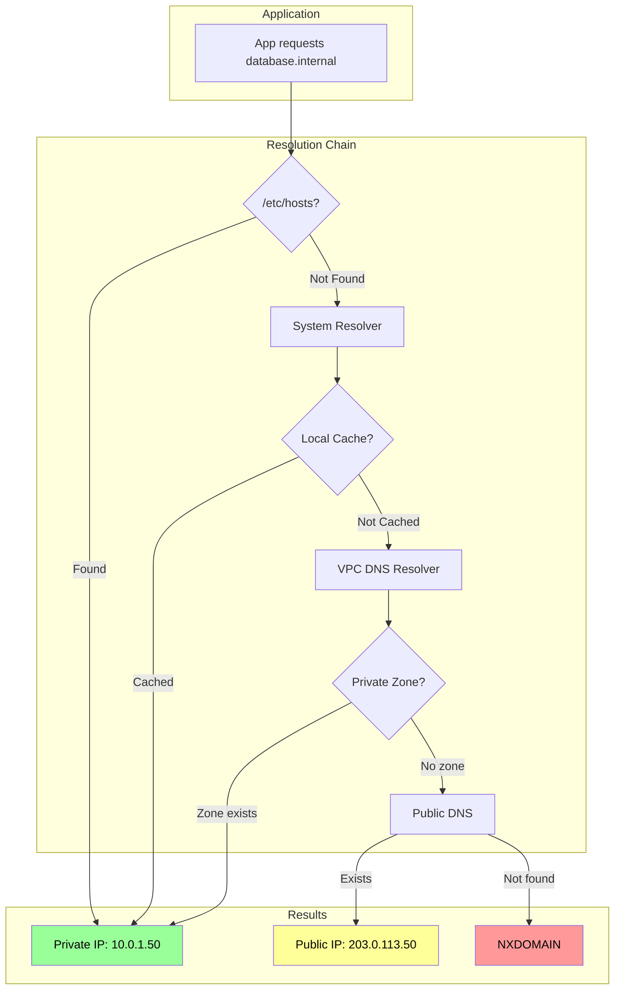
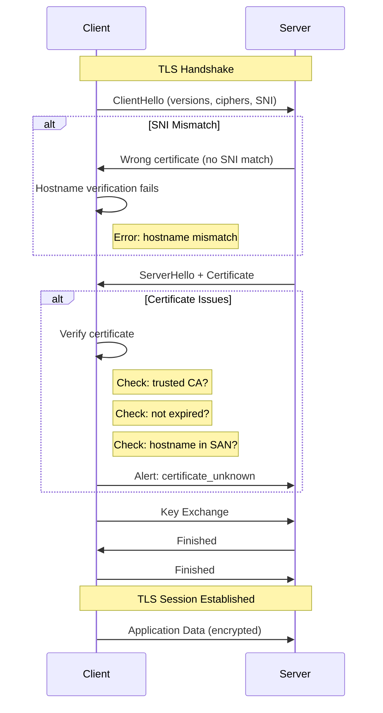

*[ARP]: Address Resolution Protocol
*[BGP]: Border Gateway Protocol
*[CA]: Certificate Authority
*[CIDR]: Classless Inter-Domain Routing
*[ENI]: Elastic Network Interface
*[ENIs]: Elastic Network Interfaces
*[ICMP]: Internet Control Message Protocol
*[MTU]: Maximum Transmission Unit
*[NACL]: Network Access Control List
*[NACLs]: Network Access Control Lists
*[NAT]: Network Address Translation
*[SNI]: Server Name Indication
*[TCP]: Transmission Control Protocol
*[TLS]: Transport Layer Security
*[TTL]: Time To Live
*[UDP]: User Datagram Protocol
*[VPC]: Virtual Private Cloud
*[VPN]: Virtual Private Network

> This article assumes familiarity with cloud networking fundamentals: VPCs, subnets, route tables, and basic Linux command-line tools.

Moving workloads to private networks makes sense from a security perspective—no public IPs, no internet exposure, traffic stays within your cloud provider's boundaries. But private networking introduces failure modes that don't exist with public connectivity. DNS resolution that worked fine over the internet fails with private endpoints. Routing that seemed automatic now requires explicit configuration. TLS certificates that validated publicly get rejected privately.

Private networking isn't "the same thing, but internal." It's a fundamentally different debugging domain where familiar tools give unfamiliar results and "connection refused" could mean ten different things.

I learned this the hard way during a database migration. We moved from a publicly-accessible RDS instance to a private endpoint. The application immediately failed with "connection refused." We verified the endpoint URL was correct. DNS resolved... but to a different IP than expected. The IP was in a private subnet range, but our VPC couldn't route to it. We added a route. Now we could reach the IP but got "connection reset." The TLS handshake was failing because the certificate's SAN didn't include the private DNS name. We added the DNS name to the certificate. Handshake succeeded, but authentication failed—the database saw connections from an unexpected IP because we'd forgotten about NAT.

Each layer had its own failure. Each failure was masked by generic error messages. What should have been a 30-minute cutover turned into a 3-day debugging marathon. After that incident, we built a debugging playbook: DNS → routing → connectivity → TLS → application. Every subsequent migration followed that checklist.

## Private DNS

DNS in private networks behaves differently than you'd expect. The same hostname can resolve to different IPs depending on where you query from, which resolver you use, and whether private hosted zones are properly configured. Understanding the resolution chain is the first step to debugging.

### DNS Resolution Architecture

On a standard Linux system, resolution follows a predictable path: check `/etc/hosts`, then the local cache (if enabled), then query the nameserver from `/etc/resolv.conf`. Cloud VMs complicate this. AWS VPCs get a resolver at the VPC CIDR base address plus two (so `10.0.0.2` for a `10.0.0.0/16` VPC). This resolver handles Route 53 private hosted zones and falls back to public DNS for external names. GCP uses the metadata server at `169.254.169.254`, Azure uses `168.63.129.16`.

Kubernetes adds another layer. CoreDNS intercepts queries and applies search domains—a request for `database` becomes `database.default.svc.cluster.local`, then `database.svc.cluster.local`, then `database.cluster.local` before falling through to the node's resolver. The `ndots` setting controls this behavior, and misconfiguring it causes subtle resolution failures.

The most common private DNS failures:

| Symptom | Likely Cause | Fix |
|---------|--------------|-----|
| Resolves to public IP instead of private | Using public DNS (8.8.8.8) instead of VPC resolver | Configure VPC-provided resolver |
| NXDOMAIN for private endpoint | Private hosted zone not associated with VPC | Associate zone with VPC |
| Same name resolves differently in different locations | Split-horizon DNS misconfiguration | Verify zone associations, compare dig results |
| Old IP returned after endpoint change | DNS caching with high TTL | Flush cache, reduce TTL before migrations |
| Short names don't resolve | Missing search domain in resolv.conf | Add search domain or use FQDN |

Table: Private DNS failure modes.



Figure: DNS resolution flow.

The diagram shows the critical branch point: if the private zone exists and is associated with your VPC, you get the private IP. If not, the query falls through to public DNS—which might return a public IP or NXDOMAIN, depending on whether the name exists publicly.

<Callout type="info">
When debugging DNS, always use `dig` with an explicit resolver to bypass caching and nsswitch.conf. Compare `dig @<vpc-resolver>` with `dig @8.8.8.8` to detect split-horizon issues.
</Callout>

### Private DNS Configuration

AWS private DNS centers on Route 53 private hosted zones—DNS zones that only resolve within associated VPCs.[^vpc] You create a zone for `internal.example.com`, associate it with your VPCs, and add records for your private services. Simple in theory, but the gotchas accumulate.

[^vpc]: "VPC" is an industry-standard concept for providing isolated private networks on shared cloud hardware. While AWS pioneered the term, every major cloud provider has a direct equivalent. Google Cloud also calls it a VPC Network, though GCP's VPC is "global" (a single network can span multiple regions, whereas AWS VPCs are regional). Microsoft Azure calls it a Virtual Network (VNet), functioning similarly but with subnets that can span multiple Availability Zones within a region. OpenStack doesn't have a single "VPC" product—the same isolation is achieved using Projects (formerly Tenants), with Tenant Networks and Routers replicating VPC functionality.

VPC endpoints add another wrinkle. When you create an interface endpoint for an AWS service (like S3 or Secrets Manager) with private DNS enabled, Route 53 automatically creates a private hosted zone that overrides the public DNS. Requests to `s3.us-east-1.amazonaws.com` resolve to the endpoint's private IPs instead of public AWS IPs. This requires `enableDnsHostnames` and `enableDnsSupport` on the VPC—settings that are easy to miss when troubleshooting.

For hybrid environments connecting AWS to on-premises networks, Route 53 Resolver endpoints bridge the gap. Inbound endpoints let on-premises DNS servers forward queries to AWS. Outbound endpoints let AWS workloads resolve on-premises DNS names. The configuration involves security groups, subnet placement, and forwarding rules—each a potential failure point.

| DNS Pattern | Use Case | Configuration |
|-------------|----------|---------------|
| Private hosted zone | Internal service discovery | Route 53 zone + VPC association |
| VPC endpoint private DNS | AWS service private access | Enable on endpoint creation |
| Resolver inbound | On-prem → AWS resolution | Inbound endpoint + security group |
| Resolver outbound | AWS → on-prem resolution | Outbound endpoint + forwarding rules |
| Split-horizon | Same name, different audiences | Separate public/private zones |

Table: Private DNS patterns.

The most common configuration mistake: creating a private hosted zone but forgetting to associate it with all the VPCs that need it. The zone exists, the records are correct, but queries from unassociated VPCs return NXDOMAIN. I've seen this take hours to diagnose because "the DNS is definitely configured."

## Routing and Connectivity

Once DNS resolves correctly, the next failure point is routing. Private networks require explicit route configuration—traffic doesn't magically find its way to destinations outside your immediate subnet.

### VPC Routing Fundamentals

Every VPC route table starts with an implicit local route that can't be removed. For a VPC with CIDR `10.0.0.0/16`, traffic to any `10.0.x.x` address routes automatically within the VPC. Everything else needs explicit routes.

The common route targets:

- __Internet Gateway__: Routes `0.0.0.0/0` to the internet (requires public IP or NAT)
- __NAT Gateway__: Outbound internet from private subnets (the NAT gateway itself must be in a public subnet)
- __VPC Peering__: Direct connection to another VPC's CIDR (requires routes on both sides, no CIDR overlap)[^peering]
- __Transit Gateway__: Hub-and-spoke for multiple VPCs (handles transitive routing)[^tgw]
- __VPC Endpoint__: Routes to AWS services via prefix lists[^prefix]

[^peering]: VPC Peering creates a direct point-to-point connection between two VPCs. If you have 4 VPCs and want them all to communicate, you must create 6 separate peering connections (a full mesh). Critically, peering does _not_ support transitive routing—if VPC A peers with B, and B peers with C, A cannot reach C through B. Each pair needs its own peering connection. For 10 VPCs, you'd need 45 peering links; for 100 VPCs, nearly 5,000.

[^tgw]: A Transit Gateway (TGW) is a regional network hub that acts as a central router. Instead of managing a mesh of peering connections, each VPC connects once to the gateway. Transitive routing—the ability to route traffic between two networks through a common intermediary—is fully supported. Any network attached to the hub can communicate with any other attachment (if route tables allow). TGW also lets you connect on-premises networks (via VPN or Direct Connect) to all your VPCs at once, which peering cannot do.

[^prefix]: A Prefix List is a system-managed collection of public IP address ranges (CIDR blocks) used by an AWS service in your region. Instead of manually entering hundreds of IP ranges into your route table, AWS bundles them into a single ID that stays updated automatically. For example, `pl-63c5400k` represents all S3 IP ranges in us-east-1. When you create a Gateway Endpoint, AWS adds a route like `pl-63c5400k → vpce-0123456789abcdef0` to your route table.

Route selection follows the "most specific route wins" principle. If you have routes for `0.0.0.0/0` (internet), `10.0.0.0/16` (local), `10.1.0.0/16` (peered VPC), and `10.1.5.0/24` (specific subnet via transit gateway), traffic to `10.1.5.100` takes the `/24` route—it's the most specific match.

Routing failures in private networks present differently than on traditional networks. You won't see clear error messages—timeouts look identical whether the cause is a missing route, a security group block, or a service that's down. This ambiguity makes systematic debugging essential. These are the patterns you'll encounter:

| Symptom | Cause | Fix |
|---------|-------|-----|
| Timeout (no error) | No route to destination | Add route for destination CIDR |
| Connection reset, packets dropped | Asymmetric routing (return path differs from forward path) | Ensure symmetric routing |
| Packets silently dropped | Blackhole route (target deleted but route remains) | Remove stale routes |
| Traffic goes to wrong destination | Overlapping CIDRs across connected networks | Redesign addressing to avoid overlaps |

Table: Routing failure modes.

### Connectivity Debugging

When you suspect routing works but connectivity still fails, you need to systematically test each layer. Start with `ip route get <destination>` to verify the kernel's routing decision. Then test TCP connectivity with `nc -zv -w 5 <host> <port>`—this bypasses higher-level issues and tells you whether the port is reachable at all.

One gotcha that catches people: MTU issues. VPNs and tunnels often have lower MTU than the standard 1500 bytes. Large packets get silently dropped while small packets (like TCP handshakes) succeed. If connections establish but then hang when transferring data, test MTU with `ping -M do -s 1472 <host>` (1472 + 28 bytes header = 1500). Reduce the size until it works to find the actual path MTU.

I work through connectivity issues in a fixed order—each layer must pass before moving to the next:

| Layer | Check | Command | If Fails |
|-------|-------|---------|----------|
| __L3 (Network): Routing__ | Route exists? | `ip route get <ip>` | Add route for destination CIDR |
| __L3: Routing__ | No blackhole? | Check route table in console | Remove stale routes |
| __L4: Security__ | Security group allows? | Check SG rules in console | Add inbound rule |
| __L4: Security__ | NACL allows? | Check NACL rules | Add inbound + ephemeral outbound |
| __L4: Transport__ | Port reachable? | `nc -zv -w 5 <host> <port>` | Check host firewall, start service |
| __L7: TLS__ | Handshake succeeds? | `openssl s_client -connect <host>:<port>` | Fix certificate or trust store |
| __L7: App__ | Authentication? | Application logs | Fix credentials or allowlist |

Table: Connectivity debugging checklist.

<Callout type="danger">
Cloud networks often don't return ICMP unreachable for routing failures—packets just disappear. A timeout doesn't mean "firewall blocked"; it might mean "no route exists." Always verify routing before assuming security group issues.
</Callout>

### Security Groups and NACLs

Security groups and NACLs both filter traffic, but they work differently and trip people up in different ways.

Security groups are _stateful_ and operate at the instance (ENI[^eni]) level. You only define allow rules—there's no explicit deny.

[^eni]: An ENI (Elastic Network Interface) is a virtual network interface card that provides network connectivity for cloud instances. Other providers have equivalents: Azure calls it a Network Interface (NIC), which can have Network Security Groups applied directly. GCP uses Network Interfaces (vNIC), with the Google Virtual NIC (gVNIC) driver for high performance—note that GCP requires configuring all interfaces at VM creation time. OpenStack's equivalent is a Port in the Neutron networking service, which carries MAC and IP addresses and acts as the connection point for virtual servers. If any rule matches, traffic is allowed, and return traffic is automatically permitted. The default behavior is deny-all-inbound, allow-all-outbound. The common mistake here is trying to allow traffic from a "self-referencing" security group (a rule where source = the security group's own ID) without realizing that requires both instances to share that security group.

NACLs are _stateless_ and operate at the subnet level. You can define both allow and deny rules, evaluated in order (lowest rule number first). Because they're stateless, you must explicitly allow return traffic on ephemeral ports (1024-65535). The default NACL allows everything; custom NACLs start with deny-all. The classic NACL mistake: allowing outbound traffic but forgetting to allow inbound on ephemeral ports for the response. Connection times out, and you spend an hour checking security groups.

| Check | Security Group | NACL |
|-------|---------------|------|
| Scope | ENI/Instance | Subnet |
| State | Stateful | Stateless |
| Rules | Allow only | Allow + Deny |
| Return traffic | Automatic | Must allow ephemeral ports |
| Evaluation | All rules (any match) | Ordered (first match) |
| Cross-VPC reference | Limited | CIDR only |

Table: Security group vs NACL comparison.

One more gotcha: security group rules can reference other security groups, but only within the same VPC (or across peered VPCs in the same region). Cross-VPC references don't work with transit gateway—you must use CIDR blocks instead. And if your traffic goes through NAT, the destination sees the NAT IP, not the original source IP. Your security group rule allowing the source instance's IP won't match.

## TLS Debugging

Once you've verified DNS resolution, routing, and basic connectivity, TLS becomes the next potential failure point. Private networking introduces TLS issues that don't exist with public endpoints—hostname mismatches, untrusted internal CAs, and SNI problems are the usual suspects.

### TLS Handshake Failures

The TLS handshake follows a specific sequence, and failures at each stage produce different error messages. The client sends a ClientHello with supported TLS versions, cipher suites, and the SNI (Server Name Indication). The server responds with its certificate. The client then verifies the certificate: Is the chain valid? Is it expired? Does the hostname match the certificate's SAN (Subject Alternative Name)? Is the CA trusted?

Private networking introduces specific failure patterns:

__Hostname mismatch__ is the most common. Your certificate was issued for `api.example.com` (the public name), but you're connecting to `api.internal.example.com` (the private endpoint). The certificate's SAN doesn't include the private name, so verification fails. Solutions: add the private name to the certificate's SAN, use the public name even for private connections, or configure the client to verify against a different hostname.

__Untrusted private CA__ happens when internal services use certificates from a private CA that clients don't trust. You'll see "unable to get local issuer certificate" or "self signed certificate in certificate chain." The fix is adding the CA certificate to the client's trust store—but every language and framework has its own way of doing this.

__SNI issues__ occur when multiple services share a load balancer IP. The server uses SNI to decide which certificate to return. If SNI isn't sent (older clients, misconfigured tools), you get the default certificate, which might not match the hostname you requested.

__Expired certificates__ hit internal services harder than public ones. Let's Encrypt certificates auto-renew. Internal certificates often don't, and they're not monitored as closely. A certificate expires at 2am, and suddenly half your services are down.

| Issue | Error Message | Solution |
|-------|---------------|----------|
| Hostname mismatch | "hostname doesn't match" | Add hostname to SAN, or use existing SAN name |
| Untrusted CA | "unable to verify certificate" | Add CA to trust store |
| Expired | "certificate has expired" | Renew certificate |
| Wrong cert (SNI) | Certificate for wrong domain | Fix SNI or LB config |
| Self-signed | "self signed certificate" | Add cert to trust store or use CA |

Table: Common TLS errors and solutions.

The essential debugging command is `openssl s_client`:

```bash
# Connect and inspect certificate
echo | openssl s_client -connect api.internal:443 -servername api.internal 2>/dev/null | \
    openssl x509 -noout -text | grep -E "Subject:|Issuer:|Not After:|DNS:"
```

Code: Inspecting a certificate with openssl.

Always include `-servername` to send SNI. Without it, you might get a different certificate than your application receives, and your debugging results won't match production behavior.



Figure: TLS handshake with failure points.

### Certificate Management

Private services need certificates, and you have three options: public CAs, private CAs, or self-signed certificates.

__Public CAs__ (Let's Encrypt, DigiCert, AWS ACM) are trusted by all clients automatically. The limitation: the domain must be publicly verifiable via DNS or HTTP challenge. You can use public CA certificates for private endpoints if you own the domain and can complete the challenge—the certificate doesn't care whether the service is publicly accessible.

__Private CAs__ (AWS Private CA, HashiCorp Vault, step-ca, CFSSL[^cfssl]) issue certificates for internal services without public domain verification.[^privateca] The tradeoff: you must distribute the CA certificate to every client that needs to trust these certificates. Every language and runtime has its own trust store configuration:

[^cfssl]: CFSSL (CloudFlare's PKI/TLS toolkit) is an open-source tool for managing, issuing, and verifying digital certificates. It functions as a lightweight certificate authority, handling certificate signing requests, generating key pairs, and bundling certificate chains. In infrastructure contexts, CFSSL commonly powers internal CAs for mTLS between services—you run it as a signing server that issues short-lived certificates on demand.

[^privateca]: Public CAs like Let's Encrypt will not issue certificates with the `Basic Constraints: CA:TRUE` flag to third parties. This flag indicates that the certificate can sign other certificates—giving you the power to issue publicly trusted certificates for _any_ domain. Allowing this would completely bypass their security controls. Private CAs exist precisely because you need this capability for internal certificate management.

| Runtime | Configuration |
|---------|---------------|
| Linux system | Copy to `/etc/ssl/certs/` and run `update-ca-certificates` |
| macOS | Run `security add-trusted-cert -d -r trustRoot -k /Library/Keychains/System.keychain ca.crt` |
| Node.js | Set `NODE_EXTRA_CA_CERTS=/path/to/ca.crt` |
| Python | Set `REQUESTS_CA_BUNDLE=/path/to/ca.crt` |
| Java | Import with `keytool -import -trustcacerts -file ca.crt -keystore truststore.jks` |
| Go | Set `SSL_CERT_FILE=/path/to/ca-bundle.crt` |

Table: CA trust configuration by runtime.

__Self-signed certificates__ require each certificate to be explicitly trusted—not just the CA. They work for development but don't scale. Avoid them in production.

For certificate lifecycle, there are two common strategies: short-lived with automatic rotation (24 hours to 7 days, using tools like cert-manager or Vault), or long-lived with manual rotation (1-2 years). Short-lived certificates limit the damage window if compromised but require robust automation. Long-lived certificates are simpler to manage until they expire unexpectedly at 3am.

Whatever strategy you choose, monitor certificate expiry. Alert at 30 days (warning), 7 days (critical), and page immediately on expiry. Internal certificates don't get the same attention as public ones, and they'll bite you when you least expect it.

## Debugging Playbook

The previous sections covered individual failure modes. This section puts them together into a systematic approach you can follow when something breaks.

### Systematic Approach

Every private networking issue follows the same debugging sequence. Each layer depends on the previous one working correctly—there's no point checking TLS if packets aren't reaching the server.

__Step 1: DNS__ — Does the name resolve to the expected IP? Use `getent hosts <hostname>` (which respects system configuration) rather than just `dig`. Verify the IP is in the expected private range. Compare results from the VPC resolver versus public DNS to detect split-horizon issues.

__Step 2: Routing__ — Can the kernel find a path to that IP? Run `ip route get <ip>` to see the routing decision. Check the VPC route table in the console for the source subnet. Look for blackhole routes where the target was deleted but the route remains.

__Step 3: Connectivity__ — Is the port reachable? Use `nc -zv -w 5 <ip> <port>`. A timeout suggests routing or security group issues. "Connection refused" means packets arrive but nothing's listening—the service is down or on a different port.

__Step 4: TLS__ — Does the handshake succeed? Run `openssl s_client -connect <ip>:<port> -servername <hostname>`. Check that the certificate isn't expired, the hostname appears in the SAN, and the CA is trusted.

__Step 5: Application__ — Does the application-level connection work? At this point, networking is fine. Check authentication credentials, authorization rules, and application-level allowlists (some services restrict by source IP).

At each step, the failure mode tells you where to look next. "Connection refused" at the port check means skip security groups and check whether the service is running. "Timeout" means go back to routing and security rules.

<Callout type="info">
Save this debugging order: DNS → Routing → Connectivity → TLS → Application. Each layer's failure can look like the layer above it. A TLS failure might look like "connection refused" if you don't check systematically.
</Callout>

<Callout type="warning">
Private networking failures cascade and hide. A DNS failure looks like a routing failure. A routing failure looks like a firewall block. A TLS failure looks like a connection reset. Debug systematically from layer 3 up, not from error messages down.
</Callout>

## Common Scenarios

Two scenarios come up repeatedly: migrating existing services to private endpoints, and connecting services across VPCs. Both have predictable failure points.

### Private Endpoint Migration

Moving from a public endpoint to a private one requires coordination across DNS, routing, security, and TLS. The migration itself is usually quick—the preparation takes longer.

__Pre-migration checklist:__

- _DNS_: Private hosted zone exists, associated with all source VPCs, records created for the private endpoint, TTL lowered (60 seconds or less) to enable quick rollback
- _Routing_: Routes exist from source subnets to the private endpoint subnet, VPC peering or transit gateway configured if cross-VPC, no CIDR conflicts
- _Security_: Security groups allow inbound from all source IPs/security groups, NACLs allow bidirectional traffic including ephemeral ports, endpoint policies permit required actions (for AWS VPC endpoints)
- _TLS_: Certificate includes the private DNS name in its SAN, CA trusted by all clients, certificate not expiring during the migration window

__Migration patterns:__

_DNS cutover_ is the simplest approach. Lower TTL beforehand, verify private connectivity works with direct IP access, update DNS to point to the private endpoint, monitor for failures. Rollback is just reverting the DNS record. The risk: it's all-or-nothing.

_Gradual migration_ deploys new application instances configured for the private endpoint, then shifts traffic percentage over time. More complex to orchestrate but safer for critical services.

_Dual-stack_ configures applications to prefer the private endpoint with fallback to public. This is the safest approach but has a subtle risk: the fallback can mask private connectivity issues, making them harder to detect.

__Post-migration verification:__

- Confirm all source IPs can reach the private endpoint
- Check that latency improved (it should—no internet hops)
- Verify VPC flow logs show no public IP traffic to the service
- Disable or restrict the public endpoint
- Update monitoring and runbooks for the new architecture

### Cross-VPC Connectivity

When services span multiple VPCs, you have three main options: peering, transit gateway, or Private Link. The choice depends on your topology and constraints.

__VPC Peering__ works for simple topologies with 2-3 VPCs. It's a direct connection—fast and cheap. The limitations: no transitive routing (if A peers with B and B peers with C, A can't reach C through B), CIDRs can't overlap, and cross-region peering adds latency. Both sides need routes added to their route tables. For DNS, enable resolution in the peering connection settings and associate private hosted zones with both VPCs.

__Transit Gateway__ is the right choice when you have many VPCs or need transitive routing. Each VPC connects once to the gateway, which acts as a central router. You can also attach VPN connections or Direct Connect[^directconnect], giving on-premises networks access to all VPCs. The complexity is in route table management—transit gateway has its own route tables separate from VPC route tables, and misconfiguration causes blackholes.

[^directconnect]: Direct Connect is AWS's dedicated physical network connection between your data center and AWS, bypassing the public internet for lower latency and more consistent bandwidth. Other providers offer equivalents: Google Cloud has Cloud Interconnect (Dedicated or Partner), Azure has ExpressRoute, and OpenStack environments typically use provider-specific solutions or MPLS circuits configured through the network operator.

__Private Link__ (AWS PrivateLink or equivalent) exposes a specific service to other VPCs without any routing changes. The provider creates a Network Load Balancer and an endpoint service. Consumers create interface endpoints that appear as ENIs for AWS or the equivalent on other cloud providers in their VPC. This approach handles CIDR overlaps gracefully—the consumer never sees the provider's IP space. The tradeoff: it's service-by-service rather than network-wide connectivity.

__VPN__ provides encrypted connectivity over the public internet—useful when dedicated connections aren't available or cost-justified. Site-to-site VPN connects on-premises networks to cloud VPCs; client VPN gives individual users access. VPN's main drawbacks are latency (traffic still traverses the internet) and bandwidth limits. Whether VPN supports transitive routing depends on your setup: a VPN attached to a transit gateway gets transitive access to all attached VPCs, but a VPN attached directly to a single VPC doesn't.

| Pattern | CIDR Overlap | Transitive | DNS Complexity | Use When |
|---------|--------------|------------|----------------|----------|
| VPC Peering | Not allowed | No | Medium | 2-3 VPCs, simple topology |
| Transit Gateway | Not allowed | Yes | Medium | Many VPCs, hub-spoke |
| Private Link | Allowed | N/A | Low | Service exposure, overlapping CIDRs |
| VPN | Not allowed | Depends | High | Hybrid cloud |

Table: Cross-VPC connectivity comparison.

Common debugging issues by pattern:

- _Peering_: Routes missing on one side, DNS resolution not enabled, zone not associated with both VPCs
- _Transit Gateway_: Blackhole routes (attachment deleted but route remains), wrong route table association, asymmetric routing on return path
- _Private Link_: Connection stuck in "pending" (provider must accept), endpoint unavailable (check NLB health targets), private DNS not working (verify it's enabled on the endpoint)

## Conclusion

Private networking provides real security benefits—no public IPs to attack, traffic contained within provider boundaries, reduced attack surface. But those benefits come with operational complexity that catches teams off guard.

The core insight: private networks fail differently than public ones. DNS resolution depends on private hosted zones and VPC associations. Routing requires explicit configuration for every destination outside your subnet. TLS certificates need private hostnames that didn't exist when you were public-only.

Build the debugging reflex before you need it: DNS → routing → connectivity → TLS → application. Each layer must work before the next can succeed. When something breaks at 3am, you don't want to be guessing.

Three investments pay off:

1. __Diagnostic tooling__: Scripts that run through the checklist automatically. When you're tired and stressed, you'll skip steps. The script won't.

2. __Architecture documentation__: Private networks have more moving parts—VPC CIDRs, route tables, peering connections, transit gateway attachments, private hosted zones. Document them so debugging isn't archaeology.

3. __Pre-migration testing__: Before cutting over to private endpoints, verify every step of the path works. The migration itself should be boring.

The teams that handle private networking well aren't the ones with the fanciest tools. They're the ones who've internalized the debugging playbook before the first production incident.

<Callout type="warning">
Every "connection refused" in a private network could be DNS, routing, security groups, NACLs, TLS, or the application. Resist the temptation to guess. Run through the layers systematically—it's faster than random troubleshooting.
</Callout>
