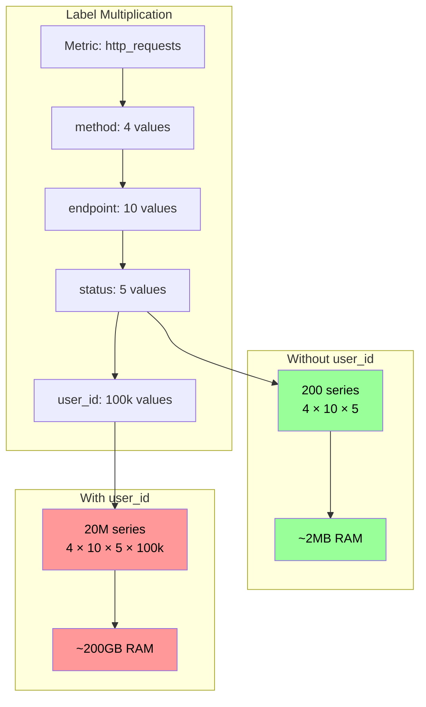
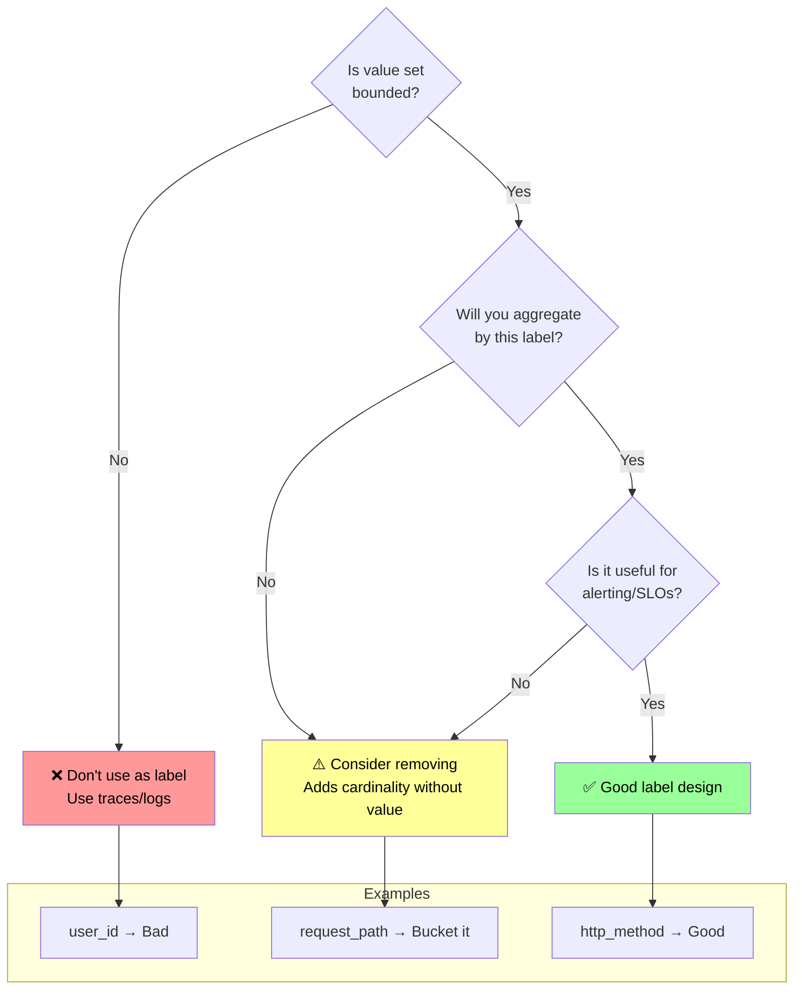
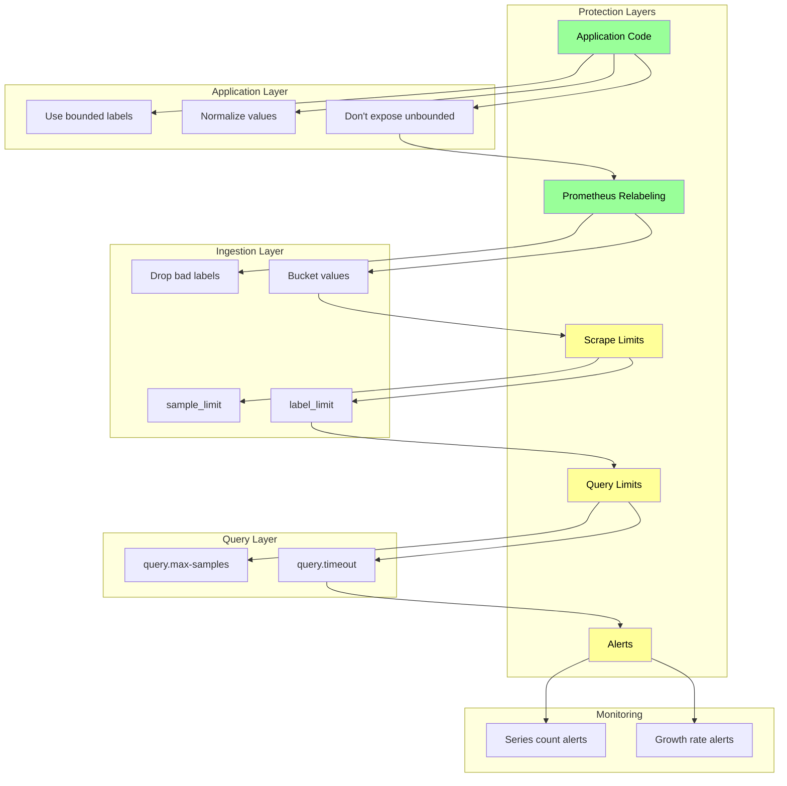

*[TSDB]: Time Series Database
*[OOM]: Out of Memory
*[WAL]: Write-Ahead Log
*[RAM]: Random Access Memory
*[SSD]: Solid State Drive
*[PromQL]: Prometheus Query Language
*[HTTP]: Hypertext Transfer Protocol
*[API]: Application Programming Interface
*[UUID]: Universally Unique Identifier
*[P99]: 99th Percentile
*[SLO]: Service Level Objective

# High-Cardinality Metrics: Prometheus Label Horror

## Introduction

Frame the cardinality problem: every unique combination of metric name and label values creates a separate time series. A metric with 3 labels, each with 100 possible values, creates up to 1 million time series (100 × 100 × 100). Prometheus stores each time series independently, keeping recent data in memory. Cardinality isn't about the number of metrics—it's about the combinatorial explosion of label values. This section establishes that cardinality is Prometheus's Achilles heel, and that "just add a label" is the most dangerous sentence in observability. The failure mode is insidious: everything works until it suddenly doesn't, when memory exhaustion crashes your monitoring right when you need it most.

_Include a scenario: a team instruments their API with response time histograms. They add labels for endpoint, status code, and user_id "for debugging." With 50 endpoints, 10 status codes, and 100,000 users, they've created 50 million potential time series. Initially, only active users generate metrics—maybe 10,000 series. Over months, more users become active. Prometheus memory usage grows. One day, a marketing campaign brings a traffic spike. Memory usage jumps, Prometheus OOMs, monitoring goes dark during the incident. They remove user_id, add it to traces instead, implement cardinality limits. Prometheus stabilizes at 50,000 series. The lesson: labels are multiplicative, not additive._

<Callout type="danger">
A single unbounded label can destroy your Prometheus deployment. User IDs, request IDs, email addresses, IP addresses—any label that grows with your data will eventually exhaust memory. Design labels for known, bounded sets of values.
</Callout>

## Understanding Cardinality

### Time Series Math

```yaml title="cardinality-math.yaml"
# Cardinality calculation fundamentals

time_series_definition:
  what_creates_series: |
    Each unique combination of:
    - Metric name
    - All label name-value pairs
    Creates ONE time series

  example:
    metric: "http_requests_total"
    labels:
      method: ["GET", "POST", "PUT", "DELETE"]  # 4 values
      endpoint: ["/api/users", "/api/orders", "/api/products"]  # 3 values
      status: ["200", "400", "404", "500"]  # 4 values
    total_series: 48  # 4 × 3 × 4

---
# Cardinality explosion scenarios
explosion_scenarios:
  safe_design:
    metric: "http_request_duration_seconds"
    labels:
      method: 5      # GET, POST, PUT, DELETE, PATCH
      handler: 20    # API endpoints
      status: 10     # Common status codes
    series: 1000     # 5 × 20 × 10
    memory: "~10MB"  # Manageable

  dangerous_design:
    metric: "http_request_duration_seconds"
    labels:
      method: 5
      handler: 20
      status: 10
      user_id: 100000  # Unbounded!
    series: 100000000  # 100 million potential
    memory: "~1TB"     # Impossible

  histogram_multiplier:
    note: "Histograms create multiple series per metric"
    buckets: 10        # le="0.1", le="0.25", etc.
    base_labels:
      method: 5
      handler: 20
    series_per_histogram: 12  # 10 buckets + _sum + _count
    total_series: 1200  # 5 × 20 × 12

---
# Memory estimation
memory_estimation:
  formula: |
    memory_bytes ≈ series_count × 3KB (rough estimate)

  factors:
    label_names: "More labels = more memory per series"
    label_values: "Longer strings = more memory"
    sample_rate: "More frequent scrapes = more samples in memory"
    retention: "Longer head block retention = more samples"

  prometheus_limits:
    default_head_retention: "2 hours"
    samples_per_series_2h: 120  # 15s scrape interval
    bytes_per_sample: 1-2      # Compressed
    overhead_per_series: "~1-3KB for metadata, index"

  practical_limits:
    small_prometheus:
      ram: "4GB"
      safe_series: 500000
    medium_prometheus:
      ram: "16GB"
      safe_series: 2000000
    large_prometheus:
      ram: "64GB"
      safe_series: 10000000
```
Code: Cardinality math fundamentals.


Figure: Label multiplication effect.

### Prometheus Internals

```yaml title="prometheus-internals.yaml"
# How Prometheus handles cardinality

tsdb_architecture:
  head_block:
    purpose: "Recent data, in-memory"
    duration: "2 hours default (--storage.tsdb.min-block-duration)"
    structure:
      - "In-memory index of all active series"
      - "In-memory chunks for recent samples"
      - "WAL for crash recovery"
    cardinality_impact: |
      EVERY active series must fit in memory
      High cardinality = high memory usage

  persistent_blocks:
    purpose: "Historical data, on disk"
    duration: "2-hour blocks, compacted over time"
    structure:
      - "Index file (series to chunks mapping)"
      - "Chunk files (compressed samples)"
      - "Tombstones (deleted data)"
    cardinality_impact: |
      High cardinality = large index files
      Queries must load index into memory

  compaction:
    process: "Merge smaller blocks into larger ones"
    benefit: "Reduces file count, improves query performance"
    cardinality_impact: |
      High cardinality = slow compaction
      May fall behind, causing disk pressure

---
# Memory breakdown
memory_usage:
  per_series_overhead:
    series_ref: "8 bytes"
    label_index_entry: "~100-500 bytes (varies with labels)"
    chunk_reference: "~16 bytes"
    active_chunk: "~120 bytes per chunk"
    total_estimate: "1-3KB per active series"

  query_memory:
    series_selection: "Must load matching series metadata"
    sample_iteration: "Decompresses chunks into memory"
    aggregation: "Intermediate results stored in memory"
    impact: |
      High-cardinality queries can OOM even with moderate storage
      Query like sum(rate(x[5m])) by (unbounded_label) loads all series

---
# Failure modes
failure_modes:
  gradual_oom:
    symptoms:
      - "Memory usage steadily increasing"
      - "Prometheus restarts under load"
      - "Head compaction failing"
    cause: "Cardinality growing over time"

  sudden_oom:
    symptoms:
      - "Memory spike during incident"
      - "Prometheus crash"
      - "Monitoring blackout"
    cause: "Traffic spike activating dormant series"

  query_oom:
    symptoms:
      - "Specific query crashes Prometheus"
      - "Dashboard load kills monitoring"
    cause: "Query touching high-cardinality metric"

  slow_startup:
    symptoms:
      - "Prometheus takes minutes to start"
      - "High CPU during WAL replay"
    cause: "Rebuilding index for millions of series"
```
Code: Prometheus TSDB internals.

<Callout type="info">
Prometheus keeps metadata for ALL active series in memory, not just samples. A series that received one sample in the last 2 hours consumes nearly as much memory as one with thousands of samples. The cardinality cost is the series count, not the sample count.
</Callout>

## Label Design Principles

### Good vs Bad Labels

```yaml title="label-design.yaml"
# Label design principles

good_labels:
  characteristics:
    - "Bounded cardinality (known, finite values)"
    - "Meaningful for aggregation"
    - "Stable over time"
    - "Shared across many series"

  examples:
    http_method:
      values: ["GET", "POST", "PUT", "DELETE", "PATCH"]
      cardinality: 5
      aggregation: "Rate by method"

    environment:
      values: ["production", "staging", "development"]
      cardinality: 3
      aggregation: "Compare across environments"

    status_code_class:
      values: ["2xx", "3xx", "4xx", "5xx"]
      cardinality: 4
      aggregation: "Success vs error rates"
      note: "Bucketed, not individual codes"

    region:
      values: ["us-east-1", "us-west-2", "eu-west-1"]
      cardinality: "Number of regions (bounded)"
      aggregation: "Regional breakdowns"

---
# Bad labels (never use)
bad_labels:
  user_identifiers:
    examples: ["user_id", "customer_id", "account_id"]
    problem: "Grows with user base"
    cardinality: "Millions"
    alternative: "Use traces, use logs"

  request_identifiers:
    examples: ["request_id", "trace_id", "correlation_id"]
    problem: "Unique per request"
    cardinality: "Infinite"
    alternative: "Exemplars (link to traces)"

  timestamps:
    examples: ["timestamp", "date", "hour"]
    problem: "Constantly changing"
    cardinality: "Infinite"
    alternative: "Built into Prometheus (time dimension)"

  ip_addresses:
    examples: ["client_ip", "source_ip", "remote_addr"]
    problem: "Huge address space"
    cardinality: "Potentially billions"
    alternative: "Log-based analysis, trace attributes"

  email_addresses:
    examples: ["email", "user_email"]
    problem: "Unique per user, PII"
    cardinality: "Matches user count"
    alternative: "Don't store PII in metrics"

  free_text:
    examples: ["error_message", "query", "path"]
    problem: "Unbounded string values"
    cardinality: "Unbounded"
    alternative: "Categorize/bucket into known values"

---
# Label decision framework
decision_framework:
  questions:
    1: "Is the value set bounded and known?"
    2: "Will I aggregate/group by this label?"
    3: "Does it change with traffic volume?"
    4: "Is it unique per request/user?"

  decision_tree:
    bounded_and_known:
      aggregation_useful: "Good label ✓"
      aggregation_not_useful: "Consider removing"
    unbounded:
      "Never add as label ✗"
      "Use traces or logs instead"
```
Code: Label design principles.


Figure: Label decision framework.

### Practical Label Patterns

```typescript title="label-patterns.ts"
// Good label patterns in application code

import { Counter, Histogram, Registry } from 'prom-client';

const register = new Registry();

// === GOOD: Bounded labels ===

// HTTP metrics with bounded labels
const httpRequestDuration = new Histogram({
  name: 'http_request_duration_seconds',
  help: 'HTTP request duration in seconds',
  labelNames: ['method', 'handler', 'status_class'],  // All bounded
  buckets: [0.01, 0.05, 0.1, 0.5, 1, 5],
  registers: [register],
});

// Normalize labels to bounded values
function recordRequest(method: string, path: string, status: number, duration: number) {
  httpRequestDuration.observe(
    {
      method: normalizeMethod(method),      // Bounded: GET, POST, etc.
      handler: normalizeHandler(path),       // Bounded: known routes
      status_class: normalizeStatus(status), // Bounded: 2xx, 3xx, 4xx, 5xx
    },
    duration
  );
}

// Normalize HTTP method to known set
function normalizeMethod(method: string): string {
  const known = ['GET', 'POST', 'PUT', 'DELETE', 'PATCH', 'HEAD', 'OPTIONS'];
  return known.includes(method.toUpperCase()) ? method.toUpperCase() : 'OTHER';
}

// Normalize path to route pattern (bounded)
function normalizeHandler(path: string): string {
  // Map actual paths to route patterns
  // /api/users/123 → /api/users/:id
  // /api/orders/456/items → /api/orders/:id/items

  const patterns = [
    { pattern: /^\/api\/users\/[^/]+$/, handler: '/api/users/:id' },
    { pattern: /^\/api\/users$/, handler: '/api/users' },
    { pattern: /^\/api\/orders\/[^/]+\/items$/, handler: '/api/orders/:id/items' },
    { pattern: /^\/api\/orders\/[^/]+$/, handler: '/api/orders/:id' },
    { pattern: /^\/api\/orders$/, handler: '/api/orders' },
    { pattern: /^\/health$/, handler: '/health' },
  ];

  for (const { pattern, handler } of patterns) {
    if (pattern.test(path)) {
      return handler;
    }
  }

  return 'unknown';  // Catch-all for unexpected paths
}

// Normalize status to class
function normalizeStatus(status: number): string {
  if (status < 200) return '1xx';
  if (status < 300) return '2xx';
  if (status < 400) return '3xx';
  if (status < 500) return '4xx';
  return '5xx';
}

// === BAD: Unbounded labels (DON'T DO THIS) ===

// ❌ WRONG: user_id as label
const badMetric = new Counter({
  name: 'user_requests_total',
  help: 'Requests per user',
  labelNames: ['user_id'],  // UNBOUNDED - will explode
  registers: [register],
});

// ❌ WRONG: Full path as label
const alsoBadMetric = new Histogram({
  name: 'request_latency',
  help: 'Request latency',
  labelNames: ['path'],  // UNBOUNDED - /users/123, /users/456, etc.
  registers: [register],
});

// === ALTERNATIVE: Use exemplars for high-cardinality correlation ===

// Link metrics to traces without label explosion
const requestDurationWithExemplar = new Histogram({
  name: 'http_request_duration_with_exemplar_seconds',
  help: 'Request duration with trace exemplar',
  labelNames: ['method', 'handler', 'status_class'],
  buckets: [0.01, 0.05, 0.1, 0.5, 1, 5],
  registers: [register],
});

function recordWithExemplar(
  method: string,
  path: string,
  status: number,
  duration: number,
  traceId: string  // High-cardinality value goes in exemplar, not label
) {
  requestDurationWithExemplar.observe(
    {
      method: normalizeMethod(method),
      handler: normalizeHandler(path),
      status_class: normalizeStatus(status),
    },
    duration,
    { traceID: traceId }  // Exemplar: links to trace without creating series
  );
}
```
Code: Good label patterns in application code.

| Label Type | Example | Cardinality | Verdict |
|------------|---------|-------------|---------|
| HTTP method | GET, POST, PUT | ~7 | ✅ Good |
| Status class | 2xx, 3xx, 4xx, 5xx | 4 | ✅ Good |
| Route pattern | /api/users/:id | ~50 | ✅ Good |
| Environment | prod, staging, dev | 3 | ✅ Good |
| User ID | UUID | Millions | ❌ Never |
| Full path | /api/users/12345 | Unbounded | ❌ Never |
| Error message | Free text | Unbounded | ❌ Never |
| Client IP | IP addresses | Huge | ❌ Never |

Table: Label design quick reference.

<Callout type="warning">
If you need per-user or per-request visibility, use traces. Prometheus metrics are for aggregate views. Traces are for individual request debugging. Don't try to make metrics do what traces do—you'll just break your metrics.
</Callout>

## Cardinality Control

### Monitoring Cardinality

```promql title="cardinality-monitoring.promql"
# PromQL queries for cardinality monitoring

# === Total active series count ===
# Most important metric to watch
prometheus_tsdb_head_series

# Alert when approaching limits
# (alert on series count relative to available memory)

# === Cardinality by metric name ===
# Find which metrics contribute most series
topk(10, count by (__name__) ({__name__=~".+"}))

# === Series created in last hour ===
# Detect cardinality growth
increase(prometheus_tsdb_head_series_created_total[1h])

# === Memory usage ===
# Track head block memory (most affected by cardinality)
prometheus_tsdb_head_chunks_storage_size_bytes

# === Series churn (creation rate) ===
# High churn indicates ephemeral series (often high cardinality)
rate(prometheus_tsdb_head_series_created_total[5m])

# === Scrape samples (total samples scraped) ===
# High samples per scrape might indicate high cardinality
sum(scrape_samples_scraped) by (job)

# === Label value counts ===
# Count unique values per label (requires federation or custom exporter)
# This helps find which labels are exploding
```
Code: Cardinality monitoring queries.

```yaml title="cardinality-alerting.yaml"
# Prometheus alerting rules for cardinality

groups:
  - name: cardinality_alerts
    rules:
      # Alert on total series count
      - alert: HighSeriesCount
        expr: prometheus_tsdb_head_series > 2000000
        for: 10m
        labels:
          severity: warning
        annotations:
          summary: "High time series count"
          description: "Prometheus has {{ $value }} active series. Investigate high-cardinality metrics."

      - alert: CriticalSeriesCount
        expr: prometheus_tsdb_head_series > 5000000
        for: 5m
        labels:
          severity: critical
        annotations:
          summary: "Critical time series count"
          description: "Prometheus has {{ $value }} series. Risk of OOM. Immediate action required."

      # Alert on series growth rate
      - alert: RapidSeriesGrowth
        expr: |
          (prometheus_tsdb_head_series - prometheus_tsdb_head_series offset 1h)
          / prometheus_tsdb_head_series offset 1h > 0.1
        for: 30m
        labels:
          severity: warning
        annotations:
          summary: "Rapid series count growth"
          description: "Series count growing >10% per hour. Possible cardinality explosion."

      # Alert on high memory usage
      - alert: PrometheusMemoryHigh
        expr: |
          process_resident_memory_bytes{job="prometheus"}
          / on() prometheus_tsdb_head_series > 5000
        for: 15m
        labels:
          severity: warning
        annotations:
          summary: "High memory per series"
          description: "Memory usage per series is unusually high. Check for label bloat."

      # Alert on scrape failures (might indicate cardinality issues)
      - alert: ScrapeHighCardinality
        expr: scrape_samples_scraped > 50000
        for: 10m
        labels:
          severity: warning
        annotations:
          summary: "High sample count from scrape"
          description: "Job {{ $labels.job }} returning {{ $value }} samples. Possible high cardinality."
```
Code: Cardinality alerting rules.

### Prometheus Configuration Limits

```yaml title="prometheus-limits.yaml"
# prometheus.yml - cardinality protection configuration

global:
  scrape_interval: 15s
  evaluation_interval: 15s
  # Limit label count and length
  external_labels:
    cluster: 'prod-us-east'

# === Sample limits per scrape ===
scrape_configs:
  - job_name: 'application'
    static_configs:
      - targets: ['app:8080']
    # Limit samples per scrape (protects against explosion)
    sample_limit: 10000
    # Limit label count per series
    label_limit: 30
    # Limit label name length
    label_name_length_limit: 128
    # Limit label value length
    label_value_length_limit: 512
    # Drop labels that violate limits (vs. failing scrape)
    # (requires Prometheus 2.37+)

  - job_name: 'high-cardinality-app'
    static_configs:
      - targets: ['risky-app:8080']
    # Stricter limits for known-risky apps
    sample_limit: 5000

    # Use relabeling to drop or transform high-cardinality labels
    metric_relabel_configs:
      # Drop metrics with known bad patterns
      - source_labels: [__name__]
        regex: 'expensive_metric_.*'
        action: drop

      # Drop specific high-cardinality labels
      - regex: 'user_id|request_id|trace_id'
        action: labeldrop

      # Bucket high-cardinality label into categories
      - source_labels: [status_code]
        regex: '2..'
        target_label: status_class
        replacement: '2xx'
      - source_labels: [status_code]
        regex: '3..'
        target_label: status_class
        replacement: '3xx'
      - source_labels: [status_code]
        regex: '4..'
        target_label: status_class
        replacement: '4xx'
      - source_labels: [status_code]
        regex: '5..'
        target_label: status_class
        replacement: '5xx'
      # Drop original high-cardinality label after bucketing
      - regex: 'status_code'
        action: labeldrop

---
# Runtime limits (command line flags)
runtime_flags:
  # Limit total series
  storage.tsdb.max-block-chunk-segment-size: "512MB"

  # Memory limits (via container/systemd)
  # Don't let Prometheus consume all memory

  # Query limits
  query.max-samples: "50000000"  # Max samples per query
  query.timeout: "2m"            # Query timeout
  query.max-concurrency: "20"    # Concurrent queries
```
Code: Prometheus cardinality protection configuration.


Figure: Cardinality protection layers.

<Callout type="success">
Defense in depth: prevent cardinality at the source (application code), filter it during ingestion (relabeling), limit its impact (scrape limits), and monitor for violations (alerts). No single layer is sufficient.
</Callout>

## Aggregation Strategies

### Recording Rules for Cardinality Reduction

```yaml title="recording-rules.yaml"
# Recording rules to reduce query-time cardinality

groups:
  - name: cardinality_reduction
    interval: 30s
    rules:
      # === Pre-aggregate high-cardinality metrics ===

      # Aggregate request rate by handler only (drop other labels)
      - record: http:request_rate:by_handler
        expr: sum(rate(http_request_duration_seconds_count[5m])) by (handler)

      # Aggregate error rate for SLO (minimal labels)
      - record: http:error_rate:total
        expr: |
          sum(rate(http_request_duration_seconds_count{status_class=~"4xx|5xx"}[5m]))
          / sum(rate(http_request_duration_seconds_count[5m]))

      # Pre-calculate percentiles (reduces histogram cardinality at query time)
      - record: http:request_duration:p99
        expr: histogram_quantile(0.99, sum(rate(http_request_duration_seconds_bucket[5m])) by (le, handler))

      - record: http:request_duration:p50
        expr: histogram_quantile(0.50, sum(rate(http_request_duration_seconds_bucket[5m])) by (le, handler))

      # === Roll up pod-level metrics to service level ===

      # Instead of querying per-pod, query pre-aggregated service metric
      - record: service:cpu_usage:avg
        expr: avg(rate(container_cpu_usage_seconds_total[5m])) by (namespace, service)

      - record: service:memory_usage:avg
        expr: avg(container_memory_usage_bytes) by (namespace, service)

      # === Drop unnecessary label dimensions ===

      # Roll up instance-level to job-level for long-term storage
      - record: job:up:ratio
        expr: avg(up) by (job)

      # Aggregate across all instances for dashboard
      - record: job:request_rate:sum
        expr: sum(rate(http_requests_total[5m])) by (job, method)

  - name: slo_metrics
    interval: 30s
    rules:
      # SLO metrics with minimal cardinality
      - record: slo:availability:ratio
        expr: |
          sum(rate(http_request_duration_seconds_count{status_class="2xx"}[5m])) by (service)
          / sum(rate(http_request_duration_seconds_count[5m])) by (service)

      - record: slo:latency_target:ratio
        expr: |
          sum(rate(http_request_duration_seconds_bucket{le="0.5"}[5m])) by (service)
          / sum(rate(http_request_duration_seconds_count[5m])) by (service)
```
Code: Recording rules for cardinality reduction.

### Downsampling with Thanos/Cortex

```yaml title="downsampling.yaml"
# Long-term storage strategies

thanos_downsampling:
  concept: |
    Keep high-resolution data for recent queries
    Downsample to lower resolution for historical queries
    Reduces storage and query cost for old data

  resolutions:
    raw: "Original scrape interval (15s)"
    5m: "5-minute aggregates (after 2 days)"
    1h: "1-hour aggregates (after 2 weeks)"

  aggregates_kept:
    - "min"
    - "max"
    - "sum"
    - "count"
    - "counter"  # Special handling for counters

  cardinality_benefit: |
    Doesn't reduce series count
    But reduces samples per series significantly
    Makes queries over long ranges faster

---
# Remote write for cardinality control
remote_write_filtering:
  concept: |
    Send only necessary data to long-term storage
    Drop high-cardinality metrics before remote write

  prometheus_config: |
    remote_write:
      - url: "https://long-term-storage/write"
        write_relabel_configs:
          # Only send aggregated metrics
          - source_labels: [__name__]
            regex: '(slo|job|service):.*'
            action: keep
          # Drop raw high-cardinality metrics
          - source_labels: [__name__]
            regex: 'http_request_duration_seconds.*'
            action: drop

  benefit: |
    Keep high-cardinality locally for recent debugging
    Send only low-cardinality aggregates to long-term

---
# Federation for aggregation
federation:
  concept: |
    Edge Prometheus instances scrape applications
    Central Prometheus federates aggregated metrics

  edge_prometheus:
    scrapes: "All application metrics"
    recording_rules: "Aggregate to service-level"
    exposes: "Only recording rule results via /federate"

  central_prometheus:
    federates: "Only aggregated metrics"
    retention: "Long-term"
    cardinality: "Much lower than edge"

  config_example: |
    # Central Prometheus
    scrape_configs:
      - job_name: 'federate'
        honor_labels: true
        metrics_path: '/federate'
        params:
          'match[]':
            - '{__name__=~"job:.*"}'      # Job-level aggregates only
            - '{__name__=~"service:.*"}'  # Service-level aggregates only
            - '{__name__=~"slo:.*"}'      # SLO metrics
        static_configs:
          - targets: ['prometheus-edge-1:9090', 'prometheus-edge-2:9090']
```
Code: Downsampling and federation strategies.

| Strategy | Use Case | Cardinality Reduction |
|----------|----------|----------------------|
| Recording rules | Pre-aggregate for dashboards/alerts | Reduces query-time combinations |
| Label dropping | Remove unnecessary dimensions | Direct series reduction |
| Downsampling | Historical data retention | Reduces samples, not series |
| Federation | Multi-cluster aggregation | Central sees only aggregates |
| Remote write filtering | Long-term storage | Only ship low-cardinality |

Table: Aggregation strategy comparison.

<Callout type="info">
Recording rules don't reduce ingestion cardinality—they add pre-computed aggregates. The benefit is query performance and reducing the need to query high-cardinality raw metrics. Combine with metric dropping if you truly need to reduce ingestion.
</Callout>

## Emergency Response

### Cardinality Crisis Runbook

```yaml title="crisis-runbook.yaml"
# Emergency response for cardinality explosion

immediate_triage:
  symptoms:
    - "Prometheus OOM killed"
    - "Memory usage spiking"
    - "Slow queries or timeouts"
    - "Scrape failures increasing"

  step_1_stabilize:
    action: "Reduce memory pressure immediately"
    commands:
      - "kubectl rollout restart deployment/prometheus"  # Restart with fresh head
      - "Increase memory limits temporarily"
    goal: "Get monitoring back online"

  step_2_identify:
    action: "Find the cardinality source"
    queries: |
      # Top metrics by series count
      topk(10, count by (__name__) ({__name__=~".+"}))

      # Series count trend
      prometheus_tsdb_head_series

      # Recent series creation
      increase(prometheus_tsdb_head_series_created_total[1h])
    tools:
      - "promtool tsdb analyze /prometheus/data"
      - "Check recent deployments/changes"

  step_3_mitigate:
    action: "Stop the bleeding"
    options:
      drop_at_source:
        how: "Deploy fix to application"
        time: "Slow (requires deployment)"
      drop_via_relabel:
        how: "Add metric_relabel_configs"
        time: "Fast (config reload)"
        example: |
          metric_relabel_configs:
            - source_labels: [__name__]
              regex: 'bad_metric_.*'
              action: drop
            - regex: 'bad_label'
              action: labeldrop

---
# Relabel configs for emergency
emergency_relabel:
  # Drop entire metric
  drop_metric:
    - source_labels: [__name__]
      regex: 'high_cardinality_metric'
      action: drop

  # Drop specific label
  drop_label:
    - regex: 'user_id|request_id'
      action: labeldrop

  # Keep only specific label values
  filter_values:
    - source_labels: [environment]
      regex: 'production'
      action: keep

  # Sample a percentage (reduce volume)
  sample:
    - source_labels: [__name__]
      regex: 'expensive_metric'
      action: drop
      # Keep 10% by hashing
    - source_labels: [instance]
      modulus: 10
      target_label: __tmp_hash
      action: hashmod
    - source_labels: [__tmp_hash]
      regex: '^0$'
      action: keep

---
# Post-incident
post_incident:
  root_cause:
    - "Which metric exploded?"
    - "Which label was unbounded?"
    - "When was it introduced?"
    - "Why wasn't it caught in review?"

  prevention:
    code_review:
      - "Add cardinality review to PR checklist"
      - "Require label justification in metrics"
    ci_cd:
      - "Lint metrics for unbounded patterns"
      - "Test metric cardinality in staging"
    monitoring:
      - "Alert on series count growth"
      - "Alert on series count per metric"
    documentation:
      - "Document approved label values"
      - "Document cardinality budget per service"
```
Code: Cardinality crisis runbook.

```bash title="emergency-commands.sh"
#!/bin/bash
# Emergency cardinality debugging commands

# === Analyze TSDB for cardinality ===
echo "=== TSDB Analysis ==="

# If promtool is available and Prometheus data accessible
promtool tsdb analyze /prometheus/data 2>/dev/null || echo "promtool not available"

# === Query Prometheus for cardinality info ===
PROM_URL="${PROMETHEUS_URL:-http://localhost:9090}"

echo -e "\n=== Top 10 Metrics by Series Count ==="
curl -s "${PROM_URL}/api/v1/query" \
  --data-urlencode 'query=topk(10, count by (__name__) ({__name__=~".+"}))' \
  | jq -r '.data.result[] | "\(.metric.__name__): \(.value[1])"'

echo -e "\n=== Total Series Count ==="
curl -s "${PROM_URL}/api/v1/query" \
  --data-urlencode 'query=prometheus_tsdb_head_series' \
  | jq -r '.data.result[0].value[1]'

echo -e "\n=== Series Created Last Hour ==="
curl -s "${PROM_URL}/api/v1/query" \
  --data-urlencode 'query=increase(prometheus_tsdb_head_series_created_total[1h])' \
  | jq -r '.data.result[0].value[1]'

echo -e "\n=== Memory Usage ==="
curl -s "${PROM_URL}/api/v1/query" \
  --data-urlencode 'query=process_resident_memory_bytes{job="prometheus"}' \
  | jq -r '.data.result[0].value[1] | tonumber | . / 1024 / 1024 / 1024 | "Memory: \(. | tostring | .[0:5]) GB"'

# === Find specific high-cardinality metrics ===
echo -e "\n=== Checking for known bad patterns ==="

for metric in $(curl -s "${PROM_URL}/api/v1/label/__name__/values" | jq -r '.data[]'); do
  count=$(curl -s "${PROM_URL}/api/v1/query" \
    --data-urlencode "query=count(${metric})" \
    | jq -r '.data.result[0].value[1] // "0"')

  if [ "$count" -gt 10000 ]; then
    echo "HIGH CARDINALITY: ${metric} has ${count} series"
  fi
done 2>/dev/null

echo -e "\n=== Done ==="
```
Code: Emergency debugging commands.

<Callout type="danger">
During a cardinality crisis, your first priority is restoring monitoring, not fixing root cause. Drop the problematic metric via relabeling immediately, then investigate. You can always re-enable it after the fix is in place.
</Callout>

## Conclusion

Summarize high-cardinality metrics as Prometheus's most common and most dangerous failure mode. The key insights: cardinality is multiplicative (labels multiply, not add), every unique label combination is a separate time series, and Prometheus keeps all active series in memory. Design labels for bounded sets—HTTP methods, status classes, route patterns—not unbounded values like user IDs or request IDs. Use traces for high-cardinality debugging, not metrics. Monitor series count and growth rate; alert before you hit memory limits. Have emergency relabeling rules ready to drop problematic metrics. The teams that run Prometheus successfully are the ones that treat label design as seriously as schema design—because in Prometheus, labels are your schema.

<Callout type="success">
Every label you add should answer the question: "What bounded set of values will this have, and what aggregation does it enable?" If you can't answer both parts, don't add the label.
</Callout>

---

## Cover Prompt

### Prompt 1: The Exponential Growth

Create an image of a small seed (metric) planted in soil, with labels written on tags attached to branches. Each label tag causes exponential branching, rapidly filling the frame with an overwhelming tree. A gardener (engineer) prunes tags labeled "user_id" and "request_id" to control growth. Style: exponential growth visualization, pruning metaphor, controlled cultivation, 16:9 aspect ratio.

### Prompt 2: The Memory Pressure

Design an image of a pressure cooker (Prometheus) with gauges showing memory pressure. Labels are being added as fuel, some small (bounded) and some massive (unbounded). The unbounded labels cause the pressure gauge to spike into the red zone. A safety valve releases steam. Style: pressure dynamics, system limits, overload prevention, 16:9 aspect ratio.

### Prompt 3: The Multiplication Table

Illustrate a multiplication table where rows and columns are labels (method, endpoint, status, user_id). Small values multiply to reasonable numbers. When user_id row appears with 100,000 entries, the resulting cell numbers become astronomically large, breaking out of the table frame. Style: mathematical visualization, combinatorial explosion, dimensional scaling, 16:9 aspect ratio.

### Prompt 4: The Bounded Garden

Create an image of two gardens side by side. The bounded garden has neat rows with labeled sections (method: 5, status: 4) growing in organized patterns. The unbounded garden has wild, uncontrolled growth with "user_id: ∞" signs, choking everything else. Style: controlled vs chaos contrast, gardening organization, growth management, 16:9 aspect ratio.

### Prompt 5: The Label Filter

Design an image of a water filtration system where raw metrics flow in with many labels attached. Filters remove unbounded labels (user_id, request_id falling into reject bin). Clean, bounded metrics flow through. The reject bin overflows but the output stream is controlled. Style: filtration process, data hygiene, separation mechanics, 16:9 aspect ratio.
