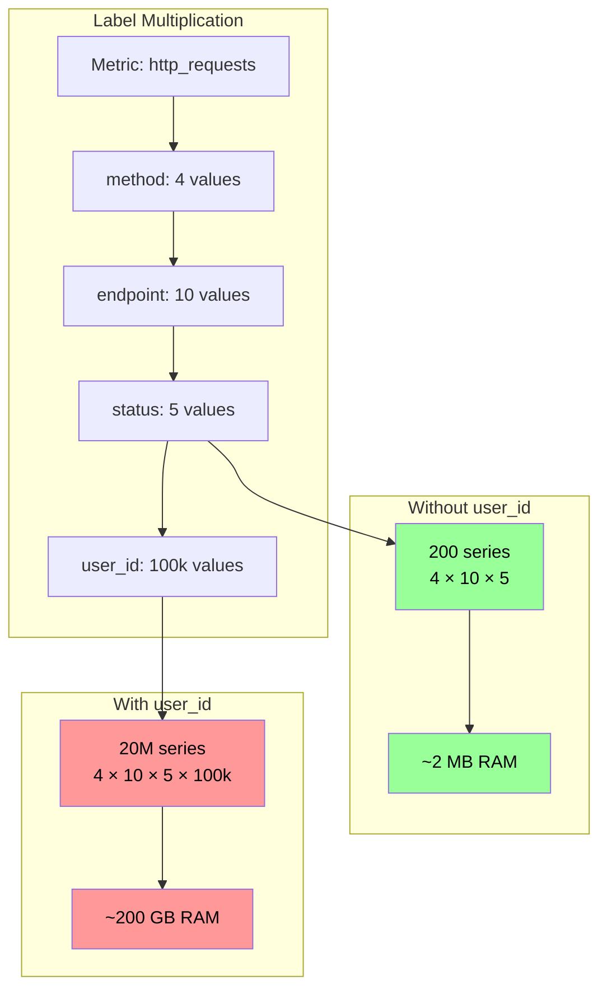

*[OOM]: Out of Memory
*[P99]: 99th Percentile
*[PromQL]: Prometheus Query Language
*[SLO]: Service Level Objective
*[SSD]: Solid State Drive
*[TSDB]: Time Series Database
*[UUID]: Universally Unique Identifier
*[WAL]: Write-Ahead Log

"Just add a label for debugging" is the most dangerous sentence in observability.

Every unique combination of metric name and label values creates a separate time series in Prometheus. A metric with three labels—each having 100 possible values—creates up to one million time series (100 × 100 × 100). Prometheus stores each time series independently, keeping recent data in memory. Cardinality isn't about the number of metrics you have; it's about the combinatorial explosion of label values.

I watched a team learn this the hard way. They instrumented their API with response time histograms and added labels for endpoint, status code, and user_id "for debugging." With 50 endpoints, 10 status codes, and 100,000 users, they'd created 50 million potential time series. Initially, only active users generated metrics—maybe 10,000 series. Prometheus hummed along. Over months, more users became active. Memory usage crept up. Then a marketing campaign drove a traffic spike. Memory usage jumped. Prometheus OOM'd. Monitoring went dark during the incident.

The fix took five minutes: remove user_id from the metric labels, add it to traces instead, implement cardinality limits. Prometheus stabilized at 50,000 series. The lesson took three days of firefighting to learn: labels are multiplicative, not additive.

<Callout type="warning">
A single unbounded label can destroy your Prometheus deployment. User IDs, request IDs, email addresses, IP addresses—any label that grows with your data will eventually exhaust memory. Design labels for known, bounded sets of values.
</Callout>

## Understanding Cardinality

### Time Series Math

A time series in Prometheus is defined by a unique combination of metric name plus all label name-value pairs. Change any label value, and you've created a new time series.

Consider a basic HTTP metrics setup:

```promql
http_requests_total{method="GET", endpoint="/api/users", status="200"}
http_requests_total{method="GET", endpoint="/api/users", status="404"}
http_requests_total{method="POST", endpoint="/api/users", status="200"}
```

Code: Each unique label combination creates a separate time series.

Three series. Now multiply: 5 HTTP methods × 20 endpoints × 10 status codes = 1,000 series. Still manageable. Add a `user_id` label with 100,000 possible values? Now you're looking at 10 billion potential series.

The math is straightforward but the implications aren't intuitive. Here's how quickly things escalate:

| Design | Labels | Values per Label | Total Series | Approx. Memory |
|--------|--------|------------------|--------------|----------------|
| Minimal | method, handler, status_class | 5 × 20 × 4 | 400 | ~4 MB |
| Reasonable | + environment, region | × 3 × 4 | 4,800 | ~48 MB |
| Dangerous | + user_id | × 100,000 | 480,000,000 | ~4.8 TB |

Table: Cardinality explosion by label design.

Histograms make this worse. A histogram with 10 buckets creates 12 series per unique label combination (10 bucket series plus `_sum` and `_count`). That "reasonable" 4,800-series design becomes 57,600 series when you switch from a counter to a histogram.

Memory estimation follows a rough formula: each active series consumes 1-3 KB for metadata, index entries, and the active chunk. A Prometheus instance with 16 GB of RAM can safely handle around 2 million active series. Push past that, and you're gambling on OOM during traffic spikes.



Figure: A single unbounded label transforms manageable metrics into infrastructure-killing cardinality.

### Prometheus Internals

Understanding why cardinality hurts requires knowing how Prometheus stores data. The TSDB architecture has two main components: the head block (in-memory, recent data) and persistent blocks (on-disk, historical data).

The head block holds the last two hours of data by default. Every active series—meaning any series that received at least one sample in that window—must have its metadata loaded in memory. This includes the series reference, label index entries, chunk references, and the active chunk itself.

When Prometheus restarts, it replays the WAL to rebuild the head block. High cardinality means slow startups—I've seen Prometheus instances take 15+ minutes to become ready because they were rebuilding indexes for millions of series.

Queries compound the problem. A query like `sum(rate(http_requests_total[5m])) by (user_id)` must load metadata for every matching series into memory, decompress chunks, and hold intermediate aggregation results. Even if your storage handles the cardinality, your queries might not.

The failure modes are predictable once you understand the architecture:

| Failure Mode | Symptoms | Root Cause |
|--------------|----------|------------|
| Gradual OOM | Memory steadily rising, restarts under load | Cardinality growing over time as more label values become active |
| Sudden OOM | Memory spike during incident, crash, monitoring blackout | Traffic spike activating previously dormant series |
| Query OOM | Specific dashboard or query crashes Prometheus | Query touching high-cardinality metric with aggregation |
| Slow startup | Minutes to start, high CPU during WAL replay | Rebuilding index for millions of series |

Table: Cardinality failure modes.

<Callout type="info">
Prometheus keeps metadata for ALL active series in memory, not just samples. A series that received one sample in the last 2 hours consumes nearly as much memory as one with thousands of samples. The cardinality cost is the series count, not the sample count.
</Callout>

## Label Design Principles

### Good vs Bad Labels

The difference between a good label and a bad one comes down to one question: can you enumerate all possible values before deployment? If you can list them exhaustively, it's probably safe. If the value set grows with your data—users, requests, sessions—it's toxic.

Good labels share four characteristics: bounded cardinality (you know the finite set of values), meaningful for aggregation (you'll actually `group by` or `sum by` this dimension), stable over time (values don't churn constantly), and shared across many series (the label adds structure, not just uniqueness).

| Label | Values | Cardinality | Why It Works |
|-------|--------|-------------|--------------|
| `http_method` | GET, POST, PUT, DELETE, PATCH | ~7 | Fixed set defined by HTTP spec |
| `environment` | production, staging, development | 3 | You control how many environments exist |
| `status_class` | 2xx, 3xx, 4xx, 5xx | 4 | Bucketed from individual codes |
| `region` | us-east-1, us-west-2, eu-west-1 | ~10 | Bounded by your infrastructure footprint |
| `service` | api, worker, scheduler | ~20 | You control how many services you deploy |

Table: Good label examples with bounded cardinality.

Bad labels grow without bound. User IDs scale with your user base. Request IDs are unique per request—literally infinite cardinality. IP addresses span billions of possibilities. Error messages are free-form strings. Any of these as labels will eventually kill your Prometheus instance.

| Label | Problem | Cardinality | Alternative |
|-------|---------|-------------|-------------|
| `user_id` | Grows with user base | Millions | Traces, logs |
| `request_id` | Unique per request | Infinite | Exemplars |
| `client_ip` | Huge address space | Billions | Log analysis |
| `error_message` | Free-form strings | Unbounded | Error codes (bucketed) |
| `email` | Unique per user, PII risk | Millions | Don't store in metrics |
| `query` | Dynamic SQL/GraphQL | Unbounded | Query hash or category |

Table: Bad label examples to avoid.

The decision framework is straightforward. First, ask: is the value set bounded and known? If no, stop—use traces or logs instead. If yes, ask: will you aggregate by this label? If no, you're adding cardinality without getting value in return. Consider removing it. If yes, ask: is it useful for alerting or SLOs? If it passes all three gates, it's a good label.

<Callout type="info">
A common question: should you use individual HTTP status codes (200, 401, 404, 500) or bucket them into classes (2xx, 4xx, 5xx)? Technically, individual codes are bounded—there are only about 70 defined HTTP status codes. Many teams use them directly and it works fine. But consider what you're actually querying. Most dashboards show "error rate" (4xx + 5xx) or "success rate" (2xx). Few alerts fire on 401 vs 403 specifically. If you need that granularity for debugging, individual codes are acceptable—just multiply your cardinality estimate by ~40 instead of 4. If your dashboards aggregate to classes anyway, skip the cardinality cost and bucket at the source.
</Callout>

### Practical Label Patterns

Theory is nice, but here's how this plays out in real code. The key technique is _normalization_: transforming dynamic, unbounded values into bounded categories before they become label values.

Take request paths. Your API serves `/api/users/123`, `/api/users/456`, and so on—thousands of unique paths. If you use the raw path as a label, you've created thousands of series. Instead, normalize paths to route patterns: `/api/users/123` becomes `/api/users/:id`. Now you have one series per route, not one per user.

The same principle applies to HTTP status codes. Individual status codes (200, 201, 400, 401, 404, 500, 502, 503...) create more series than you need for most dashboards. Bucketing into status classes (2xx, 3xx, 4xx, 5xx) gives you the error-rate visibility you actually use while keeping cardinality to four values.

```python title="label_patterns.py"
import re
from prometheus_client import Histogram, CollectorRegistry

registry = CollectorRegistry()

# HTTP metrics with bounded labels
http_request_duration = Histogram(
    'http_request_duration_seconds',
    'HTTP request duration in seconds',
    ['method', 'handler', 'status_class'],  # All bounded
    buckets=[0.01, 0.05, 0.1, 0.5, 1, 5],
    registry=registry
)

def record_request(method: str, path: str, status: int, duration: float):
    """Record request metrics with normalized labels."""
    http_request_duration.labels(
        method=normalize_method(method),       # Bounded: GET, POST, etc.
        handler=normalize_handler(path),       # Bounded: known routes
        status_class=normalize_status(status)  # Bounded: 2xx, 3xx, 4xx, 5xx
    ).observe(duration)

def normalize_method(method: str) -> str:
    """Normalize HTTP method to known set."""
    known = {'GET', 'POST', 'PUT', 'DELETE', 'PATCH', 'HEAD', 'OPTIONS'}
    upper = method.upper()
    return upper if upper in known else 'OTHER'

def normalize_handler(path: str) -> str:
    """Normalize path to route pattern (bounded)."""
    patterns = [
        (r'^/api/users/[^/]+$', '/api/users/:id'),
        (r'^/api/users$', '/api/users'),
        (r'^/api/orders/[^/]+/items$', '/api/orders/:id/items'),
        (r'^/api/orders/[^/]+$', '/api/orders/:id'),
        (r'^/api/orders$', '/api/orders'),
        (r'^/health$', '/health'),
    ]
    for pattern, handler in patterns:
        if re.match(pattern, path):
            return handler
    return 'unknown'  # Catch-all for unexpected paths

def normalize_status(status: int) -> str:
    """Normalize status code to class."""
    if status < 200: return '1xx'
    if status < 300: return '2xx'
    if status < 400: return '3xx'
    if status < 500: return '4xx'
    return '5xx'
```

Code: Label normalization in application instrumentation.

But what if you genuinely need the high-cardinality context? You still need to debug that one slow request for user 12345. This is where exemplars come in. An exemplar attaches a trace ID to a metric sample without creating a new time series. The metric aggregates normally for dashboards and alerts, but you can click through to the specific trace when investigating.

```python title="exemplar_pattern.py"
from prometheus_client import Histogram
from opentelemetry import trace

# Histogram with exemplar support
request_duration_with_exemplar = Histogram(
    'http_request_duration_with_exemplar_seconds',
    'Request duration with trace exemplar',
    ['method', 'handler', 'status_class'],
    buckets=[0.01, 0.05, 0.1, 0.5, 1, 5]
)

def record_with_exemplar(method: str, path: str, status: int, duration: float):
    """Record request with trace ID as exemplar."""
    # Get current trace context
    span = trace.get_current_span()
    trace_id = format(span.get_span_context().trace_id, '032x') if span else None

    # High-cardinality value goes in exemplar, not label
    request_duration_with_exemplar.labels(
        method=normalize_method(method),
        handler=normalize_handler(path),
        status_class=normalize_status(status)
    ).observe(duration, exemplar={'traceID': trace_id} if trace_id else None)
```

Code: Using exemplars for high-cardinality correlation.

Exemplars require explicit opt-in on the Prometheus side. You'll need to start Prometheus with `--enable-feature=exemplar-storage` and configure a tracing backend in `tracing_config`[^exemplar-setup]. Once enabled, Prometheus stores a limited number of exemplars per series (the most recent ones) alongside the metric data.

[^exemplar-setup]: Prometheus supports native integration with Jaeger, Grafana Tempo, and Zipkin via OpenTelemetry or vendor-specific protocols. The `tracing_config` section in prometheus.yml specifies how Prometheus itself emits traces (useful for debugging Prometheus), while the exemplar feature links _your_ application traces to metrics.

The real payoff comes in Grafana. When you're investigating a latency spike, you zoom into the affected time range on a histogram panel. Grafana shows exemplars as small diamonds along the graph. Each diamond represents a specific request that contributed to that bucket at that moment. Click one, and Grafana takes you directly to the corresponding trace in your tracing platform—no need to manually correlate timestamps or hunt through logs. It's the high-cardinality context you wanted, without the cardinality cost in your metrics.

<Callout type="warning">
If you need per-user or per-request visibility, use traces. Prometheus metrics are for aggregate views. Traces are for individual request debugging. Don't try to make metrics do what traces do—you'll just break your metrics.
</Callout>

### Server-Side Label Transformation

Prometheus relabeling lets you transform labels during ingestion—bucketing, renaming, or dropping them before they hit storage. This is essential for third-party exporters and legacy services you can't modify, but it's also valuable when you _do_ control your applications. Having a single source of authority for label transformations, in your Prometheus config, means everyone gets consistent labeling regardless of which SDK version they're running or whether they remembered to use your internal wrapper.

The `metric_relabel_configs` section in your scrape job runs after Prometheus receives metrics from a target. You can match label values with regex and rewrite them. Here's the pattern for transforming raw status codes into classes:

```yaml title="server-side-bucketing.yaml"
# prometheus.yml - server-side label transformation
scrape_configs:
  - job_name: 'legacy-app'
    static_configs:
      - targets: ['legacy-app:8080']

    metric_relabel_configs:
      # Transform raw status codes into classes
      - source_labels: [status_code]
        regex: '2..'
        target_label: status_class
        replacement: '2xx'
      # Repeat for 3xx, 4xx, 5xx with matching regex patterns
      # Drop the original high-cardinality label
      - regex: 'status_code'
        action: labeldrop

      # Normalize paths to route patterns
      - source_labels: [path]
        regex: '/api/users/[^/]+'
        target_label: handler
        replacement: '/api/users/:id'
      - source_labels: [path]
        regex: '/api/orders/[^/]+'
        target_label: handler
        replacement: '/api/orders/:id'
      - regex: 'path'
        action: labeldrop
```

Code: Server-side label bucketing via Prometheus relabeling.

This approach allows changing bucket definitions without touching application code. If you later decide to split `4xx` into `client_error` and `auth_error`, you update the Prometheus config and reload—no application deployments required.

The difference is visibility at the Prometheus instance level. When you bucket at the source (in application code), the raw values never exist in Prometheus—it only ever sees `status_class=2xx`. When you bucket server-side, Prometheus receives the raw `status_code=200` and transforms it during relabeling, but only the bucketed form hits storage. Both achieve the same cardinality outcome, and both allow changing definitions without touching application code (either update the SDK wrapper or update the Prometheus config).

### Managing Label Standards at Scale

When you have dozens of applications, consistency becomes a real challenge. Each team might implement normalization slightly differently—one uses `2xx`, another uses `success`, a third sends raw codes. Changing bucket definitions means coordinating deployments across all teams. This doesn't scale.

There are two approaches that work at scale, and they're not mutually exclusive.

**Centralized SDK wrappers.** Instead of letting each application implement its own normalization, provide a shared internal library. This wrapper around the Prometheus client handles all label transformations: status code bucketing, path normalization, method validation. Teams import your library instead of the raw Prometheus SDK. When you need to change bucket definitions, you update the library version once. Applications pick up the change on their next deployment cycle.

```python title="metrics_wrapper.py"
# Shared internal library for consistent metric labeling
from prometheus_client import Histogram
from typing import Callable

# Central definition of bucket mappings
STATUS_BUCKETS = {
    range(100, 200): '1xx',
    range(200, 300): '2xx',
    range(300, 400): '3xx',
    range(400, 500): '4xx',
    range(500, 600): '5xx',
}

def get_status_class(code: int) -> str:
    """Centralized status code bucketing - change here to change everywhere."""
    for code_range, bucket in STATUS_BUCKETS.items():
        if code in code_range:
            return bucket
    return 'unknown'

class StandardizedHttpMetrics:
    """Wrapper providing consistent HTTP metrics across all applications."""

    def __init__(self, service_name: str):
        self.duration = Histogram(
            'http_request_duration_seconds',
            'HTTP request duration',
            ['service', 'method', 'handler', 'status_class'],
            buckets=[0.01, 0.05, 0.1, 0.5, 1, 5]
        )
        self.service_name = service_name

    def observe(self, method: str, handler: str, status: int, duration: float):
        self.duration.labels(
            service=self.service_name,
            method=method.upper(),
            handler=handler,
            status_class=get_status_class(status)
        ).observe(duration)
```

Code: Centralized SDK wrapper for consistent labeling.

**Raw data with server-side bucketing.** The alternative is to flip the model entirely: have applications send raw label values, and do all bucketing in Prometheus or at query time. Applications emit `status_code=404`, and your Prometheus relabeling config (or recording rules) transforms it to `status_class=4xx`. Both approaches let you change bucket definitions without application deployments, but they differ operationally. The SDK wrapper approach requires maintaining the wrapper, managing version upgrades across teams, and coordinating during the transition when different applications run different wrapper versions. Server-side bucketing centralizes control in Prometheus config, but requires you to store higher-cardinality data.

```yaml title="recording-rules-bucketing.yaml"
# Recording rules for server-side bucketing
groups:
  - name: status_class_aggregation
    interval: 30s
    rules:
      - record: http:requests:by_status_class
        expr: |
          sum by (service, method, handler) (
            label_replace(
              http_requests_total{status_code=~"2.."},
              "status_class", "2xx", "", ""
            )
          )
        labels:
          status_class: "2xx"

      - record: http:requests:by_status_class
        expr: |
          sum by (service, method, handler) (
            label_replace(
              http_requests_total{status_code=~"4.."},
              "status_class", "4xx", "", ""
            )
          )
        labels:
          status_class: "4xx"
```

Code: Recording rules for flexible server-side bucketing.

The raw-data approach has trade-offs. You're storing higher cardinality in Prometheus (raw status codes), then aggregating it down via recording rules. This can use more memory and storage than bucketing at the source.[^relabel-storage] But if cardinality headroom isn't your constraint, the operational flexibility can be worth it—especially in organizations where coordinating application deployments is harder than updating infrastructure config.

[^relabel-storage]: This statement requires nuance. If you use `metric_relabel_configs` to transform labels (rather than recording rules), Prometheus applies the relabeling _before_ writing to the TSDB — only the normalized version hits disk. However, the high-cardinality data still creates operational issues during ingestion. For the duration of each scrape, Prometheus must hold the raw, un-normalized data in memory to process the relabeling rules. If thousands of targets send hundreds of unique status codes, this transient data can spike memory and CPU usage during the scrape phase. Complex regex patterns across millions of samples per second are CPU-intensive; if normalization logic is too complex, Prometheus may struggle to keep up, causing scrape gaps. The key distinction: _persistent storage_ sees only normalized data, but _ingestion memory_ briefly sees everything.

| Approach | Pros | Cons |
|----------|------|------|
| **SDK wrapper** | Lowest cardinality (bucketed at source), consistent behavior across apps, type-safe interfaces | Requires managing wrapper versions, upgrade coordination, transition period with mixed versions |
| **Server-side relabeling** | Single source of truth, no app changes needed, works with any exporter | Config complexity grows with edge cases, relabeling regex can incur high memory and CPU usage |
| **Raw data + recording rules** | Maximum flexibility, easy to change definitions, preserves raw data for debugging | Higher storage costs, more memory usage, recording rule maintenance |

Table: Label standardization approaches compared.

<Callout type="info">
Most organizations benefit from a hybrid approach: use a shared SDK wrapper for services you control, and server-side relabeling for third-party exporters and legacy applications you can't modify. Define your label schema upfront as part of your observability strategy, and treat deviations as technical debt.
</Callout>

## Cardinality Control

### Monitoring Cardinality

You can't manage what you don't measure. Before cardinality becomes a crisis, you need visibility into your current series count, growth trends, and which metrics are contributing the most.

The most important metric is `prometheus_tsdb_head_series`—the total count of active time series in the head block. This is the number that determines your memory footprint. Track it over time to spot gradual growth, and alert when it approaches your capacity limits.

Finding _which_ metrics are eating your cardinality budget requires a different query. The `count by (__name__)` aggregation groups all series by metric name, letting you identify the top offenders. More often than not, one or two metrics dominate—fixing those gives you most of your headroom back.

```promql title="cardinality-monitoring.promql"
# PromQL queries for cardinality monitoring

# === Total active series count ===
# Most important metric to watch
prometheus_tsdb_head_series

# Alert when approaching limits
# (alert on series count relative to available memory)

# === Cardinality by metric name ===
# Find which metrics contribute most series
topk(10, count by (__name__) ({__name__=~".+"}))

# === Series created in last hour ===
# Detect cardinality growth
increase(prometheus_tsdb_head_series_created_total[1h])

# === Memory usage ===
# Track head block memory (most affected by cardinality)
prometheus_tsdb_head_chunks_storage_size_bytes

# === Series churn (creation rate) ===
# High churn indicates ephemeral series (often high cardinality)
rate(prometheus_tsdb_head_series_created_total[5m])

# === Scrape samples (total samples scraped) ===
# High samples per scrape might indicate high cardinality
sum(scrape_samples_scraped) by (job)

# === Label value counts ===
# Count unique values per label (requires federation or custom exporter)
# This helps find which labels are exploding
```
Code: Cardinality monitoring queries.

Series churn—the rate at which new series are created—is another useful signal. High churn often indicates ephemeral labels (container IDs, short-lived job names) or a cardinality explosion in progress. A sudden spike in `prometheus_tsdb_head_series_created_total` after a deployment is a red flag worth investigating immediately.

Automate this visibility with alerts. You want to know about cardinality problems before they cause OOM, not after. The thresholds depend on your instance size, but the pattern is consistent: alert on absolute count (approaching capacity), growth rate (cardinality explosion), and per-scrape sample count (identifying the source).

The first category alerts on absolute series count. Set your warning threshold at roughly 70% of your comfortable capacity, and critical at the point where you're genuinely worried about stability. These numbers depend entirely on your hardware—a Prometheus with 64GB RAM can handle far more series than one with 8GB.

```yaml title="cardinality-alerting.yaml"
# Prometheus alerting rules for cardinality

groups:
  - name: cardinality_alerts
    rules:
      # Alert on total series count
      - alert: HighSeriesCount
        expr: prometheus_tsdb_head_series > 2000000
        for: 10m
        labels:
          severity: warning
        annotations:
          summary: "High time series count"
          description: "Prometheus has {{ $value }} active series. Investigate high-cardinality metrics."

      - alert: CriticalSeriesCount
        expr: prometheus_tsdb_head_series > 5000000
        for: 5m
        labels:
          severity: critical
        annotations:
          summary: "Critical time series count"
          description: "Prometheus has {{ $value }} series. Risk of OOM. Immediate action required."
```

Code: Series count threshold alerts.

Growth rate alerts catch cardinality explosions in progress. A 10% hourly increase might be normal during a deployment window, but sustained growth at that rate means you'll double your series count in about seven hours. The `for: 30m` clause filters out short-lived spikes.

```yaml title="cardinality-alerting-growth.yaml"
      # Alert on series growth rate
      - alert: RapidSeriesGrowth
        expr: |
          (prometheus_tsdb_head_series - prometheus_tsdb_head_series offset 1h)
          / prometheus_tsdb_head_series offset 1h > 0.1
        for: 30m
        labels:
          severity: warning
        annotations:
          summary: "Rapid series count growth"
          description: "Series count growing >10% per hour. Possible cardinality explosion."
```

Code: Series growth rate alert.

Memory-per-series alerts detect label bloat—when series have unusually long label values or many labels, they consume more memory than the series count alone would suggest. If you're using more than 5KB per series, something is probably wrong.

```yaml title="cardinality-alerting-memory.yaml"
      # Alert on high memory usage
      - alert: PrometheusMemoryHigh
        expr: |
          process_resident_memory_bytes{job="prometheus"}
          / on() prometheus_tsdb_head_series > 5000
        for: 15m
        labels:
          severity: warning
        annotations:
          summary: "High memory per series"
          description: "Memory usage per series is unusually high. Check for label bloat."
```

Code: Memory per series alert.

Finally, per-scrape alerts help you identify _which_ target is causing the problem. When a single scrape returns 50,000 samples, that target deserves investigation—either it's genuinely high-cardinality, or something is misconfigured.

```yaml title="cardinality-alerting-scrape.yaml"
      # Alert on scrape failures (might indicate cardinality issues)
      - alert: ScrapeHighCardinality
        expr: scrape_samples_scraped > 50000
        for: 10m
        labels:
          severity: warning
        annotations:
          summary: "High sample count from scrape"
          description: "Job {{ $labels.job }} returning {{ $value }} samples. Possible high cardinality."
```

Code: High-cardinality scrape alert.

### Ingestion and Query Limits

Even with good label hygiene and server-side normalization, you need hard limits as a safety net. Prometheus provides several configuration options to cap cardinality at ingestion time, protecting you from accidental explosions and misbehaving third-party exporters.

The `sample_limit` per scrape job is your first line of defense. If a target suddenly starts returning 100,000 samples instead of 1,000, Prometheus will reject the entire scrape rather than ingesting the explosion. This fails loudly—you'll see scrape failures in your monitoring—rather than silently eating memory until OOM.

```yaml title="prometheus-limits.yaml"
# prometheus.yml - cardinality protection limits
scrape_configs:
  - job_name: 'application'
    static_configs:
      - targets: ['app:8080']
    # Limit samples per scrape (protects against explosion)
    sample_limit: 10000
    # Limit label count per series
    label_limit: 30
    # Limit label name length
    label_name_length_limit: 128
    # Limit label value length
    label_value_length_limit: 512

  - job_name: 'high-cardinality-app'
    static_configs:
      - targets: ['risky-app:8080']
    # Stricter limits for known-risky apps
    sample_limit: 5000

    # Drop metrics with known bad patterns
    metric_relabel_configs:
      - source_labels: [__name__]
        regex: 'expensive_metric_.*'
        action: drop
      # Drop specific high-cardinality labels as a guardrail
      - regex: 'user_id|request_id|trace_id'
        action: labeldrop
```

Code: Scrape-time cardinality limits.

Query-side limits provide a final safety net. Setting `query.max-samples` prevents a single expensive query from consuming all available memory—useful when someone writes a dashboard panel that accidentally touches millions of series. The `query.timeout` ensures runaway queries eventually terminate rather than blocking resources indefinitely.

```bash title="prometheus-query-flags.sh"
# Prometheus startup with query protection flags
prometheus \
  --config.file=/etc/prometheus/prometheus.yml \
  --query.max-samples=50000000 \
  --query.timeout=2m \
  --query.max-concurrency=20
```

Code: Query-time limits via command-line flags.

The protection layers work together: application code and shared libraries prevent cardinality at the source, server-side transformation normalizes third-party metrics, scrape limits cap exposure to misbehaving targets, query limits protect against expensive aggregations, and alerts give you visibility into violations.

<Callout type="success">
Defense in depth works because each layer catches different failure modes. Application code handles intentional design. Relabeling catches third-party exporters you don't control. Scrape limits stop explosions from targets you haven't instrumented yet. Query limits protect against dashboard mistakes. Alerts ensure you know when something slips through.
</Callout>

## Aggregation Strategies

Everything we've covered so far focuses on preventing high cardinality at the source. But what about metrics that are _legitimately_ high-cardinality? Recording rules let you pre-compute aggregations, reducing cardinality at query time without losing the ability to drill down when needed.

### Recording Rules for Cardinality Reduction

Recording rules evaluate a PromQL expression at regular intervals and store the result as a new time series. The key insight: you can aggregate across high-cardinality dimensions in the recording rule, producing a low-cardinality result that dashboards and alerts query instead of the raw data.

Consider HTTP request metrics with handler, method, status_class, and instance labels. A dashboard showing "requests per second by handler" doesn't need the instance dimension—it's aggregating across all instances anyway. A recording rule can pre-compute this aggregation:

```yaml title="recording-rules-aggregation.yaml"
# Recording rules to reduce query-time cardinality

groups:
  - name: cardinality_reduction
    interval: 30s
    rules:
      # Aggregate request rate by handler only (drop instance, pod labels)
      - record: http:request_rate:by_handler
        expr: sum(rate(http_request_duration_seconds_count[5m])) by (handler)

      # Pre-calculate percentiles (avoids querying all histogram buckets)
      - record: http:request_duration:p99
        expr: histogram_quantile(0.99, sum(rate(http_request_duration_seconds_bucket[5m])) by (le, handler))

      - record: http:request_duration:p50
        expr: histogram_quantile(0.50, sum(rate(http_request_duration_seconds_bucket[5m])) by (le, handler))
```

Code: Recording rules that aggregate across instance dimensions.

The naming convention matters. Prometheus convention uses colons to indicate recording rules: `level:metric:operations`. The `http:request_rate:by_handler` name tells you it's a recording rule derived from HTTP metrics, computing a rate, grouped by handler. This convention helps you distinguish raw metrics from pre-aggregated ones in dashboards and alerts.

Histogram quantiles are particularly expensive without recording rules. Computing p99 latency across millions of histogram buckets at query time is slow and resource-intensive. A recording rule that pre-computes the quantile every 30 seconds makes the dashboard query trivial—it's just reading the stored result.

```yaml title="recording-rules-slo.yaml"
  - name: slo_metrics
    interval: 30s
    rules:
      # SLO availability with minimal cardinality (one series per service)
      - record: slo:availability:ratio
        expr: |
          sum(rate(http_request_duration_seconds_count{status_class="2xx"}[5m])) by (service)
          / sum(rate(http_request_duration_seconds_count[5m])) by (service)

      # SLO latency target (what % of requests meet the target)
      - record: slo:latency_target:ratio
        expr: |
          sum(rate(http_request_duration_seconds_bucket{le="0.5"}[5m])) by (service)
          / sum(rate(http_request_duration_seconds_count[5m])) by (service)
```

Code: SLO metrics as recording rules.

SLO metrics are a perfect use case. Your SLO dashboard doesn't need per-instance, per-handler breakdowns—it needs one number per service. Recording rules produce exactly that: a single time series per service, updated every 30 seconds, ready for instant querying.

### Hierarchical Aggregation

For multi-cluster or multi-region deployments, hierarchical aggregation prevents cardinality from scaling linearly with infrastructure size. The pattern: edge Prometheus instances scrape all the raw metrics, compute aggregates via recording rules, and expose only those aggregates for federation.

```yaml title="hierarchical-aggregation.yaml"
# Edge Prometheus (runs in each cluster)
groups:
  - name: cluster_aggregates
    rules:
      # Roll up pod-level to service-level
      - record: service:cpu_usage:avg
        expr: avg(rate(container_cpu_usage_seconds_total[5m])) by (namespace, service)

      - record: service:memory_usage:bytes
        expr: sum(container_memory_working_set_bytes) by (namespace, service)

      - record: service:request_rate:sum
        expr: sum(rate(http_requests_total[5m])) by (namespace, service, method)
```

Code: Edge recording rules for cluster-level aggregation.

The central Prometheus federates _only_ the recording rule results:

```yaml title="federation-config.yaml"
# Central Prometheus - federates aggregates from edge instances
scrape_configs:
  - job_name: 'federate'
    honor_labels: true
    metrics_path: '/federate'
    params:
      'match[]':
        - '{__name__=~"service:.*"}'  # Service-level aggregates only
        - '{__name__=~"slo:.*"}'      # SLO metrics
    static_configs:
      - targets:
        - 'prometheus-cluster-east:9090'
        - 'prometheus-cluster-west:9090'
```

Code: Federation config for pulling aggregated metrics.

The cardinality math changes dramatically. If each cluster has 1,000 pods and 50 services, the edge Prometheus handles 1,000 series for pod metrics. The central Prometheus only sees 50 series (one per service). Scale to 10 clusters, and central still has just 500 service-level series instead of 10,000 pod-level series.

### Remote Write Filtering

Long-term storage doesn't need high-cardinality raw metrics—those are for recent debugging. Remote write filtering lets you send only aggregated metrics to durable storage while keeping full-resolution data locally for short-term retention.

```yaml title="remote-write-filtering.yaml"
# Send only low-cardinality aggregates to long-term storage
remote_write:
  - url: "https://long-term-storage.example.com/write"
    write_relabel_configs:
      # Keep only recording rule results
      - source_labels: [__name__]
        regex: '(slo|service|job):.*'
        action: keep

      # Explicitly drop raw high-cardinality metrics
      - source_labels: [__name__]
        regex: 'http_request_duration_seconds.*'
        action: drop

      # Drop instance-level granularity
      - regex: 'instance|pod|container_id'
        action: labeldrop
```

Code: Remote write config with cardinality filtering.

This gives you the best of both worlds: full detail locally for troubleshooting recent issues, aggregated data in long-term storage for capacity planning and historical trends. The cost savings on long-term storage can be substantial—you're storing orders of magnitude fewer series.

| Strategy | Use Case | Cardinality Impact |
|----------|----------|-------------------|
| Recording rules | Pre-aggregate for dashboards/alerts | Reduces query-time cardinality |
| Federation | Multi-cluster aggregation | Central sees only aggregates |
| Remote write filtering | Long-term storage | Only ships low-cardinality metrics |
| Hierarchical aggregation | Large-scale deployments | Prevents linear scaling |

Table: Aggregation strategy comparison.

<Callout type="info">
Recording rules don't reduce ingestion cardinality—they _add_ pre-computed aggregates. The benefit is query performance: dashboards query the low-cardinality recording rule instead of aggregating millions of raw series at query time. Combine with metric dropping if you need to reduce ingestion.
</Callout>

## Emergency Response

When Prometheus starts OOMing or queries grind to a halt, you're in incident response mode. The goal shifts from "understand the problem" to "restore monitoring as fast as possible." You can investigate root cause after stability returns.

### Immediate Stabilization

The symptoms are usually obvious: Prometheus restarts repeatedly (OOM killed), memory usage spikes toward limits, queries timeout or return errors, scrape success rates drop. If you're seeing any of these, assume cardinality until proven otherwise.

First priority: get Prometheus running again, even if degraded. Restart the pod to clear the head block and start fresh. If it immediately OOMs again, you need to reduce what it's ingesting before it can stabilize.

```bash title="stabilization.sh"
# Restart Prometheus (clears head block, gives temporary breathing room)
kubectl rollout restart deployment/prometheus -n monitoring

# If it keeps OOMing, temporarily increase memory limits
kubectl set resources deployment/prometheus -n monitoring \
  --limits=memory=16Gi

# Check if it's staying up
kubectl get pods -n monitoring -w
```

Code: Emergency stabilization commands.

If Prometheus won't stay up long enough to query, you need to reduce ingestion _before_ it starts. Edit the Prometheus config to drop suspected high-cardinality metrics entirely, then restart. You can refine this later; right now you need monitoring back online.

### Identifying the Source

Once Prometheus is stable enough to query, find what's eating your cardinality budget. The `topk` query against `count by (__name__)` shows which metrics have the most series. In most cardinality explosions, one or two metrics dominate—fixing those gives you most of your headroom back.

```promql title="identify-source.promql"
# Top 10 metrics by series count
topk(10, count by (__name__) ({__name__=~".+"}))

# Total active series
prometheus_tsdb_head_series

# Series created in the last hour (shows where growth is coming from)
increase(prometheus_tsdb_head_series_created_total[1h])

# Series churn rate (high churn = ephemeral labels)
rate(prometheus_tsdb_head_series_created_total[5m])
```

Code: Queries to identify cardinality sources.

If Prometheus is too unstable to query, `promtool tsdb analyze` can examine the data directory directly. This works even when Prometheus isn't running.

```bash title="tsdb-analyze.sh"
# Analyze TSDB directly (works offline)
promtool tsdb analyze /prometheus/data

# Output shows:
# - Total series count
# - Top metrics by series
# - Label cardinality breakdown
```

Code: Offline TSDB analysis.

Correlate what you find with recent changes. Check deployment history: what went out in the last 24–48 hours? New services, updated exporters, changed instrumentation—any of these can introduce unbounded labels.

### Emergency Relabeling

Once you've identified the problematic metric or label, stop ingesting it via `metric_relabel_configs`. This takes effect on config reload—no restart required, no data loss for other metrics.

```yaml title="emergency-drop.yaml"
# Add to scrape_configs for the affected job
metric_relabel_configs:
  # Drop an entire metric
  - source_labels: [__name__]
    regex: 'problematic_metric_name'
    action: drop

  # Drop a specific high-cardinality label
  - regex: 'user_id|request_id|trace_id'
    action: labeldrop

  # Keep only production data (drop staging/dev if they're contributing)
  - source_labels: [environment]
    regex: 'production'
    action: keep
```

Code: Emergency relabeling to stop cardinality bleeding.

Apply the config and trigger a reload:

```bash title="apply-config.sh"
# Apply updated ConfigMap
kubectl apply -f prometheus-config.yaml

# Trigger reload (if using Prometheus Operator)
kubectl exec -n monitoring prometheus-0 -- kill -HUP 1

# Or via HTTP endpoint if enabled
curl -X POST http://prometheus:9090/-/reload
```

Code: Applying emergency config changes.

Monitor series count after the reload. It should start dropping as old series age out and new high-cardinality data stops arriving. The head block won't shrink immediately—it takes a few hours for stale series to be garbage collected.

### Post-Incident Prevention

After the crisis, conduct a proper root cause analysis. The questions that matter: which metric exploded, which label was unbounded, when was it introduced, and why wasn't it caught before production?

Prevent recurrence with process changes:

- **Code review**: Add cardinality review to your PR checklist. Require justification for every new label: "what bounded set of values will this have?"
- **CI/CD gates**: Lint metric definitions for unbounded patterns. Flag any label that looks like an ID, UUID, email, or IP address.
- **Metric unit testing**: Write unit tests that exercise metric instrumentation. If a test generates label combinations in a loop, fail the build when unique series exceed a threshold. This catches cardinality bugs before they reach production.
- **Staging validation**: Deploy to staging first and check cardinality growth before promoting to production.
- **Monitoring**: Alert on series count approaching limits _and_ on growth rate. A 10% hourly increase that goes unnoticed for a day means you've doubled.
- **Documentation**: Maintain an approved label schema. Document cardinality budgets per service.

<Callout type="danger">
During a cardinality crisis, your first priority is restoring monitoring, not fixing root cause. Drop the problematic metric via relabeling immediately, then investigate. You can always re-enable it after the fix is in place.
</Callout>

## Conclusion

High-cardinality metrics are Prometheus's most common failure mode, and they're entirely preventable. The math is unforgiving: labels multiply, not add. A metric with five labels averaging ten values each creates 100,000 potential series. Add one unbounded label—user IDs, request IDs, email addresses—and you've created a time bomb.

The teams that run Prometheus successfully treat label design with the same rigor as database schema design. Every label must answer two questions: what bounded set of values will this have, and what aggregation does it enable? If you can't answer both, don't add the label. Use traces for high-cardinality debugging. Use exemplars to link metrics to specific requests without cardinality cost.

Defense in depth protects you when prevention fails. Normalize labels at the source with shared SDK wrappers. Transform third-party metrics with server-side relabeling. Set hard limits on samples per scrape. Alert on series count and growth rate before you hit memory limits. Keep emergency relabeling configs ready to drop problematic metrics within minutes.

I've never seen a cardinality incident that wasn't preventable. The unbounded label was always obvious in hindsight—a user_id someone added "temporarily," an error_message label that seemed harmless, a path that wasn't normalized. The teams that avoid these incidents aren't smarter; they just have better guardrails. They review labels in PRs, alert on series growth, and keep emergency configs ready.

Don't wait for the 3 AM page. Audit your metrics now. Find the labels that grow with your data. Fix them before they fix you.
