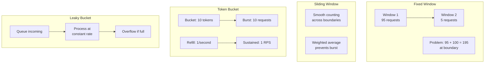
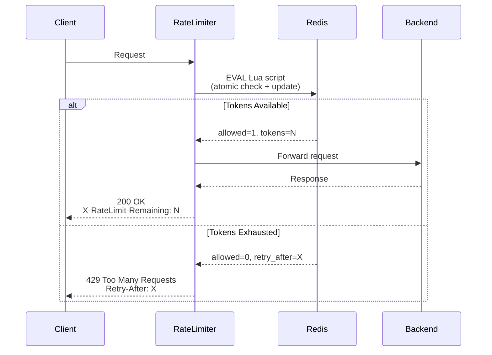
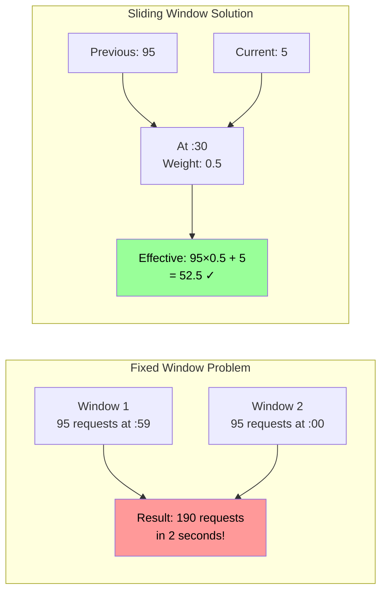

*[API]: Application Programming Interface
*[RPS]: Requests Per Second
*[QPS]: Queries Per Second
*[HTTP]: Hypertext Transfer Protocol
*[TTL]: Time To Live
*[DDoS]: Distributed Denial of Service
*[IP]: Internet Protocol
*[JWT]: JSON Web Token
*[SLA]: Service Level Agreement
*[P99]: 99th Percentile
*[LRU]: Least Recently Used

# Rate Limiting Done Right: Protecting Users From Yourself

## Introduction

Frame rate limiting as a double-edged sword: it protects your systems from overload and abuse, but misconfigured rate limits become a self-inflicted outage. The naive approach—"block anything over 100 requests per minute"—fails during legitimate traffic spikes, punishes power users, and doesn't actually stop sophisticated attackers. This section establishes that rate limiting isn't about saying "no"—it's about saying "not yet" in a way that maintains service quality for everyone. The algorithms matter: token bucket, leaky bucket, sliding window, and fixed window each have different behaviors during bursts. The implementation matters even more: where you limit, how you identify clients, what happens when limits are hit, and how you communicate constraints to callers.

_Include a scenario: a team implements per-IP rate limiting at 100 requests/minute to prevent abuse. A customer behind corporate NAT reports they can't use the service—500 employees sharing one IP means each person gets 0.2 requests per minute. They switch to API key-based limiting with per-key quotas. A viral moment hits—legitimate traffic spikes 10x. Fixed-window rate limiting rejects 90% of requests at minute boundaries. They switch to sliding window with token bucket. Same spike: requests queue briefly, smooth throughput, everyone gets served. The lesson: rate limiting is about traffic shaping, not just blocking._

<Callout type="warning">
Rate limits that work fine under normal load often become the bottleneck during incidents. Design for burst handling, not just steady-state. Your rate limiter should protect services, not prevent recovery.
</Callout>

## Rate Limiting Fundamentals

### Why Rate Limit

```yaml title="rate-limiting-purposes.yaml"
# Rate limiting objectives

protection_objectives:
  resource_protection:
    description: "Prevent individual clients from monopolizing resources"
    examples:
      - "CPU-intensive endpoints"
      - "Database-heavy queries"
      - "Memory-consuming operations"
    without_limits: |
      One client's bulk operation exhausts connection pool
      All other clients experience errors

  fairness:
    description: "Ensure equitable access across all clients"
    examples:
      - "API quota per customer tier"
      - "Bandwidth allocation"
      - "Concurrent request limits"
    without_limits: |
      Large customers crowd out small ones
      Free tier abuse impacts paying customers

  abuse_prevention:
    description: "Stop malicious or buggy clients"
    examples:
      - "Credential stuffing attacks"
      - "Scraping attempts"
      - "Runaway retry loops"
    without_limits: |
      Attackers enumerate your database
      Buggy clients DDoS your service

  cost_control:
    description: "Limit expensive operations"
    examples:
      - "Third-party API calls"
      - "ML inference requests"
      - "Storage operations"
    without_limits: |
      Runaway costs from unbounded usage
      Surprise bills from compromised keys

---
# What rate limiting is NOT
misconceptions:
  not_security:
    misconception: "Rate limiting prevents attacks"
    reality: |
      Rate limiting slows attacks, doesn't prevent them
      Determined attackers distribute across IPs
      Use rate limiting + authentication + WAF

  not_scaling:
    misconception: "Rate limiting handles load"
    reality: |
      Rate limiting sheds load, doesn't handle it
      You still need scaling for legitimate traffic
      Rate limits are backstop, not primary capacity

  not_sla:
    misconception: "Rate limiting guarantees availability"
    reality: |
      Rate limiting helps but doesn't guarantee
      Backend failures still cause errors
      Rate limits only control request volume
```
Code: Rate limiting purposes and misconceptions.

### Algorithm Overview

```yaml title="algorithm-comparison.yaml"
# Rate limiting algorithm comparison

algorithms:
  fixed_window:
    description: "Count requests in fixed time windows"
    mechanism: |
      Window: 1 minute starting at :00
      Counter increments with each request
      Resets to 0 at window boundary
    pros:
      - "Simple to implement"
      - "Low memory (one counter per key)"
      - "Easy to understand"
    cons:
      - "Burst at window boundaries (2x limit possible)"
      - "Uneven distribution within window"
    use_when: "Simple use cases, exact counts less important"

  sliding_window_log:
    description: "Track timestamp of each request"
    mechanism: |
      Store timestamp of every request
      Count requests in trailing window
      Remove expired timestamps
    pros:
      - "Accurate rate calculation"
      - "No boundary burst problem"
    cons:
      - "High memory (store all timestamps)"
      - "O(n) cleanup overhead"
    use_when: "Accuracy critical, low request volume"

  sliding_window_counter:
    description: "Weighted average of current and previous window"
    mechanism: |
      Track count for current and previous window
      Weight by position within current window
      rate = prev_count * (1 - elapsed%) + curr_count
    pros:
      - "Low memory (two counters per key)"
      - "Smooths boundary bursts"
    cons:
      - "Approximate (not exact count)"
    use_when: "Balance of accuracy and efficiency"

  token_bucket:
    description: "Tokens added at fixed rate, consumed per request"
    mechanism: |
      Bucket holds up to N tokens (burst capacity)
      Tokens added at rate R per second
      Request consumes token if available
    pros:
      - "Allows controlled bursts"
      - "Smooth rate over time"
      - "Configurable burst vs sustained rate"
    cons:
      - "More complex to implement"
      - "Two parameters to tune (rate + burst)"
    use_when: "Need burst handling, sustained rate control"

  leaky_bucket:
    description: "Requests queue, processed at fixed rate"
    mechanism: |
      Requests enter bucket (queue)
      Processed (leak) at constant rate
      Overflow when bucket full
    pros:
      - "Perfectly smooth output rate"
      - "Natural queuing behavior"
    cons:
      - "Adds latency (queuing)"
      - "Requires queue management"
    use_when: "Smooth output critical, latency acceptable"

---
# Choosing an algorithm
decision_guide:
  simple_quota: "Fixed window"
  smooth_rate: "Sliding window counter"
  burst_tolerance: "Token bucket"
  constant_output: "Leaky bucket"
  accuracy_critical: "Sliding window log"
```
Code: Rate limiting algorithm comparison.


Figure: Rate limiting algorithm behaviors.

<Callout type="info">
Token bucket is the most versatile algorithm for API rate limiting. It allows bursts (good for user experience) while maintaining a sustained rate (protects backend). Most production rate limiters use token bucket or sliding window.
</Callout>

## Token Bucket Implementation

### Algorithm Deep Dive

```yaml title="token-bucket-theory.yaml"
# Token bucket algorithm details

parameters:
  bucket_capacity:
    symbol: "B"
    description: "Maximum tokens in bucket"
    controls: "Maximum burst size"
    typical_values: "10-1000 depending on use case"

  refill_rate:
    symbol: "R"
    description: "Tokens added per second"
    controls: "Sustained request rate"
    typical_values: "1-1000 per second"

  tokens_per_request:
    symbol: "C"
    description: "Tokens consumed per request"
    controls: "Request cost (can vary by endpoint)"
    typical_values: "1 for simple, variable for weighted"

behavior:
  initial_state:
    tokens: "B (full bucket)"

  on_request:
    1: "Calculate tokens to add since last request"
    2: "Add tokens (cap at bucket capacity)"
    3: "If tokens >= cost: allow, subtract cost"
    4: "If tokens < cost: reject or queue"

  refill_calculation: |
    time_elapsed = now - last_update
    tokens_to_add = time_elapsed * refill_rate
    new_tokens = min(current_tokens + tokens_to_add, bucket_capacity)

---
# Example scenarios
scenarios:
  steady_traffic:
    rate: "1 RPS"
    bucket: "10 tokens, 1/s refill"
    result: "Every request allowed (token regenerates before next)"

  burst_traffic:
    rate: "10 requests instantly"
    bucket: "10 tokens, 1/s refill"
    result: "All 10 allowed (bucket drains), then 1 RPS until refilled"

  sustained_overload:
    rate: "2 RPS continuously"
    bucket: "10 tokens, 1/s refill"
    result: |
      First 10 seconds: 20 requests, ~15 allowed (10 burst + 5 refill)
      After: 1 RPS allowed, 1 RPS rejected

  variable_cost:
    costs:
      GET: "1 token"
      POST: "5 tokens"
      expensive_query: "10 tokens"
    bucket: "100 tokens, 10/s refill"
    result: "Heavy operations limited more strictly"
```
Code: Token bucket theory.

### Production Implementation

```typescript title="token-bucket.ts"
// Production token bucket implementation

interface TokenBucketConfig {
  capacity: number;      // Maximum tokens (burst limit)
  refillRate: number;    // Tokens per second (sustained rate)
  costPerRequest?: number;  // Default token cost
}

interface BucketState {
  tokens: number;
  lastUpdate: number;  // Unix timestamp in ms
}

class TokenBucket {
  private config: Required<TokenBucketConfig>;

  constructor(config: TokenBucketConfig) {
    this.config = {
      capacity: config.capacity,
      refillRate: config.refillRate,
      costPerRequest: config.costPerRequest ?? 1,
    };
  }

  /**
   * Check if request is allowed and consume tokens if so.
   * Returns { allowed, remainingTokens, retryAfterMs }
   */
  consume(state: BucketState, cost?: number): {
    allowed: boolean;
    newState: BucketState;
    remainingTokens: number;
    retryAfterMs: number | null;
  } {
    const requestCost = cost ?? this.config.costPerRequest;
    const now = Date.now();

    // Calculate tokens to add since last update
    const elapsed = (now - state.lastUpdate) / 1000; // seconds
    const tokensToAdd = elapsed * this.config.refillRate;
    const currentTokens = Math.min(
      state.tokens + tokensToAdd,
      this.config.capacity
    );

    if (currentTokens >= requestCost) {
      // Allow request, consume tokens
      const newTokens = currentTokens - requestCost;
      return {
        allowed: true,
        newState: { tokens: newTokens, lastUpdate: now },
        remainingTokens: newTokens,
        retryAfterMs: null,
      };
    } else {
      // Reject request, calculate retry time
      const tokensNeeded = requestCost - currentTokens;
      const retryAfterMs = Math.ceil((tokensNeeded / this.config.refillRate) * 1000);
      return {
        allowed: false,
        newState: { tokens: currentTokens, lastUpdate: now },
        remainingTokens: currentTokens,
        retryAfterMs,
      };
    }
  }

  /**
   * Create initial bucket state (full bucket)
   */
  createInitialState(): BucketState {
    return {
      tokens: this.config.capacity,
      lastUpdate: Date.now(),
    };
  }

  /**
   * Get current token count without consuming
   */
  peek(state: BucketState): number {
    const elapsed = (Date.now() - state.lastUpdate) / 1000;
    const tokensToAdd = elapsed * this.config.refillRate;
    return Math.min(state.tokens + tokensToAdd, this.config.capacity);
  }
}

// === Redis-backed distributed implementation ===

import Redis from 'ioredis';

class DistributedTokenBucket {
  private redis: Redis;
  private config: Required<TokenBucketConfig>;
  private keyPrefix: string;

  // Lua script for atomic token bucket operation
  private static LUA_SCRIPT = `
    local key = KEYS[1]
    local capacity = tonumber(ARGV[1])
    local refill_rate = tonumber(ARGV[2])
    local cost = tonumber(ARGV[3])
    local now = tonumber(ARGV[4])
    local ttl = tonumber(ARGV[5])

    -- Get current state
    local state = redis.call('HMGET', key, 'tokens', 'last_update')
    local tokens = tonumber(state[1]) or capacity
    local last_update = tonumber(state[2]) or now

    -- Calculate refill
    local elapsed = (now - last_update) / 1000
    tokens = math.min(tokens + (elapsed * refill_rate), capacity)

    local allowed = 0
    local retry_after = 0

    if tokens >= cost then
      tokens = tokens - cost
      allowed = 1
    else
      local needed = cost - tokens
      retry_after = math.ceil((needed / refill_rate) * 1000)
    end

    -- Update state
    redis.call('HMSET', key, 'tokens', tokens, 'last_update', now)
    redis.call('EXPIRE', key, ttl)

    return {allowed, tokens, retry_after}
  `;

  constructor(redis: Redis, config: TokenBucketConfig, keyPrefix = 'ratelimit') {
    this.redis = redis;
    this.config = {
      capacity: config.capacity,
      refillRate: config.refillRate,
      costPerRequest: config.costPerRequest ?? 1,
    };
    this.keyPrefix = keyPrefix;
  }

  async consume(identifier: string, cost?: number): Promise<{
    allowed: boolean;
    remainingTokens: number;
    retryAfterMs: number | null;
  }> {
    const key = `${this.keyPrefix}:${identifier}`;
    const requestCost = cost ?? this.config.costPerRequest;
    const now = Date.now();
    const ttl = Math.ceil(this.config.capacity / this.config.refillRate) + 60;

    const result = await this.redis.eval(
      DistributedTokenBucket.LUA_SCRIPT,
      1,
      key,
      this.config.capacity,
      this.config.refillRate,
      requestCost,
      now,
      ttl
    ) as [number, number, number];

    const [allowed, tokens, retryAfter] = result;

    return {
      allowed: allowed === 1,
      remainingTokens: Math.floor(tokens),
      retryAfterMs: allowed === 1 ? null : retryAfter,
    };
  }
}

export { TokenBucket, DistributedTokenBucket, TokenBucketConfig, BucketState };
```
Code: Token bucket implementation.


Figure: Distributed rate limiting flow.

<Callout type="success">
Always use Lua scripts for Redis-based rate limiting. Multiple round trips create race conditions where concurrent requests can exceed limits. The Lua script ensures atomic read-modify-write.
</Callout>

## Leaky Bucket Implementation

### Algorithm Deep Dive

```yaml title="leaky-bucket-theory.yaml"
# Leaky bucket algorithm details

parameters:
  bucket_size:
    symbol: "B"
    description: "Maximum queue depth"
    controls: "How many requests can wait"

  leak_rate:
    symbol: "R"
    description: "Requests processed per second"
    controls: "Output rate (constant)"

behavior:
  concept: |
    Imagine a bucket with a hole at the bottom.
    Water (requests) enters the top.
    Water leaks out at a constant rate.
    If bucket overflows, water is lost (requests rejected).

  on_request:
    1: "Calculate water leaked since last check"
    2: "Subtract leaked amount from current level"
    3: "If room in bucket: add request, accept"
    4: "If bucket full: reject request"

  key_difference_from_token_bucket: |
    Token bucket: controls input rate, allows bursts
    Leaky bucket: controls output rate, smooths traffic

    Token bucket: "You can make 10 requests now, then wait"
    Leaky bucket: "Your request is queued, processed in order"

---
# Use cases
use_cases:
  traffic_shaping:
    scenario: "Smooth bursty traffic to downstream service"
    benefit: "Downstream sees constant load"
    example: "Message queue consumer rate limiting"

  api_gateway:
    scenario: "Protect backend from traffic spikes"
    benefit: "Backend capacity never exceeded"
    example: "Mobile app sync during peak hours"

  cost_control:
    scenario: "Third-party API with per-second limits"
    benefit: "Never exceed downstream rate limit"
    example: "Payment processor integration"

---
# Comparison scenarios
comparison:
  burst_of_10_requests:
    token_bucket:
      config: "10 tokens, 1/s refill"
      result: "All 10 served immediately"
      latency: "~0ms for all"

    leaky_bucket:
      config: "10 queue, 1/s leak"
      result: "Queued, served over 10 seconds"
      latency: "0ms, 1s, 2s, ... 9s"

  sustained_2_rps:
    token_bucket:
      config: "10 tokens, 1/s refill"
      result: "First 10 fast, then 50% rejected"

    leaky_bucket:
      config: "10 queue, 1/s leak"
      result: "Queue grows, then overflows"
      latency: "Increases until rejection"
```
Code: Leaky bucket theory.

### Implementation

```typescript title="leaky-bucket.ts"
// Leaky bucket implementation

interface LeakyBucketConfig {
  bucketSize: number;   // Maximum queue depth
  leakRate: number;     // Requests per second to process
}

interface LeakyBucketState {
  level: number;        // Current water level (queued requests)
  lastLeak: number;     // Last time we leaked (processed)
}

class LeakyBucket {
  private config: LeakyBucketConfig;

  constructor(config: LeakyBucketConfig) {
    this.config = config;
  }

  /**
   * Try to add a request to the bucket.
   * Returns whether request was accepted and queue position.
   */
  add(state: LeakyBucketState): {
    accepted: boolean;
    newState: LeakyBucketState;
    queuePosition: number | null;
    estimatedWaitMs: number | null;
  } {
    const now = Date.now();

    // Calculate how much has leaked since last check
    const elapsed = (now - state.lastLeak) / 1000;
    const leaked = elapsed * this.config.leakRate;
    const currentLevel = Math.max(0, state.level - leaked);

    if (currentLevel < this.config.bucketSize) {
      // Room in bucket, accept request
      const newLevel = currentLevel + 1;
      const queuePosition = Math.ceil(newLevel);
      const estimatedWaitMs = Math.ceil((queuePosition / this.config.leakRate) * 1000);

      return {
        accepted: true,
        newState: { level: newLevel, lastLeak: now },
        queuePosition,
        estimatedWaitMs,
      };
    } else {
      // Bucket full, reject
      return {
        accepted: false,
        newState: { level: currentLevel, lastLeak: now },
        queuePosition: null,
        estimatedWaitMs: null,
      };
    }
  }

  /**
   * Get current queue depth
   */
  getQueueDepth(state: LeakyBucketState): number {
    const elapsed = (Date.now() - state.lastLeak) / 1000;
    const leaked = elapsed * this.config.leakRate;
    return Math.max(0, state.level - leaked);
  }

  createInitialState(): LeakyBucketState {
    return { level: 0, lastLeak: Date.now() };
  }
}

// === Actual queuing implementation (with real processing) ===

interface QueuedRequest<T> {
  data: T;
  resolve: (value: void) => void;
  reject: (reason: Error) => void;
  addedAt: number;
}

class LeakyBucketQueue<T> {
  private queue: QueuedRequest<T>[] = [];
  private processing = false;
  private config: LeakyBucketConfig;
  private processor: (item: T) => Promise<void>;

  constructor(
    config: LeakyBucketConfig,
    processor: (item: T) => Promise<void>
  ) {
    this.config = config;
    this.processor = processor;
  }

  async add(item: T): Promise<void> {
    if (this.queue.length >= this.config.bucketSize) {
      throw new Error('Queue full - request rejected');
    }

    return new Promise((resolve, reject) => {
      this.queue.push({
        data: item,
        resolve,
        reject,
        addedAt: Date.now(),
      });

      this.startProcessing();
    });
  }

  private async startProcessing() {
    if (this.processing) return;
    this.processing = true;

    const intervalMs = 1000 / this.config.leakRate;

    while (this.queue.length > 0) {
      const request = this.queue.shift()!;
      const startTime = Date.now();

      try {
        await this.processor(request.data);
        request.resolve();
      } catch (error) {
        request.reject(error as Error);
      }

      // Maintain constant rate
      const processingTime = Date.now() - startTime;
      const waitTime = Math.max(0, intervalMs - processingTime);

      if (waitTime > 0 && this.queue.length > 0) {
        await new Promise(resolve => setTimeout(resolve, waitTime));
      }
    }

    this.processing = false;
  }

  getQueueLength(): number {
    return this.queue.length;
  }

  getEstimatedWait(): number {
    return Math.ceil((this.queue.length / this.config.leakRate) * 1000);
  }
}

export { LeakyBucket, LeakyBucketQueue, LeakyBucketConfig, LeakyBucketState };
```
Code: Leaky bucket implementation.

| Characteristic | Token Bucket | Leaky Bucket |
|----------------|--------------|--------------|
| Burst handling | Allows bursts up to capacity | Smooths all traffic |
| Output pattern | Bursty (matches input) | Constant rate |
| Latency added | None (immediate decision) | Queue wait time |
| Best for | API rate limiting | Traffic shaping |
| Parameters | Capacity + refill rate | Queue size + leak rate |
| Rejection behavior | Immediate 429 | Queue then overflow |

Table: Token bucket vs leaky bucket comparison.

## Sliding Window Algorithms

### Sliding Window Counter

```typescript title="sliding-window.ts"
// Sliding window counter implementation

interface SlidingWindowConfig {
  windowMs: number;     // Window size in milliseconds
  maxRequests: number;  // Maximum requests per window
}

interface WindowState {
  previousCount: number;
  previousWindowStart: number;
  currentCount: number;
  currentWindowStart: number;
}

class SlidingWindowCounter {
  private config: SlidingWindowConfig;

  constructor(config: SlidingWindowConfig) {
    this.config = config;
  }

  /**
   * Calculate effective count using weighted average.
   * This smooths the boundary between windows.
   */
  private calculateEffectiveCount(state: WindowState, now: number): number {
    const currentWindowStart = Math.floor(now / this.config.windowMs) * this.config.windowMs;

    // If we're in a new window, shift counts
    if (currentWindowStart > state.currentWindowStart) {
      if (currentWindowStart > state.currentWindowStart + this.config.windowMs) {
        // More than one window has passed, reset
        return 0;
      }
      // Shift current to previous
      state.previousCount = state.currentCount;
      state.previousWindowStart = state.currentWindowStart;
      state.currentCount = 0;
      state.currentWindowStart = currentWindowStart;
    }

    // Calculate weight based on position in current window
    const elapsed = now - currentWindowStart;
    const weight = elapsed / this.config.windowMs;

    // Weighted count: portion of previous window + current window
    return (state.previousCount * (1 - weight)) + state.currentCount;
  }

  consume(state: WindowState): {
    allowed: boolean;
    newState: WindowState;
    currentCount: number;
    retryAfterMs: number | null;
  } {
    const now = Date.now();
    const effectiveCount = this.calculateEffectiveCount(state, now);

    if (effectiveCount < this.config.maxRequests) {
      // Increment current window count
      const currentWindowStart = Math.floor(now / this.config.windowMs) * this.config.windowMs;

      const newState: WindowState = {
        previousCount: state.previousCount,
        previousWindowStart: state.previousWindowStart,
        currentCount: state.currentCount + 1,
        currentWindowStart: currentWindowStart,
      };

      // Handle window transitions
      if (currentWindowStart > state.currentWindowStart) {
        newState.previousCount = state.currentCount;
        newState.previousWindowStart = state.currentWindowStart;
        newState.currentCount = 1;
        newState.currentWindowStart = currentWindowStart;
      }

      return {
        allowed: true,
        newState,
        currentCount: effectiveCount + 1,
        retryAfterMs: null,
      };
    } else {
      // Calculate when a slot will be available
      const currentWindowStart = Math.floor(now / this.config.windowMs) * this.config.windowMs;
      const windowEnd = currentWindowStart + this.config.windowMs;
      const retryAfterMs = windowEnd - now;

      return {
        allowed: false,
        newState: state,
        currentCount: effectiveCount,
        retryAfterMs,
      };
    }
  }

  createInitialState(): WindowState {
    const now = Date.now();
    const currentWindowStart = Math.floor(now / this.config.windowMs) * this.config.windowMs;
    return {
      previousCount: 0,
      previousWindowStart: currentWindowStart - this.config.windowMs,
      currentCount: 0,
      currentWindowStart,
    };
  }
}

// === Redis implementation ===

class RedisSlidingWindow {
  private redis: Redis;
  private config: SlidingWindowConfig;
  private keyPrefix: string;

  private static LUA_SCRIPT = `
    local key = KEYS[1]
    local window_ms = tonumber(ARGV[1])
    local max_requests = tonumber(ARGV[2])
    local now = tonumber(ARGV[3])

    local window_start = math.floor(now / window_ms) * window_ms
    local prev_window_start = window_start - window_ms

    local prev_key = key .. ':' .. prev_window_start
    local curr_key = key .. ':' .. window_start

    local prev_count = tonumber(redis.call('GET', prev_key) or '0')
    local curr_count = tonumber(redis.call('GET', curr_key) or '0')

    -- Calculate weighted count
    local elapsed = now - window_start
    local weight = elapsed / window_ms
    local effective_count = (prev_count * (1 - weight)) + curr_count

    if effective_count < max_requests then
      redis.call('INCR', curr_key)
      redis.call('EXPIRE', curr_key, math.ceil(window_ms / 1000) * 2)
      return {1, effective_count + 1, 0}
    else
      local retry_after = window_start + window_ms - now
      return {0, effective_count, retry_after}
    end
  `;

  constructor(redis: Redis, config: SlidingWindowConfig, keyPrefix = 'ratelimit:sw') {
    this.redis = redis;
    this.config = config;
    this.keyPrefix = keyPrefix;
  }

  async consume(identifier: string): Promise<{
    allowed: boolean;
    currentCount: number;
    retryAfterMs: number | null;
  }> {
    const key = `${this.keyPrefix}:${identifier}`;
    const now = Date.now();

    const result = await this.redis.eval(
      RedisSlidingWindow.LUA_SCRIPT,
      1,
      key,
      this.config.windowMs,
      this.config.maxRequests,
      now
    ) as [number, number, number];

    return {
      allowed: result[0] === 1,
      currentCount: result[1],
      retryAfterMs: result[0] === 1 ? null : result[2],
    };
  }
}

export { SlidingWindowCounter, RedisSlidingWindow, SlidingWindowConfig };
```
Code: Sliding window counter implementation.


Figure: Sliding window smoothing.

<Callout type="info">
Sliding window counter is a practical compromise: it's nearly as accurate as tracking every request timestamp but only needs two counters per key. The weighted average smooths the boundary problem that plagues fixed windows.
</Callout>

## Client Identification

### Choosing the Right Key

```yaml title="client-identification.yaml"
# Rate limit key strategies

key_strategies:
  ip_address:
    implementation: "X-Forwarded-For or remote address"
    pros:
      - "No authentication required"
      - "Blocks distributed attacks"
    cons:
      - "NAT/proxy collisions (corporate networks)"
      - "IPv6 makes this less useful"
      - "Easy to rotate (VPN, mobile)"
    use_when: "Anonymous endpoints, anti-scraping"
    gotchas:
      - "Trust X-Forwarded-For only from known proxies"
      - "Corporate NAT can share 1 IP across thousands"

  api_key:
    implementation: "Header or query parameter"
    pros:
      - "Per-customer limits"
      - "Usage tracking per key"
      - "Can revoke individual keys"
    cons:
      - "Requires key management"
      - "Keys can be shared/stolen"
    use_when: "B2B APIs, developer platforms"

  user_id:
    implementation: "JWT claim or session"
    pros:
      - "True per-user limits"
      - "Works across IPs/devices"
    cons:
      - "Requires authentication"
      - "Session lookup overhead"
    use_when: "Authenticated user actions"

  composite_key:
    implementation: "user_id + action or ip + endpoint"
    pros:
      - "Fine-grained control"
      - "Different limits per action"
    cons:
      - "More complex configuration"
      - "More keys to track"
    use_when: "Complex rate limiting requirements"

---
# Key extraction patterns
extraction:
  ip_from_headers:
    order:
      1: "X-Real-IP (single proxy)"
      2: "X-Forwarded-For (first untrusted)"
      3: "CF-Connecting-IP (Cloudflare)"
      4: "True-Client-IP (Akamai)"
      5: "Remote address (direct connection)"
    code: |
      function getClientIP(req) {
        // Only trust X-Forwarded-For from known proxies
        const xff = req.headers['x-forwarded-for'];
        if (xff && trustedProxies.includes(req.socket.remoteAddress)) {
          // Get first IP in chain (original client)
          return xff.split(',')[0].trim();
        }
        return req.socket.remoteAddress;
      }

  api_key_extraction:
    locations:
      - "Authorization: Bearer <key>"
      - "X-API-Key: <key>"
      - "?api_key=<key>"
    code: |
      function getAPIKey(req) {
        const auth = req.headers['authorization'];
        if (auth?.startsWith('Bearer ')) {
          return auth.slice(7);
        }
        return req.headers['x-api-key'] || req.query.api_key;
      }

---
# Combining strategies
combined_approach:
  example: |
    // Different limits at different layers

    // Layer 1: Global IP limit (anti-DDoS)
    const ipKey = `ip:${clientIP}`;
    const ipLimit = { capacity: 1000, refillRate: 100 }; // 1000 burst, 100/s

    // Layer 2: API key limit (quota)
    const keyLimit = quotaByTier[apiKey.tier]; // Based on plan
    const keyKey = `key:${apiKey.id}`;

    // Layer 3: User + action limit (abuse prevention)
    const actionKey = `user:${userId}:${action}`;
    const actionLimit = limitsByAction[action];

    // All must pass
    const allowed =
      await checkLimit(ipKey, ipLimit) &&
      await checkLimit(keyKey, keyLimit) &&
      await checkLimit(actionKey, actionLimit);
```
Code: Client identification strategies.

| Strategy | Best For | Watch Out For |
|----------|----------|---------------|
| IP Address | Anonymous, anti-bot | NAT, proxies, shared IPs |
| API Key | B2B, developer APIs | Key sharing, stolen keys |
| User ID | Consumer apps | Auth overhead |
| IP + Endpoint | Mixed anonymous/auth | Configuration complexity |
| User + Action | Fine-grained control | Key explosion |

Table: Rate limit key strategies.

<Callout type="warning">
Never blindly trust X-Forwarded-For. Clients can set it to any value. Only extract IPs from X-Forwarded-For after validating the request came through your trusted proxy infrastructure.
</Callout>

## HTTP Response Design

### Standard Headers and Responses

```typescript title="http-responses.ts"
// HTTP response design for rate limiting

interface RateLimitHeaders {
  // Standard headers (draft-ietf-httpapi-ratelimit-headers)
  'RateLimit-Limit': string;      // Request limit
  'RateLimit-Remaining': string;  // Remaining requests
  'RateLimit-Reset': string;      // Seconds until reset

  // Legacy headers (still widely used)
  'X-RateLimit-Limit'?: string;
  'X-RateLimit-Remaining'?: string;
  'X-RateLimit-Reset'?: string;

  // Retry header for 429 responses
  'Retry-After'?: string;
}

function buildRateLimitHeaders(
  limit: number,
  remaining: number,
  resetInSeconds: number,
  retryAfterSeconds?: number
): Record<string, string> {
  const headers: Record<string, string> = {
    // Draft standard headers
    'RateLimit-Limit': limit.toString(),
    'RateLimit-Remaining': Math.max(0, remaining).toString(),
    'RateLimit-Reset': resetInSeconds.toString(),

    // Legacy headers for compatibility
    'X-RateLimit-Limit': limit.toString(),
    'X-RateLimit-Remaining': Math.max(0, remaining).toString(),
    'X-RateLimit-Reset': resetInSeconds.toString(),
  };

  if (retryAfterSeconds !== undefined) {
    headers['Retry-After'] = retryAfterSeconds.toString();
  }

  return headers;
}

// === Express middleware example ===

import { Request, Response, NextFunction } from 'express';

interface RateLimitOptions {
  bucket: DistributedTokenBucket;
  keyGenerator: (req: Request) => string;
  cost?: number | ((req: Request) => number);
  onRejected?: (req: Request, res: Response) => void;
}

function rateLimitMiddleware(options: RateLimitOptions) {
  return async (req: Request, res: Response, next: NextFunction) => {
    const key = options.keyGenerator(req);
    const cost = typeof options.cost === 'function'
      ? options.cost(req)
      : options.cost ?? 1;

    const result = await options.bucket.consume(key, cost);

    // Always add rate limit headers (even on success)
    const headers = buildRateLimitHeaders(
      options.bucket.config.capacity,
      result.remainingTokens,
      Math.ceil(options.bucket.config.capacity / options.bucket.config.refillRate),
      result.retryAfterMs ? Math.ceil(result.retryAfterMs / 1000) : undefined
    );

    Object.entries(headers).forEach(([name, value]) => {
      res.setHeader(name, value);
    });

    if (result.allowed) {
      next();
    } else {
      if (options.onRejected) {
        options.onRejected(req, res);
      } else {
        res.status(429).json({
          error: 'Too Many Requests',
          message: 'Rate limit exceeded. Please retry later.',
          retryAfter: Math.ceil(result.retryAfterMs! / 1000),
        });
      }
    }
  };
}

// === Response body examples ===

const successResponseExample = {
  // Normal response with rate limit info
  data: { /* actual response */ },
  _rateLimit: {
    limit: 100,
    remaining: 95,
    resetIn: 60,
  },
};

const errorResponseExample = {
  error: {
    code: 'RATE_LIMITED',
    message: 'Too many requests. Please slow down.',
    retryAfter: 30,
    documentation: 'https://api.example.com/docs/rate-limits',
  },
};

// === Variable cost example ===

function calculateRequestCost(req: Request): number {
  // Base cost
  let cost = 1;

  // Expensive operations cost more
  if (req.method === 'POST' || req.method === 'PUT') {
    cost = 5;
  }

  // Bulk operations
  if (req.query.limit && parseInt(req.query.limit as string) > 100) {
    cost = 10;
  }

  // Search/report endpoints
  if (req.path.includes('/search') || req.path.includes('/report')) {
    cost = 20;
  }

  return cost;
}
```
Code: HTTP response design.

```yaml title="response-codes.yaml"
# HTTP response codes for rate limiting

response_codes:
  429_too_many_requests:
    when: "Rate limit exceeded"
    headers:
      - "Retry-After: <seconds>"
      - "RateLimit-Limit: <limit>"
      - "RateLimit-Remaining: 0"
      - "RateLimit-Reset: <seconds>"
    body: |
      {
        "error": "rate_limit_exceeded",
        "message": "Too many requests",
        "retry_after": 30
      }

  503_service_unavailable:
    when: "Global overload (not per-client)"
    headers:
      - "Retry-After: <seconds>"
    body: |
      {
        "error": "service_overloaded",
        "message": "Service temporarily unavailable"
      }
    note: "Use for system-wide limits, not per-user"

  200_with_warning:
    when: "Approaching limit (optional)"
    headers:
      - "Warning: 299 - 'Rate limit 80% consumed'"
      - "RateLimit-Remaining: 20"
    note: "Help clients self-regulate before hitting limits"

---
# Header standards
header_standards:
  draft_standard:
    spec: "draft-ietf-httpapi-ratelimit-headers"
    headers:
      RateLimit-Limit: "Maximum requests in window"
      RateLimit-Remaining: "Remaining requests in window"
      RateLimit-Reset: "Seconds until window resets"

  retry_after:
    spec: "RFC 7231"
    formats:
      seconds: "Retry-After: 120"
      date: "Retry-After: Wed, 21 Oct 2025 07:28:00 GMT"
    recommendation: "Use seconds format (simpler)"
```
Code: Response codes and headers.

<Callout type="success">
Always include rate limit headers on successful responses, not just 429s. This lets well-behaved clients monitor their quota and self-throttle before hitting limits. It's better UX and reduces your 429 rate.
</Callout>

## Testing and Monitoring

### Rate Limit Testing

```typescript title="rate-limit-testing.ts"
// Testing rate limiting behavior

import { describe, it, expect, beforeEach } from 'vitest';
import { TokenBucket, DistributedTokenBucket } from './token-bucket';
import Redis from 'ioredis-mock';

describe('TokenBucket', () => {
  let bucket: TokenBucket;

  beforeEach(() => {
    bucket = new TokenBucket({
      capacity: 10,
      refillRate: 1, // 1 per second
    });
  });

  it('allows requests up to capacity', () => {
    const state = bucket.createInitialState();

    // Should allow 10 requests
    for (let i = 0; i < 10; i++) {
      const result = bucket.consume(state);
      expect(result.allowed).toBe(true);
      Object.assign(state, result.newState);
    }

    // 11th should be rejected
    const result = bucket.consume(state);
    expect(result.allowed).toBe(false);
    expect(result.retryAfterMs).toBeGreaterThan(0);
  });

  it('refills tokens over time', async () => {
    let state = bucket.createInitialState();

    // Drain the bucket
    for (let i = 0; i < 10; i++) {
      const result = bucket.consume(state);
      state = result.newState;
    }

    // Wait for refill (1 second = 1 token)
    await new Promise(r => setTimeout(r, 1100));

    // Should allow one more request
    const result = bucket.consume(state);
    expect(result.allowed).toBe(true);
  });

  it('calculates correct retry time', () => {
    let state = bucket.createInitialState();

    // Drain bucket
    for (let i = 0; i < 10; i++) {
      const result = bucket.consume(state);
      state = result.newState;
    }

    // Check retry time
    const result = bucket.consume(state);
    expect(result.allowed).toBe(false);
    // Should need ~1 second to get 1 token
    expect(result.retryAfterMs).toBeGreaterThanOrEqual(900);
    expect(result.retryAfterMs).toBeLessThanOrEqual(1100);
  });

  it('handles variable costs', () => {
    let state = bucket.createInitialState();

    // Cost 5: should allow 2 requests
    const result1 = bucket.consume(state, 5);
    expect(result1.allowed).toBe(true);
    state = result1.newState;

    const result2 = bucket.consume(state, 5);
    expect(result2.allowed).toBe(true);
    state = result2.newState;

    // Third cost-5 request should fail
    const result3 = bucket.consume(state, 5);
    expect(result3.allowed).toBe(false);
  });
});

describe('DistributedTokenBucket', () => {
  let redis: Redis;
  let bucket: DistributedTokenBucket;

  beforeEach(() => {
    redis = new Redis();
    bucket = new DistributedTokenBucket(redis, {
      capacity: 10,
      refillRate: 1,
    });
  });

  it('handles concurrent requests atomically', async () => {
    const key = 'test-concurrent';

    // Make 15 concurrent requests
    const results = await Promise.all(
      Array(15).fill(null).map(() => bucket.consume(key))
    );

    const allowed = results.filter(r => r.allowed).length;
    const rejected = results.filter(r => !r.allowed).length;

    // Exactly 10 should be allowed
    expect(allowed).toBe(10);
    expect(rejected).toBe(5);
  });
});

// === Load testing script ===

async function loadTestRateLimiter(
  endpoint: string,
  options: {
    rps: number;
    duration: number;
    apiKey: string;
  }
) {
  const results = {
    total: 0,
    allowed: 0,
    rejected: 0,
    errors: 0,
    latencies: [] as number[],
  };

  const interval = 1000 / options.rps;
  const endTime = Date.now() + options.duration * 1000;

  while (Date.now() < endTime) {
    const start = Date.now();

    try {
      const response = await fetch(endpoint, {
        headers: { 'X-API-Key': options.apiKey },
      });

      results.latencies.push(Date.now() - start);
      results.total++;

      if (response.status === 429) {
        results.rejected++;
      } else if (response.ok) {
        results.allowed++;
      } else {
        results.errors++;
      }
    } catch {
      results.errors++;
    }

    await new Promise(r => setTimeout(r, interval));
  }

  return {
    ...results,
    allowedRatio: results.allowed / results.total,
    avgLatency: results.latencies.reduce((a, b) => a + b, 0) / results.latencies.length,
    p99Latency: results.latencies.sort((a, b) => a - b)[Math.floor(results.latencies.length * 0.99)],
  };
}
```
Code: Rate limit testing.

### Monitoring and Alerting

```yaml title="rate-limit-monitoring.yaml"
# Rate limiting metrics and alerts

metrics_to_track:
  request_rate:
    metric: "rate_limit_requests_total"
    labels: ["key_type", "result"]
    description: "Total requests by outcome"
    queries:
      allowed_rate: "rate(rate_limit_requests_total{result='allowed'}[5m])"
      rejected_rate: "rate(rate_limit_requests_total{result='rejected'}[5m])"
      rejection_ratio: |
        rate(rate_limit_requests_total{result='rejected'}[5m]) /
        rate(rate_limit_requests_total[5m])

  bucket_state:
    metric: "rate_limit_bucket_tokens"
    labels: ["bucket"]
    description: "Current token count per bucket"

  latency:
    metric: "rate_limit_check_duration_seconds"
    type: "histogram"
    description: "Time to check rate limit"
    buckets: [0.001, 0.005, 0.01, 0.05, 0.1]

  redis_operations:
    metric: "rate_limit_redis_operations_total"
    labels: ["operation", "result"]
    description: "Redis operations for rate limiting"

---
# Alerting rules
alerts:
  high_rejection_rate:
    expr: |
      rate(rate_limit_requests_total{result='rejected'}[5m]) /
      rate(rate_limit_requests_total[5m]) > 0.1
    for: "5m"
    severity: "warning"
    summary: "High rate limit rejection rate (>10%)"

  rate_limiter_latency:
    expr: |
      histogram_quantile(0.99, rate(rate_limit_check_duration_seconds_bucket[5m])) > 0.05
    for: "5m"
    severity: "warning"
    summary: "Rate limiter P99 latency > 50ms"

  redis_failures:
    expr: |
      rate(rate_limit_redis_operations_total{result='error'}[5m]) > 0
    for: "1m"
    severity: "critical"
    summary: "Rate limiter Redis failures"

  specific_client_limited:
    expr: |
      rate(rate_limit_requests_total{result='rejected', key_type='api_key'}[5m]) > 10
    for: "5m"
    severity: "info"
    summary: "API key hitting rate limits frequently"

---
# Dashboard panels
dashboard:
  - title: "Request Outcomes"
    type: "pie"
    query: "sum by (result) (rate(rate_limit_requests_total[1h]))"

  - title: "Rejection Rate Over Time"
    type: "graph"
    query: |
      rate(rate_limit_requests_total{result='rejected'}[5m]) /
      rate(rate_limit_requests_total[5m])

  - title: "Top Rate Limited Clients"
    type: "table"
    query: |
      topk(10, sum by (client) (
        rate(rate_limit_requests_total{result='rejected'}[1h])
      ))

  - title: "Rate Limiter Latency"
    type: "heatmap"
    query: "rate(rate_limit_check_duration_seconds_bucket[5m])"
```
Code: Rate limit monitoring.

<Callout type="info">
A high rejection rate isn't always a problem—it might mean the rate limiter is working as intended during an attack. But a sustained high rejection rate for legitimate clients indicates misconfiguration. Monitor both aggregate rejection rate and per-client patterns.
</Callout>

## Conclusion

Summarize rate limiting as traffic shaping, not just request blocking. The key insights: choose algorithms based on burst tolerance (token bucket for APIs, leaky bucket for traffic shaping, sliding window for accurate counts); identify clients appropriately (IP for anonymous, API key for B2B, user ID for authenticated); always return informative headers (Retry-After, RateLimit-Remaining); and test under realistic conditions. The best rate limiters are invisible to normal users—they only activate during abuse or overload. Design for legitimate bursts, communicate limits clearly, and monitor rejection rates. Rate limiting done right protects your service without punishing your users.

<Callout type="success">
The goal isn't to reject requests—it's to shape traffic so rejection becomes rare. Well-designed rate limits with clear communication let clients self-regulate before hitting limits.
</Callout>

---

## Cover Prompt

### Prompt 1: The Token Bucket

Create an image of a literal bucket being filled with tokens (coins) from above at a steady rate. Requests are hands reaching into the bucket, each taking a token. When the bucket is full, tokens overflow. When empty, hands wait. A gauge shows current token count. Style: resource allocation metaphor, flow control, capacity management, 16:9 aspect ratio.

### Prompt 2: The Leaky Bucket

Design an image of a bucket with a hole at the bottom. Water (requests) pours in from multiple sources at different rates. Water leaks out at a constant rate. The bucket smooths the chaotic input into steady output. Overflow spills when input exceeds capacity. Style: traffic smoothing, flow regulation, queue visualization, 16:9 aspect ratio.

### Prompt 3: The Sliding Window

Illustrate a window frame sliding across a timeline, with requests represented as dots. The window counts dots within its frame as it moves. Fixed windows show harsh boundaries; sliding windows show smooth transitions. Style: time-series visualization, windowing concept, temporal smoothing, 16:9 aspect ratio.

### Prompt 4: The Fair Queue

Create an image of multiple lanes (per-client buckets) merging into a single highway (backend). Each lane has its own gate (rate limit). Cars (requests) queue in their lanes. No single lane can dominate the merge. Style: traffic management, fairness enforcement, multi-tenant queuing, 16:9 aspect ratio.

### Prompt 5: The Protection Shield

Design an image of a service protected by a shield made of interconnected gates. Each gate has a meter showing capacity. Normal traffic flows through easily. A flood of malicious traffic hits the shield, most deflected, only controlled amounts passing through. The service behind remains calm. Style: defensive infrastructure, protection layers, controlled access, 16:9 aspect ratio.
