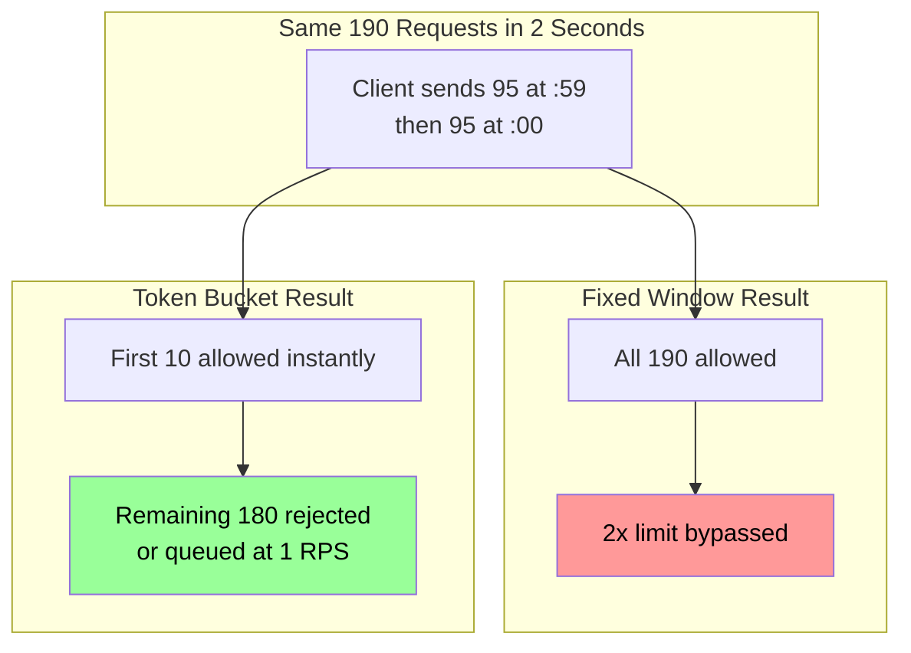
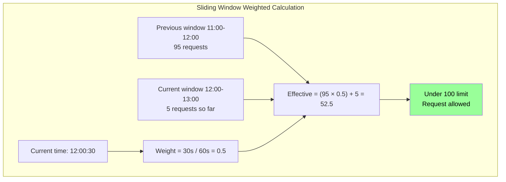

*[DDoS]: Distributed Denial of Service
*[JWT]: JSON Web Token
*[LRU]: Least Recently Used
*[P99]: 99th Percentile
*[QPS]: Queries Per Second
*[RPS]: Requests Per Second
*[SLA]: Service Level Agreement
*[TTL]: Time To Live
*[WAF]: Web Application Firewall

Rate limiting is a double-edged sword. Done right, it protects your systems from overload and abuse. Done wrong, it becomes a self-inflicted outage—your own infrastructure rejecting legitimate users during the moments you need capacity most.

I watched this play out at a company that implemented per-IP rate limiting at 100 requests per minute to prevent scraping. Seemed reasonable. Then a customer behind corporate NAT reported they couldn't use the service. Five hundred employees sharing one public IP meant each person got 0.2 requests per minute. They switched to API key-based limiting with per-key quotas. Problem solved—until a viral moment hit and legitimate traffic spiked 10x. Their fixed-window rate limiting rejected 90% of requests at minute boundaries. Users hammering refresh made it worse. They switched to a _sliding window counter_ to track request counts (eliminating the boundary problem) combined with _token bucket_ for burst control (allowing legitimate traffic spikes while maintaining sustained rate limits). Same traffic spike: requests distributed smoothly, everyone got served, the backend hummed along at capacity without falling over.

The naive approach—"block anything over N requests"—fails because it treats rate limiting as a wall instead of a valve. The algorithms matter: token bucket, leaky bucket, sliding window, and fixed window each behave differently during bursts. The implementation matters more: _where_ you limit, _how_ you identify clients, _what_ happens when limits are hit, and _how_ you communicate constraints to callers.

Rate limiting isn't about saying "no." It's about saying "not yet" in a way that maintains service quality for everyone.

<Callout type="warning">
Rate limits that work fine under normal load often become the bottleneck during incidents. Design for burst handling, not steady-state. Your rate limiter should protect services, not prevent recovery.
</Callout>

## Rate Limiting Fundamentals

### Why Rate Limit

Rate limiting serves four distinct purposes, and conflating them leads to misconfigured systems.

__Resource protection__ prevents individual clients from monopolizing shared resources. Without limits, one customer's bulk export can exhaust your database connection pool, causing errors for everyone else. CPU-intensive endpoints, memory-heavy operations, and database-bound queries all need protection from unbounded consumption.

__Fairness__ ensures equitable access across clients. Large customers shouldn't crowd out small ones. Free-tier users shouldn't impact paying customers. Rate limits enforce the allocation you've decided is appropriate for each tier.

__Abuse prevention__ stops malicious or buggy clients. Credential stuffing attacks, scraping attempts, and runaway retry loops all look like excessive request volume. Rate limiting slows these down enough to make attacks expensive and gives you time to respond.

__Cost control__ caps expensive operations. Third-party API calls, ML inference requests, and storage operations have real costs. Without limits, a compromised API key or buggy client can generate surprise bills within hours.

But rate limiting has limits. It _slows_ attacks; it doesn't prevent them. Determined attackers distribute across IPs and rotate credentials. Rate limiting buys time—authentication, authorization, and WAF rules provide actual security. Similarly, rate limiting _sheds_ load; it doesn't handle it. You still need scaling for legitimate traffic. And rate limiting _helps_ availability; it doesn't guarantee it. Backend failures still cause errors regardless of how well you've throttled incoming requests.

### Algorithm Overview

Four algorithms dominate production rate limiting, each with different tradeoffs:

| Algorithm | Mechanism | Burst Handling | Memory | Best For |
| ----------- | ----------- | ---------------- | -------- | ---------- |
| __Fixed Window__ | Count requests in time windows, reset at boundary | Poor (2x burst at boundaries) | Low (one counter per key) | Simple quotas |
| __Sliding Window Log__ | Store timestamp of every request | Excellent | High (all timestamps) | Accuracy-critical, low volume |
| __Sliding Window Counter__ | Weighted average of current and previous window | Good | Low (two counters per key) | Balance of accuracy and efficiency |
| __Token Bucket__ | Tokens added at fixed rate, consumed per request | Excellent (configurable burst) | Low | API rate limiting |
| __Leaky Bucket__ | Requests queue, processed at constant rate | Smooths all traffic | Medium (queue) | Traffic shaping |

Table: Rate limiting algorithm comparison.

The _fixed window_ approach is simple: count requests in minute-long (or hour-long) windows, reject when the count exceeds the limit, reset at the boundary. The problem is boundary bursts. A client can make 95 requests at 11:59:59 and 95 more at 12:00:01 — 190 requests in two seconds while staying under a "100 per minute" limit.

_Sliding window counter_ fixes this by weighting the previous window's count. At 30 seconds into the current window, you count 50% of the previous window plus 100% of the current window. This smooths the boundary problem with minimal additional state.

_Sliding window log_ takes accuracy further by storing the timestamp of every request and counting only those within the rolling window. It's perfectly accurate but memory-intensive—you're storing potentially thousands of timestamps per client. Use it only when accuracy is critical and request volume is low, like authentication rate limiting where you absolutely need exactly N attempts per hour.

_Token bucket_ is the workhorse of API rate limiting. Imagine a bucket that holds N tokens (your burst capacity). Tokens are added at rate R (your sustained RPS). Each request consumes a token if available; otherwise it's rejected. This naturally allows bursts—a client can use their full bucket immediately—while maintaining a sustained rate over time.

_Leaky bucket_ inverts the model: requests enter a queue (the bucket), and they're processed (leaked) at a constant rate. If the queue fills, new requests overflow and are rejected. This produces perfectly smooth output but adds latency—requests wait in the queue. Use it when you need constant output rate to a downstream service that can't handle bursts.



Figure: Same burst traffic, different outcomes—fixed window allows 2x limit while token bucket enforces capacity.

<Callout type="info">
Token bucket is the most versatile algorithm for API rate limiting. It allows bursts (good for user experience) while maintaining a sustained rate (protects backend). Most production rate limiters—including AWS API Gateway, Kong, and nginx—use token bucket or sliding window.
</Callout>

## Where to Rate Limit

Before choosing an algorithm, decide _where_ in your stack to enforce limits. Each layer has different tradeoffs:

| Layer | Tools | Latency | Granularity | Best For |
| ------- | ------- | --------- | ------------- | ---------- |
| Edge/CDN | Cloudflare, CloudFront, Fastly | Lowest | IP, geography | DDoS, bot protection |
| API Gateway | AWS API Gateway, Kong, nginx | Low | API key, route | API quotas, tiered plans |
| Service Mesh | Istio, Envoy, Linkerd | Low | Service identity | Service-to-service limits |
| Application | Custom middleware | Higher | User, action, context | Fine-grained business logic |

Table: Rate limiting layers comparison.

### Edge and CDN

Edge rate limiting stops bad traffic before it reaches your infrastructure. Cloudflare, Fastly, AWS CloudFront, Google Cloud CDN, Azure Front Door, and Azure CDN all offer rate limiting rules via their respective WAF products that execute at the edge—milliseconds from the client, before your servers see the request.

```hcl title="cloudflare-rate-limit.tf"
# Limit API endpoints to 100 requests per minute per IP
resource "cloudflare_rate_limit" "api_limit" {
  zone_id   = var.zone_id
  threshold = 100
  period    = 60

  match {
    request {
      url_pattern = "api.example.com/*"
      schemes     = ["HTTPS"]
    }
  }

  action {
    mode    = "simulate"  # Change to "ban" in production
    timeout = 60
  }
}
```

Code: Cloudflare rate limiting via Terraform.

Edge limiting is coarse-grained—typically by IP or geographic region. It's your first line of defense against volumetric attacks, not your primary quota enforcement.

### API Gateway

Most teams implement their primary rate limiting at the API gateway layer. AWS API Gateway, Kong, and nginx all support token bucket or similar algorithms out of the box.

```yaml title="kong-rate-limiting.yaml"
# Kong rate limiting plugin configuration
plugins:
  - name: rate-limiting
    config:
      minute: 100
      hour: 1000
      policy: redis
      redis_host: redis.internal
      redis_port: 6379
      fault_tolerant: true
      hide_client_headers: false
      limit_by: consumer  # or: ip, credential, header
```

Code: Kong rate limiting plugin configuration.

```yaml title="aws-api-gateway.yaml"
# AWS API Gateway usage plan (via CloudFormation)
UsagePlan:
  Type: AWS::ApiGateway::UsagePlan
  Properties:
    UsagePlanName: BasicTier
    Throttle:
      BurstLimit: 100    # Token bucket capacity
      RateLimit: 10      # Tokens per second
    Quota:
      Limit: 10000
      Period: MONTH
```

Code: AWS API Gateway usage plan with token bucket throttling.

Gateway-level limiting handles per-API-key quotas, tiered rate limits, and route-specific throttling without touching application code.

### Service Mesh

For service-to-service communication, service meshes like Istio provide rate limiting between internal services. This prevents one service from overwhelming another during failures or traffic spikes.

```yaml title="istio-rate-limit.yaml"
# Istio EnvoyFilter for local rate limiting
apiVersion: networking.istio.io/v1alpha3
kind: EnvoyFilter
metadata:
  name: payment-service-ratelimit
spec:
  workloadSelector:
    labels:
      app: payment-service
  configPatches:
    - applyTo: HTTP_FILTER
      match:
        context: SIDECAR_INBOUND
      patch:
        operation: INSERT_BEFORE
        value:
          name: envoy.filters.http.local_ratelimit
          typed_config:
            "@type": type.googleapis.com/envoy.extensions.filters.http.local_ratelimit.v3.LocalRateLimit
            stat_prefix: http_local_rate_limiter
            token_bucket:
              max_tokens: 100
              tokens_per_fill: 10
              fill_interval: 1s
```

Code: Istio local rate limiting with token bucket.

### Application Layer

Application-level rate limiting gives you the finest control—you can limit by user, by action, by context, or by any combination. Use it when gateway-level limits aren't granular enough.

The tradeoff is complexity. You're responsible for state management (usually Redis for distributed systems), failure handling, and the actual algorithm implementation. That said, sometimes you need it: per-user action limits, variable-cost operations, or business-logic-driven throttling that gateways can't express.

<Callout type="warning">
Don't implement rate limiting _only_ at the application layer. By the time requests reach your app, they've already consumed network bandwidth, TLS handshakes, and load balancer capacity. Use defense in depth: coarse limits at the edge, refined limits at the gateway, fine-grained limits in the app.
</Callout>

## Algorithm Deep Dives

Understanding how each algorithm works helps you configure existing tools correctly and debug rate limiting issues. You rarely need to implement these from scratch—but you do need to understand their behavior.

### Token Bucket

Token bucket has three parameters: _capacity_ (burst size), _refill rate_ (sustained throughput), and _cost per request_ (usually 1, but can vary by operation).

The algorithm: on each request, calculate tokens accumulated since last check (elapsed time × refill rate), cap at bucket capacity, then check if enough tokens exist. If yes, subtract and allow. If no, reject and calculate retry time.

```python
# Token bucket pseudocode
def check_request(bucket, cost):
    elapsed = now() - bucket.last_update
    bucket.tokens = min(bucket.tokens + elapsed * refill_rate, capacity)
    bucket.last_update = now()

    if bucket.tokens >= cost:
        bucket.tokens -= cost
        return "ALLOW"
    else:
        retry_after = (cost - bucket.tokens) / refill_rate
        return ("REJECT", retry_after)
```

Code: Token bucket core logic.

Here's how traffic patterns play out with a 10-token bucket refilling at 1 token per second:

| Traffic Pattern | What Happens |
| ----------------- | -------------- |
| Steady 1 RPS | Every request allowed—token regenerates before next |
| Burst of 10 | All 10 served instantly, then 1 RPS until refilled |
| Sustained 2 RPS | First ~15 allowed (burst + refill), then 50% rejected |
| Variable cost (GET=1, POST=5) | Heavy operations consume quota faster |

Table: Token bucket behavior under different traffic patterns.

For distributed systems, you need atomic operations. The standard pattern is a Redis Lua script that reads state, calculates refill, checks tokens, and updates—all in one atomic operation. Without atomicity, concurrent requests can race past your limits.

<Callout type="success">
For a complete TypeScript implementation with both in-memory and Redis-backed variants, see the [token bucket gist](https://gist.github.com/webstackdev/011a4ac858a9c379b95181798e397499).
</Callout>

### Leaky Bucket

Leaky bucket inverts the model: instead of controlling _input_ rate, it controls _output_ rate. Requests enter a queue (the bucket) and are processed at a constant rate. If the queue fills, new requests overflow.

```python
# Leaky bucket pseudocode
def check_request(bucket):
    elapsed = now() - bucket.last_leak
    leaked = elapsed * leak_rate
    bucket.level = max(0, bucket.level - leaked)
    bucket.last_leak = now()

    if bucket.level < bucket.size:
        bucket.level += 1
        wait_time = bucket.level / leak_rate
        return ("QUEUE", wait_time)
    else:
        return "REJECT"
```

Code: Leaky bucket core logic.

The key difference: token bucket serves bursts immediately then makes you wait. Leaky bucket queues everything and serves at constant rate. With a burst of 10 requests:

- Token bucket (10 tokens, 1/s refill): All 10 served instantly, ~0ms latency each
- Leaky bucket (10 queue, 1/s leak): Queued, served over 10 seconds—0ms, 1s, 2s, ... 9s latency

Use leaky bucket when you need to protect a downstream service that can't handle bursts—like a payment processor with strict per-second limits. The added latency is the tradeoff for guaranteed smooth output.

| Characteristic | Token Bucket | Leaky Bucket |
| ---------------- | -------------- | -------------- |
| Burst handling | Allows bursts up to capacity | Smooths all traffic |
| Output pattern | Bursty (matches input) | Constant rate |
| Latency added | None (immediate decision) | Queue wait time |
| Best for | API rate limiting | Traffic shaping |
| Rejection behavior | Immediate 429 | Queue, then overflow |

Table: Token bucket vs leaky bucket comparison.

<Callout type="success">
For a complete TypeScript implementation including a queue-based processor, see the [leaky bucket gist](https://gist.github.com/webstackdev/735583b68306d4a553544a43f0eadf60).
</Callout>

### Sliding Window

Sliding window counter solves the fixed-window boundary burst problem with minimal overhead. Track counts for the current and previous windows, then calculate a weighted average based on position within the current window.

```python
# Sliding window counter pseudocode
def check_request(state):
    current_window = floor(now() / window_size) * window_size
    elapsed = now() - current_window
    weight = elapsed / window_size

    # Weighted count from previous + current window
    effective_count = (state.prev_count * (1 - weight)) + state.current_count

    if effective_count < max_requests:
        state.current_count += 1
        return "ALLOW"
    else:
        retry_after = current_window + window_size - now()
        return ("REJECT", retry_after)
```

Code: Sliding window counter core logic.

At the 30-second mark of a 60-second window, you count 50% of the previous window plus 100% of the current window. This prevents the boundary problem where clients can make 2x the limit by timing requests around window boundaries.



Figure: Sliding window weighted calculation prevents boundary exploitation.

<Callout type="success">
For a complete TypeScript implementation with Redis support, see the [sliding window gist](https://gist.github.com/webstackdev/2ad5ce11b38b097a261ec3b8e60639c0).
</Callout>

## Client Identification

The rate limiting key—how you identify who's making requests—is as important as the algorithm. Choose wrong, and you'll either punish legitimate users or fail to stop abuse.

| Strategy | Best For | Watch Out For |
| ---------- | ---------- | --------------- |
| IP Address | Anonymous, anti-bot | NAT, proxies, shared IPs |
| API Key | B2B, developer APIs | Key sharing, stolen keys |
| User ID | Consumer apps | Auth overhead |
| IP + Endpoint | Mixed anonymous/auth | Configuration complexity |
| User + Action | Fine-grained control | Key explosion |

Table: Rate limit key strategies.

_IP address_ requires no authentication and blocks distributed attacks, but corporate NAT can share one IP across thousands of users. I've seen legitimate customers hit rate limits because 500 employees shared a single public IP—each got 0.2 requests per minute.

_API key_ is the standard for B2B APIs. Per-customer limits, usage tracking, revocation—all straightforward. The risk is key sharing: customers distributing their key to multiple applications, or keys getting stolen and abused.

_User ID_ gives you true per-user limits that work across IPs and devices. The tradeoff is authentication overhead and the fact that it doesn't help with anonymous endpoints.

_Composite keys_ (user + action, IP + endpoint) give you fine-grained control at the cost of complexity and key explosion. Useful when different operations need different limits.

### Extracting Client Identity

For IP extraction, don't blindly trust `X-Forwarded-For`—clients can set it to anything. Only extract from forwarded headers after validating the request came through your trusted proxy infrastructure.

```typescript title="get-client-ip.ts"
import { APIGatewayRequestAuthorizerEvent, APIGatewayAuthorizerResult } from 'aws-lambda';

// Your original logic integrated here
function getClientIP(headers: Record<string, string | undefined>, remoteAddr: string, trustedProxies: string[]): string {
  if (!trustedProxies.includes(remoteAddr)) return remoteAddr;

  const checkHeaders = ['cf-connecting-ip', 'true-client-ip', 'x-real-ip', 'x-forwarded-for'];
  for (const header of checkHeaders) {
    const value = headers[header];
    if (value) return value.split(',')[0].trim();
  }
  return remoteAddr;
}

export const handler = async (event: APIGatewayRequestAuthorizerEvent): Promise<APIGatewayAuthorizerResult> => {
  const trustedProxies = ['1.2.3.4']; // Replace with your actual proxy IPs
  const clientIP = getClientIP(event.headers || {}, event.requestContext.identity.sourceIp, trustedProxies);

  // In production, check Redis/DynamoDB for rate limit state here
  const isAllowed = true;

  // Standard AWS authorizer policy document - required format for API Gateway
  return {
    principalId: clientIP,
    policyDocument: {
      Version: '2012-10-17',
      Statement: [{
        Action: 'execute-api:Invoke',
        Effect: isAllowed ? 'Allow' : 'Deny',
        Resource: event.methodArn,
      }],
    },
  };
};
```

Code: Safe IP extraction from forwarded headers for AWS CloudFront.

The header you trust depends on your infrastructure. Cloudflare sets `CF-Connecting-IP`, Akamai uses `True-Client-IP`, and nginx typically sets `X-Real-IP`. The generic `X-Forwarded-For` contains a comma-separated chain of IPs—the leftmost is the original client, but any proxy in the chain can append values. AWS CloudFront and Application Load Balancer both populate `X-Forwarded-For`, with CloudFront also offering `CloudFront-Viewer-Address` for the viewer's IP and port. For Lambda@Edge or Lambda behind API Gateway, the source IP is available in the request context without needing headers at all.

The safest pattern: configure your edge proxy to set a custom header (like `X-Client-IP`) that overwrites any client-supplied value, then trust only that header in downstream services.

<Callout type="warning">
Header spoofing is trivial: `curl -H "X-Forwarded-For: 1.2.3.4" your-api.com`. If your rate limiter trusts that header without validation, attackers can rotate through fake IPs indefinitely. Always validate that requests actually came through your proxy before trusting forwarded headers.
</Callout>

### Layered Limiting

Production systems often combine multiple strategies: global IP limits as a DDoS backstop, API key limits for quota enforcement, and user + action limits for abuse prevention. All must pass for a request to proceed.

```typescript title="layered-limits.ts"
async function checkRateLimits(req: Request): Promise<boolean> {
  const clientIP = getClientIP(req, trustedProxies);
  const apiKey = req.headers['x-api-key'];
  const userId = req.user?.id;
  const action = `${req.method}:${req.path}`;

  // Layer 1: Global IP limit (anti-DDoS)
  const ipAllowed = await ipLimiter.check(`ip:${clientIP}`);
  if (!ipAllowed) return false;

  // Layer 2: API key quota (billing)
  if (apiKey) {
    const keyAllowed = await keyLimiter.check(`key:${apiKey}`);
    if (!keyAllowed) return false;
  }

  // Layer 3: User + action (abuse prevention)
  if (userId) {
    const actionAllowed = await actionLimiter.check(`user:${userId}:${action}`);
    if (!actionAllowed) return false;
  }

  return true;
}
```

Code: Layered rate limiting with multiple strategies.

This is an application-level implementation—useful for fine-grained control, but it comes with operational complexity. The `ipLimiter`, `keyLimiter`, and `actionLimiter` shown here are stubs; a real implementation needs shared state across all application instances, typically Redis with atomic Lua scripts. Without shared state, each pod maintains its own counters, meaning a client hitting different pods effectively multiplies their rate limit by your replica count.

Sticky sessions (routing the same client to the same pod) seem like a workaround, but they introduce their own problems: uneven load distribution, session affinity breaking during deployments, and the need for session-aware load balancers. Redis-backed rate limiting is the standard solution for horizontally scaled services.

That said, consider whether you need application-level rate limiting at all. Cloud platforms offer managed alternatives that handle the distributed state problem for you. AWS API Gateway's usage plans provide per-API-key throttling with built-in token bucket. Lambda Authorizers can implement custom logic for user-based limits. Kong, Envoy, and other gateways support sophisticated rate limiting plugins with Redis backends. Moving rate limiting to the gateway layer reduces application complexity and ensures limits are enforced before requests consume compute resources.

## HTTP Response Design

Good rate limiting is invisible to clients until they approach the limit. The key: always return rate limit headers on _every_ response, not just 429s. This lets well-behaved clients self-throttle before hitting limits.

### Standard Headers

The IETF draft (draft-ietf-httpapi-ratelimit-headers) defines three standard headers:

| Header | Meaning | Example |
| -------- | --------- | --------- |
| `RateLimit-Limit` | Maximum requests allowed | `100` |
| `RateLimit-Remaining` | Requests left in window | `47` |
| `RateLimit-Reset` | Seconds until reset | `30` |

Table: IETF rate limit headers.

Many APIs still use the legacy `X-RateLimit-*` prefix. Support both until the standard is finalized.

For 429 responses, always include `Retry-After` (RFC 7231) telling the client when to retry. Use seconds rather than HTTP-date format—it's simpler for clients to parse.

### Response Codes

- _429 Too Many Requests_: Client exceeded their rate limit. Include `Retry-After` and rate limit headers.
- _503 Service Unavailable_: System-wide overload, not per-client limiting. Use sparingly.
- _200 with Warning_: Optional. Add `Warning: 299 - "Rate limit 80% consumed"` to help clients self-regulate.

The distinction between 429 and 503 matters: 429 tells clients "you specifically are sending too many requests," while 503 signals "the entire system is overloaded." Don't use 503 for per-client rate limiting—it misleads clients into thinking the service is down rather than that they need to back off.

### Example Responses

```typescript title="rate-limit-responses.ts"
// 429: Client-specific rate limit exceeded
res.status(429)
   .set({ 'Retry-After': '30', 'RateLimit-Remaining': '0' })
   .json({ error: 'rate_limit_exceeded', retryAfter: 30 });

// 503: System-wide overload (use sparingly)
res.status(503)
   .set({ 'Retry-After': '60' })
   .json({ error: 'service_overloaded', message: 'System under heavy load' });
```

Code: 429 vs 503 response examples.

### Variable Cost

Remember the "cost per request" parameter in token bucket? Not all requests are equal. A simple GET costs less than a complex search or bulk export. Charge more tokens for expensive operations:

```typescript title="variable-cost.ts"
function getRequestCost(req: Request): number {
  if (req.path.includes('/search') || req.path.includes('/export')) return 10;
  if (req.method === 'POST' || req.method === 'PUT') return 3;
  return 1;
}
```

Code: Variable request costs.

<Callout type="success">
Always include rate limit headers on successful responses, not just 429s. This lets well-behaved clients monitor their quota and self-throttle before hitting limits.
</Callout>

## Testing Your Rate Limiter

Rate limiters need to be tested under realistic conditions—not just unit tests, but concurrent load tests that stress the actual distributed implementation. Tools like k6, Locust, or Grafana's k6 Cloud can generate the concurrent traffic patterns you need to verify your limiter behaves correctly under pressure.

### Key Test Cases

1. _Burst handling_: Send requests up to capacity simultaneously. Exactly N should succeed.
2. _Refill behavior_: Drain the bucket, wait for refill period, verify new requests succeed.
3. _Concurrent access_: Multiple processes hitting the same key. Redis Lua scripts must be atomic—race conditions here mean either over-allowing or unfair rejection.
4. _Retry-After accuracy_: The header value should match when requests actually start succeeding.

```typescript title="concurrent-test.ts"
it('handles concurrent requests atomically', async () => {
  const results = await Promise.all(
    Array(15).fill(null).map(() => bucket.consume('test-key'))
  );

  const allowed = results.filter(r => r.allowed).length;
  expect(allowed).toBe(10); // Exactly capacity, no race conditions
});
```

Code: Testing atomic concurrent access.

### What to Monitor

- _Rejection rate_: High sustained rejection for legitimate clients means misconfiguration. High during an attack means it's working.
- _Rate limiter latency_: Redis calls should be under 5ms P99. If slower, check network or Redis load.
- _Redis errors_: Any failures here mean rate limiting isn't happening. Alert immediately.
- _Top rate-limited clients_: Identify who's hitting limits—abuse or legitimate growth?

<Callout type="info">
A high rejection rate isn't always a problem—it might mean the rate limiter is working as intended during an attack. Monitor both aggregate rejection rate and per-client patterns.
</Callout>

## Failure Handling

What happens when Redis dies? This isn't hypothetical—network partitions, memory exhaustion, and maintenance windows all cause Redis outages. Your rate limiter needs a failure policy decided in advance.

_Fail open_ allows all requests when the rate limiter can't be reached. This preserves availability but removes protection. One compromised API key during an outage can generate unbounded requests.

_Fail closed_ rejects all requests when state is unavailable. This maintains protection but sacrifices availability. A Redis blip becomes a full outage.

_Fail with local fallback_ uses in-memory rate limiting per instance when Redis is unavailable. It's not perfectly accurate—each pod limits independently—but it provides some protection while maintaining availability.

Most production systems choose fail open with aggressive alerting. The reasoning: Redis outages are rare and short-lived, while blocking all traffic during an outage compounds the problem. But document your choice and make sure operations knows the implications.

```typescript title="fail-open-with-fallback.ts"
async function checkRateLimit(key: string): Promise<boolean> {
  try {
    return await redisLimiter.check(key);
  } catch (error) {
    metrics.increment('rate_limit.redis_failure');
    // Fail open: allow request but log for alerting
    return true;
  }
}
```

Code: Fail-open rate limiting with error tracking.

## Conclusion

Rate limiting is traffic shaping, not just request blocking. The best rate limiters are invisible to normal users—they only activate during abuse or overload.

The key insights:

- _Layer appropriately_: Edge for DDoS, gateway for API quotas, application for business logic
- _Choose algorithms by burst tolerance_: Token bucket allows bursts, leaky bucket smooths traffic, sliding window prevents boundary exploits
- _Identify clients carefully_: IP for anonymous endpoints, API key for B2B, user ID for authenticated actions
- _Communicate clearly_: Always return `Retry-After` and rate limit headers, even on successful responses
- _Plan for failures_: Decide your failure policy before Redis goes down, not during the incident

The goal isn't to reject requests—it's to shape traffic so rejection becomes rare. Design for legitimate bursts, communicate limits clearly, and monitor rejection rates. Rate limiting done right protects your service without punishing your users.

<Callout type="success">
Well-designed rate limits with clear communication let clients self-regulate before hitting limits. That's the real goal.
</Callout>
