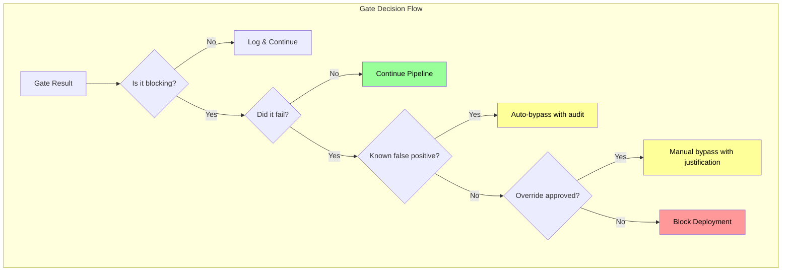
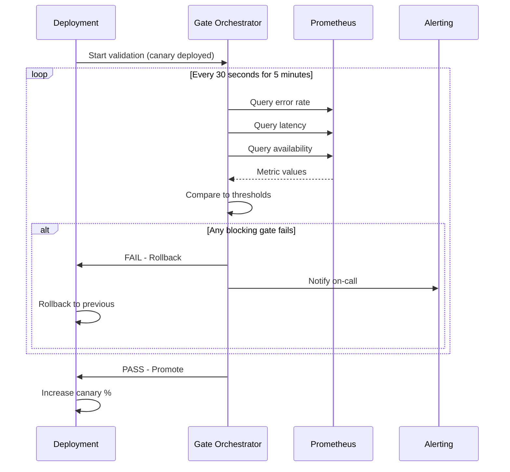
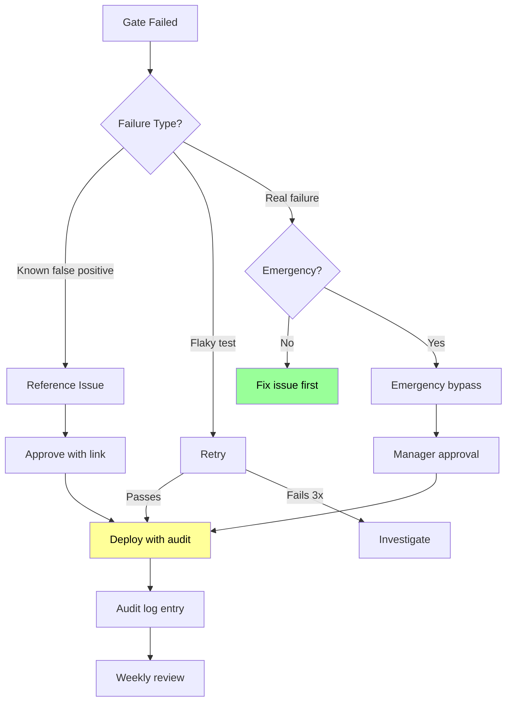

*[CI]: Continuous Integration
*[CD]: Continuous Deployment
*[SLO]: Service Level Objective
*[SLI]: Service Level Indicator
*[P99]: 99th Percentile
*[APM]: Application Performance Monitoring
*[DORA]: DevOps Research and Assessment
*[MTTR]: Mean Time To Recovery
*[API]: Application Programming Interface
*[HTTP]: Hypertext Transfer Protocol
*[CPU]: Central Processing Unit
*[OOM]: Out of Memory

# Release Health Gates Without Blocking Everything

## Introduction

Frame the quality gate paradox: gates exist to catch bad deployments, but gates that are too strict become the biggest obstacle to deployment velocity. A gate with a 10% false positive rate will block legitimate deployments constantly, training teams to bypass or ignore gates entirely. A gate that never fires provides no protection. This section establishes that quality gates are probabilistic safety nets, not deterministic guarantees. The goal isn't zero risk—it's catching the failures that matter while letting good deployments through quickly. The measure of a good gate isn't how many deployments it blocks, but how many real incidents it prevents relative to how many good deployments it delays.

_Include a scenario: a team implements automated quality gates—test pass rate, code coverage, security scans, performance benchmarks. Initial deployment: everything green, ships in 5 minutes. A month later: security scanner adds new rules, flags a dependency vulnerability from 2019 that's unexploitable in their context. All deployments blocked. Someone adds an exception. Then coverage drops 0.1% due to refactoring—blocked again. Exception added. Performance gate triggers on a cold-start test run—exception. Soon the gate has so many exceptions it catches nothing. They rebuild: required gates (critical tests, security CVEs only) vs advisory gates (coverage trends, performance baselines). Required gates block; advisory gates alert. False positives drop 90%, and when required gates fire, people investigate instead of bypassing. Deployment velocity returns, and they actually catch a real regression._

<Callout type="warning">
The most dangerous quality gate is one with so many false positives that teams stop trusting it. Gate fatigue leads to bypass culture, which means real failures slip through. Tune for precision over recall—it's better to miss some problems than to cry wolf constantly.
</Callout>

## Gate Design Principles

### What Makes a Good Gate

```yaml title="gate-design-principles.yaml"
# Quality gate design principles

effective_gate_characteristics:
  actionable:
    description: "Failure provides clear next steps"
    good_example: "Test X failed: expected 200, got 500"
    bad_example: "Quality score below threshold"
    principle: |
      If a developer can't understand what to fix
      from the gate failure message alone, the gate
      is not actionable.

  deterministic:
    description: "Same code produces same result"
    good_example: "Unit tests with fixed seeds"
    bad_example: "Performance test on shared infrastructure"
    principle: |
      Flaky gates train people to retry and ignore.
      Non-deterministic gates should be advisory, not blocking.

  fast:
    description: "Results in reasonable time"
    targets:
      pre_commit: "< 30 seconds"
      pre_merge: "< 10 minutes"
      pre_deploy: "< 5 minutes"
      post_deploy: "< 5 minutes (for rollback decision)"
    principle: |
      Slow gates become bottlenecks. If a gate takes
      30 minutes, it will be bypassed in emergencies.

  proportional:
    description: "Severity matches actual risk"
    example: |
      Critical: Authentication bypass → block deployment
      High: Memory leak → block to prod, allow to staging
      Medium: Code style → warn, don't block
      Low: Documentation gaps → track, don't block
    principle: |
      Not all issues have equal impact. Weight gates
      by the actual risk of the failure they detect.

---
# Gate categorization
gate_categories:
  required_blocking:
    description: "Must pass, deployment blocked on failure"
    criteria:
      - "High precision (low false positives)"
      - "Detects critical failures"
      - "Fast execution"
    examples:
      - "Unit tests pass"
      - "Build succeeds"
      - "Critical security vulnerabilities (CVE 9+)"
      - "Authentication/authorization tests"

  required_advisory:
    description: "Must run, failure alerts but doesn't block"
    criteria:
      - "Important but may have false positives"
      - "Trends matter more than absolute values"
    examples:
      - "Integration tests (may have environment issues)"
      - "Performance baselines (variance expected)"
      - "Code coverage (refactoring can drop temporarily)"

  optional:
    description: "Available but not required"
    criteria:
      - "Nice to have insights"
      - "Team-specific preferences"
    examples:
      - "Code style beyond linting"
      - "Documentation coverage"
      - "Complexity metrics"

---
# Anti-patterns
anti_patterns:
  coverage_absolutism:
    mistake: "Block if coverage < 80%"
    problem: "Refactoring can legitimately drop coverage"
    better: "Alert if coverage drops > 5% from baseline"

  all_tests_must_pass:
    mistake: "Any test failure blocks deployment"
    problem: "Flaky tests become blockers"
    better: "Quarantine flaky tests, require core tests"

  security_theater:
    mistake: "Block on any security scanner finding"
    problem: "False positives, unexploitable issues"
    better: "Block on CVE 9+, alert on others, triage queue"

  performance_regression_zero_tolerance:
    mistake: "Block if any metric regresses"
    problem: "Performance varies run to run"
    better: "Block if P99 regresses > 20% over 3 runs"
```
Code: Gate design principles.


Figure: Gate decision flow.

### Gate Metrics

```yaml title="gate-effectiveness-metrics.yaml"
# Measuring gate effectiveness

key_metrics:
  precision:
    formula: "True Positives / (True Positives + False Positives)"
    description: "What % of gate failures are real problems"
    target: "> 90%"
    meaning: |
      If precision is 50%, half of all blocks are false alarms.
      Teams will stop trusting the gate.

  recall:
    formula: "True Positives / (True Positives + False Negatives)"
    description: "What % of real problems does the gate catch"
    target: "> 80% for critical issues"
    meaning: |
      A gate can have 100% precision by never firing.
      Need balance of catching real issues.

  false_positive_rate:
    formula: "False Positives / Total Gate Runs"
    target: "< 5% for blocking gates"
    action: "If > 10%, make gate advisory until fixed"

  gate_duration:
    description: "Time from trigger to result"
    targets:
      pre_merge: "< 10 minutes"
      pre_deploy: "< 5 minutes"
    action: "Parallelize or move slow gates to advisory"

  bypass_rate:
    formula: "Manual Bypasses / Gate Failures"
    target: "< 10%"
    meaning: |
      High bypass rate indicates gate isn't trusted.
      Either fix the gate or remove it.

---
# Tracking effectiveness
effectiveness_tracking:
  per_gate_dashboard:
    metrics:
      - "Pass/fail rate over time"
      - "False positive rate (confirmed after investigation)"
      - "Time to result"
      - "Bypass rate with reasons"

  correlation_analysis:
    question: "Do gate failures predict production incidents?"
    method: |
      Track: gate passed → deployed → incident?
      Calculate: P(incident | gate_passed) vs P(incident | gate_failed_bypassed)
    action: |
      If no correlation, gate isn't catching real issues.
      If strong correlation with bypasses, gate needs trust rebuild.

  feedback_loop:
    incident_review:
      - "Did any gate fire for this issue?"
      - "If not, could a gate have caught it?"
      - "If gate fired but was bypassed, why?"
    gate_tuning:
      - "Review false positives weekly"
      - "Adjust thresholds based on data"
      - "Retire gates that don't catch real issues"
```
Code: Gate effectiveness metrics.

<Callout type="info">
Track every gate bypass with a required justification. High bypass rates indicate either gate misconfiguration or legitimate cases the gate doesn't handle. Either way, you need to know.
</Callout>

## Pre-Deployment Gates

### Build and Test Gates

```yaml title="build-test-gates.yaml"
# Pre-deployment quality gates

build_gates:
  compilation:
    type: "required_blocking"
    check: "Code compiles without errors"
    false_positive_rate: "~0% (deterministic)"
    notes: "Fail fast, no point continuing if build fails"

  linting:
    type: "required_blocking"
    check: "No linting errors (not warnings)"
    false_positive_rate: "< 1%"
    notes: |
      Block on errors (syntax issues, definite bugs)
      Warn on style violations
      Configure lint rules team has agreed on

  type_checking:
    type: "required_blocking"
    check: "TypeScript/type checks pass"
    false_positive_rate: "~0%"
    notes: "Type errors are real bugs"

---
# Test gates
test_gates:
  unit_tests:
    type: "required_blocking"
    check: "All unit tests pass"
    threshold: "100% pass rate"
    handling_flaky: |
      - Quarantine flaky tests (separate job)
      - Fix or delete within 1 week
      - Don't let flaky tests block main gate
    timeout: "< 5 minutes"

  integration_tests:
    type: "required_advisory"
    check: "Integration tests pass"
    rationale: |
      Integration tests depend on external systems
      May fail due to environment, not code
    handling: |
      - Require passing for merge to main
      - Allow bypass with approval for deploy
      - Alert on failure, investigate

  e2e_tests:
    type: "required_advisory"
    check: "Critical path E2E tests pass"
    scope: "Smoke tests only (< 10 tests)"
    rationale: |
      Full E2E suite too slow for blocking
      Run critical paths only
    handling: |
      - Block on critical path failures
      - Run full suite post-deploy

  contract_tests:
    type: "required_blocking"
    check: "API contracts not broken"
    false_positive_rate: "Low if contracts are versioned"
    notes: "Breaking changes need explicit version bump"

---
# Coverage gates
coverage_gates:
  absolute_coverage:
    type: "optional"
    check: "Coverage > X%"
    problem: |
      Arbitrary thresholds cause gaming
      Refactoring can legitimately drop coverage
    recommendation: "Don't use as blocking gate"

  coverage_delta:
    type: "required_advisory"
    check: "Coverage didn't drop significantly"
    threshold: "Alert if delta > -5%"
    rationale: |
      Large drops warrant investigation
      Small variations are normal
    handling: "Require explanation, not block"

  new_code_coverage:
    type: "required_advisory"
    check: "New/changed code has > X% coverage"
    threshold: "70-80% for new code"
    rationale: "Ensures new code is tested"
    handling: "Block for 0% coverage, warn for < threshold"
```
Code: Build and test gates.

### Security Gates

```yaml title="security-gates.yaml"
# Security quality gates

vulnerability_scanning:
  dependency_vulnerabilities:
    type: "required_blocking (conditional)"
    tool_examples: ["Snyk", "Dependabot", "npm audit"]
    thresholds:
      critical_cvss_9_plus:
        action: "Block deployment"
        rationale: "Actively exploited or trivially exploitable"
      high_cvss_7_to_9:
        action: "Block to production, allow staging"
        rationale: "Serious but may need assessment"
      medium_cvss_4_to_7:
        action: "Advisory, track in backlog"
        rationale: "Should fix but not deployment blocker"
      low_cvss_below_4:
        action: "Log only"
        rationale: "Fix opportunistically"
    false_positive_handling: |
      - Maintain allowlist for assessed-safe vulnerabilities
      - Require expiration date on allowlist entries
      - Review allowlist monthly

  sast_static_analysis:
    type: "required_advisory"
    tool_examples: ["CodeQL", "Semgrep", "SonarQube"]
    handling: |
      - Block on high-confidence critical findings
      - Alert on medium confidence or severity
      - Triage queue for low confidence
    tuning: |
      - Start with high-confidence rules only
      - Add rules gradually based on team capacity
      - Remove rules with > 20% false positive rate

  secrets_scanning:
    type: "required_blocking"
    tool_examples: ["GitLeaks", "TruffleHog", "detect-secrets"]
    handling: |
      - Block on any detected secret
      - Very low false positive rate with good tools
      - Immediate rotation required
    notes: "One of few gates that should be zero tolerance"

---
# Security gate configuration
gate_configuration:
  github_actions_example: |
    - name: Security Scan
      uses: snyk/actions/node@master
      continue-on-error: false  # Block on failure
      with:
        args: --severity-threshold=critical

    - name: SAST Scan
      uses: github/codeql-action/analyze@v2
      continue-on-error: true   # Advisory only

    - name: Secrets Scan
      uses: gitleaks/gitleaks-action@v2
      continue-on-error: false  # Block on any secret

---
# Exception process
security_exception_process:
  requesting:
    required_info:
      - "CVE/finding identifier"
      - "Why it's not exploitable in this context"
      - "Compensating controls in place"
      - "Timeline for permanent fix"
    approval: "Security team + engineering lead"

  tracking:
    system: "Security exceptions register"
    fields:
      - "Exception ID"
      - "Finding details"
      - "Justification"
      - "Approver"
      - "Expiration date"
      - "Remediation plan"
    review: "Monthly review of all active exceptions"
```
Code: Security gates.

<Callout type="danger">
Secrets scanning should be zero-tolerance blocking. The false positive rate for modern secret scanners is very low, and the impact of leaked secrets is severe. This is one gate where blocking on every finding is justified.
</Callout>

## Post-Deployment Gates

### Health Check Gates

```yaml title="post-deploy-gates.yaml"
# Post-deployment validation gates

immediate_validation:
  health_check:
    type: "required_blocking"
    timing: "0-30 seconds post-deploy"
    checks:
      - "Service responds to health endpoint"
      - "All dependencies reachable"
      - "No immediate crash loops"
    failure_action: "Automatic rollback"
    timeout: "60 seconds"

  smoke_tests:
    type: "required_blocking"
    timing: "30-120 seconds post-deploy"
    checks:
      - "Critical API endpoints respond"
      - "Authentication works"
      - "Core business flow completes"
    failure_action: "Automatic rollback"
    scope: "5-10 most critical operations"

  startup_metrics:
    type: "required_advisory"
    timing: "0-300 seconds post-deploy"
    checks:
      - "No OOM kills"
      - "CPU not pegged at 100%"
      - "No error log explosion"
    failure_action: "Alert, manual rollback decision"

---
# Canary validation
canary_gates:
  error_rate:
    metric: "5xx responses / total responses"
    baseline: "Compare to previous version"
    threshold: |
      Fail if canary error rate > baseline + 1%
      OR if canary error rate > 5% absolute
    duration: "5 minutes minimum observation"

  latency:
    metric: "P99 response time"
    baseline: "Compare to previous version"
    threshold: |
      Fail if canary P99 > baseline * 1.5
      OR if canary P99 > absolute SLO threshold
    duration: "5 minutes minimum observation"

  saturation:
    metrics:
      - "CPU utilization"
      - "Memory utilization"
      - "Connection pool usage"
    threshold: "Fail if any metric > 80% while baseline < 50%"
    rationale: "Detect resource leaks early"

  business_metrics:
    examples:
      - "Conversion rate"
      - "Checkout completion"
      - "Search success rate"
    handling: |
      - More variance expected
      - Longer observation window (15-30 min)
      - Advisory for small changes
      - Blocking for significant regression (> 10%)

---
# Progressive rollout gates
progressive_gates:
  stage_gates:
    canary_1_percent:
      duration: "5 minutes"
      required: ["health_check", "error_rate", "latency"]

    canary_10_percent:
      duration: "10 minutes"
      required: ["error_rate", "latency", "saturation"]

    canary_50_percent:
      duration: "15 minutes"
      required: ["error_rate", "latency", "business_metrics"]

    full_rollout:
      validation: "15 minute bake time"
      required: ["all metrics stable"]

  automatic_promotion:
    criteria: "All gates pass for required duration"
    action: "Promote to next stage automatically"

  automatic_rollback:
    criteria: "Any blocking gate fails"
    action: "Rollback to previous version"
    notification: "Alert on-call engineer"
```
Code: Post-deployment gates.

### Metric-Based Gates

```typescript title="metric-gates.ts"
// Automated metric-based quality gates

interface MetricGateConfig {
  name: string;
  query: string;  // Prometheus query
  baselineQuery?: string;  // Query for baseline comparison
  threshold: {
    type: 'absolute' | 'relative' | 'both';
    absoluteMax?: number;
    absoluteMin?: number;
    relativeMaxIncrease?: number;  // e.g., 0.5 for 50% increase
    relativeMaxDecrease?: number;
  };
  duration: number;  // Observation window in seconds
  blocking: boolean;
}

interface GateResult {
  passed: boolean;
  metric: string;
  currentValue: number;
  baselineValue?: number;
  threshold: string;
  message: string;
}

class MetricGate {
  private prometheus: PrometheusClient;
  private config: MetricGateConfig;

  constructor(prometheus: PrometheusClient, config: MetricGateConfig) {
    this.prometheus = prometheus;
    this.config = config;
  }

  async evaluate(): Promise<GateResult> {
    const endTime = Date.now();
    const startTime = endTime - (this.config.duration * 1000);

    // Get current metric value
    const currentValue = await this.prometheus.queryRange(
      this.config.query,
      startTime,
      endTime
    );

    // Get baseline if relative comparison
    let baselineValue: number | undefined;
    if (this.config.baselineQuery) {
      baselineValue = await this.prometheus.queryRange(
        this.config.baselineQuery,
        startTime - (this.config.duration * 1000),
        startTime
      );
    }

    // Evaluate thresholds
    const { threshold } = this.config;
    let passed = true;
    const violations: string[] = [];

    // Absolute threshold checks
    if (threshold.absoluteMax !== undefined && currentValue > threshold.absoluteMax) {
      passed = false;
      violations.push(`Value ${currentValue} exceeds max ${threshold.absoluteMax}`);
    }

    if (threshold.absoluteMin !== undefined && currentValue < threshold.absoluteMin) {
      passed = false;
      violations.push(`Value ${currentValue} below min ${threshold.absoluteMin}`);
    }

    // Relative threshold checks
    if (baselineValue !== undefined) {
      if (threshold.relativeMaxIncrease !== undefined) {
        const maxAllowed = baselineValue * (1 + threshold.relativeMaxIncrease);
        if (currentValue > maxAllowed) {
          passed = false;
          violations.push(
            `Value ${currentValue} exceeds baseline ${baselineValue} ` +
            `by more than ${threshold.relativeMaxIncrease * 100}%`
          );
        }
      }

      if (threshold.relativeMaxDecrease !== undefined) {
        const minAllowed = baselineValue * (1 - threshold.relativeMaxDecrease);
        if (currentValue < minAllowed) {
          passed = false;
          violations.push(
            `Value ${currentValue} decreased from baseline ${baselineValue} ` +
            `by more than ${threshold.relativeMaxDecrease * 100}%`
          );
        }
      }
    }

    return {
      passed,
      metric: this.config.name,
      currentValue,
      baselineValue,
      threshold: JSON.stringify(threshold),
      message: passed ? 'Gate passed' : violations.join('; '),
    };
  }
}

// === Gate definitions ===

const errorRateGate: MetricGateConfig = {
  name: 'error_rate',
  query: 'sum(rate(http_requests_total{status=~"5.."}[5m])) / sum(rate(http_requests_total[5m]))',
  baselineQuery: 'sum(rate(http_requests_total{status=~"5..",version!="canary"}[5m])) / sum(rate(http_requests_total{version!="canary"}[5m]))',
  threshold: {
    type: 'both',
    absoluteMax: 0.05,  // 5% absolute max
    relativeMaxIncrease: 0.5,  // 50% increase from baseline
  },
  duration: 300,  // 5 minutes
  blocking: true,
};

const latencyGate: MetricGateConfig = {
  name: 'p99_latency',
  query: 'histogram_quantile(0.99, sum(rate(http_request_duration_seconds_bucket{version="canary"}[5m])) by (le))',
  baselineQuery: 'histogram_quantile(0.99, sum(rate(http_request_duration_seconds_bucket{version!="canary"}[5m])) by (le))',
  threshold: {
    type: 'both',
    absoluteMax: 2.0,  // 2 second absolute max
    relativeMaxIncrease: 0.5,  // 50% increase from baseline
  },
  duration: 300,
  blocking: true,
};

const availabilityGate: MetricGateConfig = {
  name: 'availability',
  query: 'sum(rate(http_requests_total{status!~"5.."}[5m])) / sum(rate(http_requests_total[5m]))',
  threshold: {
    type: 'absolute',
    absoluteMin: 0.99,  // 99% minimum availability
  },
  duration: 300,
  blocking: true,
};

// === Gate orchestrator ===

class DeploymentGateOrchestrator {
  private gates: MetricGate[];

  constructor(prometheus: PrometheusClient, gateConfigs: MetricGateConfig[]) {
    this.gates = gateConfigs.map(config => new MetricGate(prometheus, config));
  }

  async evaluateAll(): Promise<{
    passed: boolean;
    results: GateResult[];
    blockingFailures: GateResult[];
  }> {
    const results = await Promise.all(
      this.gates.map(gate => gate.evaluate())
    );

    const blockingFailures = results.filter(
      (r, i) => !r.passed && this.gates[i].config.blocking
    );

    return {
      passed: blockingFailures.length === 0,
      results,
      blockingFailures,
    };
  }
}

export { MetricGate, DeploymentGateOrchestrator, MetricGateConfig };
```
Code: Metric-based quality gates.


Figure: Post-deployment validation flow.

<Callout type="success">
Combine absolute and relative thresholds. Absolute thresholds catch catastrophic failures (error rate > 10%). Relative thresholds catch regressions (error rate doubled from baseline). Together they handle both new failures and gradual degradation.
</Callout>

## Gate Configuration

### Pipeline Integration

```yaml title="github-actions-gates.yaml"
# GitHub Actions quality gate configuration

name: Deploy with Quality Gates

on:
  push:
    branches: [main]

jobs:
  # === Pre-deployment gates ===
  build:
    runs-on: ubuntu-latest
    steps:
      - uses: actions/checkout@v4

      - name: Build
        run: npm run build

      - name: Unit Tests (blocking)
        run: npm test

      - name: Type Check (blocking)
        run: npm run typecheck

  security:
    runs-on: ubuntu-latest
    steps:
      - uses: actions/checkout@v4

      - name: Dependency Scan (blocking on critical)
        uses: snyk/actions/node@master
        with:
          args: --severity-threshold=critical

      - name: Secret Scan (blocking)
        uses: gitleaks/gitleaks-action@v2

  quality:
    runs-on: ubuntu-latest
    steps:
      - uses: actions/checkout@v4

      - name: Lint (blocking on errors)
        run: npm run lint

      - name: Coverage Check (advisory)
        run: npm run test:coverage
        continue-on-error: true  # Don't block

      - name: Upload Coverage
        uses: codecov/codecov-action@v3

  # === Deployment ===
  deploy-canary:
    needs: [build, security, quality]
    runs-on: ubuntu-latest
    environment: production-canary
    steps:
      - name: Deploy Canary (1%)
        run: ./deploy.sh --canary --percentage 1

  # === Post-deployment gates ===
  validate-canary:
    needs: deploy-canary
    runs-on: ubuntu-latest
    steps:
      - name: Wait for metrics
        run: sleep 60

      - name: Health Check Gate
        run: |
          response=$(curl -s -o /dev/null -w "%{http_code}" $CANARY_URL/health)
          if [ "$response" != "200" ]; then
            echo "Health check failed"
            exit 1
          fi

      - name: Error Rate Gate
        run: |
          error_rate=$(curl -s "$PROMETHEUS_URL/api/v1/query" \
            --data-urlencode 'query=sum(rate(http_requests_total{status=~"5..",version="canary"}[5m])) / sum(rate(http_requests_total{version="canary"}[5m]))' \
            | jq -r '.data.result[0].value[1]')

          if (( $(echo "$error_rate > 0.05" | bc -l) )); then
            echo "Error rate $error_rate exceeds threshold 0.05"
            exit 1
          fi

      - name: Latency Gate
        run: |
          p99=$(curl -s "$PROMETHEUS_URL/api/v1/query" \
            --data-urlencode 'query=histogram_quantile(0.99, sum(rate(http_request_duration_seconds_bucket{version="canary"}[5m])) by (le))' \
            | jq -r '.data.result[0].value[1]')

          if (( $(echo "$p99 > 2.0" | bc -l) )); then
            echo "P99 latency $p99 exceeds threshold 2.0s"
            exit 1
          fi

  promote-or-rollback:
    needs: validate-canary
    runs-on: ubuntu-latest
    if: always()
    steps:
      - name: Promote on success
        if: needs.validate-canary.result == 'success'
        run: ./deploy.sh --promote --percentage 100

      - name: Rollback on failure
        if: needs.validate-canary.result == 'failure'
        run: ./deploy.sh --rollback
```
Code: GitHub Actions gate configuration.

### Argo Rollouts Integration

```yaml title="argo-rollouts-gates.yaml"
# Argo Rollouts with analysis gates

apiVersion: argoproj.io/v1alpha1
kind: Rollout
metadata:
  name: my-service
spec:
  replicas: 10
  strategy:
    canary:
      # Canary steps with gates
      steps:
        - setWeight: 5
        - pause: {duration: 2m}
        - analysis:
            templates:
              - templateName: error-rate-check
              - templateName: latency-check
        - setWeight: 25
        - pause: {duration: 5m}
        - analysis:
            templates:
              - templateName: error-rate-check
              - templateName: latency-check
              - templateName: business-metrics
        - setWeight: 50
        - pause: {duration: 10m}
        - analysis:
            templates:
              - templateName: full-validation
        - setWeight: 100

      # Automatic rollback on failure
      autoPromotionEnabled: false
      scaleDownDelaySeconds: 30

---
apiVersion: argoproj.io/v1alpha1
kind: AnalysisTemplate
metadata:
  name: error-rate-check
spec:
  metrics:
    - name: error-rate
      interval: 30s
      count: 10  # Run 10 times
      successCondition: result[0] < 0.05  # Less than 5%
      failureLimit: 3  # Allow 3 failures before failing gate
      provider:
        prometheus:
          address: http://prometheus:9090
          query: |
            sum(rate(http_requests_total{status=~"5..",
              rollouts_pod_template_hash="{{args.canary-hash}}"}[5m]))
            /
            sum(rate(http_requests_total{
              rollouts_pod_template_hash="{{args.canary-hash}}"}[5m]))

---
apiVersion: argoproj.io/v1alpha1
kind: AnalysisTemplate
metadata:
  name: latency-check
spec:
  metrics:
    - name: p99-latency
      interval: 30s
      count: 10
      successCondition: result[0] < 2.0  # Less than 2 seconds
      failureLimit: 3
      provider:
        prometheus:
          address: http://prometheus:9090
          query: |
            histogram_quantile(0.99,
              sum(rate(http_request_duration_seconds_bucket{
                rollouts_pod_template_hash="{{args.canary-hash}}"}[5m])) by (le))

---
apiVersion: argoproj.io/v1alpha1
kind: AnalysisTemplate
metadata:
  name: business-metrics
spec:
  metrics:
    - name: conversion-rate
      interval: 60s
      count: 5
      # Compare to baseline
      successCondition: |
        result[0] >= (baseline[0] * 0.95)  # Within 5% of baseline
      failureLimit: 2
      provider:
        prometheus:
          address: http://prometheus:9090
          query: |
            sum(rate(conversions_total{version="canary"}[10m]))
            /
            sum(rate(page_views_total{version="canary"}[10m]))
      baseline:
        provider:
          prometheus:
            address: http://prometheus:9090
            query: |
              sum(rate(conversions_total{version="stable"}[10m]))
              /
              sum(rate(page_views_total{version="stable"}[10m]))
```
Code: Argo Rollouts gate configuration.

| Gate Type | Timing | Blocking | Rollback |
|-----------|--------|----------|----------|
| Build | Pre-deploy | Yes | N/A |
| Unit tests | Pre-deploy | Yes | N/A |
| Security scan | Pre-deploy | Conditional | N/A |
| Health check | Post-deploy (immediate) | Yes | Automatic |
| Error rate | Post-deploy (5 min) | Yes | Automatic |
| Latency | Post-deploy (5 min) | Yes | Automatic |
| Business metrics | Post-deploy (15 min) | Advisory | Manual |

Table: Gate timing and behavior.

<Callout type="info">
Progressive delivery tools like Argo Rollouts and Flagger automate the observation-decision loop. They continuously evaluate metrics and automatically promote or rollback based on gate results—no manual intervention needed for common cases.
</Callout>

## Bypass and Override

### Safe Override Mechanisms

```yaml title="bypass-policies.yaml"
# Quality gate bypass policies

bypass_mechanisms:
  emergency_bypass:
    when: "Critical production incident requiring immediate deploy"
    who: "On-call engineer + engineering manager"
    process:
      1: "Document incident context"
      2: "Get verbal approval from manager"
      3: "Execute bypass with audit trail"
      4: "Post-incident: address gate failure reason"
    audit:
      required_fields:
        - "Incident ID"
        - "Bypassed gates"
        - "Approver"
        - "Justification"
        - "Timestamp"
    follow_up: "Required retrospective item"

  known_issue_bypass:
    when: "Gate fails due to documented false positive"
    who: "Any engineer with approval"
    process:
      1: "Reference existing issue/exception"
      2: "Confirm issue still applies"
      3: "Execute bypass linked to issue"
    audit:
      required_fields:
        - "Issue/exception ID"
        - "Confirmer"
    expiration: "Tied to issue resolution"

  flaky_test_bypass:
    when: "Test fails but passes on retry"
    who: "Automated (with limits)"
    process:
      1: "Automatic retry (up to 3 times)"
      2: "If passes on retry, allow with flag"
      3: "Log flaky occurrence"
    tracking: "Flaky test dashboard"
    follow_up: "Auto-file issue after 3 flaky occurrences"

---
# Bypass implementation
bypass_implementation:
  github_actions: |
    # Allow bypass via PR label
    - name: Check for bypass
      id: bypass
      run: |
        if [[ "${{ contains(github.event.pull_request.labels.*.name, 'bypass-gates') }}" == "true" ]]; then
          echo "bypass=true" >> $GITHUB_OUTPUT
          echo "::warning::Gates bypassed via label"
        fi

    - name: Run gate
      if: steps.bypass.outputs.bypass != 'true'
      run: ./run-gate.sh

  audit_logging: |
    // Log every bypass for audit
    async function logBypass(context: BypassContext) {
      await auditLog.write({
        timestamp: new Date().toISOString(),
        type: 'gate_bypass',
        gate: context.gateName,
        user: context.user,
        reason: context.reason,
        approver: context.approver,
        deploymentId: context.deploymentId,
        incidentId: context.incidentId,
      });

      // Alert security team for sensitive bypasses
      if (context.gateName.includes('security')) {
        await alertSecurityTeam(context);
      }
    }

---
# Preventing bypass abuse
abuse_prevention:
  rate_limiting:
    rule: "Max 3 bypasses per team per week"
    action: "Require director approval after limit"

  automatic_review:
    rule: "Weekly review of all bypasses"
    reviewer: "Engineering leadership"
    action: "Identify patterns, fix root causes"

  escalation:
    pattern: "Same gate bypassed 3+ times"
    action: "Auto-create issue to fix gate"
    owner: "Platform team"

  metrics:
    track:
      - "Bypass rate by gate"
      - "Bypass rate by team"
      - "Incidents following bypassed deploys"
    dashboard: "Visible to all engineers"
```
Code: Bypass policies.


Figure: Bypass decision flow.

<Callout type="warning">
Every bypass should create a paper trail. If you're bypassing gates regularly, either your gates are misconfigured or you have real quality problems. Track bypass rates as a health metric for your gate system.
</Callout>

## Conclusion

Summarize quality gates as probabilistic safety nets that must balance catching real failures against false positive fatigue. The key insights: design gates for precision over recall—false positives erode trust; categorize gates as blocking vs advisory based on confidence and criticality; use absolute and relative thresholds together for robustness; automate post-deployment validation with progressive delivery tools; and maintain bypass mechanisms with strong audit trails. The goal isn't zero-risk deployments—that leads to zero deployments. The goal is catching the failures that matter while maintaining deployment velocity. Measure gate effectiveness by the ratio of incidents prevented to false positives generated, and continuously tune based on that signal.

<Callout type="success">
A well-tuned quality gate system is invisible most of the time—deployments flow through without friction. When gates do fire, engineers investigate instead of bypass, because they trust that a failure signal means something real.
</Callout>

---

## Cover Prompt

### Prompt 1: The Traffic Light

Create an image of a highway with multiple quality checkpoints represented as traffic lights. Green lights (passing gates) allow smooth traffic flow. A red light (failing gate) stops one lane for inspection while others continue. An override lane exists with security checkpoint. Style: traffic flow management, checkpoint inspection, controlled passage, 16:9 aspect ratio.

### Prompt 2: The Safety Net

Design an image of a trapeze performance where safety nets at different heights represent quality gates. The lowest, strongest net (critical tests) catches major falls. Higher, finer nets (advisory gates) catch smaller issues. A performer successfully passes through gaps while dangerous falls are caught. Style: layered safety, proportional protection, graceful failure, 16:9 aspect ratio.

### Prompt 3: The Water Lock

Illustrate a canal lock system where ships (deployments) pass through sequential chambers (stages). Each chamber has gates that only open when water level (metrics) reaches the right level. Ships progress through safely; those that would flood are held back. Style: staged progression, controlled transit, level validation, 16:9 aspect ratio.

### Prompt 4: The Quality Funnel

Create an image of a multi-stage filter funnel where code flows through. Early stages (build, lint) have coarse filters catching obvious issues. Later stages (security, performance) have finer filters. Good code flows through; problematic code is caught at appropriate stages. Style: staged filtration, progressive refinement, appropriate granularity, 16:9 aspect ratio.

### Prompt 5: The Trust Dashboard

Design an image of a control room with multiple screens showing gate status. Most screens show green (passing). One shows yellow (advisory warning). Operators focus on the yellow, investigating before it becomes red. Historical graphs show gate accuracy over time. Style: monitoring center, signal quality, trust calibration, 16:9 aspect ratio.
