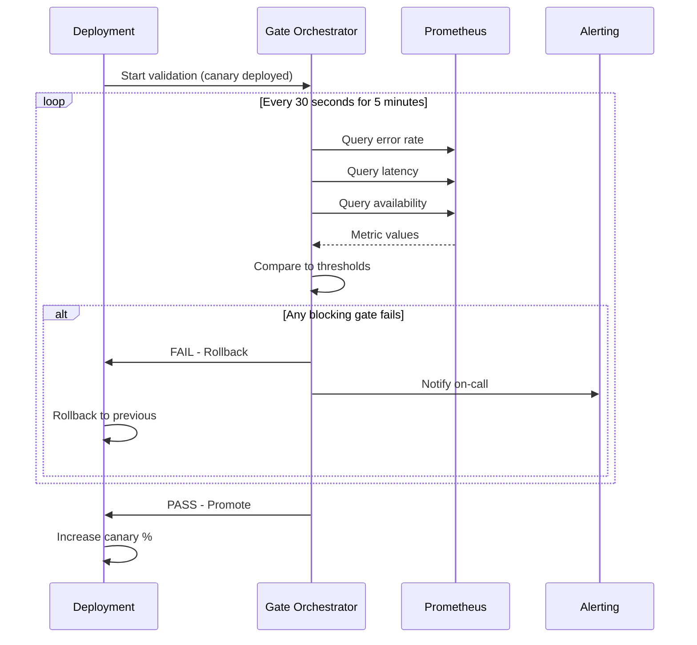

*[APM]: Application Performance Monitoring
*[DORA]: DevOps Research and Assessment
*[MTTR]: Mean Time To Recovery
*[OOM]: Out of Memory
*[P99]: 99th Percentile
*[SLI]: Service Level Indicator
*[SLO]: Service Level Objective

Quality gates exist to catch bad deployments. But gates that are too strict become the biggest obstacle to deployment velocity—and eventually, the biggest source of risk.

Here's the paradox: a gate with a 10% false positive rate will block legitimate deployments constantly. Engineers learn to bypass it. A gate that never fires provides no protection. Somewhere between "block everything" and "block nothing" is the sweet spot where gates catch real failures without becoming obstacles.

Consider a team that implemented the "full stack" of quality gates: test pass rate, code coverage thresholds, security scans, and performance benchmarks. On day one, everything's green and ships in five minutes. A month later, the security scanner adds new rules and flags a dependency vulnerability from 2019 that's not exploitable in their context. All deployments blocked. Someone adds an exception. Then coverage drops 0.1% because a refactor deleted dead code—blocked again. Exception added. Performance gate triggers on a cold-start test run—exception.

Within three months, the gate configuration had so many exceptions it caught nothing. Worse, when a gate _did_ fire, engineers assumed it was another false positive and bypassed without investigating.

They rebuilt the system with a different philosophy: _required gates_ (critical tests, security CVEs with CVSS 9+) versus _advisory gates_ (coverage trends, performance baselines). Required gates blocked deployments. Advisory gates logged warnings and alerted, but didn't block. False positives dropped 90%, and when a required gate fired, people actually investigated because they trusted it meant something.

The measure of a good gate isn't how many deployments it blocks—it's how many real incidents it prevents relative to how many good deployments it delays. Quality gates are probabilistic safety nets, not deterministic guarantees. The goal isn't zero risk; it's catching the failures that matter while letting good deployments through quickly.

This article covers gate design principles, implementation across pre- and post-deployment phases, configuration patterns for progressive delivery, and safe bypass mechanisms.

<Callout type="warning">
The most dangerous quality gate is one with so many false positives that teams stop trusting it. Gate fatigue leads to bypass culture, which means real failures slip through. Tune for precision over recall—it's better to miss some problems than to cry wolf constantly.
</Callout>

## Gate Design Principles

### What Makes a Good Gate

Not all checks belong in a deployment pipeline, and not all pipeline checks should block deployments. A well-designed gate has four characteristics: it's _actionable_, _deterministic_, _fast_, and _proportional_.

__Actionable__ means a failure provides clear next steps. "Test auth_login_test failed: expected 200, got 500" tells you exactly what broke. "Quality score below threshold" tells you nothing. If a developer can't understand what to fix from the gate failure message alone, the gate isn't actionable — and engineers will bypass rather than figuring out the reason for the failure.

__Deterministic__ means the same code produces the same result every time. Unit tests with fixed seeds pass this bar. Performance tests on shared infrastructure don't—network latency, noisy neighbors, and cold starts inject variance. Flaky gates train people to retry and ignore, which defeats the purpose. Non-deterministic checks should be advisory, not blocking.

__Fast__ means results arrive while context is still fresh. Pre-commit hooks should complete in under 30 seconds. Pre-merge gates should finish within 10 minutes. Post-deploy validation needs to reach a rollback decision within 5 minutes—longer than that, and you've already served bad traffic to users. Slow gates become bottlenecks, and bottlenecks get bypassed in emergencies.

__Proportional__ means severity matches actual risk. An authentication bypass is critical—block the deployment. A code style violation is low-risk—warn, don't block. A memory leak is serious but not catastrophic—block production deployments, but allow staging so you can investigate. Not all issues have equal impact; weight gates by the actual risk of the failure they detect.

### Gate Categories

Gates fall into three categories based on their precision and the criticality of what they detect:

| Category | Behavior | Criteria | Examples |
| -------- | -------- | -------- | -------- |
| Required blocking | Must pass; deployment blocked on failure | High precision, detects critical failures, fast execution | Unit tests, build success, CVE 9+ vulnerabilities, auth tests |
| Required advisory | Must run; failure alerts but doesn't block | Important but may have false positives; trends matter more than absolute values | Integration tests, performance baselines, code coverage |
| Optional | Available but not required | Nice-to-have insights, team-specific preferences | Code style beyond linting, documentation coverage, complexity metrics |

Table: Gate categories.

The key distinction: _blocking gates must have high precision_. If a gate blocks deployments, every failure should represent a real problem worth stopping for. Gates with lower precision—security scanners that flag unexploitable vulnerabilities, performance tests with inherent variance, integration tests that depend on external services—should be advisory. They surface useful information, but they don't stop the pipeline.

### Gate Anti-Patterns

Some gate configurations sound reasonable but cause problems in practice:

__Coverage absolutism__: "Block if coverage drops below 80%." The problem is that refactoring can legitimately drop coverage—deleting dead code, consolidating duplicated logic, or removing tests for deprecated features all reduce line counts. A better approach: alert if coverage drops more than 5% from the baseline, which catches significant regressions without penalizing cleanup work.

__All integration and E2E tests must pass__: "Any test failure blocks deployment." This anti-pattern typically affects integration and E2E tests, not unit tests. Unit tests should be deterministic—if one fails, fix it or delete it. But integration tests depend on external services and test environments, and E2E tests are notoriously flaky due to timing, browser quirks, and infrastructure variance. Making these tests blocking creates constant friction. Better: treat unit tests as blocking (they should all pass), but quarantine flaky integration and E2E tests into a separate non-blocking job with a deadline to fix or delete. Maintain a small, stable "critical path" E2E suite that _must_ pass—ten tests maximum—and run the full suite as advisory.

__Security theater__: "Block on any security scanner finding." Security scanners generate findings for non-exploitable vulnerabilities, deprecated-but-not-dangerous patterns, and theoretical attack vectors that don't apply to your context. Block on CVE 9+ (critical, actively exploited), alert on high-severity findings for triage, and log everything else. Otherwise, every deployment becomes a negotiation about which security findings to ignore.

__Performance regression zero tolerance__: "Block if any metric regresses." Performance varies run to run—test infrastructure, garbage collection timing, and background processes all introduce noise. A 2% latency increase might be real or might be measurement variance. Better: block if P99 latency regresses more than 20% across multiple runs, which filters out noise while catching real regressions.

### Measuring Gate Effectiveness

The ultimate question: is this gate worth having? Track these metrics to find out:

__Precision__ is the percentage of gate failures that represent real problems: true positives divided by all positives. Target 90%+ for blocking gates. If precision is 50%, half of all blocks are false alarms—engineers will stop trusting the gate.

__Recall__ is the percentage of real problems the gate catches: true positives divided by all actual problems. A gate can achieve 100% precision by never firing, so you need balance. Target 80%+ recall for critical issue types.

__False positive rate__ is false positives divided by total gate runs. For blocking gates, keep this under 5%. If it exceeds 10%, make the gate advisory until you've fixed it. Note that precision and false positive rate are related but not identical—precision measures failures specifically, while false positive rate measures all runs. A gate that rarely fires can have a low false positive rate but poor precision.

__Bypass rate__ is manual bypasses divided by gate failures. Target under 10%. A high bypass rate means the gate isn't trusted—either the gate is misconfigured or teams are cutting corners. Either way, you need to investigate.

How do you actually track these metrics? Most CI/CD platforms don't provide gate effectiveness dashboards out of the box—you need to build the instrumentation. The basic approach: emit structured events for every gate execution that include the gate name, result (pass/fail/bypass), duration, and any override justification, then ship those events to your observability platform.

The good news is that every major CI/CD platform supports this. GitHub Actions emits webhook events for workflow and job completions—configure a repository webhook pointing at your observability platform's HTTP intake endpoint, and you'll receive payloads with job names, statuses, and durations.[^1] Azure Pipelines has service hooks that can POST to any HTTP endpoint on pipeline events, plus native integration with Azure Monitor if you're in that ecosystem. AWS CodePipeline emits state-change events to EventBridge, which can route to CloudWatch, Lambda, or any external system. GitLab and Bitbucket both support webhooks for pipeline events.

[^1]: For GitHub Actions, configure webhooks under Settings → Webhooks with the `workflow_job` and `workflow_run` event types. The payload includes `job.name`, `job.conclusion`, `job.started_at`, and `job.completed_at`. For richer data—like which specific gate failed—add a step at the end of each job that POSTs a structured JSON payload to your observability endpoint using `curl` or the Datadog/Grafana GitHub Actions.

The raw webhook data gives you job-level pass/fail and timing, but for gate-specific metrics, add a step at the end of each gate job that explicitly posts the result. A simple `curl` command posting JSON to Datadog's HTTP API, Grafana Cloud's Loki endpoint, or even a Lambda function works fine. The key is consistency: every gate, every run, same schema.

The harder part is determining precision—you need to know which failures were "true positives" (real problems) versus "false positives" (noise). This requires a feedback loop: when engineers bypass a gate or when a gate-passed deployment causes an incident, record that outcome and join it back to the gate execution data. Weekly reviews of bypasses and post-incident analysis asking "did any gate fire for this?" close the loop. The Gate Configuration section below shows how to structure pipeline jobs to emit these events.

<Callout type="info">
Track every gate bypass with a required justification. High bypass rates indicate either gate misconfiguration or legitimate cases the gate doesn't handle. Either way, you need to know.
</Callout>

## Pre-Deployment Gates

Pre-deployment gates run before code reaches production—during CI builds, before merges, or as part of a deployment pipeline. These gates are your first line of defense, catching problems while they're still cheap to fix.

### Build and Compile Gates

The most fundamental gates are deterministic and should always block:

__Compilation__ has a near-zero false positive rate. If the code doesn't compile, there's nothing to discuss—fail fast and don't waste time on subsequent gates.

__Linting__ catches syntax issues and definite bugs with very low false positives. The key is distinguishing lint _errors_ (block) from lint _warnings_ (log but don't block). Configure your linter to only error on rules the team has agreed are non-negotiable; demote everything else to warnings.

__Type checking__ for TypeScript, Java, or other typed languages is effectively deterministic. Type errors represent real bugs—type mismatches, null reference risks, interface violations. Block on these.

### Test Gates

Test gates require more nuance because different test types have different reliability characteristics:

__Unit tests__ should be blocking with a 100% pass rate requirement. Unit tests are fast, deterministic, and isolated—if one fails, it's a real bug. The exception is a genuinely flaky unit test, which should be fixed immediately or deleted. Don't quarantine unit tests; they shouldn't be flaky in the first place.

__Integration tests__ are trickier. They depend on external systems, test databases, and service dependencies that introduce variance. A test might fail because of a real bug, or because the test database wasn't seeded correctly, or because a downstream service timed out. Make integration tests required-advisory: run them on every build, alert on failures, but allow deployment with approval if the failure is environmental rather than code-related.

__E2E tests__ are the most prone to flakiness—browser timing, network latency, animation races, and test infrastructure all inject variance. Run a small critical-path suite (under ten tests covering login, checkout, or whatever your core flows are) as blocking, and relegate the full E2E suite to post-deploy or nightly runs. The full suite provides valuable coverage, but it shouldn't gate every deployment.

__Contract tests__ verify that API changes don't break consumers. If you're using consumer-driven contracts (Pact, for example), these should be blocking—a contract violation means you're about to break a downstream service. The false positive rate is low as long as contracts are properly versioned.

### Coverage Gates

Coverage gates are where teams most often go wrong. Absolute coverage thresholds ("block if coverage drops below 80%") cause gaming and penalize legitimate refactoring. Better approaches:

__Coverage delta__ alerts if coverage drops more than 5% from the baseline. This catches significant regressions—someone deleting tests or adding large amounts of untested code—without blocking normal variance.

__New code coverage__ requires that new or changed lines have reasonable coverage (70-80%). This ensures new code is tested without holding the entire codebase to an arbitrary standard. Block only if new code has zero coverage; warn if it's below threshold.

### Security Gates

Security gates protect against vulnerabilities, exposed secrets, and unsafe code patterns. The challenge is balancing thoroughness against false positive fatigue—security scanners are notorious for generating noise.

__Dependency vulnerability scanning__ (Snyk, Dependabot, npm audit, or similar) checks your dependencies against known vulnerability databases. The key is severity-based thresholds:

| CVSS Score | Severity | Gate Behavior |
| ---------- | -------- | ------------- |
| 9.0+ | Critical | Block deployment—actively exploited or trivially exploitable |
| 7.0-8.9 | High | Block production, allow staging for assessment |
| 4.0-6.9 | Medium | Advisory—track in backlog, don't block |
| Below 4.0 | Low | Log only—fix opportunistically |

Table: Vulnerability severity thresholds.

For vulnerabilities that aren't exploitable in your context (wrong OS, unexposed code path, mitigating controls in place), maintain an allowlist with expiration dates. Review the allowlist monthly—exceptions shouldn't live forever.

__SAST (static analysis)__ tools like CodeQL, Semgrep, or SonarQube scan code for security anti-patterns, injection risks, and unsafe operations. These tools have higher false positive rates than vulnerability scanners, so start with high-confidence rules only and add rules gradually based on your team's capacity to triage findings. If a rule has more than 20% false positives, disable it until it's improved.

__Secrets scanning__ (GitLeaks, TruffleHog, detect-secrets) looks for API keys, passwords, and credentials accidentally committed to the repository. This is one of the few gates that should be zero-tolerance blocking. Modern secret scanners have very low false positive rates, and the impact of a leaked secret—exposed infrastructure, compromised accounts, data breaches—is severe enough to justify stopping everything.

<Callout type="danger">
Secrets scanning should be zero-tolerance blocking. The false positive rate for modern secret scanners is very low, and the impact of leaked secrets is severe. This is one gate where blocking on every finding is justified.
</Callout>

## Post-Deployment Gates

Pre-deployment gates catch problems before code ships, but they can't catch everything. Some failures only manifest under real traffic: memory leaks that appear after hours of load, race conditions that require specific request patterns, or performance regressions that only show up at production scale. Post-deployment gates watch for these problems and trigger rollbacks before they become incidents.

### Immediate Validation

The first 30-60 seconds after deployment are critical. If something is catastrophically broken—the service won't start, dependencies are unreachable, or the app crashes immediately—you want to know before traffic shifts.

__Health checks__ are the most basic gate: can the service respond to a health endpoint? Does it report all dependencies as reachable? Is it avoiding crash loops? This gate should be blocking with automatic rollback. If the service can't pass a basic health check within 60 seconds, roll back immediately.

__Smoke tests__ run slightly later, 30-120 seconds post-deploy, and verify that critical paths work: authentication, core API endpoints, essential business flows. Keep the scope small—five to ten operations maximum—so the gate completes quickly. These should also trigger automatic rollback on failure.

__Startup metrics__ watch for resource problems during initialization: OOM kills, CPU pegged at 100%, or an explosion of error logs. These are advisory rather than blocking because some variance is expected during startup, but significant anomalies should alert for investigation.

### Canary Validation

Once immediate health is confirmed, canary validation compares the new version against the baseline over a longer observation window. The core metrics:

__Error rate__ compares 5xx responses between canary and stable traffic. Fail if the canary error rate exceeds the baseline by more than 1 percentage point, or if it exceeds 5% absolute. The observation window should be at least five minutes to gather enough data.

__Latency__ compares P99 response times. Fail if the canary P99 exceeds 1.5x the baseline, or if it exceeds your SLO threshold regardless of baseline. Again, five minutes minimum observation.

__Saturation__ watches resource utilization—CPU, memory, connection pools. If any metric spikes above 80% while the baseline is below 50%, something's wrong. This catches resource leaks and inefficient code paths before they exhaust capacity.

__Business metrics__ like conversion rate, checkout completion, or search success rate require longer observation windows (15-30 minutes) because they have higher variance. Make these advisory for small changes, blocking only for significant regressions (more than 10% decline).

### Progressive Rollout Gates

Progressive delivery—gradually shifting traffic from 1% to 10% to 50% to 100%—gives you multiple opportunities to catch problems before full exposure. Each stage should have its own gate criteria:

| Stage | Duration | Required Gates |
| ----- | -------- | -------------- |
| 1% canary | 5 minutes | Health check, error rate, latency |
| 10% canary | 10 minutes | Error rate, latency, saturation |
| 50% canary | 15 minutes | Error rate, latency, business metrics |
| Full rollout | 15 minute bake | All metrics stable |

Table: Progressive rollout gate stages.

If all gates pass for the required duration, promote automatically to the next stage. If any blocking gate fails, roll back to the previous version and alert the on-call engineer. This automation is the real value of post-deployment gates—they enable continuous deployment without requiring a human to watch every release.

### Metric-Based Gate Implementation

Post-deployment gates need to query your metrics system, compare values against thresholds, and make pass/fail decisions. The pattern is straightforward: define a query for the current value, optionally define a baseline query for comparison, specify thresholds (absolute, relative, or both), and evaluate over an observation window.



Figure: Post-deployment validation flow.

The key insight for threshold configuration: combine absolute and relative thresholds. Absolute thresholds catch catastrophic failures—error rate above 10% is bad regardless of baseline. Relative thresholds catch regressions—error rate doubled from baseline is concerning even if it's still "low" in absolute terms. Together they handle both new failures and gradual degradation.

<Callout type="success">
Combine absolute and relative thresholds. Absolute thresholds catch catastrophic failures (error rate > 10%). Relative thresholds catch regressions (error rate doubled from baseline). Together they handle both new failures and gradual degradation.
</Callout>

## Post-Deployment Gate Configuration

Pre-deployment gate configuration in CI systems is likely familiar territory—running linters, unit tests, and security scans in GitHub Actions, GitLab CI, or similar. This section focuses on the less common pattern: post-deployment gates that validate canary deployments and trigger automatic rollbacks.

### GitHub Actions Post-Deployment Gates

The post-deployment validation job runs after canary deployment, queries your metrics system, and decides whether to promote or rollback. The pattern works with any CI system that supports conditional job execution.

```yaml title="github-actions-post-deploy.yaml"
# GitHub Actions post-deployment validation
jobs:
  deploy-canary:
    needs: [build, security, quality]  # Pre-deployment gates
    runs-on: ubuntu-latest
    environment: production-canary
    steps:
      - name: Deploy Canary (1%)
        run: ./deploy.sh --canary --percentage 1

  validate-canary:
    needs: deploy-canary
    runs-on: ubuntu-latest
    steps:
      - name: Checkout code
        uses: actions/checkout@v4

      - name: Set up Python
        uses: actions/setup-python@v5
        with:
          python-version: '3.10'

      - name: Install dependencies
        run: pip install requests

      - name: Run Validation Gate
        env:
          PROMETHEUS_URL: ${{ secrets.PROMETHEUS_URL }}
          CANARY_URL: "https://canary.example.com"
        run: python scripts/validate_canary.py

  promote-or-rollback:
    needs: validate-canary
    runs-on: ubuntu-latest
    if: always()
    steps:
      - name: Promote on success
        if: needs.validate-canary.result == 'success'
        run: ./deploy.sh --promote --percentage 100

      - name: Rollback on failure
        if: needs.validate-canary.result == 'failure'
        run: ./deploy.sh --rollback
```

Code: GitHub Actions post-deployment gates.

The validation logic lives in a separate Python script that queries Prometheus and checks each gate in sequence. This separation keeps the workflow readable and makes the gate logic testable independently:

```python title="validate_canary.py"
import requests
import sys
import os

PROMETHEUS_URL = os.getenv("PROMETHEUS_URL")
CANARY_URL = os.getenv("CANARY_URL")

def check_health():
    try:
        resp = requests.get(f"{CANARY_URL}/health", timeout=5)
        return resp.status_code == 200
    except:
        return False

def query_prometheus(query):
    endpoint = f"{PROMETHEUS_URL}/api/v1/query"
    resp = requests.get(endpoint, params={'query': query})
    resp.raise_for_status()
    result = resp.json()['data']['result']
    return float(result[0]['value'][1]) if result else 0.0

def main():
    # 1. Health Check
    if not check_health():
        print("❌ Health check failed")
        sys.exit(1)

    # 2. Error Rate Gate
    error_query = 'sum(rate(http_requests_total{status=~"5..",version="canary"}[5m])) / sum(rate(http_requests_total{version="canary"}[5m]))'
    error_rate = query_prometheus(error_query)
    if error_rate > 0.05:
        print(f"❌ Error rate {error_rate:.4f} > 0.05")
        sys.exit(1)

    # 3. Latency Gate
    latency_query = 'histogram_quantile(0.99, sum(rate(http_request_duration_seconds_bucket{version="canary"}[5m])) by (le))'
    p99 = query_prometheus(latency_query)
    if p99 > 2.0:
        print(f"❌ P99 Latency {p99:.2f}s > 2.0s")
        sys.exit(1)

    print("✅ All gates passed!")

if __name__ == "__main__":
    main()
```

Code: Python validation script for canary gates.

### Argo Rollouts Integration

For Kubernetes deployments, Argo Rollouts provides native support for progressive delivery with metric-based gates. Instead of shell scripts querying Prometheus, you define AnalysisTemplates that Argo evaluates automatically during rollout.

The Rollout resource defines the canary strategy—traffic weights, pause durations, and which analysis templates to run at each stage:

```yaml title="argo-rollout-strategy.yaml"
# Argo Rollouts canary strategy with analysis gates
apiVersion: argoproj.io/v1alpha1
kind: Rollout
metadata:
  name: my-service
spec:
  replicas: 10
  strategy:
    canary:
      steps:
        - setWeight: 5
        - pause: {duration: 2m}
        - analysis:
            templates:
              - templateName: error-rate-check
              - templateName: latency-check
        - setWeight: 25
        - pause: {duration: 5m}
        - analysis:
            templates:
              - templateName: error-rate-check
              - templateName: latency-check
              - templateName: business-metrics
        - setWeight: 50
        - pause: {duration: 10m}
        - analysis:
            templates:
              - templateName: full-validation
        - setWeight: 100
      autoPromotionEnabled: false
      scaleDownDelaySeconds: 30
```

Code: Argo Rollouts canary strategy.

Each AnalysisTemplate defines a metric query, success condition, and failure tolerance. The error rate check runs every 30 seconds for 10 iterations, allowing up to 3 failures before failing the gate:

```yaml title="argo-error-rate-template.yaml"
# Error rate analysis template
apiVersion: argoproj.io/v1alpha1
kind: AnalysisTemplate
metadata:
  name: error-rate-check
spec:
  metrics:
    - name: error-rate
      interval: 30s
      count: 10
      successCondition: result[0] < 0.05
      failureLimit: 3
      provider:
        prometheus:
          address: http://prometheus:9090
          query: |
            sum(rate(http_requests_total{status=~"5..",
              rollouts_pod_template_hash="{{args.canary-hash}}"}[5m]))
            /
            sum(rate(http_requests_total{
              rollouts_pod_template_hash="{{args.canary-hash}}"}[5m]))
```

Code: Argo Rollouts error rate template.

Latency checks follow the same pattern—query P99 latency and fail if it exceeds your threshold:

```yaml title="argo-latency-template.yaml"
# Latency analysis template
apiVersion: argoproj.io/v1alpha1
kind: AnalysisTemplate
metadata:
  name: latency-check
spec:
  metrics:
    - name: p99-latency
      interval: 30s
      count: 10
      successCondition: result[0] < 2.0
      failureLimit: 3
      provider:
        prometheus:
          address: http://prometheus:9090
          query: |
            histogram_quantile(0.99,
              sum(rate(http_request_duration_seconds_bucket{
                rollouts_pod_template_hash="{{args.canary-hash}}"}[5m])) by (le))
```

Code: Argo Rollouts latency template.

Business metrics like conversion rate require baseline comparison—you're not checking against an absolute threshold, but against what the stable version is achieving. The `baseline` field defines a second query, and the success condition compares the two:

```yaml title="argo-business-metrics-template.yaml"
# Business metrics analysis template with baseline comparison
apiVersion: argoproj.io/v1alpha1
kind: AnalysisTemplate
metadata:
  name: business-metrics
spec:
  metrics:
    - name: conversion-rate
      interval: 60s
      count: 5
      successCondition: result[0] >= (baseline[0] * 0.95)
      failureLimit: 2
      provider:
        prometheus:
          address: http://prometheus:9090
          query: |
            sum(rate(conversions_total{version="canary"}[10m]))
            /
            sum(rate(page_views_total{version="canary"}[10m]))
      baseline:
        provider:
          prometheus:
            address: http://prometheus:9090
            query: |
              sum(rate(conversions_total{version="stable"}[10m]))
              /
              sum(rate(page_views_total{version="stable"}[10m]))
```

Code: Argo Rollouts business metrics template.

The templates above cover the most common gate patterns: absolute thresholds for error rates and latency, and baseline comparisons for business metrics. Together with the progressive rollout strategy, they form a complete automated validation pipeline. The failure limits and iteration counts let you tune sensitivity—tighter limits catch problems faster but are more prone to false positives from metric noise.

| Gate Type | Timing | Blocking | Rollback |
|-----------|--------|----------|----------|
| Build | Pre-deploy | Yes | N/A |
| Unit tests | Pre-deploy | Yes | N/A |
| Security scan | Pre-deploy | Conditional | N/A |
| Health check | Post-deploy (immediate) | Yes | Automatic |
| Error rate | Post-deploy (5 min) | Yes | Automatic |
| Latency | Post-deploy (5 min) | Yes | Automatic |
| Business metrics | Post-deploy (15 min) | Advisory | Manual |

Table: Gate timing and behavior.

<Callout type="info">
Progressive delivery tools like Argo Rollouts and Flagger automate the observation-decision loop. They continuously evaluate metrics and automatically promote or rollback based on gate results—no manual intervention needed for common cases.
</Callout>

## Bypass and Override

Even well-tuned gates occasionally need bypassing. A critical production incident might require an immediate hotfix. A known false positive might block an unrelated deployment. A flaky test might fail once and pass on retry. The question isn't whether to allow bypasses—it's how to allow them safely while maintaining accountability.

### Bypass Categories

Not all bypasses are equal. Categorizing them helps determine the appropriate approval level and follow-up:

__Emergency bypass__ is for critical production incidents where the fix must deploy immediately. This requires approval from both the on-call engineer and an engineering manager. Document the incident ID, which gates were bypassed, and why. Every emergency bypass should become a retrospective item—either the gate was wrong (fix it) or a real problem was bypassed (understand why).

__Known issue bypass__ handles documented false positives. If a gate fails due to a known issue that's already tracked, any engineer can bypass by referencing the existing issue. The bypass is tied to issue resolution—when the issue is fixed, the bypass goes away. This prevents permanent exceptions that outlive their justification.

__Flaky test bypass__ can be automated with limits. If a test fails once but passes on retry (up to three attempts), allow the deployment but flag the flaky occurrence. Auto-file an issue after three flaky occurrences. This keeps deployments moving without letting flaky tests become invisible.

### Implementation

The simplest bypass mechanism in GitHub Actions is a PR label. If the PR has a `bypass-gates` label, skip the gate but log a warning:

```yaml title="github-actions-bypass.yaml"
# GitHub Actions bypass via PR label
- name: Check for bypass
  id: bypass
  run: |
    if [[ "${{ contains(github.event.pull_request.labels.*.name, 'bypass-gates') }}" == "true" ]]; then
      echo "bypass=true" >> $GITHUB_OUTPUT
      echo "::warning::Gates bypassed via label"
    fi

- name: Run gate
  if: steps.bypass.outputs.bypass != 'true'
  run: ./run-gate.sh
```

Code: GitHub Actions bypass implementation.

The `run-gate.sh` script referenced above should handle audit logging internally—writing a structured JSON record to your observability platform with the gate name, result, duration, and whether a bypass was active. When `steps.bypass.outputs.bypass` is true, the script still runs but logs the bypass flag, creating the audit trail without blocking the deployment.

PR labels work well for ad-hoc bypasses, but other patterns exist. Branch naming conventions provide another approach: branches prefixed with `hotfix/` can trigger different gate configurations via branch protection rules. Configure your branch protection to allow hotfix branches to merge with fewer required checks, but ensure the workflow still logs which gates were skipped. The audit trail remains intact because the branch name, commit SHA, and PR metadata are captured in the deployment record.

For teams using GitLab, similar patterns apply: protected branches with different rule sets for hotfix namespaces, or CI variables that modify gate behavior based on branch patterns. The key is consistency—regardless of the bypass mechanism, every deployment should record which gates ran, which passed, which were skipped, and why. This data powers your bypass rate metrics and weekly reviews.

### Preventing Abuse

Bypasses should be rare. If they're not, something's wrong—either with your gates or with your culture. Guard rails help:

__Rate limiting__: Set a threshold like three bypasses per team per week. Beyond that, require director approval. This creates friction that encourages fixing the underlying problem rather than repeatedly bypassing.

__Weekly review__: Engineering leadership should review all bypasses weekly. Look for patterns: same gate bypassed repeatedly (fix the gate), same team bypassing frequently (investigate why), bypasses followed by incidents (gates were right).

__Automatic escalation__: If the same gate is bypassed three or more times, auto-create an issue assigned to the platform team. The gate either has a precision problem or teams don't understand what it's catching.

__Transparency__: Make bypass rates visible on a dashboard accessible to all engineers. Social pressure helps—no one wants to be the team with the highest bypass rate.

<Callout type="warning">
Every bypass should create a paper trail. If you're bypassing gates regularly, either your gates are misconfigured or you have real quality problems. Track bypass rates as a health metric for your gate system.
</Callout>

## Conclusion

Quality gates are probabilistic safety nets, not guarantees. They work by shifting the odds—making it less likely that broken code reaches production, not impossible. Accepting this framing changes how you design them.

The tension between safety and velocity is real, but it's not a trade-off you make once. It's a dial you tune continuously. The patterns in this article give you the knobs: blocking versus advisory gates, absolute versus relative thresholds, progressive rollouts with automated rollback. Use them to find the balance that fits your risk tolerance and deployment cadence.

A few principles to carry forward:

__Design for precision over recall__. A gate that blocks one real problem and ten false positives is worse than no gate at all. Engineers will route around it, and trust in the whole system erodes. Better to catch fewer problems with high confidence.

__Categorize ruthlessly__. Not every gate belongs in the critical path. Compile failures must block. Security vulnerabilities must block. But a 2% coverage regression? A 50ms latency increase? Those deserve investigation, not pipeline failure. Advisory gates surface the signal without creating friction.

__Combine threshold types__. Absolute thresholds catch catastrophic failures (error rate above 5%, latency above 2 seconds). Relative thresholds catch regressions (20% worse than baseline). Used together, they're robust against both disaster and slow degradation.

__Automate the hard part__. Manual approval gates don't scale. Progressive delivery tools like Argo Rollouts and Flagger shift the burden from humans to metrics. Define what "healthy" means, and let automation enforce it.

__Maintain escape hatches__. Bypasses aren't a failure mode—they're a feature. Production incidents don't wait for flaky tests to stabilize. But bypasses need audit trails, approval workflows, and weekly review. Uncontrolled bypasses defeat the purpose.

The goal isn't zero-risk deployments. Zero risk means zero deployments, which means zero value delivered. The goal is catching the failures that matter while maintaining the velocity your business requires.

Measure gate effectiveness by the ratio of incidents prevented to false positives generated. If that ratio is high, your gates are earning their keep. If it's low, you're paying in friction for safety you're not receiving. Track it, tune it, and be willing to remove gates that aren't carrying their weight.

<Callout type="success">
The ultimate test of a quality gate system: when a gate fails, do engineers investigate or bypass? If they investigate, you've built trust. If they bypass, you've built friction. Design for the former.
</Callout>

---
