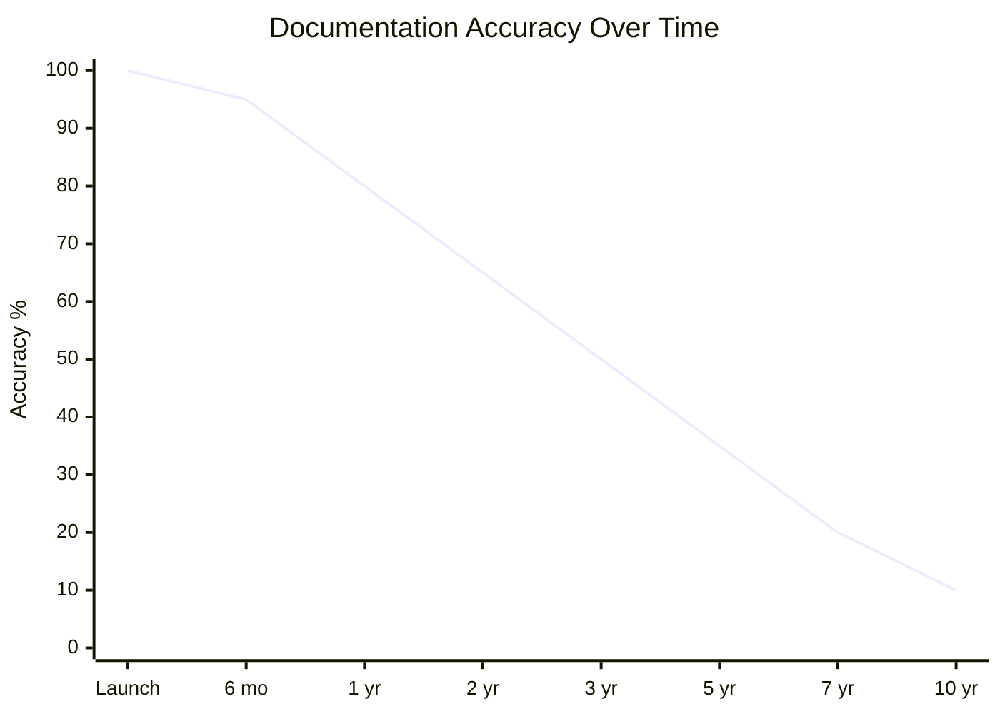
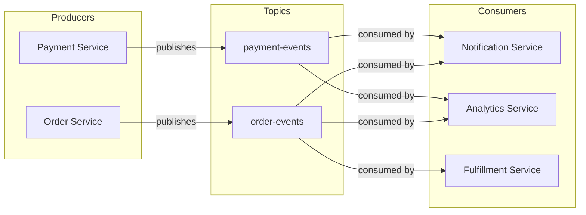
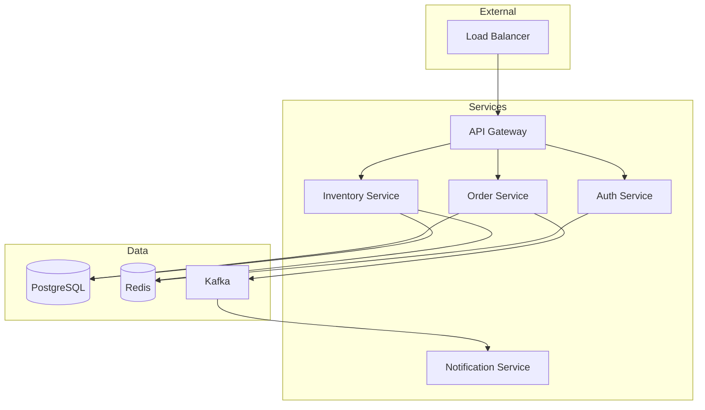

*[ADR]: Architecture Decision Record
*[ADRs]: Architecture Decision Records
*[API]: Application Programming Interface
*[AST]: Abstract Syntax Tree
*[DDD]: Domain-Driven Design
*[ERD]: Entity Relationship Diagram
*[IDE]: Integrated Development Environment
*[ORM]: Object-Relational Mapping
*[SQL]: Structured Query Language
*[UML]: Unified Modeling Language

You've inherited a system with a README that was last updated three years ago, architecture diagrams that reference services that no longer exist, and an API spec that describes maybe 60% of the actual endpoints. The original architects left two reorganizations ago. The wiki has seventeen conflicting pages about deployment, and no one's sure which ones are current.

This is a familiar starting point for anyone who works with legacy systems. The approach that works isn't trying to document everything from scratch—it's systematically extracting knowledge from the running system, the codebase, the version history, and the people who've kept it alive. Code archaeology, runtime observation, and tests as executable documentation.

## The Reality of Legacy Documentation

Every long-lived system follows the same documentation trajectory: accurate documentation at launch, gradual drift as changes accumulate, and eventually a state where the documentation is worse than useless because it describes a system that no longer exists.

### Documentation Decay Lifecycle

The pattern is predictable. Day one, someone writes docs that match the system perfectly. By month six, a few changes have gone in without doc updates—urgent fixes, small features, "temporary" workarounds. The documentation is now 95% accurate, which sounds fine until you hit that 5% during an incident.

By year three, architecture drift has set in. Services have been renamed, split, or consolidated. New integrations exist that aren't mentioned anywhere. The diagrams show data flowing through components that were deprecated eighteen months ago.



Figure: Documentation accuracy decay in a typical legacy system.

By _year five_ or beyond, the documentation has crossed into negative value territory. It's not just incomplete—it's actively misleading. New team members read it and form incorrect mental models that take months to unlearn. Incident responders follow outdated runbooks and make problems worse.

<Callout type="warning">
The inflection point where documentation becomes harmful rather than helpful typically occurs around year three. After that, every diagram and doc page needs verification before being trusted.
</Callout>

### Categories of Documentation Debt

Not all documentation problems are the same, and the remediation approach differs for each type:

_Missing documentation_ is honestly the easiest to deal with. You know you don't know something, so you investigate. There's no unlearning required.

_Outdated documentation_ is more dangerous. It was correct once, so it has the appearance of authority. You might follow it for weeks before realizing the integration endpoint moved six months ago.

_Actively wrong documentation_ is the worst. This isn't documentation that drifted—it's documentation that describes a completely different system, often because someone copied a template from another project and never filled in the details.

_Tribal knowledge_ represents information that exists only in people's heads. The senior engineer who knows why the cron job runs at 3:47 AM instead of midnight, or why that one table has a column that's always null but can't be removed.

_Scattered documentation_ exists but is unfindable. There's a Confluence page, a Google Doc, three README files, and a Slack thread with the actual answer, but no one knows which one to trust or where to look.

| Category | Risk Level | Remediation Approach |
|----------|------------|---------------------|
| Missing | Medium | Discovery through code analysis and runtime observation |
| Outdated | High | Verification against running system before use |
| Actively Wrong | Critical | Delete and rediscover; unlearning is harder than learning |
| Tribal Knowledge | High | Structured interviews and knowledge extraction sessions |
| Scattered | Medium | Consolidation and single-source-of-truth establishment |

Table: Documentation debt categories and remediation strategies.

### Assessing Current Documentation State

Before you can fix documentation, you need to know what you have. I run a documentation audit early in any legacy system engagement—catalog everything that exists, assign trust scores, and identify the highest-risk gaps.

The trust score formula I use weights two factors: how recently the documentation was modified, and whether anyone has verified it against the running system. Documentation that hasn't been touched in two years but was verified last month is more trustworthy than documentation updated yesterday but never validated.

For each documentation artifact, I track:

- _Location_: Where does this doc live? (Wiki, repo, Google Drive, someone's desktop)
- _Last modified_: When was the file last changed?
- _Last verified_: When did someone confirm this matches reality?
- _Coverage areas_: What does this doc claim to cover?
- _Known gaps_: What's explicitly missing?
- _Owner_: Who's responsible for keeping this current?

The coverage areas I care about most are architecture (how components connect), API contracts (what services expose), data models (what gets stored where), deployment (how to ship changes), operations (how to keep it running), business rules (the logic that makes money), and integrations (what external systems we depend on).

<Callout type="info">
Documentation without an owner is documentation that will rot. Every doc artifact needs someone accountable for its accuracy, even if that person changes over time.
</Callout>

## Code Archaeology: Reading the Codebase

When documentation fails, the codebase becomes your primary source of truth. The challenge is that code tells you _what_ the system does, but rarely _why_. Code archaeology is the practice of extracting architectural understanding through systematic analysis—static analysis for structure, git history for evolution and context, and careful reading for business intent.

### Static Analysis for Structure Discovery

Before diving into individual files, you need a map of the territory. Static analysis tools can generate dependency graphs, identify module boundaries, and reveal the actual architecture (as opposed to whatever the diagrams claim).

For JavaScript and TypeScript codebases, tools like Madge or dependency-cruiser can generate dependency graphs from import statements. The output often surprises people—the "clean architecture" in the design doc rarely matches the actual import graph.

```bash
# Generate dependency graph with Madge
npx madge --image dependency-graph.svg src/

# Find circular dependencies (often indicate architectural problems)
npx madge --circular src/

# Generate dependency graph for a specific entry point
npx dependency-cruiser --output-type dot src/index.ts | dot -T svg > deps.svg
```

Code: Generating dependency visualizations with Madge and dependency-cruiser.

For larger codebases, I focus on specific questions rather than trying to graph everything:

- What depends on this module I'm about to change?
- Which modules have the most inbound dependencies (likely core abstractions)?
- Which modules have the most outbound dependencies (likely orchestration layers)?
- Are there unexpected dependencies between domains that should be isolated?

The answers often reveal the real architecture—the one that evolved under deadline pressure rather than the one in the planning documents.

### Git Archaeology: Mining Version History

Git history is an underutilized documentation source. It tells you not just what changed, but when, by whom, and (if commit messages are decent) why. More importantly, it tells you who to ask when you have questions.

```bash
# Find the most-changed files (likely core business logic or problem areas)
git log --pretty=format: --name-only | sort | uniq -c | sort -rg | head -20

# Find who knows the most about a specific file
git shortlog -sn -- path/to/critical/file.ts

# Find deleted files that might explain current weirdness
git log --diff-filter=D --summary | grep delete

# Trace the history of a specific function (pickaxe search)
git log -p -S "calculateDiscount" -- "*.ts"
```

Code: Git commands for code archaeology.

The most-changed files list is particularly valuable. Files that change constantly are either core business logic (important to understand deeply) or poorly designed modules that everyone keeps patching (important to approach carefully). Either way, they deserve attention.

<Callout type="info">
`git blame` tells you who wrote each line, but the commit message tells you _why_. A message like "fix prod issue #1234" points you to a ticket with context. Follow those breadcrumbs.
</Callout>

The pickaxe search (`-S`) is invaluable for understanding how a specific function or feature evolved. It finds commits that added or removed the search string, letting you trace the history of a particular piece of logic through refactors and file moves.

I also look for ticket references in commit messages. If your team uses Jira, GitHub issues, or similar, you can extract a list of tickets associated with any file:

```bash
# Extract Jira ticket references from a file's commit history
git log --format="%s" -- src/billing/invoice.ts | grep -oE '[A-Z]+-[0-9]+' | sort -u
```

Code: Extracting ticket references from git history.

Those tickets often contain requirements discussions, bug reports, and context that never made it into comments or documentation.

### Reading Code for Intent

Static analysis tells you structure; git tells you history. But understanding _intent_—the business rules encoded in the code—requires actually reading it. The challenge is knowing where to focus.

I start with functions that have names suggesting business logic: `isEligible`, `calculateDiscount`, `canProcess`, `shouldRetry`, `validateOrder`. These naming patterns usually indicate decision points where business rules live.

Conditional logic is where business rules hide. A function with multiple `if` statements or a `switch` on a status field is almost certainly encoding business requirements. The question is whether anyone documented what those requirements are.

```typescript
// This function encodes at least four business rules:
function calculateShippingCost(order: Order): number {
  // Rule 1: Free shipping threshold
  if (order.subtotal >= 100) {
    return 0
  }

  // Rule 2: Prime members get reduced shipping
  if (order.customer.isPrimeMember) {
    return 4.99
  }

  // Rule 3: Heavy items have surcharge
  if (order.totalWeight > 50) {
    return 12.99 + (order.totalWeight - 50) * 0.50
  }

  // Rule 4: Default flat rate
  return 7.99
}
```

Code: Business rules embedded in conditional logic.

When I find code like this, I document what I discover—even if it's just comments in a scratch file. The free shipping threshold is $100, not $75 or $150. Prime members pay $4.99. Heavy item surcharges kick in at 50 pounds. These are the kinds of details that requirements documents often get wrong or omit entirely.

Magic numbers are another signal. When you see `if (daysOverdue > 30)` or `const maxRetries = 5`, those numbers came from somewhere. Sometimes there's a comment. Sometimes the git history explains it. Sometimes you have to ask someone. But those numbers represent decisions that someone made, and understanding why helps you know whether they're still appropriate.

## Runtime Observation: Watching the System

Static analysis tells you what the code _could_ do. Runtime observation tells you what it _actually_ does. The difference matters more than you'd expect—dead code paths, unused endpoints, and theoretical integrations that never fire in production. Observing the running system reveals the real architecture.

### Traffic Analysis and Request Mapping

The fastest way to understand an undocumented API is to watch what traffic actually hits it. You'll discover endpoints that aren't in any spec, parameters that the docs don't mention, and entire features that only exist because someone needed them once and they've been running ever since.

If you have access to existing observability infrastructure, start there. Most APM tools (Datadog, New Relic, Dynatrace) can show you the endpoints that receive traffic, their request/response patterns, and downstream dependencies. AWS X-Ray and similar distributed tracing tools map service-to-service calls automatically.

If you don't have observability in place, traffic mirroring is your friend. Most load balancers and service meshes support mirroring a percentage of production traffic to an analysis endpoint without affecting the live request path.

```yaml
# Istio traffic mirroring for request analysis
apiVersion: networking.istio.io/v1beta1
kind: VirtualService
metadata:
  name: api-mirror
spec:
  hosts:
    - api-service
  http:
    - route:
        - destination:
            host: api-service
      mirror:
        host: api-analyzer
      mirrorPercentage:
        value: 10.0
```

Code: Istio configuration for mirroring 10% of traffic to an analysis service.

The analysis doesn't need to be sophisticated. Even a simple log of method, path, response code, and latency gives you a real endpoint inventory. Normalize the paths (replace `/users/12345` with `/users/:id`) and you'll have a list of actual API routes within a few hours of traffic.

What you're looking for:

- _Endpoint inventory_: Which routes actually receive traffic versus which ones are documented
- _Traffic patterns_: Which endpoints are called together (often reveals workflows)
- _Dependency map_: Which downstream services get called for each inbound request
- _Error patterns_: Which endpoints fail and under what conditions

### Database Query Analysis

Database queries reveal the true data model—not the ERD diagram from five years ago, but how the application actually uses the database today. Query logs show which tables are joined together (revealing relationships), which columns are filtered on (revealing access patterns), and which indexes matter (revealing performance-critical paths).

PostgreSQL's `pg_stat_statements` extension is invaluable here. It captures normalized queries with execution statistics without the overhead of full query logging.

```sql
-- Enable pg_stat_statements (requires superuser, config reload)
CREATE EXTENSION IF NOT EXISTS pg_stat_statements;

-- Find most frequently executed queries
SELECT
  substring(query, 1, 100) as query_preview,
  calls,
  mean_exec_time as avg_ms,
  rows / calls as avg_rows
FROM pg_stat_statements
ORDER BY calls DESC
LIMIT 20;

-- Find queries hitting specific tables (reveals relationships)
SELECT query, calls
FROM pg_stat_statements
WHERE query ILIKE '%orders%'
  AND query ILIKE '%JOIN%'
ORDER BY calls DESC;
```

Code: PostgreSQL queries for analyzing database access patterns.

The JOIN patterns are particularly revealing. If `orders` always joins with `customers` on `customer_id`, that's a relationship. If `orders` sometimes joins with `shipping_addresses` and sometimes with `billing_addresses`, those are optional relationships with different semantics. The query patterns tell you how the data model is actually used, which is often different from how it was designed.

<Callout type="warning">
Full query logging in production creates massive log volume and may capture sensitive data. Use `pg_stat_statements` for statistics or enable logging only briefly with sampling. Filter PII before storing any query logs.
</Callout>

### Event and Message Flow Tracing

Asynchronous systems—message queues, event buses, pub/sub—are notoriously hard to document because the connections aren't visible in the code. A service publishes to a topic; some other service consumes from it. The relationship exists at runtime but is invisible to static analysis.

For Kafka-based systems, the consumer group lag metrics and partition assignments tell you which services consume which topics. Combined with producer metrics, you can map the complete event flow.

```bash
# Located in $KAFKA_HOME/bin; ships with Apache Kafka distribution

# List all consumer groups and their subscribed topics
kafka-consumer-groups.sh --bootstrap-server localhost:9092 --list

# Describe a specific consumer group to see topic assignments
kafka-consumer-groups.sh --bootstrap-server localhost:9092 \
  --group order-processor --describe
```

Code: Kafka commands for discovering consumer relationships.

For AWS SQS/SNS architectures, CloudWatch metrics and the subscription configurations reveal the topology. SNS topics show their subscriptions (SQS queues, Lambda functions, HTTP endpoints), and SQS queues show which services poll them.

The goal is to build a producer-consumer map: for each topic or queue, which services publish to it and which services consume from it. This map rarely exists in documentation but is essential for understanding how data flows through the system.



Figure: Event flow topology discovered through runtime observation.

## Automated Diagram Generation

The best architecture diagrams are the ones generated from the system itself. Hand-drawn diagrams become stale the moment they're committed. Generated diagrams stay current because they're derived from the same source of truth as the running system.

### Generating Architecture Diagrams from Code

For monorepo structures, you can generate C4-style container diagrams by analyzing `package.json` files. Each package represents a potential container, dependencies between packages represent relationships, and the dependency list hints at the technology stack.

Tools like Structurizr, which implements the C4 model, can import dependency data and generate consistent diagrams. For simpler needs, Mermaid or D2 diagrams generated from a script work fine.

```bash
# Generate dependency graph for a monorepo using Nx
npx nx graph --file=output.json

# Or with Turborepo
npx turbo run build --graph=graph.html

# For plain npm workspaces, use npm-workspace-graph
npx npm-workspace-graph --output graph.svg
```

Code: Monorepo tools for generating dependency visualizations.

The key insight is that these tools extract the _actual_ dependency relationships from code, not what someone thinks the dependencies should be. When the generated diagram shows an unexpected dependency between two packages, that's a discovery worth investigating.

For Kubernetes deployments, tools like `kubectl` combined with visualization can map the deployed topology:

```bash
# Export deployment relationships to DOT format for visualization
kubectl get deployments,services,ingresses -o json | \
  jq -r '[.items[] | {kind: .kind, name: .metadata.name,
    namespace: .metadata.namespace}]' > k8s-resources.json
```

Code: Extracting Kubernetes resource relationships for visualization.

### Database Schema Visualization

ERD diagrams generated from the actual database schema are more trustworthy than design-time diagrams. The schema has constraints, foreign keys, and indexes that reveal relationships the original designers may have forgotten to document.

PostgreSQL's `information_schema` and system catalogs contain everything you need. Tools like SchemaSpy, pgModeler, or DBeaver can introspect a database and generate visual ERDs automatically.

```bash
# Generate schema documentation with SchemaSpy
java -jar schemaspy.jar -t pgsql -host localhost -db myapp \
  -u readonly_user -p password -o ./schema-docs

# Or use pg_dump to extract schema only (then visualize separately)
pg_dump --schema-only --no-owner myapp > schema.sql
```

Code: Tools for extracting and visualizing database schemas.

The generated ERD shows foreign key relationships that exist in the database, which is particularly valuable when the application uses an ORM that may define relationships in code that don't match the actual constraints. Discrepancies between ORM models and database constraints are common sources of subtle bugs.

Running schema introspection against a production database is generally safe—these tools only read metadata from `information_schema` and system catalogs, which doesn't lock tables or affect query performance. That said, point them at a read replica if you have one, and avoid running during peak traffic windows just to be cautious.

<Callout type="info">
Give your schema visualization tool a read-only database user. There's no reason it needs write access, and limiting permissions reduces risk when running third-party tools against production data.
</Callout>

### Service Dependency Graphs

If you have distributed tracing in place (Jaeger, Zipkin, AWS X-Ray, Datadog APM), service dependency graphs come almost for free. These tools already track which services call which other services; they just need to export that data in a visualization-friendly format.

For AWS X-Ray:

```bash
# Get service graph for the last hour
aws xray get-service-graph \
  --start-time $(date -d '1 hour ago' -u +%Y-%m-%dT%H:%M:%SZ) \
  --end-time $(date -u +%Y-%m-%dT%H:%M:%SZ) \
  --output json > service-graph.json
```

Code: Extracting service dependency graph from AWS X-Ray.

The X-Ray service graph includes call counts, latency percentiles, and error rates—all metadata that makes the diagram more useful than a simple box-and-arrow drawing.

For systems without distributed tracing, service mesh telemetry (Istio, Linkerd) provides similar data. The mesh sees all traffic between services and can report on the actual communication patterns.



Figure: Service topology diagram generated from tracing data.

The value of this approach isn't just accuracy—it's that diagrams can be refreshed on demand. Run the script weekly in CI, commit the updated output, and the documentation stays current without manual effort.

## Tests as Executable Documentation

Documentation rots. Tests break. That asymmetry makes tests the most reliable form of documentation for system behavior. A characterization test that fails when behavior changes is more valuable than a wiki page that silently becomes wrong.

### Characterization Tests

Characterization tests capture what the system _actually does_, without making judgments about whether that behavior is correct. They're particularly valuable when you're inheriting code and don't know whether observed behavior is intentional or accidental.

The pattern is simple: poke the system with inputs, record the outputs, then assert that future runs produce the same outputs. You're not testing that the code is right—you're testing that it hasn't changed.

```typescript
// Characterization tests for OrderProcessor
// These document discovered behavior, not requirements
describe('OrderProcessor characterization', () => {
  describe('discount calculation (discovered behavior)', () => {
    it('applies 10% discount for orders over $100', async () => {
      // NOTE: Requirements doc says 15%, but code does 10%
      // Verified with product team - code is correct, docs are stale
      const order = createOrder({ subtotal: 150 })
      const result = await orderProcessor.calculateTotal(order)

      expect(result.discount).toBe(15)  // 10% of 150
      expect(result.total).toBe(135)
    })

    it('does not apply discount for exactly $100', async () => {
      // Edge case: threshold is > 100, not >= 100
      const order = createOrder({ subtotal: 100 })
      const result = await orderProcessor.calculateTotal(order)

      expect(result.discount).toBe(0)
    })

    it('applies discount before tax calculation', async () => {
      // Order of operations: discount first, then tax on discounted amount
      const order = createOrder({ subtotal: 200, taxRate: 0.08 })
      const result = await orderProcessor.calculateTotal(order)

      // Discount: 200 * 0.10 = 20, After discount: 180
      // Tax: 180 * 0.08 = 14.40, Total: 194.40
      expect(result.total).toBeCloseTo(194.40)
    })
  })
})
```

Code: Characterization tests documenting discovered discount behavior.

<Callout type="tip">
When you discover the code behaves differently than the requirements doc claims (like the 10% vs 15% discount above), document it in the test comment _and_ file a ticket to update the requirements. The test preserves the truth; the ticket ensures someone eventually reconciles the discrepancy.
</Callout>

The comments in characterization tests matter as much as the assertions. When you discover that the code does something different from the documentation, note it. When you find an edge case, document whether it seems intentional or accidental. Future maintainers (including future you) will thank you.

<Callout type="success">
Characterization tests document "the system does X," not "the system should do X." They're a snapshot of current behavior, not validation of correctness. When behavior seems wrong, add a comment noting the discrepancy—but still assert the current behavior.
</Callout>

### Approval Testing for Complex Outputs

Some outputs are too complex to specify manually: generated reports, serialized data structures, rendered templates. Approval testing (also called snapshot testing or golden master testing) captures the full output and alerts you when it changes.

The workflow: run the test once, review the output manually, approve it as the baseline. Future runs compare against that baseline. Any difference fails the test until you explicitly approve the new output.

```typescript
// Using Jest's snapshot testing for approval tests
describe('Invoice generation', () => {
  it('generates PDF invoice with correct formatting', async () => {
    const invoice = await invoiceService.generate({
      orderId: 'test-order-123',
      items: testItems,
      customer: testCustomer
    })

    // Snapshot captures the full invoice structure
    // Changes require explicit approval via: jest -u
    expect(invoice).toMatchSnapshot()
  })

  it('handles international addresses correctly', async () => {
    const invoice = await invoiceService.generate({
      orderId: 'test-order-intl',
      items: testItems,
      customer: germanCustomer
    })

    expect(invoice.formattedAddress).toMatchSnapshot()
  })
})
```

Code: Snapshot tests for complex invoice output.

The danger with approval testing is rubber-stamping changes without review. When a snapshot test fails, it's tempting to just update the snapshot and move on. Resist that temptation—the test failed because something changed, and you need to understand whether that change was intentional.

### Tests as API Documentation

Well-written tests serve as executable examples of how to use an API. Unlike documentation that might be wrong, tests that pass demonstrate working code.

I organize these tests around use cases rather than implementation details. Each test answers the question "how do I do X?" with working code.

```typescript
// Tests structured as API usage examples
describe('PaymentClient usage examples', () => {
  describe('basic charge', () => {
    it('charges a card with minimum required parameters', async () => {
      const client = new PaymentClient({ apiKey: process.env.STRIPE_TEST_KEY })

      const result = await client.charge({
        amount: 1000,        // Amount in cents
        currency: 'usd',
        source: 'tok_visa'   // Test token for Visa
      })

      expect(result.status).toBe('succeeded')
      expect(result.amount).toBe(1000)
    })
  })

  describe('with metadata', () => {
    it('attaches order tracking metadata to charge', async () => {
      const client = new PaymentClient({ apiKey: process.env.STRIPE_TEST_KEY })

      const result = await client.charge({
        amount: 2500,
        currency: 'usd',
        source: 'tok_visa',
        metadata: {
          orderId: 'order_123',
          customerId: 'cust_456'
        }
      })

      expect(result.metadata.orderId).toBe('order_123')
    })
  })

  describe('error handling', () => {
    it('throws CardDeclinedError for declined cards', async () => {
      const client = new PaymentClient({ apiKey: process.env.STRIPE_TEST_KEY })

      await expect(
        client.charge({
          amount: 1000,
          currency: 'usd',
          source: 'tok_chargeDeclined'  // Test token that always declines
        })
      ).rejects.toThrow(CardDeclinedError)
    })
  })
})
```

Code: Tests structured as API usage documentation.

The test names read like a table of contents: "basic charge," "with metadata," "error handling." Someone trying to integrate with this API can scan the test file and find exactly what they need.

## Knowledge Extraction from People

Code analysis and runtime observation get you far, but some knowledge exists only in people's heads. The engineer who remembers why the cron job runs at 3:47 AM. The architect who knows about the constraint that was never documented. The on-call engineer who's seen failure modes that aren't in any runbook. Extracting this knowledge before it walks out the door is critical.

### Structured Interview Techniques

Unstructured conversations yield unstructured results. I use targeted question templates organized by the type of knowledge I'm after.

For _architectural knowledge_, I ask questions that reveal how components interact:

- "Walk me through what happens when a user places an order."
- "What would break if the payment service went down?"
- "What's the scariest part of this codebase to change?"
- "Why did we choose Kafka instead of SQS?"

For _operational knowledge_, I focus on failure modes and recovery:

- "What's the most common thing that pages you at night?"
- "What manual steps are required for deployments?"
- "What's the recovery procedure when the database fills up?"
- "Where do you look first when debugging slow API responses?"

For _historical knowledge_, I dig into decisions and evolution:

- "What major changes happened in the last two years?"
- "Why does that weird retry loop exist in the payment handler?"
- "What features were removed, and why?"
- "What's the oldest code that's still running in production?"

For _business rules_, I look for logic encoded in code but not in requirements:

- "What business rules are in the code that aren't written anywhere?"
- "What edge cases have special handling?"
- "What compliance requirements affect this code?"

| Interview Focus | Best Participants | Artifacts to Request |
|-----------------|-------------------|---------------------|
| Architecture | Original architects, senior engineers | Design docs, ADRs, old whiteboard photos |
| Operations | SREs, on-call engineers | Runbooks, incident reports, dashboards |
| Business Logic | Product managers, business analysts, subject matter experts | Requirements docs, user stories, email threads |
| History | Long-tenured engineers | Old wiki pages, Slack threads, ticket comments |

Table: Interview types and their ideal participants.

### Knowledge Mapping Sessions

One-on-one interviews capture single viewpoints. Knowledge mapping sessions bring multiple people together to build a shared understanding—and to catch the contradictions that reveal where the real complexity hides.

I run these as facilitated whiteboard sessions, typically two hours maximum. The structure:

__Preparation (before the session)__: Identify 3-5 people with different perspectives on the system. Prepare a blank architecture template. Get permission to record (audio and whiteboard photos).

__Architecture walkthrough (45 minutes)__: One person draws the system on the whiteboard while others correct and add detail. The disagreements are the most valuable part—they reveal where mental models diverge.

__Scenario walkthroughs (45 minutes)__: Pick 3-4 common operations and trace them through the system. "What happens when a user submits an order?" Follow the data through every component. Note where people hesitate or disagree.

__Edge cases and gotchas (30 minutes)__: This is where tribal knowledge surfaces. Ask: "What's the thing that always trips up new team members?" and "What's the hack we're ashamed of but can't remove?"

After the session, transcribe the whiteboard photos into digital diagrams, then send them back to participants for validation. The review process often surfaces additional details people forgot to mention in the session.

<Callout type="info">
Record knowledge mapping sessions with permission. The casual asides—"oh, and watch out for X"—often contain the most valuable information, and you won't remember them later.
</Callout>

### Capturing Tribal Knowledge

Tribal knowledge is the informal understanding that accumulates over years of operating a system. It's the "gotchas" that aren't in any documentation, the workarounds that everyone knows, the reasons behind decisions that were never recorded.

I capture this systematically using a simple template:

- _Topic_: What's the knowledge about?
- _Category_: Gotcha, workaround, historical context, undocumented feature, business rule, performance tip, or debugging tip
- _Description_: The actual knowledge, in enough detail to be useful
- _Source_: Who shared this? (Important for follow-up questions)
- _Affected components_: What parts of the system does this apply to?
- _Verification status_: Unverified, verified, or outdated

Here's an example entry:

> __Topic__: Order sync timing dependency
>
> __Category__: Gotcha
>
> __Description__: Orders must be synced to the warehouse management system before 11:59 PM EST for same-day processing. The sync job runs at 11:45 PM but can take up to 20 minutes during high volume periods. If orders aren't in WMS by midnight, they get pushed to the next business day regardless of the promised delivery date. This has caused customer complaints when Black Friday orders arrived late.
>
> __Source__: Jane Smith (Operations), January 2024
>
> __Affected components__: order-service, wms-sync-job
>
> __Related tickets__: OPS-1234, INCIDENT-567

The verification status matters. Tribal knowledge can be outdated—someone "knows" something that was true three years ago but changed since. Verify before relying on captured knowledge, and update the status when you do.

## Creating Living Documentation

The documentation you create during reverse-engineering needs to stay accurate as the system evolves. That means choosing formats that are either self-updating (generated from code) or that break visibly when they become stale (tests). Prose documentation in a wiki is the last resort, not the default.

### Architecture Decision Records

ADRs capture the _why_ behind decisions—the context, constraints, and alternatives considered. They're invaluable when someone asks "why did we do it this way?" two years later, and everyone who remembers has moved on.

The format is simple: Status, Context, Decision, Consequences, Alternatives Considered. Keep them in the repository alongside the code they describe, usually in a `docs/adr` directory.

```markdown title="docs/adr/0015-graphql-for-mobile.md"
# ADR-0015: Switch from REST to GraphQL for Mobile API

## Status

Accepted (2023-06-15)

## Context

Mobile apps make multiple sequential REST calls to render single screens:
- High latency on poor connections (each call adds round-trip time)
- Over-fetching: REST endpoints return full objects when mobile needs 3 fields
- N+1 patterns in app code to assemble related data

## Decision

Implement GraphQL API specifically for mobile clients. Keep REST for:
- Server-to-server communication
- Simple integrations
- Webhook endpoints

## Consequences

Positive:
- Single request per screen
- Clients request exactly the fields they need
- Strong typing with codegen

Negative:
- Two API surfaces to maintain
- Team needs GraphQL training
- Caching more complex (no HTTP caching)

Risks:
- Query complexity could enable DoS; mitigated with depth and cost limits

## Alternatives Considered

1. BFF pattern: Rejected—still requires backend changes for each mobile view
2. REST with sparse fieldsets: Rejected—doesn't solve N+1 or related data
3. gRPC: Rejected—poor browser support, mobile team unfamiliar
```

Code: Architecture Decision Record documenting API technology choice.

The key is capturing the decision _when it's made_, while context is fresh. Retroactive ADRs are better than nothing, but they're reconstructed history rather than primary sources.

### Documentation-as-Code Patterns

Documentation that lives in the codebase has two advantages: it's version-controlled (so you can see what the docs said at any point in history), and it's collocated with the code it describes (so updates are more likely to happen together).

JSDoc comments on functions are the most common pattern. The key is documenting _business rules_ and _integration dependencies_, not just parameter types that TypeScript already enforces.

```typescript
/**
 * Processes refund requests for completed orders.
 *
 * Business Rules:
 * - Full refunds within 30 days of delivery
 * - Partial refunds within 90 days
 * - Refunds over $500 require manager approval (returns pending_approval status)
 * - Digital goods non-refundable after download
 *
 * Dependencies:
 * - payment-service: processes actual refund
 * - inventory-service: restocks physical goods
 * - notification-service: emails customer
 */
async function processRefund(
  orderId: string,
  refundRequest: RefundRequest
): Promise<RefundResult> {
  // Implementation
}
```

Code: JSDoc documenting business rules and dependencies.

README files in each service or package directory work well for operational documentation: how to run locally, environment variables required, common debugging steps. Keep them minimal—a short README that's accurate is better than a comprehensive README that's wrong.

### Automated Documentation Validation

The best way to keep documentation current is to make staleness visible. CI checks that compare documentation modification dates against code modification dates can flag when docs are likely outdated.

For API documentation, tools like `openapi-diff` can compare your OpenAPI spec against the actual endpoints in code and fail if they diverge.

```yaml title=".github/workflows/docs-freshness.yml"
name: Documentation Freshness Check

on:
  schedule:
    - cron: '0 0 * * 1'  # Weekly on Monday at midnight UTC

jobs:
  check-docs:
    runs-on: ubuntu-latest
    steps:
      - uses: actions/checkout@v4
        with:
          fetch-depth: 0  # Full history for date comparison

      - name: Check OpenAPI spec matches implementation
        run: |
          npx openapi-diff openapi.yaml --against-implementation src/routes

      - name: Check ADR freshness
        run: |
          # Flag ADRs that haven't been reviewed in 6 months
          find docs/adr -name "*.md" -mtime +180 -exec echo "Stale: {}" \;
```

Code: GitHub Actions workflow for documentation freshness checks.

The goal isn't to force documentation updates on every code change—that's unrealistic and creates busywork. The goal is visibility: knowing which documentation is likely stale so you can prioritize updates before someone relies on wrong information.

<Callout type="info">
Generated documentation (ERDs from database schema, dependency graphs from imports, service maps from tracing) is inherently current. Prefer generated docs over hand-written docs wherever possible.
</Callout>

## Conclusion

Reverse-engineering documentation from legacy systems requires multiple approaches working together. Static code analysis reveals structure—what components exist and how they connect. Runtime observation reveals behavior—what the system actually does under real traffic. Git archaeology reveals history—how the system evolved and who knows what. Knowledge extraction from people reveals intent—the reasons behind decisions and the gotchas that never made it into writing.

The goal isn't comprehensive documentation of everything. That's neither achievable nor useful. Focus on documenting three categories:

- _The dangerous parts_: Code that everyone's afraid to change. These need documentation because mistakes here have outsized consequences.

- _The confusing parts_: Code that requires explanation to understand. If every new team member asks the same questions, write down the answers.

- _The business-critical parts_: Code where mistakes cost money or compliance violations. These need documentation because the stakes justify the investment.

Tests as documentation have an advantage that prose never will: they break when behavior changes. A characterization test that fails is more valuable than a wiki page that silently becomes wrong. Where possible, encode knowledge in tests rather than documents.

The documentation you create today will decay. Accept that reality and plan for it. Choose formats that are generated from code, validated in CI, or executable as tests. Reserve prose documentation for the knowledge that can't be captured any other way—and review it regularly to catch the drift before it causes problems.
