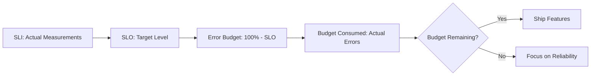

*[SLA]: Service Level Agreement
*[SLI]: Service Level Indicator
*[SLIs]: Service Level Indicators
*[SLO]: Service Level Objective
*[SLOs]: Service Level Objectives
*[SRE]: Site Reliability Engineering

Every deployment becomes a political negotiation. "Is this change safe enough?" gets answered by whoever argues loudest or has more organizational capital. Product wants to ship. Engineering wants to experiment. Operations—or SRE, as the discipline has evolved—wants stability. Without a shared framework, these conversations become battles of opinion where the most senior person in the room wins—not the most informed decision.

Error budgets change the game. Instead of "should we ship this risky change?" the question becomes "do we have budget to spend on this risk?" The answer is a number, not an opinion. And that number creates alignment where politics used to create friction.

<Callout type="info">
100% reliability is neither achievable nor desirable. Every additional nine costs exponentially more than the last, while providing diminishing returns to users. The question isn't "how do we prevent all failures?" but "how much unreliability can we tolerate?"
</Callout>

## From Targets to Budgets

The hierarchy works like this: SLIs measure what matters to users. SLOs set targets for those measurements. Error budgets convert the gap between 100% and your SLO into a spendable resource.

The math is straightforward. If your SLO is 99.9% availability over a 30-day window (using a simplified month for easy calculation):

- Error budget = 100% - 99.9% = 0.1%
- Minutes in month = 30 days × 24 hours × 60 minutes = 43,200
- Allowed downtime = 43,200 × 0.001 = 43.2 minutes

Those 43 minutes are yours to spend however you want. A 10-minute deployment that causes errors? That's 10 minutes of budget consumed. A 30-minute outage? You've used most of your month's budget in one incident.

The mental shift matters more than the math: you're not trying to prevent all failures. You're trying to fail less often than your budget allows. Reliability becomes a resource to manage, not an absolute to pursue.

Figure: Error budget decision flow—when budget is healthy, ship. When it's depleted, invest in reliability.

## Spending Budget Wisely

Not all budget consumption is equal. Some spending generates value; some is just waste.

Good investments include feature launches (up to 20% of monthly budget), infrastructure migrations (up to 30%, scheduled when budget is healthy), and dependency upgrades (up to 15%). These percentages roughly reflect what I've seen work at mid-sized SaaS companies, but they're starting points rather than rules. A pre-revenue startup might spend 50% on feature launches. A payment processor might cap any single change at 10%. Calibrate based on your risk tolerance and what you learn from actual deployments.

Poor investments include untested deployments (unpredictable budget impact), Friday deployments (limited recovery time if issues arise), and large batch deployments (high risk that should be split into smaller changes). The distinction: intentional spending that generates value versus uncontrolled consumption that just drains the budget.

## The Budget Conversation

This is where error budgets prove their worth. Product wants to launch a new payment flow next week. Engineering estimates the change is medium-risk—it touches the checkout path and historically similar changes cause 5-10 minutes of elevated errors during rollout. SRE checks the dashboard: 25 minutes of budget remaining this month.

| Without Error Budgets | With Error Budgets |
|-----------------------|-------------------|
| "Is this safe?" | "We have 25 minutes of budget remaining." |
| Opinion-based arguments about risk tolerance | "This change historically costs 5-10 minutes." |
| Whoever argues loudest wins | "If we hit the high end, we'll have 15 minutes left." |
| Lingering resentment from overruled parties | "Are we comfortable with that margin?" |

Table: How error budgets transform deployment conversations.

The answer might still be yes—but now it's an informed yes, with shared understanding of the tradeoff. Everyone sees the same number. Everyone understands what's being spent and what's left. The decision is collaborative rather than political.

## When Budget Gets Low

An error budget without a policy is just a dashboard. The policy defines what happens when budget gets low—and critically, it defines this _before_ you're in crisis mode making decisions under pressure.

| Budget Remaining | Status | What Changes |
|------------------|--------|--------------|
| > 50% | Green | Normal velocity. Feature work prioritized. Deploy at will. |
| 25% - 50% | Yellow | Increased scrutiny. Reliability work gets equal priority. |
| 10% - 25% | Orange | Feature freeze for high-risk changes. SRE approval required. |
| < 10% | Red | Complete feature freeze. Only reliability improvements deployed. |

Table: Error budget policy thresholds—define these before you need them.

The specific thresholds will vary by organization and service criticality. A payment system might trigger Orange at 30% remaining; an internal tool might not freeze features until budget is exhausted. The important thing is having agreed-upon rules before you need them.

One critical detail: automated enforcement must have escape hatches. Sometimes you need to deploy a critical security patch even with exhausted budget. Build in exception workflows with appropriate approvals and audit trails—but make exceptions visible and uncomfortable enough that they don't become the norm.

## Getting Started

Error budgets succeed when they create alignment, not compliance. The goal isn't to hit arbitrary targets—it's to have a shared language for reliability that lets engineering, product, and SRE make informed tradeoffs together.

Start simple: one service, two SLIs (availability and latency), one quarter of measurement. Pick a service that's broken enough to demonstrate value when improved but not so broken that fixing it seems impossible—you want a quick win, not a multi-quarter project. Set your initial SLO slightly below your current performance so you have a target you can hit from day one while leaving room for normal variation.

After a quarter, you'll know whether the SLO is too tight (constant breaches, alert fatigue), too loose (never breaches, no useful signal), or about right. Most teams need 2-3 iterations to find the right level. That's expected—the first SLO is never perfect, and it doesn't need to be.

The value is in the conversation it enables, not the number itself.

---

This article covers the core mechanics of error budgets. The complete guide goes deeper: choosing SLIs that actually reflect user experience (and the anti-patterns that don't), the four golden SLI categories with Prometheus query examples, burn rate monitoring with multi-window alerting, and bootstrapping observability when you're starting from scratch. Download the full guide for implementation details, code samples, and the complete policy framework.
