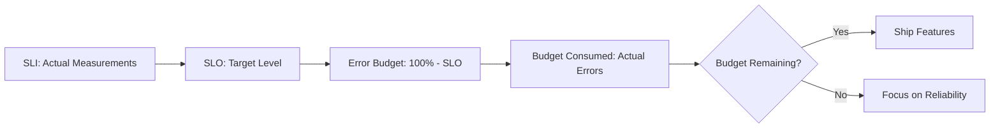

*[CUJ]: Critical User Journey
*[MTTR]: Mean Time To Recovery
*[P50]: 50th Percentile (Median)
*[P95]: 95th Percentile
*[P99]: 99th Percentile
*[SLA]: Service Level Agreement
*[SLI]: Service Level Indicator
*[SLIs]: Service Level Indicators
*[SLO]: Service Level Objective
*[SLOs]: Service Level Objectives
*[SRE]: Site Reliability Engineering

Engineering teams want to ship faster. Operations teams want stability. Without a shared framework, every deployment becomes a political negotiation: "Is this change safe enough?" gets answered by whoever argues loudest or has more organizational capital.

SLOs transform that question into math. Instead of "should we ship this risky change?" the question becomes "do we have budget to spend on this risk?" The answer is a number, not an opinion.

The hierarchy works like this: SLIs measure what matters to users. SLOs set targets for those measurements. Error budgets convert the gap between 100% and your SLO into a spendable resource. When you have budget, spend it on velocity. When it's depleted, invest in reliability. This article covers all three as an integrated practice.

<Callout type="info">
100% reliability is neither achievable nor desirable. Every additional nine costs exponentially more than the last, while providing diminishing returns to users. The question isn't "how do we prevent all failures?" but "how much unreliability can we tolerate, and how do we spend that allowance wisely?"
</Callout>

## Why Teams Resist SLOs (And How to Get Buy-In)

I've seen SLO initiatives fail more often from cultural resistance than technical challenges. Teams that skip the buy-in work end up with dashboards nobody looks at and policies nobody follows. Address the human problems first.

### The "It Works for Us" Problem

Internal services are the worst offenders. They operate without SLOs because their consumers have no leverage—no paying customers means no contractual SLAs, which means no forcing function for reliability investment. When the auth service is flaky, the teams that depend on it just add retry logic and move on. Nobody files a ticket because nothing will happen.

This creates a hidden tax on every team that depends on unreliable internal services. Each consumer builds defensive code, retry logic, and workarounds. Engineers learn which services to avoid calling synchronously. The total cost across all consumers often exceeds what reliability investment would have cost in the first place—but it's invisible because it's spread across dozens of teams' velocity.

### Common Objections

Every SLO conversation surfaces the same objections. Knowing what they really mean helps you respond effectively:

| Objection | What They Really Mean | How to Respond |
|-----------|----------------------|----------------|
| "We don't have time for this" | SLOs seem like extra work on top of everything else | SLOs reduce fire-fighting time; show them how much time they spend on incidents now |
| "Our service is simple" | Reliability engineering seems like overkill | Simple services still have consumers waiting when they fail |
| "Nobody has complained" | No complaints means no problem | Consumers have given up complaining; ask them directly |
| "We'd need to hire SREs" | SLOs require special skills we don't have | Basic SLOs need basic math, not specialists |
| "Management won't care" | No executive sponsorship visible | Frame as developer productivity, not reliability jargon |

Table: Common SLO objections and what they really mean.

### Reframing for Stakeholders

The trick is translating reliability into terms each stakeholder actually cares about. "99.9% availability" means nothing to a product manager, but "deployments fail unpredictably because internal services are unstable" gets attention.

- __Engineering managers__: "Engineers spend 8 hours per week debugging integration issues with flaky dependencies. Here's the Jira query."
- __Product managers__: "We can't give customers reliable ETAs on features because deployments fail unpredictably."
- __Finance__: "CI pipelines are slow because internal tools timeout randomly—here's the compute cost of those retries."

The data to support these claims usually exists already. Pull the incident reports, search Slack for complaints about the service, check CI pipeline failure rates. Concrete numbers beat abstract reliability arguments.

## Choosing SLIs That Reflect Reality

The difference between useful SLIs and vanity metrics is whether they correlate with user experience. A dashboard full of green SLIs means nothing if users are complaining.

### The User-Centric Test

An SLI should fail when users are unhappy and pass when users are satisfied—nothing more, nothing less. This sounds obvious, but most metrics fail this test.

The worst SLI is one that stays green while users complain. I've seen services with 100% "uptime" according to their dashboards while support tickets pile up about timeouts. The health check passed, but it only tested whether the process was running—not whether it could serve requests.

The second worst SLI is one that alerts constantly during normal operation. Alert fatigue sets in fast. Within a week, engineers start ignoring the alerts. Within a month, they're filtered to a channel nobody reads.

### SLI Selection Criteria

Before adopting any metric as an SLI, run it through these questions:

| Criterion | Question | Why It Matters |
|-----------|----------|----------------|
| User-facing | Does it measure what users actually experience? | Internal metrics often hide user pain |
| Measurable | Can we collect this data reliably at all times? | Can't set objectives without consistent data |
| Specific | Does it target a single failure mode? | Composite metrics hide root causes |
| Actionable | Can we improve it when it degrades? | Unactionable metrics cause learned helplessness |
| Understandable | Can non-engineers grasp what it means? | Stakeholder buy-in requires clarity |

Table: SLI evaluation criteria.

### Common SLI Anti-Patterns

These metrics look like SLIs but fail the user-centric test:

- __CPU utilization as availability proxy__: High CPU doesn't mean users are affected. A service can return errors at 20% CPU (bad config) or run fine at 95% CPU (efficient under load).
- __Internal health check success__: Health checks often test whether the process is running, not whether it can serve user requests. A service with a working health endpoint can still fail to connect to its database.
- __Average latency__: Averages hide tail latency. If 1% of users wait 10 seconds while 99% get responses in 100ms, the average is ~200ms. That 1% is invisible in the number but very visible in support tickets.
- __Uptime percentage without error rate__: The process running doesn't mean it's serving correctly. A service can be "up" while returning 500 errors to every request.

<Callout type="warning">
An average latency of 100ms with a P99 of 5000ms means 1% of your users wait 50x longer than the "average" suggests. Always use percentiles[^percentiles] for latency SLIs.
</Callout>

[^percentiles]: Percentiles show the value below which a given percentage of observations fall. P50 (median) means half of requests were faster. P95 means 95% were faster — only 5% were slower. P99 means 99% were faster — only 1% were slower. For latency, P99 tells you "the slowest 1% of users experience at least this much delay." This is far more useful than averages because it reveals the tail — the users having the worst experience.

## The Four Golden SLI Categories

Most services can be adequately covered by SLIs in four categories: availability, latency, quality, and freshness. Not every service needs all four—pick the ones that matter for your users.

### Availability: Are Requests Succeeding?

The most fundamental SLI: what proportion of requests complete successfully? This is the one SLI every service should have.

```promql
# Prometheus: Availability SLI excluding health checks
sum(rate(http_requests_total{status=~"2..|404", endpoint!="/health"}[5m]))
/
sum(rate(http_requests_total{endpoint!="/health"}[5m]))
```

Code: Prometheus query for availability SLI.

What counts as "successful" requires some thought. 2xx responses always count. 404 for GET requests typically counts too—resource not found is a valid response, not an error. Never count 5xx errors, 429 (rate limited), or timeouts as successful. And exclude health checks and metrics endpoints from the denominator entirely; they inflate your numbers without reflecting user experience.

### Latency: Are Requests Fast Enough?

How long users wait for responses. Always measure this as a percentile distribution, not an average.

```promql
# Prometheus: Proportion of requests completing under 200ms
sum(rate(http_request_duration_seconds_bucket{le="0.2"}[5m]))
/
sum(rate(http_request_duration_seconds_count[5m]))
```

Code: Prometheus query for latency SLI using histogram buckets.

Different operations warrant different thresholds. Interactive requests that users are waiting on need P99 under 200ms—anything longer feels sluggish. Background jobs and async processing can tolerate P99 under 5 seconds since users aren't staring at a spinner. Report generation and batch exports might allow P95 under 30 seconds.

The key insight: measure at the percentile that matters for your users. P99 catches the worst 1% of experiences. P95 is less sensitive but still catches outliers. P50 (median) tells you the typical experience but hides problems affecting minorities of users.

### Quality: Are Responses Correct?

Beyond success or failure: is the response actually what the user needed? A 200 OK with wrong data is worse than a 500 error, because the user might not notice until much later.

Quality SLIs are necessarily service-specific:

- __Search service__: Results returned within expected count range (not zero when matches exist)
- __Data API__: Response contains all requested fields with correct types
- __Payment processing__: Successful charges actually create orders in the order system
- __Recommendation engine__: Recommendations are personalized, not fallback defaults

Measuring quality requires instrumentation that understands your business logic:

```typescript
// Quality SLI: Search returns results when matches exist
function recordSearchQuality(query: string, results: SearchResult[], indexHasMatches: boolean) {
  const isQualityResponse = results.length > 0 || !indexHasMatches
  searchQualityTotal.inc({ quality: isQualityResponse ? 'good' : 'degraded' })
}
```

Code: Pseudocode for measuring search quality as an SLI.

Quality SLIs are harder to measure than availability or latency because they require understanding business logic. But they often catch problems that other SLIs miss—the service that's "up" and "fast" but returning stale cached data to everyone.

### Freshness: Is Data Current?

For services that serve data rather than compute it on demand: how stale is the information users receive?

- __Real-time__ (&lt; 1 second): Trading systems, chat, live dashboards
- __Near real-time__ (&lt; 1 minute): Activity feeds, notification counts, monitoring dashboards
- __Periodic__ (&lt; 1 hour): Reports, analytics, batch-processed aggregations

Freshness SLIs matter most when users make decisions based on your data. A stock price that's 30 seconds old might be acceptable for a portfolio overview but catastrophic for a trading decision. Define what "fresh enough" means for each use case.

## Setting Your First SLO

The most common mistake with SLOs is setting aspirational targets instead of achievable ones. An SLO you can't meet is worse than no SLO at all—it trains everyone to ignore the metrics.

### Start with Current Performance

Use the "current state minus headroom" approach: measure your actual performance over 2-4 weeks, then set the SLO slightly _below_ what you're already achieving. This gives you a target you can hit from day one while leaving room for normal variation.

The SLO should be a floor you rarely breach, not a ceiling you're always hitting. If you're currently at 99.85% availability, set the SLO at 99.8% or 99.5%—not 99.9%. For latency, if your P99 is currently 180ms, set the target at 200ms or 250ms.

```typescript
// Deriving initial SLO targets from actual measurements
const measurements = {
  availability: 0.9985,  // 99.85% over past 30 days
  latencyP99: 180,       // 180ms P99
}

const initialSLO = {
  availability: 0.998,   // 99.8% - below current, gives headroom
  latencyP99: 250,       // 250ms - above current P99, allows for spikes
  rationale: "Based on 30-day measurement, achievable with current architecture"
}
```

Code: Deriving initial SLO targets from current performance measurements.

<Callout type="info">
This snippet is a template for defining SLOs.[^slo-config] The pattern — benchmark current performance, then set a target with safety margin — is standard practice. The `rationale` field provides an audit trail explaining why these specific numbers were chosen, which matters for compliance reviews.
</Callout>

[^slo-config]: You'd typically see SLO definitions like this in infrastructure-as-code tools (Sloth, OpenSLO, or Terraform modules), observability platform configs (Datadog SLO definitions, New Relic service levels), or service catalogs (Backstage, internal wikis). TypeScript/JavaScript is common because modern observability tools use JSON-based APIs, and infrastructure tools like AWS CDK and Pulumi use TypeScript natively. The same structure works in YAML for tools like Sloth or in HCL for Terraform.

### Avoiding Analysis Paralysis

I've seen teams spend months debating whether their availability target should be 99.9% or 99.95%. This is backwards. The first SLO is never perfect, and it doesn't need to be. The goal is to start the feedback loop, not to achieve perfection on day one.

A better approach:

1. Measure current state for 2-4 weeks
2. Set initial SLO at or slightly below current performance
3. Run for one quarter
4. Adjust based on what you learn

After a quarter, you'll know whether the SLO is too tight (constant breaches, alert fatigue), too loose (never breaches, no useful signal), or about right. Adjust and repeat. Most teams need 2-3 iterations to find the right level.

One decision you'll need to make: rolling windows or calendar windows. A 30-day rolling window recalculates continuously—every moment, you're looking at the past 30 days. A calendar window resets on the first of each month. Rolling windows provide smoother signals and avoid the "budget reset" problem where teams burn budget recklessly at month end knowing it resets soon. Calendar windows are simpler to explain and align with business reporting cycles. Most teams start with 30-day rolling windows.

### The Goldilocks Candidate

When introducing SLOs to an organization, your choice of first service matters enormously. Pick wrong and the initiative dies. Pick right and success spreads.

Look for a service that's:

- __Broken enough__ to demonstrate value when fixed—if it's already reliable, there's no win to celebrate
- __Not so broken__ that fixing seems impossible—you need a quick win, not a multi-quarter project
- __Visible enough__ that success will influence other teams—an obscure internal tool won't generate momentum
- __Owned by a willing team__—hostile teams sabotage pilots, and even neutral teams won't champion the results

Avoid: legacy monoliths nobody wants to touch, services owned by teams who've already rejected the idea, services that are already perfectly reliable (no room to show improvement), and services dominated by external dependencies you can't control (your SLO will reflect someone else's reliability).

## From SLOs to Error Budgets

An SLO of 99.9% availability means you're allowed 0.1% unavailability. That 0.1% is your error budget — a finite resource you can spend on velocity, risk-taking, and planned maintenance. When budget is healthy, ship fast. When it's depleted, slow down and invest in reliability.

### The Math

The calculation is simple. If your SLO is 99.9% availability over a 30-day window:

- Error budget = 100% - 99.9% = 0.1%
- Minutes in month = 30 days × 24 hours × 60 minutes = 43,200
- Allowed downtime = 43,200 × 0.001 = 43.2 minutes

Those 43 minutes are yours to spend however you want. A 10-minute deployment that causes errors? That's 10 minutes of budget consumed. A 30-minute outage? You've used most of your month's budget in one incident. Every degradation, every error, every moment of unavailability draws from this pool.



Figure: From SLI measurement to error budget decision flow.

The power of this framing: reliability becomes a resource to manage, not an absolute to pursue. You're not trying to prevent all failures. You're trying to fail less often than your budget allows.

### Multi-Dimensional Budgets

Most services have multiple SLOs, which means multiple budgets to track. A service might have separate budgets for availability, latency, and error rate.

These budgets aren't independent. A single incident can consume from multiple budgets simultaneously. A database outage might consume availability budget (service returning errors), latency budget (slow queries during failover), and error rate budget (failed requests during recovery). One bad hour can blow multiple budgets at once.

| SLO Type | Target | Monthly Budget | What Consumes It |
|----------|--------|----------------|------------------|
| Availability | 99.9% | 43 minutes downtime | Outages, bad deployments, maintenance windows |
| Latency (P95) | < 200ms | 5% slow requests allowed | Traffic spikes, database issues, cold starts |
| Error Rate | < 0.1% | 1 in 1000 requests can fail | Bugs, dependency failures, malformed input |

Table: Common SLO types and their error budgets.

Track the tightest budget as your primary constraint. If your availability budget is healthy but your latency budget is nearly exhausted, you still need to slow down—users are suffering even if the service is technically "up."

## Burn Rate Monitoring

Knowing your remaining error budget tells you where you stand, but it doesn't tell you where you're headed. Burn rate fills that gap—it measures how fast you're consuming budget relative to plan.

### What Burn Rate Tells You

A burn rate of 1x means you're consuming budget at exactly the pace that would exhaust it at period end. If you have 30 days of budget and you're burning at 1x, you'll hit zero on day 30. A burn rate of 2x means you'll exhaust in half the time—15 days. A burn rate of 10x means you'll be out in 3 days.

The value of burn rate over raw budget remaining: it tells you how urgent the situation is. 50% budget remaining sounds healthy, but if your burn rate is 10x, you're in crisis. 10% budget remaining sounds critical, but if your burn rate is 0.5x, you'll actually finish the month with budget to spare.

### Multi-Window Alerting

Traditional threshold alerts ("error rate > 1%") catch acute incidents but miss slow degradation. Burn rate alerts solve this by looking at budget consumption over time windows.

You need two types of burn rate alerts:

__Fast burn alerts__ catch acute incidents—a deployment gone wrong, a dependency outage, a traffic spike that overwhelms capacity. These consume budget rapidly. A typical fast burn alert fires when you'd consume 2% of your monthly budget in 1 hour. The math: 2% of a 30-day budget is 0.6 days (14.4 hours), so consuming that in 1 hour means you're burning at 14.4x the sustainable rate.

__Slow burn alerts__ catch chronic degradation—a memory leak that causes occasional timeouts, a flaky dependency that fails 0.5% of requests, a queue that backs up during peak hours. These never trigger traditional alerts but steadily drain budget. A typical slow burn alert fires when you'd consume 5% of monthly budget in 6 hours.

```yaml
# prometheus-alerts.yaml
groups:
  - name: error-budget-alerts
    rules:
      # Fast burn: 2% of monthly budget in 1 hour (14.4x burn rate)
      - alert: ErrorBudgetFastBurn
        expr: |
          (1 - (sum(rate(http_requests_total{status=~"2.."}[1h]))
                / sum(rate(http_requests_total[1h])))) > (14.4 * 0.001)
        for: 2m
        labels:
          severity: critical
        annotations:
          summary: "Fast error budget burn detected"

      # Slow burn: 5% of monthly budget in 6 hours
      - alert: ErrorBudgetSlowBurn
        expr: |
          (1 - (sum(rate(http_requests_total{status=~"2.."}[6h]))
                / sum(rate(http_requests_total[6h])))) > (1 * 0.001)
        for: 30m
        labels:
          severity: warning
        annotations:
          summary: "Slow error budget burn detected"
```

Code: Prometheus alerting rules for multi-window burn rate monitoring.

The combination catches problems that either alert type would miss alone. Fast burn catches outages. Slow burn catches the death by a thousand cuts.

## Error Budget Policies

An error budget without a policy is just a dashboard. The policy defines what happens when budget gets low—and critically, it defines this _before_ you're in crisis mode making decisions under pressure.

### Threshold-Based Actions

Define clear thresholds and the actions that trigger at each level. Write these down, get stakeholder agreement, and publish them where everyone can see.

| Budget Remaining | Status | What Changes |
|------------------|--------|--------------|
| > 50% | Green | Normal velocity. Feature work prioritized. Deploy at will. |
| 25% - 50% | Yellow | Increased scrutiny. Reliability work gets equal priority. Review risky changes. |
| 10% - 25% | Orange | Feature freeze for high-risk changes. SRE approval required for deployments. |
| 0% - 10% | Red | Complete feature freeze. Only reliability improvements and critical fixes deployed. |
| Exhausted | Black | Emergency measures. VP approval required for any deployment. Incident review mandatory. |

Table: Error budget policy thresholds and corresponding actions.

The specific thresholds and actions will vary by organization and service criticality. A payment system might trigger Orange at 30% remaining; an internal tool might not freeze features until budget is exhausted. The important thing is having agreed-upon rules before you need them.

### Automated Enforcement

Manual enforcement requires someone to check the dashboard and make a judgment call. That works when budget is healthy, but breaks down in exactly the situations where you need it most—when things are going wrong and everyone's stressed.

Integrate budget checks into CI/CD pipelines. When budget is healthy, deployments proceed normally. When budget is critical, require additional approvals or block entirely.

```typescript
// CI/CD pipeline integration pseudocode
async function evaluateDeployment(service: string, risk: 'low' | 'medium' | 'high') {
  const budget = await getBudgetStatus(service)

  if (budget.remaining > 50) {
    return { allowed: true, approvals: [] }
  }

  if (budget.remaining > 25 && risk !== 'high') {
    return { allowed: true, approvals: ['tech-lead'] }
  }

  if (budget.remaining > 10 && risk === 'low') {
    return { allowed: true, approvals: ['sre-on-call'] }
  }

  return {
    allowed: false,
    reason: 'Budget critical - only reliability improvements allowed',
    exception: 'Requires VP approval'
  }
}
```

Code: Deployment gating logic based on error budget status.

<Callout type="warning">
Automated enforcement must have escape hatches. Sometimes you need to deploy a critical security patch even with exhausted budget. Build in exception workflows with appropriate approvals and audit trails—but make exceptions visible and uncomfortable enough that they don't become the norm.
</Callout>

## Negotiating Reliability vs Velocity

Policies define the rules, but someone still has to apply them. The real test of an SLO program isn't whether you have thresholds written down—it's whether teams actually change behavior when budget gets low. That requires ongoing negotiation between the people who want to ship and the people responsible for keeping things running.

### The Product/Engineering/SRE Triangle

Error budgets provide a shared language for the three parties who most often conflict over reliability:

- __Product__ wants features shipped fast
- __Engineering__ wants to try new things (which sometimes break)
- __SRE/Ops__ wants stability

Without error budgets, these conversations become political ("we need to slow down" vs "we need to ship"). With error budgets, they become mathematical.

Here's how that conversation actually plays out. Product wants to launch a new payment flow next week. Engineering estimates the change is medium-risk—it touches the checkout path and historically similar changes cause 5-10 minutes of elevated errors during rollout. SRE checks the dashboard: 25 minutes of budget remaining this month.

The old conversation: "Is this safe?" followed by opinion-based arguments. The new conversation: "We have 25 minutes of budget. This change historically costs 5-10 minutes. If we ship and hit the high end, we'll have 15 minutes left for the rest of the month. Are we comfortable with that margin?"

The answer might still be yes—but now it's an informed yes, with shared understanding of the tradeoff.

### Spending Budget Intentionally

Not all budget consumption is equal. Some spending generates value; some is just waste.

Good investments of error budget:

- __Feature launches__: Up to 20% of monthly budget. Features are why the product exists. Spending budget to ship value to users is the point.
- __Infrastructure migrations__: Up to 30%, scheduled when budget is healthy. Migrations reduce tech debt and often improve reliability long-term.
- __Dependency upgrades__: Up to 15%. Staying current prevents security vulnerabilities and keeps you off unsupported versions.

These percentages aren't universal rules—they're starting points. A pre-revenue startup might spend 50% on feature launches. A payment processor might cap any single change at 10%. Calibrate based on your risk tolerance and what you learn from actual deployments.

Poor investments:

- __Untested deployments__: Unpredictable budget impact
- __Friday deployments__: Limited recovery time if issues arise
- __Large batch deployments__: High risk, split into smaller changes

### Stakeholder Communication

The worst time to explain error budgets is during an incident. Build shared understanding when things are calm so that budget-based decisions make sense when they matter.

Weekly budget status updates accomplish two things: they keep everyone informed about where you stand, and they normalize the conversation about reliability as a resource. When stakeholders see budget updates every week, "we need to slow down because budget is low" becomes a routine operational decision rather than engineering crying wolf.

A good status update covers three things: current state, planned risk, and projected outcome. Here's what the current state portion looks like for a payment API with two SLOs:

| Metric | Target | Current | Budget Used | Status |
|--------|--------|---------|-------------|--------|
| Availability | 99.9% | 99.95% | 15% | Healthy |
| Latency P99 | 200ms | 180ms | 10% | Healthy |

Table: Weekly error budget status for payment-api (30-day rolling window).

Below that, list planned budget consumption for the coming week: a database migration on Tuesday (~10% estimated), a feature flag rollout on Thursday (~5% estimated). With the current 15% used (taking the higher of the two SLO budgets as the constraint), you have 85% remaining. After 15% planned consumption, you'll end the week around 70%.

This "planned consumption" section is particularly valuable. It forces teams to estimate the reliability cost of their work _before_ doing it, and it gives stakeholders visibility into upcoming risk. When that database migration consumes 25% instead of the estimated 10%, the next planning conversation includes that data point.

Send these updates to a consistent audience: engineering leadership, product managers for affected services, and the on-call rotation. Keep them short—the goal is a glanceable status, not a detailed report. Save the details for when someone asks.

## Bootstrapping Observability

"We can't set SLOs because we don't have observability" is usually backwards. You don't need comprehensive observability to start with SLOs—you need _enough_ data to measure one or two SLIs for one service. Start there, demonstrate value, then use that success to justify observability investment.

### Start with What Exists

Teams without observability often have more data than they realize. Before adding any new instrumentation, inventory what you already collect.

| Source | What It Provides | SLIs Possible |
|--------|------------------|---------------|
| Access logs (nginx, ALB) | Request count by status, response time | Availability, Latency |
| Application logs | Error messages, business logic failures | Error rate, Quality |
| Cloud provider metrics | Request counts, latency percentiles | Availability, Latency |
| Database slow query log | Queries exceeding threshold | Latency contribution |
| CDN logs (CloudFront, Fastly) | Edge response times, cache hit rates | End-user latency |
| APM tools (if present) | Transaction traces, error rates | All categories |

Table: Common existing data sources and the SLIs they enable.

Nginx access logs alone can power availability and latency SLIs. Parse them to count requests by status code (availability) and extract response times (latency). It's not as elegant as Prometheus metrics, but it's data you already have.

Cloud provider metrics are often overlooked. AWS ALB, Google Cloud Load Balancer, and Azure Application Gateway all provide request counts and latency percentiles out of the box. CloudWatch, Cloud Monitoring, or Azure Monitor can alert on these without any application changes.

### Minimal Instrumentation

When existing data isn't enough, add instrumentation—but resist the urge to measure everything. Two metrics cover most SLO needs: request count by status (for availability) and request duration distribution (for latency).

```typescript
// Express middleware for minimal SLI instrumentation
import { Counter, Histogram, register } from 'prom-client'

const requestsTotal = new Counter({
  name: 'http_requests_total',
  help: 'Total HTTP requests',
  labelNames: ['method', 'path', 'status']
})

const requestDuration = new Histogram({
  name: 'http_request_duration_seconds',
  help: 'HTTP request duration',
  labelNames: ['method', 'path'],
  buckets: [0.01, 0.05, 0.1, 0.25, 0.5, 1, 2.5, 5, 10]
})

function sliMiddleware(req, res, next) {
  const start = process.hrtime.bigint()

  res.on('finish', () => {
    const duration = Number(process.hrtime.bigint() - start) / 1e9
    const path = normalizePath(req.path)  // Avoid cardinality explosion

    requestsTotal.inc({ method: req.method, path, status: res.statusCode })
    requestDuration.observe({ method: req.method, path }, duration)
  })

  next()
}
```

Code: Minimal Prometheus instrumentation for Node.js services.

The `normalizePath` function matters more than it looks. Without it, paths like `/users/123` and `/users/456` become separate time series, and your metrics cardinality explodes. Normalize to `/users/:id` or similar patterns.

The histogram buckets define your latency resolution. The example covers 10ms to 10 seconds with reasonable granularity. Adjust based on your service's expected latency profile—a real-time API might need finer buckets below 100ms; a batch processor might need coarser buckets extending to minutes.

<Callout type="info">
This pattern works across languages and frameworks. Python has `prometheus_client`, Go has `prometheus/client_golang`, Java has `micrometer`. The concepts are identical: count requests by status, histogram request duration, normalize high-cardinality labels.
</Callout>

Once you have these two metrics, you can answer the fundamental SLO questions: "What percentage of requests succeeded?" and "What percentage of requests completed within our latency target?" Everything else—quality SLIs, freshness SLIs, detailed error breakdowns—can wait until you've proven the value of the basic framework.

## Conclusion

SLOs work when they create alignment, not compliance. The goal isn't to hit arbitrary targets—it's to have a shared language for reliability that lets engineering, product, and operations make informed tradeoffs together.

Start simple: one service, two SLIs (availability and latency), one quarter of measurement. Adjust based on what you learn. The first SLO is never perfect, and that's fine. The value is in the conversation it enables, not the number itself.

After your first quarter, watch for these signals. If you're constantly breaching, your SLO is too tight—loosen it or invest in reliability. If you never breach, your SLO might be too loose, or your service might actually be reliable enough that you can afford to take more risk. If budget conversations happen but nothing changes, you have a policy problem, not a measurement problem. And if nobody looks at the dashboard, you haven't connected SLOs to decisions that matter—find a stakeholder who cares and start there.

_Key principles:_

- SLIs must reflect user experience, not internal metrics
- SLOs should be achievable with current architecture (start with reality, improve over time)
- Error budgets convert reliability into a spendable resource
- Budget policies remove politics from reliability decisions
- When budget is healthy, spend it on velocity; when depleted, invest in reliability
