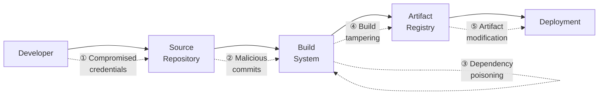
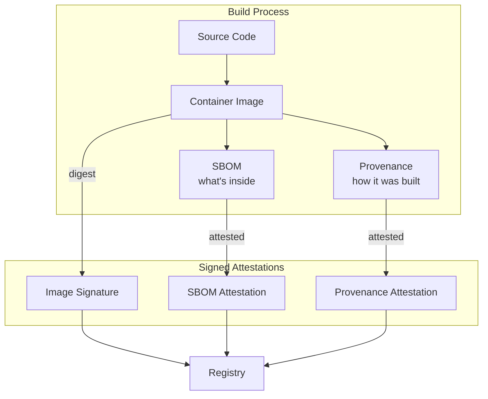

*[CA]: Certificate Authority
*[CVE]: Common Vulnerabilities and Exposures
*[DSSE]: Dead Simple Signing Envelope
*[ECDSA]: Elliptic Curve Digital Signature Algorithm
*[GPG]: GNU Privacy Guard
*[HSM]: Hardware Security Module
*[KMS]: Key Management Service
*[OCI]: Open Container Initiative
*[OIDC]: OpenID Connect
*[PGP]: Pretty Good Privacy
*[SBOM]: Software Bill of Materials
*[SHA]: Secure Hash Algorithm
*[SLSA]: Supply-chain Levels for Software Artifacts
*[TOFU]: Trust On First Use
*[VCS]: Version Control System

Every software supply chain has weak points. The question isn't whether attackers will try to exploit them—they already are—but whether you've done enough to make your pipeline harder to compromise than the next target.

Perfect supply chain security is impossible. But a practical baseline? That's achievable without a dedicated security team or enterprise tooling budgets.

<Callout type="info">
This article is for DevOps engineers and platform teams who want to implement supply chain security without enterprise tooling budgets. You'll learn to generate SLSA provenance, sign artifacts with Cosign, and enforce verification at deployment time—all using free, open-source tools.
</Callout>

## The Supply Chain Attack Surface

Before investing in countermeasures, you need to understand what you're defending against. Supply chain attacks exploit a fundamental assumption: that code, builds, and artifacts are what they claim to be. When that assumption breaks down, the consequences can be severe.

### Attack Vectors and Real-World Examples

The past few years have given us a painful education in supply chain attacks. Each major incident revealed a different weak point in the pipeline from source code to production deployment.

__Source code compromise__ is the most direct attack vector. In the SolarWinds incident (2020), attackers gained access to the build process and inserted malicious code that shipped to over 18,000 customers, including multiple US government agencies. The code looked legitimate because it came through legitimate channels.

__Build system compromise__ targets the CI/CD pipeline itself. Codecov's bash uploader script was modified in 2021, causing every CI job that used it to exfiltrate credentials to attacker-controlled servers. Thousands of organizations were affected because they trusted a third-party tool in their build process.

__Dependency confusion__ exploits how package managers resolve names. Alex Birsan's 2021 research demonstrated this by publishing packages to public registries that matched internal package names at Apple, Microsoft, and PayPal. When build systems checked public registries first, they pulled the malicious versions and executed arbitrary code inside corporate networks.

__Typosquatting__ relies on human error. Packages like `crossenv` (malicious) sit next to `cross-env` (legitimate) hoping developers will mistype. These attacks are low-effort but surprisingly effective, resulting in credential theft, cryptomining, and backdoors.

__Compromised maintainers__ introduce risk through the humans in the chain. The event-stream incident (2018) showed how a new maintainer—who had earned trust through legitimate contributions—eventually added code to steal Bitcoin from a specific cryptocurrency wallet. The attack targeted one application but affected millions of downstream users.

__Artifact tampering__ happens after the build but before deployment. CCleaner (2017) shipped a backdoored executable to 2.3 million users because attackers modified the signed artifact after it was built but before it was distributed. The signature was valid for the tampered file.


_Figure: Attack points in a typical software supply chain. Each arrow represents a transition where trust can be violated._

Each stage in the pipeline requires different defenses. SLSA focuses on the middle of this chain—from source through build to artifact—but it doesn't cover everything.

### What SLSA Actually Protects Against

SLSA (Supply-chain Levels for Software Artifacts) addresses specific threats, not all threats. Understanding this boundary prevents both under-investment and false confidence.

| SLSA Addresses | SLSA Does NOT Address |
|----------------|----------------------|
| Unauthorized source changes | Bugs in legitimate code |
| Build tampering | Vulnerabilities in dependencies |
| Missing provenance | Social engineering |
| Non-reproducible builds | Compromised developer machines |
| Unsigned artifacts | Insider threats with legitimate access |

_Table: SLSA's protection scope. The framework proves provenance and build integrity, not code quality or dependency safety._

When someone modifies source after review, SLSA's provenance links the artifact to a specific commit—you can verify the artifact came from the code you reviewed. When a build system tries to add malicious code, hermetic builds with a verified builder make that tampering detectable. When someone replaces an artifact in a registry, cryptographic signatures and attestations reveal the substitution.

But SLSA doesn't evaluate whether the code itself is any good. A developer can commit vulnerable code, and SLSA will faithfully prove that vulnerability came from exactly where it says it did. A team can intentionally merge a malicious dependency, and SLSA will attest to that decision. The source is assumed to be intentional—SLSA only guarantees the artifact matches that intention.

<Callout type="warning">
SLSA proves that an artifact came from a specific source through a specific build process. It doesn't prove the source or build process are free of vulnerabilities. You still need code review, dependency scanning, and vulnerability management.
</Callout>

## SLSA Levels Explained

[SLSA](https://slsa.dev) defines four levels of increasing rigor. Each level adds requirements that provide incremental security improvements, but also incremental cost. The goal isn't to reach Level 4—it's to reach the level that matches your threat model without over-engineering.

### Level Requirements Overview

__Level 1__ is essentially "write it down." Your source code must be version controlled, your builds must be scripted (not manual), and provenance must exist even if it's unsigned. Most teams already meet Level 1 without trying. The protection here is minimal—it catches accidental errors in manual builds but doesn't stop intentional attacks.

__Level 2__ adds authentication. Your builds must run on a hosted build service (GitHub Actions, GitLab CI, etc.), and that service must sign the provenance. This is where you start getting real security value: an attacker who compromises your source repository can't forge provenance claiming the artifact came from a different commit. The effort is mostly configuration—days, not weeks.

__Level 3__ introduces hardening. You need two-person review for changes, retained history that can't be deleted, and a hardened, isolated build environment that generates non-falsifiable provenance. This level protects against insider threats at the build level. The effort is significant because it requires process changes, not just tooling.

__Level 4__ demands hermetic, reproducible builds where all dependencies also have provenance. This is the "nation-state adversary" level. Few organizations need it, and achieving it requires months of engineering investment plus ongoing maintenance.

| Level | Source Requirements | Build Requirements | Provenance | Effort | Protects Against |
|-------|--------------------|--------------------|------------|--------|------------------|
| 1 | Version controlled | Scripted build | Exists (unsigned OK) | Hours | Manual build errors |
| 2 | Version controlled with history | Hosted build service | Authenticated by builder | Days | External attackers |
| 3 | Two-person review, retained history | Hardened, isolated environment | Non-falsifiable | Weeks | Insider threats |
| 4 | Two-person review, verified history | Hermetic, reproducible | Dependencies have provenance | Months | Sophisticated attacks |

_Table: SLSA level requirements and their tradeoffs. Higher levels provide more protection but require more investment._

### Practical Level Targets

Not every artifact needs the same protection. Choose your target level based on what you're building and who might want to compromise it.

__Internal tools with low security requirements__ can stay at Level 1. Provenance is still valuable for debugging ("which commit produced this artifact?"), but the threat model doesn't justify more investment. The exception: if those internal tools access production data, bump to Level 2.

__Most production services__ should target Level 2. Authenticated provenance blocks most external attackers while keeping developer velocity high. The configuration overhead is minimal, and you get meaningful protection without changing how developers work.

__Security-critical infrastructure__ — authentication systems, secrets management, network edge services—should target Level 3. Hardened builds protect against more sophisticated attackers, and the process requirements (two-person review) are often already in place for these systems anyway.

__Open source packages consumed by others__ present a special case. Your security posture affects everyone who depends on you. Level 3 is the responsible target; critical infrastructure packages like container runtimes or cryptographic libraries should aim for Level 4.

<Callout type="info">
Level 2 provides authenticated provenance with minimal process overhead. It blocks external attackers while keeping developer velocity high. Start here and increase only if your threat model demands it.
</Callout>

## Implementing Build Provenance

Provenance is the core artifact that makes SLSA useful. It's a signed document that answers two questions: what was built (the artifact hash) and how was it built (the source, build system, and configuration). Without provenance, you're trusting that artifacts are what they claim to be. With provenance, you can verify.

### Provenance Attestation Structure

A SLSA provenance attestation follows the in-toto attestation format. The structure has three main parts: the _subject_ (what was built), the _predicate type_ (what kind of statement this is), and the _predicate_ (the actual provenance data).

The subject identifies the artifact by name and cryptographic digest. This is what you verify against—if someone swaps in a different artifact, the digest won't match.

The predicate contains the build definition (source repository, commit, build type, resolved dependencies) and run details (which builder ran, when it started and finished, a unique invocation ID). Together, these let you trace any artifact back to exactly the code and process that produced it.

```json
{
  "_type": "https://slsa.dev/provenance/v1",
  "subject": [{
    "name": "ghcr.io/myorg/myapp",
    "digest": { "sha256": "abc123def456..." }
  }],
  "predicateType": "https://slsa.dev/provenance/v1",
  "predicate": {
    "buildDefinition": {
      "buildType": "https://github.com/slsa-framework/slsa-github-generator/container@v1",
      "externalParameters": {
        "repository": "https://github.com/myorg/myapp",
        "ref": "refs/tags/v1.0.0",
        "commit": "a1b2c3d4e5f6..."
      },
      "resolvedDependencies": [{
        "uri": "git+https://github.com/myorg/myapp@refs/tags/v1.0.0",
        "digest": { "sha256": "a1b2c3d4e5f6..." }
      }]
    },
    "runDetails": {
      "builder": {
        "id": "https://github.com/slsa-framework/slsa-github-generator/.github/workflows/generator_container_slsa3.yml@refs/tags/v1.9.0"
      },
      "metadata": {
        "invocationId": "https://github.com/myorg/myapp/actions/runs/123456789",
        "startedOn": "2024-01-15T10:30:00Z",
        "finishedOn": "2024-01-15T10:35:00Z"
      }
    }
  }
}
```
_Figure: Simplified SLSA v1.0 provenance attestation for a container image. The builder ID identifies exactly which workflow version generated this provenance._

### GitHub Actions SLSA Generator

The SLSA framework provides official generators that produce Level 3 provenance on GitHub Actions. These generators run in isolated workflows that can't be modified by the calling repository, which is what makes the provenance non-falsifiable.

For container images, you'll use `generator_container_slsa3.yml`. The workflow structure requires two jobs: one that builds and pushes your image, and a second that calls the SLSA generator with the image digest.

```yaml
# .github/workflows/release.yml - Container image with SLSA Level 3 provenance
name: Release with SLSA Provenance

on:
  push:
    tags: ['v*']

permissions:
  contents: write
  id-token: write      # Required for keyless signing
  packages: write
  attestations: write

jobs:
  build:
    runs-on: ubuntu-latest
    outputs:
      digest: ${{ steps.build.outputs.digest }}
      image: ${{ steps.build.outputs.image }}

    steps:
      - uses: actions/checkout@v4

      - name: Set up Docker Buildx
        uses: docker/setup-buildx-action@v3

      - name: Login to GitHub Container Registry
        uses: docker/login-action@v3
        with:
          registry: ghcr.io
          username: ${{ github.actor }}
          password: ${{ secrets.GITHUB_TOKEN }}

      - name: Build and push
        id: build
        uses: docker/build-push-action@v5
        with:
          context: .
          push: true
          tags: ghcr.io/${{ github.repository }}:${{ github.ref_name }}

      - name: Output image digest
        run: |
          echo "digest=${{ steps.build.outputs.digest }}" >> $GITHUB_OUTPUT
          echo "image=ghcr.io/${{ github.repository }}" >> $GITHUB_OUTPUT

  provenance:
    needs: build
    permissions:
      actions: read
      id-token: write
      packages: write
    uses: slsa-framework/slsa-github-generator/.github/workflows/generator_container_slsa3.yml@v1.9.0
    with:
      image: ${{ needs.build.outputs.image }}
      digest: ${{ needs.build.outputs.digest }}
      registry-username: ${{ github.actor }}
    secrets:
      registry-password: ${{ secrets.GITHUB_TOKEN }}
```

The critical detail is the `@v1.9.0` pinning on the generator workflow. This ensures you're using a known, audited version of the generator. Never use `@main` or floating tags—that would defeat the security model.

To verify the provenance, use `slsa-verifier`. It checks that the attestation was signed by the expected builder and that the source matches your expectations:

```bash
# Verify a container image's SLSA provenance
slsa-verifier verify-image ghcr.io/myorg/myapp:v1.0.0 \
  --source-uri github.com/myorg/myapp \
  --source-tag v1.0.0
```

### Provenance for Non-Container Artifacts

Not everything is a container. For binaries, archives, or any other file type, use `generator_generic_slsa3.yml`. The pattern is similar: build your artifacts, compute their SHA256 hashes, and pass those hashes to the generator.

```yaml
# .github/workflows/release-binary.yml - Go binary with SLSA provenance
name: Release Go Binary with Provenance

on:
  push:
    tags: ['v*']

permissions:
  contents: write
  id-token: write

jobs:
  build:
    runs-on: ubuntu-latest
    outputs:
      hashes: ${{ steps.hash.outputs.hashes }}

    steps:
      - uses: actions/checkout@v4

      - name: Set up Go
        uses: actions/setup-go@v5
        with:
          go-version: '1.21'

      - name: Build binaries
        run: |
          GOOS=linux GOARCH=amd64 go build -o myapp-linux-amd64 .
          GOOS=darwin GOARCH=amd64 go build -o myapp-darwin-amd64 .
          GOOS=windows GOARCH=amd64 go build -o myapp-windows-amd64.exe .

      - name: Generate hashes
        id: hash
        run: |
          echo "hashes=$(sha256sum myapp-* | base64 -w0)" >> $GITHUB_OUTPUT

      - name: Upload artifacts
        uses: actions/upload-artifact@v4
        with:
          name: binaries
          path: myapp-*

  provenance:
    needs: build
    permissions:
      actions: read
      id-token: write
      contents: write
    uses: slsa-framework/slsa-github-generator/.github/workflows/generator_generic_slsa3.yml@v1.9.0
    with:
      base64-subjects: ${{ needs.build.outputs.hashes }}
      upload-assets: true

  release:
    needs: [build, provenance]
    runs-on: ubuntu-latest
    permissions:
      contents: write

    steps:
      - name: Download artifacts
        uses: actions/download-artifact@v4
        with:
          name: binaries

      - name: Create release
        uses: softprops/action-gh-release@v1
        with:
          files: myapp-*
```

The hash computation step is important. The generator doesn't have access to your build artifacts directly—it only sees the hashes you provide. Those hashes become the subject of the provenance attestation. Anyone verifying later computes the hash of the artifact they downloaded and compares it to what's in the provenance.

## Artifact Signing Strategies

Provenance tells you where an artifact came from. Signing proves that provenance hasn't been tampered with. You need both—but the signing approach you choose depends on your operational constraints and threat model.

### Signing Methods Comparison

Three approaches dominate the current landscape, each with distinct tradeoffs.

__Long-lived keys (GPG/PGP)__ are the traditional approach. You generate a keypair, guard the private key carefully, and distribute the public key for verification. The tooling is mature and works offline, but the operational burden is significant. Key rotation is painful, key compromise is catastrophic (affecting all past signatures), and the Trust On First Use (TOFU) problem means first-time verifiers have no good way to know if they have the right public key. This approach still makes sense for small teams or air-gapped environments where internet connectivity isn't available during signing.

__Keyless signing (Sigstore/Cosign)__ flips the model. Instead of managing keys, you prove your identity through OIDC (the same system that lets you "Sign in with GitHub"). Sigstore issues a short-lived certificate tied to that identity, you sign with it, and the signature is recorded in a public transparency log (Rekor). Verification checks the log rather than a distributed public key. The result: no keys to manage, no rotation headaches, and signatures that are tied to specific identities at specific times. The tradeoff is a dependency on Sigstore infrastructure and internet connectivity.

__KMS-backed signing__ puts your keys in a cloud provider's hardware security module. You never see the private key—it lives in tamper-resistant hardware, and signing operations happen inside the HSM. AWS KMS, Google Cloud KMS, and Azure Key Vault all support this. The keys are protected by hardware, audit logging is automatic, and IAM controls who can sign. The tradeoff is vendor lock-in, per-operation costs at high volume, and cloud connectivity requirements.

| Method | Key Management | Verification | CI/CD Fit | Compliance |
|--------|---------------|--------------|-----------|------------|
| GPG/PGP | High (manual rotation, distribution) | Medium (keyservers, TOFU) | Poor | Medium |
| Sigstore/Cosign | None (identity-based) | Low (transparency log) | Excellent | Good |
| KMS-backed | Low (provider-managed) | Low (exported public key) | Good | Excellent |

_Table: Signing method tradeoffs. For most CI/CD pipelines, keyless signing offers the best balance of security and operational simplicity._

### Keyless Signing with Cosign

For CI/CD pipelines—especially GitHub Actions—keyless signing with Cosign[^cosign] is the path of least resistance. The `id-token: write` permission lets your workflow request an OIDC token, which Cosign exchanges for a short-lived signing certificate. No secrets to manage, no keys to rotate.

[^cosign]: Sigstore (which provides Cosign, Fulcio, and Rekor) is a free, open-source, public-good service operated by the Open Source Security Foundation (OpenSSF). There's no vendor lock-in or subscription cost—it exists specifically to make software supply chain security accessible to everyone.

```yaml
# .github/workflows/sign-container.yml - Keyless signing with Cosign
name: Build, Sign, and Attest Container

on:
  push:
    branches: [main]
    tags: ['v*']

permissions:
  contents: read
  packages: write
  id-token: write  # Required for OIDC token

jobs:
  build-sign:
    runs-on: ubuntu-latest

    steps:
      - uses: actions/checkout@v4

      - name: Install Cosign
        uses: sigstore/cosign-installer@v3

      - name: Set up Docker Buildx
        uses: docker/setup-buildx-action@v3

      - name: Login to GHCR
        uses: docker/login-action@v3
        with:
          registry: ghcr.io
          username: ${{ github.actor }}
          password: ${{ secrets.GITHUB_TOKEN }}

      - name: Build and push
        id: build
        uses: docker/build-push-action@v5
        with:
          context: .
          push: true
          tags: ghcr.io/${{ github.repository }}:${{ github.sha }}

      - name: Sign container image
        env:
          DIGEST: ${{ steps.build.outputs.digest }}
        run: |
          cosign sign --yes ghcr.io/${{ github.repository }}@${DIGEST}

      - name: Generate and attest SBOM
        uses: anchore/sbom-action@v0
        with:
          image: ghcr.io/${{ github.repository }}@${{ steps.build.outputs.digest }}
          output-file: sbom.spdx.json
          format: spdx-json

      - name: Attest SBOM
        run: |
          cosign attest --yes \
            --predicate sbom.spdx.json \
            --type spdxjson \
            ghcr.io/${{ github.repository }}@${{ steps.build.outputs.digest }}
```

The `--yes` flag confirms you want keyless signing (it's interactive by default). The signature includes the workflow identity—anyone verifying can see exactly which GitHub Actions workflow signed the image.

Verification requires specifying the expected identity and OIDC issuer:

```bash
# Verify by exact workflow identity
cosign verify ghcr.io/myorg/myapp:v1.0.0 \
  --certificate-identity "https://github.com/myorg/myapp/.github/workflows/release.yml@refs/tags/v1.0.0" \
  --certificate-oidc-issuer "https://token.actions.githubusercontent.com"

# Verify with regex pattern (for any tag)
cosign verify ghcr.io/myorg/myapp:v1.0.0 \
  --certificate-identity-regexp "https://github.com/myorg/myapp/.github/workflows/release.yml@refs/tags/v.*" \
  --certificate-oidc-issuer "https://token.actions.githubusercontent.com"
```

### KMS-Backed Signing

When compliance requires hardware-protected keys or audit trails that keyless signing doesn't provide, KMS-backed signing is the answer. The keys never leave the HSM, every signing operation is logged, and IAM policies control who can sign.

Setting up AWS KMS for container signing involves creating an asymmetric key and an alias:

```bash
# Create an ECDSA signing key in AWS KMS
aws kms create-key \
  --key-usage SIGN_VERIFY \
  --key-spec ECC_NIST_P256 \
  --description "Container image signing key"

# Create an alias for easier reference
aws kms create-alias \
  --alias-name alias/container-signing \
  --target-key-id <key-id-from-previous-command>
```

Cosign can sign directly with KMS keys. You'll need to export the public key for consumers who need to verify offline:

```bash
# Sign with KMS key
cosign sign --key awskms:///alias/container-signing \
  ghcr.io/myorg/myapp@sha256:abc123...

# Export public key for verification
cosign public-key --key awskms:///alias/container-signing > cosign.pub
```

In GitHub Actions, use OIDC federation to assume an IAM role with KMS signing permissions. This workflow builds on the keyless signing example from earlier—the main differences are the AWS credential configuration and the `--key` argument pointing to your KMS key:

```yaml
# .github/workflows/sign-with-kms.yml - AWS KMS signing
name: Sign with AWS KMS

on:
  push:
    tags: ['v*']

permissions:
  id-token: write  # For AWS OIDC federation
  packages: write

jobs:
  sign:
    runs-on: ubuntu-latest

    steps:
      - name: Configure AWS credentials
        uses: aws-actions/configure-aws-credentials@v4
        with:
          role-to-assume: arn:aws:iam::123456789012:role/github-signing-role
          aws-region: us-east-1

      - name: Install Cosign
        uses: sigstore/cosign-installer@v3

      - name: Sign image with KMS
        run: |
          cosign sign --key awskms:///alias/container-signing \
            ghcr.io/${{ github.repository }}@${{ env.DIGEST }}
```

<Callout type="info">
Use keyless signing for most open source and internal projects—it's simpler and doesn't require key management. Use KMS-backed signing when compliance requires hardware key protection, audit trails, or you need to sign in air-gapped environments where Sigstore infrastructure isn't accessible.
</Callout>

## Verification at Deployment Time

Signing and provenance are only useful if you actually check them. The goal is to make verification automatic and mandatory — human-dependent security controls eventually fail. The best place to enforce verification is at deployment time, where you can block unsigned or tampered artifacts before they reach production.

### Kubernetes Admission Control

Kubernetes admission controllers intercept API requests before they're persisted. The Sigstore Policy Controller uses this hook to verify container signatures before pods can be created. If an image doesn't meet your policy requirements, the pod never starts.

Install the policy controller via Helm:

```bash
helm repo add sigstore https://sigstore.github.io/helm-charts
helm install policy-controller sigstore/policy-controller -n sigstore-system --create-namespace
```

Then define a `ClusterImagePolicy` that specifies which images require signatures and what identities are allowed to sign them:

```yaml
# cluster-image-policy.yaml - Require signed images from your org
apiVersion: policy.sigstore.dev/v1beta1
kind: ClusterImagePolicy
metadata:
  name: require-signed-images
spec:
  images:
    - glob: "ghcr.io/myorg/**"

  authorities:
    - keyless:
        url: https://fulcio.sigstore.dev
        identities:
          - issuer: https://token.actions.githubusercontent.com
            subjectRegExp: https://github.com/myorg/.*/.*/.github/workflows/.*@refs/tags/v.*
      ctlog:
        url: https://rekor.sigstore.dev
```

The `subjectRegExp` is the critical field—it controls which workflow identities are trusted. The pattern above allows any workflow in your organization that runs on a version tag. You can tighten this to specific repositories or workflow files.

To enable enforcement on a namespace, add the inclusion label:

```yaml
# production-namespace.yaml - Enable policy enforcement
apiVersion: v1
kind: Namespace
metadata:
  name: production
  labels:
    policy.sigstore.dev/include: "true"
```

When verification fails, the pod creation is rejected with a clear error message. An unsigned image returns "no matching signatures found." A signature from the wrong identity returns "signature identity does not match policy." Both tell you exactly what went wrong and where to look.

### CI/CD Pipeline Verification Gates

For deployments that don't go through Kubernetes admission control—or as a defense-in-depth measure—add verification gates to your deployment pipeline. This catches problems before they reach the cluster.

```yaml
# .github/workflows/deploy.yml - Verification gate before production deployment
name: Deploy to Production

on:
  workflow_dispatch:
    inputs:
      image_tag:
        description: 'Image tag to deploy'
        required: true

jobs:
  verify:
    runs-on: ubuntu-latest
    outputs:
      verified: ${{ steps.verify.outputs.verified }}

    steps:
      - name: Install verification tools
        run: |
          # Install Cosign
          curl -sSfL https://github.com/sigstore/cosign/releases/latest/download/cosign-linux-amd64 -o /usr/local/bin/cosign
          chmod +x /usr/local/bin/cosign
          # Install SLSA verifier
          curl -sSfL https://github.com/slsa-framework/slsa-verifier/releases/latest/download/slsa-verifier-linux-amd64 -o /usr/local/bin/slsa-verifier
          chmod +x /usr/local/bin/slsa-verifier

      - name: Verify image signature
        id: verify
        run: |
          IMAGE="ghcr.io/${{ github.repository }}:${{ inputs.image_tag }}"

          cosign verify \
            --certificate-identity-regexp "https://github.com/${{ github.repository }}/.github/workflows/release.yml@refs/tags/.*" \
            --certificate-oidc-issuer "https://token.actions.githubusercontent.com" \
            "${IMAGE}"

          echo "verified=true" >> $GITHUB_OUTPUT

      - name: Verify SLSA provenance
        run: |
          slsa-verifier verify-image "ghcr.io/${{ github.repository }}:${{ inputs.image_tag }}" \
            --source-uri "github.com/${{ github.repository }}" \
            --source-tag "${{ inputs.image_tag }}"

  deploy:
    needs: verify
    runs-on: ubuntu-latest
    environment: production

    steps:
      - name: Deploy to Kubernetes
        run: |
          kubectl set image deployment/myapp \
            myapp=ghcr.io/${{ github.repository }}:${{ inputs.image_tag }}
```

The workflow verifies both the Cosign signature (proving who signed it) and the SLSA provenance (proving how it was built). If either check fails, the deployment stops.

### Terraform Verification

For infrastructure-as-code deployments, you can embed verification in your Terraform configuration. This approach works when you're deploying containers through Terraform rather than directly through Kubernetes manifests.

```hcl
# main.tf - Verify container signature before deployment
variable "container_image" {
  description = "Container image to deploy (with digest)"
  type        = string
}

data "external" "verify_image" {
  program = ["bash", "-c", <<-EOF
    if cosign verify \
      --certificate-identity-regexp "https://github.com/myorg/.*" \
      --certificate-oidc-issuer "https://token.actions.githubusercontent.com" \
      "${var.container_image}" 2>/dev/null; then
      echo '{"verified": "true"}'
    else
      echo '{"verified": "false"}'
    fi
  EOF
  ]
}

resource "null_resource" "verify_signature" {
  count = data.external.verify_image.result.verified == "true" ? 0 : 1

  provisioner "local-exec" {
    command = "echo 'ERROR: Image signature verification failed for ${var.container_image}' && exit 1"
  }
}
```

The `external` data source runs Cosign verification during the plan phase. If verification fails, the `null_resource` triggers and fails the apply. This isn't as clean as native Terraform support, but it works until providers add built-in verification.

For production use, consider wrapping this pattern in a Terraform module so teams don't have to copy the verification logic. You can also extend the approach to verify SLSA provenance by adding a second `external` data source that calls `slsa-verifier`. The key principle is the same: fail early during `terraform plan` rather than discovering unsigned artifacts after deployment.

## SBOM Integration

Provenance tells you _how_ an artifact was built. An SBOM tells you _what's inside_. Together, they give you complete visibility into your software supply chain. When a new CVE drops, you can answer "are we affected?" in minutes instead of days.

### Generating SBOMs

An SBOM (Software Bill of Materials) is a comprehensive list of every component in your software—libraries, frameworks, tools, and their versions. Two formats dominate: SPDX (from the Linux Foundation) and CycloneDX (from OWASP). Both work; choose based on what your downstream consumers expect.

The best time to generate an SBOM is during the build, when you have full visibility into what went into the artifact. Syft (from Anchore) is the most common tool for container SBOMs.

```yaml
# .github/workflows/build-with-sbom.yml - Generate and attest SBOM
name: Build with SBOM

on:
  push:
    branches: [main]
    tags: ['v*']

permissions:
  contents: read
  packages: write
  id-token: write

jobs:
  build:
    runs-on: ubuntu-latest

    steps:
      - uses: actions/checkout@v4

      - name: Set up Docker Buildx
        uses: docker/setup-buildx-action@v3

      - name: Login to GHCR
        uses: docker/login-action@v3
        with:
          registry: ghcr.io
          username: ${{ github.actor }}
          password: ${{ secrets.GITHUB_TOKEN }}

      - name: Build and push
        id: build
        uses: docker/build-push-action@v5
        with:
          context: .
          push: true
          tags: ghcr.io/${{ github.repository }}:${{ github.sha }}

      - name: Install Cosign
        uses: sigstore/cosign-installer@v3

      - name: Sign container image
        run: |
          cosign sign --yes ghcr.io/${{ github.repository }}@${{ steps.build.outputs.digest }}

      - name: Generate SBOM
        uses: anchore/sbom-action@v0
        with:
          image: ghcr.io/${{ github.repository }}@${{ steps.build.outputs.digest }}
          format: spdx-json
          output-file: sbom.spdx.json

      - name: Attest SBOM to image
        run: |
          cosign attest --yes \
            --predicate sbom.spdx.json \
            --type spdxjson \
            ghcr.io/${{ github.repository }}@${{ steps.build.outputs.digest }}

      - name: Scan for vulnerabilities
        uses: anchore/scan-action@v3
        with:
          image: ghcr.io/${{ github.repository }}@${{ steps.build.outputs.digest }}
          fail-build: false
          severity-cutoff: critical
```

The SBOM attestation is cryptographically bound to the image digest, just like the signature. Anyone can download it later and verify it came from the same build that produced the image.

### Querying SBOM Attestations

When a vulnerability is announced, you need to quickly determine whether your deployed images are affected. The SBOM attestation attached to each image makes this possible.

```bash
# Download the SBOM attestation from an image
cosign download attestation ghcr.io/myorg/myapp:v1.0.0 \
  --predicate-type spdxjson | jq -r '.payload' | base64 -d > sbom.json

# List all packages and versions
jq '.packages[] | {name: .name, version: .versionInfo}' sbom.json

# Search for a specific dependency (e.g., checking for log4j)
jq '.packages[] | select(.name | contains("log4j"))' sbom.json

# Extract package URLs for feeding into vulnerability scanners
jq -r '.packages[].externalRefs[] | select(.referenceType == "purl") | .referenceLocator' sbom.json
```

For programmatic querying across many images, tools like Grype can consume SBOMs directly and match them against vulnerability databases. This is faster than re-scanning images because the SBOM is already computed.


Figure: SBOM and provenance relationship. All three artifacts—image, SBOM, and provenance—are linked by the image digest and independently verifiable.

The image digest is the anchor that ties everything together. The provenance subject contains the digest, the SBOM references the digest, and both attestations are attached to the image by digest. If any piece is tampered with, verification fails.

## Practical Implementation Checklist

The tools and concepts above can feel overwhelming. Here's a phased approach that builds capability incrementally without disrupting existing workflows. Each phase should be fully working before moving to the next.

### Phase 1: Foundation (Week 1-2)

Before adding security tooling, you need visibility into what you're protecting.

__Inventory your artifacts.__ List every container image, binary, and package your team publishes. Include internal artifacts, not just external releases. Note which registries they live in and how they're currently tagged.

__Add basic provenance.__ Even before formal SLSA provenance, you can embed build metadata. Include the git SHA in your image tags or labels. Add build timestamps. This gives you traceability for debugging even if it's not cryptographically verified.

__Document your build process.__ Write down how builds work today—the scripts, the CI system, the dependencies. You'll need this baseline to identify gaps and measure improvement.

### Phase 2: Signing (Week 3-4)

Add keyless signing to your existing build workflows. This is the highest-value, lowest-effort change you can make.

```yaml
# Add these steps to your existing container build workflow
- name: Install Cosign
  uses: sigstore/cosign-installer@v3

- name: Sign container image
  env:
    DIGEST: ${{ steps.build.outputs.digest }}
  run: |
    cosign sign --yes ghcr.io/${{ github.repository }}@${DIGEST}

    # Verify immediately to catch configuration issues
    cosign verify \
      --certificate-identity "${{ github.server_url }}/${{ github.repository }}/.github/workflows/${{ github.workflow }}.yml@${{ github.ref }}" \
      --certificate-oidc-issuer "https://token.actions.githubusercontent.com" \
      ghcr.io/${{ github.repository }}@${DIGEST}
```

The self-verification step catches configuration problems immediately rather than at deployment time. If you can't verify your own signature, no one else can either.

### Phase 3: Verification (Week 5-6)

Signing without verification is security theater. This phase makes signatures mandatory.

__Start with staging.__ Add `cosign verify` to your staging deployment pipeline. Configure it to warn on failure initially—you want to catch unsigned images without blocking deployments while you're still stabilizing.

__Monitor success rates.__ Track how often verification passes. If it's not 100%, you have signing gaps to fix before enforcing in production.

__Deploy admission control.__ For Kubernetes, install the Sigstore Policy Controller and create a `ClusterImagePolicy`. Start with a non-production namespace, then expand to staging, then production.

__Add CI gates.__ For non-Kubernetes deployments, add verification steps to your deployment workflows. Block promotion if verification fails.

### Phase 4: Hardening (Ongoing)

Once you have signing and verification working, expand coverage and increase rigor. The following milestones give you a roadmap—treat the timelines as rough estimates based on a team that's new to these tools.

| Milestone | Requirements | Timeline |
|-----------|-------------|----------|
| SLSA Level 2 complete | All artifacts signed, provenance from build service, verification enforced | 6-8 weeks |
| SBOM integration | SBOM generated for containers, attested alongside images, vulnerability scanning | 10-12 weeks |
| SLSA Level 3 (optional) | Two-person review, isolated builds, non-falsifiable provenance | 16-20 weeks |

_Table: Implementation milestones. Each builds on the previous; don't skip ahead._

<Callout type="success">
Don't try to implement everything at once. Start with signing one artifact type, verify it works, then expand. Each phase should be fully working before moving to the next.
</Callout>

## Troubleshooting Common Issues

You'll hit these problems. Here's how to diagnose and fix them.

### "No matching signatures" during verification

__Symptoms:__ `cosign verify` returns an error, admission webhook denies pods, deployments blocked.

__Cause:__ The image was signed, but the signing identity doesn't match your verification policy. This is the most common issue.

__Diagnosis:__ Check what identity actually signed the image:

```bash
cosign verify --output text ghcr.io/myorg/myapp:v1.0.0 2>&1 | head -20
```

Compare the certificate identity in the output with what your policy expects. Common mismatches:

- __Branch vs tag reference:__ You signed from `refs/heads/main` but the policy expects `refs/tags/v*`
- __Workflow path changed:__ You renamed or moved your workflow file
- __Wrong OIDC issuer:__ Policy expects GitHub but you're using GitLab

__Fix:__ Update either your signing workflow or your verification policy to match.

### OIDC token not available in GitHub Actions

__Symptoms:__ "Error: unable to get OIDC token", keyless signing fails.

__Cause:__ Missing `id-token: write` permission in your workflow.

__Fix:__ Add the permission block to your workflow:

```yaml
permissions:
  id-token: write
  contents: read
  packages: write  # if pushing to GHCR
```

### Provenance attestation not found

__Symptoms:__ `slsa-verifier` fails, attestation download returns empty.

__Cause:__ The provenance workflow didn't run, failed silently, or the artifact digest wasn't passed correctly.

__Diagnosis:__

1. Check the GitHub Actions run—did the provenance job complete successfully?
2. Verify you're using a pinned version of `slsa-github-generator` (not `@main`)
3. Confirm the artifact digest passed to the generator matches what you're verifying

_Fix:_ Most often, this is a digest mismatch. The digest output from your build step must exactly match what you pass to the provenance generator.

### SBOM generation takes too long

__Symptoms:__ Build times increased significantly, SBOM action times out.

__Cause:__ Large images with many layers take longer to analyze.

__Fix options:__

- Use multi-stage builds to reduce final image size
- Run SBOM generation in a parallel job (it only needs the image digest, not the build context)
- For very large images, consider generating SBOM from lockfiles during build rather than scanning the final image

## Conclusion

Supply chain security isn't a destination—it's a continuous practice. Perfect security is impossible, but a practical baseline is achievable without a dedicated security team or enterprise tooling budgets.

Start with SLSA Level 2 as your target. It provides authenticated provenance that blocks most external attackers without requiring significant process changes. The path is straightforward: inventory your artifacts, add keyless signing to builds, enforce verification in staging, then production, and continuously harden.

Use Cosign for signing—it eliminates key management through identity-based keyless signatures. Add verification at deployment time using Kubernetes admission control or CI/CD gates. Layer in SBOMs for vulnerability visibility once signing is established.

Each step provides incremental security improvement. A signed artifact with basic provenance is infinitely more secure than an unsigned one. Don't let perfect be the enemy of good.
