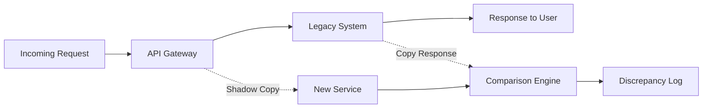

Big-bang migrations fail at alarming rates. Large IT transformation projects routinely exceed budgets and timelines - McKinsey research found that large projects run 45% over budget and 7% over time while delivering 56% less value than predicted. The fundamental problem isn't the new technology or the team's capabilities - it's the validation gap. Teams build entire replacement systems in isolation, then discover on cutover day that their assumptions about the legacy system's behavior were wrong.

The strangler fig pattern offers a different approach: incremental replacement with continuous validation. But the pattern alone isn't enough. The real power comes from treating migration as an observability problem first and a development problem second. When you can prove that your new service behaves identically to the legacy system _before_ any traffic shifts, migration becomes a series of low-risk deployments rather than a high-stakes gamble.

## Why the Strangler Fig Pattern Works

The strangler fig pattern, named after tropical fig trees that gradually envelop and replace their host trees, mirrors how successful migrations actually work. Instead of replacing a legacy system all at once, you extract functionality piece by piece, routing traffic to new services while the old system continues operating.

This approach succeeds where big-bang rewrites fail because it maintains continuous validation against production reality. You're not guessing whether your new authentication service handles edge cases correctly - you're proving it with real requests.

| Aspect | Big-Bang Rewrite | Strangler Fig Migration |
|--------|------------------|------------------------|
| Risk profile | All-or-nothing cutover | Incremental, reversible changes |
| Validation approach | Testing in isolation | Continuous production validation |
| Rollback capability | Extremely difficult | Built into every step |
| Business continuity | Extended freeze periods | Continuous feature delivery |
| Knowledge transfer | Assumptions about legacy behavior | Documented through shadow testing |

Table: Migration approach comparison

The pattern works because it forces you to understand the legacy system's actual behavior, not just its documented behavior. Every edge case, every undocumented feature, every quirky response format gets documented through the migration process itself.

## Shadow Traffic: Proving Equivalence Before Risk

Shadow traffic testing is where that documentation happens automatically. Instead of reverse-engineering legacy behavior through code archaeology, you capture it empirically.

Shadow traffic testing is where the strangler fig pattern transforms from a nice idea into a reliable migration strategy. The concept is straightforward: route copies of production requests to both the legacy system and your new service, compare the responses, and flag any differences.

The legacy system continues handling all real responses while your new service processes the same requests in parallel. A comparison engine analyzes both responses and logs discrepancies without affecting users. This creates a continuous validation loop that catches problems you'd never find in a staging environment.



Figure: Shadow traffic architecture for parallel validation

The comparison engine is where the real intelligence lives. Naive byte-for-byte comparison fails immediately - timestamps differ, generated IDs change, and floating-point precision varies between platforms. Effective comparison requires semantic normalization.

<Newsletter />

Here's a Python implementation that handles common normalization challenges:

```python title="comparison_engine.py"
# Azure Function for shadow traffic comparison
import json
import re

def normalize_response(response: dict) -> dict:
    """Normalize response for semantic comparison."""
    normalized = json.loads(json.dumps(response, sort_keys=True))

    # Remove fields that legitimately differ
    volatile_fields = ['timestamp', 'requestId', 'generatedAt', 'processedBy']
    for field in volatile_fields:
        normalized.pop(field, None)

    return normalized

def compare_responses(legacy: dict, new_service: dict) -> dict:
    """Compare normalized responses and return discrepancies."""
    legacy_norm = normalize_response(legacy)
    new_norm = normalize_response(new_service)

    if legacy_norm == new_norm:
        return {'match': True, 'discrepancies': []}

    # find_discrepancies() walks both dicts recursively to identify differences
    discrepancies = find_discrepancies(legacy_norm, new_norm)
    return {'match': False, 'discrepancies': discrepancies}
```

Code: Semantic comparison with field normalization

<Callout type="info">
Start shadow testing at 1% of traffic and scale up gradually. This catches obvious bugs quickly while limiting the load on your comparison infrastructure. Most teams find that 5-10% sustained shadow traffic provides sufficient coverage to catch edge cases within a few days.
</Callout>

The goal isn't perfection on day one - it's visibility. When shadow testing reveals that your new service returns `null` where the legacy system returns an empty array, you've caught a bug that would have broken clients in production. When it shows that your date parsing handles timezone offsets differently, you've prevented a subtle data corruption issue.

Run shadow traffic until your discrepancy rate drops below your threshold - typically 0.01% for critical services. At that point, you've empirically proven behavioral equivalence across your actual production traffic patterns.

## Traffic Shifting with Automatic Rollback

Once shadow testing proves your new service matches legacy behavior, you're ready to shift real traffic. The key is making this shift gradual and automatically reversible.

A progressive traffic shift schedule balances validation time against migration velocity. Moving too fast risks missing problems that only appear under sustained load. Moving too slowly extends the period where you're maintaining two systems.

| Phase | New Service Traffic | Duration | Success Criteria |
|-------|---------------------|----------|------------------|
| Canary | 1% | 24 hours | Error rate &lt; 0.1%, p99 latency within 10% |
| Early adopters | 10% | 48 hours | No increase in support tickets |
| Partial rollout | 50% | 72 hours | All SLOs maintained |
| Majority | 90% | 48 hours | Business metrics stable |
| Complete | 100% | Ongoing | Legacy decommission criteria met |

Table: Progressive traffic shift schedule

The automation layer monitors these criteria continuously and triggers rollback when thresholds are breached. Human judgment still matters - some increases in error rates are acceptable during traffic shifts, and some business metric fluctuations are coincidental. But automated rollback provides a safety net that lets you shift traffic confidently.

Effective rollback triggers balance sensitivity against false positives:

| Trigger | Threshold | Rationale |
|---------|-----------|-----------|
| Error rate spike | &gt;2x baseline for 5 minutes | Catches systematic failures quickly |
| Latency degradation | p99 &gt;150% baseline for 10 minutes | Identifies performance regressions |
| Circuit breaker trips | &gt;3 trips in 15 minutes | Responds to downstream failures |
| Business metric drop | &gt;5% conversion decrease for 30 minutes | Catches user-facing impact |

Table: Automatic rollback trigger configuration

When any trigger fires, the system automatically routes traffic back to the legacy service. This isn't a failure - it's the system working as designed. Each rollback provides diagnostic data about what went wrong, enabling targeted fixes before the next traffic shift attempt.

The combination of shadow traffic validation and automatic rollback transforms migration from a high-stakes event into a routine deployment. You've already proven the new service works correctly through shadow testing. The traffic shift just confirms that proof holds under real load, with automatic protection if something unexpected occurs.

## Making Migration Routine

This approach succeeds because it reframes migration as an observability challenge. Instead of asking "did we build the right thing?" you're asking "can we prove the new service behaves correctly?" Shadow traffic provides that proof. Automatic rollback ensures that any gaps in that proof don't become production incidents.

<Download
  resource="strangler-fig-migration-complete-guide"
  title="Strangler Fig Migrations: From Observability to Shutdown"
  description="Incrementally migrating to new infrastructure by building observability before cutting traffic. A complete walkthrough using auth extraction as the running example."
  listItems={[
    { text: "Migration phase planning template" },
    { text: "Shadow traffic validation guide" },
    { text: "Automatic rollback policy pack" },
    { text: "Legacy shutdown readiness checklist" }
  ]}
/>

This approach takes longer than a big-bang rewrite would _if the rewrite succeeded_. But the rewrite rarely succeeds on the first attempt. When you account for the discovery of undocumented behavior, the fixes for edge cases that only appear in production, and the inevitable rollbacks, incremental migration with continuous validation is almost always faster.

The real win isn't just a successful migration - it's the operational confidence you build along the way. When your next legacy system needs modernization, you'll have the patterns, tooling, and organizational muscle memory to approach it as routine work rather than an existential risk.
