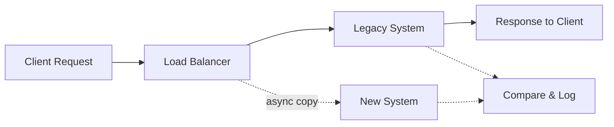

*[CDN]: Content Delivery Network
*[CQRS]: Command Query Responsibility Segregation
*[CSRF]: Cross-Site Request Forgery
*[DNS]: Domain Name System
*[ETL]: Extract, Transform, Load
*[IdP]: Identity Provider
*[JWT]: JSON Web Token
*[MFA]: Multi-Factor Authentication
*[MTTR]: Mean Time To Recovery
*[OIDC]: OpenID Connect
*[P50]: 50th Percentile (Median)
*[P99]: 99th Percentile
*[RBAC]: Role-Based Access Control
*[RPS]: Requests Per Second
*[SAML]: Security Assertion Markup Language
*[SLI]: Service Level Indicator
*[SLO]: Service Level Objective
*[SSO]: Single Sign-On
*[TOTP]: Time-based One-Time Password
*[TTL]: Time To Live

> Migrate what you can observe; observe before you migrate.

The strangler fig pattern succeeds because it trades big-bang risk for incremental progress. This guide walks through the complete lifecycle—from baseline instrumentation through traffic shifting to legacy decommissioning—using authentication extraction as a concrete running example.

## The Strangler Fig Pattern

The strangler fig pattern gets its name from the strangler fig tree, which grows around a host tree and gradually replaces it while the original structure remains standing. That's exactly what we're doing with migrations: building the new system around the old one, shifting traffic incrementally, and only decommissioning the legacy system when we've proven the new one works.

The core insight is simple: _you can't migrate what you can't observe_. Before touching any traffic, you need to know what "normal" looks like. That baseline becomes your comparison point throughout the migration.

### Why Strangler Fig Works

The pattern eliminates the single point of failure that kills most migrations. With a big-bang approach, you're betting everything on one deployment. If it fails, you're scrambling to roll back while users pile into your support queue. With strangler fig, each increment is a small bet. A failure at 5% traffic is annoying; a failure at 100% traffic is a much bigger problem.

| Approach | Blast Radius | Rollback | Time to Value | Observability |
|----------|--------------|----------|---------------|---------------|
| Big-bang | 100% of traffic | Full rollback (maybe) | All at the end | Post-migration only |
| Strangler fig | Only migrated traffic | Route back to legacy | Incremental | Required at every step |

The strangler fig approach also delivers value earlier. You don't wait months for a complete rewrite—you start seeing benefits as soon as the first piece migrates successfully. This keeps stakeholders engaged and gives you opportunities to course-correct before you've invested heavily in the wrong direction.

### Migration Unit Selection

Strangler fig works at multiple levels of granularity, and choosing the right migration unit depends on your system's architecture and coupling patterns.

For a monolith with a REST API, the natural unit is often a _service boundary_—a cohesive set of endpoints that share data and business logic. Authentication is one such boundary: login, logout, password reset, and token validation form a logical group. Payments might be another. The key is that endpoints within a boundary are tightly coupled to each other but loosely coupled to the rest of the system.

Within a service boundary, you still migrate incrementally by endpoint. Start with the simplest, lowest-traffic endpoints to learn the process. For auth, that might be password reset (clear boundaries, low frequency) before tackling login (high frequency, session management complexity).

The first wave should be low-traffic, low-criticality endpoints that teach you the migration process itself—how to deploy, monitor, and roll back. You'll make mistakes, and you want those mistakes to affect the fewest users possible. Second wave takes on medium complexity. Third wave is high traffic. The final wave is core business logic and anything with deep dependencies.

<Callout type="info">
Read-only endpoints (GET requests, queries) are ideal first migration candidates. They have no state modification risk, responses are easy to compare, and you can roll back instantly without data consistency concerns.
</Callout>

### Why Auth Is the Hardest Extraction

I'm using authentication as the running example throughout this guide because if you can extract auth, you can extract anything. Auth is the hardest extraction because it touches _everything_.

The coupling points are numerous: user table foreign keys exist in every table with a `user_id` column, session storage lives in a shared database, permission checks are scattered throughout business logic, and password reset flows integrate with email and SMS services. Each of these creates a dependency that must be addressed during migration.

The core challenge is that user table foreign keys have high migration difficulty—you need to keep user IDs consistent and reference by ID rather than join. Session storage requires moving to stateless JWTs or an external session store. Permission checks must first be extracted to middleware before moving to the auth service. Password reset and MFA have clearer boundaries and can be extracted earlier.

<Callout type="warning">
Auth extraction is expert-level work. If your team hasn't extracted a service before, start with something simpler—a notification service, a reporting service, or a feature with clear boundaries. Learn the patterns before tackling auth.
</Callout>

## Building the Migration Baseline

Before touching any traffic, you need to know what "normal" looks like. This means instrumenting the legacy system to capture metrics, response patterns, and error rates. The baseline becomes your reference point for the entire migration—if you can't compare the new system's behavior to something concrete, you're flying blind.

I recommend collecting at least two weeks of baseline data before migrating any traffic. This captures weekly patterns (Monday traffic differs from Friday), edge cases, and gives you statistical confidence in your metrics.

### Legacy System Instrumentation

Many legacy systems have minimal observability. Adding instrumentation is the first step, and OpenTelemetry provides a vendor-neutral way to do it.

The goal is to capture four key metrics for every endpoint: request count, error rate, latency distribution, and response shape. The first three are standard. The fourth—response shape—is specific to migration work. You need to know what the legacy system returns so you can verify the new system returns the same thing.

```csharp
// OpenTelemetry instrumentation middleware for ASP.NET MVC or
// Web API 2 running on .NET Framework 4.6.2+ legacy services
public class LegacyInstrumentationModule : IHttpModule {
    private static readonly Meter Meter = new Meter("legacy-migration");
    private static readonly ActivitySource ActivitySource = new ActivitySource("legacy-migration");

    private static readonly Counter<long> RequestCounter = Meter.CreateCounter<long>("http_requests_total");
    private static readonly Histogram<double> RequestDuration = Meter.CreateHistogram<double>("http_request_duration_ms", "ms");

    public void Init(HttpApplication context) {
        context.BeginRequest += (s, e) => {
            var app = (HttpApplication)s;
            var path = app.Request.Path;

            // Start Span (Activity)
            var activity = ActivitySource.StartActivity($"{app.Request.HttpMethod} {path}");
            activity?.SetTag("http.method", app.Request.HttpMethod);
            activity?.SetTag("migration.system", "legacy");

            app.Context.Items["StartTime"] = Stopwatch.GetTimestamp();
            app.Context.Items["Span"] = activity;
        };

        context.EndRequest += (s, e) => {
            var app = (HttpApplication)s;
            var startTime = (long)app.Context.Items["StartTime"];
            var activity = (Activity)app.Context.Items["Span"];

            var duration = Stopwatch.GetElapsedTime(startTime).TotalMilliseconds;
            var status = app.Response.StatusCode.ToString();

            // Record Metrics
            RequestCounter.Add(1, new("method", app.Request.HttpMethod), new("status", status));
            RequestDuration.Record(duration, new("method", app.Request.HttpMethod), new("status", status));

            // End Span
            activity?.SetTag("http.status_code", app.Response.StatusCode);
            activity?.Dispose();
        };
    }
    public void Dispose() { }
}
```

```csharp title="Global.asax.cs"
// initialize the OpenTelemetry SDK at application startup and register the module
protected void Application_Start() {
    Sdk.CreateTracerProviderBuilder()
        .AddAspNetInstrumentation() // Built-in support for ASP.NET legacy
        .AddSource("legacy-migration")
        .AddOtlpExporter()
        .Build();

    Sdk.CreateMeterProviderBuilder()
        .AddMeter("legacy-migration")
        .AddOtlpExporter()
        .Build();
}
```

```xml title="Web.config"
<!-- Register the module in server configuration -->
<system.webServer>
  <modules>
    <add name="LegacyInstrumentation" type="YourNamespace.LegacyInstrumentationModule" />
  </modules>
</system.webServer>
```

If you're working with a system that can't easily add middleware—maybe it's a compiled binary or a third-party service—you can instrument at the proxy layer instead. AWS ALB access logs or NGINX logs can be parsed into metrics, though you lose the ability to capture response bodies.

### Capturing Response Signatures

Beyond metrics, you need to capture what responses actually look like. During migration, you'll compare legacy responses to new system responses to verify correctness. This requires sampling production traffic and storing response signatures.

The approach is to hash the response body after removing volatile fields (timestamps, request IDs, trace IDs). Two responses with the same hash are functionally equivalent. Store these signatures alongside the request details so you can replay them against the new system later.

Sample rate matters here. Capturing 100% of traffic generates enormous data volumes; 1% is usually sufficient for statistical confidence while keeping storage costs reasonable. For low-traffic endpoints, increase the sample rate to ensure you have enough data points.

```csharp
// Response signature capture for migration comparison testing
public class ResponseSignature {
    public string RequestId { get; set; }
    public string Endpoint { get; set; }
    public string Method { get; set; }
    public string RequestHash { get; set; }
    public string ResponseHash { get; set; }
    public int StatusCode { get; set; }
    public double LatencyMs { get; set; }
    public DateTime Timestamp { get; set; }
}

public class MigrationLoggingHandler : DelegatingHandler {
    protected override async Task<HttpResponseMessage> SendAsync(HttpRequestMessage request, CancellationToken cancellationToken) {
        var stopwatch = Stopwatch.StartNew();
        var timestamp = DateTime.UtcNow;

        // 1. Capture and Hash Request
        var requestBody = await request.Content.ReadAsStringAsync();
        var requestHash = HashNormalizedJson(requestBody);

        // 2. Proceed with the Request
        var response = await base.SendAsync(request, cancellationToken);

        // 3. Capture and Hash Response
        stopwatch.Stop();
        var responseBody = await response.Content.ReadAsStringAsync();
        var responseHash = HashNormalizedJson(responseBody, (int)response.StatusCode);

        var signature = new ResponseSignature {
            RequestId = request.GetCorrelationId(), // Custom helper to get header
            Endpoint = request.RequestUri.PathAndQuery,
            Method = request.Method.Method,
            RequestHash = requestHash,
            ResponseHash = responseHash,
            StatusCode = (int)response.StatusCode,
            LatencyMs = stopwatch.ElapsedMilliseconds,
            Timestamp = timestamp
        };

        // Store signature to Cosmos DB, DynamoDB, or similar for offline comparison
        await _signatureStore.SaveAsync(signature);
        return response;
    }

    private string HashNormalizedJson(string json, int? status = null) {
        if (string.IsNullOrWhiteSpace(json)) return string.Empty;

        var volatileFields = new[] { "timestamp", "requestId", "traceId", "serverTime" };
        var jObj = JObject.Parse(json);

        // Strip volatile fields for comparison
        foreach (var field in volatileFields) {
            jObj.Remove(field);
        }

        var normalized = jObj.ToString(Formatting.None);
        var input = status.HasValue ? $"{status}:{normalized}" : normalized;

        // SHA256 Hashing
        using (var sha256 = SHA256.Create()) {
            var bytes = Encoding.UTF8.GetBytes(input);
            var hash = sha256.ComputeHash(bytes);
            return BitConverter.ToString(hash).Replace("-", "").ToLowerInvariant();
        }
    }
}
```

### Baseline Dashboard

Once instrumentation is in place, build a dashboard that shows the metrics you'll monitor throughout the migration. At minimum, you need request rate by endpoint, error rate by endpoint, and latency percentiles (P50 and P99).

For Prometheus/Grafana, the key queries look like this:

```promql
# Request rate by endpoint (requests per second)
sum(rate(http_requests_total{system="legacy"}[5m])) by (path)

# Error rate by endpoint (5xx responses / total responses)
sum(rate(http_requests_total{system="legacy",status=~"5.."}[5m])) by (path)
/
sum(rate(http_requests_total{system="legacy"}[5m])) by (path)

# P99 latency by endpoint
histogram_quantile(0.99, sum(rate(http_request_duration_ms_bucket{system="legacy"}[5m])) by (le, path))
```

Record the baseline values before starting the migration. You'll compare these to the new system's metrics at each traffic percentage. If P99 latency is 50ms on legacy, and jumps to 200ms on the new system at 10% traffic, that's a signal to investigate before increasing traffic further.

## Shadow Traffic and Comparison Testing

Before shifting any real traffic to the new system, you want to know it behaves correctly. Shadow traffic lets you test with production request patterns without affecting users. The legacy system continues serving all responses—the new system receives copies of requests, processes them, and logs the results for comparison.

This is where your baseline investment pays off. You already know what the legacy system's responses look like. Now you can verify the new system produces the same results.

### Shadow Traffic Architecture

The basic architecture routes production requests to the legacy system as normal, while asynchronously copying them to the new system. A comparison service receives both responses and logs any differences.



Figure: Shadow traffic architecture with async mirroring

You can implement this at different layers depending on your infrastructure. If you're using AWS, Application Load Balancer doesn't support native traffic mirroring, but you can achieve it with a Lambda@Edge function or by deploying an Envoy sidecar. For on-premises deployments, NGINX Plus has built-in mirroring, or you can implement it in application code.

For a .NET Framework application, implementing shadow traffic at the application layer gives you the most control over what gets mirrored and how responses are compared:

```csharp
// Shadow traffic handler for ASP.NET Web API
public class ShadowTrafficHandler : DelegatingHandler {
    private readonly HttpClient _shadowClient;
    private readonly IComparisonService _comparisonService;
    private readonly string _newServiceBaseUrl;

    public ShadowTrafficHandler(string newServiceBaseUrl, IComparisonService comparisonService) {
        _newServiceBaseUrl = newServiceBaseUrl;
        _comparisonService = comparisonService;
        _shadowClient = new HttpClient { Timeout = TimeSpan.FromSeconds(5) };
    }

    protected override async Task<HttpResponseMessage> SendAsync(
        HttpRequestMessage request, CancellationToken cancellationToken) {

        // Capture request body before it's consumed
        var requestBody = request.Content != null
            ? await request.Content.ReadAsStringAsync()
            : null;

        var stopwatch = Stopwatch.StartNew();

        // Send to legacy system (primary path)
        var legacyResponse = await base.SendAsync(request, cancellationToken);
        var legacyBody = await legacyResponse.Content.ReadAsStringAsync();
        var legacyLatency = stopwatch.ElapsedMilliseconds;

        // Fire-and-forget shadow request (don't block the response)
        _ = Task.Run(async () => {
            try {
                await SendShadowRequest(request, requestBody, legacyResponse.StatusCode, legacyBody, legacyLatency);
            }
            catch (Exception ex) {
                // Log but never affect production traffic
                Trace.TraceWarning($"Shadow request failed: {ex.Message}");
            }
        });

        return legacyResponse;
    }

    private async Task SendShadowRequest(HttpRequestMessage originalRequest, string requestBody,
        HttpStatusCode legacyStatus, string legacyBody, long legacyLatencyMs) {

        var shadowRequest = new HttpRequestMessage(originalRequest.Method,
            _newServiceBaseUrl + originalRequest.RequestUri.PathAndQuery);

        // Copy headers, mark as shadow traffic
        foreach (var header in originalRequest.Headers) {
            shadowRequest.Headers.TryAddWithoutValidation(header.Key, header.Value);
        }
        shadowRequest.Headers.Add("X-Shadow-Request", "true");

        if (requestBody != null) {
            shadowRequest.Content = new StringContent(requestBody, Encoding.UTF8, "application/json");
        }

        var stopwatch = Stopwatch.StartNew();
        var newResponse = await _shadowClient.SendAsync(shadowRequest);
        var newBody = await newResponse.Content.ReadAsStringAsync();

        // Store signature for offline comparison (uses same hashing logic as earlier)
        await _signatureStore.SaveAsync(new ResponseSignature {
            RequestId = requestId,
            System = "new",
            Endpoint = originalRequest.RequestUri.PathAndQuery,
            StatusCode = (int)newResponse.StatusCode,
            ResponseHash = HashNormalizedJson(newBody, (int)newResponse.StatusCode),
            LatencyMs = stopwatch.ElapsedMilliseconds,
            Timestamp = DateTime.UtcNow
        });
    }
}
```

Notice the shadow handler doesn't do comparison inline—it just stores signatures. Comparison happens offline, outside the application.

### Response Comparison Engine

The comparison logic doesn't belong in the application's hot path. Both systems write response signatures to a data store; a separate service matches them by request ID and compares. This keeps comparison logic out of the request path, lets you update comparison rules without redeploying applications, and scales independently.

For Azure environments, a straightforward approach uses Cosmos DB with change feed triggering an Azure Function. When a new signature arrives, the function looks for its partner (the same request ID from the other system), compares them, and emits metrics:

```python
# Azure Function triggered by Cosmos DB change feed
import os
import azure.functions as func
import json
import hashlib
from azure.cosmos import CosmosClient
from applicationinsights import TelemetryClient

app = func.FunctionApp()

VOLATILE_FIELDS = {'timestamp', 'requestId', 'traceId', 'serverTime'}

@app.cosmos_db_trigger(arg_name="signatures", container_name="signatures",
                        database_name="migration", connection="CosmosConnection",
                        lease_container_name="leases")
async def compare_response_signatures(signatures: func.DocumentList):
    cosmos = CosmosClient.from_connection_string(os.environ["CosmosConnection"])
    container = cosmos.get_database_client("migration").get_container_client("signatures")
    telemetry = TelemetryClient(os.environ["APPINSIGHTS_INSTRUMENTATIONKEY"])

    for sig in signatures:
        partner_system = "new" if sig["system"] == "legacy" else "legacy"

        # Query for the matching signature from the other system
        query = "SELECT * FROM c WHERE c.requestId = @rid AND c.system = @sys"
        params = [{"name": "@rid", "value": sig["requestId"]},
                  {"name": "@sys", "value": partner_system}]
        partners = list(container.query_items(query, parameters=params))

        if not partners:
            continue  # Partner hasn't arrived yet; change feed will catch it

        partner = partners[0]
        legacy = sig if sig["system"] == "legacy" else partner
        new = partner if sig["system"] == "legacy" else sig

        comparison = compare_signatures(legacy, new)

        # Emit to Application Insights for dashboards
        telemetry.track_metric("migration.mismatch_rate",
                               0 if comparison["match"] else 1,
                               properties={"endpoint": sig["endpoint"]})

        if not comparison["match"]:
            container.upsert_item({**comparison, "type": "mismatch"})

def compare_signatures(legacy: dict, new: dict) -> dict:
    """Compare two response signatures. Hashes are pre-computed during capture."""
    return {
        "requestId": legacy["requestId"],
        "endpoint": legacy["endpoint"],
        "match": legacy["statusCode"] == new["statusCode"] and legacy["responseHash"] == new["responseHash"],
        "statusMatch": legacy["statusCode"] == new["statusCode"],
        "bodyMatch": legacy["responseHash"] == new["responseHash"],
        "latencyDeltaMs": new["latencyMs"] - legacy["latencyMs"]
    }
```

For AWS, DynamoDB Streams with Lambda achieves the same pattern:

```python
# AWS Lambda triggered by DynamoDB Streams
import boto3
import json
import hashlib
from decimal import Decimal

dynamodb = boto3.resource('dynamodb')
cloudwatch = boto3.client('cloudwatch')
table = dynamodb.Table('migration-signatures')

VOLATILE_FIELDS = {'timestamp', 'requestId', 'traceId', 'serverTime'}

def handler(event, context):
    for record in event['Records']:
        if record['eventName'] != 'INSERT':
            continue

        # deserialize_dynamodb is a standard utility for converting DynamoDB's
        # AttributeValue format to plain Python dicts (boto3.dynamodb.types.TypeDeserializer)
        sig = deserialize_dynamodb(record['dynamodb']['NewImage'])
        partner_system = "new" if sig["system"] == "legacy" else "legacy"

        # Query for the matching signature
        response = table.query(
            IndexName='requestId-system-index',
            KeyConditionExpression='requestId = :rid AND system = :sys',
            ExpressionAttributeValues={':rid': sig['requestId'], ':sys': partner_system}
        )

        if not response['Items']:
            continue

        partner = response['Items'][0]
        legacy = sig if sig["system"] == "legacy" else partner
        new = partner if sig["system"] == "legacy" else sig

        comparison = compare_signatures(legacy, new)

        # Emit to CloudWatch Metrics
        cloudwatch.put_metric_data(
            Namespace='Migration',
            MetricData=[{
                'MetricName': 'MismatchRate',
                'Value': 0 if comparison['match'] else 1,
                'Dimensions': [{'Name': 'Endpoint', 'Value': sig['endpoint']}]
            }]
        )

def compare_signatures(legacy: dict, new: dict) -> dict:
    return {
        "requestId": legacy["requestId"],
        "endpoint": legacy["endpoint"],
        "match": legacy["statusCode"] == new["statusCode"] and legacy["responseHash"] == new["responseHash"],
        "latencyDeltaMs": int(new["latencyMs"]) - int(legacy["latencyMs"])
    }
```

### Alternative: Batch Processing

If you don't need real-time comparison results, a batch job is simpler to implement and debug. The job periodically queries for signature pairs that haven't been compared yet, runs comparisons, and emits metrics.

For Azure, an **Azure WebJob** running on a schedule works well—it's just a console application that runs in the same App Service as your application. For AWS, **Step Functions** with a scheduled EventBridge rule provides orchestration with built-in retry logic. The simplest option on any platform is a **cron-triggered container**—a Docker container running on ECS, Azure Container Instances, or even a Kubernetes CronJob that executes the comparison script on a schedule.

The batch approach trades latency for simplicity. You might see mismatches 15 minutes after they occur rather than within seconds, but you avoid the complexity of event-driven infrastructure. For most migrations, that delay is acceptable.

### High-Volume: Stream Processing

If you're dealing with thousands of requests per second, the event-driven approach can struggle with the "partner lookup" problem—you're doing a database query for every incoming signature. At high volume, this becomes expensive and slow.

Stream processing solves this with windowed joins. Both legacy and new signatures flow into a stream (Kafka, Kinesis, or Azure Event Hubs). A stream processor like **Apache Flink**, **Spark Streaming**, or **Kafka Streams** joins records by request ID within a time window (say, 60 seconds). Matched pairs get compared; unmatched records after the window expires indicate a problem (one system responded but the other didn't).

This approach scales horizontally and handles backpressure gracefully, but it's significantly more infrastructure to operate. Only reach for stream processing if the simpler approaches can't keep up with your traffic volume.

<Callout type="warning">
Shadow traffic works for read operations but is dangerous for writes. Duplicating POST/PUT/DELETE requests can cause double-writes, duplicate charges, or data corruption. For write operations, use synthetic test data or replay sanitized production logs in a non-production environment.
</Callout>

### When to Move Past Shadow Testing

Run shadow traffic for at least a week before considering real traffic migration. You're looking for:

- Mismatch rate below 0.1% (or whatever threshold you've defined as acceptable)
- No systematic errors—random noise is fine, but patterns indicate bugs
- Latency within 20% of legacy system (the new system being faster is fine; much slower is a problem)
- No memory leaks or connection pool exhaustion under sustained load

Once these criteria are met, you're ready to start shifting real traffic.

## Building the New Service

With validation complete, you shift from testing to construction. Shadow traffic proved the new system can handle production patterns correctly—now you need to design the interfaces that'll let both systems coexist during the transition. For auth extraction, this means designing the API contract, deciding on a token strategy, and keeping data synchronized during the transition.

### Defining the Target API Contract

Design the interface before writing implementation code. For an auth service, the contract typically includes public endpoints for login, logout, and password management, plus internal endpoints for token validation that other services will call.

| Endpoint                      | Method | Purpose                               | SLO                          |
|-------------------------------|--------|---------------------------------------|------------------------------|
| `/auth/login`                 | POST   | Authenticate user, return tokens      | P99 < 200ms, 99.9% available |
| `/auth/logout`                | POST   | Invalidate tokens                     | P99 < 50ms, 99.9% available  |
| `/auth/refresh`               | POST   | Exchange refresh token for new access | P99 < 50ms, 99.9% available  |
| `/auth/password/reset-request`| POST   | Initiate password reset               | P99 < 100ms, 99.9% available |
| `/auth/password/reset`        | POST   | Complete password reset               | P99 < 100ms, 99.9% available |
| `/internal/validate`          | POST   | Validate token (internal only)        | P99 < 10ms, 99.99% available |

The `/internal/validate` endpoint deserves attention—it's called on every authenticated request across your entire system. It needs to be fast (sub-10ms P99) and highly available. Consider local JWT validation with periodic key refresh rather than a network call for every request.

### Token Strategy: Sessions to JWTs

The legacy system likely uses server-side sessions—user logs in, server creates a session record, client gets a session cookie, every request looks up that session. This doesn't scale well and creates sticky session problems for load balancing.

JWTs move the session data into the token itself. The token contains the user ID, permissions, and expiration; the server validates the signature without a database lookup. This trades some flexibility (you can't instantly invalidate a token) for scalability and simplicity.

A typical JWT payload for an auth service looks like this:

```json title="Example JWT payload for auth service"
{
  "sub": "user-123",
  "iat": 1699900000,
  "exp": 1699900900,
  "iss": "auth-service",
  "aud": ["api", "internal"],
  "email": "user@example.com",
  "roles": ["admin"],
  "permissions": ["read:users", "write:users"],
  "legacySessionId": "abc123"
}
```

The `legacySessionId` field is temporary—it lets you correlate new tokens with old sessions during the dual-running period. Remove it once migration completes.

The new auth service issues token pairs: a short-lived access token (15 minutes) and a longer-lived refresh token (7 days). The access token is stateless; the refresh token is stored server-side so it can be revoked:

```csharp
// Token service implementation in the new auth service
public class TokenService {
    private readonly RSA _privateKey;
    private readonly RSA _publicKey;
    private readonly IRefreshTokenRepository _refreshTokens;
    private readonly TimeSpan _accessTokenTtl = TimeSpan.FromMinutes(15);
    private readonly TimeSpan _refreshTokenTtl = TimeSpan.FromDays(7);

    public async Task<TokenPair> GenerateTokenPairAsync(User user, IEnumerable<string> permissions) {
        var now = DateTime.UtcNow;

        var claims = new List<Claim> {
            new Claim(JwtRegisteredClaimNames.Sub, user.Id),
            new Claim(JwtRegisteredClaimNames.Email, user.Email),
            new Claim(JwtRegisteredClaimNames.Iat, new DateTimeOffset(now).ToUnixTimeSeconds().ToString(),
                      ClaimValueTypes.Integer64),
            new Claim("aud", "api"),
            new Claim("aud", "internal")
        };
        claims.AddRange(user.Roles.Select(r => new Claim(ClaimTypes.Role, r)));
        claims.AddRange(permissions.Select(p => new Claim("permission", p)));

        var signingCredentials = new SigningCredentials(
            new RsaSecurityKey(_privateKey), SecurityAlgorithms.RsaSha256);

        var accessToken = new JwtSecurityTokenHandler().WriteToken(new JwtSecurityToken(
            issuer: "auth-service",
            claims: claims,
            notBefore: now,
            expires: now.Add(_accessTokenTtl),
            signingCredentials: signingCredentials
        ));

        var refreshToken = await CreateRefreshTokenAsync(user.Id, now);

        return new TokenPair {
            AccessToken = accessToken,
            RefreshToken = refreshToken,
            ExpiresIn = (int)_accessTokenTtl.TotalSeconds
        };
    }

    public async Task<ValidationResult> ValidateTokenAsync(string token) {
        try {
            var handler = new JwtSecurityTokenHandler();
            var parameters = new TokenValidationParameters {
                ValidateIssuer = true,
                ValidIssuer = "auth-service",
                ValidateAudience = false,
                IssuerSigningKey = new RsaSecurityKey(_publicKey),
                ValidateLifetime = true,
                ClockSkew = TimeSpan.FromSeconds(30)
            };

            var principal = handler.ValidateToken(token, parameters, out var validatedToken);
            var userId = principal.FindFirst(JwtRegisteredClaimNames.Sub)?.Value;
            var issuedAt = long.Parse(principal.FindFirst(JwtRegisteredClaimNames.Iat)?.Value ?? "0");

            // Check token revocation (user changed password, logged out, etc.)
            if (await IsTokenRevokedAsync(userId, issuedAt)) {
                return new ValidationResult { Valid = false, Reason = "Token revoked" };
            }

            return new ValidationResult {
                Valid = true,
                UserId = userId,
                Permissions = principal.FindAll("permission").Select(c => c.Value).ToList(),
                ExpiresAt = ((JwtSecurityToken)validatedToken).ValidTo
            };
        }
        catch (SecurityTokenException ex) {
            return new ValidationResult { Valid = false, Reason = ex.Message };
        }
    }
}
```

### Dual-Write Pattern for User Data

During migration, both systems need consistent user data. The dual-write pattern writes to both databases, with the legacy system as the source of truth. If the write to the new service fails, log it and queue a retry—don't fail the user operation.

```csharp
// Dual-write implementation in the legacy system
public class DualWriteUserService {
    private readonly IUserRepository _monolithUsers;
    private readonly IAuthServiceClient _authService;
    private readonly IFeatureFlags _flags;
    private readonly IBackgroundJobQueue _syncQueue;
    private readonly ILogger<DualWriteUserService> _logger;

    public async Task<User> CreateUserAsync(CreateUserInput input) {
        // 1. Write to legacy system (source of truth)
        var user = new User {
            Id = Guid.NewGuid().ToString(),
            Email = input.Email,
            PasswordHash = _passwordHasher.Hash(input.Password),
            CreatedAt = DateTime.UtcNow
        };
        await _monolithUsers.InsertAsync(user);

        // 2. Sync to auth service if dual-write is enabled
        if (_flags.IsEnabled("auth_dual_write")) {
            try {
                await _authService.SyncUserAsync(new SyncUserRequest {
                    Id = user.Id,
                    Email = user.Email,
                    PasswordHash = user.PasswordHash
                });
            }
            catch (Exception ex) {
                // Log but don't fail—legacy write succeeded
                _logger.LogError(ex, "Failed to sync user {UserId} to auth service", user.Id);
                await _syncQueue.EnqueueAsync(new SyncUserJob { UserId = user.Id });
            }
        }

        return user;
    }

    public async Task UpdatePasswordAsync(string userId, string newPassword) {
        var hash = _passwordHasher.Hash(newPassword);

        // Update legacy system first
        await _monolithUsers.UpdatePasswordHashAsync(userId, hash);

        if (_flags.IsEnabled("auth_dual_write")) {
            try {
                await _authService.UpdatePasswordHashAsync(userId, hash);
            }
            catch (Exception ex) {
                _logger.LogError(ex, "Failed to sync password for user {UserId}", userId);
                await _syncQueue.EnqueueAsync(new SyncPasswordJob { UserId = userId, Hash = hash });
            }
        }
    }
}
```

The retry queue is important. Network failures happen, and you don't want users stuck in an inconsistent state. A background job picks up failed syncs and retries with exponential backoff.

## Data Migration Strategy

Dual-write handles new changes, but you also need to migrate existing users. Do this incrementally with checkpointing—if the job fails partway through, it resumes from where it left off.

```csharp
// Incremental user migration job
public class UserMigrationJob {
    private readonly IMonolithDbContext _monolith;
    private readonly IAuthServiceClient _authService;
    private readonly ICheckpointStore _checkpoints;

    public async Task<MigrationReport> MigrateUsersAsync(MigrationConfig config) {
        var report = new MigrationReport();
        var lastId = await _checkpoints.GetAsync("user_migration") ?? "";

        while (true) {
            var users = await _monolith.Users
                .Where(u => string.Compare(u.Id, lastId) > 0)
                .OrderBy(u => u.Id)
                .Take(config.BatchSize)
                .ToListAsync();

            if (!users.Any()) break;

            foreach (var user in users) {
                report.Total++;

                try {
                    var exists = await _authService.UserExistsAsync(user.Id);
                    if (exists) {
                        report.Skipped++;
                        continue;
                    }

                    if (!config.DryRun) {
                        await _authService.ImportUserAsync(new ImportUserRequest {
                            Id = user.Id,
                            Email = user.Email,
                            PasswordHash = user.PasswordHash,
                            MfaSecret = user.MfaSecret,
                            MfaEnabled = user.MfaEnabled
                        });
                    }

                    report.Migrated++;
                    await Task.Delay(config.RateLimitMs);  // Be gentle with the new service
                }
                catch (Exception ex) {
                    report.Failed++;
                    report.FailedUserIds.Add(user.Id);
                }

                lastId = user.Id;
            }

            await _checkpoints.SetAsync("user_migration", lastId);
        }

        return report;
    }
}
```

Run the migration during off-peak hours and monitor the new service's resource usage. A rate limit of 100-200 users per second is usually safe; adjust based on your database performance.

## Traffic Shifting Strategies

Shadow traffic validated the new system; now you're moving real users. This is where the strangler fig earns its name—you're gradually routing traffic away from the legacy system until it withers from disuse.

### Percentage-Based Traffic Split

The most common approach: route a percentage of requests to the new system, increasing the percentage as confidence grows. Start small (1%), wait for metrics to stabilize, then increase.

Table: Progressive traffic shift schedule

| Day  | New System % | Gate Criteria                                    |
|------|--------------|--------------------------------------------------|
| 0    | 1%           | Manual verification of first requests            |
| 1    | 5%           | 24h at 1% with &lt;0.1% error rate increase         |
| 3    | 10%          | 48h at 5% with latency within 10%                |
| 5    | 25%          | 48h at 10% with no incidents                     |
| 7    | 50%          | 48h at 25% with no incidents                     |
| 10   | 75%          | 72h at 50% with no incidents                     |
| 14   | 100%         | 96h at 75% with no incidents                     |

The wait periods matter. Two days at each level gives you time to observe behavior across different traffic patterns (weekday vs. weekend, peak vs. off-peak). The gate criteria should be measurable—define "no incidents" before you start.

If you're using a service mesh like Istio, traffic splitting is declarative:

```yaml
# Istio traffic splitting configuration
apiVersion: networking.istio.io/v1beta1
kind: VirtualService
metadata:
  name: auth-migration
spec:
  hosts:
    - api.example.com
  http:
    - match:
        - uri:
            prefix: /auth/login
      route:
        - destination:
            host: legacy-api
          weight: 90
        - destination:
            host: auth-service
          weight: 10

    # Non-migrated endpoints go to legacy only
    - route:
        - destination:
            host: legacy-api
          weight: 100
```

Without a service mesh, you can implement splitting in the API gateway or in application code. The key is making the split configurable without redeployment—you need to roll back quickly if metrics degrade.

### Cohort-Based Migration

Percentage-based splitting is random—any user might hit either system on any request. That's fine for stateless operations, but for auth you often want consistency: a user should authenticate against the same system for their entire session.

Cohort-based migration routes entire user segments rather than random requests. Start with low-risk cohorts:

1. **Internal employees**: Your own team uses the new system first. They can report issues directly.
2. **Beta opt-ins**: Users who explicitly want new features and understand the tradeoffs.
3. **Low-tier accounts**: Free users or small organizations where an issue has limited blast radius.
4. **New signups**: Users with no history in the legacy system avoid data migration issues.

The cohort router needs to be deterministic—the same user hits the same system every time:

```csharp
// Cohort-based routing in the legacy system
public class CohortRouter {
    private readonly ICohortRepository _cohorts;
    private readonly IFeatureFlags _flags;

    public string GetTargetSystem(User user) {
        // Check cohorts in priority order
        if (IsInternalUser(user.Email)) {
            return _flags.IsEnabled("auth_internal_to_new") ? "new" : "legacy";
        }

        if (user.BetaEnabled && _flags.IsEnabled("auth_beta_to_new")) {
            return "new";
        }

        if (user.Organization?.Tier == "free" && _flags.IsEnabled("auth_free_tier_to_new")) {
            return "new";
        }

        // Default: use percentage-based split
        return GetPercentageBasedTarget(user.Id);
    }

    private string GetPercentageBasedTarget(string userId) {
        // Consistent hashing ensures the same user always gets the same result.
        // Note: GetHashCode() is fine for demos but not stable across .NET versions.
        // For production, use MurmurHash or FNV for deterministic results.
        var percentage = _flags.GetValue<int>("auth_new_system_percentage");
        var hash = Math.Abs(userId.GetHashCode()) % 100;
        return hash < percentage ? "new" : "legacy";
    }

    private bool IsInternalUser(string email) {
        return email.EndsWith("@yourcompany.com", StringComparison.OrdinalIgnoreCase);
    }
}
```

### Legacy Token Validation Adapter

Here's where auth extraction gets tricky. Once users start authenticating against the new service, they receive JWTs instead of session cookies. But the rest of the legacy system still expects session-based authentication.

You need an adapter that lets the legacy system accept both session cookies (from users who haven't migrated) and JWTs (from users who have). This runs in the legacy system's auth middleware:

```csharp
// Authentication middleware that accepts both sessions and JWTs
public class HybridAuthMiddleware : IHttpModule {
    private readonly RSA _publicKey;
    private readonly IMemoryCache _validationCache;
    private readonly HttpClient _authServiceClient;
    private static readonly TimeSpan CacheDuration = TimeSpan.FromMinutes(1);

    public void Init(HttpApplication context) {
        context.AuthenticateRequest += OnAuthenticateRequest;
    }

    private void OnAuthenticateRequest(object sender, EventArgs e) {
        var app = (HttpApplication)sender;
        var request = app.Request;

        // Try JWT first (from Authorization header)
        var authHeader = request.Headers["Authorization"];
        if (!string.IsNullOrEmpty(authHeader) && authHeader.StartsWith("Bearer ", StringComparison.OrdinalIgnoreCase)) {
            var token = authHeader.Substring(7);
            var validation = ValidateJwt(token);

            if (validation.Valid) {
                // Set principal for downstream code
                var claims = new List<Claim> {
                    new Claim(ClaimTypes.NameIdentifier, validation.UserId)
                };
                claims.AddRange(validation.Permissions.Select(p => new Claim("permission", p)));

                var identity = new ClaimsIdentity(claims, "JWT");
                HttpContext.Current.User = new ClaimsPrincipal(identity);

                // Populate legacy session properties for backward compatibility
                HttpContext.Current.Items["UserId"] = validation.UserId;
                HttpContext.Current.Items["IsAuthenticated"] = true;
                return;
            }
        }

        // Fall back to legacy session handling
        // (existing session auth code continues to work)
    }

    private ValidationResult ValidateJwt(string token) {
        // Check cache first
        if (_validationCache.TryGetValue(token, out ValidationResult cached)) {
            return cached;
        }

        ValidationResult result;
        try {
            var handler = new JwtSecurityTokenHandler();
            var parameters = new TokenValidationParameters {
                ValidateIssuer = true,
                ValidIssuer = "auth-service",
                ValidateAudience = false,
                IssuerSigningKey = new RsaSecurityKey(_publicKey),
                ValidateLifetime = true,
                ClockSkew = TimeSpan.FromSeconds(30)
            };

            var principal = handler.ValidateToken(token, parameters, out _);
            result = new ValidationResult {
                Valid = true,
                UserId = principal.FindFirst(JwtRegisteredClaimNames.Sub)?.Value,
                Permissions = principal.FindAll("permission").Select(c => c.Value).ToList()
            };
        }
        catch (SecurityTokenException) {
            // Local validation failed—try the auth service (handles revocation)
            result = ValidateViaAuthService(token);
        }

        _validationCache.Set(token, result, CacheDuration);
        return result;
    }

    private ValidationResult ValidateViaAuthService(string token) {
        // Synchronous .Result for IHttpModule compatibility. In modern async code,
        // never use .Result—it can deadlock. Use await instead.
        var response = _authServiceClient.PostAsJsonAsync(
            "/internal/validate",
            new { token }).Result;

        return response.IsSuccessStatusCode
            ? response.Content.ReadAsAsync<ValidationResult>().Result
            : new ValidationResult { Valid = false };
    }
}
```

The cache is important—you're validating tokens on every request, and calling the auth service each time would add latency and create a dependency. Local JWT validation with a short cache handles the common case; the auth service call handles token revocation.

## Automatic Rollback

When metrics degrade during traffic shifting, you need to roll back immediately—before users start reporting problems. Automatic rollback detects issues and shifts traffic back to the legacy system without human intervention.

### Rollback Triggers

Define clear thresholds before you start shifting traffic:

Table: Automatic rollback trigger thresholds

| Trigger           | Threshold                                      | Rationale                              |
|-------------------|------------------------------------------------|----------------------------------------|
| Error rate        | >1% absolute or >0.5% above baseline           | Catches both spikes and regressions    |
| Latency (P99)     | >2x legacy baseline                            | New system shouldn't be slower         |
| Availability      | <99.5% successful responses                    | Users notice at this level             |
| Evaluation window | 5 minutes with 2-minute sustained violation    | Filters brief spikes from real issues  |

```yaml
# Prometheus alerting rules for migration rollback
groups:
  - name: migration-rollback-alerts
    rules:
      - alert: MigrationErrorRateHigh
        expr: |
          (
            sum(rate(http_requests_total{system="new",status=~"5.."}[5m])) by (endpoint)
            /
            sum(rate(http_requests_total{system="new"}[5m])) by (endpoint)
          ) > 0.01
        for: 2m
        labels:
          severity: critical
          action: rollback
        annotations:
          summary: "New system error rate exceeds 1% for {{ $labels.endpoint }}"

      - alert: MigrationLatencyRegression
        expr: |
          histogram_quantile(0.99, sum(rate(http_request_duration_ms_bucket{system="new"}[5m])) by (le, endpoint))
          >
          histogram_quantile(0.99, sum(rate(http_request_duration_ms_bucket{system="legacy"}[5m])) by (le, endpoint)) * 1.5
        for: 5m
        labels:
          severity: warning
        annotations:
          summary: "New system P99 latency 50%+ higher than legacy for {{ $labels.endpoint }}"
```

### Rollback Controller

The rollback controller watches these alerts and adjusts traffic splits. It needs to be separate from both systems—if the new auth service is failing, you don't want the rollback logic to depend on it.

```csharp
// Rollback controller (runs as a separate service or scheduled job)
public class AutomaticRollbackController {
    private readonly IPrometheusClient _prometheus;
    private readonly ITrafficSplitManager _trafficSplits;
    private readonly IAlertingService _alerts;
    private readonly RollbackConfig _config;
    private DateTime? _lastRollbackTime;

    public async Task EvaluateAsync(string endpoint) {
        // Cooldown prevents rollback flapping
        if (_lastRollbackTime.HasValue &&
            DateTime.UtcNow - _lastRollbackTime.Value < _config.CooldownPeriod) {
            return;
        }

        var metrics = await GetCurrentMetricsAsync(endpoint);
        var decision = Evaluate(metrics);

        if (decision.Action == RollbackAction.Rollback) {
            await ExecuteRollbackAsync(endpoint, decision.Reason);
        }
    }

    private RollbackDecision Evaluate(MigrationMetrics metrics) {
        // Check absolute error rate
        if (metrics.ErrorRate > _config.ErrorRateThreshold) {
            return new RollbackDecision {
                Action = RollbackAction.Rollback,
                Reason = $"Error rate {metrics.ErrorRate:P2} exceeds threshold {_config.ErrorRateThreshold:P2}"
            };
        }

        // Check error rate increase from baseline
        var errorIncrease = metrics.ErrorRate - metrics.BaselineErrorRate;
        if (errorIncrease > _config.ErrorRateIncreaseThreshold) {
            return new RollbackDecision {
                Action = RollbackAction.Rollback,
                Reason = $"Error rate increased {errorIncrease:P2} above baseline"
            };
        }

        // Check latency regression
        var latencyMultiplier = metrics.LatencyP99Ms / metrics.BaselineLatencyP99Ms;
        if (latencyMultiplier > _config.LatencyP99Multiplier) {
            return new RollbackDecision {
                Action = RollbackAction.Rollback,
                Reason = $"P99 latency {latencyMultiplier:F1}x baseline"
            };
        }

        return new RollbackDecision { Action = RollbackAction.Continue };
    }

    private async Task ExecuteRollbackAsync(string endpoint, string reason) {
        _lastRollbackTime = DateTime.UtcNow;

        // Shift all traffic back to legacy
        await _trafficSplits.SetSplitAsync(endpoint, legacyWeight: 100, newWeight: 0);

        // Alert the team
        await _alerts.SendAsync(new Alert {
            Severity = AlertSeverity.Critical,
            Title = $"Automatic rollback triggered for {endpoint}",
            Description = $"Traffic shifted back to legacy. Reason: {reason}",
            Tags = new[] { "migration", "rollback", endpoint }
        });
    }
}
```

The cooldown period prevents rollback flapping—if you roll back, wait (say, 30 minutes) before allowing another rollback or traffic increase. This gives the team time to investigate before the system tries again.

## Migration Completion and Legacy Decommissioning

You've reached 100% traffic on the new system. The migration isn't complete until the legacy system is decommissioned—that hanging code is a liability, and the infrastructure costs money.

### Completion Criteria

Don't declare victory too soon. Before decommissioning the legacy system, verify:

Table: Migration completion checklist

| Category       | Criteria                                                                           |
|----------------|------------------------------------------------------------------------------------|
| Traffic        | 100% on new system; no legacy traffic for 7+ days; all endpoints including jobs    |
| Stability      | 7 days at 100% with no rollbacks; error rate at/below baseline; latency within 10% |
| Observability  | Dashboards complete; alerting configured and tested; runbooks updated              |
| Data           | Migration verified; no legacy DB dependencies; reconciliation shows zero drift     |
| Organizational | Team trained; documentation updated; stakeholder sign-off obtained                 |

### Legacy System Sunset

Decommissioning happens in phases, each designed to catch problems before they become emergencies:

Table: Legacy system sunset phases

| Phase           | Duration | Actions                                                                                  |
|-----------------|----------|------------------------------------------------------------------------------------------|
| Traffic removal | Complete | 100% traffic to new system; legacy running but idle                                      |
| Monitoring      | 2 weeks  | Watch for unexpected legacy traffic, hardcoded references, background jobs               |
| Read-only mode  | 1 week   | Disable writes on legacy; return 503 with helpful message; log all requests              |
| Scream test     | 1 week   | Stop legacy service entirely; monitor dependent systems; keep infrastructure for restart |
| Decommission    | 1 day    | Remove infrastructure, archive code, delete databases (after backup)                     |

The scream test is the final validation. If stopping the legacy system causes errors anywhere, you've found a dependency you missed. Better to find it during a planned test than during infrastructure deprovisioning.

### Data Reconciliation

Until the legacy system's auth code is deleted, run a reconciliation job continuously. It catches drift from bugs, race conditions, or missed dual-writes:

```csharp
// Data reconciliation job
public class AuthReconciliationJob {
    private readonly IMonolithDbContext _monolith;
    private readonly IAuthServiceClient _authService;
    private readonly IMetricsCollector _metrics;

    public async Task<ReconciliationReport> ReconcileAsync() {
        var report = new ReconciliationReport();

        var monolithUsers = await _monolith.Users.ToListAsync();
        var authServiceUsers = await _authService.GetAllUsersAsync();

        var authServiceMap = authServiceUsers.ToDictionary(u => u.Id);

        foreach (var monolithUser in monolithUsers) {
            report.UsersChecked++;

            if (!authServiceMap.TryGetValue(monolithUser.Id, out var authUser)) {
                // User exists in legacy system but not auth service—sync it
                await _authService.SyncUserAsync(monolithUser);
                report.Fixed++;
                _metrics.Increment("reconciliation.missing_in_auth_service");
                continue;
            }

            var differences = CompareUsers(monolithUser, authUser);
            if (differences.Any()) {
                report.Mismatches.Add(new Mismatch {
                    UserId = monolithUser.Id,
                    Differences = differences
                });
                await _authService.SyncUserAsync(monolithUser); // Legacy system is source of truth
                report.Fixed++;
                _metrics.Increment("reconciliation.data_mismatch");
            }
        }

        _metrics.Gauge("reconciliation.total_checked", report.UsersChecked);
        _metrics.Gauge("reconciliation.mismatches", report.Mismatches.Count);

        return report;
    }

    private List<string> CompareUsers(User monolith, AuthServiceUser authService) {
        var differences = new List<string>();

        if (monolith.Email != authService.Email)
            differences.Add($"Email: {monolith.Email} vs {authService.Email}");

        if (monolith.PasswordHash != authService.PasswordHash)
            differences.Add("PasswordHash mismatch");

        if (monolith.MfaEnabled != authService.MfaEnabled)
            differences.Add($"MfaEnabled: {monolith.MfaEnabled} vs {authService.MfaEnabled}");

        return differences;
    }
}
```

When the reconciliation job reports zero mismatches for a week straight, you can safely remove the legacy system's auth code and stop the dual-write.

### Post-Migration Retrospective

After decommissioning, hold a retrospective while the details are fresh. Track these metrics to improve future migrations:

- **Duration**: Planned vs. actual (aim for &lt;50% overrun)
- **Rollbacks**: Number of automatic rollbacks during traffic shifting (aim for &lt;3)
- **Incidents**: User-facing incidents during migration (aim for zero)
- **Downtime**: Total downtime attributable to the migration (aim for zero)

Document what worked and what didn't. The patterns you develop during auth extraction—dual-write, cohort routing, shadow traffic—apply to future service extractions.

## Conclusion

Strangler fig migrations succeed because they trade big-bang risk for incremental progress. The key is observability-first: instrument before you migrate, so you have a baseline to compare against. Shadow traffic reveals response differences without user impact. Use percentage-based splits for broad migrations and cohort-based routing when you need targeted feedback. Automatic rollback protects users when metrics degrade.

Auth extraction is the hardest case because auth touches everything. Keep user IDs consistent, use dual-write during migration with the legacy system as source of truth, and teach the legacy system to validate new tokens before completing the cutover. Run reconciliation jobs continuously until the auth code is deleted.

<Callout type="success">
You'll know the migration succeeded when: zero extended outages, fewer than 3 rollbacks, less than 50% schedule overrun—and the team would use the same approach again.
</Callout>
