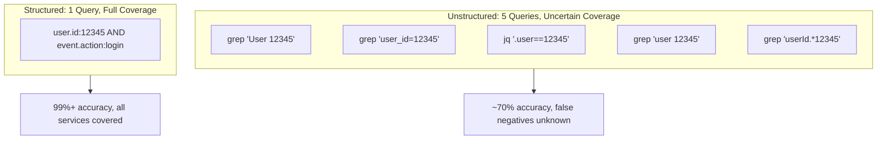
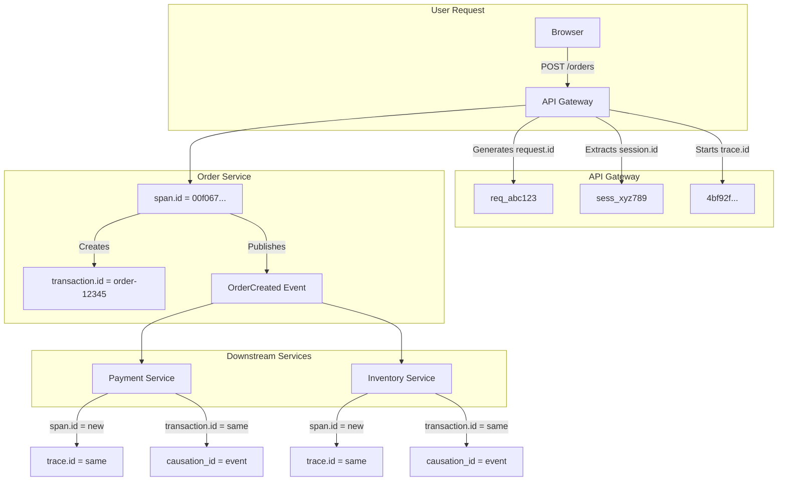
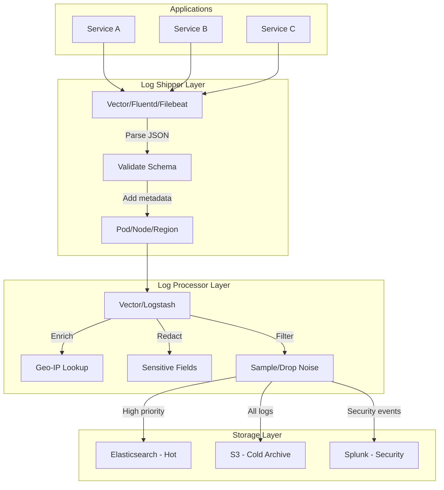

*[APM]: Application Performance Monitoring
*[CEE]: Common Event Expression
*[CLF]: Common Log Format
*[ECS]: Elastic Common Schema
*[ELK]: Elasticsearch, Logstash, Kibana
*[GDPR]: General Data Protection Regulation
*[JSON]: JavaScript Object Notation
*[OTEL]: OpenTelemetry
*[PII]: Personally Identifiable Information
*[RFC]: Request for Comments
*[SIEM]: Security Information and Event Management
*[UUID]: Universally Unique Identifier

At 3 AM, I'm grepping through logs from twelve services trying to trace a single user request. One service logs `user_id=12345`, another logs `{"user":"12345"}`, a third logs `User 12345 logged in`. Same user, three different patterns. I write five regex queries, hit enter, and watch results scroll by—but something's wrong. The inventory service is silent. After twenty minutes, I discover it uses `customer_id` instead of `user_id`. My queries missed it entirely.

That's when I understood: logging JSON isn't the same as having a log _schema_.

## Why Structured Logging Matters

The transition from `printf`-style logging to JSON is just the first step. Without a shared schema, you've replaced one problem (unstructured text) with another (incompatible structures). What matters isn't the format—it's the contract.

### The Inconsistency Tax

Consider what happens when five services each log authentication events their own way:

- **Service A**: `User 12345 logged in from 192.168.1.1`
- **Service B**: `[INFO] Login successful - user_id=12345, ip=192.168.1.1`
- **Service C**: `{"user":"12345","action":"login","source_ip":"192.168.1.1"}`
- **Service D**: `2024-01-15 14:30:00 INFO user 12345 authenticated`
- **Service E**: `{"userId":"12345","event":"AUTH_SUCCESS"}`

Finding all logins for user 12345 now requires five different search patterns. Worse, you _don't know what you're missing_. Did you account for the service that uses `customer` instead of `user`? The one that logs to a different index? The one with the typo in the field name?



_Query complexity comparison. Without a schema, you write multiple queries and still miss services. With a schema, one query covers everything._

### Quantifying the Cost

The difference between ad-hoc logging and schema-based logging shows up in every metric that matters during incidents.

| Metric | Ad-hoc Logging | Schema-based Logging | Impact |
|--------|----------------|----------------------|--------|
| Time to find relevant logs | 15 min | 2 min | 87% reduction |
| Query accuracy | ~70% | 99%+ | 30% fewer false negatives |
| Storage cost | Baseline | 0.7x baseline | 30% reduction |
| Dashboard creation time | Hours | Minutes | 90%+ reduction |
| Cross-service correlation | Manual | Automatic | Hours saved per incident |
| Compliance audit time | Days | Hours | 80% reduction |

_Business impact comparison between ad-hoc and schema-based logging approaches._

The storage savings come from better compression—consistent field names compress dramatically better than arbitrary strings. The query accuracy improvement comes from knowing _exactly_ which field to search. The time savings compound: every query, every dashboard, every alert benefits from the consistency.

<Callout type="info">
JSON is a format, not a schema. Two services can emit valid JSON logs with completely incompatible field names. Structured logging requires both: a machine-readable format _and_ a shared vocabulary.
</Callout>

So how do you design a schema that actually sticks?

## Designing Your Log Schema

Every schema decision you make in month one will constrain your queries for years. Get the fundamentals right before any service ships a log.

### Schema Design Principles

Six rules that prevent the most common schema regrets:

| Principle | Rationale | Good | Bad |
|-----------|-----------|------|-----|
| Namespaced field names | Prevents collisions, enables discovery | `http.request.method`, `user.id` | `method`, `id` (ambiguous) |
| Consistent data types | Enables indexing and aggregation | `user.id`: always string | `user.id`: sometimes string, sometimes int |
| ISO 8601 timestamps | Timezone-aware, sortable, universal | `2024-01-15T14:30:00.123Z` | `01/15/2024 2:30 PM`, epoch ms |
| Flat over nested | Most log platforms query flat fields better | `http.request.headers.content_type` | `http: { request: { headers: {...}}}` |
| Enums for categories | Enables faceted search, prevents typos | `log.level`: `error`, `warn`, `info` | `level`: `ERROR`, `Error`, `err` |
| Units in field names | Prevents calculation errors | `http.response.time_ms` | `response_time` (seconds? ms?) |

_Core schema design principles—violating any of these creates friction that compounds over time._

The flat-over-nested rule surprises people. Dot notation like `http.request.method` _looks_ nested but stores flat in Elasticsearch. Actual nested JSON objects require special nested field mappings, slow down queries, and complicate aggregations. Use dots in field names, not actual object nesting.

### Adopting Elastic Common Schema (ECS)

Don't invent a schema. [Elastic Common Schema (ECS)](https://www.elastic.co/docs/reference/ecs) is the standard worth adopting.

ECS provides namespaced fields for every common logging scenario: HTTP requests (`http.*`), errors (`error.*`), users (`user.*`), services (`service.*`), traces (`trace.*`), and events (`event.*`). The field names are already documented. The data types are already specified. Dashboards and detection rules exist that expect ECS fields.

Here's a Pino[^pino] configuration that emits ECS-compliant logs:

[^pino]: Pino is an extremely fast, low-overhead, and lightweight logger for Node.js applications, designed to minimize performance impact through asynchronous logging. It produces structured JSON logs by default, making it ideal for production environments, observability platforms, and log aggregation tools.

```typescript title="src/logging/ecs-logger.ts"
import pino from 'pino'

const logger = pino({
  formatters: {
    level(label) {
      return { 'log.level': label }
    },
  },
  messageKey: 'message',
  timestamp: () => `,"@timestamp":"${new Date().toISOString()}"`,
  base: {
    'service.name': process.env.SERVICE_NAME,
    'service.version': process.env.SERVICE_VERSION,
    'service.environment': process.env.NODE_ENV,
    'service.node.name': process.env.HOSTNAME || process.env.POD_NAME,
  },
})

export { logger }
```

_ECS-compliant Pino logger configuration. The `formatters.level` function maps Pino's `level` field to ECS's `log.level`._

Usage produces logs that any ECS-aware tool can parse:

```typescript title="src/handlers/orders.ts"
logger.info({
  'http.request.method': 'POST',
  'http.request.path': '/api/orders',
  'http.response.status_code': 201,
  'user.id': 'usr_12345',
  'event.category': ['web'],
  'event.action': 'order_created',
  'event.outcome': 'success',
}, 'Order created successfully')
```

_Logging an HTTP request with ECS field names. Every field follows the ECS namespace convention._

The key ECS namespaces you'll use most often:

| Namespace | Purpose | Common Fields |
|-----------|---------|---------------|
| `service.*` | Service identification | `service.name`, `service.version`, `service.environment` |
| `http.*` | HTTP request/response | `http.request.method`, `http.response.status_code` |
| `error.*` | Error details | `error.type`, `error.message`, `error.stack_trace` |
| `user.*` | User context | `user.id`, `user.name`, `user.roles` |
| `trace.*` | Distributed tracing | `trace.id`, `span.id` |
| `event.*` | Event categorization | `event.action`, `event.outcome`, `event.category` |

_Most frequently used ECS namespaces. The full ECS specification covers hundreds of fields._

### Custom Fields and Extensions

ECS won't cover everything. Order IDs, customer tiers, feature flags—your domain has fields that no standard anticipates. The question isn't whether to add custom fields, but _how_ to add them without creating the inconsistency problems you're trying to solve.

When you need custom fields, follow ECS conventions: use a dedicated namespace, document it in your schema registry, and keep it minimal. Every custom field you add is a field your teammates need to learn.

```typescript title="src/logging/order-logger.ts"
// Extend the base logger with order-specific fields
const orderLogger = logger.child({
  'order.id': order.id,
  'order.status': order.status,            // 'pending' | 'confirmed' | 'shipped'
  'order.total_cents': order.totalCents,   // Units in field name
  'order.item_count': order.items.length,
  'customer.tier': customer.tier,          // 'free' | 'premium' | 'enterprise'
})

orderLogger.info({ 'event.action': 'order_confirmed' }, 'Order confirmed')
```

_Custom namespace `order.*` for domain-specific fields. Note that amounts use cents (avoiding float precision issues) and the field name includes the unit._

<Callout type="warning">
Custom namespaces should be rare. Before adding `order.shipping_method`, check if ECS already has a field that fits. Custom fields increase cognitive load and reduce interoperability with pre-built dashboards and detection rules.
</Callout>

## Correlation ID Implementation

A schema gets you consistent field names. But when a request fails, you need more than consistency—you need to see _every log from every service_ that touched that request. That's where correlation IDs come in.

A single user action—placing an order, uploading a file, logging in—touches multiple services: API gateways, business logic services, payment processors, notification systems, databases. Without correlation IDs, each service's logs are islands. You know _something_ failed, but stitching together the sequence of events across service boundaries requires manual timestamp correlation and guesswork.

Correlation IDs solve this by threading a common identifier through every log entry related to a single logical operation. Query by that ID, and you get the complete story—regardless of how many services participated.

### Correlation ID Types

Not all correlation happens at the same scope. A single user session might span hundreds of requests, each request might fan out to dozens of service calls, and async operations might continue long after the original request completes. Different ID types address different correlation needs:

| ID Type | Scope | Generated By | Lifespan | Use Case |
|---------|-------|--------------|----------|----------|
| `trace.id` | Distributed trace | Edge/first service | Single request tree | Debugging request flow |
| `span.id` | Single operation | Each service | One operation | Identifying service involvement |
| `request.id` | HTTP request | API gateway | Single HTTP request | Correlating gateway with downstream |
| `session.id` | User session | Auth system | Session duration | Tracking user activity across requests |
| `transaction.id` | Business operation | Domain service | Until completion | Tracking sagas and workflows |
| `causation.id` | Event chain | Message producer | One hop | Understanding event triggers |

_Correlation ID types and their scopes. Most logs need `trace.id` and `span.id`; other IDs depend on your debugging patterns._

The interface below shows the full correlation context. In practice, you won't use every field in every log—include what you'll actually query:

```typescript title="src/correlation/types.ts"
// Correlation ID hierarchy
interface CorrelationContext {
  // Request-level: entire user request across all services
  requestId: string       // Generated at edge/API gateway

  // Trace-level: distributed trace context (OpenTelemetry)
  traceId: string         // Propagated via W3C Trace Context
  spanId: string          // Current operation within trace
  parentSpanId?: string   // Parent operation

  // Session-level: user session across multiple requests
  sessionId?: string      // From session cookie or JWT

  // Business transaction: logical operation across requests
  transactionId?: string  // e.g., order fulfillment saga

  // Causation: what triggered this operation
  causationId?: string    // ID of the event/message that caused this
}
```

_The full correlation context. Not every log needs every field—include what you'll actually query._

When all correlation IDs are present, a single log entry becomes a portal to multiple views of the same operation:

```typescript title="src/handlers/payment.ts"
// Example log showing all correlation levels
const logEntry = {
  '@timestamp': '2024-01-15T14:30:00.123Z',
  'message': 'Payment authorized',

  // All correlation IDs present
  'trace.id': '4bf92f3577b34da6a3ce929d0e0e4736',
  'span.id': '00f067aa0ba902b7',
  'transaction.id': 'order-12345',           // Business transaction
  'request.id': 'req_abc123',                // Edge-assigned request ID
  'session.id': 'sess_xyz789',               // User session
  'event.causation_id': 'order_created_evt', // What triggered this
}

// This single log entry enables:
// - trace.id query: all logs for this request across services
// - transaction.id query: entire order fulfillment saga
// - session.id query: everything this user did in their session
// - causation_id query: what event triggered this payment
```

_A log entry with complete correlation context. Each ID answers a different debugging question._

### How Correlation Flows Through Services

When a user places an order, the request flows through multiple services. Each service creates its own span but preserves the trace ID, allowing the entire flow to be reconstructed. Watch for two things in this diagram: trace IDs stay constant (that's how you query across services), while span IDs change at each hop (that's how you identify _which_ service you're looking at):



_Correlation ID flow through a microservices order placement. The trace ID remains constant; span IDs change per service; transaction ID tracks the business operation._

The key insight: `trace.id` stays constant across all services for a single request tree. Query `trace.id:4bf92f*` and you see _every_ log from _every_ service involved in that order placement—API gateway, order service, payment service, inventory service, notification service.

<Callout type="info">
The W3C Trace Context standard defines how to propagate trace and span IDs in HTTP headers via the `traceparent` header. Use it—it's supported by OpenTelemetry, Jaeger, Zipkin, and most APM tools. Don't invent your own trace header format.
</Callout>

### Propagation Mechanisms

Correlation IDs are useless if they don't propagate. Every service-to-service call—HTTP, gRPC, message queue—must carry the correlation context forward.

#### HTTP Header Propagation

For synchronous HTTP calls, correlation IDs travel in headers. The W3C Trace Context standard defines `traceparent` for trace/span IDs; use custom `x-*` headers for application-specific IDs:

```typescript title="src/correlation/headers.ts"
// HTTP header propagation
const correlationHeaders = {
  // W3C Trace Context (standard)
  traceparent: '00-4bf92f3577b34da6a3ce929d0e0e4736-00f067aa0ba902b7-01',
  tracestate: 'vendor=value',

  // Custom headers for non-trace IDs
  'x-request-id': 'req_abc123',
  'x-session-id': 'sess_xyz789',
  'x-transaction-id': 'order-12345',
  'x-causation-id': 'order_created_evt',
}
```

_Standard and custom correlation headers. The `traceparent` format is: version-traceId-spanId-flags._

The challenge: correlation context must be available to any code that logs or makes outbound calls, without explicitly passing it through every function. Node.js's `AsyncLocalStorage` solves this by maintaining context across async boundaries:

```typescript title="src/correlation/middleware.ts"
// Express middleware for extraction and injection
import { AsyncLocalStorage } from 'async_hooks'

interface RequestContext {
  traceId: string
  spanId: string
  requestId: string
  sessionId?: string
  transactionId?: string
}

const contextStorage = new AsyncLocalStorage<RequestContext>()

function correlationMiddleware(req: Request, res: Response, next: NextFunction) {
  // Extract or generate IDs
  const traceHeader = req.headers['traceparent'] as string
  const { traceId, spanId } = parseTraceParent(traceHeader) || {
    traceId: generateTraceId(),
    spanId: generateSpanId()
  }

  const context: RequestContext = {
    traceId,
    spanId,
    requestId: req.headers['x-request-id'] as string || generateRequestId(),
    sessionId: req.headers['x-session-id'] as string,
    transactionId: req.headers['x-transaction-id'] as string,
  }

  // Set response headers for debugging
  res.setHeader('x-trace-id', traceId)
  res.setHeader('x-request-id', context.requestId)

  // Run request with context
  contextStorage.run(context, () => next())
}

// Get current context from anywhere
function getCorrelationContext(): RequestContext | undefined {
  return contextStorage.getStore()
}
```

_AsyncLocalStorage maintains request context across async operations without explicit parameter passing._

The middleware above handles _extraction_—pulling correlation IDs from incoming requests. But that's only half the story. You also need _injection_—adding correlation IDs to outbound requests. Here's a fetch wrapper that does that automatically:

```typescript title="src/correlation/client.ts"
// HTTP client that propagates context
async function fetchWithCorrelation(url: string, options: RequestInit = {}) {
  const context = getCorrelationContext()

  const headers = new Headers(options.headers)

  if (context) {
    // Generate new span ID for outbound call (same trace, new span)
    headers.set('traceparent', formatTraceParent(context.traceId, generateSpanId()))
    headers.set('x-request-id', context.requestId)
    if (context.sessionId) headers.set('x-session-id', context.sessionId)
    if (context.transactionId) headers.set('x-transaction-id', context.transactionId)
  }

  return fetch(url, { ...options, headers })
}
```

_Outbound HTTP client with automatic correlation. Note: span ID changes for each outbound call while trace ID stays constant._

<Callout type="warning">
Every HTTP client in your codebase must propagate correlation headers. A single direct `fetch()` call breaks the trace chain. Wrap your HTTP clients or use instrumentation libraries like OpenTelemetry's auto-instrumentation to ensure consistency.
</Callout>

#### Message Queue Correlation

Async messaging requires correlation context embedded in the message envelope itself, since HTTP headers don't exist. Messages also track _causation_—which previous message or request triggered them:

```typescript title="src/correlation/messaging.ts"
// Message envelope carries correlation through queues
interface MessageEnvelope<T> {
  messageId: string
  timestamp: string
  type: string
  correlation: {
    traceId: string
    causationId: string       // What triggered this message
    originRequestId?: string  // Original HTTP request that started the chain
  }
  payload: T
}

// Producer: wrap payload with correlation from current context
async function publishEvent<T>(type: string, payload: T): Promise<void> {
  const ctx = getCorrelationContext()
  const envelope: MessageEnvelope<T> = {
    messageId: generateMessageId(),
    timestamp: new Date().toISOString(),
    type,
    correlation: {
      traceId: ctx?.traceId || generateTraceId(),
      causationId: ctx?.causationId || 'http_request',
      originRequestId: ctx?.requestId,
    },
    payload,
  }
  await messageQueue.publish(type, envelope)
}

// Consumer: restore correlation before processing
async function handleMessage<T>(envelope: MessageEnvelope<T>): Promise<void> {
  const context: RequestContext = {
    traceId: envelope.correlation.traceId,
    spanId: generateSpanId(),
    causationId: envelope.messageId,  // This message is now the cause of downstream work
  }

  await contextStorage.run(context, () => processMessage(envelope.payload))
}
```

_Message correlation pattern. The `causationId` creates an audit trail: each message knows what triggered it, enabling end-to-end tracing through async workflows._

### Correlation Anti-Patterns

I've seen all of these break correlation in production. Each one creates gaps in your trace data that make debugging harder:

| Anti-Pattern | Why It Breaks | Solution |
|--------------|--------------|----------|
| Generating new trace IDs per service | Logs can't be joined across services | Extract incoming `traceparent`; generate only if missing |
| Logging outside AsyncLocalStorage | Logs lack correlation context | Run all request handlers within `contextStorage.run()` |
| Direct HTTP client usage | Outbound calls don't propagate headers | Use `fetchWithCorrelation()` or OpenTelemetry auto-instrumentation |
| Fire-and-forget async | Background work loses context | Capture context before spawning; restore in async handler |
| Batched message processing | All messages share one correlation | Process each message in its own `contextStorage.run()` scope |

_Correlation anti-patterns with specific solutions. The "Solution" column tells you exactly what to fix._

<Callout type="success">
Test correlation by making a request, collecting logs from all services, and verifying they share the same `trace.id`. If any service's logs are missing from the trace, you have a propagation gap. Automated tests should verify this on every deployment.
</Callout>

## Logger Implementation Patterns

Schema compliance requires enforcement, not just documentation. Developers under deadline pressure will log whatever's convenient—`console.log('user:', user)` is faster than constructing an ECS-compliant object. The solution is making the right thing the easy thing: build loggers that enforce schema compliance by default, so developers get it right without extra effort.

### Type-Safe Logger Factory

TypeScript's type system can catch schema violations at compile time. By defining interfaces for log field groups and requiring them in method signatures, you shift validation from runtime (where it's often skipped) to build time (where it can't be ignored). Here's the foundation—interfaces that map to ECS field groups:

```typescript title="src/logging/structured-logger.ts"
// Type definitions enforce ECS compliance at compile time
interface HttpLogFields {
  'http.request.method': string
  'http.request.path': string
  'http.response.status_code': number
  'http.response.time_ms': number
}

class StructuredLogger {
  private baseFields: Record<string, unknown>

  constructor(config: { serviceName: string; serviceVersion: string }) {
    this.baseFields = {
      'service.name': config.serviceName,
      'service.version': config.serviceVersion,
    }
  }

  private log(level: string, message: string, fields: Record<string, unknown>) {
    const context = getCorrelationContext()
    const entry = {
      '@timestamp': new Date().toISOString(),
      'log.level': level,
      message,
      ...this.baseFields,
      ...(context && { 'trace.id': context.traceId, 'span.id': context.spanId }),
      ...fields,
    }
    console.log(JSON.stringify(entry))
  }

  info(message: string, fields?: Record<string, unknown>) {
    this.log('info', message, fields || {})
  }

  error(message: string, error: Error, fields?: Record<string, unknown>) {
    this.log('error', message, {
      'error.type': error.name,
      'error.message': error.message,
      'error.stack_trace': error.stack,
      ...fields,
    })
  }

  // Typed method: missing http.response.status_code = compile error
  httpRequest(message: string, fields: HttpLogFields & Record<string, unknown>) {
    this.log('info', message, { 'event.category': ['web'], ...fields })
  }

  // Child logger inherits base fields + adds new ones
  child(fields: Record<string, unknown>): StructuredLogger {
    const child = Object.create(this)
    child.baseFields = { ...this.baseFields, ...fields }
    return child
  }
}
```

_StructuredLogger with type-safe methods. The `httpRequest()` method requires specific fields; the `child()` method creates loggers with bound context._

The `child()` pattern is powerful for domain contexts—create a child logger when entering an operation, and all logs inherit the bound fields:

```typescript title="src/handlers/orders.ts"
// Usage
const logger = new StructuredLogger({
  serviceName: 'order-service',
  serviceVersion: '1.2.3',
})

const orderLogger = logger.child({ 'order.id': 'ord_12345' })

orderLogger.httpRequest('Order created', {
  'http.request.method': 'POST',
  'http.request.path': '/api/orders',
  'http.response.status_code': 201,
  'http.response.time_ms': 45,
  'event.action': 'order_created',
})
```

_Child logger usage. Every log from `orderLogger` includes `order.id` without repeating it._

### Request-Scoped Logging

The child logger pattern works well for domain contexts, but every HTTP handler has the same boilerplate: extract correlation context, add request metadata, bind user info. Instead of repeating that everywhere, create a request-scoped logger in middleware that handlers can use directly:

```typescript title="src/middleware/logging.ts"
// Middleware creates a pre-configured logger for each request
function loggingMiddleware(req: Request, res: Response, next: NextFunction) {
  const context = getCorrelationContext()
  const startTime = Date.now()

  // Create logger with all request context pre-bound
  req.log = logger.child({
    'http.request.method': req.method,
    'http.request.path': req.path,
    'trace.id': context?.traceId,
    'span.id': context?.spanId,
    ...(req.user && { 'user.id': req.user.id }),
  })

  req.log.info('Request started', { 'event.action': 'http_request_started' })

  res.on('finish', () => {
    req.log.httpRequest('Request completed', {
      'http.request.method': req.method,
      'http.request.path': req.path,
      'http.response.status_code': res.statusCode,
      'http.response.time_ms': Date.now() - startTime,
      'event.outcome': res.statusCode < 400 ? 'success' : 'failure',
    })
  })

  next()
}
```

_Logging middleware that pre-binds request context. Handlers use `req.log` and get trace IDs, user IDs, and HTTP context automatically._

Now handlers just call `req.log.info()` without worrying about context:

```typescript title="src/handlers/orders.ts"
app.post('/api/orders', async (req, res) => {
  req.log.info('Processing order', { 'order.item_count': req.body.items.length })

  const order = await createOrder(req.body)
  req.log.info('Order created', { 'order.id': order.id, 'event.action': 'order_created' })

  res.status(201).json(order)
})
```

_Handler using the pre-configured request logger. Every log includes trace ID, request ID, and user context without explicit fields._

<Callout type="info">
This pattern works with Express, Fastify, Koa, and Hapi. The key is attaching the logger early and capturing response details in a completion callback.
</Callout>

## Sensitive Data Handling

You've standardized your schema and implemented correlation IDs. Now every service emits queryable, traceable logs. But there's a catch: structured logging makes data leaks _easier_.

When everything was unstructured text, finding sensitive data required reading logs manually. Now a single query like `user.email:*` returns every log containing email addresses. That's powerful for debugging—and catastrophic if logs are compromised.

The goal isn't eliminating sensitive data from logs entirely. Sometimes you need an email address to debug a user-specific issue. The goal is _deliberate_ handling: know what's being logged, who can access it, how long it's retained, and whether it can be recovered if needed.

### Redaction Strategies

Different data requires different treatment. Passwords should never appear—not even hashed. Email addresses might be partially masked for debugging while protecting the full value. Some fields need to be recoverable by security teams investigating fraud.

The redactor walks through log objects applying appropriate strategies based on field names. Pattern matching catches common sensitive fields; specific masking rules handle emails, phones, and card numbers:

```typescript title="src/logging/redactor.ts"
class LogRedactor {
  private sensitivePatterns = /password|secret|key|token|auth|credential/i

  redact(obj: Record<string, unknown>): Record<string, unknown> {
    const result: Record<string, unknown> = {}

    for (const [key, value] of Object.entries(obj)) {
      if (this.sensitivePatterns.test(key)) {
        result[key] = '[REDACTED]'
      } else if (typeof value === 'object' && value !== null) {
        result[key] = this.redact(value as Record<string, unknown>)
      } else if (typeof value === 'string') {
        result[key] = this.maskValue(key, value)
      } else {
        result[key] = value
      }
    }
    return result
  }

  private maskValue(key: string, value: string): string {
    if (key.includes('email')) {
      const [local, domain] = value.split('@')
      return `${local[0]}***@${domain}`
    }
    if (key.includes('phone') || key.includes('card')) {
      return value.replace(/\d(?=\d{4})/g, '*')
    }
    return value
  }
}
```

_Redaction implementation. Integrate this into your logger's output path. Fields matching `sensitivePatterns` are fully removed; emails, phones, and cards are partially masked._

### Field-Level Encryption

Some fields need to be recoverable—customer addresses for fraud investigations, transaction details for dispute resolution. For these, use AES-256-GCM encryption with key IDs that enable rotation:

```typescript title="src/logging/encryption.ts"
class FieldEncryptor {
  constructor(private key: Buffer, private keyId: string) {}

  encrypt(value: string): EncryptedField {
    const iv = randomBytes(16)
    const cipher = createCipheriv('aes-256-gcm', this.key, iv)
    const encrypted = cipher.update(value, 'utf8', 'base64') + cipher.final('base64')

    return {
      _encrypted: true,
      keyId: this.keyId,
      iv: iv.toString('base64'),
      authTag: cipher.getAuthTag().toString('base64'),
      ciphertext: encrypted,
    }
  }
}

// Usage: combine masking and encryption
logger.info('Customer registered', {
  'user.id': userId,
  'customer.email': redactor.maskEmail(email),       // Masked: debuggable
  'customer.address': encryptor.encrypt(address),    // Encrypted: recoverable
})
```

_AES-256-GCM encryption with key ID tracking. The email is masked (debuggable), the address is encrypted (recoverable by security team with the decryption key)._

<Callout type="danger">
Passwords, API keys, tokens, and secrets should never appear in logs—not even hashed or encrypted. There's no legitimate debugging need for them. If they're appearing in logs, the logging location is wrong.
</Callout>

## Collector-Side Processing

Application-level redaction catches most sensitive data, but defense in depth requires collector-side processing too. Log pipelines can catch data that slips through application controls, enrich logs with infrastructure context, and route logs to appropriate destinations based on content.

### Log Pipeline Architecture

Modern log architectures have three tiers: shippers that collect logs from applications, processors that transform and route them, and storage that serves different query patterns.



_Log pipeline architecture. Each layer adds value: shippers collect and parse, processors transform and route, storage serves different access patterns._

### Noise Reduction Strategies

Not all logs deserve storage. Health checks fire every few seconds and rarely matter. Debug logs in production are noise by definition. Cache hits happen thousands of times per minute but add little debugging value. The goal is dropping low-value logs while keeping everything that might matter during an incident.

This framework helps decide how to handle different log patterns. The "Connection events" row uses aggregation—the same technique shown in the code example that follows:

| Pattern | Action | Rationale |
|---------|--------|-----------|
| Health checks (`/health`, `/ready`) | Drop | High volume, rarely useful for debugging |
| Metrics endpoint requests | Drop | Already captured in metrics, redundant |
| Debug logs in production | Drop | Should never reach production storage |
| Cache hits | Sample (1%) | Keep trend visibility, reduce volume |
| Connection events | Aggregate | Count per minute, not individual events |
| All errors | Keep | Every error is valuable for debugging |
| Authentication events | Keep | Security-relevant, audit requirements |

_Noise classification framework. The goal is 10x volume reduction without losing debugging capability._

For high-volume events that still have value, aggregation preserves information while dramatically reducing storage. Instead of 1,000 individual connection logs per minute, emit one aggregated log:

```typescript title="src/logging/aggregation.ts"
// Aggregation: count instead of individual logs
interface AggregatedLog {
  '@timestamp': string
  'log.level': 'info'
  'message': string
  'event.action': string
  'aggregation.count': number
  'aggregation.window_seconds': number
}

// Instead of 1000 "connection_opened" logs per minute:
const aggregatedConnectionLog: AggregatedLog = {
  '@timestamp': '2024-01-15T14:31:00Z',
  'log.level': 'info',
  'message': 'Database connections aggregated',
  'event.action': 'db_connection_aggregated',
  'aggregation.count': 1247,
  'aggregation.window_seconds': 60,
}
```

_Aggregated log entry. One log per minute instead of thousands, with count preserved for monitoring._

<Callout type="warning">
Be cautious with sampling and dropping. Start conservative—drop only the logs you're _certain_ have no debugging value. You can always drop more later, but you can't recover logs you never stored.
</Callout>

## Schema Governance and Evolution

A schema is only useful if everyone follows it. Without governance, you'll have teams inventing their own field names, breaking consumers, and defeating the purpose of standardization. But governance can't be so heavy that teams can't add the fields they need.

### Schema Registry Options

You need a central source of truth for field definitions—what fields exist, their types, who owns them, and whether they're deprecated. Unfortunately, there's no dominant open source "log schema registry" the way there's a Confluent Schema Registry for Kafka. Your options:

**Use your log platform's native schema management.** Elasticsearch has index templates and component templates that define field mappings. DataDog has facets. Splunk has field extractions. These work well if you're single-platform, but they're vendor-specific and don't help at log-emit time.

**JSON Schema in your repo.** Define your schema as JSON Schema files, validate in CI (we'll cover this in the Testing section), and generate documentation from the schema. This is lightweight and works across platforms.

**Build a lightweight registry service.** For larger organizations, a simple service that stores field definitions with ownership and versioning metadata. This doesn't need to be complex—a YAML file in a shared repo with a PR review process often suffices.

The key insight: the _format_ of your registry matters less than _having one at all_ and _enforcing it in CI_. A YAML file that every service validates against beats a sophisticated registry that nobody uses.

<Callout type="info">
If you're using ECS, you already have a schema—the [ECS field reference](https://www.elastic.co/guide/en/ecs/current/ecs-field-reference.html) _is_ your registry for standard fields. You only need to document custom fields you've added.
</Callout>

### Schema Evolution Process

Schemas change—new features need new fields, old patterns get replaced. The key is managing change without breaking consumers. Here's the evolution process that's worked for me:

| Phase | Duration | Action |
|-------|----------|--------|
| Proposal | 1 week | RFC for new field, review by platform team |
| Addition | Immediate | Add field as optional, update registry |
| Adoption | 2-4 weeks | Teams start using new field |
| Promotion | After adoption | Consider making field required if universal |
| Deprecation Notice | 1 month | Mark field deprecated, log warnings |
| Migration Period | 3 months | Teams migrate to replacement field |
| Removal | After migration | Remove field from registry, update parsers |

_Schema evolution timeline. The long migration period prevents surprise breakages._

<Callout type="success">
New fields must be optional. Parsers must ignore unknown fields. Type changes require a new field name. These rules keep old logs queryable and prevent producer/consumer version coupling.
</Callout>

## Testing and Validating Your Logging

Everything we've covered—schemas, correlation, redaction—needs automated verification. Manual code review doesn't catch the developer who logs `userId` instead of `user.id`. CI tests do.

You need two things: tests that fail when logs violate the schema, and production monitoring that catches correlation gaps.

### Schema Validation in CI

Use JSON Schema and Ajv to validate log output in unit tests. The pattern: capture log output, parse it, validate against your schema:

```typescript title="src/logging/__tests__/schema.spec.ts"
import { describe, it, expect, beforeEach, vi } from 'vitest'
import Ajv from 'ajv'
import addFormats from 'ajv-formats'

const ecsLogSchema = {
  type: 'object',
  required: ['@timestamp', 'log.level', 'message', 'service.name'],
  properties: { '@timestamp': { type: 'string', format: 'date-time' } },
  additionalProperties: true,
}

describe('Structured Logger Schema Compliance', () => {
  let logOutput: string[] = []
  const validate = new Ajv({ allErrors: true }).addFormats(addFormats).compile(ecsLogSchema)

  beforeEach(() => {
    logOutput = []
    vi.spyOn(console, 'log').mockImplementation((msg: string) => logOutput.push(msg))
  })

  it('emits valid ECS-compliant logs', () => {
    logger.info('Test message', { 'user.id': 'usr_123' })
    const entry = JSON.parse(logOutput[0])

    expect(validate(entry)).toBe(true)
    expect(entry['@timestamp']).toMatch(/^\d{4}-\d{2}-\d{2}T/)
  })

  it('includes trace context when available', () => {
    logger.info('With trace', {
      'trace.id': '4bf92f3577b34da6a3ce929d0e0e4736',
      'span.id': '00f067aa0ba902b7',
    })
    const entry = JSON.parse(logOutput[0])

    expect(entry['trace.id']).toMatch(/^[a-f0-9]{32}$/)
    expect(entry['span.id']).toMatch(/^[a-f0-9]{16}$/)
  })
})
```

_Schema compliance tests using Ajv. These catch type mismatches and missing required fields before deployment._

### Correlation ID Propagation Tests

Correlation is only useful if it propagates correctly. Test that trace IDs survive HTTP boundaries—both inbound extraction and outbound propagation:

```typescript title="src/correlation/__tests__/propagation.spec.ts"
describe('Correlation ID Propagation', () => {
  it('extracts trace context from W3C traceparent header', async () => {
    const req = createMockRequest({
      headers: { traceparent: '00-4bf92f3577b34da6a3ce929d0e0e4736-00f067aa0ba902b7-01' },
    })

    await new Promise<void>(resolve => {
      correlationMiddleware(req, createMockResponse(), () => {
        expect(getCorrelationContext()?.traceId).toBe('4bf92f3577b34da6a3ce929d0e0e4736')
        resolve()
      })
    })
  })

  it('generates IDs when headers are missing', async () => {
    const req = createMockRequest({ headers: {} })

    await new Promise<void>(resolve => {
      correlationMiddleware(req, createMockResponse(), () => {
        expect(getCorrelationContext()?.traceId).toMatch(/^[a-f0-9]{32}$/)
        resolve()
      })
    })
  })

  it('propagates context to outbound requests', async () => {
    const mockFetch = vi.fn().mockResolvedValue(new Response('{}'))
    const testContext = { traceId: '4bf92f3577b34da6a', spanId: '00f067aa', requestId: 'req_123' }

    await contextStorage.run(testContext, () =>
      fetchWithCorrelation('https://api.example.com', {}, mockFetch)
    )

    expect(mockFetch.mock.calls[0][1].headers.get('traceparent')).toContain(testContext.traceId)
  })
})
```

_Integration tests for correlation ID extraction and propagation. These verify that IDs survive HTTP boundaries._

### Log Quality Metrics

In production, monitor log quality the same way you monitor application health. Three Prometheus counters give you visibility into schema compliance and correlation coverage:

- `log_schema_validation_total{result, service}` — counts valid vs invalid log entries
- `log_schema_violations_total{field, violation_type, service}` — tracks which fields fail and why
- `log_missing_correlation_total{service, log_location}` — flags logs without trace IDs

Hook these counters into your logger's output path to track every log entry. Alert when violation rates spike or correlation coverage drops below your target (e.g., 99% of logs should have trace IDs).

<Callout type="info">
Set a correlation coverage target (e.g., 99% of logs must have trace IDs) and alert when it drops. Missing correlation IDs usually indicate logging from outside the request context—background jobs, startup code, or improperly instrumented libraries.
</Callout>

## Conclusion

Structured logging at scale requires discipline across three dimensions: schema consistency, correlation propagation, and noise management.

Adopt ECS rather than inventing a schema—it handles most use cases and enables cross-organization tooling compatibility. Implement correlation IDs at every boundary: HTTP headers for synchronous calls, message envelopes for async, and AsyncLocalStorage for automatic propagation within services. Redact sensitive data at the source, not the sink—assume logs will be accessed by anyone with read permissions.

Use collector-side processing to filter noise before storage: drop health checks and debug logs, sample high-volume events, aggregate repetitive patterns. Establish schema governance early; field naming decisions made in month one will constrain querying for years.

The next time it's 3 AM and you're chasing a bug across twelve services, you'll type one query instead of five—and you won't miss the inventory service.
