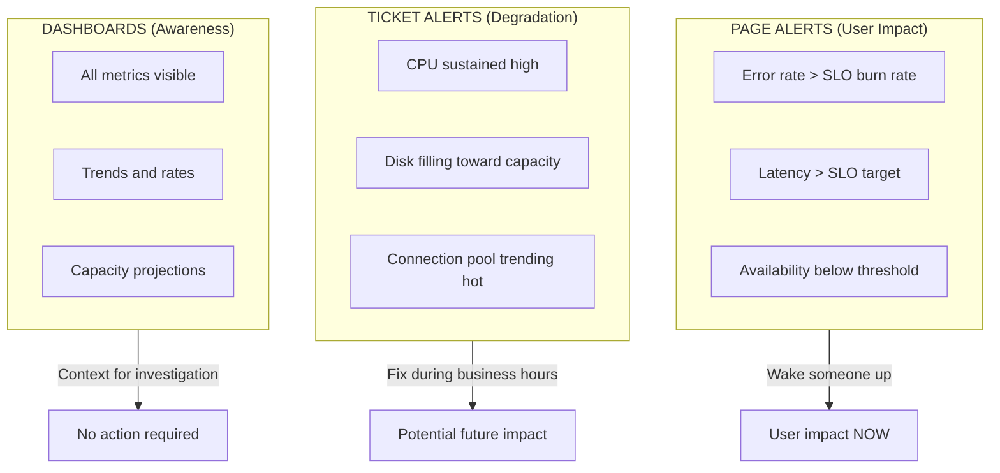

Your on-call engineer gets paged at 2 AM for high CPU on a batch processing node. They investigate for 20 minutes, find nothing wrong, and go back to sleep. An hour later, another page: disk space on a log aggregator. Another false alarm. By the time the third alert fires—this one signaling elevated API error rates—they've learned to assume it's another false positive. They check Slack, see nothing, and go back to sleep.

In the morning, they discover the payment service was down for 45 minutes. Customers couldn't complete purchases. The alert was real; the engineer had just been trained to ignore it.

This is alert fatigue in action. When everything alerts, nothing alerts. The fix isn't better discipline—it's better alert design.

## The Symptom vs Cause Distinction

The most common alerting mistake is alerting on _causes_ rather than _symptoms_. High CPU, low disk space, elevated connection counts—these are causes. They _might_ affect users, or they might not. Request latency, error rates, failed transactions—these are symptoms. They tell you users are _actually_ experiencing problems right now.

Consider three classic cause-based alerts and their symptom-based alternatives:

_High CPU usage_ fires when `cpu_usage > 90%`. But CPU can spike during legitimate load, garbage collection, or batch jobs without any user impact. The symptom-based alternative—elevated request latency—only fires when users are actually affected. Many different causes lead to latency; one symptom alert catches them all.

_Low disk space_ fires when `disk_free < 10%`. But this triggers on expected growth, archival systems, and cold storage that's supposed to be full. The symptom-based alternative—write failures increasing—only fires when disk space is causing actual failures. Keep disk space as a ticket for business hours, not a 2 AM page.

_Database connections high_ fires when connections exceed 80% of max. But connection pools often run hot without issues. The symptom-based alternative—query timeouts—only fires when connection exhaustion impacts queries. Connection monitoring becomes a dashboard metric, not an alert.

The pattern is consistent: causes are _potential_ problems; symptoms are _actual_ problems. This leads to a simple rule: page on symptoms, ticket on causes.

This creates a natural hierarchy for categorizing alerts:



Figure: The alerting pyramid. Symptoms that affect users go at the top and warrant pages. Causes that might affect users go in the middle and warrant tickets. Everything else lives on dashboards for awareness.

## SLO-Based Burn Rate Alerting

Symptom-based alerting answers _what_ to alert on. Burn rates answer _when_.

The problem with raw thresholds is they lack context. A 1% error rate sounds scary, but is it? If your SLO allows 0.1% errors over a month, that 1% rate means you're burning through your error budget 10x faster than sustainable. You have about 3 days before you exhaust your monthly budget. Urgent, but not a 2 AM emergency.

Burn rate measures how fast you're consuming your error budget relative to a sustainable pace. A _1x burn rate_ means you'll exactly exhaust your budget by month's end—sustainable but leaves no margin. A _14.4x burn rate_ means you'll exhaust your entire monthly budget in just 2 hours. That's an emergency.

The math: if your monthly budget is 0.1% errors and you're currently seeing 1.44% errors (14.4 × 0.1%), you're burning 14.4x faster than sustainable. At that rate, your 30-day budget disappears in 30 days ÷ 14.4 ≈ 2 hours.

| Burn Rate | Budget Exhaustion | Appropriate Response |
|-----------|-------------------|----------------------|
| 14.4x | 2 hours | Page immediately |
| 6x | 5 hours | Page during waking hours |
| 3x | 10 days | Create ticket |
| 1x | 30 days | Dashboard metric only |

Table: Burn rate to response mapping. The exhaustion timeline determines urgency, not the raw error rate.

Here's what a 14.4x burn rate alert looks like in Prometheus:

```yaml title="prometheus/rules/slo-alerts.yml"
groups:
  - name: slo-burn-rate-alerts
    rules:
      - alert: APIAvailabilityFastBurn
        expr: |
          (
            sum(rate(http_requests_total{status=~"5.."}[5m]))
            / sum(rate(http_requests_total[5m]))
          ) > (14.4 * 0.001)
        for: 2m
        labels:
          severity: critical
        annotations:
          summary: "API error rate burning SLO budget rapidly"
          runbook_url: "https://runbooks.example.com/api-availability"
```

Code: Prometheus alert for a 14.4x burn rate against a 99.9% availability SLO. At this rate, your monthly error budget exhausts in 2 hours.

One refinement makes burn rate alerts even more reliable: multi-window alerting. Single-window alerts have a problem—short windows catch spikes but also false-positive on brief blips; long windows miss fast-moving incidents. The solution is requiring _both_ a short and long window to breach before alerting.

For example, a 14.4x burn rate alert might require both conditions to be true: the 5-minute error rate exceeds the threshold _and_ the 1-hour error rate exceeds the threshold. If a 30-second traffic spike pushes errors to 2% but the hourly rate is still 0.05%, the alert doesn't fire—the spike isn't sustained. Conversely, if an incident resolved 20 minutes ago, the 1-hour window might still show elevated errors, but the 5-minute window is clean—no alert, because the problem is already over.

## Sustaining Alert Quality

The symptom vs cause distinction and burn rate math are the technical foundation, but sustainable alerting requires organizational practices too.

_Every alert needs a runbook._ If you can't write down how to diagnose and remediate an alert, you don't understand it well enough to wake someone up for it. The runbook doesn't need to be exhaustive—a summary of user impact, links to relevant dashboards, common causes ranked by likelihood, and escalation criteria are enough. The point is that a 2 AM responder shouldn't have to reverse-engineer what the alert means.

_Track your actionable rate._ If fewer than 80% of your alerts require human intervention to resolve, you have a noise problem. An alert that auto-recovers, requires no action, or fires for non-issues is training your team to ignore the pager. Track this metric weekly and treat declining actionable rates as a priority issue.

_Review alerts monthly._ Alerts decay. Thresholds that made sense six months ago may be too sensitive or too lax today. Services get renamed. Runbooks reference deprecated tools. Schedule a monthly review where you walk through every alert that fired, ask whether it was actionable, and decide whether to keep, modify, or delete it. Retire any alert that hasn't fired in 6 months or has less than 50% actionable rate.

<Callout type="info">
The goal isn't zero alerts—it's ensuring every alert that fires represents a real problem that requires human intervention, and the human receiving it has everything they need to resolve it quickly. Start by auditing your current alerts: calculate your actionable rate over the past month. If it's below 80%, you have work to do.
</Callout>

Alert fatigue isn't a discipline problem you can train your way out of. It's a design problem you can engineer your way out of. Page on symptoms, ticket on causes, and let burn rates determine urgency.

---

This article covers the essentials of symptom-based alerting and SLO burn rates, but there's much more to building a sustainable alerting practice. The complete guide includes detailed runbook templates with diagnosis and remediation steps, Alertmanager routing configurations for severity and team-based routing, escalation policy design, dynamic threshold tuning strategies using standard deviation and week-over-week comparisons, and a complete framework for monthly alert hygiene reviews. Download the full guide to get the implementation details and ready-to-use configurations.
