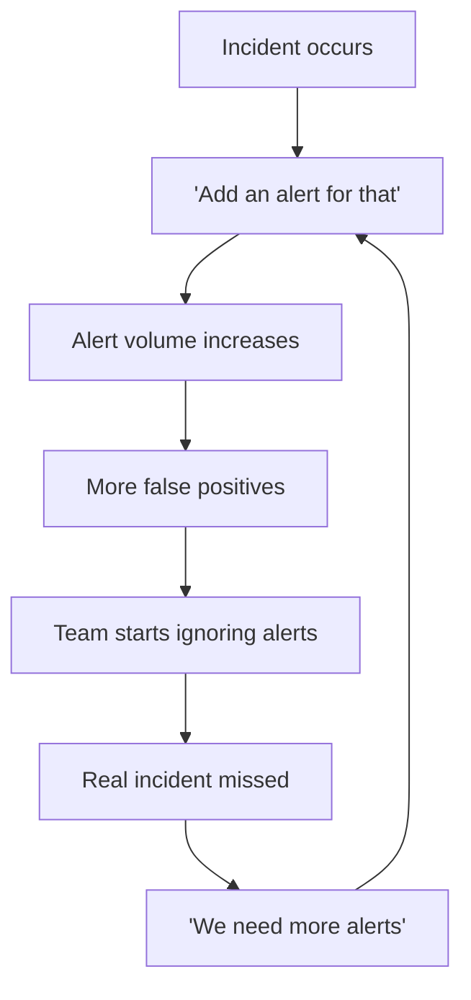
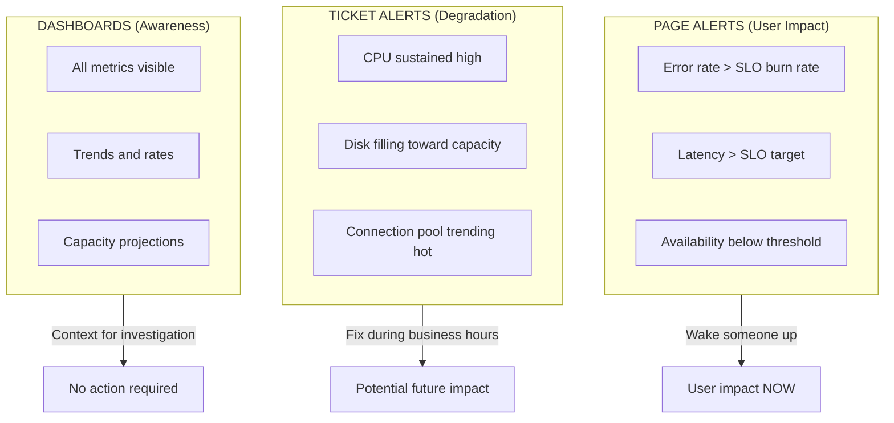

*[MTTA]: Mean Time to Acknowledge
*[MTTD]: Mean Time to Detect
*[MTTR]: Mean Time to Resolve
*[NOC]: Network Operations Center
*[P1]: Priority 1 (Critical)
*[P2]: Priority 2 (High)
*[P3]: Priority 3 (Medium)
*[SLA]: Service Level Agreement
*[SLI]: Service Level Indicator
*[SLO]: Service Level Objective
*[SNR]: Signal to Noise Ratio

Your on-call engineer gets paged at 2 AM for high CPU on a batch processing node. They investigate for 20 minutes, find nothing wrong, and go back to sleep. An hour later, another page: disk space on a log aggregator. Another false alarm. By the time the third alert fires—this one signaling elevated API error rates—they've learned to assume it's another false positive. They check Slack to see if anyone else is handling it, see nothing, and go back to sleep. In the morning, they discover the payment service was down for 45 minutes. Customers couldn't complete purchases. The alert was real; the engineer had just been trained to ignore it.

This is alert fatigue in action. When everything alerts, nothing alerts. Teams learn to ignore pagers that cry wolf, and real incidents hide in the noise.

## The Alert Fatigue Problem

I've seen the same pattern at every company with a mature monitoring stack: start with a few carefully designed alerts, watch them multiply through incident post-mortems ("we should add an alert for that"), and end up with hundreds of alerts that nobody trusts. The progression is predictable.

At first, you have two or three alerts per day, and 90% require real action. Engineers investigate every one thoroughly. Then alert creep sets in — seven or eight alerts per day, 50% actionable. Response time increases as people start triaging instead of investigating. By the time you hit 30+ alerts per day with only 20% requiring action, teams batch-acknowledge and selectively respond. Real incidents get missed in the noise. Eventually, engineers mute channels and ignore pages entirely. The alerting system is effectively abandoned.



Figure: The alert fatigue cycle. Post-mortems that add alerts without removing noisy ones accelerate the spiral.

Breaking this cycle requires three changes. First, alert on _symptoms_ that affect users rather than _causes_ that might affect them—this dramatically reduces false positives. Second, require runbooks for every alert so responders can act quickly and confidently. Third, conduct regular alert hygiene reviews to prune noise and retire alerts that no longer earn their keep. These aren't optional practices for mature teams; they're prerequisites for an alerting system that actually works.

### Measuring Alert Quality

You can't fix what you don't measure. Before optimizing your alerts, establish baseline metrics that reveal whether your alerting helps or hurts.

| Metric | Definition | Healthy Target | Warning Sign |
|--------|------------|----------------|--------------|
| Alert volume | Alerts per on-call shift | < 5 pages/day | > 10 pages/day |
| Actionable rate | % alerts requiring human action | > 80% | < 50% |
| False positive rate | % alerts with no real impact | < 10% | > 30% |
| MTTA | Time to acknowledge | < 5 min | > 15 min |
| MTTR | Time from alert to resolution | < 30 min | > 2 hours |
| Duplicate rate | % alerts for same incident | < 10% | > 25% |
| Snooze rate | % alerts snoozed without action | < 5% | > 20% |

Table: Alert quality metrics. If your on-call receives more than five pages per day on average, you have an alerting problem—not a reliability problem.

The actionable rate is the most important metric. If fewer than 80% of your alerts require human intervention to resolve, you're training your team to ignore the pager. Track this weekly and treat declining actionable rates as a P2 issue.

<Callout type="warning">
Each additional noisy alert reduces the attention given to _all_ alerts. Fix your noisy alerts before adding new ones—the marginal value of a new alert is negative if it contributes to fatigue.
</Callout>

## Symptom vs Cause Alerting

The most common alerting mistake is alerting on _causes_ rather than _symptoms_. High CPU, low disk space, elevated connection counts—these are causes. They _might_ affect users, or they might not. Request latency, error rates, failed transactions—these are symptoms. They tell you users are _actually_ experiencing problems right now.

### The Symptom-Based Philosophy

Consider three classic cause-based alerts and their symptom-based alternatives:

**High CPU usage** fires when `cpu_usage > 90%`. But CPU can spike during legitimate load, garbage collection, or batch jobs without any user impact. The symptom-based alternative—_elevated request latency_—only fires when users are actually affected. Many different causes lead to latency; one symptom alert catches them all.

**Low disk space** fires when `disk_free < 10%`. But this triggers on expected growth, archival systems, and cold storage that's supposed to be full. The symptom-based alternative—_write failures increasing_—only fires when disk space is causing actual failures. Keep disk space as a ticket for business hours, not a 2 AM page.

**Database connections high** fires when connections exceed 80% of max. But connection pools often run hot without issues. The symptom-based alternative—_query timeouts_—only fires when connection exhaustion impacts queries. Connection monitoring becomes a dashboard metric, not an alert.

The pattern: causes are _potential_ problems; symptoms are _actual_ problems. Page on symptoms, ticket on causes.



Figure: The alerting pyramid. Symptoms go at the top (pages), causes go in the middle (tickets), and everything else lives on dashboards.

## Deriving Alerts from SLOs

If you have SLOs, you already know what symptoms matter—they're the SLIs that feed your objectives. SLO-based alerting flips the traditional model: instead of asking "is this metric above a threshold?", you ask "are we burning through our error budget faster than we can afford?"

Consider a 99.9% availability SLO. That gives you a 0.1% error budget per month—roughly 43 minutes of downtime. The question isn't whether errors are happening (they always are), but whether they're happening at a rate that threatens your SLO.

### Burn Rate Fundamentals

Burn rate measures how fast you're consuming your error budget relative to a sustainable pace. A _1x burn rate_ means you'll exactly exhaust your budget by month's end—sustainable but leaves no margin. A _14.4x burn rate_ means you'll exhaust your entire monthly budget in just 2 hours. That's an emergency.

The math: if your monthly budget is 0.1% errors and you're currently seeing 1.44% errors (14.4 × 0.1%), you're burning 14.4x faster than sustainable. At that rate, your 30-day budget disappears in 30 days ÷ 14.4 = ~2 hours.

This framing changes how you think about alerts. A 1% error rate might sound scary in isolation, but if your SLO allows 0.1% errors, that's a 10x burn rate—you have 3 days before budget exhaustion. Urgent, but not a 2 AM page. A 0.3% error rate is only 3x burn, giving you 10 days. That's a ticket for business hours.

| Burn Rate | Budget Exhaustion | Appropriate Response |
|-----------|-------------------|----------------------|
| 14.4x | 2 hours | Page immediately |
| 6x | 5 hours | Page during waking hours |
| 3x | 10 days | Create ticket |
| 1x | 30 days | Dashboard metric only |

Table: Burn rate to response mapping. The exhaustion timeline determines urgency, not the raw error rate.

```yaml title="prometheus/rules/slo-alerts.yml"
groups:
  - name: slo-burn-rate-alerts
    rules:
      # Fast burn: 14.4x rate exhausts budget in 2 hours
      - alert: APIAvailabilityFastBurn
        expr: |
          (
            sum(rate(http_requests_total{status=~"5.."}[5m]))
            / sum(rate(http_requests_total[5m]))
          ) > (14.4 * 0.001)
        for: 2m
        labels:
          severity: critical
        annotations:
          summary: "API error rate burning SLO budget rapidly"
          runbook_url: "https://runbooks.example.com/api-availability"

      # Slow burn: 3x rate exhausts budget in 10 days
      - alert: APIAvailabilitySlowBurn
        expr: |
          (
            sum(rate(http_requests_total{status=~"5.."}[1h]))
            / sum(rate(http_requests_total[1h]))
          ) > (3 * 0.001)
        for: 15m
        labels:
          severity: warning
        annotations:
          summary: "API error rate elevated"
          runbook_url: "https://runbooks.example.com/api-availability"
```

Code: Prometheus alerting rules derived from a 99.9% availability SLO.

### Multi-Window Alerting

Single-window alerts have a problem: short windows catch spikes but also false-positive on brief blips; long windows miss fast-moving incidents. The solution is requiring _both_ a short and long window to breach before alerting.

For a 14.4x burn rate alert, require both the 5-minute _and_ 1-hour windows to show excessive errors. This prevents two failure modes: a 1-minute spike won't trigger if the 1-hour window is healthy, and a long-resolved issue won't keep alerting if the short window has recovered.

| Short Window | Long Window | Burn Rate | Severity |
|--------------|-------------|-----------|----------|
| 5m | 1h | 14.4x | Critical |
| 30m | 6h | 6x | Critical |
| 2h | 24h | 3x | Warning |

Table: Multi-window burn rate configurations. Both windows must breach for the alert to fire.

Google's [SRE book](https://sre.google/workbook/alerting-on-slos/) calls this "multi-window multi-burn-rate alerting," and it's the gold standard for SLO-based alerts. Note that 1x burn rate doesn't appear here—if you're only burning at the sustainable rate, that's a dashboard metric, not an alert.

<Callout type="info">
Multi-window alerts require more complex PromQL or recording rules, but they dramatically reduce false positives. Start with the 14.4x/2-hour and 3x/10-day configurations—they cover most cases.
</Callout>

## Alert Signal Selection

Not all metrics make good alert candidates. The four golden signals—latency, traffic, errors, and saturation—provide a framework for choosing what to alert on and, equally important, what _not_ to alert on.

### Golden Signals as Alert Candidates

**Latency** is your primary symptom signal. Alert on P99 latency[^1] exceeding your SLO, not average latency (which hides tail issues affecting your worst-served users). Page when P99 exceeds 2x your SLO for more than 5 minutes; create a ticket when it exceeds 1.5x for more than 30 minutes.

[^1]: P99, P95, and P50 are percentile metrics. P99 means the value below which 99% of observations fall—in other words, only 1% of requests are slower than this value. P99 captures the experience of your worst-served users without being skewed by rare extreme outliers. P50 (the median) shows typical experience, P95 catches most bad cases, and P99 catches nearly all of them. For alerting, P99 is usually the right choice: it's sensitive to real degradation but robust to occasional slow requests.

**Traffic** is unusual—you typically alert on _drops_, not increases. A 50% traffic drop compared to predictions suggests an outage that's preventing users from reaching your service. High traffic is usually good news; capacity concerns belong on dashboards, not alerts.

**Errors** should trigger based on burn rate against your error budget, not absolute counts. A single error isn't actionable; an error rate that will exhaust your monthly budget in 2 hours is. Use the burn rate thresholds from the previous section.

**Saturation** is the trickiest signal. High CPU or memory usage alone doesn't warrant a page—many systems run hot by design. Alert on saturation only when it's _causing_ symptoms: when queue depth correlates with latency spikes, or when memory pressure triggers OOM kills. Keep raw saturation metrics on dashboards for diagnosis, not as alert triggers.

| Signal | Alert On | Don't Alert On | Page Threshold | Ticket Threshold |
|--------|----------|----------------|----------------|------------------|
| Latency | P99 exceeding SLO | Average latency | > 2x SLO for 5min | > 1.5x SLO for 30min |
| Traffic | Drops > 50% from prediction | High traffic | < 50% for 10min | < 70% for 1 hour |
| Errors | Burn rate against budget | Individual errors | 14x burn rate | 3x burn rate |
| Saturation | When causing symptoms | High usage alone | Correlation with symptoms | Disk > 85% growing 1%/day |

Table: Golden signals as alert candidates. The key insight is that saturation only matters when it causes the other three signals to degrade.

### Absence of Data Alerts

One category of alert often forgotten: detecting when monitoring itself fails. If your metrics stop arriving, your symptom alerts won't fire—not because the service is healthy, but because you've gone blind.

Absence alerts detect gaps in your telemetry. The challenge is distinguishing "no data because nothing is happening" from "no data because collection is broken."

```yaml title="prometheus/rules/absence-alerts.yml"
groups:
  - name: monitoring-health
    rules:
      # No requests during US business hours = likely outage or collection failure
      - alert: NoRequestsReceived
        expr: |
          absent(rate(http_requests_total[5m]))
          and on() (hour() >= 14 and hour() <= 22)
        for: 5m
        labels:
          severity: critical
        annotations:
          summary: "No requests received - possible collection failure or outage"

      # Metrics haven't updated in 2 minutes = stale scrape
      - alert: StaleMetrics
        expr: |
          time() - prometheus_target_scrape_last_success_timestamp_seconds > 120
        for: 3m
        labels:
          severity: warning
        annotations:
          summary: "Metrics stale for {{ $labels.instance }}"

      # Expected target missing (unless intentionally scaled to zero)
      - alert: TargetMissing
        expr: |
          absent(up{job="api-server"})
          unless on() kube_deployment_spec_replicas{deployment="api-server"} == 0
        for: 5m
        labels:
          severity: critical
        annotations:
          summary: "API server target missing from Prometheus"
```

Code: Prometheus absence alerts. The business-hours check (9 AM-5 PM Eastern, expressed in UTC) prevents false positives during legitimate low-traffic periods.

<Callout type="warning">
Absence alerts are meta-alerts about your monitoring system. They should route to whoever owns observability infrastructure, not the service on-call. A missing target is an infrastructure problem, not an application problem.
</Callout>

## Threshold Tuning

The hardest part of alerting isn't deciding _what_ to alert on—it's deciding _when_. Set thresholds too low and you get noise; set them too high and you miss incidents. The goal is finding the sweet spot where most alerts correlate with real problems.

### Data-Driven Threshold Selection

Don't guess at thresholds. Analyze your historical data to find where problems actually occur.

Start by looking at the distribution of your metric over the last 30 days. What's the P50 (typical)? P95 (elevated)? P99 (unusual)? Then correlate with past incidents: what were the metric values during actual outages? A good threshold sits between "normal high" (P99 of typical operation) and "incident low" (the minimum value during past incidents).

Three indicators tell you if your threshold is calibrated correctly:

- **Too sensitive**: Alert fires multiple times per day without correlating to incidents. Raise the threshold or extend the `for` duration.
- **Too insensitive**: Incidents occur without the alert firing first. Lower the threshold or shorten the `for` duration.
- **Just right**: More than 80% of alerts correlate with actual user-impacting incidents. Document the threshold and monitor for drift.

Review thresholds quarterly. As your system scales, yesterday's anomaly becomes today's normal.

### Dynamic Thresholds

Static thresholds break when baselines change. Traffic doubles during a product launch; latency improves after an optimization; seasonal patterns shift with business cycles. Dynamic thresholds adapt automatically.

The following examples assume you have recording rules pre-computing P99 latency (e.g., `http_request_duration_seconds:p99:rate5m`). If not, substitute the full histogram_quantile expression.

```yaml title="prometheus/rules/dynamic-thresholds.yml"
groups:
  - name: dynamic-alerts
    rules:
      # Alert when latency exceeds 3 standard deviations from 1-hour average
      - alert: LatencyAnomaly
        expr: |
          (
            http_request_duration_seconds:p99:rate5m
            - avg_over_time(http_request_duration_seconds:p99:rate5m[1h])
          )
          / stddev_over_time(http_request_duration_seconds:p99:rate5m[1h]) > 3
        for: 5m
        labels:
          severity: warning
        annotations:
          summary: "Latency anomaly detected (3+ stddev from baseline)"

      # Alert when traffic drops 50% compared to same time last week
      - alert: TrafficAnomalyVsLastWeek
        expr: |
          (
            sum(rate(http_requests_total[5m]))
            - sum(rate(http_requests_total[5m] offset 7d))
          ) / sum(rate(http_requests_total[5m] offset 7d)) < -0.5
        for: 15m
        labels:
          severity: critical
        annotations:
          summary: "Traffic down 50%+ compared to last week"
```

Code: Dynamic threshold examples using standard deviation and week-over-week comparison.

Each approach has tradeoffs:

| Threshold Type | Best For | Weakness |
|---------------|----------|----------|
| Static | Stable metrics with known good values | Doesn't adapt to growth |
| Stddev-based | Metrics with normal distribution | Sensitive to outliers |
| Percentile-based | Metrics with skewed distribution | Slow to adapt to new baseline |
| Time-aware | Metrics with daily/weekly patterns | Requires sufficient history |
| ML-based | Complex patterns | Black box, hard to debug |

Table: Dynamic threshold approaches. Start with static thresholds and add dynamic logic only for metrics with predictable patterns.

<Callout type="info">
Dynamic thresholds add complexity. Use them for metrics with clear patterns (traffic with weekly cycles) but stick with static thresholds for metrics that should have absolute bounds (error rate should never exceed X%).
</Callout>

## Runbook Integration

An alert without a runbook is a puzzle without instructions. At 2 AM, your on-call engineer shouldn't have to reverse-engineer what the alert means, where to look, or how to fix it. Every alert needs a runbook that answers four questions: What's the user impact? How do I diagnose it? How do I fix it? When do I escalate?

### Runbook Structure

A good runbook follows a consistent structure that an engineer can navigate under pressure.

**Metadata** comes first: the alert name, severity, owner, when the runbook was last updated, and how often it should be reviewed. Stale runbooks are worse than no runbook—they provide false confidence while pointing to deprecated tools or outdated procedures.

**Summary** gives the responder immediate context: what users are experiencing, how long resolution typically takes, and who to escalate to. This section should be readable in 30 seconds and help the engineer decide whether they can handle this alone.

**Diagnosis** provides the investigation toolkit: key questions to answer (is this affecting all endpoints or specific ones?), dashboard links, log queries, and a table of common causes ranked by likelihood. Start with the most probable cause.

**Remediation** gives step-by-step instructions with expected results. Each step should include the command to run and what success looks like. If the fix doesn't produce the expected result, the engineer knows to move to the next step or escalate.

**Escalation** criteria must be explicit: escalate if not resolved in X minutes, if error rate exceeds Y%, if it affects specific critical paths like payments. Include contact information—not just "page the DBA" but how to page them.

**Post-incident** checklists ensure nothing gets forgotten: create the incident ticket, update the runbook if a new cause was discovered, schedule a post-mortem for P1/P2 incidents.

Here's a complete example:

````markdown title="runbooks/api-high-error-rate.md"
# APIHighErrorRate

## Summary

- **User Impact**: Users experiencing 5xx errors on API requests
- **Time to Resolve**: 15-30 minutes typically
- **Escalation**: Page backend-oncall if not resolved in 30 min

## Diagnosis

### Key Questions

1. Is this affecting all endpoints or specific ones?
2. Did a deployment happen recently?
3. Are downstream dependencies healthy?

### Dashboard Links

- [API Error Rate Dashboard](https://grafana/d/api-errors)
- [Dependency Health](https://grafana/d/dependencies)
- [Recent Deployments](https://deploy.internal/history)

### Log Query

```text
service:api-gateway level:error | stats count by endpoint
```

### Common Causes

| Cause | Likelihood | Check |
|-------|------------|-------|
| Bad deployment | High | Check deploy history, rollback |
| Database overload | Medium | Check DB dashboard |
| Downstream timeout | Medium | Check dependency health |
| Memory pressure | Low | Check pod memory usage |

## Remediation

### Step 1: Identify Scope

```bash
kubectl logs -l app=api-gateway --tail=100 | grep -i error
```

**Expected**: Error pattern becomes clear

### Step 2: If Recent Deployment

```bash
kubectl rollout undo deployment/api-gateway
```

**Expected**: Error rate returns to normal within 2 minutes

### Step 3: If Database Issue

- Scale read replicas: `kubectl scale deployment/db-replica --replicas=5`
- Enable circuit breaker: Set `DB_CIRCUIT_BREAKER=true` in config

### Verification

- Error rate below 0.1% on [dashboard](https://grafana/d/api-errors)
- No new error logs in last 5 minutes
- User reports in #support channel resolved

## Escalation

- Page `backend-oncall` if: Not resolved in 30 min, error rate > 10%, affecting payments
- Page `database-oncall` if: Database-related and DBA intervention needed
- Page `incident-commander` if: Customer-facing outage > 1 hour

## Post-Incident

- [ ] Create incident ticket
- [ ] Update this runbook if new cause discovered
- [ ] Schedule post-mortem if P1/P2
````

Code: A complete runbook example. Note the progression from summary to diagnosis to remediation, with explicit escalation criteria.

### Alert-Runbook Linking

Every alert must include a `runbook_url` annotation that links directly to its runbook. This creates a contractual relationship: if you add an alert, you must also write a runbook.

```yaml title="prometheus/rules/api-alerts.yml"
groups:
  - name: api-alerts
    rules:
      - alert: APIHighErrorRate
        expr: |
          sum(rate(http_requests_total{status=~"5.."}[5m]))
          / sum(rate(http_requests_total[5m])) > 0.01
        for: 5m
        labels:
          severity: critical
          team: backend
        annotations:
          summary: "API error rate is {{ $value | humanizePercentage }}"
          runbook_url: "https://runbooks.example.com/api-high-error-rate"
          dashboard_url: "https://grafana.example.com/d/api-errors?var-window=5m"
```

Code: Alert rule with runbook linkage. The `runbook_url` annotation is required for all alerts.

Enforce this in CI. Before an alert rule can be merged:

1. The `runbook_url` annotation must exist
2. The URL must return a 200 (the runbook exists)
3. The runbook must have been updated within the last 90 days

Stale runbooks (older than 90 days) should automatically generate review tickets. A runbook that references deprecated tools or outdated procedures is actively dangerous—it sends responders down wrong paths at the worst possible time.

<Callout type="info">
No alert can be merged to production without a corresponding runbook. CI checks validate that `runbook_url` annotation exists and points to a valid document. Stale runbooks (> 90 days) trigger review tickets.
</Callout>

## Alert Routing and Escalation

Getting the right alert to the right person at the right time is as important as the alert itself. A critical page at 3 AM should wake someone up; a warning about slow degradation should create a ticket for business hours. Misrouted alerts train people to ignore the pager.

### Routing Configuration

Alertmanager (or your alerting platform of choice) routes alerts based on labels. The most common routing dimensions are severity, owning team, and time of day.

```yaml title="alertmanager/alertmanager.yml"
route:
  receiver: 'default-receiver'
  group_by: ['alertname', 'service']
  group_wait: 30s
  group_interval: 5m
  repeat_interval: 4h

  routes:
    # Critical alerts: page immediately, repeat every 15 minutes
    - match:
        severity: critical
      receiver: 'pagerduty-critical'
      group_wait: 0s
      repeat_interval: 15m

    # Warning alerts during business hours: Slack
    - match:
        severity: warning
      receiver: 'slack-warnings'
      active_time_intervals:
        - business-hours

    # Warning alerts outside business hours: ticket only
    - match:
        severity: warning
      receiver: 'ticket-system'
      active_time_intervals:
        - outside-business-hours

    # Team-specific routing: payments team has its own escalation
    - match:
        team: payments
      receiver: 'payments-team'
      routes:
        - match:
            severity: critical
          receiver: 'payments-pagerduty'

receivers:
  - name: 'pagerduty-critical'
    pagerduty_configs:
      - service_key: '<pagerduty-key>'
        severity: critical
        description: '{{ .CommonAnnotations.summary }}'
        details:
          runbook: '{{ .CommonAnnotations.runbook_url }}'
          dashboard: '{{ .CommonAnnotations.dashboard_url }}'

  - name: 'slack-warnings'
    slack_configs:
      - api_url: '<slack-webhook>'
        channel: '#alerts-warnings'
        title: '{{ .CommonAnnotations.summary }}'
        text: |
          *Runbook*: {{ .CommonAnnotations.runbook_url }}
          *Dashboard*: {{ .CommonAnnotations.dashboard_url }}

time_intervals:
  - name: business-hours
    time_intervals:
      - weekdays: ['monday:friday']
        times:
          - start_time: '09:00'
            end_time: '18:00'
        location: 'America/New_York'

  - name: outside-business-hours
    time_intervals:
      - weekdays: ['monday:friday']
        times:
          - start_time: '00:00'
            end_time: '09:00'
          - start_time: '18:00'
            end_time: '24:00'
      - weekdays: ['saturday', 'sunday']
```

Code: Alertmanager routing configuration with severity-based, time-based, and team-based routing.

Key routing principles:

- **Group related alerts**: `group_by: ['alertname', 'service']` prevents a cascading failure from generating 50 separate pages. One page with context is better than an inbox flood.
- **Set appropriate repeat intervals**: Critical alerts should repeat every 15 minutes until acknowledged; warnings can wait 4 hours. Repeating too frequently causes fatigue; too infrequently risks forgotten incidents.
- **Include context in notifications**: Every page should include the runbook URL and dashboard link. The responder shouldn't have to search for these.

### Escalation Policies

Escalation ensures that unacknowledged alerts reach someone who can respond. The policy defines who gets paged first, how long to wait, and who to escalate to if there's no acknowledgment.

A typical escalation chain for critical production issues:

1. **T+0**: Page the primary on-call engineer
2. **T+10 min** (no acknowledgment): Page the secondary on-call and the engineering manager
3. **T+20 min** (still no acknowledgment): Page the engineering leadership team
4. **T+30 min** (still no acknowledgment): Page the CTO (final level)

Escalation policies should also handle auto-resolution. If the metric recovers and stays healthy for a reasonable period (typically 1 hour), the incident can auto-close without requiring explicit resolution. This prevents orphaned incidents that technically resolved themselves but remain open in the system.

<Callout type="info">
Configure escalation policies in your incident management tool (PagerDuty, Opsgenie, etc.) rather than in Alertmanager. These tools provide better tracking, scheduling integration, and audit trails for escalations.
</Callout>

## Alert Hygiene and Maintenance

Alerts decay. Thresholds that made sense six months ago may be too sensitive or too lax today. Runbooks reference deprecated tools. Services get renamed. Without active maintenance, your alerting system becomes a source of noise rather than signal.

### Regular Alert Reviews

Schedule monthly alert reviews. The goal isn't to review every alert—it's to review every alert that _fired_ and assess its value.

The review process asks five questions about each alert that fired in the past month:

1. **Was it actionable?** Did the alert require human intervention to resolve, or did it auto-recover or require no action?
2. **Was the runbook helpful?** Did the responder follow it, or did they have to figure things out from scratch?
3. **Is the threshold still appropriate?** Has the system changed in ways that make the threshold too sensitive or too lax?
4. **Should this be a page or a ticket?** Some alerts start as pages but should be demoted to tickets once the failure mode is better understood.
5. **Are there duplicates?** Does another alert fire for the same underlying issue?

Track the outcome for each alert: keep as-is, modify threshold, update runbook, convert to ticket, or delete.

A simple review meeting agenda:

- **Metrics review (10 min)**: Total alerts last month, actionable rate, false positive rate, top 5 noisiest alerts
- **Individual alert review (30 min)**: Walk through each alert that fired, answer the five questions, decide on disposition
- **New alert proposals (10 min)**: Review any proposed new alerts, ensure runbooks exist, verify symptom-based design
- **Action items (10 min)**: Assign threshold modifications, runbook updates, deletions

### Alert Lifecycle Management

Alerts should follow a defined lifecycle from proposal to retirement.

| Phase | Activities | Owner |
|-------|------------|-------|
| Proposal | RFC with justification, runbook draft, threshold analysis | Developer |
| Review | Team review for symptom-based design, noise assessment | Tech Lead |
| Testing | Deploy to staging, validate fires correctly | Developer |
| Deployment | Merge alert rule, publish runbook | Developer |
| Monitoring | Track actionable rate, false positives | On-call team |
| Tuning | Adjust thresholds based on data | Alert owner |
| Review | Quarterly assessment, update or retire | Team |
| Retirement | Remove alert, archive runbook | Alert owner |

Table: Alert lifecycle phases. Every alert should have an owner responsible for its ongoing maintenance.

Two signals indicate an alert should be retired:

- **Hasn't fired in 6 months**: Either the failure mode no longer occurs, or the threshold is too high to catch it. If the failure mode is still relevant, lower the threshold. If not, delete the alert.
- **Less than 50% actionable rate**: The alert fires but doesn't require action more than half the time. Either raise the threshold, extend the `for` duration, or convert to a dashboard metric.

<Callout type="warning">
An alert that hasn't fired in 6 months or has &lt; 50% actionable rate should be deleted or converted to a dashboard. Unused alerts create maintenance burden and false confidence. Be aggressive about pruning.
</Callout>

## Conclusion

Alert fatigue is a design problem, not a discipline problem. The core principle is simple: wake people up for what users experience, not for what _might_ cause problems. High CPU doesn't warrant a 2 AM page; elevated error rates do. Disk filling up gets a ticket; write failures get a page. Reserve the pager for symptoms, handle causes during business hours.

Derive thresholds from SLOs using multi-window burn rates that balance speed of detection with noise reduction. Every alert must have a runbook that answers: what's the impact, how do I diagnose, how do I fix it, when do I escalate? Route alerts appropriately: pages for user-impacting issues requiring immediate action, tickets for degradation that can wait until business hours, dashboards for awareness.

Run monthly alert reviews to prune noise, update runbooks, and adjust thresholds based on real data. The goal is not zero alerts—it's ensuring every alert that fires represents a real problem that requires human intervention, and the human receiving it has everything they need to resolve it quickly.
