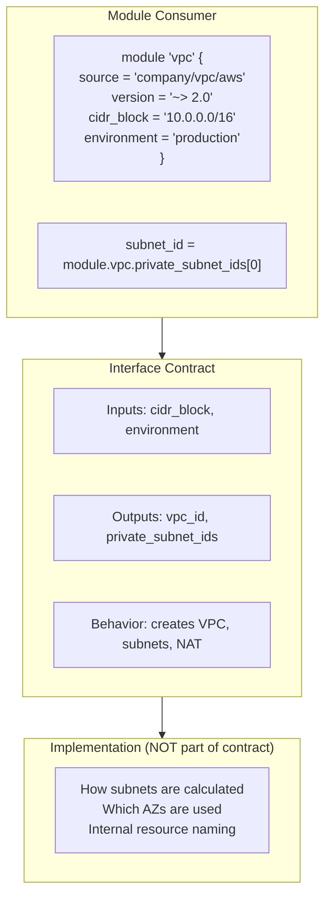

*[HCL]: HashiCorp Configuration Language
*[IaC]: Infrastructure as Code
*[IAM]: Identity and Access Management
*[RBAC]: Role-Based Access Control
*[SemVer]: Semantic Versioning
*[VPC]: Virtual Private Cloud

Terraform modules are contracts. When you publish a module — even internally — you're making promises about what inputs it accepts, what outputs it provides, and how it behaves. Break those promises carelessly and you break your consumers' infrastructure.

The challenge is that modules need to evolve. Requirements change, providers release new features, and you learn better patterns. How do you improve a module without forcing every consumer to scramble? The answer lies in intentional interface design: choosing the right defaults, structuring inputs to guide correct usage, and versioning changes so consumers can upgrade on their own timeline.

I've seen teams struggle with both extremes — modules with dozens of required variables that nobody wants to use, and modules with opaque defaults that work until they catastrophically don't. The sweet spot requires understanding what makes a good interface, how to communicate change through versioning, and how to test that your contracts actually hold.

## The Module Interface Contract

A module's interface is everything a consumer can observe or depend on. That's more than just variables and outputs — it includes the resources created, the naming conventions used, the provider versions required, and even implicit assumptions like "this module expects a VPC with DNS support enabled."

### What Constitutes a Module Interface

Think of a module interface in five layers:

__Input variables__ are the parameters consumers provide. Some are required (the module can't guess your VPC ID), others have sensible defaults (instance type can default to t3.medium). The types, names, and validation rules are all part of the contract.

__Output values__ are the data consumers reference. When someone writes `module.vpc.private_subnet_ids[0]`, they're depending on that output existing, being a list, and having at least one element. Change the output name or type and their code breaks.

__Resource behavior__ is what actually gets created. If your module creates a security group that allows HTTPS traffic, consumers might depend on that. Adding or removing resources can break downstream assumptions.

__Provider requirements__ constrain which provider versions work with your module. If you bump the minimum AWS provider from 4.0 to 5.0, consumers on 4.x can't use your module until they upgrade.

__Implicit contracts__ are the undocumented assumptions. Maybe your module names resources with a specific pattern (`{environment}-{name}-{resource_type}`), applies a standard set of tags, or assumes the VPC has DNS hostnames enabled. Perhaps it expects certain IAM permissions to exist, or assumes subnets have internet access through a NAT gateway. These are the trickiest because they're easy to break without realizing it — you rename your tagging convention and suddenly a downstream cost allocation dashboard stops working.



Figure: Module interface separates what consumers depend on from implementation details.

### Breaking vs Non-Breaking Changes

Not all changes are equal. Some are safe to make in a minor version; others require a major version bump and migration guidance.

| Change Type | Breaking? | Example | Migration Path |
|-------------|-----------|---------|----------------|
| Add optional input with default | No | `variable "tags" { default = {} }` | None needed |
| Remove input variable | Yes | Delete `variable "legacy_flag"` | Deprecate first; document in changelog |
| Change input type | Yes | `string` → `list(string)` | Provide migration example in changelog |
| Add new output | No | `output "new_arn" { ... }` | None needed |
| Remove output | Yes | Delete `output "old_id"` | Deprecate for one major version first |
| Change output type | Yes | `string` → `object` | Add new output; deprecate old one |
| Add new resource | Usually no | Add `aws_cloudwatch_log_group` | None if no side effects |
| Remove resource | Yes | Delete `aws_s3_bucket` | Document state rm commands |
| Rename resource | Yes | `aws_instance.main` → `aws_instance.primary` | Requires `moved` block |
| Change provider version | Maybe | `>= 4.0` → `>= 5.0` | Depends on provider changes |

Table: Breaking vs non-breaking changes in module interfaces.

The key insight: _outputs are promises_. Even if you think nobody uses a particular output, removing it is a breaking change. Someone, somewhere, has probably wired it into their configuration. Deprecate outputs for at least one major version before removal, giving consumers time to migrate.

<Callout type="warning">
Resource renames are particularly dangerous because they cause Terraform to destroy and recreate the resource unless you include a `moved` block. A simple rename of `aws_instance.main` to `aws_instance.primary` could destroy a production database if you're not careful.
</Callout>

## Input Variable Design

The difference between a module that's a joy to use and one that's a constant source of frustration often comes down to input variable design. Good inputs guide users toward correct usage; bad inputs let them make mistakes that only surface at apply time — or worse, in production.

### Required vs Optional Variables

The first decision for every variable: should the consumer be forced to provide a value, or can you supply a sensible default?

Make a variable required when the module genuinely cannot guess. VPC ID is a classic example — the module has no way to know which VPC you want to deploy into. Environment is another; deploying to production with a default of "development" would be a disaster.

Make a variable optional when there's a reasonable starting point. Instance type can default to t3.medium because it works for most workloads initially and is easy to change later. Backup retention can default to 7 days because _some_ retention is almost always better than none.

Use `null` as a default when a feature is opt-in. Custom KMS keys, custom domains, advanced monitoring configurations — these are things most users don't need, and `null` signals "use the platform default" or "skip this feature."

```hcl title="modules/application/variables.tf"
# Required: module cannot safely guess
variable "environment" {
  description = "Deployment environment (production, staging, development)"
  type        = string

  validation {
    condition     = contains(["production", "staging", "development"], var.environment)
    error_message = "Environment must be production, staging, or development."
  }
}

variable "vpc_id" {
  description = "ID of the VPC where resources will be created"
  type        = string
}

# Optional with sensible default
variable "instance_type" {
  description = "EC2 instance type for application servers"
  type        = string
  default     = "t3.medium"
}

variable "backup_retention_days" {
  description = "Number of days to retain automated backups"
  type        = number
  default     = 7

  validation {
    condition     = var.backup_retention_days >= 0 && var.backup_retention_days <= 35
    error_message = "Backup retention must be between 0 and 35 days."
  }
}

# Optional with null default (opt-in feature)
variable "custom_domain" {
  description = "Custom domain for the application (optional)"
  type        = string
  default     = null
}
```

Code: Variable definitions showing required, optional with default, and opt-in patterns.

### Default Value Principles

Choosing good defaults is harder than it looks. A few principles help:

__Default to the safer option.__ If a setting affects data durability or security, default to the more protective choice. Deletion protection should default to `true`. Encryption should default to enabled. Backup retention should be non-zero. Users can opt out for development environments; they shouldn't have to opt in for production safety.

__Default to the cheaper option when safety isn't at stake.__ Instance types, storage sizes, and replica counts can default to smaller values. Users will scale up when they need to; defaulting to expensive configurations just creates surprise bills.

__Use environment-aware defaults when behavior should differ.__ Some settings legitimately differ between environments — deletion protection makes sense in production but blocks rapid iteration in development. You can use `null` as a sentinel value and compute the actual default in a local:

```hcl title="modules/database/main.tf"
variable "deletion_protection" {
  description = "Enable deletion protection. Defaults to true for production."
  type        = bool
  default     = null
}

locals {
  deletion_protection = coalesce(
    var.deletion_protection,
    var.environment == "production" ? true : false
  )
}

resource "aws_db_instance" "main" {
  deletion_protection = local.deletion_protection
}
```

Code: Environment-aware defaults using coalesce with null sentinel.

### Complex Variable Types

Terraform 1.3 introduced optional object attributes with defaults, which dramatically improves the ergonomics of complex configuration. Instead of requiring users to specify every field, you can define sensible defaults for each attribute:

```hcl title="modules/database/variables.tf"
variable "database_config" {
  description = "Database configuration options"
  type = object({
    instance_class    = optional(string, "db.t3.medium")
    allocated_storage = optional(number, 20)
    engine_version    = optional(string, "14.7")
    multi_az          = optional(bool, false)
    backup_window     = optional(string, "03:00-04:00")

    performance_insights = optional(object({
      enabled          = optional(bool, true)
      retention_period = optional(number, 7)
    }), {})
  })
  default = {}
}
```

Code: Object variable with optional attributes and nested defaults.

With this definition, a consumer can call the module with just `database_config = {}` and get all the defaults, or override specific fields like `database_config = { instance_class = "db.r5.large", multi_az = true }`. The unspecified fields keep their defaults.

For truly dynamic resources — where you don't know how many instances you'll need — use maps:

```hcl title="modules/security-groups/variables.tf"
variable "security_groups" {
  description = "Map of security group configurations to create"
  type = map(object({
    description   = string
    ingress_cidrs = list(string)
    ingress_ports = list(number)
  }))
  default = {}

  validation {
    condition = alltrue([
      for name, sg in var.security_groups :
      length(name) <= 64 && can(regex("^[a-z0-9-]+$", name))
    ])
    error_message = "Security group names must be lowercase alphanumeric with hyphens, max 64 chars."
  }
}
```

Code: Map variable for dynamic resource creation with validation.

### Input Validation Patterns

Validation blocks catch configuration errors at plan time, before Terraform makes any API calls. This is invaluable — discovering a typo in your CIDR block during apply means waiting for the VPC creation to fail, then fixing it, then waiting again. Discovering it during plan takes seconds.

<Callout type="info">
Input validation runs during `terraform plan`, before any resources are created. Well-designed validations save users from waiting for API errors during apply. Validate everything that can be validated statically.
</Callout>

```hcl title="modules/vpc/variables.tf"
variable "vpc_cidr" {
  description = "CIDR block for the VPC"
  type        = string

  validation {
    condition     = can(cidrhost(var.vpc_cidr, 0))
    error_message = "VPC CIDR must be a valid IPv4 CIDR block."
  }

  validation {
    condition     = tonumber(split("/", var.vpc_cidr)[1]) >= 16 && tonumber(split("/", var.vpc_cidr)[1]) <= 28
    error_message = "VPC CIDR must have a prefix between /16 and /28."
  }
}

variable "kms_key_arn" {
  description = "ARN of a KMS key for encryption (optional)"
  type        = string
  default     = null

  validation {
    condition = var.kms_key_arn == null || can(regex(
      "^arn:aws:kms:[a-z0-9-]+:[0-9]{12}:key/[a-f0-9-]+$",
      var.kms_key_arn
    ))
    error_message = "KMS key ARN must be a valid AWS KMS key ARN format."
  }
}
```

Code: Validation patterns for CIDR blocks and ARN formats.

For conditional requirements — where one variable depends on another — use `precondition` blocks in the resource lifecycle:

```hcl title="modules/load-balancer/main.tf"
variable "enable_https" {
  type    = bool
  default = true
}

variable "certificate_arn" {
  type    = string
  default = null
}

resource "aws_lb_listener" "https" {
  count = var.enable_https ? 1 : 0

  lifecycle {
    precondition {
      condition     = var.certificate_arn != null
      error_message = "certificate_arn is required when enable_https is true."
    }
  }
}
```

Code: Precondition for conditional variable requirements.

## Output Design

Outputs are the other half of the interface contract. Every output you expose becomes a potential dependency — consumers wire them into their configurations, and changing or removing an output breaks their code. Design outputs with the same care you'd apply to a library's public API.

### Output Contract Principles

Think about what consumers actually need. A VPC module's consumers need the VPC ID to create resources inside it. They need subnet IDs to place instances. They need ARNs to write IAM policies. They probably don't need the internal route table associations or the NAT gateway attachment details.

Output _identifiers_ that consumers will reference directly:

```hcl title="modules/vpc/outputs.tf"
output "vpc_id" {
  description = "The ID of the VPC"
  value       = aws_vpc.main.id
}

output "private_subnet_ids" {
  description = "List of private subnet IDs, ordered by availability zone"
  value       = aws_subnet.private[*].id
}
```

Code: Basic identifier outputs for downstream resource creation.

Output _ARNs_ for IAM policies. Consumers often need to grant permissions to resources your module creates, and ARNs are the currency of IAM:

```hcl title="modules/database/outputs.tf"
output "log_group_arn" {
  description = "ARN of the CloudWatch log group for IAM policy attachment"
  value       = aws_cloudwatch_log_group.main.arn
}

output "kms_key_arn" {
  description = "ARN of the KMS key used for encryption"
  value       = aws_kms_key.main.arn
}
```

Code: ARN outputs for IAM policy construction.

Output _computed values_ that would be hard to derive. NAT gateway public IPs, auto-generated hostnames, calculated CIDR blocks — anything the consumer would need to dig through state to find:

```hcl title="modules/database/outputs.tf"
output "connection_string" {
  description = "PostgreSQL connection string (without password)"
  value       = "postgresql://${aws_db_instance.main.username}@${aws_db_instance.main.endpoint}/${aws_db_instance.main.db_name}"
  sensitive   = false
}
```

Code: Computed connection string output for convenience.

### Stable Output Contracts

The implementation of a module will change — you'll refactor from `count` to `for_each`, rename internal resources, restructure how things are organized. Good output design insulates consumers from these changes.

The problem with outputs tied to implementation:

```hcl
# Fragile: breaks if you refactor from count to for_each
output "instance_ids" {
  value = aws_instance.app[*].id
}
```

The stable alternative:

```hcl title="modules/compute/outputs.tf"
output "instance_ids" {
  description = "IDs of all application instances"
  value       = [for instance in aws_instance.app : instance.id]
}
```

Code: Stable output using for expression instead of splat.

For related values, group them into structured objects. This gives consumers a clean interface and lets you add new fields without breaking existing references:

```hcl title="modules/vpc/outputs.tf"
output "networking" {
  description = "Network configuration for downstream modules"
  value = {
    vpc_id             = aws_vpc.main.id
    vpc_cidr           = aws_vpc.main.cidr_block
    private_subnet_ids = aws_subnet.private[*].id
    public_subnet_ids  = aws_subnet.public[*].id
    availability_zones = data.aws_availability_zones.available.names

    security_groups = {
      internal = aws_security_group.internal.id
      https    = aws_security_group.https.id
    }
  }
}
```

Code: Structured output grouping related network values.

### Deprecating Outputs

When you need to remove or rename an output, deprecate it first. Keep the old output for at least one major version, with a description that tells consumers what to migrate to:

```hcl title="modules/database/outputs.tf"
output "cluster_endpoint" {
  description = <<-EOT
    DEPRECATED: Use 'database.endpoint' instead.
    This output will be removed in v3.0.0.
  EOT
  value = aws_rds_cluster.main.endpoint
}

output "database" {
  description = "Database connection information"
  value = {
    endpoint        = aws_rds_cluster.main.endpoint
    reader_endpoint = aws_rds_cluster.main.reader_endpoint
    port            = aws_rds_cluster.main.port
    database_name   = aws_rds_cluster.main.database_name
  }
}
```

Code: Deprecated output with migration guidance alongside replacement.

The heredoc description appears in `terraform output` and in documentation generators, giving consumers advance warning. When v3.0.0 ships, you can remove `cluster_endpoint` as a documented breaking change.

## Versioning Strategy

Modules evolve. Requirements change, providers release new features, and you learn better patterns. Semantic versioning provides the framework for managing this evolution, but applying it to infrastructure requires understanding what constitutes a breaking change — and many changes that _feel_ minor are technically breaking.

### Semantic Versioning for Modules

SemVer's core principle applies directly to Terraform modules: major versions for breaking changes, minor for new features, patch for bug fixes. The tricky part is that infrastructure changes often have hidden dependencies — renaming an output feels like a minor cleanup, but it breaks every consumer who referenced that output.

_Major version bumps_ are required when you change the interface contract in ways that could break existing consumers:

- Remove or rename an input variable
- Change an input variable's type
- Remove an output
- Change an output's type or structure
- Remove a resource (causes state issues for consumers)
- Bump a provider minimum version that has breaking changes

_Minor version bumps_ are for backward-compatible additions:

- Add a new input variable with a default value
- Add a new output
- Add a new resource (assuming no side effects)
- Deprecate (but not remove) an input or output

_Patch version bumps_ are for fixes that don't touch the interface:

- Fix a bug without changing behavior consumers depend on
- Update documentation
- Internal refactoring that doesn't affect state
- Update provider constraints within compatible ranges

### Version Constraints

Consumers control which versions they accept through version constraints. The constraint you choose balances stability against getting updates — too loose and you risk unexpected breakage, too strict and you miss security patches.

```hcl title="root-module/main.tf"
module "vpc" {
  source  = "company/vpc/aws"
  version = "~> 2.0"
}

module "database" {
  source  = "company/rds/aws"
  version = "2.3.1"
}
```

Code: Pessimistic constraint for most modules, exact pinning for critical infrastructure.

The pessimistic constraint (`~>`) is the sweet spot for most use cases. It accepts patch and minor updates but stops at the next major version, giving you bug fixes without breaking changes. For critical infrastructure like databases, exact pinning provides maximum stability at the cost of manual updates.

| Strategy | Constraint | Use Case | Trade-off |
|----------|-----------|----------|-----------|
| Pessimistic | `~> 2.0` | Most modules | Gets patches automatically, no breaking changes |
| Exact | `2.3.1` | Critical infrastructure | Maximum stability, requires manual updates |
| Range | `>= 2.0, < 3.0` | Same as pessimistic | More explicit about intent |
| Minimum | `>= 2.0` | Development only | Gets latest, may break unexpectedly |

Table: Version constraint strategies and their trade-offs.

<Callout type="danger">
A constraint like `>= 2.0` means Terraform will use the latest version, including major versions with breaking changes. Always specify an upper bound for production modules.
</Callout>

### Migration Paths with Moved Blocks

When you need to rename or restructure resources, `moved` blocks tell Terraform how to update state without destroying and recreating infrastructure:

```hcl title="modules/compute/main.tf"
moved {
  from = aws_instance.web
  to   = aws_instance.application
}

resource "aws_instance" "application" {
  for_each = toset(var.instance_names)
}
```

Code: Moved block enabling resource rename without destruction.

Moved blocks handle simple renames automatically. For complex migrations — like refactoring from `count` to `for_each` — consumers may need to run state commands. Document these in your changelog:

```markdown title="CHANGELOG.md"
## [2.0.0] - 2024-01-15

### ⚠️ BREAKING CHANGES

- Refactored instance resource from count to for_each

### Migration Guide

The instance resource now uses for_each instead of count. After upgrading,
run these state commands to migrate existing instances:

terraform state mv 'module.app.aws_instance.web[0]' \
  'module.app.aws_instance.application["web-1"]'
terraform state mv 'module.app.aws_instance.web[1]' \
  'module.app.aws_instance.application["web-2"]'
```

Code: Changelog with migration instructions for breaking changes.

### Changelog Discipline

A good changelog tells consumers exactly what changed and what they need to do about it. Follow the [Keep a Changelog](https://keepachangelog.com/) format:

- _Added_ for new features
- _Changed_ for changes in existing functionality
- _Deprecated_ for soon-to-be removed features
- _Removed_ for removed features
- _Fixed_ for bug fixes
- _Security_ for vulnerability fixes

For breaking changes, include explicit upgrade instructions. Don't make consumers guess what broke — tell them exactly which lines of their configuration need to change.

## Module Composition Patterns

Real infrastructure rarely fits in a single module. You need VPCs that host EKS clusters that run applications. Composing modules without creating a tangled mess of dependencies requires clear boundaries and intentional output design.

### Layered Module Architecture

Organize modules into layers where each layer depends only on the layer below it. Foundation modules create network primitives. Platform modules build on those to create compute platforms. Application modules deploy workloads onto platforms:

```hcl title="environments/production/main.tf"
module "foundation" {
  source  = "company/foundation/aws"
  version = "~> 1.0"

  environment = var.environment
  vpc_cidr    = var.vpc_cidr
}

module "platform" {
  source  = "company/eks-platform/aws"
  version = "~> 2.0"

  vpc_id             = module.foundation.vpc_id
  private_subnet_ids = module.foundation.private_subnet_ids
  environment        = var.environment
}

module "application" {
  source  = "company/microservice/aws"
  version = "~> 1.0"

  cluster_name    = module.platform.cluster_name
  namespace       = "production"
  service_account = module.platform.application_service_account
}
```

Code: Root module composing foundation, platform, and application layers.

### Pass-Through Variables

Modules can't anticipate every customization need. Pass-through variables let consumers extend resources without the module needing to expose every possible attribute:

```hcl title="modules/compute/variables.tf"
variable "tags" {
  description = "Tags to apply to all resources"
  type        = map(string)
  default     = {}
}

variable "additional_security_group_ids" {
  description = "Additional security groups to attach"
  type        = list(string)
  default     = []
}
```

Code: Pass-through variables for tags and security groups.

The module merges these with its own configuration:

```hcl title="modules/compute/main.tf"
resource "aws_instance" "main" {
  instance_type = local.instance_type
  ami           = data.aws_ami.latest.id

  vpc_security_group_ids = concat(
    [aws_security_group.default.id],
    var.additional_security_group_ids
  )

  tags = merge(local.default_tags, var.tags)
}
```

Code: Merging module defaults with pass-through values.

This pattern lets consumers add their compliance tags or attach extra security groups without the module needing to know about every possible requirement.

### Output Forwarding

When a parent module uses child modules, it needs to explicitly forward relevant outputs. Never expose the entire child module object — that leaks implementation details and creates brittle dependencies:

```hcl title="modules/data-tier/outputs.tf"
# Curated output interface
output "database" {
  description = "Database connection information"
  value = {
    endpoint          = module.rds.endpoint
    port              = module.rds.port
    name              = module.rds.database_name
    security_group_id = module.rds.security_group_id
  }
}

# Aggregate outputs from multiple child modules
output "endpoints" {
  description = "Service endpoints for application configuration"
  value = {
    database = module.rds.endpoint
    cache    = module.elasticache.endpoint
    queue    = module.sqs.queue_url
  }
}
```

Code: Curated outputs exposing only what consumers need.

## Testing Module Interfaces

You've designed your interface. You've documented the contract. Now you need to verify it actually works — that required variables are enforced, defaults apply correctly, validation catches bad input, and outputs have the structure consumers expect.

Terraform's native test framework (`.tftest.hcl` files) lets you write these checks without deploying real infrastructure. Tests run `terraform plan` or `terraform apply` against your module and assert conditions on the result.

### Contract Testing

Contract tests verify that your module enforces its interface correctly. Start with the basics: required variables should fail when omitted.

```hcl title="tests/contract.tftest.hcl"
run "required_variables_enforced" {
  command = plan

  variables {
    vpc_cidr = "10.0.0.0/16"
    # environment intentionally omitted
  }

  expect_failures = [var.environment]
}
```

Code: Test that omitting a required variable produces the expected failure.

Next, verify that default values apply when variables are not provided:

```hcl title="tests/defaults.tftest.hcl"
run "default_instance_type_applied" {
  command = plan

  variables {
    environment = "development"
    vpc_cidr    = "10.0.0.0/16"
  }

  assert {
    condition     = aws_instance.main.instance_type == "t3.medium"
    error_message = "Expected default instance_type of t3.medium"
  }
}
```

Code: Test that default values are applied correctly.

Validation rules deserve their own tests. If you added a validation block to catch invalid CIDR notation, prove it works:

```hcl title="tests/validation.tftest.hcl"
run "invalid_cidr_rejected" {
  command = plan

  variables {
    environment = "development"
    vpc_cidr    = "not-a-cidr"
  }

  expect_failures = [var.vpc_cidr]
}

run "valid_cidr_accepted" {
  command = plan

  variables {
    environment = "development"
    vpc_cidr    = "10.0.0.0/16"
  }

  # No expect_failures means the plan should succeed
}
```

Code: Test both the rejection and acceptance paths for validation rules.

### Output Structure Testing

Outputs are part of your interface contract. Test that they exist and have the expected structure. The `can()` function is particularly useful here — it returns `true` if the expression evaluates without error, letting you test for the presence of nested attributes without the test failing on missing keys:

```hcl title="tests/outputs.tftest.hcl"
run "networking_output_structure" {
  command = apply

  variables {
    environment = "development"
    vpc_cidr    = "10.0.0.0/16"
  }

  assert {
    condition     = can(output.networking.vpc_id)
    error_message = "networking output must include vpc_id"
  }

  assert {
    condition     = length(output.networking.private_subnet_ids) > 0
    error_message = "networking output must include at least one private subnet"
  }

  assert {
    condition     = can(regex("^vpc-", output.networking.vpc_id))
    error_message = "vpc_id should start with 'vpc-'"
  }
}
```

Code: Test output existence, structure, and format.

### Upgrade Testing

Before releasing a major version, verify that existing deployments won't be destroyed unexpectedly. This requires maintaining state files from previous versions to test against.

The approach is to maintain a "golden" state file generated by deploying the previous version in CI. Your pipeline deploys the previous module version to a test account, captures the state file as an artifact, then runs the new version against that state. Store these golden state files alongside your module — one per supported major version — and update them when you release:

```hcl title="tests/upgrade_v1_to_v2.tftest.hcl"
run "upgrade_preserves_resources" {
  command = plan

  variables {
    environment = "test"
    vpc_cidr    = "10.0.0.0/16"
  }

  assert {
    condition = length([
      for change in plan.resource_changes : change
      if change.change.actions == ["delete"]
    ]) == 0
    error_message = "Upgrade should not destroy any resources"
  }
}
```

Code: Test that version upgrades don't cause unexpected resource destruction.

For complex migrations involving `moved` blocks, also verify that the old resource addresses no longer appear in the plan — confirming the moves were recognized:

```hcl title="tests/upgrade_v1_to_v2.tftest.hcl"
run "moved_blocks_applied" {
  command = plan

  variables {
    environment = "test"
    vpc_cidr    = "10.0.0.0/16"
  }

  assert {
    condition = !contains(
      [for change in plan.resource_changes : change.address],
      "aws_instance.web"
    )
    error_message = "Old resource address should not appear after move"
  }
}
```

Code: Verify moved blocks successfully renamed resources in state.

Run upgrade tests as part of your release process. If you support multiple major versions, maintain state files for each and test upgrades from all supported versions.

### Module Repository Structure

A well-organized module repository makes tests discoverable and examples easy to find. This structure works for most modules:

```text
├── main.tf              # Primary resource logic
├── variables.tf         # Input variable definitions
├── outputs.tf           # Output declarations
├── versions.tf          # Terraform and provider version constraints
├── README.md            # Usage documentation
├── CHANGELOG.md         # Version history and migration guides
├── examples/            # Working usage examples
│   ├── simple/          # Minimal configuration
│   └── complete/        # All features demonstrated
├── modules/             # Internal sub-modules (if needed)
│   └── networking/      # Encapsulated sub-component
└── tests/               # Test files
    ├── contract.tftest.hcl      # Input/output contract tests
    ├── validation.tftest.hcl    # Validation rule tests
    ├── defaults.tftest.hcl      # Default value tests
    └── upgrade_v1_to_v2.tftest.hcl # Version migration tests
```

Code: Recommended module repository structure.

The `examples/` directory serves double duty: it provides documentation for consumers and test fixtures for integration tests. Point your `README.md` at these examples so consumers can see working configurations, not just variable descriptions.

## Conclusion

A module's interface is a contract, and contracts create trust. When consumers can rely on your inputs behaving predictably, your outputs remaining stable, and your version numbers communicating change accurately, they'll use your modules with confidence. When they can't, they'll fork your code or write their own — and you'll have lost the leverage that shared modules provide.

The patterns here aren't complicated: default to safe values, validate inputs early, deprecate before removing, version honestly, and test what you promise. The discipline is in applying them consistently, release after release, even when you're tempted to "just make this one quick change." Every breaking change you avoid is a consumer who doesn't have to scramble. Every migration guide you write is trust you've earned.

Your module's interface is the only part most consumers will ever see. Make it a good contract to sign.
