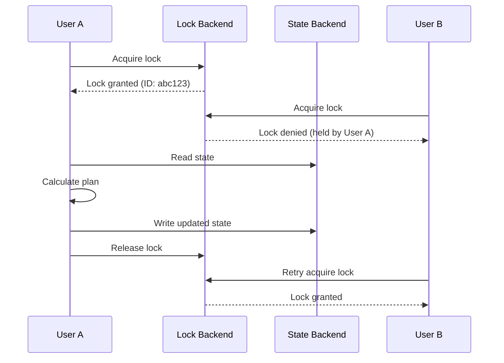
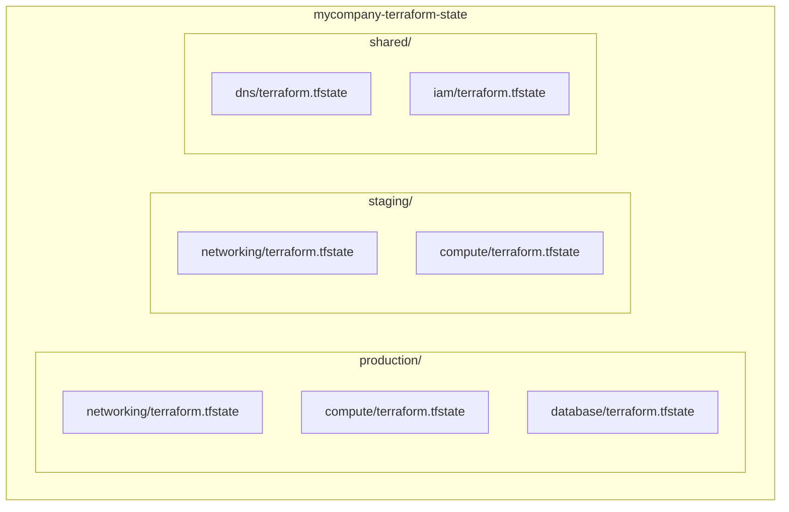

*[ARN]: Amazon Resource Name
*[DynamoDB]: Amazon DynamoDB
*[GCS]: Google Cloud Storage
*[HCL]: HashiCorp Configuration Language
*[IAM]: Identity and Access Management
*[IaC]: Infrastructure as Code
*[KMS]: Key Management Service
*[S3]: Amazon Simple Storage Service

Every Terraform practitioner eventually experiences the moment: `terraform plan` shows it wants to destroy and recreate half your production infrastructure, or you get a state lock error at 2 AM when nobody else should be running Terraform, or the state file is just... gone. State corruption is a when, not an if.

The state file is Terraform's memory. It tracks what exists in the cloud, what you declared in configuration, and the mapping between them. When that mapping breaks — through interrupted applies, concurrent modifications, or manual edits gone wrong — Terraform loses its ability to reason about your infrastructure. The results range from inconvenient (orphaned resources you have to clean up manually) to catastrophic (unintended destruction of production systems).

This article covers the mechanics of state, how locking prevents concurrent corruption, what goes wrong when it doesn't, and the recovery procedures you should have practiced before you need them.

## Understanding Terraform State

State is the bridge between your HCL configuration and the actual resources running in your cloud account. Without it, Terraform would have no way to know that `aws_vpc.main` in your config corresponds to `vpc-0123456789abcdef0` in AWS.

### What Lives in the State File

The state file is JSON with a specific structure. Understanding this structure helps when you need to debug corruption or perform manual recovery.

```json title="terraform.tfstate (simplified)"
{
  "version": 4,
  "terraform_version": "1.6.0",
  "serial": 42,
  "lineage": "a1b2c3d4-e5f6-7890-abcd-ef1234567890",
  "outputs": {
    "vpc_id": {
      "value": "vpc-0123456789abcdef0",
      "type": "string"
    }
  },
  "resources": [
    {
      "mode": "managed",
      "type": "aws_vpc",
      "name": "main",
      "provider": "provider[\"registry.terraform.io/hashicorp/aws\"]",
      "instances": [
        {
          "schema_version": 1,
          "attributes": {
            "id": "vpc-0123456789abcdef0",
            "cidr_block": "10.0.0.0/16",
            "enable_dns_hostnames": true,
            "tags": {
              "Name": "production-vpc",
              "Environment": "production"
            }
          }
        }
      ]
    }
  ]
}
```

Code: Terraform state file structure showing the key fields.

The critical fields are:

- __version__: The state format version (currently 4). Terraform uses this to handle state migrations between versions.
- __serial__: Incremented on every state change. This is how Terraform detects concurrent modifications — if you try to write serial 43 but the backend has serial 44, someone else modified state while you were working.
- __lineage__: A unique identifier for this state's history. If lineage doesn't match, you're trying to push state from an entirely different Terraform configuration.
- __resources__: The mapping between your config (`aws_vpc.main`) and real infrastructure (`vpc-0123456789abcdef0`), including all the attributes Terraform knows about.

When you run `terraform plan`, Terraform reads this state, queries the cloud provider for current reality, compares both against your configuration, and calculates the diff. If any of these three inputs are wrong — stale state, API errors, or config mistakes — the plan will be wrong.

### Why State Creates Problems

State solves essential problems, but each solution introduces its own failure modes.

| Purpose | How State Helps | What Can Go Wrong |
|---------|-----------------|-------------------|
| Resource mapping | Maps config names to cloud IDs | Mapping lost = orphaned resources |
| Dependency ordering | Tracks implicit dependencies | Corrupted deps = wrong destroy order |
| Performance | Caches attributes, avoids API calls | Stale cache = drift detection fails |
| Collaboration | Shared state enables team workflows | Concurrent writes = corruption |
| Drift detection | Compares state to reality | State-reality mismatch = confusion |

Table: State file purposes and their associated failure modes.

<Callout type="warning">
State files contain sensitive data in plaintext: database passwords, API keys, private keys. Treat state as a secret. Encrypt at rest, restrict access, and never commit to version control.
</Callout>

## State Locking Mechanisms

When two engineers run `terraform apply` simultaneously against the same state, you get a race condition. Both read the same state, both calculate plans based on that state, and then both try to write their changes. The second write either overwrites the first (losing changes) or fails with a serial mismatch error. Neither outcome is good.

Locking prevents this by ensuring only one operation can modify state at a time. Before Terraform reads state for a plan or apply, it acquires a lock. If someone else holds the lock, Terraform waits (or fails, depending on configuration). After the operation completes — successfully or not — Terraform releases the lock.



Figure: State locking prevents concurrent modifications.

The lock record includes metadata about who holds it: the user identity, the operation type (plan vs apply), and when the lock was acquired. This information is critical when you need to diagnose stuck locks — you can see whether it's a CI job that's still running or one that crashed hours ago.

### S3 + DynamoDB Backend

The standard AWS backend separates state storage (S3) from locking (DynamoDB). S3 holds the state file; DynamoDB provides atomic conditional writes for lock acquisition.

```hcl title="backend.tf"
terraform {
  backend "s3" {
    bucket         = "mycompany-terraform-state"
    key            = "production/infrastructure/terraform.tfstate"
    region         = "us-east-1"
    dynamodb_table = "terraform-state-locks"
    encrypt        = true
    kms_key_id     = "alias/terraform-state"
  }
}
```

Code: S3 backend configuration with DynamoDB locking.

The DynamoDB table needs only one attribute: `LockID`. Terraform uses conditional writes to ensure atomic lock acquisition — if two requests try to create the same lock simultaneously, only one succeeds.

```hcl title="bootstrap/dynamodb.tf"
resource "aws_dynamodb_table" "terraform_locks" {
  name         = "terraform-state-locks"
  billing_mode = "PAY_PER_REQUEST"
  hash_key     = "LockID"

  attribute {
    name = "LockID"
    type = "S"
  }

  point_in_time_recovery {
    enabled = true
  }
}
```

Code: DynamoDB table for Terraform state locking.

Point-in-time recovery on the lock table might seem excessive, but it's saved me once when a botched script deleted lock records. PAY_PER_REQUEST billing makes sense here because lock operations are infrequent but you don't want throttling when they happen.

### Backend Locking Comparison

Different backends implement locking differently, with varying reliability and recovery procedures.

| Backend | Lock Mechanism | Lock Timeout | Force Unlock Method |
|---------|---------------|--------------|---------------------|
| S3 + DynamoDB | DynamoDB conditional writes | Infinite | `terraform force-unlock LOCK_ID` |
| Azure Blob | Blob lease | 60s (renewable) | Break lease via Azure CLI |
| GCS | Object generation numbers | None (optimistic) | Delete lock object |
| PostgreSQL | Advisory locks | Session-based | Kill database session |
| Terraform Cloud | Built-in run queue | Configurable | Cancel run in UI/API |

Table: Backend locking mechanisms and recovery methods.

Azure Blob uses lease-based locking with a 60-second timeout that auto-renews during operations. The upside: if your process crashes, the lock releases automatically. The downside: long-running applies can lose their lock if renewal fails due to network issues, leaving you with a partially applied state and no lock. GCS uses optimistic locking via object generations, which means conflicts are detected at write time rather than prevented upfront.

For most AWS shops, S3 + DynamoDB is the right choice. The locking is reliable, the tooling is mature, and the failure modes are well-understood.

## State Corruption Scenarios

State corruption isn't always obvious. Sometimes Terraform tells you directly with a parse error. More often, you notice something's wrong when `terraform plan` shows changes you didn't make, or when it wants to destroy resources that definitely shouldn't be destroyed.

### Common Corruption Causes

The most frequent causes of state problems, roughly in order of how often I've encountered them:

__Interrupted applies__ happen when someone hits Ctrl+C during an apply, or a network failure kills the connection, or CI times out. The cloud resource might be partially created, fully created, or not created at all — but state reflects whatever Terraform believed at the moment of interruption. Symptoms: plan shows unexpected changes, or tries to create resources that already exist.

__Concurrent modifications__ occur despite locking, usually because someone ran Terraform locally while CI was running, or two CI jobs targeted the same state due to misconfigured triggers. Symptoms: "state serial mismatch" errors, or changes from one apply silently missing after another.

__Manual state edits__ are tempting when you need to fix something quickly, but JSON is unforgiving. A missing comma, a wrong type, or a malformed resource address can corrupt the entire file. Symptoms: parse errors on any Terraform command.

__Provider version mismatches__ happen when you upgrade providers without considering state compatibility. The provider's internal schema version might change, and state written by the old provider might not be readable by the new one. Symptoms: warnings about schema versions, unexpected replacement plans.

__External changes__ (drift) aren't corruption in the strict sense, but they cause the same confusion. Someone modified a resource in the AWS console, or another tool manages the same resource. Symptoms: plan shows changes you didn't make in code.

__Backend migration failures__ are the worst because they can leave you with state in two places (or nowhere). If migration is interrupted, you might have partial state in the new backend and full state in the old one, or orphaned locks. Symptoms: resources appear to not exist, lock errors referencing the wrong backend.

### Detecting State Issues

When something seems wrong, these commands help diagnose the problem:

```bash title="state-diagnostics.sh"
# Pull state locally for inspection
terraform state pull > state_backup.json

# List all resources — useful for spotting duplicates or missing resources
terraform state list

# Show details for a specific resource
terraform state show aws_vpc.main

# Refresh-only plan shows drift without proposing changes
terraform plan -refresh-only

# Debug logging reveals what Terraform is actually doing
TF_LOG=DEBUG terraform plan 2>&1 | tee debug.log
```

Code: Commands for diagnosing state issues.

The refresh-only plan is particularly useful: it compares state to reality without considering your configuration changes. If refresh-only shows drift, you know the problem is state-vs-reality divergence rather than a config issue.

For deeper inspection, you can query the state file directly with `jq`:

```bash
# Count resources by type
cat state_backup.json | jq -r '.resources[] | .type' | sort | uniq -c | sort -rn

# Find resources with no instances (possible corruption)
cat state_backup.json | jq '.resources[] | select(.instances | length == 0) | "\(.type).\(.name)"'

# Check the serial number and lineage
cat state_backup.json | jq '{serial, lineage, terraform_version}'
```

Code: Using jq to inspect state file contents.

<Callout type="danger">
Direct state file editing is error-prone and can make corruption worse. Use `terraform state` commands instead: `terraform state mv`, `terraform state rm`, `terraform state import`. Manual JSON editing is a last resort, always with a backup first.
</Callout>

## Recovery Procedures

When state breaks, you need to fix it before you can resume normal operations. The right recovery procedure depends on what's wrong: stuck locks, state-reality divergence, missing resources in state, or complete state loss.

### Force Unlock

The most common recovery scenario: you try to run Terraform and get a lock error, but nobody else is running Terraform. This usually means a previous operation crashed without releasing its lock.

Before force-unlocking, verify the lock holder is actually dead. Check your CI system for running jobs. Check with teammates. The lock message tells you who holds it and when it was acquired — if it's from hours ago and you're confident nothing is running, it's safe to force unlock.

```bash title="force-unlock.sh"
# The lock error message includes the lock ID you need
# Error: Error acquiring the state lock
# Lock Info:
#   ID:        550e8400-e29b-41d4-a716-446655440000
#   Who:       ci-runner@github-actions
#   Created:   2024-01-15 10:30:00 +0000 UTC

# Force unlock using the ID from the error message
terraform force-unlock 550e8400-e29b-41d4-a716-446655440000
```

Code: Releasing an orphaned state lock.

If `force-unlock` doesn't work (rare, but happens with backend issues), you can delete the lock directly as a last resort:

```bash title="emergency-lock-deletion.sh"
# AWS S3 + DynamoDB backend
aws dynamodb delete-item \
  --table-name terraform-state-locks \
  --key '{"LockID": {"S": "mycompany-terraform-state/prod/terraform.tfstate-md5"}}'

# Azure Blob Storage backend (break the blob lease)
az storage blob lease break \
  --account-name tfstateaccount \
  --container-name tfstate \
  --blob-name prod.terraform.tfstate

# GCS backend (delete the lock file)
# Path varies based on your backend's 'prefix' setting
gsutil rm gs://mycompany-terraform-state/terraform/state/default.tflock
```

Code: Emergency lock deletion for different backends.

### State Refresh and Import

When resources exist in your cloud account but not in state — either because they were created outside Terraform or because state lost track of them — you need to import them.

For a single resource, the import command works directly:

```bash
terraform import aws_vpc.main vpc-0123456789abcdef0
```

Code: Importing a single resource into state.

For multiple resources, Terraform 1.5+ supports import blocks that let you declare imports in configuration and execute them as a batch. If you're on an older version, you'll need to run `terraform import` once per resource:

```hcl title="imports.tf"
import {
  to = aws_vpc.main
  id = "vpc-0123456789abcdef0"
}

import {
  to = aws_subnet.private[0]
  id = "subnet-111111111"
}

import {
  to = aws_subnet.private[1]
  id = "subnet-222222222"
}
```

Code: Import blocks for bulk resource import.

Run `terraform plan` to see what will be imported, then `terraform apply` to execute. If you don't have configuration for the resources yet, you can generate it:

```bash
terraform plan -generate-config-out=generated.tf
```

Code: Generating configuration from imported resources.

This creates HCL configuration based on the imported resource's current attributes. Review and clean up the generated code before committing — it tends to be verbose and include computed attributes you don't need to specify.

### State Surgery

Sometimes you need to manipulate state without touching real infrastructure: renaming resources during refactoring, removing resources that Terraform should no longer manage, or moving resources between modules.

```bash title="state-surgery.sh"
# Remove resource from state (keeps actual cloud resource)
# Use when something else should manage this resource
terraform state rm aws_instance.legacy_server

# Rename a resource (refactoring)
terraform state mv aws_instance.web aws_instance.application

# Move resource between modules
terraform state mv module.old.aws_vpc.main module.new.aws_vpc.main

# Move to a different state file (splitting configurations)
terraform state mv -state-out=networking.tfstate aws_vpc.main
```

Code: Common state manipulation operations.

Always run `terraform plan` after state surgery to verify the result. A successful operation should show no changes (or only the changes you intended). If plan shows unexpected creates or destroys, you made a mistake — restore from backup and try again.

### Full Recovery from Backup

When state is severely corrupted or completely lost, you need to restore from backup. This is why S3 versioning matters.

```bash title="state-recovery.sh"
# List available versions
aws s3api list-object-versions \
  --bucket mycompany-terraform-state \
  --prefix prod/terraform.tfstate \
  --max-items 10

# Download a specific version
aws s3api get-object \
  --bucket mycompany-terraform-state \
  --key prod/terraform.tfstate \
  --version-id "abc123versionid" \
  recovered-state.json

# Validate the recovered state
terraform show -json recovered-state.json | jq '.values.root_module.resources | length'

# Push recovered state to backend
terraform state push recovered-state.json

# Verify recovery worked
terraform plan
```

Code: Recovering state from S3 version history.

A successful recovery should result in a plan that shows no changes (or minimal drift from whatever happened between the backup and now). If plan shows massive destruction, you either recovered the wrong version or the state was already out of sync with reality before the backup.

## Backend Selection and Configuration

Your choice of backend determines how state is stored, how locking works, and what recovery options you have. In practice, the decision usually comes down to which cloud provider you're already using — use native storage with proper locking enabled.

### Backend Comparison

| Factor | S3 + DynamoDB | Azure Blob | GCS | PostgreSQL | Terraform Cloud |
|--------|--------------|------------|-----|------------|------------------|
| Setup complexity | Medium | Low | Low | High | Very Low |
| Locking reliability | High | Medium | Medium | High | Very High |
| Cost | Low | Low | Low | Self-managed | Free tier available |
| Encryption | KMS | Built-in | KMS | Manual | Built-in |
| Versioning | S3 versioning | Blob versioning | Object versioning | Manual | Built-in |
| Access control | IAM policies | Azure RBAC | IAM policies | Database ACLs | Team permissions |

Table: Backend comparison for common deployment scenarios.

S3 + DynamoDB is the most battle-tested option for AWS shops. Azure Blob works well for Azure-centric teams. GCS is solid but uses optimistic locking, which means conflicts are detected at write time rather than prevented upfront. PostgreSQL is a good choice if you're already running a database and want to avoid cloud-specific dependencies — it uses advisory locks which are reliable but require managing the database yourself. Terraform Cloud handles everything for you but adds a dependency on HashiCorp's infrastructure.

### Production-Ready S3 Backend

Here's a complete backend setup with all the safety features you should have in production: versioning for recovery, encryption for security, public access blocks, and lifecycle rules to manage old versions.

```hcl title="modules/terraform-backend/main.tf"
resource "aws_s3_bucket" "terraform_state" {
  bucket = "mycompany-terraform-state-${data.aws_caller_identity.current.account_id}"
  force_destroy = false
}

resource "aws_s3_bucket_versioning" "terraform_state" {
  bucket = aws_s3_bucket.terraform_state.id
  versioning_configuration {
    status = "Enabled"
  }
}

resource "aws_s3_bucket_server_side_encryption_configuration" "terraform_state" {
  bucket = aws_s3_bucket.terraform_state.id

  rule {
    apply_server_side_encryption_by_default {
      sse_algorithm     = "aws:kms"
      kms_master_key_id = aws_kms_key.terraform_state.arn
    }
    bucket_key_enabled = true
  }
}

resource "aws_s3_bucket_public_access_block" "terraform_state" {
  bucket = aws_s3_bucket.terraform_state.id

  block_public_acls       = true
  block_public_policy     = true
  ignore_public_acls      = true
  restrict_public_buckets = true
}

resource "aws_s3_bucket_lifecycle_configuration" "terraform_state" {
  bucket = aws_s3_bucket.terraform_state.id

  rule {
    id     = "cleanup-old-versions"
    status = "Enabled"

    noncurrent_version_expiration {
      noncurrent_days = 90
    }

    noncurrent_version_transition {
      noncurrent_days = 30
      storage_class   = "STANDARD_IA"
    }
  }
}

resource "aws_kms_key" "terraform_state" {
  description             = "Terraform state encryption"
  deletion_window_in_days = 30
  enable_key_rotation     = true
}

resource "aws_dynamodb_table" "terraform_locks" {
  name         = "terraform-state-locks"
  billing_mode = "PAY_PER_REQUEST"
  hash_key     = "LockID"

  attribute {
    name = "LockID"
    type = "S"
  }

  point_in_time_recovery {
    enabled = true
  }

  server_side_encryption {
    enabled = true
  }
}
```

Code: Production-ready S3 backend with all safety features.

The lifecycle configuration keeps 90 days of old versions, transitioning them to cheaper storage after 30 days. This gives you plenty of recovery runway without accumulating storage costs indefinitely.

### State Organization Patterns

How you organize state files across environments and components affects both security and operational complexity. There are three common patterns:

__Path-based separation__ uses different S3 key prefixes for each environment and component. This is the simplest approach and works well for most teams.

```hcl title="environments/production/backend.tf"
terraform {
  backend "s3" {
    bucket         = "mycompany-terraform-state"
    key            = "production/networking/terraform.tfstate"
    dynamodb_table = "terraform-state-locks"
    region         = "us-east-1"
    encrypt        = true
  }
}
```

Code: Path-based state separation by environment and component.

__Workspace-based separation__ uses Terraform workspaces to manage multiple environments from the same configuration. The state key includes the workspace name automatically. This works for simple cases but can get confusing when environments need different configurations.

__Account-based separation__ puts state in the same AWS account as the infrastructure it manages. This is more complex to set up but provides stronger isolation — a compromise in one account's state doesn't expose other accounts.



Figure: Path-based state organization hierarchy.

The key principle: keep state files small and focused. A single state file managing your entire infrastructure is a single point of failure and a concurrency bottleneck. Splitting by environment and component lets teams work in parallel and limits the blast radius of any single state problem.

## Preventive Measures

Most state problems are preventable. The patterns that cause corruption — concurrent modifications, interrupted applies, manual edits — can be eliminated through process and automation. The investment in prevention pays off exponentially compared to recovery time.

### CI/CD State Safety

The most important preventive measure is ensuring only one Terraform operation runs against a given state file at a time. DynamoDB locking handles this at the Terraform level, but CI/CD systems can queue multiple jobs before the first one acquires a lock. The second job will wait, then potentially apply a stale plan.

GitHub Actions' concurrency controls solve this at the CI level:

```yaml title=".github/workflows/terraform-apply.yml"
name: Terraform Apply

on:
  push:
    branches: [main]

concurrency:
  group: terraform-${{ github.ref }}
  cancel-in-progress: false

jobs:
  apply:
    runs-on: ubuntu-latest
    environment: production

    steps:
      - uses: actions/checkout@v4

      - uses: hashicorp/setup-terraform@v3
        with:
          terraform_version: 1.6.0

      - name: Terraform Init
        run: terraform init

      - name: Terraform Plan
        run: terraform plan -out=tfplan -input=false

      - name: Terraform Apply
        run: terraform apply -input=false tfplan
```

Code: GitHub Actions workflow with concurrency control.

The `cancel-in-progress: false` setting is critical — you never want to cancel a running apply. The concurrency group ensures subsequent pushes wait for the current apply to complete rather than starting in parallel.

For additional safety, save the plan file and apply that exact plan rather than running a fresh plan at apply time. This ensures you apply exactly what was reviewed, not whatever the infrastructure looks like when apply runs.

### State Backup Strategy

S3 versioning provides point-in-time recovery, but it's not a complete backup strategy. If someone deletes the bucket, or you need to recover across regions, or AWS has an outage in your state bucket's region, you need backups elsewhere.

A daily backup to a separate bucket in a different region provides this safety net:

```bash title="scripts/backup-terraform-state.sh"
#!/bin/bash
set -euo pipefail

ENVIRONMENTS=("production" "staging")
COMPONENTS=("networking" "compute" "database")
BACKUP_BUCKET="terraform-state-backups-dr"
DATE=$(date +%Y-%m-%d)

for env in "${ENVIRONMENTS[@]}"; do
  for component in "${COMPONENTS[@]}"; do
    STATE_KEY="${env}/${component}/terraform.tfstate"
    BACKUP_KEY="backups/${DATE}/${env}/${component}/terraform.tfstate"

    echo "Backing up ${STATE_KEY}..."

    aws s3 cp \
      "s3://terraform-state/${STATE_KEY}" \
      "s3://${BACKUP_BUCKET}/${BACKUP_KEY}"

    aws s3api head-object \
      --bucket "${BACKUP_BUCKET}" \
      --key "${BACKUP_KEY}" > /dev/null

    echo "Verified: ${BACKUP_KEY}"
  done
done
```

Code: Daily state backup script for cross-region redundancy.

Run this via cron or as a scheduled CI job. The backup bucket should be in a different region and ideally a different AWS account — this protects against both regional outages and accidental deletion by someone with access to the primary account.

<Callout type="success">
Having backups is not enough — you must verify you can restore from them. Schedule quarterly recovery drills: restore state to a test environment and verify `terraform plan` shows no changes against the real infrastructure.
</Callout>

### Operational Safeguards

Beyond CI/CD and backups, a few operational practices significantly reduce state problems:

__Pin provider and Terraform versions.__ Provider updates can change resource schemas in ways that corrupt state. Pin versions in your configuration and upgrade deliberately with testing.

__Use `-out` for plans.__ Always save plans to a file and apply that file. This prevents drift between plan and apply, especially in CI where infrastructure might change between the two steps.

__Never edit state manually.__ If you find yourself opening a state file in an editor, stop. Use `terraform state mv`, `terraform state rm`, or `terraform import` instead. Manual edits bypass validation and corrupt checksums.

__Review plans carefully.__ A plan that wants to destroy and recreate resources might indicate state drift. Investigate unexpected changes before applying — they often reveal state problems that are easier to fix before apply than after.

## Conclusion

State corruption will happen. The question is whether you recover in minutes or spend days reconstructing through imports and manual investigation.

The patterns are predictable: interrupted applies, concurrent modifications, manual edits, provider mismatches. Each has specific recovery procedures — force-unlock for stuck locks, version rollback for corruption, import for orphaned resources, state surgery for structural problems.

Prevention is cheaper than recovery. Use S3 versioning with DynamoDB locking. Enable CI/CD concurrency controls. Back up state to a separate region. Pin your provider versions. Never edit state files directly.

Practice recovery before you need it. Restore from backup in a test environment. Run `terraform import` on a throwaway resource. Force-unlock a test state. When the 3 AM page comes, these commands should be muscle memory, not panicked documentation searches.
