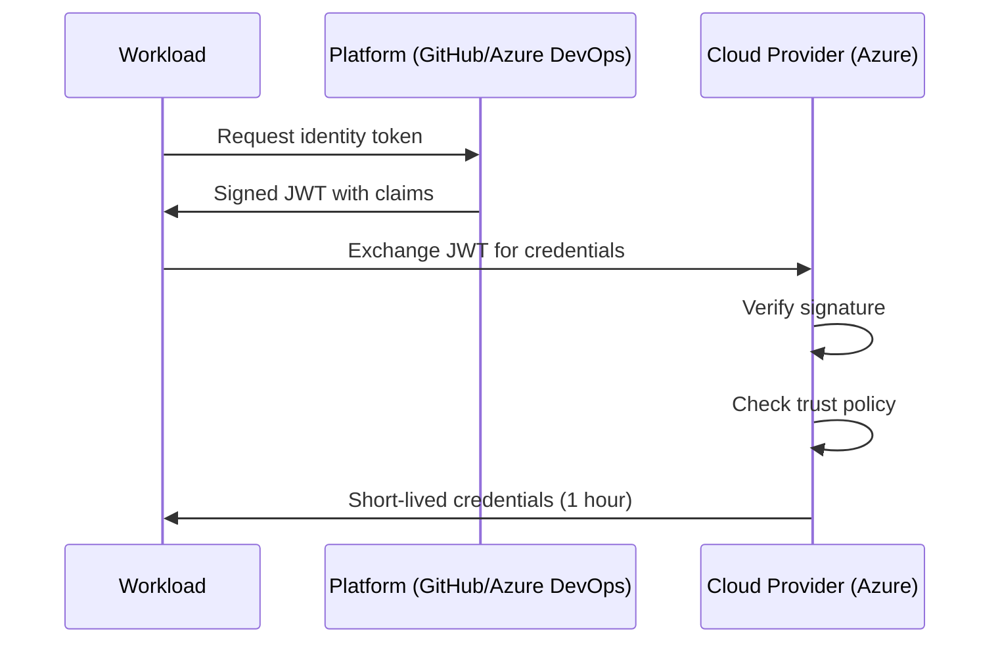

*[OIDC]: OpenID Connect
*[JWT]: JSON Web Token
*[STS]: Security Token Service
*[IAM]: Identity and Access Management
*[CI]: Continuous Integration
*[CD]: Continuous Deployment

It starts with a Slack message at 2 AM: "Why is there a $47,000 charge on our Azure bill?" You dig through the activity logs and find a cryptomining operation running in your subscription. The trail leads back to a service principal secret created eighteen months ago during a "quick proof of concept." Nobody remembers who created it. Nobody knows where else it might have been copied. And now you're explaining to leadership how a credential that was supposed to be temporary gave an attacker free rein over your infrastructure.

This scenario plays out constantly. Service account keys are the most common entry point for cloud breaches, and the attack vector is almost always the same: a static credential that was created, copied somewhere, and forgotten.

## The Hidden Risk of Long-Lived Keys

Service account keys are static credentials that live forever until explicitly rotated — which, in my experience, they almost never are. They get created during some late-night debugging session, copied to a CI variable, and then forgotten. Months later, they've proliferated to places nobody remembers.

The security model is fundamentally broken: you're distributing secrets that grant access, then hoping nobody loses track of them. But secrets spread. They end up in git history, in Slack messages, in screenshots of terminal sessions. Each copy is a potential breach waiting to happen.

| Risk Scenario | Impact | Detection Difficulty |
|---------------|--------|---------------------|
| Key leaked in git history | Full account access | Hard — requires scanning |
| Key shared via Slack or email | Credential sprawl | Very hard — no audit trail |
| Key stored in CI environment variables | Exposure via build logs | Medium — log analysis |
| Key never rotated | Extended compromise window | Easy — check creation date |
| Key with excessive permissions | Lateral movement after compromise | Medium — IAM analysis |
| Key owner left company | Orphaned access with no responsible party | Easy — compare against HR data |

Table: Common service account key risks and their detection difficulty.

The typical response is "we'll rotate keys regularly." But rotation doesn't solve the fundamental problem — you're still distributing secrets that can be stolen. You're just hoping to invalidate them before an attacker uses them. That's not security; it's a race condition.

What if you could eliminate the keys entirely?

## How Federation Changes the Model

Workload identity federation inverts the security model entirely. Instead of distributing secrets that prove identity, your workloads prove who they are through cryptographic assertions from platforms you already trust.

Here's the core insight: your CI/CD platform already knows which repository triggered a build, which branch it's running from, and which user initiated it. Your Kubernetes cluster already knows which pod is making a request and which service account it's running as. Why create a separate secret when the platform can vouch for the workload's identity directly?

The mechanism is OIDC — the same protocol that powers "Sign in with Google" on websites. Your workload requests a token from its platform (GitHub Actions, Azure Pipelines, Kubernetes), then exchanges that token with your cloud provider for short-lived credentials.



Figure: OIDC token exchange flow for workload identity federation.

The JWT contains claims about the workload — which repository triggered the build, which branch, which environment. Your cloud provider verifies the signature against the platform's public keys, checks that the claims match your access policy, and issues credentials that expire in an hour or less.

The critical claims in a GitHub Actions token look like this:

- _iss (issuer)_: Where the token came from — `https://token.actions.githubusercontent.com`
- _sub (subject)_: The specific workload identity — `repo:myorg/myrepo:ref:refs/heads/main`
- _aud (audience)_: Who the token is intended for — your cloud provider's token exchange endpoint

The entire exchange happens in milliseconds. Your workflow never sees a long-lived credential — just a token that expires in an hour and gets automatically refreshed if needed. There's nothing to rotate, nothing to leak, nothing to forget about in a CI variable.

## What Implementation Looks Like

Let's make this concrete with Azure. You need three things: a managed identity for your workload, a federated credential that trusts your CI platform, and a workflow that requests the token exchange.

First, the Terraform configuration that establishes trust between Azure and GitHub Actions:

```hcl title="modules/github-oidc/main.tf"
# User-assigned managed identity for CI/CD workloads
resource "azurerm_user_assigned_identity" "github_deploy" {
  name                = "github-actions-deploy"
  resource_group_name = azurerm_resource_group.main.name
  location            = azurerm_resource_group.main.location
}

# Federated credential trusting GitHub Actions
resource "azurerm_federated_identity_credential" "github_main" {
  name                = "github-main-branch"
  resource_group_name = azurerm_resource_group.main.name
  parent_id           = azurerm_user_assigned_identity.github_deploy.id

  audience = ["api://AzureADTokenExchange"]
  issuer   = "https://token.actions.githubusercontent.com"
  subject  = "repo:myorg/myrepo:ref:refs/heads/main"
}

# Grant the identity permission to deploy
resource "azurerm_role_assignment" "deploy_contributor" {
  scope                = azurerm_resource_group.main.id
  role_definition_name = "Contributor"
  principal_id         = azurerm_user_assigned_identity.github_deploy.principal_id
}
```

Code: Terraform configuration for Azure federated identity with GitHub Actions.

The `subject` field is where you control access. This configuration only allows the `main` branch of a specific repository to assume this identity. A feature branch or a different repository would be rejected, even if the token is cryptographically valid.

Now the GitHub Actions workflow that uses federation:

```yaml title=".github/workflows/deploy.yml"
name: Deploy to Azure
on:
  push:
    branches: [main]

permissions:
  id-token: write
  contents: read

jobs:
  deploy:
    runs-on: ubuntu-latest
    steps:
      - uses: actions/checkout@v4

      - uses: azure/login@v2
        with:
          client-id: ${{ secrets.AZURE_CLIENT_ID }}
          tenant-id: ${{ secrets.AZURE_TENANT_ID }}
          subscription-id: ${{ secrets.AZURE_SUBSCRIPTION_ID }}

      - name: Deploy infrastructure
        run: |
          az deployment group create \
            --resource-group production \
            --template-file infrastructure/main.bicep
```

Code: GitHub Actions workflow using Azure federated identity.

Notice what's _not_ in this workflow: no `AZURE_CLIENT_SECRET`, no service principal key, no credential that could be extracted and reused elsewhere. The `id-token: write` permission tells GitHub to make OIDC tokens available, and the Azure login action handles the token exchange automatically.

The `client-id`, `tenant-id`, and `subscription-id` aren't secrets in the security sense — they're identifiers that tell Azure which identity to check. An attacker who obtains these values can't authenticate; they'd also need to be running in the correct GitHub repository on the correct branch.

Similar patterns work for GCP (Workload Identity Federation), AWS (IAM OIDC providers), and Kubernetes clusters running on any of these platforms. The configuration details differ, but the concept is identical: replace static secrets with cryptographic proof of identity. (The full guide linked below covers Kubernetes workload identity for EKS, GKE, and AKS in detail.)

## Migration Path

If you're convinced but wondering where to begin, start with your highest-risk credentials: CI/CD pipelines that deploy to production. These typically have broad permissions and are the most attractive target for attackers.

The migration doesn't have to be disruptive. Configure federation alongside your existing keys, verify it works in a non-production environment, then switch production workflows over. Keep the old keys disabled (not deleted) for a week or two in case something breaks, then remove them entirely.

The configuration is well-documented, the failure modes are debuggable (usually a mismatch between token claims and trust policy), and the security improvement is substantial. You're eliminating an entire category of credential that can be stolen, leaked, or forgotten.

This is also where infrastructure security is heading more broadly. Projects like SPIFFE and SPIRE are extending these patterns beyond cloud providers to service-to-service authentication across heterogeneous environments. As infrastructure becomes more dynamic — more containers, more serverless, more cross-cloud — the case for ephemeral, identity-based credentials only gets stronger. The investments you make now in federation infrastructure will pay dividends as these patterns mature.

---

## CTA

_Title:_ Get the Complete Implementation Guide

_Body:_ This article covers the fundamentals of workload identity federation. The full guide goes deeper: complete Terraform configurations for AWS, GCP, and Azure, Kubernetes workload identity setup for EKS, GKE, and AKS, migration strategies for existing infrastructure, and a troubleshooting reference for common failure modes. Download it to start eliminating long-lived credentials from your infrastructure.
