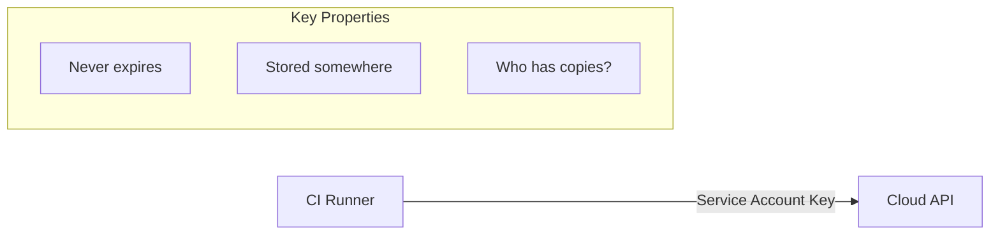
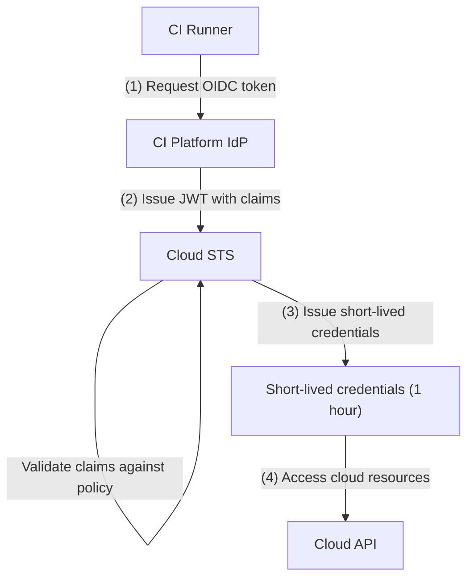
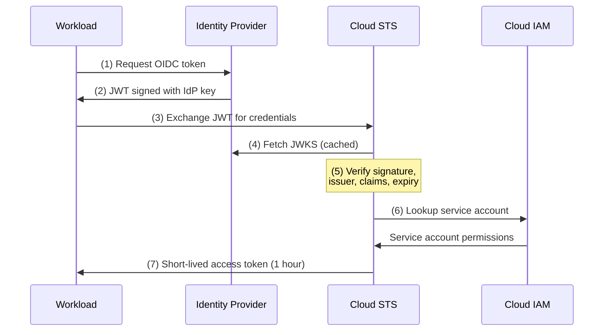
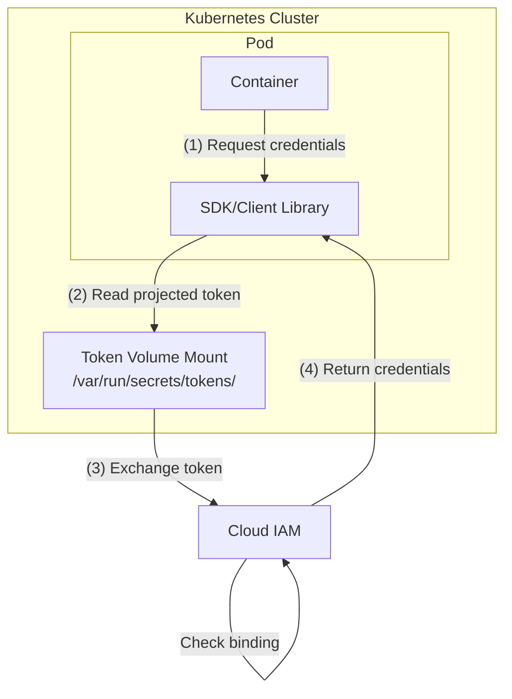

*[CEL]: Common Expression Language
*[EKS]: Elastic Kubernetes Service
*[GCP]: Google Cloud Platform
*[GKE]: Google Kubernetes Engine
*[IAM]: Identity and Access Management
*[IdP]: Identity Provider
*[JWKS]: JSON Web Key Set
*[JWT]: JSON Web Token
*[OIDC]: OpenID Connect
*[STS]: Security Token Service
*[SPIFFE]: Secure Production Identity Framework for Everyone

If you've ever inherited a CI/CD pipeline and found service account keys created by someone who left three years ago, you know the feeling. Nobody knows where the copies are. Nobody's rotated them. You're stuck wondering whether to touch them or leave them alone because _something_ might break.

Workload identity federation offers a way out: instead of managing secrets that can be stolen, your workloads prove who they are and receive short-lived credentials that expire before anyone could misuse them.

## The Problem with Long-Lived Keys

Service account keys are static credentials that live forever until explicitly rotated — which, in my experience, they almost never are. They're created during some late-night debugging session, copied to a CI variable, and then forgotten. Months later, they've proliferated to places nobody remembers.

### Key Management Failures

I've seen the same pattern play out at multiple organizations. A key gets created for a specific purpose — say, deploying from a CI pipeline. It has broad permissions because scoping it properly would take extra time, and the person creating it is under pressure to ship something. Over the next year, that key gets copied to additional repos "for convenience," stored in `.env` files that eventually get committed, and shared via Slack when someone needs access quickly.

The typical lifecycle looks something like this:

- Day 0: Key created for CI pipeline deployment
- Day 30: Key copied to a second repo because someone needed the same access
- Day 90: Developer stores key in `.env` file for local testing
- Day 180: `.env` file accidentally committed to git
- Day 181: Git history rewritten, but the key remains in the reflog
- Day 365: Repository made public for an open source release
- Day 366: Automated scanners find the key in git history
- Day 367: Cryptomining instances spinning up in your account

The really insidious part is that most of this happens without anyone noticing. Keys don't send notifications when they're copied. Git doesn't warn you when you're about to expose credentials in a repository you're making public.

| Risk | Impact | Detection Difficulty |
|------|--------|---------------------|
| Key leaked in git history | Full account access | Hard — requires scanning |
| Key shared via Slack or email | Credential sprawl | Very hard — no audit trail |
| Key stored in CI environment variables | Exposure via build logs | Medium — log analysis |
| Key never rotated | Extended compromise window | Easy — check creation date |
| Key with excessive permissions | Lateral movement after compromise | Medium — IAM analysis |
| Key owner left company | Orphaned access with no responsible party | Easy — compare against HR data |

Table: Common service account key risks and their detectability.

<Callout type="danger">
Every long-lived credential is an attack vector. Service account keys have been the root cause of major cloud breaches — including some you've probably read about in the news. Workload identity federation eliminates this entire category of risk by replacing static keys with short-lived, automatically-rotated tokens.
</Callout>

### The Federation Alternative

Workload identity federation inverts the security model. Instead of distributing secrets that prove identity, workloads prove who they are through cryptographic assertions from a trusted identity provider — typically the platform they're already running on.

Here's the conceptual difference. With long-lived keys, your CI runner holds a secret that grants access — and that secret can be copied, leaked, or stolen at any point in its lifetime.



Figure: Long-lived key authentication model.

With federation, your CI runner requests a token from its platform, then exchanges that token with your cloud provider:



Figure: Workload identity federation authentication flow.

The JWT contains claims about the workload — which repository triggered the build, which branch, which user initiated it. Your cloud provider verifies the signature against the identity provider's public keys, checks that the claims match your access policy, and issues credentials that expire in an hour or less.

There's nothing to leak. The OIDC token is only valid for a few minutes and is scoped to your specific cloud provider. The credentials your workload receives expire quickly and are never written to disk or stored anywhere persistent.

## Federation Mechanics

To really understand what's happening when you set up workload identity, you need to understand the token structure and exchange process. This isn't just academic — when federation breaks (and it will, at some point), you'll need to debug token claims, verify signatures, and trace through the exchange flow.

### OIDC Token Anatomy

The core of workload identity is a JWT — a JSON Web Token that contains claims about who's requesting access. When your GitHub Actions workflow runs, it can request an OIDC token from GitHub's identity provider. That token looks something like this when decoded:

```json title="Decoded GitHub Actions OIDC token payload"
{
  "iss": "https://token.actions.githubusercontent.com",
  "sub": "repo:myorg/myrepo:environment:production",
  "aud": "sts.amazonaws.com",
  "exp": 1706400000,
  "iat": 1706396400,
  "repository": "myorg/myrepo",
  "repository_owner": "myorg",
  "repository_visibility": "private",
  "actor": "developer",
  "workflow": "deploy.yml",
  "ref": "refs/heads/main",
  "ref_type": "branch",
  "environment": "production",
  "runner_environment": "github-hosted"
}
```

Code: Standard and GitHub-specific claims in an OIDC token.

The key claims for access control are:

- **iss (issuer)**: Where the token came from — GitHub's OIDC endpoint in this case
- **sub (subject)**: The unique identifier for the workload, which varies based on context (branch, environment, pull request)
- **aud (audience)**: Who the token is intended for — your cloud provider's token exchange endpoint
- **repository** and **repository_owner**: Which repo triggered the workflow
- **ref**: The git reference (branch or tag) being built
- **environment**: The GitHub Environment, if you're using environment protection rules

The token is signed with GitHub's private key. Your cloud provider fetches GitHub's public keys from their well-known JWKS endpoint and verifies the signature before trusting any claims.

### Token Exchange Flow

The exchange process involves four parties: your workload, the identity provider (GitHub), the cloud's Security Token Service, and the cloud's IAM system.



Figure: Token exchange sequence from workload to cloud credentials.

Here's what's happening at each step:

1. Your workflow requests an OIDC token from GitHub, specifying the intended audience (your cloud provider)
2. GitHub signs a JWT containing claims about the workflow context
3. Your workflow sends this JWT to your cloud provider's STS endpoint
4. STS fetches (or retrieves from cache) GitHub's public keys to verify the signature
5. STS validates everything: signature, issuer is trusted, claims match your policy, token isn't expired
6. STS looks up which service account this workload should assume based on attribute mappings
7. STS returns short-lived credentials scoped to that service account's permissions

The entire exchange happens in milliseconds. Your workflow never sees a long-lived credential — just a token that expires in an hour and gets automatically refreshed if needed.

### Attribute Mapping and Conditions

The real power of workload identity is in the attribute mapping and conditions. You can create fine-grained policies that restrict access based on any claim in the OIDC token.

For AWS, you define conditions in IAM trust policies:

```json title="AWS IAM trust policy condition for GitHub Actions"
{
  "Condition": {
    "StringEquals": {
      "token.actions.githubusercontent.com:aud": "sts.amazonaws.com",
      "token.actions.githubusercontent.com:sub": "repo:myorg/myrepo:environment:production"
    }
  }
}
```

Code: Restricting role assumption to a specific repository and environment.

For GCP, you use CEL (Common Expression Language) in attribute conditions:

```cel title="GCP Workload Identity attribute condition"
attribute.repository_owner == "myorg" &&
attribute.repository == "myorg/production-deploy" &&
attribute.ref == "refs/heads/main" &&
attribute.environment == "production"
```

Code: CEL expression restricting access to main branch production deployments.

This is where you prevent the "deploy key can deploy anything from anywhere" problem. With proper conditions, a workflow can only assume the production deployment role if it's running from the main branch of the correct repository, in the production environment. A pull request build or a workflow from a different repo gets denied at the STS level before it ever touches your cloud resources.

## Provider Configuration

Setting up workload identity federation requires configuring both sides of the trust relationship: the OIDC provider registration in your cloud account and the workflow configuration that requests tokens. Each cloud provider has slightly different terminology and resource structures, but the core concepts are the same.

### AWS: IAM Roles for GitHub Actions

AWS uses IAM OIDC identity providers and IAM roles with trust policies. You register GitHub as a trusted identity provider, create a role with conditions on which tokens can assume it, and attach the permissions you need.

```hcl title="modules/github-oidc/main.tf"
# Register GitHub Actions as an OIDC provider
resource "aws_iam_openid_connect_provider" "github" {
  url             = "https://token.actions.githubusercontent.com"
  client_id_list  = ["sts.amazonaws.com"]
  thumbprint_list = ["6938fd4d98bab03faadb97b34396831e3780aea1"]

  tags = {
    Purpose = "GitHub Actions OIDC federation"
  }
}

# IAM role that GitHub Actions workflows can assume
resource "aws_iam_role" "github_actions_deploy" {
  name = "github-actions-deploy"

  assume_role_policy = jsonencode({
    Version = "2012-10-17"
    Statement = [
      {
        Effect = "Allow"
        Principal = {
          Federated = aws_iam_openid_connect_provider.github.arn
        }
        Action = "sts:AssumeRoleWithWebIdentity"
        Condition = {
          StringEquals = {
            "token.actions.githubusercontent.com:aud" = "sts.amazonaws.com"
          }
          StringLike = {
            "token.actions.githubusercontent.com:sub" = "repo:myorg/myrepo:ref:refs/heads/main"
          }
        }
      }
    ]
  })
}

# Attach deployment permissions to the role
resource "aws_iam_role_policy" "deploy_permissions" {
  name = "deploy-permissions"
  role = aws_iam_role.github_actions_deploy.id

  policy = jsonencode({
    Version = "2012-10-17"
    Statement = [
      {
        Sid    = "ECRAccess"
        Effect = "Allow"
        Action = [
          "ecr:GetAuthorizationToken",
          "ecr:BatchCheckLayerAvailability",
          "ecr:PutImage",
          "ecr:InitiateLayerUpload",
          "ecr:UploadLayerPart",
          "ecr:CompleteLayerUpload"
        ]
        Resource = "*"
      },
      {
        Sid    = "ECSDeployment"
        Effect = "Allow"
        Action = [
          "ecs:UpdateService",
          "ecs:DescribeServices",
          "ecs:DescribeTaskDefinition",
          "ecs:RegisterTaskDefinition"
        ]
        Resource = [
          "arn:aws:ecs:us-east-1:*:service/production-cluster/*",
          "arn:aws:ecs:us-east-1:*:task-definition/production-*"
        ]
      }
    ]
  })
}
```

Code: Terraform module for AWS OIDC federation with GitHub Actions.

The `thumbprint_list` value is GitHub's certificate thumbprint — AWS uses this to verify it's actually talking to GitHub's OIDC endpoint. The trust policy's `Condition` block is where you restrict which workflows can assume the role. Here, only the main branch of a specific repo can assume this role.

On the workflow side, you need to request the `id-token: write` permission and use the official AWS credentials action:

```yaml title=".github/workflows/deploy.yml"
name: Deploy to AWS

on:
  push:
    branches: [main]

permissions:
  id-token: write
  contents: read

jobs:
  deploy:
    runs-on: ubuntu-latest
    steps:
      - uses: actions/checkout@v4

      - name: Configure AWS credentials
        uses: aws-actions/configure-aws-credentials@v4
        with:
          role-to-assume: arn:aws:iam::<12-digit AWS Account ID>:role/github-actions-deploy
          aws-region: us-east-1

      - name: Deploy to ECS
        run: |
          aws ecs update-service \
            --cluster production-cluster \
            --service web-service \
            --force-new-deployment
```

Code: GitHub Actions workflow using OIDC to deploy to AWS ECS.

Notice there are no `AWS_ACCESS_KEY_ID` or `AWS_SECRET_ACCESS_KEY` secrets. The workflow requests an OIDC token, exchanges it with AWS STS, and receives temporary credentials that expire in an hour.

### GCP: Workload Identity Federation

GCP's model is slightly more complex: you create a Workload Identity Pool (a container for identity providers), add a provider to that pool, and then bind external identities to GCP service accounts.

```hcl title="modules/github-workload-identity/main.tf"
# Identity pool groups external identity providers
resource "google_iam_workload_identity_pool" "github" {
  project                   = var.project_id
  workload_identity_pool_id = "github-actions-pool"
  display_name              = "GitHub Actions Pool"
  description               = "Identity pool for GitHub Actions workflows"
}

# Add GitHub as a provider within the pool
resource "google_iam_workload_identity_pool_provider" "github" {
  project                            = var.project_id
  workload_identity_pool_id          = google_iam_workload_identity_pool.github.workload_identity_pool_id
  workload_identity_pool_provider_id = "github-provider"
  display_name                       = "GitHub Actions Provider"

  oidc {
    issuer_uri = "https://token.actions.githubusercontent.com"
  }

  # Map GitHub token claims to GCP attributes
  attribute_mapping = {
    "google.subject"             = "assertion.sub"
    "attribute.actor"            = "assertion.actor"
    "attribute.repository"       = "assertion.repository"
    "attribute.repository_owner" = "assertion.repository_owner"
    "attribute.ref"              = "assertion.ref"
  }

  # Only accept tokens from our organization
  attribute_condition = "assertion.repository_owner == 'myorg'"
}

# Service account that external identities will impersonate
resource "google_service_account" "github_actions" {
  project      = var.project_id
  account_id   = "github-actions-deploy"
  display_name = "GitHub Actions Deploy"
}

# Allow specific repository to impersonate this service account
resource "google_service_account_iam_binding" "github_actions_impersonation" {
  service_account_id = google_service_account.github_actions.name
  role               = "roles/iam.workloadIdentityUser"

  members = [
    "principalSet://iam.googleapis.com/${google_iam_workload_identity_pool.github.name}/attribute.repository/myorg/production-deploy"
  ]
}

# Grant the service account permissions to deploy
resource "google_project_iam_member" "github_actions_gke" {
  project = var.project_id
  role    = "roles/container.developer"
  member  = "serviceAccount:${google_service_account.github_actions.email}"
}
```

Code: Terraform configuration for GCP Workload Identity Federation with GitHub.

The `attribute_mapping` block translates GitHub's token claims into GCP attributes that you can reference in IAM bindings. The `principalSet` member format lets you grant access based on those mapped attributes — here, any workflow from a specific repository.

### Azure: Federated Identity Credentials

Azure's approach uses App Registrations (also called service principals) with federated identity credentials. Each federated credential specifies exactly which external identity can authenticate as that app registration.

```hcl title="modules/github-federated-identity/main.tf"
# App registration acts as the identity for GitHub Actions
resource "azuread_application" "github_actions" {
  display_name = "github-actions-deploy"
  owners       = [data.azuread_client_config.current.object_id]
}

resource "azuread_service_principal" "github_actions" {
  client_id = azuread_application.github_actions.client_id
  owners    = [data.azuread_client_config.current.object_id]
}

# Federated credential for main branch deployments
resource "azuread_application_federated_identity_credential" "github_main" {
  application_id = azuread_application.github_actions.id
  display_name   = "github-actions-main-branch"
  description    = "GitHub Actions federation for main branch"

  audiences = ["api://AzureADTokenExchange"]
  issuer    = "https://token.actions.githubusercontent.com"
  subject   = "repo:myorg/myrepo:ref:refs/heads/main"
}

# Separate credential for production environment (GitHub Environments)
resource "azuread_application_federated_identity_credential" "github_production" {
  application_id = azuread_application.github_actions.id
  display_name   = "github-actions-production-env"
  description    = "GitHub Actions federation for production environment"

  audiences = ["api://AzureADTokenExchange"]
  issuer    = "https://token.actions.githubusercontent.com"
  subject   = "repo:myorg/myrepo:environment:production"
}

# Grant permissions on the resource group
resource "azurerm_role_assignment" "github_actions_contributor" {
  scope                = azurerm_resource_group.production.id
  role_definition_name = "Contributor"
  principal_id         = azuread_service_principal.github_actions.object_id
}
```

Code: Terraform configuration for Azure federated identity with GitHub Actions.

One quirk with Azure: you need separate federated identity credentials for different subject patterns. If you want to allow both branch-based deployments and environment-based deployments, you need two credentials. This is more explicit than AWS or GCP's wildcard support, which can be either a benefit (clearer audit trail) or an annoyance (more resources to manage).

### CI Platform Workflow Configuration

The workflow configuration follows the same pattern across providers. Here's the complete GitHub Actions example for AWS:

```yaml title=".github/workflows/deploy.yml"
name: Deploy to AWS

on:
  push:
    branches: [main]

permissions:
  id-token: write
  contents: read

jobs:
  deploy:
    runs-on: ubuntu-latest
    steps:
      - uses: actions/checkout@v4

      - name: Configure AWS credentials
        uses: aws-actions/configure-aws-credentials@v4
        with:
          role-to-assume: arn:aws:iam::123456789012:role/github-actions-deploy
          aws-region: us-east-1

      - name: Deploy to ECS
        run: |
          aws ecs update-service \
            --cluster production-cluster \
            --service web-service \
            --force-new-deployment
```

Code: GitHub Actions workflow using OIDC to deploy to AWS.

The key elements are the `permissions` block requesting `id-token: write` and the provider-specific authentication action. For GCP, you'd replace the AWS action with `google-github-actions/auth@v2` and specify a `workload_identity_provider` and `service_account`. For Azure, use `azure/login@v2` with `client-id`, `tenant-id`, and `subscription-id` (identifiers, not secrets).

GitLab CI supports the same pattern. The workflow configuration is slightly different:

```yaml title=".gitlab-ci.yml"
deploy:
  image: amazon/aws-cli:latest
  id_tokens:
    AWS_TOKEN:
      aud: https://gitlab.com
  script:
    - >
      export $(printf "AWS_ACCESS_KEY_ID=%s AWS_SECRET_ACCESS_KEY=%s AWS_SESSION_TOKEN=%s"
      $(aws sts assume-role-with-web-identity
      --role-arn arn:aws:iam::123456789012:role/gitlab-deploy
      --role-session-name "GitLabRunner-${CI_PROJECT_ID}-${CI_PIPELINE_ID}"
      --web-identity-token $AWS_TOKEN
      --duration-seconds 3600
      --query 'Credentials.[AccessKeyId,SecretAccessKey,SessionToken]'
      --output text))
    - aws ecs update-service --cluster production-cluster --service web-service --force-new-deployment
  rules:
    - if: $CI_COMMIT_BRANCH == "main"
```

Code: GitLab CI pipeline using OIDC to deploy to AWS.

The `id_tokens` block requests an OIDC token with the specified audience. GitLab's token claims include `project_path`, `ref`, and `environment`, which you reference in your trust policy conditions.

## Kubernetes Workload Identity

CI/CD pipelines aren't the only place where workload identity matters. Applications running in Kubernetes often need to access cloud services — reading from S3, publishing to Pub/Sub, accessing secrets from a vault. Traditionally, you'd inject cloud credentials as environment variables or mount them as files. Workload identity for Kubernetes eliminates this by letting pods authenticate using their Kubernetes service account.

The pattern is similar to CI/CD federation: Kubernetes issues a service account token, your pod exchanges it with the cloud provider, and receives short-lived credentials. The key difference is that Kubernetes clusters have their own OIDC identity provider built in — you register your cluster as a trusted issuer with your cloud account.

### EKS Pod Identity

AWS calls this IAM Roles for Service Accounts (IRSA). Each EKS cluster has an OIDC issuer URL, and you register that as an identity provider in IAM. Then you create IAM roles with trust policies that allow specific Kubernetes service accounts to assume them.

```hcl title="modules/eks-irsa/main.tf"
# Get the OIDC issuer URL from your EKS cluster
data "aws_eks_cluster" "cluster" {
  name = var.cluster_name
}

# Register the cluster's OIDC provider with IAM
resource "aws_iam_openid_connect_provider" "eks" {
  url             = data.aws_eks_cluster.cluster.identity[0].oidc[0].issuer
  client_id_list  = ["sts.amazonaws.com"]
  thumbprint_list = [data.tls_certificate.eks.certificates[0].sha1_fingerprint]
}

# IAM role that a specific service account can assume
resource "aws_iam_role" "app_s3_access" {
  name = "eks-app-s3-access"

  assume_role_policy = jsonencode({
    Version = "2012-10-17"
    Statement = [
      {
        Effect = "Allow"
        Principal = {
          Federated = aws_iam_openid_connect_provider.eks.arn
        }
        Action = "sts:AssumeRoleWithWebIdentity"
        Condition = {
          StringEquals = {
            "${replace(aws_iam_openid_connect_provider.eks.url, "https://", "")}:sub" = "system:serviceaccount:production:app-service-account"
            "${replace(aws_iam_openid_connect_provider.eks.url, "https://", "")}:aud" = "sts.amazonaws.com"
          }
        }
      }
    ]
  })
}

# Attach the permissions your app needs
resource "aws_iam_role_policy" "app_s3_access" {
  name = "s3-access"
  role = aws_iam_role.app_s3_access.id

  policy = jsonencode({
    Version = "2012-10-17"
    Statement = [
      {
        Effect   = "Allow"
        Action   = ["s3:GetObject", "s3:PutObject", "s3:ListBucket"]
        Resource = ["arn:aws:s3:::app-data-bucket", "arn:aws:s3:::app-data-bucket/*"]
      }
    ]
  })
}
```

Code: Terraform configuration for EKS IAM Roles for Service Accounts (IRSA).

The trust policy condition uses the service account's namespace and name (`system:serviceaccount:production:app-service-account`) as the subject. Only pods using that specific service account in that specific namespace can assume the role.

On the Kubernetes side, you annotate the service account with the IAM role ARN:

```yaml title="k8s/production/service-account.yaml"
apiVersion: v1
kind: ServiceAccount
metadata:
  name: app-service-account
  namespace: production
  annotations:
    eks.amazonaws.com/role-arn: arn:aws:iam::<12-digit AWS Account ID>:role/eks-app-s3-access
---
apiVersion: apps/v1
kind: Deployment
metadata:
  name: app
  namespace: production
spec:
  template:
    spec:
      serviceAccountName: app-service-account
      containers:
        - name: app
          image: myapp:latest
          env:
            - name: AWS_REGION
              value: us-east-1
```

Code: Kubernetes deployment using IRSA for AWS access.

The AWS SDK automatically detects it's running in an EKS pod with IRSA configured. It reads the projected service account token, exchanges it with STS, and uses the resulting credentials. No `AWS_ACCESS_KEY_ID` or `AWS_SECRET_ACCESS_KEY` needed.

### GKE Workload Identity

GCP's Workload Identity for GKE follows the same pattern but with different terminology. You bind a Kubernetes service account to a GCP service account, and pods using that KSA can authenticate as the GSA.

```hcl title="modules/gke-workload-identity/main.tf"
# GCP service account for the application
resource "google_service_account" "app" {
  account_id   = "app-workload"
  display_name = "Application Workload Identity"
}

# Allow the Kubernetes service account to impersonate this GCP service account
resource "google_service_account_iam_binding" "workload_identity" {
  service_account_id = google_service_account.app.name
  role               = "roles/iam.workloadIdentityUser"

  members = [
    "serviceAccount:${var.project_id}.svc.id.goog[production/app-ksa]"
  ]
}

# Grant the GCP service account permissions
resource "google_project_iam_member" "app_storage" {
  project = var.project_id
  role    = "roles/storage.objectViewer"
  member  = "serviceAccount:${google_service_account.app.email}"
}
```

Code: Terraform configuration for GKE Workload Identity.

The member format `serviceAccount:PROJECT.svc.id.goog[NAMESPACE/KSA_NAME]` binds a specific Kubernetes service account to the GCP service account. This is the authorization step — it says "pods using this KSA can act as this GSA."

```yaml title="k8s/production/workload-identity.yaml"
apiVersion: v1
kind: ServiceAccount
metadata:
  name: app-ksa
  namespace: production
  annotations:
    iam.gke.io/gcp-service-account: app-workload@myproject.iam.gserviceaccount.com
---
apiVersion: apps/v1
kind: Deployment
metadata:
  name: app
  namespace: production
spec:
  template:
    spec:
      serviceAccountName: app-ksa
      nodeSelector:
        iam.gke.io/gke-metadata-server-enabled: "true"
      containers:
        - name: app
          image: gcr.io/myproject/app:latest
```

Code: Kubernetes deployment using GKE Workload Identity.

The `nodeSelector` ensures your pod lands on a node with the GKE metadata server enabled — this is what intercepts metadata requests and provides the workload identity tokens. Without it, your pod would hit the underlying compute instance's metadata server instead.

### AKS Workload Identity

Azure Kubernetes Service uses Azure AD Workload Identity, which federates Kubernetes service account tokens with Azure AD. You create a managed identity, establish a federated credential linking it to your Kubernetes service account, and grant that identity permissions on Azure resources.

```hcl title="modules/aks-workload-identity/main.tf"
# User-assigned managed identity for the workload
resource "azurerm_user_assigned_identity" "app" {
  name                = "app-workload-identity"
  resource_group_name = azurerm_resource_group.main.name
  location            = azurerm_resource_group.main.location
}

# Federated credential linking AKS service account to managed identity
resource "azurerm_federated_identity_credential" "app" {
  name                = "app-federated-credential"
  resource_group_name = azurerm_resource_group.main.name
  parent_id           = azurerm_user_assigned_identity.app.id

  audience = ["api://AzureADTokenExchange"]
  issuer   = azurerm_kubernetes_cluster.main.oidc_issuer_url
  subject  = "system:serviceaccount:production:app-ksa"
}

# Grant the managed identity access to Azure resources
resource "azurerm_role_assignment" "app_storage" {
  scope                = azurerm_storage_account.data.id
  role_definition_name = "Storage Blob Data Reader"
  principal_id         = azurerm_user_assigned_identity.app.principal_id
}
```

Code: Terraform configuration for AKS Workload Identity.

The `subject` follows the Kubernetes service account format: `system:serviceaccount:NAMESPACE:SERVICE_ACCOUNT_NAME`. The cluster's OIDC issuer URL comes from enabling the OIDC issuer feature on your AKS cluster.

```yaml title="k8s/production/aks-workload-identity.yaml"
apiVersion: v1
kind: ServiceAccount
metadata:
  name: app-ksa
  namespace: production
  annotations:
    azure.workload.identity/client-id: "00000000-0000-0000-0000-000000000000"
  labels:
    azure.workload.identity/use: "true"
---
apiVersion: apps/v1
kind: Deployment
metadata:
  name: app
  namespace: production
spec:
  template:
    metadata:
      labels:
        azure.workload.identity/use: "true"
    spec:
      serviceAccountName: app-ksa
      containers:
        - name: app
          image: myacr.azurecr.io/app:latest
```

Code: Kubernetes deployment using AKS Workload Identity.

The `azure.workload.identity/client-id` annotation tells the Azure Identity SDK which managed identity to authenticate as. The `azure.workload.identity/use: "true"` label on both the ServiceAccount and pod enables the workload identity webhook to inject the required environment variables and token volume.

The flow inside the cluster looks like this:



Figure: Kubernetes workload identity token exchange flow.

The SDK reads a projected service account token from a volume mount, exchanges it with the cloud provider's STS, and receives short-lived credentials. The token is automatically rotated by the kubelet, so even if someone exfiltrates it, it's only valid for a short window.

## Migration Strategy

You're not going to migrate everything to workload identity in a weekend. In any organization with more than a handful of services, you've accumulated keys across CI pipelines, Kubernetes deployments, developer machines, and probably a few places nobody remembers. A successful migration requires inventory, prioritization, parallel authentication during transition, and careful retirement of old keys.

### Migration Planning

Start by figuring out what you have. Most cloud providers offer ways to list service account keys and their last-used timestamps. AWS has IAM credential reports; GCP has the Policy Analyzer; Azure has sign-in logs. But those only tell you _that_ a key was used, not _where_ it's being used from.

For each key, you need to answer:

- **What workload uses it?** CI pipeline, Kubernetes pod, application server, developer laptop?
- **Which platform?** GitHub Actions, GitLab CI, Jenkins, EKS, GKE, a VM somewhere?
- **Can it migrate?** Does the platform support OIDC federation? Some older CI systems don't.
- **What's the risk?** How old is the key? How broad are its permissions? Is it in production?

| Phase | Duration | Activities | Success Criteria |
|-------|----------|------------|------------------|
| Discovery | 1-2 weeks | Inventory all keys, identify usage, assess risk | Complete inventory with owner/usage mapping |
| Foundation | 2-4 weeks | Configure OIDC providers, create federated identities | Federation infrastructure deployed and tested |
| Pilot | 2-4 weeks | Migrate low-risk, non-production workloads | 3-5 workloads using federation successfully |
| Production | 4-8 weeks | Migrate production workloads systematically | All production workloads using federation |
| Retirement | 2-4 weeks | Disable then delete old keys | Zero active long-lived keys |

Table: Migration phases and timeline for workload identity adoption.

Prioritize based on risk. Keys that are old, overly permissioned, or used in production should migrate first — they represent the biggest exposure. Keys on platforms that don't support federation might require migrating the workload itself first (e.g., moving from Jenkins to GitHub Actions).

### Dual Authentication Period

Don't flip the switch all at once. Run both authentication methods in parallel during migration so you can verify federation works before removing the fallback.

```yaml title=".github/workflows/deploy-migration.yml"
name: Deploy (Migration Period)

on:
  push:
    branches: [main]

permissions:
  id-token: write
  contents: read

jobs:
  deploy:
    runs-on: ubuntu-latest
    steps:
      - uses: actions/checkout@v4

      # Try OIDC first
      - name: Configure AWS credentials (OIDC)
        id: oidc-auth
        uses: aws-actions/configure-aws-credentials@v4
        continue-on-error: true
        with:
          role-to-assume: arn:aws:iam::<12-digit AWS Account ID>:role/github-actions-deploy
          aws-region: us-east-1

      # Fallback to static key if OIDC fails
      - name: Configure AWS credentials (Key Fallback)
        if: steps.oidc-auth.outcome == 'failure'
        uses: aws-actions/configure-aws-credentials@v4
        with:
          aws-access-key-id: ${{ secrets.AWS_ACCESS_KEY_ID }}
          aws-secret-access-key: ${{ secrets.AWS_SECRET_ACCESS_KEY }}
          aws-region: us-east-1

      - name: Log authentication method
        run: |
          if [ "${{ steps.oidc-auth.outcome }}" == "success" ]; then
            echo "::notice::Using OIDC federation"
          else
            echo "::warning::Fell back to static key — investigate OIDC failure"
          fi

      - name: Deploy
        run: ./deploy.sh
```

Code: GitHub Actions workflow with OIDC primary and static key fallback.

This pattern lets you deploy federation in production without risking downtime. If OIDC fails for any reason — misconfigured trust policy, transient GitHub outage, clock skew — the workflow falls back to the existing key. The warning annotation makes failures visible so you can investigate and fix the root cause.

<Callout type="info">
Enable CloudTrail (AWS), Cloud Audit Logs (GCP), or Azure Activity Logs to monitor which authentication method is being used. Look for `AssumeRoleWithWebIdentity` events to confirm federation is working, and track the ratio of federated vs key-based authentications over time.
</Callout>

### Key Retirement Checklist

Once federation is working and you've confirmed no workloads are using the old key, don't just delete it. Disable first, monitor, then delete.

The retirement sequence:

1. **Verify no recent usage**: Check CloudTrail or equivalent for any key usage in the last 30 days
2. **Disable the key**: This makes it unusable but recoverable if something breaks
3. **Monitor for 7-14 days**: Watch for authentication failures in your workloads
4. **Delete the key**: Only after the monitoring period passes without issues
5. **Document the retirement**: Record what was retired, when, and by whom for audit purposes

For AWS, you can automate the monitoring with a CloudWatch alarm on `AccessDenied` errors for the disabled key. If something was still using it, you'll see failures immediately and can re-enable while you investigate.

The temptation is to skip straight to deletion — after all, federation is working, why keep the key around? But I've seen cases where a forgotten cron job or an old developer script was still using a key that "nobody uses anymore." The disable-then-delete pattern catches these edge cases before they become production incidents.

## Failure Modes and Troubleshooting

Federation will break at some point. Maybe GitHub has an outage and your OIDC tokens can't be issued. Maybe someone renames a repository and the trust policy no longer matches. Maybe clock skew causes token validation to fail. Understanding the failure modes helps you diagnose issues quickly when they happen.

### Debugging Token Claims

When federation fails, your first step is to see what's actually in the token. Add a debug step to your workflow that decodes the JWT:

```yaml title=".github/workflows/debug-oidc.yml"
- name: Debug OIDC token claims
  run: |
    TOKEN=$(curl -s -H "Authorization: bearer $ACTIONS_ID_TOKEN_REQUEST_TOKEN" \
      "$ACTIONS_ID_TOKEN_REQUEST_URL&audience=sts.amazonaws.com")

    echo "Token claims:"
    echo "$TOKEN" | jq -r '.value' | cut -d. -f2 | base64 -d 2>/dev/null | jq .
```

Code: Workflow step to decode and display OIDC token claims.

This shows you exactly what GitHub put in the token. Compare the `sub`, `aud`, `repository`, `ref`, and `environment` claims against what your trust policy expects. The mismatch is usually obvious once you see them side by side.

<Callout type="warning">
The `sub` claim format changes based on workflow context. A branch push produces `repo:owner/repo:ref:refs/heads/branch`. A tag push produces `repo:owner/repo:ref:refs/tags/v1.0.0`. A workflow using GitHub Environments produces `repo:owner/repo:environment:production`. Make sure your trust policy conditions match the actual format for your deployment pattern.
</Callout>

### Common Failure Scenarios

Once you can see what's in the token, most federation failures fall into a few categories:

**Trust policy condition mismatch** is the most common issue. The `sub` claim in your OIDC token doesn't match what your trust policy expects. This happens when:

- You're building from a feature branch but the policy only allows `main`
- Someone renamed the repository
- You're running in a pull request context but the policy expects a branch ref
- The GitHub Environment name has a typo

The error usually looks like `AccessDenied: Not authorized to perform sts:AssumeRoleWithWebIdentity`. Compare the decoded `sub` claim against your trust policy condition — the mismatch is usually obvious.

**Audience mismatch** means the `aud` claim in your token doesn't match the `client_id_list` in your OIDC provider configuration. This typically means the workflow is requesting a token for a different audience than what you configured. Check that your workflow's audience parameter matches what's in your cloud provider's OIDC provider setup.

**Token expiration or clock skew** causes intermittent failures. OIDC tokens have short lifetimes (usually 5-10 minutes), and if there's clock drift between GitHub's servers and your cloud provider, tokens might appear expired. This usually manifests as "works on retry" — the retry gets a fresh token that validates correctly.

**OIDC provider unavailable** happens during platform outages. If GitHub's OIDC endpoint is down, your workflows can't get tokens. There's not much you can do except wait (or fall back to static keys if you're still in migration).

| Error | Likely Cause | Quick Fix |
|-------|--------------|-----------|
| `InvalidIdentityToken` | Token expired or malformed | Retry the workflow; check for clock skew |
| `AccessDenied: Not authorized` | Trust policy condition mismatch | Decode token, compare `sub` to policy |
| `Audience does not match` | Wrong audience in token request | Check workflow audience vs provider config |
| `WebIdentityErr: failed to retrieve` | OIDC endpoint unreachable | Check GitHub status; retry later |
| `Service account does not exist` | Deleted or wrong SA binding | Verify SA exists and binding is correct |

Table: Common federation errors and their resolutions.

## Conclusion

Long-lived service account keys are one of the most common — and most preventable — security vulnerabilities in cloud infrastructure. They accumulate over time, spread to places nobody tracks, and eventually show up in a breach notification or a cryptomining bill.

Workload identity federation eliminates this risk category entirely. Instead of managing secrets that can be stolen, your workloads prove their identity through cryptographic assertions from platforms you already trust. The credentials they receive expire in an hour and can't be exfiltrated in any meaningful way.

The setup isn't trivial — you need to configure OIDC providers, establish trust relationships, map claims to permissions, and update your CI/CD workflows. But once it's done, you have zero long-lived credentials to rotate, monitor, or accidentally expose.

Start with your highest-risk credentials: CI/CD pipelines that deploy to production. Configure federation alongside your existing keys, verify it works, then disable and delete the keys. The migration path is well-documented, the failure modes are debuggable, and the security improvement is substantial.

Looking ahead, workload identity is just one piece of the broader shift toward zero-trust infrastructure. Projects like SPIFFE and SPIRE are extending these patterns to service-to-service authentication, creating consistent identity frameworks across heterogeneous environments. As infrastructure becomes more dynamic — more containers, more serverless, more cross-cloud — the case for ephemeral, identity-based credentials only gets stronger. The investments you make now in federation infrastructure will pay dividends as these patterns mature.
