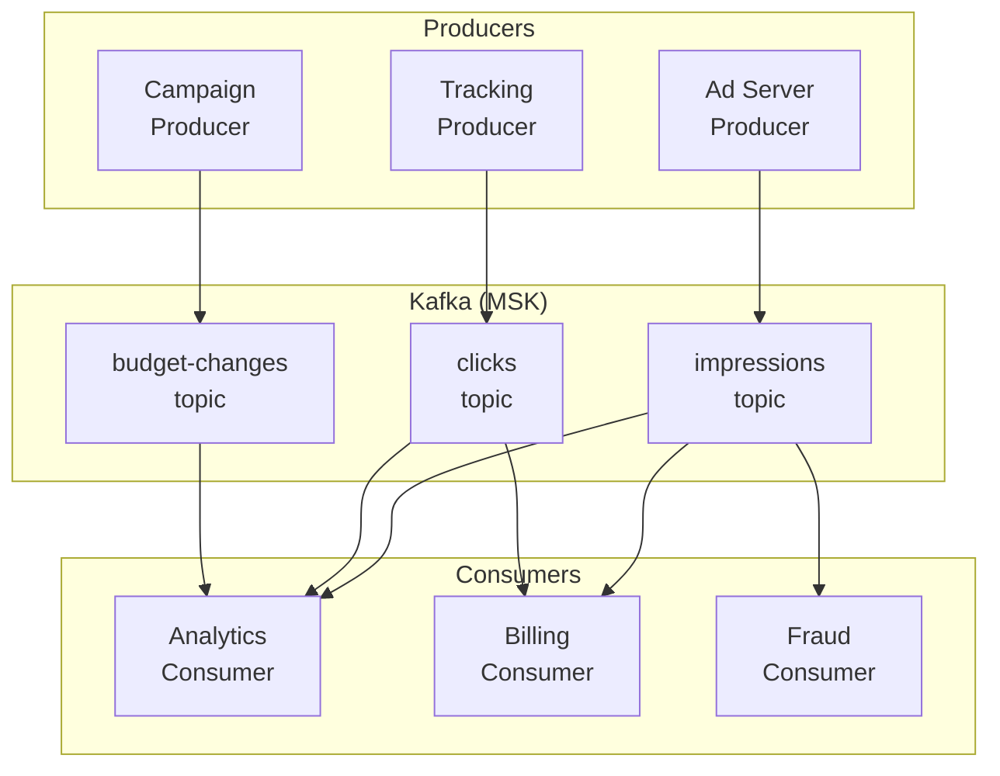

## Overview

I helped an adtech platform migrate from synchronous request/response to event-driven architecture—reducing analytics latency from 24 hours to under 5 seconds while eliminating the cascade failures that had plagued the system for years.

## The Challenge

The platform processed over 500 million events daily: ad impressions, clicks, conversions, and billing transactions. Thirty-plus services handled different aspects of the pipeline, all communicating via synchronous HTTP calls. When everything worked, the system hummed. When anything slowed down, everything fell over.

### The Coupling Problem

The architecture had evolved organically over five years. Each time a team needed data from another service, they added an API call. The impression service called the user service for audience data, the bidding service for pricing, the fraud service for validation. The bidding service called inventory, called pricing, called budget. Every service depended on several others responding within milliseconds.

This created invisible chains of dependency. When the fraud service had a slow garbage collection pause, the impression service backed up, which caused the bidding service to time out, which caused campaign pacing to break. One slow service could cascade into a platform-wide outage.

They averaged eight cascade failure incidents per month. Each one meant pagers going off, war rooms assembling, and frantic debugging to find which service had triggered the cascade. The system was fragile in ways that were hard to predict and harder to prevent.

### Analytics in the Dark Ages

The analytics pipeline was equally problematic. Customer dashboards showed data from the previous day—nightly batch jobs aggregated events and populated the reporting database. In an industry where campaigns adjust in real-time, 24-hour-old data was increasingly unacceptable.

Competitors were already offering real-time reporting. Customers were asking for it in every sales call. The product team had real-time dashboards on the roadmap, but the architecture couldn't support it. Building real-time analytics on top of synchronous request/response would require every service to expose streaming endpoints—a massive undertaking.

### The Constraints

Rewriting 30+ services wasn't feasible. The platform handled hundreds of millions in ad spend; extended downtime wasn't an option. Whatever we built needed to work alongside the existing system, with a gradual migration path that maintained functionality throughout.

Teams had varying levels of distributed systems experience. Some had worked with message queues; none had production experience with event streaming platforms. Any solution needed to be approachable, not just theoretically elegant.

## The Approach

### Mapping the Event Landscape

I started by mapping what events actually mattered. Not every API call should become an event—some are genuinely request/response (checking if a budget is exhausted before bidding). The goal was identifying the events that represented meaningful business state changes.

I interviewed each team about their data: what they produced, what they consumed, how stale it could be. The patterns were clear:

| Event Category | Producer | Consumers | Staleness Tolerance |
|----------------|----------|-----------|---------------------|
| Impressions | Ad server | Analytics, Billing, Fraud | Seconds |
| Clicks/Conversions | Tracking service | Analytics, Attribution | Seconds |
| Budget changes | Campaign service | Bidding, Pacing | Minutes |
| User segments | DMP (Data Management Platform) | Targeting, Analytics | Hours |
| Billing events | Billing service | Finance, Reporting | Minutes |

Table: Event categories and their latency requirements

The impression and click events were the highest volume and most latency-sensitive. Budget changes affected bidding behavior but could tolerate slight delays. User segment updates were already batch-processed daily.

### Technology Selection

For the event streaming platform, I evaluated Kafka (via AWS MSK, Managed Streaming for Apache Kafka), Amazon Kinesis, and SQS/SNS.

SQS was the simplest operationally but lacked replay capability. If a consumer had a bug that corrupted data, you couldn't reprocess from the beginning—the messages were gone. For analytics, replay is essential.

Kinesis was AWS-native but had limitations on consumer scaling and retention. The 7-day maximum retention (at the time) was constraining for some use cases.

Kafka (MSK) was operationally more complex but offered exactly what we needed: replay capability with configurable retention, strong ordering guarantees within partitions, consumer groups for scaling, and a mature ecosystem. The complexity was justified by the capabilities.

For schema management, I chose Confluent Schema Registry. When 30+ services exchange events, schema evolution is critical. The registry enforced compatibility—you couldn't deploy a producer that broke consumers.

### Phased Migration

The migration happened in three phases over six months:

**Phase 1: Infrastructure and Pilot (Months 1-2)**

- Deploy MSK cluster with appropriate capacity
- Implement Schema Registry and establish conventions
- Migrate billing events as pilot domain (lower volume, well-understood)
- Build monitoring dashboards for Kafka lag and throughput

**Phase 2: Analytics Events (Months 3-4)**

- Migrate impression and click events to Kafka
- Implement change data capture from the analytics database
- Build real-time aggregation with ksqlDB
- Deploy real-time dashboards (beta)

**Phase 3: Operational Events (Months 5-6)**

- Migrate budget and campaign events
- Remove synchronous dependencies from critical paths
- Implement dead letter topics and error handling
- Decommission legacy batch pipelines

## The Solution

### Event Streaming Architecture

The architecture centered on Kafka as the central nervous system. Services published events to topics and consumed events they cared about. The synchronous call chains dissolved into independent services reacting to events:



Figure: Event streaming architecture with Kafka as central hub

Each consumer group processed events at its own pace. If the fraud service slowed down, it fell behind on its consumer offset—but the ad server and analytics continued unaffected. The coupling was gone.

### Schema Management

Schema evolution was the hardest cultural change. In a request/response world, you could make breaking API changes and coordinate deployments. With events, consumers might be days behind on deployment—you need backward and forward compatibility.

I established strict schema conventions using Avro:

```json
{
  "type": "record",
  "name": "ImpressionEvent",
  "namespace": "com.platform.events.impressions",
  "fields": [
    {"name": "event_id", "type": "string"},
    {"name": "timestamp", "type": "long", "logicalType": "timestamp-millis"},
    {"name": "campaign_id", "type": "string"},
    {"name": "creative_id", "type": "string"},
    {"name": "placement_id", "type": "string"},
    {"name": "user_id", "type": ["null", "string"], "default": null},
    {"name": "bid_price_micros", "type": "long"},
    {"name": "win_price_micros", "type": "long"},
    {"name": "metadata", "type": {"type": "map", "values": "string"}, "default": {}}
  ]
}
```

Code: Avro schema for impression events with evolution-safe defaults

The Schema Registry enforced backward compatibility—new fields must have defaults, existing fields can't be removed. CI/CD pipelines validated schema changes before merge.

### Real-Time Analytics with ksqlDB

For the real-time dashboards, we used ksqlDB (a streaming SQL engine for Kafka) to process streams and materialize aggregations:

```sql
-- Create a stream from the impressions topic
CREATE STREAM impressions_stream (
  event_id VARCHAR,
  timestamp BIGINT,
  campaign_id VARCHAR,
  bid_price_micros BIGINT,
  win_price_micros BIGINT
) WITH (
  KAFKA_TOPIC = 'impressions',
  VALUE_FORMAT = 'AVRO'
);

-- Aggregate impressions per campaign per minute
CREATE TABLE campaign_impressions_per_minute AS
  SELECT
    campaign_id,
    WINDOWSTART as window_start,
    COUNT(*) as impression_count,
    SUM(win_price_micros) / 1000000.0 as spend_dollars
  FROM impressions_stream
  WINDOW TUMBLING (SIZE 1 MINUTE)
  GROUP BY campaign_id
  EMIT CHANGES;
```

Code: ksqlDB stream and aggregation table for real-time campaign metrics

The dashboard service queried these materialized tables via ksqlDB's REST API. Latency from impression to dashboard update: under 5 seconds. Customers could watch their campaigns in real-time for the first time.

### Change Data Capture

Some events originated from database writes rather than application code. Rather than retrofitting every service to publish events, we used Kafka Connect with Debezium (an open-source change data capture platform) for CDC:

```json
{
  "name": "campaigns-cdc-connector",
  "config": {
    "connector.class": "io.debezium.connector.postgresql.PostgresConnector",
    "database.hostname": "campaigns-db.internal",
    "database.dbname": "campaigns",
    "table.include.list": "public.campaigns,public.budgets",
    "topic.prefix": "cdc.campaigns",
    "transforms": "route",
    "transforms.route.type": "org.apache.kafka.connect.transforms.RegexRouter",
    "transforms.route.regex": "cdc.campaigns.public.(.*)",
    "transforms.route.replacement": "$1-changes"
  }
}
```

Code: Debezium connector configuration for capturing campaign database changes

When a campaign's budget changed in the database, Debezium captured the change and published it to Kafka. The bidding service consumed budget-changes events without any code changes to the campaign service.

### Error Handling and Dead Letters

Not every event processes successfully. A malformed event, a temporary downstream failure, or a bug in consumer code—all can cause processing to fail. We implemented dead letter topics for unprocessable events:

```java
@KafkaListener(topics = "impressions")
public void processImpression(ConsumerRecord<String, ImpressionEvent> record) {
    try {
        impressionProcessor.process(record.value());
    } catch (RetryableException e) {
        // Transient failure - will be retried automatically
        throw e;
    } catch (Exception e) {
        // Permanent failure - send to dead letter topic
        deadLetterProducer.send(
            "impressions-dlq",
            record.key(),
            DeadLetter.of(record, e)
        );
        log.error("Failed to process impression, sent to DLQ", e);
    }
}
```

Code: Kafka consumer with dead letter topic error handling

Dead letter topics were monitored. A spike in DLQ messages triggered alerts, and we had tooling to replay events after fixes were deployed.

### Tradeoffs

Kafka added operational complexity. MSK handles much of the infrastructure, but we still needed to manage topics, partitions, consumer group offsets, and schema compatibility. The team spent time learning Kafka's operational model.

We accepted this tradeoff because the alternatives were worse. SQS's lack of replay would have made debugging and recovery harder. Building real-time analytics without event streaming would have required invasive changes to every service.

The investment in learning paid off. Six months post-migration, the team was comfortable with Kafka patterns, and the operational burden was manageable with the monitoring we'd built.

## The Results

After six months, the transformation was measurable:

| Metric | Before | After |
|--------|--------|-------|
| Analytics latency | 24 hours | Under 5 seconds |
| Cascade failures | 8 incidents/month | 0 (services decoupled) |
| System throughput | Baseline | 3x increase (same infrastructure) |
| Feature velocity | Weeks per analytics feature | Days (just add a consumer) |
| Deployment coordination | Required across services | Independent deployments |

Table: Event-driven architecture migration outcomes

The business impact was immediate. The real-time dashboards became a competitive differentiator—sales closed deals they'd been losing to competitors. Campaign managers could optimize in real-time instead of waiting for next-day reports.

## Key Takeaways

- **Events decouple time and availability**: When services communicate via events, a slow consumer doesn't slow down producers. This eliminates cascade failures and lets teams work independently. The architectural benefit was more valuable than the real-time analytics.

- **Schema management is cultural change**: In request/response, you coordinate deployments. With events, you need contractual guarantees that schemas evolve safely. Investing in Schema Registry and compatibility rules early prevented painful breaking changes later.

- **Start with replay capability**: The ability to reprocess events from the beginning is invaluable for debugging, disaster recovery, and building new consumers. SQS's lack of replay would have been a constant limitation. Choose infrastructure that supports your future needs, not just today's.

## Cover Prompts

1. Abstract visualization of data flowing from multiple source nodes through a central streaming pipeline to multiple consumer endpoints, real-time pulse effects, dark background with glowing data streams in blue and orange

2. Split composition showing tangled synchronous API call chains on left transforming into clean event-driven architecture on right, before/after visual metaphor, technical diagram aesthetic

3. Isometric illustration of a Kafka cluster as a central hub with producers and consumers orbiting around it, event messages visualized as packets flowing through topics, modern tech infrastructure style

4. Real-time dashboard display showing live metrics updating, overlaid with flowing event stream visualization, adtech/analytics aesthetic with graphs and data points, dynamic motion blur effects
