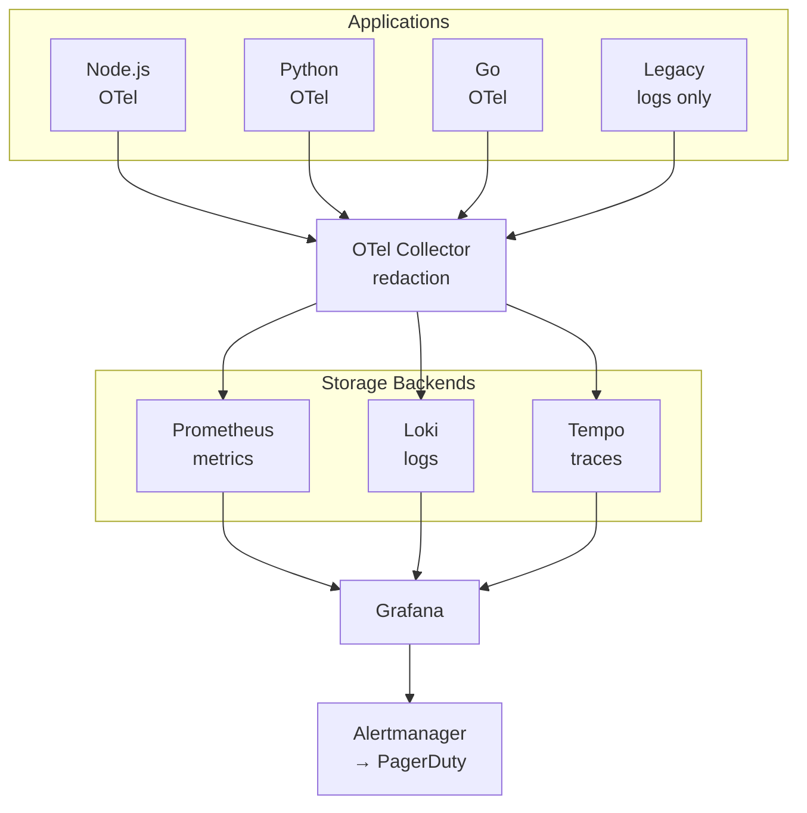

## Overview

A healthcare technology company with 60+ microservices had no way to see what was happening across their system. Debugging meant checking five different tools and hoping you could piece together the story. We implemented a unified observability stack with OpenTelemetry and Grafana, reducing mean time to detection from four hours to eight minutes while maintaining HIPAA compliance.

## The Challenge

The client was a healthcare technology company running 60+ microservices across a mix of Node.js, Python, and Go. The architecture had grown organically over five years. Each team had chosen their own monitoring tools. The result was observability fragmentation that made debugging nearly impossible.

When something went wrong, engineers faced a scavenger hunt. Metrics lived in CloudWatch. Some services sent logs to Elasticsearch, others to CloudWatch Logs, and a few to files on disk that required SSH to access. Traces existed for about 20% of services, scattered across X-Ray and Jaeger depending on who had built what. Nothing was connected.

The debugging workflow was painful: check CloudWatch metrics to see if something looked wrong, grep through three different log systems to find relevant errors, try to piece together the request flow from whatever traces existed, then give up and add more logging to figure out what actually happened. A single incident investigation could take hours of detective work.

Customers were often the alerting system. The company's mean time to detection was four hours—most of that time being "we didn't know there was a problem." Customers would report issues, then engineers would start investigating. This was embarrassing and damaging to customer trust.

The constraints added complexity. HIPAA compliance meant we couldn't just ship logs to any SaaS vendor. Protected health information appeared in logs, and it needed to stay within approved boundaries or be redacted before leaving. Budget was also tight—the company was growing but not yet profitable, and the leadership wouldn't approve enterprise observability pricing.

## The Approach

The first month was assessment and planning. I audited every existing monitoring tool, identified gaps, and evaluated vendors against their requirements.

The current state was worse than I'd expected:

| Signal | Tools in Use | Coverage | Correlation |
|--------|-------------|----------|-------------|
| Metrics | CloudWatch, StatsD, custom | 80% of services | None |
| Logs | CloudWatch Logs, Elasticsearch, files | 95% of services | None |
| Traces | X-Ray, Jaeger | 20% of services | Partial |

Table: Observability state before implementation

The core problem was clear: multiple tools with no correlation. Even where data existed, you couldn't follow a request across services. A trace ID in one system meant nothing in another.

The key decisions shaped everything that followed:

__OpenTelemetry for instrumentation.__ We needed vendor-neutral instrumentation that would work across all three languages and let us change backends later if needed. OpenTelemetry was the clear choice—it had become the industry standard, with solid SDKs for Node.js, Python, and Go.

__Grafana stack for backends.__ We evaluated Datadog, New Relic, and the Grafana stack (Prometheus, Loki, Tempo). Datadog would have cost $180K/year at their scale (60+ services, 45 engineers, approximately 500GB of logs and 2 billion metric data points per month). The Grafana stack, self-hosted on their existing Kubernetes infrastructure, cost about $30K/year in compute and storage. The feature gap was real—Datadog's UI is better—but not $150K/year better.

__Correlation IDs everywhere.__ Every request entering the system would get a trace ID that propagated through all services, appeared in all logs, and linked metrics to specific requests. This was the foundation that would make debugging possible.

The implementation rolled out over six months:

__Months 1-2: Foundation.__ We deployed the Grafana stack—Prometheus for metrics, Loki for logs, Tempo for traces, Grafana for visualization. We built the infrastructure and validated it worked before touching any application code.

__Months 3-4: Instrumentation.__ We added OpenTelemetry SDKs to all services, starting with the most critical paths. Auto-instrumentation handled HTTP and database calls. We added custom spans for business logic that needed visibility.

__Month 5: Log aggregation and compliance.__ We migrated all services to ship logs to Loki with proper formatting. We built a redaction pipeline to strip PHI before logs reached the aggregation layer.

__Month 6: Alerting and dashboards.__ We created service dashboards, built alerting rules based on SLOs, and integrated with PagerDuty. We trained the engineering team on the new tools.

The legacy services were the biggest obstacle. About 15 services were old enough that adding OpenTelemetry would have required significant refactoring. For these, we used a lighter-touch approach: log parsing to extract what correlation we could, and proxy-level tracing to at least see them in request flows.

## The Solution

### Architecture

The final architecture centered on OpenTelemetry for data collection and the Grafana stack for storage and visualization:



Figure: Observability architecture overview

### OpenTelemetry Instrumentation

Every service included the OpenTelemetry SDK configured to export traces, metrics, and logs to the central collector. The SDKs provided auto-instrumentation for common libraries—HTTP clients, database drivers, message queues—with minimal code changes.

For Node.js services (the majority), setup looked like this:

```javascript
// tracing.js - loaded before application code
const { NodeSDK } = require('@opentelemetry/sdk-node');
const { OTLPTraceExporter } = require('@opentelemetry/exporter-trace-otlp-grpc');
const { getNodeAutoInstrumentations } = require('@opentelemetry/auto-instrumentations-node');

const sdk = new NodeSDK({
  traceExporter: new OTLPTraceExporter({ url: process.env.OTEL_COLLECTOR_URL }),
  instrumentations: [getNodeAutoInstrumentations()],
  serviceName: process.env.SERVICE_NAME,
});

sdk.start();
```

Code: OpenTelemetry SDK initialization for Node.js services

The collector ran as a DaemonSet on each Kubernetes node, receiving telemetry from local pods and forwarding to the appropriate backend. This architecture reduced network hops and provided a central place for processing like redaction.

### PHI Redaction

HIPAA compliance required that protected health information not appear in logs or traces shipped to the observability stack. We built a redaction pipeline in the OpenTelemetry Collector:

```yaml
# otel-collector-config.yaml
processors:
  redaction:
    allow_all_keys: false
    blocked_values:
      - "\\b\\d{3}-\\d{2}-\\d{4}\\b"  # SSN pattern
      - "\\b[A-Z]{2}\\d{6}\\b"         # Member ID pattern
    redaction_masks:
      - key: "patient_name"
        mask: "[REDACTED]"
      - key: "date_of_birth"
        mask: "[REDACTED]"
```

Code: Collector configuration for PHI redaction

The redaction processor ran on all telemetry before it left the collector. We tested it extensively with sample PHI patterns to ensure nothing leaked through. The compliance team reviewed and approved the patterns.

### Correlation

The magic was in correlation. Every incoming request received a trace ID at the edge (or preserved one if the caller provided it). This ID propagated through all service calls, appeared in every log line, and tagged all metrics.

In Grafana, clicking a trace showed all related logs. Viewing a log line linked to the trace. Metric spikes could be drilled down to the specific traces that contributed. The three signals became one story.

We configured log formatting to include trace context automatically:

```json
{
  "timestamp": "2024-03-15T10:23:45.123Z",
  "level": "error",
  "message": "Failed to process claim",
  "service": "claims-processor",
  "trace_id": "abc123def456",
  "span_id": "789xyz",
  "error": "Invalid provider ID"
}
```

Code: Structured log format with trace context for Loki correlation

Grafana's Loki datasource recognized the `trace_id` field (this is the default field name Loki expects for trace correlation; it can be configured via the `derivedFields` setting in the Loki datasource) and linked directly to Tempo.

### Alerting

We replaced the scattered alerting setup with Alertmanager routing to PagerDuty. Alerts were defined based on SLOs rather than arbitrary thresholds:

- __Error rate alerts:__ Fire when error rate exceeds SLO burn rate
- __Latency alerts:__ Fire when P99 latency degrades beyond SLO
- __Availability alerts:__ Fire when synthetic checks fail

We implemented alert correlation to reduce noise. Multiple alerts from the same underlying incident grouped together, and engineers received one page with full context rather than a storm of individual alerts.

### Tradeoffs

The Grafana stack had real limitations compared to Datadog:

__UI polish.__ Datadog's interface is more intuitive. Grafana required more training.

__APM features.__ Datadog's automatic service maps and dependency detection are better. We built our own service map using trace data, but it required manual maintenance.

__Log search speed.__ Loki's query performance on large time ranges was slower than Datadog's. We mitigated this with better indexing and query optimization, but it remained a gap.

The $150K annual savings justified these tradeoffs for this client. For a company with a larger budget, Datadog might have been worth it.

## The Results

Six months after starting, the observability transformation was complete:

| Metric | Before | After | Change |
|--------|--------|-------|--------|
| Mean time to detection | 4 hours | 8 minutes | 97% reduction |
| Mean time to resolution | 6 hours | 45 minutes | 88% reduction |
| Alert noise | Baseline | -70% | Significant reduction |
| Issues resolved without escalation | ~20% | 80% | 4x improvement |
| HIPAA logging findings | N/A | Zero | Compliant |
| Annual tooling costs | $180K (Datadog est.) | $30K | $150K savings |

Table: Observability implementation outcomes

Alerts now fired on actual problems, not false positives—the team knew about issues before customers did. Correlated signals meant engineers could see the full picture immediately, eliminating the tool-hopping scavenger hunts. With proper observability, junior engineers could debug issues that previously required senior expertise.

The cultural change was significant too. Engineers started adding custom instrumentation proactively because they could see the value. "Let me add a span for this" became common in code reviews. Observability shifted from afterthought to design consideration.

## Key Takeaways

- __Correlation is the foundation.__ Individual metrics, logs, and traces have limited value. Connected signals that tell a coherent story are transformative. Start with trace IDs everywhere, then build on that foundation.
- __OpenTelemetry is the right bet.__ Vendor-neutral instrumentation means you can change backends without re-instrumenting. We chose the Grafana stack today, but if requirements change, we can switch without touching application code.
- __Self-hosted can work.__ The conventional wisdom is that observability should be SaaS. But for cost-conscious organizations with compliance requirements, self-hosted solutions like the Grafana stack are mature enough for production. The tradeoff is operational overhead, not capability.
