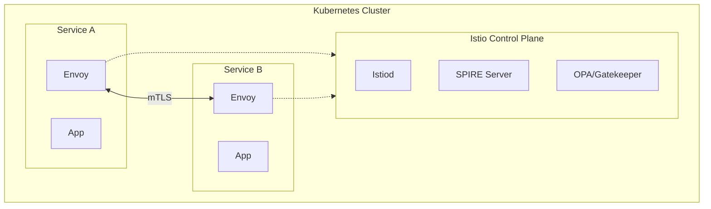

*[CISO]: Chief Information Security Officer

## Overview

I helped a financial services firm eliminate implicit network trust by implementing a service mesh with mTLS, SPIFFE workload identities, and policy-based authorization—encrypting 100% of service-to-service traffic and passing their SOC2 Type II audit with zero network security findings.

## The Challenge

The firm operated a hybrid environment: core trading systems on-premises with newer services in AWS. Over 100 microservices communicated across this boundary, protected by a traditional perimeter-based security model—firewalls at the edge, implicit trust inside.

### The Perimeter Illusion

Their security model assumed that traffic inside the network was safe. Services communicated over plaintext HTTP. Authentication happened at the edge; internal services trusted that if a request arrived, it must be legitimate. The firewall ruleset had grown to 200+ entries, maintained by a security team that couldn't keep up with the pace of new service deployments.

This wasn't unusual—it's how most organizations operated for years. But recent high-profile breaches in financial services had demonstrated the model's weakness: once an attacker gets inside the perimeter, they can move laterally with little resistance. A compromised service could access any other service it could reach on the network.

### Regulatory Pressure

Their upcoming SOC2 Type II audit added urgency. The auditors had flagged their network segmentation as a concern in the previous cycle. New regulatory guidance emphasized zero trust principles—"never trust, always verify"—and the firm needed to demonstrate progress.

Beyond compliance, the CISO had genuine security concerns. Threat modeling sessions revealed that a compromised developer laptop or supply chain attack could lead to broad data access. The blast radius of any breach was essentially unbounded.

### Constraints

A greenfield zero trust implementation would be straightforward—design it from the start. But they had 100+ services in production, many written by teams no longer with the company. Some were Java applications that could easily add mTLS libraries. Others were legacy services that assumed plaintext communication.

Performance was critical. Trading-adjacent systems had latency budgets measured in single-digit milliseconds. Any security layer that added noticeable latency would face pushback.

We needed a gradual approach: implement zero trust without breaking production, with a path for legacy services that couldn't be immediately modified.

## The Approach

### Mapping the Network

Before implementing anything, I needed to understand the current communication patterns. I deployed network flow analysis tools to capture which services talked to which, on what ports, at what volume.

The results were illuminating. Most services only communicated with 3-5 other services, but the firewall rules permitted communication with everything. Developers had requested broad rules ("allow app-tier to db-tier") rather than specific ones because the approval process was slow. The actual required connectivity was a fraction of what was permitted.

I built a service dependency graph that became our roadmap. It showed natural groupings—services that formed bounded contexts—and identified the high-risk communication paths that needed encryption first.

### Technology Selection

For the service mesh, I evaluated Istio and Linkerd. Both provide mTLS automatically, but Istio's authorization policy model was more mature and integrated better with OPA (Open Policy Agent) for complex policy decisions. The latency overhead was slightly higher than Linkerd, but the policy capabilities justified it for a financial services context.

For workload identity, I chose SPIFFE (Secure Production Identity Framework for Everyone) with SPIRE as the implementation. SPIFFE provides a standardized identity format that works across environments—crucial for their hybrid cloud. Instead of services authenticating with static credentials or API keys, they receive cryptographic identities attested by the infrastructure itself.

The combination: Istio handles the data plane (mTLS, traffic routing), SPIRE provides workload identity, and OPA handles authorization decisions. It's a layered architecture where each component does one thing well.

### Phased Rollout

Zero trust isn't a flag you flip—it's a journey. I designed a four-phase rollout:

| Phase | Focus | Risk Level |
|-------|-------|------------|
| 1: Mesh Installation | Install Istio sidecars in permissive mode; mTLS available but not required | Low |
| 2: Observability | Gain visibility via Kiali; map which services communicate and mTLS coverage | Low |
| 3: Policy Definition | Define authorization policies based on observed patterns; audit mode first | Medium |
| 4: Strict Mode | Enable mTLS strict mode; flip policies from audit to enforce | High |

Table: Zero trust implementation phases

The phased approach built confidence and caught issues early. Permissive mode let us validate the mesh without breaking production. Audit mode policies logged violations without blocking, giving us data before enforcement.

## The Solution

### Service Mesh Architecture

The architecture centered on Istio's sidecar proxy model. Every service pod gets an Envoy sidecar that handles mTLS termination, identity verification, and policy enforcement:



Figure: Zero trust architecture with Istio service mesh

The Envoy sidecars communicate only with other sidecars that present valid SPIFFE identities. The application code is unchanged—it still makes plaintext HTTP calls to localhost, and the sidecar handles encryption transparently.

### SPIFFE Workload Identity

SPIRE attestation replaced static credentials entirely. Each workload receives a SPIFFE Verifiable Identity Document (SVID) based on its Kubernetes service account and namespace:

```bash
spiffe://firm.internal/ns/trading/sa/order-service
```

Code: SPIFFE identity format for Kubernetes workloads

This identity is cryptographically bound to the workload. You can't steal it by grabbing an API key from a config file—it's derived from infrastructure attestation. When the order-service calls the pricing-service, the pricing-service verifies the caller's SVID before responding.

Certificate rotation happens automatically. SVIDs expire after one hour and refresh seamlessly. When we needed to revoke a compromised workload's access, we updated the SPIRE registration—propagation took seconds, not the hours required to rotate API keys across environments.

### Authorization Policies

mTLS gives you encryption and identity verification, but it doesn't limit who can call what. That's where authorization policies come in:

```yaml
apiVersion: security.istio.io/v1beta1
kind: AuthorizationPolicy
metadata:
  name: pricing-service-policy
  namespace: trading
spec:
  selector:
    matchLabels:
      app: pricing-service
  action: ALLOW
  rules:
  - from:
    - source:
        principals:
          - "cluster.local/ns/trading/sa/order-service"
          - "cluster.local/ns/trading/sa/risk-engine"
    to:
    - operation:
        methods: ["GET", "POST"]
        paths: ["/api/v1/prices/*", "/api/v1/quotes/*"]
```

Code: Istio AuthorizationPolicy restricting access to pricing-service

This policy says: only order-service and risk-engine can call pricing-service, and only specific endpoints. Everything else is denied by default.

For complex authorization decisions—time-based access, attribute-based policies—we delegated to OPA. Istio called OPA as an external authorizer for services that needed richer logic than Istio's native policies supported.

### Legacy Service Patterns

Not every service could run an Envoy sidecar. Some legacy applications had hardcoded connection assumptions that broke with a proxy. For these, we implemented gateway-mediated access:

The legacy service sat behind an ingress gateway that handled mTLS termination. Traffic inside the legacy pod was plaintext, but the pod was network-isolated—it could only communicate through the gateway. This wasn't perfect zero trust, but it contained the blast radius while we planned modernization.

### Tradeoffs and Latency

The Envoy sidecar adds approximately 2-3ms of latency per hop. For most services, this was invisible. For the latency-sensitive trading systems, we profiled carefully.

We found that the baseline latency variance was higher than the mesh overhead. A service that took 5-50ms to respond didn't notice an additional 2ms. For the few sub-millisecond paths, we documented the tradeoff explicitly: the security benefits of mTLS and identity-based access outweighed the latency cost, and the trading team agreed.

The alternative—continuing with plaintext and firewall rules—wasn't actually zero latency; DNS resolution and firewall rule evaluation had their own costs. The mesh made costs explicit rather than hidden.

## The Results

After seven months, the transformation was complete:

| Metric | Before | After |
|--------|--------|-------|
| Service-to-service encryption | 0% | 100% mTLS |
| Firewall rules | 200+ | Eliminated (identity-based policies) |
| SOC2 Type II findings | Flagged | Zero network security findings |
| Credential revocation time | Hours | Seconds |
| Lateral movement surface | Unbounded | 95% reduction (threat model estimate) |

Table: Zero trust implementation outcomes

The observability improvements were a bonus. Kiali (Istio's service mesh observability dashboard) and the service graph became essential debugging tools. When something failed, engineers could see exactly which service-to-service call broke and why—a capability they'd never had with the firewall model.

## Key Takeaways

- **Start with visibility**: You can't secure what you can't see. Network flow analysis and service mapping must precede policy definition. We discovered communication patterns that surprised even senior engineers.

- **Gradual rollout is essential**: Permissive mode, audit policies, then enforcement. Any attempt to flip zero trust on overnight would have caused outages. The phased approach built confidence and caught issues early.

- **Identity beats network location**: SPIFFE workload identity fundamentally changes the security model. Instead of "this request came from a trusted IP range," you get "this request came from a cryptographically verified workload." That's a much stronger foundation.
